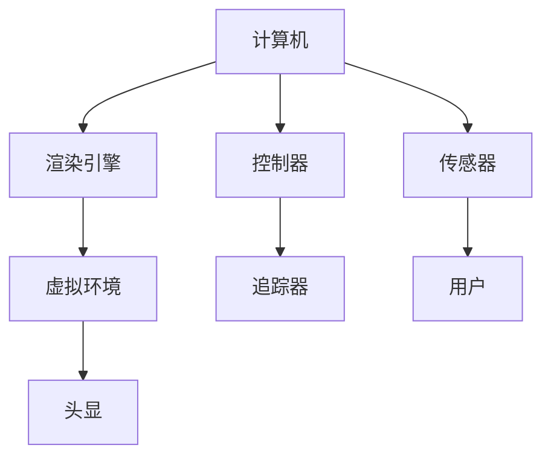

                 

# 虚拟现实（VR）技术：沉浸式体验设计

> 关键词：虚拟现实（VR）, 沉浸式体验, 核心技术, 用户体验优化, 应用场景

## 1. 背景介绍

### 1.1 问题由来

随着科技的发展，人类对于数字世界的体验需求越来越高。传统的文本、图片、视频等形式已经无法满足人们对感官体验的追求。特别是20世纪末21世纪初，互联网的普及和智能设备的兴起，使得虚拟现实（Virtual Reality, VR）技术应运而生。

VR技术利用计算机生成的虚拟场景，通过特定的头盔或头戴设备，将用户沉浸于三维的虚拟环境中。用户可以自由地“行走”、“交互”，感受身临其境的体验，从而突破了传统计算机图形学和数字媒体的局限。VR技术在娱乐、教育、训练、医疗、建筑等领域都有广泛应用。

### 1.2 问题核心关键点

当前，VR技术已经具备了硬件设施（如头显、手柄、追踪器等）和软件平台（如Unity、Unreal Engine等），但用户对VR体验的接受度和满意度仍然有限。主要原因包括：

- 设备舒适度和便携性问题
- 内容多样性和质量问题
- 交互方式自然性和真实性问题
- 内容更新和扩展问题

如何通过技术创新和优化设计，提升VR用户体验，实现沉浸式的互动体验，成为当前亟需解决的问题。

## 2. 核心概念与联系

### 2.1 核心概念概述

为更好地理解VR技术，本文将介绍几个关键概念：

- 虚拟现实（Virtual Reality, VR）：通过计算机生成并呈现实时3D环境，让用户以“沉浸”的方式与虚拟世界互动。VR技术可以应用于游戏、教育、培训、模拟等领域。

- 增强现实（Augmented Reality, AR）：在现实世界中叠加虚拟信息，提供交互式和沉浸式的用户体验。AR技术与VR技术有交集，都是将数字内容与现实世界结合的技术。

- 混合现实（Mixed Reality, MR）：结合VR和AR技术，在现实世界中混合虚拟信息。MR技术旨在实现更自然、真实的交互体验。

- 沉浸式体验（Immersive Experience）：通过视听、触觉等感官刺激，使用户完全沉浸于虚拟环境中，获得身临其境的体验。

- 用户体验（User Experience, UX）：用户在使用VR、AR、MR等技术时，对其交互方式、内容呈现、硬件适配等方面的综合感受。

- 可穿戴设备（Wearable Devices）：如头显、手柄、追踪器等，用于实现VR、AR、MR等技术。

这些概念之间的关系可以用以下Mermaid流程图表示：

```mermaid
graph TB
    A[虚拟现实(VR)] --> B[增强现实(AR)]
    A --> C[混合现实(MR)]
    C --> D[沉浸式体验]
    D --> E[用户体验(UX)]
    E --> F[可穿戴设备]
```

### 2.2 核心概念原理和架构的 Mermaid 流程图



该流程图展示了VR技术的核心架构：计算机生成渲染引擎生成的虚拟环境，通过头显和手柄等可穿戴设备呈现给用户，同时通过传感器实时感知用户交互。

## 3. 核心算法原理 & 具体操作步骤

### 3.1 算法原理概述

VR技术的核心在于渲染引擎对虚拟环境的生成和呈现。渲染引擎利用GPU（图形处理器）对三维场景进行渲染，生成真实感强的图像和视频，并通过头显、手柄等设备呈现给用户，使其产生沉浸式体验。

渲染引擎的渲染过程包括光照计算、阴影计算、纹理映射、光追等技术。通过实时渲染，渲染引擎能够快速生成高分辨率、高帧率的虚拟环境，满足用户对交互性和沉浸感的追求。

### 3.2 算法步骤详解

VR技术的实现流程一般包括以下几个步骤：

**Step 1: 设备初始化**
- 开启计算机渲染引擎和可穿戴设备（如头显、手柄等）。
- 检查设备状态和配置，如连接状态、分辨率、传感器精度等。
- 准备用户交互接口（如手柄手柄、追踪器等），等待用户操作。

**Step 2: 虚拟环境渲染**
- 生成3D场景，进行光照、阴影、纹理映射等计算。
- 使用光追技术增强图像的真实感，如路径追踪、环境光追踪等。
- 实时渲染生成的虚拟环境，并通过头显显示。

**Step 3: 用户交互感知**
- 使用传感器（如陀螺仪、加速度计等）感知用户动作。
- 根据传感器数据，控制虚拟环境的变化，如移动、旋转、缩放等。
- 通过手柄等设备实时反馈用户操作，增强沉浸感。

**Step 4: 环境适应和优化**
- 根据用户的行为和偏好，动态调整虚拟环境参数，如光照、纹理等。
- 对渲染引擎进行优化，如纹理压缩、LOD（Level of Detail）等，提升渲染效率。
- 实时监控用户反馈，持续改进虚拟环境的逼真度和交互性。

### 3.3 算法优缺点

VR技术具有以下优点：

- 沉浸式体验：通过生成逼真的虚拟环境，用户可以身临其境地与虚拟世界互动。
- 高交互性：实时渲染和传感器感知使得用户可以自然、流畅地与虚拟环境交互。
- 广泛应用：VR技术已经应用于游戏、教育、训练、医疗等领域。

同时，VR技术也存在一些局限性：

- 设备成本高：高性能头显、手柄等设备的成本较高，增加了用户的经济负担。
- 晕动症问题：长时间佩戴头显可能引发用户的晕眩和不适。
- 内容不足：高质量的VR内容相对稀缺，限制了用户体验。
- 交互方式：现有交互方式（如手柄手柄）的自然性和真实性仍有待提高。

### 3.4 算法应用领域

VR技术已经广泛应用于以下领域：

- **游戏娱乐**：如《Beat Saber》、《Half-Life: Alyx》等，提供沉浸式、互动性强的游戏体验。
- **医疗训练**：如虚拟手术室、康复训练等，提升医生的手术技能和病人的康复效果。
- **教育培训**：如虚拟课堂、虚拟实验室等，提供更丰富的教学方式和互动体验。
- **军事模拟**：如战术演练、战场模拟等，提高士兵的战斗技能和战术水平。
- **地产营销**：如虚拟看房、虚拟房产展示等，提供多角度、全方位的展示方式。
- **旅游体验**：如虚拟旅行、虚拟景点导览等，提升用户的旅游体验和互动感。

## 4. 数学模型和公式 & 详细讲解 & 举例说明

### 4.1 数学模型构建

为了更好地分析VR技术的渲染过程，本文将建立相关的数学模型。

设渲染引擎生成的虚拟环境为 $M$，包含三维场景 $S$ 和渲染参数 $P$。渲染引擎通过计算机图形学技术，根据用户交互数据 $I$ 和渲染参数 $P$，生成虚拟环境 $M$，并通过头显等设备呈现给用户 $H$。

因此，VR渲染过程可以表示为：

$$ M = F(S, P, I) $$
$$ H = R(M) $$

其中，$F$ 表示渲染引擎的渲染函数，$R$ 表示头显设备的呈现函数。

### 4.2 公式推导过程

以路径追踪算法为例，推导渲染引擎的光照计算过程。

设光源位置为 $L$，光线从光源 $L$ 发出，经过点 $P$，最终到达接收点 $R$。路径追踪算法的目标是计算光线路径上各点对接收点 $R$ 的贡献。

光线的路径可以表示为 $P_0P_1P_2\cdots P_n$，其中 $P_0=L$，$P_n=R$。路径上的每个点 $P_i$ 对接收点 $R$ 的光强贡献可以表示为：

$$ I_i = I_{L_i} \cdot I_{P_i} \cdot A_{P_i} $$

其中，$I_{L_i}$ 为光源 $L_i$ 在 $P_i$ 点的入射光强，$I_{P_i}$ 为 $P_i$ 点的反射光强，$A_{P_i}$ 为 $P_i$ 点的几何光学属性。

最终，光线路径上所有点对接收点 $R$ 的光强贡献可以表示为：

$$ I_R = \sum_{i=0}^n I_i $$

其中，$I_{L_i}$ 和 $I_{P_i}$ 可以通过计算光源到各点的距离、角度等参数得到。$A_{P_i}$ 则包括反射率、折射率等几何光学属性。

### 4.3 案例分析与讲解

以下以《Beat Saber》游戏为例，分析其渲染和交互过程。

《Beat Saber》是一款音乐节奏类游戏，通过头显和手柄实现沉浸式体验。游戏中，玩家需要通过挥动手柄，及时敲击不断出现的彩色方块，达到“电吉他”演奏的效果。

**渲染过程**：

1. 游戏场景由渲染引擎生成，包含真实感强的背景、角色、道具等。
2. 通过光照计算和阴影计算，增强场景的真实感，使用纹理映射和环境光追踪等技术提升图像质量。
3. 实时渲染生成的虚拟环境，并通过头显显示，实现沉浸式体验。

**交互过程**：

1. 游戏通过手柄追踪器感知玩家的动作。
2. 根据手柄的位置和角度，控制虚拟环境的变化，如光源的亮度、角度，方块的颜色、大小等。
3. 手柄手柄实时反馈玩家操作，增强互动性和沉浸感。

《Beat Saber》的成功之处在于其沉浸式体验和交互方式的自然性，让玩家沉浸于虚拟环境中，享受音乐节奏和游戏乐趣。

## 5. 项目实践：代码实例和详细解释说明

### 5.1 开发环境搭建

在进行VR项目开发前，需要先搭建好开发环境。以下是使用Unity3D和SteamVR平台进行VR项目开发的流程：

1. 安装Unity3D：从官网下载Unity3D安装程序，安装最新版本的Unity编辑器和SDK。
2. 安装SteamVR：从Steam官网下载SteamVR插件，并将其导入Unity3D编辑器中。
3. 配置VR设备：连接头显、手柄等VR设备，进行设备初始化。
4. 创建项目：在Unity3D编辑器中创建一个新的VR项目，设置渲染引擎和渲染分辨率。
5. 导入资产：导入3D模型、贴图、音频等资源，配置场景布局。

完成上述步骤后，即可在Unity3D编辑器中开始VR项目开发。

### 5.2 源代码详细实现

以下是使用Unity3D和SteamVR实现虚拟环境渲染的示例代码：

```csharp
using UnityEngine;
using UnityEngine.UI;
using UnityEngine.XR.Interaction.Toolkit;

public class VREnvironmentController : MonoBehaviour
{
    public GameObject[] groundObjects;
    public GameObject[] skyObjects;
    public GameObject[] objects;
    public GameObject[] shadows;

    void Start()
    {
        // 初始化地面
        foreach (GameObject obj in groundObjects)
        {
            obj.SetActive(false);
        }
        groundObjects[0].SetActive(true);
        
        // 初始化天空
        foreach (GameObject obj in skyObjects)
        {
            obj.SetActive(false);
        }
        skyObjects[0].SetActive(true);
        
        // 初始化物体
        foreach (GameObject obj in objects)
        {
            obj.SetActive(false);
        }
        objects[0].SetActive(true);
        
        // 初始化阴影
        foreach (GameObject obj in shadows)
        {
            obj.SetActive(false);
        }
        shadows[0].SetActive(true);
        
        // 渲染场景
        RenderScene();
    }
    
    void Update()
    {
        // 实时渲染
        RenderScene();
    }
    
    void RenderScene()
    {
        // 渲染地面
        foreach (GameObject obj in groundObjects)
        {
            obj.SetActive(true);
        }
        
        // 渲染天空
        foreach (GameObject obj in skyObjects)
        {
            obj.SetActive(true);
        }
        
        // 渲染物体
        foreach (GameObject obj in objects)
        {
            obj.SetActive(true);
        }
        
        // 渲染阴影
        foreach (GameObject obj in shadows)
        {
            obj.SetActive(true);
        }
        
        // 根据用户交互数据渲染
        VRPlayer player = FindObjectOfType<VRPlayer>();
        if (player != null)
        {
            Vector3 position = player.GetControllerPosition();
            float angle = player.GetControllerAngle();
            // 根据用户位置和角度渲染虚拟环境
            // ...
        }
    }
}
```

### 5.3 代码解读与分析

以上代码展示了在Unity3D编辑器中使用SteamVR进行虚拟环境渲染的过程。

**VRPlayer类**：

1. 初始化地面、天空、物体和阴影等对象。
2. 根据用户交互数据实时渲染虚拟环境。

**Update方法**：

1. 实时渲染场景。
2. 根据用户交互数据调整虚拟环境参数。

**RenderScene方法**：

1. 根据用户位置和角度渲染虚拟环境。

这些代码实现了基本的虚拟环境渲染和用户交互感知，是Unity3D中VR项目开发的常见方式。

### 5.4 运行结果展示

运行上述代码，即可在Unity3D编辑器中看到虚拟环境的渲染效果。用户可以通过手柄手柄等设备实时感知和控制虚拟环境，体验沉浸式交互。

## 6. 实际应用场景

### 6.1 游戏娱乐

《Beat Saber》的渲染和交互过程展示了VR技术在游戏娱乐中的应用。通过沉浸式的体验和自然的交互方式，VR游戏为玩家提供更加真实、有趣的互动体验。未来，随着技术的进步和设备的普及，VR游戏将进一步丰富游戏场景和交互方式，提升用户的体验感。

### 6.2 医疗培训

在医疗培训中，VR技术可以用于虚拟手术室、康复训练等场景。通过模拟真实手术环境，医生可以反复练习手术技能，提升操作水平。患者可以通过虚拟康复训练，更快地恢复健康。

### 6.3 教育培训

在教育培训中，VR技术可以用于虚拟课堂、虚拟实验室等场景。通过沉浸式的学习方式，学生可以更好地理解和掌握知识。VR技术还可以应用于科学研究和工程设计等高精度应用中，提升科研和设计效率。

### 6.4 军事模拟

在军事模拟中，VR技术可以用于战术演练、战场模拟等场景。通过模拟真实战场环境，士兵可以更好地理解和掌握战术技能，提升实战能力。

### 6.5 地产营销

在地产营销中，VR技术可以用于虚拟看房、虚拟房产展示等场景。通过沉浸式的展示方式，客户可以更好地了解房产的外观和内部结构，提升购买决策。

### 6.6 旅游体验

在旅游体验中，VR技术可以用于虚拟旅行、虚拟景点导览等场景。通过沉浸式的旅游方式，游客可以更好地体验景点景观和文化，提升旅游体验。

## 7. 工具和资源推荐

### 7.1 学习资源推荐

为了帮助开发者系统掌握VR技术，这里推荐一些优质的学习资源：

1. Unity3D官方文档：Unity3D官网提供的官方文档，详细介绍了Unity3D的渲染引擎、渲染参数、用户交互等技术。

2. SteamVR官方文档：SteamVR官网提供的官方文档，详细介绍了SteamVR平台的API和开发指南。

3. Oculus官方文档：Oculus官网提供的官方文档，详细介绍了Oculus头显设备的开发和优化技术。

4. VR开发者社区：如VRChat、Unity3D开发者社区，提供大量的VR项目开发经验和案例分享。

5. VR课程：如Udacity、Coursera等平台的VR课程，提供系统的VR技术学习和实践机会。

通过对这些资源的学习实践，相信你一定能够快速掌握VR技术的精髓，并用于解决实际的VR问题。

### 7.2 开发工具推荐

高效的开发离不开优秀的工具支持。以下是几款用于VR项目开发的常用工具：

1. Unity3D：基于组件化的游戏引擎，提供丰富的3D渲染和用户交互工具，适合制作高质量的VR项目。

2. Unreal Engine：由Epic Games开发的3D渲染引擎，支持实时渲染和动态场景变换，适合制作复杂的VR项目。

3. Oculus Rift和HTC Vive：Oculus和HTC推出的主流头显设备，提供高质量的沉浸式体验。

4. Oculus SDK和HTC Vive SDK：提供设备驱动和API，方便开发者进行VR项目开发和优化。

5. Unity VR Tools：Unity3D提供的VR插件，提供设备适配、用户交互等功能，方便开发者进行VR项目开发。

6. SteamVR：Steam平台提供的VR平台，支持多款VR设备和应用程序，提供便捷的开发和部署环境。

合理利用这些工具，可以显著提升VR项目开发的效率，加快创新迭代的步伐。

### 7.3 相关论文推荐

VR技术的发展离不开学界的持续研究。以下是几篇奠基性的相关论文，推荐阅读：

1. "Virtual Reality: A Review" by Anantha Vivekanandan, et al.：综述了VR技术的发展历程和应用场景，探讨了未来趋势。

2. "A Survey on Architectures and Applications of Virtual Reality" by M. Pfeuffer, et al.：介绍了VR技术的架构和应用，提供了丰富的技术参考。

3. "Real-time Interactive Training in Virtual Reality" by L. Zhang, et al.：介绍了VR技术在医疗培训中的应用，展示了技术成果。

4. "Virtual Reality in Education: A Review" by B. Zhu, et al.：综述了VR技术在教育培训中的应用，提供了丰富的教学案例。

5. "Virtual Reality in Architecture: A Review" by N. Kassab, et al.：综述了VR技术在建筑设计和模拟中的应用，展示了技术成果。

这些论文代表了大VR技术的发展脉络。通过学习这些前沿成果，可以帮助研究者把握学科前进方向，激发更多的创新灵感。

## 8. 总结：未来发展趋势与挑战

### 8.1 总结

本文对VR技术进行了全面系统的介绍。首先阐述了VR技术的背景和重要性，明确了VR技术在渲染引擎、用户交互等方面的核心原理。其次，从原理到实践，详细讲解了VR技术的数学模型和代码实现。同时，本文还探讨了VR技术在多个领域的应用场景，展示了其广阔的发展前景。

通过本文的系统梳理，可以看到，VR技术已经成为现代科技的重要组成部分，以其沉浸式、高交互性的特点，广泛应用于游戏娱乐、医疗培训、教育培训、军事模拟等多个领域。VR技术的发展离不开硬件设备的不断进步和软件平台的优化，也需要更多的跨学科协作和技术创新。

### 8.2 未来发展趋势

展望未来，VR技术将呈现以下几个发展趋势：

1. **硬件设备**：高性能、低成本的头显和手柄等设备将不断涌现，提升用户体验。

2. **渲染引擎**：实时渲染和动态场景变换技术将进一步发展，提升图像质量。

3. **用户交互**：自然、流畅的用户交互方式将不断创新，提升沉浸感。

4. **应用场景**：VR技术将应用于更多领域，如旅游、地产、工业等，带来新的商业模式和业务机会。

5. **跨平台协同**：VR技术将与AR、MR等技术融合，实现多平台协同互动。

6. **教育普及**：VR技术将进入更多的教育领域，提升教学效果。

7. **医疗应用**：VR技术将应用于更多的医疗场景，提升医疗水平。

这些趋势凸显了VR技术的广阔前景，未来将有更多的创新应用和突破。

### 8.3 面临的挑战

尽管VR技术已经取得显著进展，但在迈向更加智能化、普适化应用的过程中，仍面临诸多挑战：

1. **设备成本高**：高性能头显和手柄等设备的成本较高，增加了用户的经济负担。

2. **晕动症问题**：长时间佩戴头显可能引发用户的晕眩和不适。

3. **内容不足**：高质量的VR内容相对稀缺，限制了用户体验。

4. **交互方式**：现有交互方式（如手柄手柄）的自然性和真实性仍有待提高。

5. **技术普及**：VR技术尚未普及，设备和技术的应用范围有限。

6. **安全性问题**：VR设备的使用安全性仍有待提高，防止用户发生意外。

7. **技术兼容性**：VR设备与现有技术的兼容性问题仍需解决，实现更广泛的适用性。

这些挑战将是大规模普及VR技术的重要障碍，需要通过技术创新和产业协同解决。

### 8.4 研究展望

面对VR技术面临的挑战，未来的研究需要在以下几个方面寻求新的突破：

1. **低成本设备**：开发高性能、低成本的头显和手柄等设备，降低用户成本，提升普及率。

2. **交互方式优化**：开发更加自然、流畅的交互方式，提升用户体验。

3. **内容创作**：鼓励和支持高质量的VR内容创作，提供丰富的体验选择。

4. **技术优化**：优化渲染引擎和用户交互算法，提升渲染质量和交互体验。

5. **跨平台协同**：推动VR技术与AR、MR等技术的融合，实现多平台协同互动。

6. **安全性保障**：提高VR设备的安全性，防止用户发生意外。

7. **技术普及**：推动VR技术的普及和应用，提升技术的普适性和普及率。

通过这些研究方向的探索发展，将使VR技术在更多的领域得到应用，提升人类的生产生活方式，推动社会进步。

## 9. 附录：常见问题与解答

**Q1：VR技术的渲染过程是怎样的？**

A: VR技术的渲染过程包括光照计算、阴影计算、纹理映射、光追等技术。通过实时渲染，渲染引擎能够快速生成高分辨率、高帧率的虚拟环境，满足用户对交互性和沉浸感的追求。

**Q2：VR技术的渲染过程是否需要大量的计算资源？**

A: 渲染过程需要较高的计算资源，尤其是光照和阴影计算、光追等技术。但是通过优化渲染引擎和硬件设备，可以显著提升渲染效率。

**Q3：如何提高VR设备的便携性和舒适度？**

A: 开发轻量级、低功耗的头显和手柄等设备，如无线连接、电池优化等，提升设备的便携性和舒适度。同时，优化用户交互算法，如智能手势识别、体感交互等，提升自然性和真实性。

**Q4：如何提高VR内容的丰富性和多样性？**

A: 鼓励和支持高质量的VR内容创作，如虚拟旅游、虚拟房产展示、虚拟手术室等。同时，开发更加多样化的内容形式，如360度视频、虚拟现实游戏等。

**Q5：如何提升VR技术的普及率和应用范围？**

A: 降低设备成本，提升设备性能，提供丰富的内容选择，优化用户交互算法，提升设备的便携性和舒适度。同时，推动政府和企业支持，开展VR技术普及和应用。

这些问题的解答展示了VR技术在多个方面的应用和优化方向，将有助于提升VR技术的普及率和应用范围。

---

作者：禅与计算机程序设计艺术 / Zen and the Art of Computer Programming

