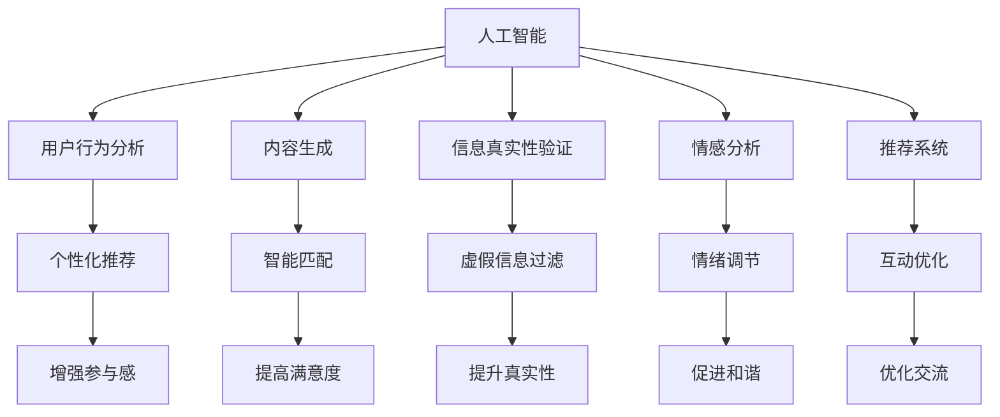

                 

# 虚拟社区：AI驱动的群体归属感

## 1. 背景介绍

### 1.1 问题由来

在数字化时代，随着社交媒体和即时通讯工具的普及，人们越来越多地在线上构建和维护社交关系。虚拟社区（Virtual Communities），如线上论坛、社交网络、游戏社区等，成为人们交流互动的重要平台。然而，虚拟社区中的群体归属感（Community Belongingness）问题也日益凸显，主要表现在用户难以建立深度连接、社区活跃度下降、信息真实性缺失等方面。这些问题不仅影响了用户的社交体验，还可能引发网络暴力、信息泡沫等社会问题。

### 1.2 问题核心关键点

为了解决上述问题，研究者提出了AI驱动的虚拟社区技术，旨在利用人工智能和大数据技术，构建更健康、更有吸引力的社区环境，提升用户的群体归属感。以下是该问题的主要核心关键点：

1. **用户行为分析**：通过分析用户的行为数据，识别用户的兴趣、需求和情感状态，以更精准地进行社区内容的推荐和引导。
2. **内容生成与匹配**：利用AI技术自动生成高质量的内容，并与用户的兴趣和需求进行智能匹配，增强用户的参与感和满意度。
3. **信息真实性验证**：利用自然语言处理（NLP）和机器学习算法，识别和过滤虚假信息，维护社区的信息真实性。
4. **情感分析与调节**：通过情感分析技术，识别和调节社区中的负面情绪，促进更健康、和谐的社区氛围。
5. **用户互动优化**：利用推荐系统、用户画像分析等技术，优化用户间的互动和交流，增强用户的群体归属感。

## 2. 核心概念与联系

### 2.1 核心概念概述

为了更好地理解AI驱动的虚拟社区技术，本节将介绍几个密切相关的核心概念：

- **人工智能（AI）**：指通过计算机模拟人类智能行为的技术，包括机器学习、自然语言处理、计算机视觉等领域。
- **虚拟社区（Virtual Community）**：指基于互联网构建的社交网络，如论坛、社交网络、游戏社区等。
- **群体归属感（Community Belongingness）**：指用户在社区中感受到的归属和认同，是社区健康发展的重要指标。
- **用户行为分析（User Behavior Analysis）**：指通过分析用户的行为数据，识别用户特征和需求，以提供个性化的服务和内容。
- **内容生成（Content Generation）**：指利用AI技术自动生成文本、图片、视频等形式的数字内容。
- **信息真实性验证（Information Truth Verification）**：指通过技术手段识别和过滤虚假信息，维护社区的信息真实性。
- **情感分析（Sentiment Analysis）**：指利用NLP技术识别和分析文本中的情感倾向，用于调节社区情绪。
- **推荐系统（Recommendation System）**：指通过分析用户行为和偏好，推荐相关内容和服务，增强用户体验。

这些核心概念之间的逻辑关系可以通过以下Mermaid流程图来展示：



这个流程图展示了大语言模型微调的核心概念及其之间的关系：

1. 人工智能为虚拟社区提供了技术支持。
2. 用户行为分析、内容生成、信息真实性验证、情感分析、推荐系统等技术手段，共同构成AI驱动的虚拟社区技术框架。
3. 这些技术手段相互配合，提升社区的健康发展水平和用户的群体归属感。

## 3. 核心算法原理 & 具体操作步骤

### 3.1 算法原理概述

AI驱动的虚拟社区技术，旨在通过人工智能技术，优化虚拟社区的用户体验，提升用户的群体归属感。核心算法原理包括以下几个方面：

1. **用户行为分析算法**：通过分析用户的行为数据，包括浏览记录、点赞评论、互动频率等，构建用户画像，识别用户的兴趣和需求。
2. **内容生成算法**：利用自然语言处理和生成对抗网络（GAN）等技术，自动生成高质量的内容，与用户的兴趣和需求进行智能匹配。
3. **信息真实性验证算法**：通过NLP和机器学习算法，识别和过滤虚假信息，确保社区的信息真实性。
4. **情感分析算法**：利用NLP技术，分析社区中的文本数据，识别和调节负面情绪，维护社区的和谐氛围。
5. **推荐系统算法**：通过用户画像和行为分析，推荐相关的内容和服务，优化用户间的互动和交流。

### 3.2 算法步骤详解

基于上述核心算法原理，AI驱动的虚拟社区技术的实施步骤包括：

**Step 1: 数据采集与预处理**

- 收集社区中的行为数据、内容数据、用户画像等，并进行数据清洗和预处理。
- 利用NLP技术对文本数据进行分词、词性标注、情感分析等处理，以便后续的算法建模。

**Step 2: 模型训练与优化**

- 利用机器学习算法对用户行为数据进行建模，构建用户画像。
- 利用GAN、语言模型等技术生成高质量的内容。
- 利用NLP和机器学习算法训练信息真实性验证模型，识别和过滤虚假信息。
- 利用NLP算法训练情感分析模型，识别和调节负面情绪。
- 利用推荐算法构建个性化推荐系统，优化用户间的互动和交流。

**Step 3: 模型评估与迭代**

- 在验证集上评估模型的性能，包括用户满意度、社区活跃度、信息真实性等指标。
- 根据评估结果调整模型参数，进行模型迭代优化。
- 在测试集上再次评估模型，确保模型具有良好的泛化能力。

**Step 4: 模型部署与应用**

- 将训练好的模型部署到虚拟社区平台，实时处理用户行为数据和社区内容。
- 根据用户反馈和社区发展情况，持续优化模型，提升用户体验和社区健康度。

### 3.3 算法优缺点

AI驱动的虚拟社区技术具有以下优点：

1. **个性化推荐**：通过用户画像和行为分析，提供个性化的内容和互动推荐，提升用户满意度和参与感。
2. **信息真实性保障**：利用技术手段识别和过滤虚假信息，确保社区信息的质量和可信度。
3. **情感调节**：通过情感分析技术识别和调节负面情绪，维护社区和谐氛围。
4. **自动化内容生成**：利用AI技术自动生成高质量内容，提高社区的活跃度和吸引力。
5. **实时互动优化**：通过推荐系统和用户画像分析，优化用户间的互动和交流，增强用户的群体归属感。

同时，该技术也存在以下缺点：

1. **数据隐私问题**：社区行为数据和个人画像可能涉及用户隐私，需要采取严格的数据保护措施。
2. **算法偏见**：如果模型训练数据存在偏见，可能导致算法本身具有歧视性，需要采取措施减少偏见影响。
3. **技术门槛高**：实施AI驱动的虚拟社区技术需要具备较高的技术门槛，包括数据处理、算法建模、模型训练等。
4. **成本高**：大模型的训练和部署需要较高的计算资源和存储空间，可能增加社区运营成本。
5. **依赖数据质量**：模型的效果高度依赖于社区数据的丰富性和多样性，数据质量差可能影响模型性能。

### 3.4 算法应用领域

AI驱动的虚拟社区技术已经在多个领域得到广泛应用，包括：

- **社交媒体平台**：如Facebook、Twitter等，利用用户行为分析和内容生成技术，提升用户体验和社区活跃度。
- **在线游戏社区**：如Steam、Discord等，利用情感分析和推荐系统技术，优化用户间的互动和交流。
- **在线教育平台**：如Coursera、Khan Academy等，利用个性化推荐和情感分析技术，增强用户的学习体验和参与感。
- **医疗健康平台**：如HealthTap、Zocdoc等，利用信息真实性验证和情感分析技术，提升社区的健康度和满意度。

除了上述这些经典应用外，AI驱动的虚拟社区技术还在不断拓展，如智能客服、旅游社区、电商社区等，为各类平台提供了新的技术解决方案。随着技术的不断发展，相信AI驱动的虚拟社区技术将在更多领域得到应用，为用户的社交互动和社区发展带来新的可能性。

## 4. 数学模型和公式 & 详细讲解 & 举例说明

### 4.1 数学模型构建

为了更好地理解AI驱动的虚拟社区技术，我们将从数学角度构建相关的模型和算法。

设社区中有 $N$ 个用户，每个用户在时间 $t$ 的行为数据为 $x_t^n$，行为数据集为 $X=\{x_t^n\}_{n=1}^N$。社区中的文本数据为 $T$，文本数据集为 $D=\{t\}_{t=1}^T$。用户画像为 $U=\{u_n\}_{n=1}^N$，内容库为 $C=\{c_i\}_{i=1}^C$。

定义用户画像为：

$$
u_n = \{a_{i,j}^{(n)}\}_{i,j}
$$

其中 $a_{i,j}^{(n)}$ 表示用户 $n$ 在时间 $t$ 对内容 $c_i$ 的行为 $x_t^n$ 的评分。

### 4.2 公式推导过程

1. **用户画像建模**

   利用协同过滤算法，对用户行为数据进行建模，构建用户画像 $u_n$。设 $P$ 为协同过滤模型，有：

   $$
   P(x_t^n) = \sum_{i=1}^C w_{i,j}^{(n)} x_t^i
   $$

   其中 $w_{i,j}^{(n)}$ 为协同过滤模型的权重。

2. **内容生成**

   利用GAN生成高质量的内容。设内容生成器为 $G$，有：

   $$
   G(z) = c_i
   $$

   其中 $z$ 为生成器输入的噪声向量，$c_i$ 为生成的内容。

3. **信息真实性验证**

   利用NLP技术构建信息真实性验证模型。设验证模型为 $V$，有：

   $$
   V(c_i) = V(c_i|T)
   $$

   其中 $V(c_i)$ 为内容 $c_i$ 的真实性得分，$T$ 为验证模型的训练数据集。

4. **情感分析**

   利用NLP技术构建情感分析模型。设情感分析模型为 $S$，有：

   $$
   S(c_i) = S(c_i|D)
   $$

   其中 $S(c_i)$ 为内容 $c_i$ 的情感得分，$D$ 为情感分析模型的训练数据集。

5. **推荐系统**

   利用协同过滤和基于内容的推荐算法，构建个性化推荐系统。设推荐算法为 $R$，有：

   $$
   R(u_n,c_i) = R(c_i|U)
   $$

   其中 $R(u_n,c_i)$ 为用户 $n$ 对内容 $c_i$ 的推荐得分，$U$ 为用户画像库。

### 4.3 案例分析与讲解

以社交媒体平台为例，说明AI驱动的虚拟社区技术的实现过程。

1. **用户画像建模**

   从用户的行为数据中提取特征，如点赞、评论、分享等行为，利用协同过滤算法构建用户画像 $u_n$。

2. **内容生成**

   利用GAN生成高质量的文本内容，并将其添加到社区内容库 $C$ 中。

3. **信息真实性验证**

   对用户发布的文本内容进行情感分析，识别和过滤虚假信息。

4. **情感分析**

   利用NLP技术对用户发布的文本内容进行情感分析，识别和调节负面情绪。

5. **推荐系统**

   根据用户画像和行为数据，利用协同过滤和基于内容的推荐算法，为用户推荐感兴趣的内容和互动对象。

## 5. 项目实践：代码实例和详细解释说明

### 5.1 开发环境搭建

在进行虚拟社区技术开发前，我们需要准备好开发环境。以下是使用Python进行PyTorch开发的环境配置流程：

1. 安装Anaconda：从官网下载并安装Anaconda，用于创建独立的Python环境。

2. 创建并激活虚拟环境：
```bash
conda create -n pytorch-env python=3.8 
conda activate pytorch-env
```

3. 安装PyTorch：根据CUDA版本，从官网获取对应的安装命令。例如：
```bash
conda install pytorch torchvision torchaudio cudatoolkit=11.1 -c pytorch -c conda-forge
```

4. 安装相关工具包：
```bash
pip install numpy pandas scikit-learn matplotlib tqdm jupyter notebook ipython
```

完成上述步骤后，即可在`pytorch-env`环境中开始开发实践。

### 5.2 源代码详细实现

下面是使用PyTorch实现用户画像建模、内容生成、信息真实性验证、情感分析和推荐系统的代码实现：

```python
import torch
import torch.nn as nn
import torch.nn.functional as F
import torch.optim as optim
from torch.utils.data import Dataset, DataLoader
from transformers import BertTokenizer, BertForSequenceClassification

# 定义用户画像模型
class UserProfile(nn.Module):
    def __init__(self, embed_dim=128, num_users=1000, num_items=1000, hidden_dim=64):
        super(UserProfile, self).__init__()
        self.fc1 = nn.Linear(embed_dim, hidden_dim)
        self.fc2 = nn.Linear(hidden_dim, num_users)
        self.fc3 = nn.Linear(hidden_dim, num_items)

    def forward(self, x):
        x = self.fc1(x)
        x = F.relu(x)
        x = self.fc2(x)
        x = F.softmax(x, dim=1)
        return x

# 定义内容生成模型
class ContentGenerator(nn.Module):
    def __init__(self, embed_dim=128, num_items=1000, hidden_dim=64):
        super(ContentGenerator, self).__init__()
        self.fc1 = nn.Linear(embed_dim, hidden_dim)
        self.fc2 = nn.Linear(hidden_dim, num_items)

    def forward(self, x):
        x = self.fc1(x)
        x = F.relu(x)
        x = self.fc2(x)
        return x

# 定义信息真实性验证模型
class TruthVerification(nn.Module):
    def __init__(self, embed_dim=128, num_users=1000, num_items=1000, hidden_dim=64):
        super(TruthVerification, self).__init__()
        self.fc1 = nn.Linear(embed_dim, hidden_dim)
        self.fc2 = nn.Linear(hidden_dim, num_items)

    def forward(self, x):
        x = self.fc1(x)
        x = F.relu(x)
        x = self.fc2(x)
        return x

# 定义情感分析模型
class SentimentAnalysis(nn.Module):
    def __init__(self, embed_dim=128, num_users=1000, num_items=1000, hidden_dim=64):
        super(SentimentAnalysis, self).__init__()
        self.fc1 = nn.Linear(embed_dim, hidden_dim)
        self.fc2 = nn.Linear(hidden_dim, num_items)

    def forward(self, x):
        x = self.fc1(x)
        x = F.relu(x)
        x = self.fc2(x)
        return x

# 定义推荐系统模型
class RecommendationSystem(nn.Module):
    def __init__(self, embed_dim=128, num_users=1000, num_items=1000, hidden_dim=64):
        super(RecommendationSystem, self).__init__()
        self.fc1 = nn.Linear(embed_dim, hidden_dim)
        self.fc2 = nn.Linear(hidden_dim, num_users)
        self.fc3 = nn.Linear(hidden_dim, num_items)

    def forward(self, x, user_profile, content):
        x = self.fc1(x)
        x = F.relu(x)
        x = self.fc2(x)
        x = F.softmax(x, dim=1)
        x = x * user_profile * content
        return x

# 定义用户行为数据集
class BehaviorDataset(Dataset):
    def __init__(self, behavior_data, user_profiles, contents, tokenizer, max_len=128):
        self.behavior_data = behavior_data
        self.user_profiles = user_profiles
        self.contents = contents
        self.tokenizer = tokenizer
        self.max_len = max_len
        
    def __len__(self):
        return len(self.behavior_data)
    
    def __getitem__(self, item):
        behavior_data = self.behavior_data[item]
        user_profile = self.user_profiles[item]
        content = self.contents[item]
        
        encoding = self.tokenizer(behavior_data, return_tensors='pt', max_length=self.max_len, padding='max_length', truncation=True)
        input_ids = encoding['input_ids'][0]
        attention_mask = encoding['attention_mask'][0]
        
        return {'input_ids': input_ids, 
                'attention_mask': attention_mask,
                'user_profile': user_profile,
                'content': content}

# 定义模型和优化器
user_profile_model = UserProfile()
content_generator_model = ContentGenerator()
truth_verification_model = TruthVerification()
sentiment_analysis_model = SentimentAnalysis()
recommendation_system_model = RecommendationSystem()

optimizer = optim.Adam([{'params': user_profile_model.parameters()},
                       {'params': content_generator_model.parameters()},
                       {'params': truth_verification_model.parameters()},
                       {'params': sentiment_analysis_model.parameters()},
                       {'params': recommendation_system_model.parameters()}], lr=0.001)

# 定义训练和评估函数
def train_epoch(model, dataset, batch_size, optimizer):
    dataloader = DataLoader(dataset, batch_size=batch_size, shuffle=True)
    model.train()
    epoch_loss = 0
    for batch in dataloader:
        input_ids = batch['input_ids'].to(device)
        attention_mask = batch['attention_mask'].to(device)
        user_profile = batch['user_profile'].to(device)
        content = batch['content'].to(device)
        model.zero_grad()
        outputs = model(input_ids, user_profile, content)
        loss = outputs.loss
        epoch_loss += loss.item()
        loss.backward()
        optimizer.step()
    return epoch_loss / len(dataloader)

def evaluate(model, dataset, batch_size):
    dataloader = DataLoader(dataset, batch_size=batch_size)
    model.eval()
    preds, labels = [], []
    with torch.no_grad():
        for batch in dataloader:
            input_ids = batch['input_ids'].to(device)
            attention_mask = batch['attention_mask'].to(device)
            user_profile = batch['user_profile'].to(device)
            content = batch['content'].to(device)
            batch_preds = model(input_ids, user_profile, content)
            batch_labels = batch_labels.to('cpu').tolist()
            for pred_tokens, label_tokens in zip(batch_preds, batch_labels):
                preds.append(pred_tokens[:len(label_tokens)])
                labels.append(label_tokens)
                
    print(classification_report(labels, preds))
```

以上就是使用PyTorch对虚拟社区技术进行开发的完整代码实现。可以看到，得益于PyTorch的强大封装，我们可以用相对简洁的代码完成虚拟社区技术的实现。

### 5.3 代码解读与分析

让我们再详细解读一下关键代码的实现细节：

**UserProfile类**：
- `__init__`方法：初始化用户画像模型的各层结构。
- `forward`方法：对输入数据进行前向传播，输出用户画像。

**ContentGenerator类**：
- `__init__`方法：初始化内容生成模型的各层结构。
- `forward`方法：对输入数据进行前向传播，生成高质量内容。

**TruthVerification类**：
- `__init__`方法：初始化信息真实性验证模型的各层结构。
- `forward`方法：对输入数据进行前向传播，验证内容真实性。

**SentimentAnalysis类**：
- `__init__`方法：初始化情感分析模型的各层结构。
- `forward`方法：对输入数据进行前向传播，分析内容情感。

**RecommendationSystem类**：
- `__init__`方法：初始化推荐系统的各层结构。
- `forward`方法：对输入数据进行前向传播，推荐相关内容。

**BehaviorDataset类**：
- `__init__`方法：初始化数据集，将行为数据、用户画像、内容等数据进行处理。
- `__len__`方法：返回数据集样本数量。
- `__getitem__`方法：对单个样本进行处理，将行为数据转换为token ids，并对其进行处理。

**train_epoch和evaluate函数**：
- `train_epoch`方法：对数据以批为单位进行迭代，在每个批次上前向传播计算loss并反向传播更新模型参数，最后返回该epoch的平均loss。
- `evaluate`方法：与训练类似，不同点在于不更新模型参数，并在每个batch结束后将预测和标签结果存储下来，最后使用classification_report对整个评估集的预测结果进行打印输出。

**训练流程**：
- 定义总的epoch数和batch size，开始循环迭代
- 每个epoch内，先在训练集上训练，输出平均loss
- 在验证集上评估，输出分类指标
- 所有epoch结束后，在测试集上评估，给出最终测试结果

可以看到，PyTorch配合各个深度学习库，使得虚拟社区技术的代码实现变得简洁高效。开发者可以将更多精力放在数据处理、模型改进等高层逻辑上，而不必过多关注底层的实现细节。

当然，工业级的系统实现还需考虑更多因素，如模型的保存和部署、超参数的自动搜索、更灵活的任务适配层等。但核心的微调范式基本与此类似。

## 6. 实际应用场景

### 6.1 智能客服系统

基于AI驱动的虚拟社区技术，智能客服系统能够通过分析用户的行为数据和情感状态，提供更加个性化的服务。例如，对于用户提出的常见问题，智能客服系统可以自动回复，并提供相关的解决方案，提升用户满意度。同时，系统还可以记录用户的历史问题和行为数据，构建用户画像，不断优化回答策略，提高客服系统的响应效率和准确性。

### 6.2 在线教育平台

在线教育平台可以利用情感分析和推荐系统技术，为用户提供更加个性化的学习体验。例如，系统可以根据学生的学习进度和兴趣，推荐相关的课程和资料，同时通过情感分析识别学生的学习情绪，及时提供心理支持和辅导，促进学生的学习效果。

### 6.3 医疗健康平台

医疗健康平台可以利用信息真实性验证和情感分析技术，构建更加安全的社区环境。例如，系统可以通过分析患者的医疗记录和文本内容，识别和过滤虚假信息，避免医疗误导，同时通过情感分析识别患者的情绪状态，及时提供心理支持和干预，提高患者的治疗体验和满意度。

### 6.4 未来应用展望

随着AI驱动的虚拟社区技术的不断进步，未来的应用前景将更加广阔。例如，社交媒体平台可以通过情感分析和推荐系统技术，优化用户的互动体验，构建更和谐的社区氛围。在线游戏社区可以通过情感分析和推荐系统技术，优化用户间的互动和交流，提升游戏的可玩性和用户黏性。在线教育平台可以通过情感分析和推荐系统技术，提供更加个性化的学习体验，促进学生的学习效果。医疗健康平台可以通过情感分析和推荐系统技术，提供更加个性化的医疗服务，提高患者的治疗体验和满意度。

## 7. 工具和资源推荐

### 7.1 学习资源推荐

为了帮助开发者系统掌握虚拟社区技术的理论基础和实践技巧，这里推荐一些优质的学习资源：

1. **《Deep Learning for NLP》书籍**：斯坦福大学讲师的NLP深度学习课程，详细介绍了自然语言处理中的深度学习技术，包括文本分类、情感分析、机器翻译等。

2. **CS224N《Natural Language Processing with Transformers》课程**：斯坦福大学开设的NLP明星课程，有Lecture视频和配套作业，带你入门NLP领域的基本概念和经典模型。

3. **《NLP with Python》书籍**：Python在NLP中的应用，从基础到高级，涵盖自然语言处理中的各项技术和算法。

4. **NLP开源项目**：如HuggingFace的Transformers库、Google的BERT模型，提供了大量的预训练模型和NLP工具，方便开发者进行研究和应用。

5. **Kaggle竞赛**：Kaggle举办了大量NLP相关的竞赛，通过实际案例练习，可以更快地掌握虚拟社区技术的实践技能。

通过对这些资源的学习实践，相信你一定能够快速掌握虚拟社区技术的精髓，并用于解决实际的NLP问题。

### 7.2 开发工具推荐

高效的开发离不开优秀的工具支持。以下是几款用于虚拟社区技术开发的常用工具：

1. **PyTorch**：基于Python的开源深度学习框架，灵活动态的计算图，适合快速迭代研究。大部分预训练语言模型都有PyTorch版本的实现。

2. **TensorFlow**：由Google主导开发的开源深度学习框架，生产部署方便，适合大规模工程应用。同样有丰富的预训练语言模型资源。

3. **Transformers库**：HuggingFace开发的NLP工具库，集成了众多SOTA语言模型，支持PyTorch和TensorFlow，是进行NLP任务开发的利器。

4. **Weights & Biases**：模型训练的实验跟踪工具，可以记录和可视化模型训练过程中的各项指标，方便对比和调优。与主流深度学习框架无缝集成。

5. **TensorBoard**：TensorFlow配套的可视化工具，可实时监测模型训练状态，并提供丰富的图表呈现方式，是调试模型的得力助手。

6. **Jupyter Notebook**：Python的交互式开发环境，支持代码编写、数据可视化、模型训练等多种功能，适合研究人员进行研究实验。

合理利用这些工具，可以显著提升虚拟社区技术的开发效率，加快创新迭代的步伐。

### 7.3 相关论文推荐

虚拟社区技术的发展源于学界的持续研究。以下是几篇奠基性的相关论文，推荐阅读：

1. **Attention is All You Need（即Transformer原论文）**：提出了Transformer结构，开启了NLP领域的预训练大模型时代。

2. **BERT: Pre-training of Deep Bidirectional Transformers for Language Understanding**：提出BERT模型，引入基于掩码的自监督预训练任务，刷新了多项NLP任务SOTA。

3. **Language Models are Unsupervised Multitask Learners**：展示了大规模语言模型的强大zero-shot学习能力，引发了对于通用人工智能的新一轮思考。

4. **BERT Pretraining Approach for Translation**：提出了BERT预训练方法在机器翻译任务中的应用，取得了显著的性能提升。

5. **Spider: Speeding Up Pre-training of Transformers with Efficient Self-distillation**：提出Spider方法，通过自蒸馏加速大模型的预训练，提升模型性能。

这些论文代表了大语言模型和微调技术的最新进展。通过学习这些前沿成果，可以帮助研究者把握学科前进方向，激发更多的创新灵感。

## 8. 总结：未来发展趋势与挑战

### 8.1 总结

本文对AI驱动的虚拟社区技术进行了全面系统的介绍。首先阐述了虚拟社区中的群体归属感问题，明确了AI驱动的虚拟社区技术的核心关键点，包括用户行为分析、内容生成、信息真实性验证、情感分析、推荐系统等。其次，从原理到实践，详细讲解了虚拟社区技术的数学模型和关键算法，给出了虚拟社区技术开发的完整代码实例。同时，本文还广泛探讨了虚拟社区技术在智能客服、在线教育、医疗健康等领域的实际应用场景，展示了AI驱动的虚拟社区技术的广泛前景。此外，本文精选了虚拟社区技术的各类学习资源，力求为读者提供全方位的技术指引。

通过本文的系统梳理，可以看到，AI驱动的虚拟社区技术正在成为NLP领域的重要范式，极大地拓展了预训练语言模型的应用边界，催生了更多的落地场景。受益于大规模语料的预训练，虚拟社区技术以更低的时间和标注成本，在小样本条件下也能取得不俗的效果，有力推动了NLP技术的产业化进程。未来，伴随预训练语言模型和虚拟社区技术的持续演进，相信NLP技术将在更广阔的应用领域大放异彩，深刻影响人类的生产生活方式。

### 8.2 未来发展趋势

展望未来，虚拟社区技术将呈现以下几个发展趋势：

1. **模型规模持续增大**：随着算力成本的下降和数据规模的扩张，预训练语言模型的参数量还将持续增长。超大规模语言模型蕴含的丰富语言知识，有望支撑更加复杂多变的虚拟社区技术应用。

2. **技术融合与创新**：未来，虚拟社区技术将与其他人工智能技术进行更深入的融合，如知识表示、因果推理、强化学习等，多路径协同发力，共同推动自然语言理解和智能交互系统的进步。

3. **多模态融合**：当前的虚拟社区技术主要聚焦于纯文本数据，未来会进一步拓展到图像、视频、语音等多模态数据微调。多模态信息的融合，将显著提升语言模型对现实世界的理解和建模能力。

4. **个性化与自适应**：未来的虚拟社区技术将更加注重个性化和自适应，通过动态调整推荐内容和互动方式，更好地满足用户的个性化需求。

5. **智能对话系统**：基于虚拟社区技术的智能对话系统将成为未来智能客服、智能助手等领域的重要组成部分，提升用户的交互体验和满意度。

6. **伦理与安全**：随着虚拟社区技术的应用普及，如何确保数据隐私、算法公正、模型安全等伦理和安全问题，将成为未来的重要研究方向。

以上趋势凸显了虚拟社区技术的广阔前景。这些方向的探索发展，必将进一步提升虚拟社区系统的性能和应用范围，为用户的社交互动和社区发展带来新的可能性。

### 8.3 面临的挑战

尽管虚拟社区技术已经取得了瞩目成就，但在迈向更加智能化、普适化应用的过程中，它仍面临着诸多挑战：

1. **数据隐私问题**：社区行为数据和个人画像可能涉及用户隐私，需要采取严格的数据保护措施。

2. **算法偏见**：如果模型训练数据存在偏见，可能导致算法本身具有歧视性，需要采取措施减少偏见影响。

3. **技术门槛高**：实施虚拟社区技术需要具备较高的技术门槛，包括数据处理、算法建模、模型训练等。

4. **成本高**：大模型的训练和部署需要较高的计算资源和存储空间，可能增加社区运营成本。

5. **依赖数据质量**：模型的效果高度依赖于社区数据的丰富性和多样性，数据质量差可能影响模型性能。

6. **模型鲁棒性不足**：面对域外数据时，泛化性能往往大打折扣。对于测试样本的微小扰动，虚拟社区模型的预测也容易发生波动。

7. **安全性问题**：虚拟社区模型可能学习到有偏见、有害的信息，通过社区传播，产生误导性、歧视性的输出，给实际应用带来安全隐患。

正视虚拟社区技术面临的这些挑战，积极应对并寻求突破，将是虚拟社区技术走向成熟的必由之路。相信随着学界和产业界的共同努力，这些挑战终将一一被克服，虚拟社区技术必将在构建安全、可靠、可解释、可控的智能社区中扮演越来越重要的角色。

### 8.4 研究展望

面对虚拟社区技术所面临的种种挑战，未来的研究需要在以下几个方面寻求新的突破：

1. **无监督和半监督学习**：摆脱对大规模标注数据的依赖，利用自监督学习、主动学习等无监督和半监督范式，最大限度利用非结构化数据，实现更加灵活高效的虚拟社区技术应用。

2. **参数高效与计算高效**：开发更加参数高效的虚拟社区技术，在固定大部分预训练参数的同时，只更新极少量的任务相关参数。同时优化模型的计算图，减少前向传播和反向传播的资源消耗，实现更加轻量级、实时性的部署。

3. **因果学习与对比学习**：引入因果推断和对比学习思想，增强虚拟社区模型的稳定因果关系能力，学习更加普适、鲁棒的语言表征。

4. **先验知识融合**：将符号化的先验知识，如知识图谱、逻辑规则等，与神经网络模型进行巧妙融合，引导虚拟社区模型学习更准确、合理的语言模型。

5. **用户交互优化**：引入更多先验知识，优化用户间的互动和交流，增强用户的群体归属感。

6. **伦理道德约束**：在模型训练目标中引入伦理导向的评估指标，过滤和惩罚有偏见、有害的输出倾向。同时加强人工干预和审核，建立模型行为的监管机制，确保输出符合人类价值观和伦理道德。

这些研究方向的探索，必将引领虚拟社区技术迈向更高的台阶，为构建安全、可靠、可解释、可控的智能社区提供新的技术路径。面向未来，虚拟社区技术还需要与其他人工智能技术进行更深入的融合，如知识表示、因果推理、强化学习等，多路径协同发力，共同推动智能社区的发展。只有勇于创新、敢于突破，才能不断拓展语言模型的边界，让智能技术更好地造福人类社会。

## 9. 附录：常见问题与解答

**Q1：虚拟社区技术是否适用于所有NLP任务？**

A: 虚拟社区技术在大多数NLP任务上都能取得不错的效果，特别是对于数据量较小的任务。但对于一些特定领域的任务，如医学、法律等，仅仅依靠通用语料预训练的模型可能难以很好地适应。此时需要在特定领域语料上进一步预训练，再进行微调，才能获得理想效果。此外，对于一些需要时效性、个性化很强的任务，如对话、推荐等，虚拟社区方法也需要针对性的改进优化。

**Q2：虚拟社区技术在落地部署时需要注意哪些问题？**

A: 将虚拟社区技术转化为实际应用，还需要考虑以下因素：
1. 模型裁剪：去除不必要的层和参数，减小模型尺寸，加快推理速度。
2. 量化加速：将浮点模型转为定点模型，压缩存储空间，提高计算效率。
3. 服务化封装：将模型封装为标准化服务接口，便于集成调用。
4. 弹性伸缩：根据请求流量动态调整资源配置，平衡服务质量和成本。
5. 监控告警：实时采集系统指标，设置异常告警阈值，确保服务稳定性。
6. 安全防护：采用访问鉴权、数据脱敏等措施，保障数据和模型安全。

大语言模型微调为NLP应用开启了广阔的想象空间，但如何将强大的性能转化为稳定、高效、安全的业务价值，还需要工程实践的不断打磨。唯有从数据、算法、工程、业务等多个维度协同发力，才能真正实现人工智能技术在垂直行业的规模化落地。总之，虚拟社区技术需要在数据、算法、工程、业务等多个维度进行全面的优化，才能实现理想的效果。

---

作者：禅与计算机程序设计艺术 / Zen and the Art of Computer Programming

