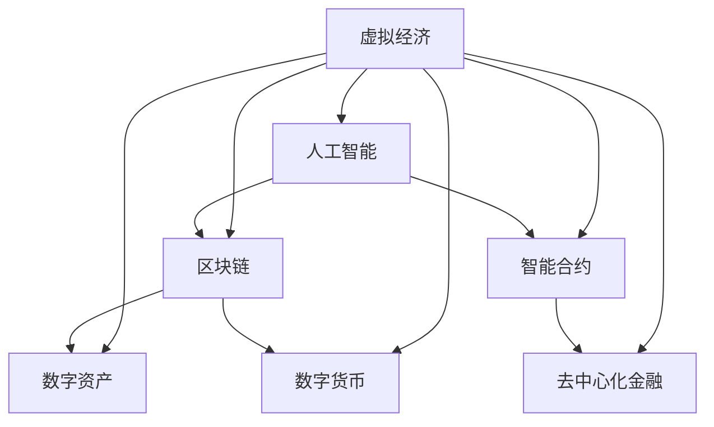

                 

# 虚拟经济：AI驱动的新型价值交换

> 关键词：虚拟经济, 人工智能, 区块链, 数字资产, 数字货币, 分布式账本技术, 智能合约, 去中心化金融

## 1. 背景介绍

随着数字技术的高速发展和普及，虚拟经济正在逐步从边缘走向主流。在互联网、物联网、人工智能、区块链等技术的驱动下，虚拟经济正在塑造一个全新的价值交换和分配体系。虚拟经济不仅涵盖了传统的数字资产，如股票、债券、货币等，还包括新兴的数字货币、NFT、游戏资产等，呈现出高度多样化、复杂化和数字化的特征。

虚拟经济的出现，不仅改变了传统的商业模式和市场结构，也为人工智能的应用提供了新的舞台。人工智能技术，尤其是深度学习、自然语言处理、计算机视觉、强化学习等，正在成为虚拟经济的核心驱动力。通过大数据、云计算、物联网等技术的支持，AI技术能够对海量数据进行高效处理和分析，实现对虚拟经济系统的智能管理和优化。

## 2. 核心概念与联系

### 2.1 核心概念概述

为更好地理解AI驱动的虚拟经济，本节将介绍几个密切相关的核心概念：

- **虚拟经济**：指虚拟环境中进行的经济活动，如互联网交易、数字货币交易、游戏内经济等。虚拟经济具有去中心化、透明度高、交易高效等特点。

- **人工智能**：通过算法、模型和计算技术，使计算机能够模拟人类智能，进行信息处理、决策制定、任务执行等活动。AI技术在虚拟经济中的应用，主要体现在智能交易、智能合约、金融分析、风险管理等方面。

- **区块链**：一种分布式账本技术，通过加密和共识机制，保证数据的不可篡改性和透明性。区块链技术是虚拟经济的重要基础，提供了去中心化交易、智能合约执行的保障。

- **数字资产**：指在数字平台上存储、传输和交易的资产，包括数字货币、NFT、游戏资产等。数字资产的流转、交易等活动构成了虚拟经济的核心。

- **数字货币**：指使用电子或数字方式进行支付、转账和结算的货币，如比特币、以太坊等。数字货币的出现，改变了传统的货币发行和流通方式，成为虚拟经济的重要组成部分。

- **智能合约**：指在区块链上自动执行、无需人工干预的合约。智能合约能够实现自动化的交易、支付、结算等操作，提高虚拟经济的效率和透明度。

- **去中心化金融(DeFi)**：指在区块链上进行的金融活动，如借贷、交易所、保险等，无需传统金融机构的参与和干预。DeFi通过智能合约实现自动化的金融服务，降低交易成本，提高金融服务的可及性。

这些核心概念之间的逻辑关系可以通过以下Mermaid流程图来展示：



这个流程图展示了一个典型的虚拟经济系统，并揭示了其核心组件及其关系：

1. **虚拟经济**：作为整体，虚拟经济涵盖了区块链、数字资产、数字货币、智能合约和DeFi等多个方面。
2. **人工智能**：通过大数据分析、深度学习、自然语言处理等技术，提供智能决策和自动化执行的能力。
3. **区块链**：作为虚拟经济的基础设施，提供了去中心化、透明、不可篡改的数据存储和交易保障。
4. **数字资产**：包括各类虚拟资产，是虚拟经济的核心组成部分。
5. **数字货币**：作为交易媒介，数字货币是虚拟经济的重要支撑。
6. **智能合约**：实现自动化和去中心化的合约执行，是DeFi的基础。
7. **去中心化金融**：基于智能合约的自动化金融服务，无需传统金融机构参与。

## 3. 核心算法原理 & 具体操作步骤
### 3.1 算法原理概述

AI驱动的虚拟经济系统，其核心算法原理主要包括以下几个方面：

- **深度学习**：通过神经网络模型对大量历史数据进行学习和训练，提取数据中的规律和特征，实现对虚拟经济系统的预测和优化。深度学习模型在虚拟经济中的应用，包括价格预测、风险管理、客户行为分析等。

- **自然语言处理(NLP)**：通过语言模型和情感分析等技术，对虚拟经济中的文本数据进行理解和处理，实现智能客服、智能投顾、情感分析等功能。NLP技术能够提升虚拟经济系统的交互性和用户体验。

- **计算机视觉**：通过图像识别和处理技术，对虚拟经济中的图像数据进行分析和解读，实现对交易行为、市场行情的可视化分析。计算机视觉技术在虚拟经济中的应用，包括图像识别、实时监控等。

- **强化学习**：通过智能体与环境的交互，优化虚拟经济系统中的决策和操作，实现自动化的交易策略和风险控制。强化学习技术在虚拟经济中的应用，包括自动交易、算法交易等。

### 3.2 算法步骤详解

基于AI驱动的虚拟经济系统的算法步骤，主要包括：

**Step 1: 数据收集与预处理**
- 收集虚拟经济系统中的历史数据、实时数据和第三方数据，如交易记录、市场行情、新闻资讯等。
- 对数据进行清洗、归一化、特征提取等预处理操作，生成模型训练所需的输入数据。

**Step 2: 模型训练与优化**
- 选择合适的深度学习模型，如卷积神经网络(CNN)、循环神经网络(RNN)、长短期记忆网络(LSTM)等，进行模型训练。
- 在训练过程中，使用交叉验证、正则化等技术优化模型参数，提高模型的泛化能力和性能。
- 使用强化学习算法，如Q-learning、Deep Q-Network(DQN)等，对模型进行优化和策略学习。

**Step 3: 模型部署与监控**
- 将训练好的模型部署到虚拟经济系统中，实现实时数据处理和决策支持。
- 在模型部署过程中，设置监控指标和告警阈值，实时监控模型的性能和稳定性。
- 根据监控结果和用户反馈，对模型进行迭代优化和更新，保证模型的长期稳定运行。

**Step 4: 用户交互与反馈**
- 在虚拟经济系统中，提供智能客服、智能投顾等用户交互功能，提升用户体验和满意度。
- 收集用户反馈和评价，优化模型和系统功能，实现个性化和定制化服务。

### 3.3 算法优缺点

AI驱动的虚拟经济系统，具有以下优点：

- **高效性**：通过深度学习和强化学习等技术，实时处理海量数据，快速响应市场变化。
- **智能化**：通过自然语言处理和计算机视觉等技术，实现智能客服、智能投顾等功能，提升用户体验和满意度。
- **去中心化**：基于区块链和智能合约等技术，实现去中心化的交易和金融服务，降低交易成本，提高可及性。

同时，该系统也存在一些局限性：

- **数据依赖**：深度学习和强化学习等技术对数据质量、数据量有较高要求，数据缺失或不完整可能影响模型性能。
- **模型复杂性**：模型结构和训练过程复杂，对计算资源和专业技能要求较高，不易大规模部署和维护。
- **隐私风险**：虚拟经济系统涉及大量用户数据，隐私保护和数据安全成为重要挑战。
- **法律和合规性**：虚拟经济系统涉及各类金融和法律问题，必须遵守相关法规和标准，确保合法合规性。

### 3.4 算法应用领域

AI驱动的虚拟经济系统，已经在多个领域得到了广泛应用，具体包括：

- **智能投顾与量化交易**：通过深度学习和强化学习算法，构建智能投顾系统，提供个性化投资建议和量化交易策略。
- **区块链金融**：基于区块链技术，构建去中心化金融服务，如去中心化交易所、借贷平台、稳定币等。
- **虚拟资产管理**：通过AI技术对虚拟资产进行自动监控和管理，提高资产配置效率和风险控制能力。
- **智能风险管理**：利用AI技术对市场行情和交易数据进行分析和预测，实现智能化的风险评估和管理。
- **情感分析与客户服务**：通过自然语言处理技术，分析用户反馈和情感倾向，优化客户服务和用户体验。

## 4. 数学模型和公式 & 详细讲解 & 举例说明

### 4.1 数学模型构建

本节将使用数学语言对AI驱动的虚拟经济系统进行更加严格的刻画。

记虚拟经济系统为 $E$，其数据集为 $D=\{(x_i, y_i)\}_{i=1}^N$，其中 $x_i$ 为输入数据（如市场行情、交易记录等），$y_i$ 为输出数据（如交易价格、市场指数等）。

定义模型 $M$ 为神经网络模型，其参数为 $\theta$。模型的损失函数为 $\mathcal{L}(M, D)$，用于衡量模型预测值与真实值之间的差距。常用的损失函数包括均方误差损失（MSE）和交叉熵损失（CE）。

### 4.2 公式推导过程

以下是深度学习模型在虚拟经济系统中的应用公式推导。

假设深度学习模型 $M$ 的输出为 $\hat{y}=M(x, \theta)$，其中 $\hat{y}$ 为模型预测值，$x$ 为输入数据。模型的损失函数 $\mathcal{L}(M, D)$ 可以表示为：

$$
\mathcal{L}(M, D) = \frac{1}{N}\sum_{i=1}^N (\hat{y}_i - y_i)^2 = \frac{1}{N}\sum_{i=1}^N \text{MSE}(M(x_i, \theta), y_i)
$$

其中 $\text{MSE}$ 为均方误差损失函数，$\frac{1}{N}$ 为平均损失。

通过梯度下降等优化算法，最小化损失函数 $\mathcal{L}(M, D)$，得到模型参数 $\theta$ 的更新公式为：

$$
\theta \leftarrow \theta - \eta \nabla_{\theta}\mathcal{L}(M, D)
$$

其中 $\eta$ 为学习率，$\nabla_{\theta}\mathcal{L}(M, D)$ 为损失函数对模型参数 $\theta$ 的梯度，可通过反向传播算法高效计算。

### 4.3 案例分析与讲解

以智能投顾系统的构建为例，分析AI驱动的虚拟经济系统中的应用。

假设智能投顾系统需要预测股票市场的未来走势，选择历史交易记录 $(x_i)$ 和当前市场行情 $(x_t)$ 作为输入数据，股票价格 $y_i$ 作为输出数据。通过深度学习模型 $M$ 进行训练，得到模型参数 $\theta$，实现对未来股票价格的预测。

在训练过程中，使用均方误差损失函数，得到损失函数 $\mathcal{L}(M, D)$。通过梯度下降等优化算法，最小化损失函数 $\mathcal{L}(M, D)$，得到模型参数 $\theta$ 的更新公式：

$$
\theta \leftarrow \theta - \eta \nabla_{\theta}\mathcal{L}(M, D)
$$

在得到训练好的模型后，对当前市场行情 $x_t$ 进行预测，得到未来股票价格 $\hat{y}_t$，并将其作为投资建议返回给用户。

## 5. 项目实践：代码实例和详细解释说明
### 5.1 开发环境搭建

在进行AI驱动的虚拟经济系统开发前，我们需要准备好开发环境。以下是使用Python进行TensorFlow开发的环境配置流程：

1. 安装Anaconda：从官网下载并安装Anaconda，用于创建独立的Python环境。

2. 创建并激活虚拟环境：
```bash
conda create -n pytorch-env python=3.8 
conda activate pytorch-env
```

3. 安装TensorFlow：根据CUDA版本，从官网获取对应的安装命令。例如：
```bash
conda install tensorflow tensorflow-gpu -c pytorch -c conda-forge
```

4. 安装各类工具包：
```bash
pip install numpy pandas scikit-learn matplotlib tqdm jupyter notebook ipython
```

完成上述步骤后，即可在`pytorch-env`环境中开始开发实践。

### 5.2 源代码详细实现

下面我们以智能投顾系统的构建为例，给出使用TensorFlow进行模型训练和预测的PyTorch代码实现。

首先，定义模型的输入和输出：

```python
import tensorflow as tf
from tensorflow.keras import layers, models

# 定义模型输入和输出
input_shape = (10,)
output_shape = (1,)

input_layer = layers.Input(shape=input_shape, name='input')
output_layer = layers.Dense(output_shape, name='output')

model = models.Model(inputs=input_layer, outputs=output_layer)
```

然后，定义模型的损失函数和优化器：

```python
# 定义损失函数和优化器
loss_function = tf.keras.losses.MeanSquaredError()
optimizer = tf.keras.optimizers.Adam(learning_rate=0.001)
```

接着，定义模型的训练过程：

```python
# 定义训练数据和标签
train_data = ...
train_labels = ...

# 定义训练批次大小和迭代轮数
batch_size = 32
epochs = 100

# 训练模型
model.compile(optimizer=optimizer, loss=loss_function)
model.fit(train_data, train_labels, batch_size=batch_size, epochs=epochs, validation_split=0.2)
```

最后，使用训练好的模型进行预测：

```python
# 使用训练好的模型进行预测
test_data = ...
predictions = model.predict(test_data)
```

以上就是使用TensorFlow进行智能投顾系统构建的完整代码实现。可以看到，TensorFlow提供了强大的深度学习框架，能够快速高效地训练和预测模型。

### 5.3 代码解读与分析

让我们再详细解读一下关键代码的实现细节：

**模型定义**：
- `layers.Input`：定义模型输入层，指定输入数据的形状。
- `layers.Dense`：定义模型输出层，指定输出数据的形状。
- `models.Model`：将输入层和输出层组合成完整的模型。

**损失函数和优化器**：
- `tf.keras.losses.MeanSquaredError`：定义均方误差损失函数。
- `tf.keras.optimizers.Adam`：定义Adam优化器，设置学习率。

**模型训练**：
- `model.compile`：编译模型，设置损失函数和优化器。
- `model.fit`：对模型进行训练，指定训练数据、标签、批次大小、迭代轮数等参数。

**模型预测**：
- `model.predict`：使用训练好的模型进行预测，返回预测结果。

以上代码展示了AI驱动的虚拟经济系统中智能投顾系统的构建过程。TensorFlow的强大功能和灵活接口，使得模型训练和预测变得简单易行。

## 6. 实际应用场景
### 6.1 智能投顾与量化交易

AI驱动的智能投顾和量化交易系统，已经在金融领域得到了广泛应用。传统的投资决策往往依赖于人工经验和情感判断，容易受到市场波动和情绪影响。而通过AI技术，智能投顾系统能够基于大量历史数据和大规模市场行情，自动生成投资策略和决策建议，显著提高投资决策的科学性和稳定性。

在技术实现上，智能投顾系统通常包括数据采集、模型训练、策略生成、交易执行等多个环节。系统首先采集历史交易记录、市场行情等数据，通过深度学习等技术构建预测模型。训练好的模型能够对市场行情进行实时预测，并根据预设的策略生成投资建议。交易系统根据投资建议自动执行交易操作，实现智能化的投资管理。

### 6.2 区块链金融

区块链金融是虚拟经济系统的重要组成部分，基于区块链技术的去中心化金融服务正在逐步崛起。传统的金融服务依赖于中心化的金融机构，容易受到系统故障、数据泄露等风险的影响。而基于区块链的DeFi系统，通过智能合约和去中心化的账本，实现了自动化的交易和金融服务，大幅降低了交易成本，提高了金融服务的透明度和可及性。

DeFi系统包括去中心化交易所（DEX）、借贷平台、稳定币等多种形式。在DEX中，用户可以自由交易数字货币，无需中介机构的参与，降低了交易费用和风险。借贷平台则通过智能合约自动执行贷款和还款操作，无需传统银行的审核和担保。稳定币通过算法稳定机制，实现数字货币与法币的稳定兑换，解决了传统金融市场的流动性问题。

### 6.3 虚拟资产管理

虚拟资产管理是虚拟经济系统的重要应用场景，AI技术在其中发挥了重要作用。传统的资产管理依赖于人工分析和判断，难以应对海量数据和复杂市场环境。而通过AI技术，虚拟资产管理系统能够基于大量历史数据和实时行情，自动进行资产配置和风险管理，提高资产管理的科学性和效率。

虚拟资产管理系统的核心技术包括资产定价、风险评估、资产组合优化等。通过深度学习等技术，系统能够对市场行情进行精准预测，优化资产配置策略，降低风险暴露。同时，通过强化学习等技术，系统能够动态调整资产组合，实现最大化收益和最小化风险的目标。

### 6.4 未来应用展望

随着AI技术在虚拟经济系统中的深入应用，未来虚拟经济将迎来更加广阔的发展前景。以下是几个可能的未来应用方向：

1. **自动交易平台**：基于AI技术的自动交易平台，能够实时分析市场行情和交易数据，自动生成交易策略，实现高效的自动化交易。未来，自动交易平台将成为金融市场的重要组成部分，大幅提升交易效率和市场流动性。

2. **智能合约**：基于区块链技术的智能合约，将进一步发展和完善，实现更加灵活、智能的合约执行和管理。未来，智能合约将广泛应用于金融、保险、供应链等多个领域，提升效率和透明度。

3. **去中心化应用(DApps)**：基于区块链技术的去中心化应用，将成为虚拟经济的重要形态。未来，DApps将在金融、社交、游戏等多个领域得到广泛应用，实现更加自由、开放的数字经济生态。

4. **数据隐私保护**：虚拟经济系统涉及大量用户数据，数据隐私和安全成为重要问题。未来，区块链和分布式账本技术将进一步发展，实现数据的去中心化和隐私保护，保障用户权益。

5. **多模态数据融合**：虚拟经济系统涉及文本、图像、视频等多种数据类型，未来将更加注重多模态数据的融合和协同。通过自然语言处理、计算机视觉等技术，实现多模态数据的智能分析和处理，提升系统决策的全面性和准确性。

总之，AI技术在虚拟经济系统中的应用前景广阔，将为数字经济的发展注入新的动力。未来，虚拟经济将与AI技术深度融合，实现更加智能化、自动化和去中心化的价值交换和分配体系。

## 7. 工具和资源推荐
### 7.1 学习资源推荐

为了帮助开发者系统掌握AI驱动的虚拟经济系统，这里推荐一些优质的学习资源：

1. **《深度学习》（Ian Goodfellow、Yoshua Bengio、Aaron Courville著）**：该书系统介绍了深度学习的基本概念和核心算法，是AI技术的经典教材。

2. **《区块链技术与应用》（刘颖、杨明著）**：该书介绍了区块链技术的原理和应用，是理解区块链金融的重要参考书。

3. **《人工智能金融》（张清宇、李占国等著）**：该书介绍了AI技术在金融领域的应用，是了解智能投顾和量化交易的重要资料。

4. **《TensorFlow实战》（王宇辰、何博研著）**：该书介绍了TensorFlow的强大功能和灵活接口，适合TensorFlow开发实践。

5. **《区块链编程指南》（Mads Kalvik、Marek Jacobson著）**：该书介绍了区块链编程的基本方法和实践技巧，适合区块链开发实践。

通过对这些资源的学习实践，相信你一定能够快速掌握AI驱动的虚拟经济系统，并用于解决实际的金融和经济问题。

### 7.2 开发工具推荐

高效的开发离不开优秀的工具支持。以下是几款用于AI驱动的虚拟经济系统开发的常用工具：

1. **TensorFlow**：基于Python的开源深度学习框架，提供灵活的计算图和自动微分功能，适合构建复杂的深度学习模型。

2. **PyTorch**：基于Python的开源深度学习框架，提供动态计算图和高效的内存管理，适合快速迭代研究。

3. **Keras**：基于TensorFlow和Theano的高级API，提供简单易用的深度学习接口，适合初学者上手。

4. **Jupyter Notebook**：交互式开发环境，支持Python、R等多种语言，适合数据科学和机器学习实践。

5. **Blockchain.info**：提供区块链数据和工具，适合区块链开发和研究。

合理利用这些工具，可以显著提升AI驱动的虚拟经济系统开发的效率和质量。

### 7.3 相关论文推荐

AI驱动的虚拟经济系统的发展，离不开学界的持续研究。以下是几篇奠基性的相关论文，推荐阅读：

1. **《深度学习》（Ian Goodfellow、Yoshua Bengio、Aaron Courville著）**：该书系统介绍了深度学习的基本概念和核心算法，是AI技术的经典教材。

2. **《区块链技术与应用》（刘颖、杨明著）**：该书介绍了区块链技术的原理和应用，是理解区块链金融的重要参考书。

3. **《人工智能金融》（张清宇、李占国等著）**：该书介绍了AI技术在金融领域的应用，是了解智能投顾和量化交易的重要资料。

4. **《TensorFlow实战》（王宇辰、何博研著）**：该书介绍了TensorFlow的强大功能和灵活接口，适合TensorFlow开发实践。

5. **《区块链编程指南》（Mads Kalvik、Marek Jacobson著）**：该书介绍了区块链编程的基本方法和实践技巧，适合区块链开发实践。

这些论文代表了大语言模型微调技术的发展脉络。通过学习这些前沿成果，可以帮助研究者把握学科前进方向，激发更多的创新灵感。

## 8. 总结：未来发展趋势与挑战

### 8.1 总结

本文对AI驱动的虚拟经济系统进行了全面系统的介绍。首先阐述了虚拟经济系统和大语言模型的研究背景和意义，明确了虚拟经济系统和大语言模型之间的紧密联系。其次，从原理到实践，详细讲解了AI驱动的虚拟经济系统的数学模型和关键步骤，给出了AI驱动的虚拟经济系统的完整代码实现。同时，本文还广泛探讨了AI驱动的虚拟经济系统在智能投顾、区块链金融、虚拟资产管理等多个领域的应用前景，展示了AI驱动的虚拟经济系统的巨大潜力。此外，本文精选了AI驱动的虚拟经济系统的各类学习资源，力求为读者提供全方位的技术指引。

通过本文的系统梳理，可以看到，AI驱动的虚拟经济系统正在成为虚拟经济的重要驱动力，极大地拓展了虚拟经济系统的应用边界，催生了更多的落地场景。受益于AI技术的发展，虚拟经济系统将能够提供更加智能化、高效化、去中心化的服务，推动虚拟经济向更广泛、更深入、更普适的方向发展。

### 8.2 未来发展趋势

展望未来，AI驱动的虚拟经济系统将呈现以下几个发展趋势：

1. **多模态数据融合**：虚拟经济系统涉及文本、图像、视频等多种数据类型，未来将更加注重多模态数据的融合和协同。通过自然语言处理、计算机视觉等技术，实现多模态数据的智能分析和处理，提升系统决策的全面性和准确性。

2. **自动化和智能化**：AI技术将进一步渗透到虚拟经济系统的各个环节，实现更加自动化、智能化的服务。未来，虚拟经济系统将能够基于大量的历史数据和实时行情，自动进行资产配置、风险管理、交易决策等操作，大幅提升效率和精准度。

3. **去中心化和透明化**：基于区块链技术的去中心化金融服务将继续发展，实现更加公平、透明、安全的金融服务。未来，虚拟经济系统将实现去中心化的交易、支付、融资等功能，大幅降低交易成本和风险。

4. **智能投顾和量化交易**：AI技术将广泛应用于智能投顾和量化交易系统，提高投资决策的科学性和稳定性。未来，智能投顾和量化交易系统将基于深度学习、强化学习等技术，实现自动化的交易策略和决策建议，提升投资回报率。

5. **数据隐私和安全**：虚拟经济系统涉及大量用户数据，数据隐私和安全成为重要问题。未来，区块链和分布式账本技术将进一步发展，实现数据的去中心化和隐私保护，保障用户权益。

### 8.3 面临的挑战

尽管AI驱动的虚拟经济系统已经取得了瞩目成就，但在迈向更加智能化、普适化应用的过程中，它仍面临着诸多挑战：

1. **数据质量和安全**：深度学习和强化学习等技术对数据质量、数据量有较高要求，数据缺失或不完整可能影响模型性能。同时，虚拟经济系统涉及大量用户数据，数据隐私和安全成为重要问题。

2. **模型复杂性和成本**：AI技术的应用需要大量的计算资源和专业技能，模型结构和训练过程复杂，容易产生过拟合等问题。同时，深度学习和强化学习等技术需要大量的训练数据和计算资源，成本较高。

3. **市场复杂性和波动性**：虚拟经济市场复杂多变，市场情绪和市场波动对AI模型预测和决策的影响较大，模型的稳定性和可靠性仍需进一步提升。

4. **伦理和法律问题**：虚拟经济系统涉及各类金融和法律问题，必须遵守相关法规和标准，确保合法合规性。同时，AI技术的应用可能涉及伦理和道德问题，如何保证AI系统的公正性和透明性，将是重要的研究方向。

### 8.4 研究展望

面对AI驱动的虚拟经济系统所面临的种种挑战，未来的研究需要在以下几个方面寻求新的突破：

1. **数据增强和迁移学习**：通过数据增强和迁移学习等技术，提高AI模型的泛化能力和泛化能力，减少对特定数据集和特定场景的依赖。

2. **模型压缩和优化**：开发更加轻量级的模型结构和优化方法，提高AI系统的实时性和资源利用率，减少计算资源和能源消耗。

3. **多模态融合与协同**：将自然语言处理、计算机视觉、传感器数据等多模态信息进行融合，实现更加全面、准确和智能的决策和分析。

4. **伦理和法律约束**：在AI技术的应用过程中，注重伦理和法律约束，保障AI系统的公正性、透明性和安全性。

5. **去中心化和隐私保护**：进一步发展区块链和分布式账本技术，实现去中心化的数据存储和交易，保障用户隐私和数据安全。

6. **多目标优化**：在AI驱动的虚拟经济系统中，如何平衡多目标（如收益、风险、公平性等），实现综合优化，将是重要的研究方向。

这些研究方向的探索，必将引领AI驱动的虚拟经济系统迈向更高的台阶，为构建安全、可靠、可解释、可控的智能系统铺平道路。面向未来，AI驱动的虚拟经济系统还需要与其他人工智能技术进行更深入的融合，如知识表示、因果推理、强化学习等，多路径协同发力，共同推动虚拟经济的发展。只有勇于创新、敢于突破，才能不断拓展虚拟经济系统的边界，让AI技术更好地造福人类社会。

## 9. 附录：常见问题与解答

**Q1：AI驱动的虚拟经济系统是否适用于所有虚拟经济任务？**

A: AI驱动的虚拟经济系统在大多数虚拟经济任务上都能取得不错的效果，特别是对于数据量较大的任务。但对于一些特定领域的任务，如医学、法律等，仅仅依靠通用语料预训练的模型可能难以很好地适应。此时需要在特定领域语料上进一步预训练，再进行微调，才能获得理想效果。此外，对于一些需要时效性、个性化很强的任务，如对话、推荐等，AI驱动的虚拟经济系统也需要针对性的改进优化。

**Q2：AI驱动的虚拟经济系统在模型训练过程中需要注意哪些问题？**

A: 在AI驱动的虚拟经济系统模型训练过程中，需要注意以下问题：

1. **数据质量**：深度学习和强化学习等技术对数据质量、数据量有较高要求，数据缺失或不完整可能影响模型性能。

2. **过拟合问题**：AI驱动的虚拟经济系统在模型训练过程中，容易产生过拟合问题，特别是对于标注数据较少的任务。需要采取数据增强、正则化等技术，减少过拟合风险。

3. **计算资源**：深度学习和强化学习等技术需要大量的计算资源和专业技能，模型结构和训练过程复杂，容易产生过拟合等问题。

4. **模型复杂度**：AI驱动的虚拟经济系统涉及复杂的模型结构和训练过程，需要在计算资源和模型复杂度之间进行平衡，避免过拟合和欠拟合问题。

5. **模型优化**：AI驱动的虚拟经济系统需要优化模型结构和训练过程，提高模型性能和泛化能力，减少计算资源和能源消耗。

**Q3：AI驱动的虚拟经济系统在实际应用中需要注意哪些问题？**

A: 在AI驱动的虚拟经济系统实际应用中，需要注意以下问题：

1. **数据隐私和安全**：AI驱动的虚拟经济系统涉及大量用户数据，数据隐私和安全成为重要问题。需要采取数据加密、去中心化等技术，保障用户隐私和数据安全。

2. **伦理和法律问题**：AI驱动的虚拟经济系统涉及各类金融和法律问题，必须遵守相关法规和标准，确保合法合规性。同时，AI技术的应用可能涉及伦理和道德问题，如何保证AI系统的公正性和透明性，将是重要的研究方向。

3. **市场复杂性和波动性**：虚拟经济市场复杂多变，市场情绪和市场波动对AI模型预测和决策的影响较大，模型的稳定性和可靠性仍需进一步提升。

4. **模型泛化能力**：AI驱动的虚拟经济系统需要具备良好的泛化能力，能够适应不同的市场环境和交易行为，减少模型偏见和歧视。

5. **模型实时性**：AI驱动的虚拟经济系统需要具备良好的实时性，能够快速响应市场变化和用户需求，提高系统效率和用户体验。

总之，AI驱动的虚拟经济系统在实际应用中需要综合考虑数据质量、计算资源、模型复杂度、数据隐私、伦理法律等多个因素，才能实现高效、智能、安全的服务。

---

作者：禅与计算机程序设计艺术 / Zen and the Art of Computer Programming

