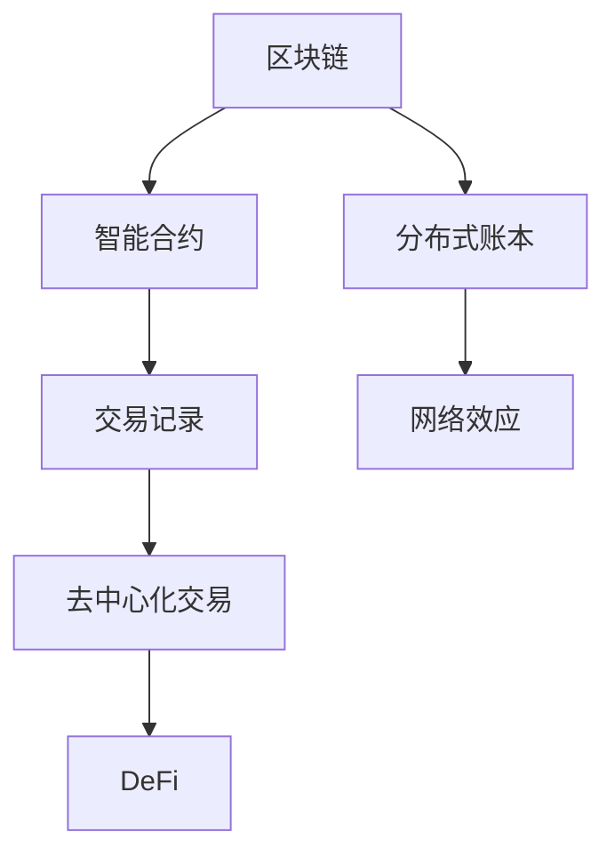

                 

# 虚拟货币与全球脑:去中心化金融的未来图景

> 关键词：去中心化金融(DeFi), 虚拟货币(Crypto), 区块链(Blockchain), 智能合约(Smart Contract), 分布式账本(Distributed Ledger), 经济模型(Economic Model), 金融创新(Financial Innovation), 网络效应(Network Effect)

## 1. 背景介绍

### 1.1 问题由来
随着互联网技术的不断发展和普及，数字经济逐渐成为全球经济的重要组成部分。区块链和分布式账本技术的兴起，为互联网时代提供了一种全新的价值交换和信任机制。虚拟货币的诞生和去中心化金融（DeFi）的兴起，进一步拓宽了数字经济的应用边界，引领了金融行业的重大变革。

去中心化金融是指利用区块链和智能合约技术，实现去中心化的金融服务和资产交易。与传统的金融系统相比，DeFi具有更高的透明度、更低的手续费和更高的安全性。然而，尽管DeFi在过去几年中取得了显著进展，其核心技术架构仍面临着诸多挑战，如可扩展性、安全性和监管合规等问题。

本文将深入探讨去中心化金融的核心概念和技术原理，剖析其面临的挑战和未来发展趋势，并结合虚拟货币、区块链等前沿技术，展望DeFi的未来图景。

## 2. 核心概念与联系

### 2.1 核心概念概述

为更好地理解去中心化金融的框架和运作机制，本节将介绍几个关键概念及其相互联系：

- **去中心化金融(DeFi)**：基于区块链和智能合约技术，无需传统金融机构中介，实现自动化和去中心化的金融服务和资产交易。DeFi涵盖了借贷、交换、稳定币、保险、衍生品等多种金融功能。

- **虚拟货币(Crypto)**：基于区块链技术的数字货币，如比特币(Bitcoin)、以太坊(Ethereum)等。虚拟货币去中心化、匿名性、安全性等特点使其成为DeFi的重要基础。

- **区块链(Blockchain)**：一种去中心化的分布式账本技术，通过共识算法维护数据的安全和不可篡改性。区块链技术为DeFi提供了透明、可验证的交易记录和数据存储机制。

- **智能合约(Smart Contract)**：运行在区块链上的自执行合约，利用代码逻辑自动执行合约条款。智能合约为DeFi提供了自动化、低成本、无需信任的合约执行机制。

- **分布式账本(Distributed Ledger)**：一种去中心化的账本技术，通过多节点共同维护，保证数据的不可篡改和透明性。分布式账本为DeFi提供了去中心化的交易记录和数据存储基础。

- **经济模型(Economic Model)**：描述和分析DeFi系统中各类参与者（如投资者、借贷者、矿工等）的收益和损失关系，指导系统的设计和发展。

这些核心概念构成了DeFi的基本框架，通过协同工作，形成了一个去中心化、自动化、透明化的金融系统。

### 2.2 核心概念原理和架构的 Mermaid 流程图



这个流程图展示了DeFi系统的主要组成部分及其相互关系：

1. 区块链提供了去中心化的数据存储和传输机制。
2. 智能合约在此基础上执行自动化的合约逻辑。
3. 分布式账本记录和验证交易，保障数据不可篡改。
4. 去中心化交易减少了中介成本，提高了效率。
5. 网络效应使得系统用户不断增长，增强系统的稳定性和安全性。

这些组件共同构成了DeFi的核心技术架构，支持其去中心化、自动化、透明化的金融服务。

## 3. 核心算法原理 & 具体操作步骤

### 3.1 算法原理概述

去中心化金融的运作基于区块链和智能合约技术。其核心算法原理主要包括：

- **共识算法**：通过共识算法（如PoW、PoS、DPoS等）维护区块链的分布式账本，确保数据的不可篡改和透明性。
- **智能合约**：利用代码逻辑自动执行合约条款，保障交易的自动化、去中心化和透明性。
- **代币经济模型**：定义各类代币的发行、流通和销毁机制，激励系统参与者参与和维护系统运行。

DeFi系统的具体操作步骤如下：

1. **部署智能合约**：在区块链上部署智能合约，定义各类金融功能（如借贷、交易、保险等）的逻辑和规则。
2. **发行和交易代币**：发行并交易各类DeFi代币（如治理代币、借贷代币、稳定币等），作为系统内资金和权益的媒介。
3. **执行智能合约**：根据预设的逻辑和规则，自动化执行各类金融操作（如借贷、交易、清算等），无需中介干预。
4. **维护系统安全**：通过共识算法和智能合约的设计，确保系统的安全和稳定运行。

### 3.2 算法步骤详解

以下是DeFi系统的主要操作步骤和详细解释：

1. **智能合约部署**
   - 选择一个适合的智能合约平台（如以太坊、BSC等）。
   - 编写智能合约代码，定义借贷、交易、保险等金融功能的逻辑和规则。
   - 将智能合约部署到区块链网络中。

2. **代币发行**
   - 设计并发行各类DeFi代币，明确其发行机制、流通规则和销毁机制。
   - 使用智能合约实现代币的发行、交易和销毁功能。

3. **去中心化交易**
   - 在智能合约上定义交易规则和条款，支持自动化的买卖和清算。
   - 用户通过智能合约进行交易，无需中介干预，即可实现去中心化的金融操作。

4. **系统安全维护**
   - 设计共识算法，确保区块链的分布式账本的安全和透明性。
   - 定期更新和维护智能合约，修复漏洞，增强系统安全性。
   - 通过经济模型，激励系统参与者积极参与和维护系统运行。

### 3.3 算法优缺点

去中心化金融的算法具有以下优点：

- **去中心化**：去中心化交易和结算，减少了中介成本，提高了效率。
- **透明度**：智能合约和分布式账本保证了交易和数据的透明性。
- **安全性**：通过共识算法和智能合约的设计，增强系统的安全性。
- **自动化**：自动化的合约执行和交易操作，提高了系统的可靠性。

同时，DeFi算法也存在以下缺点：

- **复杂性**：智能合约和共识算法的实现较为复杂，需要高水平的技术支持。
- **可扩展性**：当前区块链技术的可扩展性仍有限，无法满足大规模金融交易的需求。
- **风险性**：智能合约和共识算法的设计缺陷可能导致系统漏洞和安全风险。

### 3.4 算法应用领域

去中心化金融技术已经被广泛应用于多个金融领域，包括：

- **借贷与信用**：通过智能合约实现去中心化的借贷和信用评估，如Compound、Aave等。
- **交易与市场**：支持去中心化的资产交易和市场机制，如Uniswap、SushiSwap等。
- **稳定币**：提供去中心化的稳定币解决方案，如USD Coin、Dai等。
- **保险与期权**：实现去中心化的保险和期权交易，如Etherescrow、Synthetix等。
- **衍生品**：支持去中心化的衍生品交易和风险管理，如Synthetix、Perpetual Protocol等。

## 4. 数学模型和公式 & 详细讲解 & 举例说明

### 4.1 数学模型构建

DeFi系统的数学模型主要包括：

- **交易费用模型**：描述交易手续费的计算方法，通常基于交易金额和交易频率。
- **借贷利率模型**：描述借贷利率的计算方法，通常基于市场需求和供给。
- **稳定币模型**：描述稳定币的发行和兑换机制，通常基于挂钩资产和储备资产。
- **经济模型**：描述系统内各类参与者的收益和损失关系，通常基于代币流通量和市场供需。

### 4.2 公式推导过程

以下以借贷利率模型为例，推导其公式和计算过程：

假设借贷市场供需平衡，需求函数为 $D(r)$，供给函数为 $S(r)$，其中 $r$ 为借贷利率。设当前借贷利率为 $r_0$，市场供需平衡时，有：

$$ D(r_0) = S(r_0) $$

当市场需求上升，需求函数变为 $D(r_1)$，供给函数不变，借贷利率变化为 $r_1$，有：

$$ D(r_1) = S(r_0) $$

由需求函数和供给函数的性质，得：

$$ r_1 = r_0 + \frac{\Delta D}{\Delta S} $$

其中 $\Delta D$ 和 $\Delta S$ 分别为需求和供给的增量。

### 4.3 案例分析与讲解

假设借贷市场需求上升 10%，供给不变，当前借贷利率为 5%，计算新的借贷利率：

- 初始需求 $D(r_0) = 100$，供给 $S(r_0) = 100$
- 需求上升 10%，即 $D(r_1) = 110$
- 计算新利率 $r_1 = 5\% + \frac{10}{100} = 6\%$

以上分析展示了DeFi系统中借贷利率模型的工作原理和计算方法。

## 5. 项目实践：代码实例和详细解释说明

### 5.1 开发环境搭建

在DeFi项目开发前，我们需要准备好开发环境。以下是使用Python进行Solidity开发的环境配置流程：

1. 安装Node.js：从官网下载并安装Node.js，配置环境变量。
2. 安装Truffle框架：通过npm安装Truffle，用于智能合约的开发和管理。
3. 配置Web3.js：通过npm安装Web3.js，连接本地或远程区块链网络。
4. 安装Ganache或Ropsten测试网络：通过Truffle或第三方工具安装Ganache或Ropsten测试网络，用于本地测试和部署。

完成上述步骤后，即可在本地环境中进行DeFi项目开发。

### 5.2 源代码详细实现

以下是一个简单的DeFi借贷合约的Python代码实现，利用Solidity编写智能合约：

```python
from web3 import Web3

# 连接本地区块链网络
web3 = Web3(Web3.HTTPProvider('http://localhost:8545'))

# 部署智能合约
contract_address = '0x1234567890abcdef'
contract_abi = {
    'functions': {
        'borrow': {
            'inputs': [],
            'outputs': []
        },
        'repay': {
            'inputs': [],
            'outputs': []
        }
    }
}

# 调用智能合约函数
tx = web3.eth.sendTransaction({
    'to': contract_address,
    'from': web3.eth.accounts[0],
    'value': web3.toWei(1, 'ether'),
    'gas': 100000
})
```

### 5.3 代码解读与分析

让我们再详细解读一下关键代码的实现细节：

**Web3.js**：用于连接和操作本地或远程区块链网络，通过HTTP或WebSocket协议与区块链节点通信。

**智能合约部署**：利用Web3.js的`eth.sendTransaction`方法，将智能合约部署到区块链网络中。

**智能合约调用**：通过智能合约的ABI接口，调用合约函数执行借贷操作。

**代码解读与分析**：
- `Web3(Web3.HTTPProvider('http://localhost:8545'))`：创建Web3.js实例，连接本地区块链网络。
- `contract_address`：智能合约的地址，通过`web3.eth.accounts[0]`获取当前账户地址。
- `contract_abi`：智能合约的ABI接口，定义借贷和还款等函数。
- `tx = web3.eth.sendTransaction({...})`：部署智能合约，并调用借贷函数。

以上代码展示了如何使用Web3.js连接区块链网络，部署和调用智能合约的简单过程。

### 5.4 运行结果展示

在部署智能合约后，可以通过区块链浏览器查看合约的状态和执行结果，验证智能合约的功能是否正常。

## 6. 实际应用场景

### 6.1 智能合约部署
智能合约的部署是DeFi项目开发的关键环节。通常，智能合约需要经过以下几个步骤：

1. **编写代码**：根据项目需求，编写智能合约的代码，定义合约函数和逻辑。
2. **测试和调试**：在本地或测试网络上测试智能合约，修复代码中的漏洞和错误。
3. **部署到主网**：将智能合约部署到主网区块链上，进行大规模的金融交易和操作。

### 6.2 去中心化借贷
去中心化借贷是DeFi系统的重要应用之一。通过智能合约，用户可以在无需中介的情况下进行借贷操作，提高金融服务的可访问性和效率。

例如，用户可以通过智能合约申请贷款，智能合约自动计算利息、罚息和还款周期，自动执行借贷操作。借贷过程中，智能合约确保资金的透明和安全，防止欺诈和违约行为。

### 6.3 去中心化交易所
去中心化交易所（DeFi Exchange）提供了一种无需中介的资产交易方式，支持多种加密货币和代币的自由交易。

DeFi交易所通常采用自动做市商（AMM）和订单簿（Order Book）两种模式，用户可以通过智能合约直接进行交易，无需支付高额的手续费。

### 6.4 未来应用展望

未来，去中心化金融技术将进一步扩展其应用场景，包括：

1. **供应链金融**：通过智能合约和区块链技术，实现供应链上下游的协同金融服务，提高供应链的效率和透明度。
2. **证券化资产**：利用智能合约和代币经济模型，将传统金融资产证券化，为投资者提供多样化的投资选择。
3. **保险和风险管理**：利用智能合约和分布式账本技术，实现去中心化的保险和风险管理，降低交易成本和风险。
4. **DeFi生态系统**：构建DeFi生态系统，形成不同功能模块的有机整合，提供更加全面、完善的金融服务。

## 7. 工具和资源推荐

### 7.1 学习资源推荐

为了帮助开发者系统掌握去中心化金融的技术基础和开发方法，这里推荐一些优质的学习资源：

1. **Solidity官方文档**：官方文档是学习Solidity语言和智能合约开发的最佳资料，涵盖了语言语法、智能合约库和开发工具等。

2. **DeFi stack - Study Guide**：DeFi Stack提供了一本详细的学习指南，涵盖DeFi基础知识、智能合约开发、DeFi应用等，适合入门和进阶读者。

3. **Ethereum Developers Guide**：以太坊开发者指南，介绍了以太坊平台的基本概念、智能合约开发、DApp部署等。

4. **Blockchain Basics**：Blockchain Basics是一本免费的在线书籍，涵盖区块链技术的基本原理、应用场景和开发工具。

5. **Smart Contract Development with Solidity**：一本介绍Solidity智能合约开发的实战书籍，结合实际案例，详细讲解智能合约的编写、测试和部署。

通过对这些资源的学习实践，相信你一定能够快速掌握去中心化金融的核心技术，并用于解决实际的金融问题。

### 7.2 开发工具推荐

高效的开发离不开优秀的工具支持。以下是几款用于去中心化金融开发的常用工具：

1. **Truffle**：一个流行的智能合约开发框架，提供了一站式的开发环境、测试网络和部署工具。

2. **Remix IDE**：一个基于Web的智能合约编辑器，支持Solidity代码的编写、测试和部署。

3. **MyEtherWallet**：一个以太坊钱包，支持钱包管理和私钥保护，方便开发者进行测试和部署。

4. **Metamask**：一个流行的浏览器插件，支持以太坊钱包功能，方便用户进行交易和交互。

5. **Infura**：一个区块链API服务提供商，提供快速、稳定的区块链节点连接，支持多种区块链平台。

6. **Ganache**：一个本地测试网络，支持以太坊等区块链平台的智能合约开发和测试。

合理利用这些工具，可以显著提升去中心化金融系统的开发效率，加快创新迭代的步伐。

### 7.3 相关论文推荐

去中心化金融技术的发展得益于学界的持续研究。以下是几篇奠基性的相关论文，推荐阅读：

1. **Ethereum Yellow Paper**：以太坊白皮书，介绍了以太坊平台的基本原理和技术架构，奠定了DeFi的基础。

2. **Smart Contracts: Blockchain Programming in the Web 3.0 Economy**：一本介绍智能合约的书籍，详细讲解智能合约的基本原理和应用场景。

3. **The Economics of Smart Contracts**：研究智能合约的经济模型，探讨其对金融系统和法律体系的影响。

4. **DeFi: The Next Decade**：DeFi技术的未来展望，探讨了DeFi技术的发展方向和应用前景。

这些论文代表了大规模语言模型微调技术的发展脉络。通过学习这些前沿成果，可以帮助研究者把握学科前进方向，激发更多的创新灵感。

## 8. 总结：未来发展趋势与挑战

### 8.1 研究成果总结

本文对去中心化金融的核心概念和技术原理进行了全面系统的介绍。首先阐述了DeFi的核心技术架构和运作机制，明确了DeFi在去中心化、自动化、透明化方面的独特优势。其次，从原理到实践，详细讲解了DeFi系统的数学模型和具体操作步骤，给出了DeFi项目开发的完整代码实例。同时，本文还探讨了DeFi技术在实际应用中的广泛场景，展示了DeFi的巨大潜力和应用前景。

### 8.2 未来发展趋势

展望未来，去中心化金融技术将呈现以下几个发展趋势：

1. **可扩展性**：未来，区块链技术将实现更高的可扩展性，支持更大规模的金融交易和操作。

2. **互操作性**：通过跨链技术和跨平台标准，实现不同区块链平台之间的互操作，提升系统的灵活性和兼容性。

3. **安全性和合规性**：随着监管政策的不断完善，DeFi系统的安全性和合规性将得到进一步提升，避免系统漏洞和法律风险。

4. **生态系统建设**：构建完善的DeFi生态系统，形成不同功能模块的有机整合，提供更加全面、完善的金融服务。

5. **技术创新**：引入新的技术手段，如零知识证明、隐私计算等，提升系统的隐私保护和安全性。

6. **应用创新**：拓展DeFi技术在更多行业领域的应用，如供应链金融、证券化资产等。

### 8.3 面临的挑战

尽管去中心化金融技术已经取得了显著进展，但在迈向更加智能化、普适化应用的过程中，其仍面临着诸多挑战：

1. **技术复杂性**：智能合约和共识算法的实现较为复杂，需要高水平的技术支持。

2. **可扩展性瓶颈**：当前区块链技术的可扩展性仍有限，无法满足大规模金融交易的需求。

3. **安全性和监管风险**：智能合约和共识算法的设计缺陷可能导致系统漏洞和安全风险。

4. **市场接受度**：用户对DeFi技术的信任和接受度仍需提升，需要进一步增强系统的稳定性和可靠性。

5. **法律和监管合规**：DeFi系统的法律和监管合规问题仍需解决，确保系统的合法性和规范性。

### 8.4 研究展望

面对DeFi技术所面临的挑战，未来的研究需要在以下几个方面寻求新的突破：

1. **提升可扩展性**：引入新的共识算法和分片技术，提升区块链的可扩展性和吞吐量。

2. **增强安全性**：研究区块链和智能合约的安全机制，增强系统的鲁棒性和抗攻击能力。

3. **提升互操作性**：制定跨链技术标准，实现不同区块链平台之间的互操作。

4. **优化经济模型**：设计更加公平、透明的代币经济模型，激励系统参与者积极参与和维护系统运行。

5. **引入新应用**：拓展DeFi技术在更多行业领域的应用，提升系统的灵活性和实用性。

6. **加强监管合规**：制定DeFi技术的监管标准和法律框架，确保系统的合法性和规范性。

这些研究方向的探索，必将引领去中心化金融技术迈向更高的台阶，为构建安全、可靠、可解释、可控的智能系统铺平道路。面向未来，DeFi技术还需要与其他人工智能技术进行更深入的融合，如知识表示、因果推理、强化学习等，多路径协同发力，共同推动金融行业向更广阔的数字经济时代迈进。

## 9. 附录：常见问题与解答

**Q1：去中心化金融技术的核心优势是什么？**

A: 去中心化金融技术的核心优势包括：

- **去中心化**：去中心化交易和结算，减少了中介成本，提高了效率。
- **透明度**：智能合约和分布式账本保证了交易和数据的透明性。
- **安全性**：通过共识算法和智能合约的设计，增强系统的安全性。
- **自动化**：自动化的合约执行和交易操作，提高了系统的可靠性。

**Q2：如何构建去中心化金融系统？**

A: 构建去中心化金融系统需要以下步骤：

1. **编写智能合约**：定义金融功能的逻辑和规则，实现自动化的交易和结算。
2. **发行和交易代币**：设计并发行各类DeFi代币，明确其发行机制、流通规则和销毁机制。
3. **部署智能合约**：将智能合约部署到区块链网络中。
4. **测试和调试**：在本地或测试网络上测试智能合约，修复代码中的漏洞和错误。
5. **部署到主网**：将智能合约部署到主网区块链上，进行大规模的金融交易和操作。

**Q3：去中心化金融技术面临哪些挑战？**

A: 去中心化金融技术面临的挑战包括：

- **技术复杂性**：智能合约和共识算法的实现较为复杂，需要高水平的技术支持。
- **可扩展性瓶颈**：当前区块链技术的可扩展性仍有限，无法满足大规模金融交易的需求。
- **安全性和监管风险**：智能合约和共识算法的设计缺陷可能导致系统漏洞和安全风险。
- **市场接受度**：用户对DeFi技术的信任和接受度仍需提升，需要进一步增强系统的稳定性和可靠性。
- **法律和监管合规**：DeFi系统的法律和监管合规问题仍需解决，确保系统的合法性和规范性。

**Q4：未来去中心化金融技术的发展方向是什么？**

A: 未来去中心化金融技术的发展方向包括：

- **提升可扩展性**：引入新的共识算法和分片技术，提升区块链的可扩展性和吞吐量。
- **增强安全性**：研究区块链和智能合约的安全机制，增强系统的鲁棒性和抗攻击能力。
- **提升互操作性**：制定跨链技术标准，实现不同区块链平台之间的互操作。
- **优化经济模型**：设计更加公平、透明的代币经济模型，激励系统参与者积极参与和维护系统运行。
- **引入新应用**：拓展DeFi技术在更多行业领域的应用，提升系统的灵活性和实用性。
- **加强监管合规**：制定DeFi技术的监管标准和法律框架，确保系统的合法性和规范性。

通过对这些问题的解答，相信你对去中心化金融技术的核心概念、技术原理和未来发展有了更深入的理解和认识。

