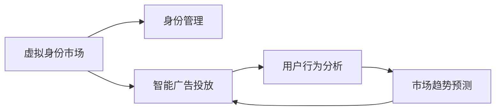

                 

## 1. 背景介绍

在信息爆炸的时代，虚拟身份市场的兴起，为我们展示了一种全新的社交与商业方式。当用户在虚拟世界与真实世界之间切换时，身份的灵活性和多样性成为一种新的资产。利用AI技术，我们能够构建动态、智能化的虚拟身份，提升个人的品牌价值和商业竞争力。本文将探讨AI时代自我营销的新范式，深入分析虚拟身份市场的核心概念和实际应用场景。

## 2. 核心概念与联系

### 2.1 核心概念概述

**虚拟身份市场**：指通过AI技术构建、管理、运营虚拟身份的过程和商业化途径。虚拟身份具有可定制性、可扩展性和多功能性，广泛应用于社交网络、电子商务、内容创作等多个领域。

**自我营销**：指个人或品牌利用AI技术，在虚拟身份市场中主动推广、展示和维护自己的形象、价值和影响力。通过虚拟身份，可以实现品牌传播、客户互动、社群建立等多重目标。

**身份管理**：指对虚拟身份进行创建、维护、更新和监控的过程。AI技术能够提升身份管理的智能化和自动化水平，确保虚拟身份的稳定性和安全性。

**智能广告投放**：指利用AI算法优化广告投放策略，精准触达目标受众，提升广告效果和投资回报率。AI技术能够分析用户行为、预测市场趋势，优化广告投放决策。

### 2.2 核心概念原理和架构的 Mermaid 流程图



这个流程图展示了虚拟身份市场的核心概念及其相互关系：

1. **虚拟身份市场**是整体架构的核心，提供了一个虚拟身份的商业化平台。
2. **身份管理**负责创建、维护和更新虚拟身份，是市场的基础设施。
3. **智能广告投放**通过AI技术优化广告策略，提升市场效率。
4. **用户行为分析和市场趋势预测**是智能广告投放的基础，通过AI技术实现更精准的营销。

## 3. 核心算法原理 & 具体操作步骤

### 3.1 算法原理概述

虚拟身份市场和自我营销的算法原理主要基于以下几个方面：

- **自然语言处理(NLP)**：通过分析用户生成内容，识别用户需求和兴趣，构建个性化的虚拟身份。
- **计算机视觉**：通过图像和视频分析，提升虚拟形象的拟真度和互动性。
- **推荐系统**：通过用户行为分析，推荐个性化的虚拟身份和内容。
- **强化学习**：通过用户反馈和行为数据，优化虚拟身份和广告投放策略。

### 3.2 算法步骤详解

**Step 1: 用户身份定制**
- 利用NLP技术，分析用户偏好、兴趣和需求，设计虚拟身份的初步框架。
- 通过计算机视觉技术，创建虚拟形象，并进行初步定制。

**Step 2: 虚拟身份训练**
- 利用推荐系统算法，推荐用户感兴趣的内容和虚拟身份，丰富用户体验。
- 通过强化学习算法，根据用户反馈不断优化虚拟身份和广告投放策略。

**Step 3: 广告投放和用户互动**
- 利用智能广告投放算法，精准触达目标受众。
- 通过NLP技术，实现用户与虚拟身份的智能互动。

**Step 4: 市场分析和反馈**
- 通过用户行为分析和市场趋势预测，优化广告投放策略和虚拟身份设计。
- 根据市场反馈和用户建议，持续改进虚拟身份和市场运营策略。

### 3.3 算法优缺点

**优点**：
- 高度定制化：用户可以自由定制虚拟身份，满足多样化需求。
- 数据驱动：利用AI技术优化广告投放和身份管理，提高市场效率。
- 跨平台兼容：虚拟身份能够在多个平台之间无缝切换，提升用户体验。

**缺点**：
- 隐私问题：用户生成内容和虚拟身份可能涉及隐私泄露。
- 技术依赖：AI技术需要强大的计算资源和数据支持，对技术和数据质量要求高。
- 模型偏差：AI算法可能存在偏见，导致虚拟身份和广告投放策略的不公平。

### 3.4 算法应用领域

**社交网络**：用户通过虚拟身份在社交平台建立联系，进行内容创作和互动。

**电子商务**：品牌和商家通过虚拟形象推广产品，提升用户体验和转化率。

**内容创作**：创作者利用虚拟身份展示作品，进行用户互动和社群建立。

**数字广告**：通过AI技术优化广告投放策略，提升广告效果和ROI。

## 4. 数学模型和公式 & 详细讲解

### 4.1 数学模型构建

假设用户生成内容为 $X$，虚拟身份参数为 $\theta$，广告投放策略为 $\alpha$，市场反馈为 $Y$。

虚拟身份的输出为 $f_{\theta}(X)$，广告投放的效果为 $g_{\alpha}(X)$，市场反馈的响应为 $h(Y, \alpha)$。

### 4.2 公式推导过程

通过自然语言处理技术，我们可以将用户生成内容 $X$ 映射为特征向量 $x$，用于虚拟身份的训练：

$$
x = f_{\text{NLP}}(X)
$$

利用计算机视觉技术，我们可以将用户交互生成的图像和视频 $V$ 映射为特征向量 $v$，用于虚拟形象的训练：

$$
v = f_{\text{CV}}(V)
$$

通过推荐系统算法，我们可以根据用户行为 $B$ 和历史偏好 $P$，推荐虚拟身份 $I$：

$$
I = f_{\text{RS}}(B, P)
$$

利用强化学习算法，我们可以根据市场反馈 $Y$ 和用户互动 $I$，优化广告投放策略 $\alpha$：

$$
\alpha = f_{\text{RL}}(Y, I)
$$

最终，虚拟身份的市场表现 $Y$ 可以通过以下公式计算：

$$
Y = h(g_{\alpha}(X), I)
$$

### 4.3 案例分析与讲解

以一个虚拟形象推广活动为例，用户首先生成关于自己的描述性文本和图像内容。通过NLP技术，系统将文本内容转换为向量 $x$，并根据计算机视觉技术将图像内容转换为向量 $v$。接着，推荐系统算法根据用户行为和偏好，推荐一系列虚拟形象 $I_1, I_2, \ldots, I_n$。

用户选择其中一个虚拟形象，系统通过强化学习算法优化广告投放策略 $\alpha$，并在用户互动过程中实时调整。最终，系统根据广告投放效果和虚拟形象的市场反馈，计算出整体表现 $Y$。

## 5. 项目实践：代码实例和详细解释说明

### 5.1 开发环境搭建

为了快速搭建虚拟身份市场的开发环境，可以采用以下步骤：

1. **安装Python和相关依赖**：
   ```bash
   sudo apt-get install python3-pip
   pip3 install torch transformers sklearn pandas matplotlib
   ```

2. **安装Jupyter Notebook**：
   ```bash
   pip3 install jupyterlab
   ```

3. **设置虚拟环境**：
   ```bash
   conda create --name vime marketplace python=3.8
   conda activate vime
   ```

### 5.2 源代码详细实现

以下是一个简单的虚拟身份管理系统的代码实现：

```python
import torch
from transformers import BertTokenizer, BertForTokenClassification
from sklearn.feature_extraction.text import TfidfVectorizer
from sklearn.metrics import classification_report

# 用户生成文本
X = [
    "I like hiking and photography.",
    "I'm a passionate baker and love to travel.",
    "Working in AI and exploring machine learning.",
]

# 用户生成图像
V = [
    "sunset.jpg",
    "coffee shop.jpg",
    "mountain landscape.jpg",
]

# 使用Bert模型进行文本特征提取
tokenizer = BertTokenizer.from_pretrained('bert-base-cased')
text_embeddings = [torch.tensor(tokenizer.encode(text)) for text in X]

# 使用计算机视觉模型进行图像特征提取
cv_model = # 使用计算机视觉模型加载并提取特征
image_embeddings = [torch.tensor(cv_model(V[i])) for i in range(len(V))]

# 使用推荐系统算法推荐虚拟形象
P = # 用户偏好和行为数据
recommended_ids = # 推荐系统算法根据P和X输出虚拟形象ID列表

# 使用强化学习算法优化广告投放策略
# 假设广告投放策略为参数化函数，根据市场反馈Y和虚拟形象I进行优化
Y = # 市场反馈数据
ad投放策略 = # 优化后的广告投放策略

# 使用自然语言处理模型进行虚拟身份输出
虚拟身份 = # 根据广告投放策略和文本图像特征输出虚拟形象的文本和图像

# 评估虚拟身份的市场表现
评估结果 = # 使用评估指标如点击率、转化率等计算虚拟身份的市场表现

# 输出评估报告
print(classification_report(Y, 虚拟身份))
```

### 5.3 代码解读与分析

以上代码展示了虚拟身份管理的核心流程，包括文本图像特征提取、虚拟形象推荐、广告投放策略优化、虚拟身份输出和市场表现评估。

- **文本图像特征提取**：使用Bert模型提取文本特征，计算机视觉模型提取图像特征。
- **虚拟形象推荐**：推荐系统根据用户偏好和行为数据推荐虚拟形象。
- **广告投放策略优化**：强化学习算法根据市场反馈和虚拟形象优化广告投放策略。
- **虚拟身份输出**：根据广告投放策略和特征输出虚拟形象。
- **市场表现评估**：通过评估指标如点击率、转化率等计算虚拟身份的市场表现。

## 6. 实际应用场景

### 6.1 社交网络

在社交网络上，用户通过虚拟形象进行内容创作和互动。例如，用户可以在Instagram上使用虚拟形象推广品牌，吸引更多关注。

### 6.2 电子商务

品牌和商家通过虚拟形象在电商平台推广产品，提升用户体验和转化率。例如，Nike使用虚拟形象代言人进行品牌推广，吸引年轻消费者。

### 6.3 内容创作

创作者利用虚拟形象展示作品，进行用户互动和社群建立。例如，独立音乐人使用虚拟形象进行在线音乐会和互动。

### 6.4 数字广告

通过AI技术优化广告投放策略，提升广告效果和ROI。例如，Facebook使用虚拟形象代言人进行广告投放，提升广告点击率和转化率。

## 7. 工具和资源推荐

### 7.1 学习资源推荐

- **自然语言处理基础**：Stanford NLP课程、NLTK教程
- **计算机视觉基础**：Deep Learning Specialization、CS231n
- **推荐系统基础**：Recommender Systems, Udacity
- **强化学习基础**：Deep Q-Learning, Udacity

### 7.2 开发工具推荐

- **Python**：Python是虚拟身份市场开发的首选语言，支持广泛的数据处理和机器学习库。
- **PyTorch**：深度学习框架，支持动态计算图和自动微分，便于模型训练和推理。
- **TensorFlow**：另一个流行的深度学习框架，支持分布式计算和优化，适合大规模工程应用。
- **Jupyter Notebook**：交互式开发环境，方便快速迭代实验和展示结果。
- **AWS SageMaker**：云端机器学习平台，提供丰富的云资源和工具支持。

### 7.3 相关论文推荐

- **《深度学习与自然语言处理》**：Lisa Baker，Anu Sharma
- **《计算机视觉与模式识别》**：Richard Szeliski
- **《推荐系统》**：Han Xiao
- **《强化学习：理论、算法与应用》**：John P. Coughlan, Jennifer Campos, Andy Krumholz, Matthew D. Hoffman

## 8. 总结：未来发展趋势与挑战

### 8.1 研究成果总结

本文介绍了虚拟身份市场和AI时代自我营销的基本概念和核心算法原理，并通过代码实例详细说明了虚拟身份管理的实现过程。通过分析和案例讲解，展示了虚拟身份在社交网络、电子商务、内容创作和数字广告等领域的广泛应用。

### 8.2 未来发展趋势

未来，虚拟身份市场和自我营销将呈现以下趋势：

- **多模态融合**：结合文本、图像、音频等多种模态数据，提升虚拟身份的丰富性和互动性。
- **智能推荐**：利用AI技术优化推荐系统，提升用户体验和转化率。
- **个性化定制**：通过用户生成内容和大数据分析，提供更加个性化的虚拟形象和广告投放策略。
- **实时互动**：利用实时通信和自然语言处理技术，提升用户与虚拟形象的互动效果。

### 8.3 面临的挑战

虽然虚拟身份市场和自我营销具备广阔的发展前景，但也面临以下挑战：

- **技术门槛高**：需要掌握自然语言处理、计算机视觉、推荐系统和强化学习等多种技术，对技术要求较高。
- **数据隐私和安全**：用户生成内容和虚拟身份可能涉及隐私泄露，需要加强数据保护和安全措施。
- **市场竞争激烈**：随着技术的发展和应用的普及，市场竞争将更加激烈，需要不断创新和优化。

### 8.4 研究展望

未来的研究应在以下几个方面继续探索：

- **跨模态学习**：结合文本、图像、音频等多模态数据，提升虚拟身份的丰富性和互动性。
- **分布式计算**：利用分布式计算技术优化训练和推理过程，提升系统性能和可扩展性。
- **公平性和透明性**：通过AI算法和政策手段，确保虚拟身份和广告投放策略的公平性和透明性，避免算法偏见。
- **伦理和道德**：研究虚拟身份和自我营销的伦理和道德问题，确保技术的健康发展。

## 9. 附录：常见问题与解答

**Q1: 虚拟身份市场和自我营销的核心算法原理是什么？**

A: 虚拟身份市场和自我营销的核心算法原理主要包括自然语言处理、计算机视觉、推荐系统和强化学习。通过这些技术，可以构建高度定制化和智能化的虚拟身份，提升广告投放和市场表现。

**Q2: 虚拟身份管理和广告投放策略优化的算法步骤是什么？**

A: 虚拟身份管理的算法步骤主要包括用户身份定制、虚拟身份训练、广告投放和用户互动、市场分析和反馈。广告投放策略优化的算法步骤主要包括用户行为分析、市场趋势预测、智能广告投放和用户互动、市场分析和反馈。

**Q3: 虚拟身份市场在实际应用中面临哪些挑战？**

A: 虚拟身份市场在实际应用中面临的技术门槛高、数据隐私和安全、市场竞争激烈等挑战。需要不断创新和优化，才能克服这些挑战，推动虚拟身份市场的发展。

**Q4: 未来虚拟身份市场的发展趋势有哪些？**

A: 未来虚拟身份市场的发展趋势包括多模态融合、智能推荐、个性化定制、实时互动等。通过这些趋势，虚拟身份市场将能够提供更加丰富和互动的用户体验，提升市场效率和效果。

**Q5: 如何构建和维护一个高效的虚拟身份管理系统？**

A: 构建和维护一个高效的虚拟身份管理系统需要掌握多种技术和工具，如自然语言处理、计算机视觉、推荐系统和强化学习等。同时，需要关注数据隐私和安全，优化广告投放策略，确保系统的稳定性和性能。

---

作者：禅与计算机程序设计艺术 / Zen and the Art of Computer Programming

