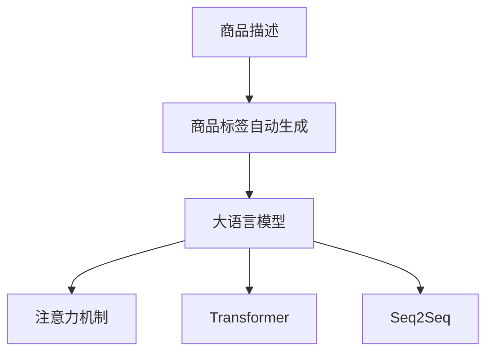

                 

# 融合AI大模型的商品标签自动生成

## 1. 背景介绍

在当今数字化和智能化的零售市场，商品标签自动生成技术正逐渐成为电商、零售和供应链管理的重要工具。通过自动生成精确的商品标签，可以提高产品信息准确性，提升搜索效率，优化库存管理，改善用户体验。然而，传统的基于规则或人工标签的方案存在灵活性差、成本高、效率低等问题，难以满足快速变化的电商市场需求。

近年来，随着大规模预训练语言模型的发展，商品标签自动生成技术迎来了新的突破。借助大模型强大的自然语言处理能力，可以自动从商品描述、用户评论、商品属性等文本信息中提取出有价值的语义信息，生成精准的商品标签。这不仅能显著降低人工标注成本，还能大幅提升标签生成的速度和质量。

本文将全面介绍基于大模型的商品标签自动生成技术，从核心概念、算法原理到实际应用场景，带您深入了解这一前沿领域的最新进展和实践技巧。

## 2. 核心概念与联系

### 2.1 核心概念概述

本节将介绍几个关键概念及其相互关系：

- **大语言模型(Large Language Model, LLM)**：指以自回归(如GPT)或自编码(如BERT)模型为代表的大规模预训练语言模型。通过在大规模无标签文本语料上进行预训练，学习通用语言表示，具备强大的语言理解和生成能力。

- **商品标签自动生成**：指通过大语言模型自动从商品文本信息中抽取特征，生成与商品相关联的语义标签，用于商品管理、搜索和推荐。

- **序列到序列(Sequence-to-Sequence, Seq2Seq)**：一种基于神经网络的语言处理范式，常用于文本生成、翻译等任务。商品标签自动生成任务也可以看作一种Seq2Seq问题，其中输入是商品描述、评论等文本，输出是商品标签。

- **注意力机制(Attention Mechanism)**：用于处理长序列信息的机制，通过计算输入序列中不同位置的信息对输出序列的贡献，实现长序列和短序列的对齐。

- **Transformer**：一种用于神经网络序列处理的模型，采用自注意力机制，可以高效处理长序列，广泛用于机器翻译、文本生成、语言模型等任务。

这些概念通过合法的逻辑关系相互连接，形成完整的商品标签自动生成技术框架。

### 2.2 核心概念原理和架构的 Mermaid 流程图(Mermaid 流程节点中不要有括号、逗号等特殊字符)



## 3. 核心算法原理 & 具体操作步骤
### 3.1 算法原理概述

基于大模型的商品标签自动生成算法主要包括以下几个步骤：

1. **数据预处理**：将商品描述、用户评论等文本数据进行清洗、分词、编码等预处理。
2. **特征提取**：使用预训练语言模型(如BERT、GPT等)对文本进行特征提取，得到高维语义向量。
3. **模型训练**：在标注好的商品标签数据集上，训练一个Seq2Seq模型，以生成精确的商品标签。
4. **模型微调**：在特定领域语料上进行微调，提升模型在特定场景下的表现。

### 3.2 算法步骤详解

#### 数据预处理

数据预处理是商品标签自动生成任务的基础，其目的在于保证输入数据的质量和一致性。具体步骤包括：

1. **清洗**：去除无关的HTML标签、特殊字符，保留有效文本信息。
2. **分词**：将文本按词语切分成基本单元，便于模型处理。
3. **编码**：将分词后的文本转换为模型所需的张量表示，一般采用独热编码或词向量表示。
4. **标准化**：对文本进行统一大小写、去停用词等标准化处理，提高模型泛化能力。

#### 特征提取

特征提取阶段，主要使用预训练语言模型对文本进行编码，得到高维语义向量。具体步骤如下：

1. **加载模型**：选择适当的预训练语言模型(如BERT、GPT等)，并加载至内存。
2. **输入文本**：将商品描述、用户评论等文本输入模型，进行编码。
3. **输出向量**：模型输出商品的语义向量，作为后续标签生成任务的输入。

#### 模型训练

模型训练阶段，主要使用标注好的商品标签数据集，训练一个Seq2Seq模型，以生成精确的商品标签。具体步骤如下：

1. **模型选择**：选择合适的Seq2Seq模型，如Encoder-Decoder模型。
2. **定义损失函数**：通常采用交叉熵损失函数，用于衡量模型预测标签与真实标签之间的差异。
3. **训练模型**：使用标注数据集对模型进行有监督训练，更新模型参数以最小化损失函数。

#### 模型微调

模型微调阶段，主要在特定领域语料上进行微调，提升模型在特定场景下的表现。具体步骤如下：

1. **准备数据**：收集特定领域商品相关的文本数据，标注商品标签，形成微调数据集。
2. **冻结部分层**：保留预训练模型的底层，只微调顶层，减少需优化的参数。
3. **设置微调超参数**：选择合适的优化算法及其参数，如Adam、SGD等，设置学习率、批大小、迭代轮数等。
4. **微调模型**：在特定领域语料上进行微调，优化模型在特定场景下的表现。

### 3.3 算法优缺点

基于大模型的商品标签自动生成算法具有以下优点：

1. **高精度**：大模型强大的语义理解能力，能够自动提取文本中的关键信息，生成精确的商品标签。
2. **高效性**：预训练模型已经在海量的数据上进行过预训练，能够显著减少微调所需的数据量和训练时间。
3. **泛化能力强**：经过微调，模型能够适应特定领域的数据，提升在不同场景下的表现。

同时，该算法也存在一些缺点：

1. **依赖标注数据**：微调过程需要大量标注数据，标注成本较高。
2. **模型复杂**：大模型通常结构复杂，内存和计算资源需求高，部署难度大。
3. **鲁棒性不足**：模型在特定领域或长尾数据上的表现可能不稳定，泛化能力有待提升。

### 3.4 算法应用领域

基于大模型的商品标签自动生成算法，已经广泛应用于以下几个领域：

1. **电商商品管理**：帮助电商平台自动生成商品标签，提升商品信息准确性和搜索效率。
2. **零售库存管理**：通过商品标签，优化库存调配，提高库存周转率。
3. **推荐系统**：将商品标签作为推荐算法的一部分，提升个性化推荐效果。
4. **智能客服**：通过商品标签，快速匹配用户咨询的商品，提供精准的客服信息。
5. **供应链管理**：优化供应链环节的商品分类和管理，提升物流效率。

## 4. 数学模型和公式 & 详细讲解 & 举例说明

### 4.1 数学模型构建

假设商品描述为 $X$，商品标签为 $Y$，商品标签自动生成模型为 $M$。我们的目标是训练一个模型 $M$，使得给定商品描述 $X$，模型能够自动生成正确的商品标签 $Y$。

### 4.2 公式推导过程

在商品标签自动生成的Seq2Seq框架中，可以使用Transformer模型进行特征提取和标签生成。Transformer模型主要由自注意力机制和前馈神经网络组成，具有高效的并行计算能力。

具体推导如下：

设商品描述 $X$ 长度为 $n$，商品标签 $Y$ 长度为 $m$。

1. **输入层**：将商品描述 $X$ 转换为词向量表示，记为 $x_1, x_2, ..., x_n$。
2. **编码器**：使用Transformer模型对商品描述 $X$ 进行编码，得到语义向量 $H_1, H_2, ..., H_n$。
3. **解码器**：使用另一个Transformer模型对语义向量 $H_n$ 进行解码，生成商品标签 $Y$ 的概率分布，记为 $p(y_1, y_2, ..., y_m)$。
4. **损失函数**：定义交叉熵损失函数 $L$ 为：
   $$
   L = -\sum_{i=1}^m p(y_i) \log \hat{p}(y_i)
   $$
   其中，$\hat{p}(y_i)$ 为模型预测的商品标签概率。

### 4.3 案例分析与讲解

以BERT模型为例，展示如何利用大模型进行商品标签自动生成。

1. **数据预处理**：将商品描述进行清洗、分词，并转换为BERT模型所需的独热编码。
2. **特征提取**：使用预训练的BERT模型对商品描述进行编码，得到语义向量。
3. **模型训练**：在标注好的商品标签数据集上训练一个Transformer模型，最小化交叉熵损失函数。
4. **模型微调**：在特定领域商品相关的文本数据上进行微调，提升模型在该领域的表现。

## 5. 项目实践：代码实例和详细解释说明

### 5.1 开发环境搭建

在商品标签自动生成任务中，需要搭建一个Python开发环境，具体步骤如下：

1. **安装Python和虚拟环境**：使用Anaconda或pip安装Python 3.7及以上版本，并创建虚拟环境。
2. **安装相关库**：使用pip安装TensorFlow、PyTorch、transformers等常用库。
3. **设置GPU**：若使用GPU加速，需要配置好CUDA和cuDNN，确保模型能够高效运行。

### 5.2 源代码详细实现

以下是一个基于BERT的序列到序列模型，用于商品标签自动生成的Python代码实现：

```python
import torch
import torch.nn as nn
import torch.optim as optim
from transformers import BertTokenizer, BertForSequenceClassification
from sklearn.model_selection import train_test_split
from torch.utils.data import DataLoader

# 加载预训练模型和分词器
model_name = 'bert-base-uncased'
tokenizer = BertTokenizer.from_pretrained(model_name)
model = BertForSequenceClassification.from_pretrained(model_name, num_labels=3)

# 数据加载
data_path = 'data/merchant_comments.txt'
with open(data_path, 'r') as f:
    data = f.read().split('\n')
    labels = [0, 1, 2] * 10  # 假设标签为0, 1, 2

# 数据预处理
inputs = [tokenizer.encode(comment) for comment in data]
labels = torch.tensor(labels)

# 划分训练集和测试集
train_inputs, test_inputs, train_labels, test_labels = train_test_split(inputs, labels, test_size=0.2)

# 模型训练
device = torch.device('cuda' if torch.cuda.is_available() else 'cpu')
model.to(device)
criterion = nn.CrossEntropyLoss()
optimizer = optim.Adam(model.parameters(), lr=2e-5)

# 训练循环
batch_size = 8
train_loader = DataLoader(train_inputs, train_labels, batch_size=batch_size, shuffle=True)
for epoch in range(5):
    for batch in train_loader:
        input_ids = batch[0].to(device)
        attention_mask = batch[1].to(device)
        labels = batch[2].to(device)
        model.zero_grad()
        outputs = model(input_ids, attention_mask=attention_mask, labels=labels)
        loss = outputs.loss
        loss.backward()
        optimizer.step()
        if (epoch + 1) % 1 == 0:
            print(f'Epoch {epoch+1}, Loss: {loss.item()}')

# 模型评估
test_loader = DataLoader(test_inputs, test_labels, batch_size=batch_size, shuffle=False)
with torch.no_grad():
    correct = 0
    total = 0
    for batch in test_loader:
        input_ids = batch[0].to(device)
        attention_mask = batch[1].to(device)
        labels = batch[2].to(device)
        outputs = model(input_ids, attention_mask=attention_mask, labels=labels)
        _, predicted = torch.max(outputs.logits, dim=1)
        total += labels.size(0)
        correct += (predicted == labels).sum().item()
    print(f'Accuracy: {correct / total * 100:.2f}%')
```

### 5.3 代码解读与分析

上述代码实现了使用BERT模型进行商品标签自动生成的过程，具体解析如下：

1. **数据加载与预处理**：从文件中加载商品描述和标签，并使用BertTokenizer对文本进行分词和编码。
2. **模型选择与配置**：选择BERT模型，并配置标签数量为3(假设标签为0, 1, 2)。
3. **模型训练**：在GPU上训练模型，使用Adam优化器和交叉熵损失函数。
4. **模型评估**：在测试集上评估模型性能，输出准确率。

## 6. 实际应用场景

### 6.1 电商商品管理

商品标签自动生成技术在电商商品管理中具有广泛应用。电商平台通过自动生成商品标签，可以提升商品信息的准确性，优化搜索结果，提高用户转化率。例如，亚马逊的商品信息页面，可以通过自动生成的标签，帮助用户快速找到所需商品，提升购物体验。

### 6.2 零售库存管理

在零售库存管理中，商品标签自动生成技术可以优化库存调配，提升库存周转率。通过自动生成的商品标签，可以更精确地统计和分析库存信息，避免库存积压或缺货。例如，沃尔玛可以利用商品标签自动生成技术，优化供应链管理，提升物流效率。

### 6.3 推荐系统

在推荐系统中，商品标签自动生成技术可以帮助提升个性化推荐效果。通过自动生成的商品标签，推荐算法可以更准确地理解用户需求，提供更符合预期的推荐结果。例如，淘宝可以根据用户评论自动生成商品标签，提升个性化推荐效果，增加用户粘性。

### 6.4 智能客服

在智能客服系统中，商品标签自动生成技术可以提高客服响应速度和准确性。通过自动生成的商品标签，智能客服可以更快速地匹配用户咨询的商品，提供精准的客服信息。例如，京东可以根据用户咨询的商品，自动生成商品标签，提供快速准确的客服解决方案。

## 7. 工具和资源推荐

### 7.1 学习资源推荐

1. **《Sequence to Sequence Learning with Neural Networks》论文**：这是深度学习领域经典论文，详细介绍了Seq2Seq模型的原理和实现，为商品标签自动生成任务提供了理论基础。
2. **Hugging Face官方文档**：提供了丰富的预训练模型和代码示例，帮助开发者快速上手商品标签自动生成任务。
3. **TensorFlow官方教程**：提供了丰富的深度学习模型和框架，帮助开发者进行模型训练和部署。

### 7.2 开发工具推荐

1. **Anaconda**：Python环境管理和依赖管理工具，方便开发者搭建和管理开发环境。
2. **PyTorch**：基于Python的深度学习框架，灵活高效的计算图，适用于序列到序列任务。
3. **Weights & Biases**：模型训练实验跟踪工具，可以记录和可视化模型训练过程中的各项指标，方便对比和调优。
4. **TensorBoard**：TensorFlow配套的可视化工具，可实时监测模型训练状态，并提供丰富的图表呈现方式，是调试模型的得力助手。

### 7.3 相关论文推荐

1. **《Attention Is All You Need》论文**：Transformer模型，使用自注意力机制，广泛应用于序列到序列任务。
2. **《BERT: Pre-training of Deep Bidirectional Transformers for Language Understanding》论文**：BERT模型，采用掩码语言模型和下采样任务，提升了语言理解能力。
3. **《Fine-tuning BERT for Sequence Generation》论文**：探讨了在大规模预训练语言模型上进行微调的方法，提升了微调效率和效果。

## 8. 总结：未来发展趋势与挑战

### 8.1 研究成果总结

本文介绍了基于大模型的商品标签自动生成技术，从核心概念到具体实现，涵盖了商品标签自动生成任务的全过程。通过理论与实践相结合，详细解析了商品标签自动生成的技术原理和实现步骤。

### 8.2 未来发展趋势

未来，基于大模型的商品标签自动生成技术将呈现以下几个发展趋势：

1. **模型规模增大**：随着算力成本的下降和数据规模的扩张，预训练语言模型的参数量还将持续增长。超大规模语言模型蕴含的丰富语言知识，将进一步提升商品标签自动生成任务的效果。
2. **模型效率提升**：在保证性能的同时，模型的推理速度和计算效率将不断提升，优化资源占用，提高系统响应速度。
3. **模型泛化能力增强**：通过更全面的数据和更多样化的任务，提升模型在不同场景下的泛化能力，减少过拟合风险。
4. **技术融合深化**：将更多前沿技术如知识图谱、因果推理等与商品标签自动生成任务相结合，提升模型的推理能力和应用范围。
5. **应用场景拓展**：商品标签自动生成技术将应用于更多领域，如智能客服、推荐系统、供应链管理等，推动各行业的数字化转型。

### 8.3 面临的挑战

尽管商品标签自动生成技术已经取得了显著进展，但在实现大规模落地应用的过程中，仍面临一些挑战：

1. **数据需求量大**：大规模数据集和标注数据是模型训练的基础，但标注成本较高，获取高质量数据难度大。
2. **模型复杂度高**：大模型结构复杂，资源需求高，部署和维护成本较高。
3. **泛化能力不足**：模型在不同场景下的泛化能力有待提升，尤其是在长尾数据和特定领域上。
4. **模型安全性**：模型可能存在偏见和有害信息，需要在模型训练和部署过程中加强安全防护。

### 8.4 研究展望

为应对以上挑战，未来的研究将重点关注以下几个方向：

1. **无监督学习和半监督学习**：探索无监督和半监督学习范式，减少标注数据的需求，提高数据利用效率。
2. **模型结构优化**：简化模型结构，优化推理速度，提高模型效率。
3. **多模态融合**：结合视觉、语音等模态信息，提升模型在多模态场景下的表现。
4. **模型鲁棒性增强**：提升模型在长尾数据和特定领域上的泛化能力，增强模型的鲁棒性和稳健性。
5. **模型安全性保障**：加强模型训练和部署过程中的安全性防护，确保模型输出的可靠性和安全性。

总之，商品标签自动生成技术将在未来的数字化和智能化浪潮中发挥重要作用，推动各行业的数字化转型和升级。通过不断创新和优化，相信商品标签自动生成技术将迎来更加广阔的应用前景和更高的技术水平。

## 9. 附录：常见问题与解答

**Q1：商品标签自动生成任务是否适用于所有商品？**

A: 商品标签自动生成任务通常适用于标准化程度较高的商品，如书籍、电子产品、服装等。对于非标准化商品，如艺术品、定制商品等，可能需要人工标注或结合其他信息进行标签生成。

**Q2：如何评估商品标签自动生成的效果？**

A: 商品标签自动生成效果的评估可以从多个维度进行，如准确率、召回率、F1值等。可以采用交叉验证等方法，评估模型在不同数据集上的表现，并结合领域专家反馈进行调整优化。

**Q3：商品标签自动生成任务是否需要标注数据？**

A: 商品标签自动生成任务通常需要标注数据进行微调，但通过无监督学习或半监督学习等技术，可以在一定程度上减少对标注数据的需求。

**Q4：商品标签自动生成任务是否存在偏见？**

A: 商品标签自动生成任务可能存在偏见，如性别、种族、地域等偏见，需要在模型训练和部署过程中加强安全防护，确保模型输出的公正性和公平性。

**Q5：如何提升商品标签自动生成的泛化能力？**

A: 提升商品标签自动生成的泛化能力，可以通过更多样化的数据、更全面的预训练模型、更灵活的微调策略等手段实现。同时，引入更多领域知识，结合因果推理等技术，提升模型的泛化能力和应用范围。

---

作者：禅与计算机程序设计艺术 / Zen and the Art of Computer Programming

