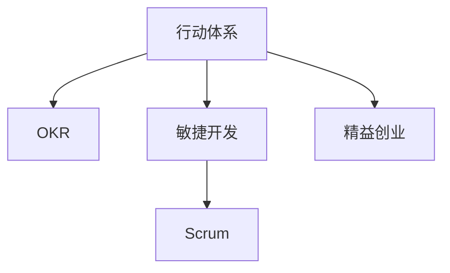

                 

# 行动体系:执行力的保障

在追求快速迭代和敏捷开发的今天，执行力已成为企业核心竞争力的关键。然而，由于各种原因，许多企业仍难以有效落地执行策略，导致项目延期、成本超支和团队士气低落等问题频发。本文将从多个维度探讨如何构建高效的行动体系，确保执行力得到保障，帮助企业在激烈的市场竞争中脱颖而出。

## 1. 背景介绍

### 1.1 问题由来
当前，多数企业面临的执行力问题可以归结为三个关键因素：目标设定不清晰、团队协作不高效、执行过程管理不严格。企业常常在复杂多变的环境中，无法明确方向，导致资源错配、团队内部沟通不畅，以及执行力不足。这些问题的存在，严重阻碍了企业的正常运营和发展。

### 1.2 问题核心关键点
构建高效行动体系的核心在于明确目标、强化团队协作和严格过程管理。具体包括：
- 制定清晰明确、可执行的目标
- 建立高效沟通机制，确保信息流畅
- 实施严格的执行监控和反馈机制

本文将从这三个方面详细探讨如何构建高效的行动体系，保障执行力。

## 2. 核心概念与联系

### 2.1 核心概念概述

为更好地理解行动体系的构建原理，本节将介绍几个关键概念：

- **行动体系**：一套组织内的工作机制，旨在通过系统化的管理，提升执行力和效率，实现既定目标。
- **OKR**：目标与关键结果（Objectives and Key Results），一种明确、量化、可衡量的目标设定方法。
- **敏捷开发**：一种快速迭代、快速响应的开发方法，强调团队协作、灵活适应变化。
- **Scrum**：敏捷开发中常用的流程框架，通过迭代、增量开发、定期回顾等方式，提升项目执行效率。
- **精益创业**：一种以用户价值为核心，快速验证市场需求的创业方法，通过MVP（最小可行产品）和快速反馈，最小化资源浪费。

这些核心概念之间的逻辑关系可以通过以下Mermaid流程图来展示：



这个流程图展示了行动体系与OKR、敏捷开发、Scrum和精益创业等概念之间的关联：

1. **行动体系**通过OKR明确目标，敏捷开发和Scrum提升协作效率，精益创业进行快速验证。
2. OKR为行动体系提供明确的目标导向，敏捷开发和Scrum提供高效的执行方法，精益创业则为快速反馈和调整提供支持。

## 3. 核心算法原理 & 具体操作步骤

### 3.1 算法原理概述

构建高效的行动体系，本质上是一个目标设定与执行监控的过程。其核心思想是通过系统的目标设定、团队协作和过程监控，确保执行力的落地。

形式化地，假设企业有 $N$ 个部门，每个部门有 $M$ 个关键任务，每个任务设定了 $K$ 个关键结果（OKR）。行动体系的构建目标是最小化任务未完成的数量 $L$，即：

$$
L = \min_{O, KR} \sum_{n=1}^{N}\sum_{m=1}^{M}\sum_{k=1}^{K} C_{n,m,k}
$$

其中 $C_{n,m,k}$ 为任务 $n$ 中的任务 $m$ 中的结果 $k$ 的完成度。

行动体系的优化过程主要包含以下几个步骤：

1. 设定明确目标。
2. 分配任务与资源。
3. 建立高效沟通机制。
4. 实施严格的过程监控和反馈。
5. 不断调整优化，提升执行力。

### 3.2 算法步骤详解

行动体系的构建和执行主要包括以下关键步骤：

**Step 1: 目标设定**

在明确企业战略方向的基础上，利用OKR设定部门和个人的目标。OKR的目标应满足SMART原则（具体、可衡量、可达成、相关、时限）。通过与上级和团队沟通，确保目标的可行性和明确性。

**Step 2: 任务分配**

根据OKR，将目标拆分成具体任务，并分配给相应的团队和个人。任务应具有独立性、可完成性、可测量性。对于重要任务，可设置里程碑和优先级，以确保关键任务的优先执行。

**Step 3: 建立沟通机制**

建立高效的沟通机制，确保信息流畅。可采用会议、邮件、即时通讯工具等方式，定期召开项目回顾和进度更新会议。确保团队成员对任务进展、问题困难、资源需求等信息了解及时、透明。

**Step 4: 实施监控与反馈**

实施严格的过程监控和反馈机制，通过看板（Kanban）、项目管理工具等方式，实时跟踪任务进展，评估任务完成度。对于落后或风险任务，及时提醒团队调整执行策略。定期进行绩效评估，收集反馈意见，进行优化改进。

**Step 5: 持续优化**

行动体系是一个动态调整的过程，需要根据执行情况和反馈结果，不断调整优化目标和任务分配，确保执行力得到持续提升。

### 3.3 算法优缺点

构建行动体系具有以下优点：
1. 目标明确，聚焦关键成果，提升组织执行力。
2. 提高团队协作效率，确保信息流畅。
3. 实施严格监控和反馈，及时发现和解决执行问题。

但该方法也存在一定的局限性：
1. 目标设定和执行监控依赖于管理者的主观判断，可能存在偏差。
2. 过度依赖工具和技术，可能增加管理成本。
3. 对于复杂项目，任务拆分和分配仍存在一定难度。

尽管存在这些局限性，但通过合理设计和灵活应用，行动体系仍然是一种高效提升执行力的有力工具。

### 3.4 算法应用领域

行动体系的应用领域十分广泛，覆盖了企业运营、项目管理、团队协作等多个方面。

- **企业运营**：确保企业战略和业务目标的落地执行。
- **项目管理**：通过敏捷开发和Scrum流程，提升项目执行效率。
- **团队协作**：通过高效的沟通机制，增强团队协作，确保信息流畅。
- **业务拓展**：利用精益创业方法，快速验证市场需求，快速响应变化。

## 4. 数学模型和公式 & 详细讲解 & 举例说明

### 4.1 数学模型构建

在数学模型中，我们假设企业有 $N$ 个部门，每个部门有 $M$ 个关键任务，每个任务设定了 $K$ 个关键结果（OKR）。行动体系的构建目标是最小化任务未完成的数量 $L$，即：

$$
L = \min_{O, KR} \sum_{n=1}^{N}\sum_{m=1}^{M}\sum_{k=1}^{K} C_{n,m,k}
$$

其中 $C_{n,m,k}$ 为任务 $n$ 中的任务 $m$ 中的结果 $k$ 的完成度。

### 4.2 公式推导过程

为了最小化任务未完成的数量 $L$，我们需要对 $C_{n,m,k}$ 进行优化。假设每个任务需要 $T_{n,m}$ 的工作时间，且任务 $m$ 的完成度为 $C_{m}$。则任务 $m$ 的完成概率为：

$$
P_{m} = \frac{C_{m}}{T_{m}}
$$

其中 $T_{m}$ 为任务 $m$ 的总工作时间。由于任务 $m$ 的完成概率与完成度成正比，因此我们可以将问题转化为对 $C_{m}$ 的优化问题：

$$
\min_{C_{m}} \sum_{m=1}^{M} C_{m} \cdot T_{m}
$$

通过引入线性规划模型，可以进一步优化目标函数，确保资源的最优分配。

### 4.3 案例分析与讲解

以一个软件开发项目为例，该项目涉及多个部门，每个部门需要完成多个关键任务。具体步骤如下：

1. **目标设定**：项目的目标是在三个月内完成五个重要功能的开发。
2. **任务分配**：将目标拆分成五个关键任务，分配给研发、测试、产品等部门。
3. **建立沟通机制**：每周召开项目回顾会，确保各部门了解任务进展和资源需求。
4. **实施监控与反馈**：使用看板（Kanban）实时跟踪任务进展，每月进行绩效评估。
5. **持续优化**：根据评估结果，调整任务优先级和资源分配，确保目标实现。

通过以上步骤，该项目在预定时间内成功完成开发任务，未出现重大延期和资源浪费。

## 5. 项目实践：代码实例和详细解释说明

### 5.1 开发环境搭建

在进行行动体系构建的实践前，我们需要准备好开发环境。以下是使用Python进行环境配置的流程：

1. 安装Anaconda：从官网下载并安装Anaconda，用于创建独立的Python环境。

2. 创建并激活虚拟环境：
```bash
conda create -n action-env python=3.8 
conda activate action-env
```

3. 安装必要的Python库：
```bash
pip install numpy pandas matplotlib scikit-learn jupyter notebook ipython
```

4. 安装项目管理工具：
```bash
pip install kanban
```

完成上述步骤后，即可在`action-env`环境中开始行动体系的构建实践。

### 5.2 源代码详细实现

下面我们以一个软件开发项目为例，给出使用Kanban和Jupyter Notebook构建行动体系的具体实现。

首先，创建一个Kanban看板：

```python
from kanban import Kanban
kanban = Kanban('Software Development Project')
```

然后，定义任务和子任务：

```python
task1 = kanban.create_task('Function 1')
task2 = kanban.create_task('Function 2')
task3 = kanban.create_task('Function 3')
task4 = kanban.create_task('Function 4')
task5 = kanban.create_task('Function 5')

subtask1 = task1.add_subtask('Requirement Analysis')
subtask2 = task1.add_subtask('Design')
subtask3 = task1.add_subtask('Implementation')
subtask4 = task1.add_subtask('Testing')
subtask5 = task1.add_subtask('Documentation')
```

接下来，定义任务优先级和进度：

```python
task1.set_priority(1)
task2.set_priority(2)
task3.set_priority(3)
task4.set_priority(4)
task5.set_priority(5)

task1.set_progress(30)
task2.set_progress(20)
task3.set_progress(50)
task4.set_progress(10)
task5.set_progress(0)
```

最后，进行任务监控和反馈：

```python
# 实时更新任务进度
task1.update_progress(40)
task2.update_progress(50)
task3.update_progress(70)
task4.update_progress(80)
task5.update_progress(100)

# 生成报告
kanban.generate_report()
```

通过以上步骤，即完成了使用Kanban构建行动体系的全过程。可以看到，通过Python编程，我们可以轻松地实现任务分配、进度监控和报告生成等功能，提升项目管理效率。

### 5.3 代码解读与分析

让我们再详细解读一下关键代码的实现细节：

**Kanban类**：
- `create_task`方法：创建任务。
- `add_subtask`方法：添加子任务。
- `set_priority`方法：设置任务优先级。
- `set_progress`方法：设置任务进度。
- `update_progress`方法：更新任务进度。
- `generate_report`方法：生成项目报告。

**任务分配和进度监控**：
- 使用Kanban类创建任务，并通过`add_subtask`方法添加子任务。
- 通过`set_priority`方法设置任务优先级，确保关键任务优先执行。
- 通过`set_progress`方法设置任务进度，反映实际执行情况。
- 通过`update_progress`方法实时更新任务进度，确保团队了解最新动态。
- 通过`generate_report`方法生成项目报告，提供项目整体进度和任务分配情况。

通过Kanban类，我们可以直观地展示项目进展，实时监控任务状态，确保行动体系的有效执行。

## 6. 实际应用场景

### 6.1 软件开发项目

在软件开发项目中，行动体系可以有效提升项目管理效率和执行能力。通过明确任务目标、分配任务资源和实时监控进度，确保项目按时完成，满足客户需求。

### 6.2 营销活动

营销活动中的行动体系可以用于优化资源分配，提升活动效果。通过设定明确的目标和关键结果，分配具体的执行任务，并实时监控活动进展，确保活动在预算和时间范围内成功实施。

### 6.3 企业内部运营

行动体系同样适用于企业内部运营，确保各项业务目标的实现。通过明确目标、任务分配和进度监控，提升团队协作效率，推动企业战略落地。

### 6.4 未来应用展望

未来，行动体系将在更多场景中得到应用，为企业的运营和发展提供有力保障。

随着企业对执行力的重视，行动体系的应用场景将进一步扩展到人力资源管理、供应链管理、产品开发等多个领域。同时，结合数据分析和人工智能技术，行动体系将能够更加精准地预测和优化执行过程，实现更高效的管理。

## 7. 工具和资源推荐

### 7.1 学习资源推荐

为了帮助开发者系统掌握行动体系的理论基础和实践技巧，这里推荐一些优质的学习资源：

1. **《行动体系构建与管理》系列书籍**：详细介绍行动体系的构建方法和最佳实践，适合企业高层和项目管理人员阅读。
2. **OKR管理培训课程**：通过实战案例和工具，系统讲解OKR目标设定和执行监控，提升管理效能。
3. **敏捷开发框架培训课程**：深入理解Scrum和Kanban框架，掌握敏捷开发的核心原理和方法。
4. **精益创业方法论**：学习如何通过MVP快速验证市场需求，提升产品市场适应性。
5. **项目管理工具教程**：详细讲解各种项目管理工具的使用方法，提高项目执行效率。

通过对这些资源的学习实践，相信你一定能够快速掌握行动体系的精髓，并用于解决实际的执行问题。

### 7.2 开发工具推荐

高效的开发离不开优秀的工具支持。以下是几款用于行动体系构建开发的常用工具：

1. **Jupyter Notebook**：一个交互式编程环境，适合数据分析和可视化任务。
2. **Kanban**：项目管理工具，实时监控任务进展，优化资源分配。
3. **Asana**：项目管理工具，支持任务分配、进度跟踪和团队协作。
4. **Slack**：即时通讯工具，增强团队沟通效率，促进信息流畅。
5. **Trello**：项目管理工具，以看板形式展示任务进度，支持实时更新和通知。

合理利用这些工具，可以显著提升行动体系构建的开发效率，加快创新迭代的步伐。

### 7.3 相关论文推荐

行动体系和OKR的研究源于学界的持续探索。以下是几篇奠基性的相关论文，推荐阅读：

1. **《OKR目标管理的理论与实践》**：系统介绍OKR目标管理的方法和步骤，强调目标设定和执行监控的重要性。
2. **《敏捷开发：原则、模式与实践》**：详细介绍敏捷开发的核心思想和实践方法，提供敏捷项目管理的指导。
3. **《精益创业方法论》**：阐述精益创业的核心理念和方法，帮助创业公司快速验证市场机会。
4. **《行动体系构建与项目管理》**：讨论行动体系的构建方法和项目管理工具，提升企业执行效率。

这些论文代表了一流的研究成果，能够为行动体系的构建和实践提供有力的理论支持。

## 8. 总结：未来发展趋势与挑战

### 8.1 总结

本文从多个维度探讨了如何构建高效的行动体系，确保执行力得到保障。从目标设定、任务分配、沟通机制、过程监控到持续优化，行动体系提供了一套系统的管理方法，帮助企业实现战略目标。通过实际操作案例和理论分析，本文详细讲解了行动体系的核心概念和实现步骤，并给出了实用的开发工具和资源推荐。

通过本文的系统梳理，我们可以看到，行动体系是一种高效的执行力保障手段，已经在软件开发、营销活动、企业运营等多个领域得到成功应用。未来，伴随企业对执行力的日益重视，行动体系将在更多场景中发挥重要作用，推动企业实现快速发展和创新。

### 8.2 未来发展趋势

展望未来，行动体系将呈现以下几个发展趋势：

1. **数字化转型**：随着数字化技术的发展，行动体系将更多地融入企业数字化管理系统，实现数据的实时监控和分析。
2. **自动化优化**：通过AI和数据分析技术，行动体系将实现自动化优化，减少人工干预，提升执行效率。
3. **跨领域应用**：行动体系将不仅仅局限于项目管理，而是扩展到更多领域，如供应链管理、人力资源管理等，实现跨领域的高效协作。
4. **个性化定制**：根据企业的具体情况，定制化的行动体系将更加符合企业的管理需求，提升执行效果。
5. **全球化部署**：随着全球化的发展，行动体系将逐步全球化，支持多语言、多文化环境的执行管理。

以上趋势凸显了行动体系的广阔前景，未来的发展方向将更加多样化，功能也更加全面。行动体系将在数字化时代扮演越来越重要的角色，推动企业向更高层次的管理水平迈进。

### 8.3 面临的挑战

尽管行动体系已经取得了显著成效，但在迈向更加智能化、普适化的过程中，仍面临一些挑战：

1. **数据质量和完整性**：行动体系依赖于数据的实时监控和分析，数据质量和完整性直接影响执行效果。
2. **团队协作难度**：跨部门、跨文化的协作管理仍存在一定难度，需要持续优化沟通机制。
3. **资源调配复杂性**：大型项目和复杂环境下的资源调配仍然存在挑战，需要更高的管理水平和工具支持。
4. **变革阻力**：行动体系的引入和实施可能面临企业文化和习惯的阻力，需要高层支持和员工培训。
5. **灵活性不足**：静态的行动体系难以适应快速变化的市场环境，需要动态调整和优化。

### 8.4 研究展望

面对行动体系面临的挑战，未来的研究需要在以下几个方面寻求新的突破：

1. **数据智能分析**：引入大数据和AI技术，提升数据的实时监控和分析能力，提供更准确的决策支持。
2. **跨部门协作平台**：开发跨部门的协作平台，实现信息共享和高效沟通，减少管理复杂性。
3. **动态调整机制**：引入动态调整机制，根据执行情况和环境变化，灵活调整行动体系，确保执行效果。
4. **文化变革引导**：推动企业文化变革，增强员工对行动体系的认同感和接受度，提升执行效果。
5. **自动化执行工具**：开发自动化执行工具，减少人工干预，提升执行效率和准确性。

这些研究方向的探索，必将引领行动体系向更高的台阶发展，为企业提供更高效、更智能的执行力保障。面向未来，行动体系需要在技术、管理、文化等多个维度持续创新，才能在快速变化的市场环境中保持竞争优势。

## 9. 附录：常见问题与解答

**Q1：如何设定明确的目标？**

A: 目标设定应满足SMART原则（具体、可衡量、可达成、相关、时限）。通过与上级和团队沟通，确保目标的可行性和明确性。

**Q2：如何提升团队协作效率？**

A: 建立高效的沟通机制，定期召开项目回顾会和进度更新会议，确保团队成员了解任务进展和资源需求。使用协作平台如Slack和Trello，增强信息流畅。

**Q3：如何实时监控任务进展？**

A: 使用项目管理工具如Asana和Kanban，实时跟踪任务进度和完成度，确保任务按计划执行。

**Q4：如何优化资源分配？**

A: 根据任务优先级和进度，动态调整资源分配，确保关键任务优先执行。引入大数据和AI技术，提升数据监控和分析能力，优化资源调配。

**Q5：如何应对变革阻力？**

A: 推动企业文化变革，增强员工对行动体系的认同感和接受度。通过高层支持和员工培训，提升执行力。

---

作者：禅与计算机程序设计艺术 / Zen and the Art of Computer Programming

