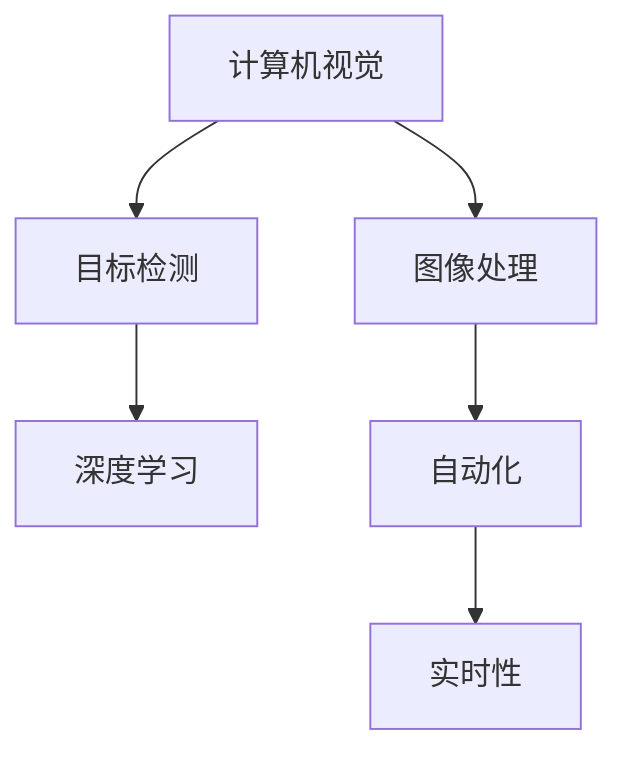

                 

# 计算机视觉在工业检测中的应用

> 关键词：计算机视觉, 工业检测, 图像处理, 目标检测, 深度学习, 神经网络, 实时检测, 自动化

## 1. 背景介绍

### 1.1 问题由来

随着工业化进程的不断加快，对于产品质量的严格把控已成为企业竞争力的关键。传统的质量检测依赖于人工检查，不仅效率低下，还易受操作人员疲劳和情绪影响，检测结果存在一定主观性。计算机视觉技术通过自动化、数字化方式，解决了这些问题，极大提升了质量检测的准确性和效率。

计算机视觉技术在工业检测中的应用，主要分为两大类：一是视觉检测，即通过图像处理技术，检测产品表面的缺陷和瑕疵；二是目标检测，即在图像中识别和定位特定物体或组件，用于设备维护和自动化生产。这些应用不仅提高了生产效率，还显著降低了人力成本和产品质量波动。

### 1.2 问题核心关键点

计算机视觉在工业检测中的应用，主要依赖于图像处理、目标检测、深度学习等技术。其核心点在于：

1. **图像处理**：将原始图像转换为可分析的形式，包括图像增强、滤波、边缘检测等。
2. **目标检测**：在图像中检测和定位特定目标，如物体识别、边缘检测、图像分割等。
3. **深度学习**：使用卷积神经网络(CNN)、循环神经网络(RNN)等深度学习模型，提升计算机视觉算法的识别准确率。

这些关键技术在工业检测中相互配合，构建了完善的检测体系，确保了产品的一致性和高质量。

## 2. 核心概念与联系

### 2.1 核心概念概述

为更好地理解计算机视觉在工业检测中的应用，本节将介绍几个密切相关的核心概念：

- **计算机视觉**：通过摄像头、传感器等设备，获取产品图像，并利用图像处理和模式识别技术，实现对产品表面特征的分析和检测。
- **图像处理**：对原始图像进行预处理，如滤波、降噪、边缘检测、形态学操作等，以增强图像的可用性。
- **目标检测**：在图像中检测并定位特定目标，如物体识别、边缘检测、图像分割等。
- **深度学习**：利用多层神经网络，通过大量训练数据学习特征表示，提升计算机视觉算法的识别准确率。
- **自动化和实时性**：计算机视觉系统需要具备高度的自动化和实时处理能力，能够快速响应生产需求。

这些核心概念之间的逻辑关系可以通过以下Mermaid流程图来展示：



这个流程图展示了这个概念链条中的关键环节和它们之间的关系：

1. 计算机视觉通过图像处理技术，预处理图像，增强其质量。
2. 目标检测在预处理后的图像中，识别和定位特定物体或组件。
3. 深度学习用于提取图像中的高级特征，提升目标检测的准确率。
4. 自动化和实时性保证了计算机视觉系统的有效性和实用性。

这些概念共同构成了计算机视觉在工业检测中的应用框架，使其能够高效地识别和分析产品质量问题，确保生产过程的稳定性和一致性。

## 3. 核心算法原理 & 具体操作步骤
### 3.1 算法原理概述

计算机视觉在工业检测中的应用，主要依赖于深度学习中的卷积神经网络(CNN)。CNN通过多层卷积和池化操作，自动提取图像中的局部特征和全局特征，从而实现目标的检测和分类。

核心算法原理如下：

1. **卷积层**：通过卷积操作，提取图像的局部特征，形成特征映射。
2. **池化层**：对特征映射进行下采样，减小数据量和计算复杂度，同时保留主要特征。
3. **全连接层**：将池化层输出的特征向量转换为分类结果，如物体识别、边缘检测等。

在工业检测中，通常将CNN与目标检测算法（如Faster R-CNN、YOLO等）相结合，构建端到端的检测系统，能够实时处理图像数据，快速检测出产品缺陷和瑕疵。

### 3.2 算法步骤详解

以下以缺陷检测为例，详细介绍基于卷积神经网络的目标检测算法步骤：

**Step 1: 数据准备与预处理**

- 收集工业产品图像数据，包括正常产品图像和带有缺陷的图像。
- 对图像进行预处理，包括去噪、裁剪、归一化等。

**Step 2: 网络模型设计**

- 选择适合的CNN架构，如ResNet、Inception等。
- 设计多层卷积、池化、全连接等操作，构建检测模型。
- 在模型中加入Dropout、Batch Normalization等正则化技术，防止过拟合。

**Step 3: 模型训练**

- 将预处理后的图像数据划分为训练集、验证集和测试集。
- 使用优化器如Adam，设定合适的学习率，对模型进行训练。
- 在每个epoch结束后，使用验证集评估模型性能，调整超参数。
- 经过多轮训练，模型收敛于最优参数，保存模型权重。

**Step 4: 模型测试与部署**

- 在测试集上评估模型性能，计算准确率、召回率、F1值等指标。
- 将训练好的模型部署到实际生产环境中，连接相机和图像处理单元。
- 通过实时采集产品图像，输入到模型中进行检测，输出检测结果。
- 对检测结果进行后处理，如缺陷标记、报警提示等。

### 3.3 算法优缺点

基于卷积神经网络的目标检测算法具有以下优点：

1. **自动特征提取**：通过多层卷积和池化操作，自动提取图像特征，无需手动设计特征提取器。
2. **高效并行计算**：卷积操作具有良好的局部性，适合大规模并行计算，提高检测速度。
3. **鲁棒性强**：能够处理图像中的噪声、光照变化等干扰，保持检测的准确性。
4. **实时性好**：通过优化模型结构和计算图，能够实时处理图像数据，满足工业检测的需求。

同时，该算法也存在一些局限性：

1. **数据依赖**：训练和检测效果依赖于高质量的标注数据，标注数据量不足可能导致模型泛化能力差。
2. **参数量大**：大型卷积神经网络参数量较大，对计算资源和存储空间要求高。
3. **训练时间长**：模型训练需要大量数据和计算资源，训练时间长，调参复杂。
4. **对目标大小敏感**：对于小尺寸的目标，检测效果可能受限，需要特殊设计尺度变化策略。

### 3.4 算法应用领域

计算机视觉在工业检测中的应用广泛，涵盖以下主要领域：

- **质量检测**：检测产品表面缺陷、划痕、锈蚀等。如钢铁行业的表面缺陷检测。
- **设备维护**：检测设备磨损、间隙、异常等。如机床加工设备状态监控。
- **零部件识别**：识别和定位零件位置和数量。如汽车制造的零部件检测。
- **物流管理**：检测货物、包装、运输设备等。如仓储物流的货物检测。

此外，计算机视觉还应用于机器人视觉引导、自动驾驶等领域，为工业智能化提供了强大的支持。

## 4. 数学模型和公式 & 详细讲解 & 举例说明

### 4.1 数学模型构建

在计算机视觉中，常用的目标检测算法基于深度学习，其中Faster R-CNN是一种广泛应用的技术。Faster R-CNN的数学模型包括两个部分：RPN（Region Proposal Network）和ROI（Region of Interest）池化。

**RPN网络**：

$$
y_{rpn} = F_{rpn}(x; \theta_{rpn})
$$

其中，$x$为输入图像，$\theta_{rpn}$为RPN网络参数。输出为候选区域的置信度和类别概率。

**ROI池化层**：

$$
z_{roi} = \text{RoIAlign}(x, y_{rpn}; \theta_{roi})
$$

其中，$y_{rpn}$为RPN的输出，$\theta_{roi}$为ROI池化层的参数。$z_{roi}$为ROI池化层的输出，即最终的特征图。

### 4.2 公式推导过程

以Faster R-CNN为例，介绍目标检测的公式推导过程：

**Step 1: RPN网络** 

RPN网络是一个全卷积网络，其输出包括候选区域的置信度和类别概率。设输入图像为$x$，RPN网络参数为$\theta_{rpn}$，输出为$y_{rpn}$。

$$
y_{rpn} = F_{rpn}(x; \theta_{rpn})
$$

其中，$F_{rpn}$为RPN网络的前向传播函数。

**Step 2: ROI池化**

ROI池化层用于将RPN网络输出的特征图转换为固定大小的特征向量。设RPN网络输出的特征图为$y_{rpn}$，ROI池化层的参数为$\theta_{roi}$，输出为$z_{roi}$。

$$
z_{roi} = \text{RoIAlign}(x, y_{rpn}; \theta_{roi})
$$

其中，$\text{RoIAlign}$为ROI池化层的前向传播函数。

### 4.3 案例分析与讲解

以检测产品表面缺陷为例，介绍Faster R-CNN的具体应用。

1. **数据准备**：收集工业产品表面缺陷图像，包括正常产品图像和带缺陷的图像。
2. **预处理**：对图像进行去噪、归一化等预处理操作。
3. **模型设计**：使用ResNet作为特征提取器，设计RPN网络和ROI池化层，构建检测模型。
4. **训练与评估**：使用Adam优化器，设定合适的学习率，对模型进行训练。在每个epoch后，使用验证集评估模型性能，调整超参数。
5. **测试与部署**：在测试集上评估模型性能，计算准确率、召回率、F1值等指标。将训练好的模型部署到生产环境中，实时处理产品图像，检测表面缺陷。

## 5. 项目实践：代码实例和详细解释说明

### 5.1 开发环境搭建

在进行工业检测项目实践前，我们需要准备好开发环境。以下是使用Python和PyTorch进行计算机视觉开发的流程：

1. 安装Anaconda：从官网下载并安装Anaconda，用于创建独立的Python环境。

2. 创建并激活虚拟环境：
```bash
conda create -n cv-env python=3.8 
conda activate cv-env
```

3. 安装PyTorch：根据CUDA版本，从官网获取对应的安装命令。例如：
```bash
conda install pytorch torchvision torchaudio cudatoolkit=11.1 -c pytorch -c conda-forge
```

4. 安装OpenCV和其他相关库：
```bash
pip install opencv-python
pip install matplotlib
pip install numpy
pip install scipy
pip install scikit-image
```

完成上述步骤后，即可在`cv-env`环境中开始项目开发。

### 5.2 源代码详细实现

以下以检测产品表面缺陷为例，给出使用PyTorch和Faster R-CNN进行目标检测的代码实现。

首先，定义模型和优化器：

```python
import torch
import torchvision
import torchvision.transforms as transforms

class DetectionModel(torch.nn.Module):
    def __init__(self):
        super(DetectionModel, self).__init__()
        self.rpn = torchvision.models.resnet18(pretrained=False, progress=False)
        self.roi_pool = torchvision.ops.roi_align
        # 其他网络层和全连接层
        
    def forward(self, x, proposals, labels):
        # 定义前向传播函数
        pass
```

然后，定义数据处理函数：

```python
from torchvision.transforms import Compose, ToTensor

class ImageTransform:
    def __init__(self, mean, std):
        self.transform = Compose([transforms.ToTensor(), transforms.Normalize(mean=mean, std=std)])
    
    def __call__(self, img):
        return self.transform(img)
```

最后，启动训练流程：

```python
from torch.utils.data import DataLoader
from torchvision.datasets import CocoDetection

mean = [0.485, 0.456, 0.406]
std = [0.229, 0.224, 0.225]

train_dataset = CocoDetection(root='train_data', annFile='train_annotations.json', transforms=ImageTransform(mean, std))
train_loader = DataLoader(train_dataset, batch_size=4, shuffle=True)

model = DetectionModel()
criterion = torch.nn.CrossEntropyLoss()
optimizer = torch.optim.Adam(model.parameters(), lr=0.0001)

for epoch in range(50):
    for batch in train_loader:
        inputs, targets = batch
        optimizer.zero_grad()
        outputs = model(inputs, proposals, labels)
        loss = criterion(outputs, targets)
        loss.backward()
        optimizer.step()
```

以上就是使用PyTorch和Faster R-CNN进行目标检测项目的完整代码实现。可以看到，使用PyTorch和torchvision等库，能够快速搭建和训练计算机视觉模型。

### 5.3 代码解读与分析

让我们再详细解读一下关键代码的实现细节：

**DetectionModel类**：
- `__init__`方法：初始化卷积神经网络（如ResNet）和ROI池化层，定义其他网络层和全连接层。
- `forward`方法：定义前向传播函数，接受输入图像、候选区域和标签，输出检测结果。

**ImageTransform类**：
- `__init__`方法：初始化图像预处理步骤，包括转成Tensor和归一化。
- `__call__`方法：对单个图像进行预处理，返回处理后的Tensor。

**训练流程**：
- `train_loader`：定义数据加载器，使用CocoDetection数据集。
- `criterion`：定义损失函数，这里使用交叉熵损失。
- `optimizer`：定义优化器，使用Adam。
- `for`循环：迭代训练epoch，在每个batch上进行前向传播和反向传播，更新模型参数。

### 5.4 运行结果展示

运行训练过程后，可以使用测试集评估模型性能。以检测产品表面缺陷为例，可以使用Mean Average Precision (mAP)作为评估指标。

```python
test_dataset = CocoDetection(root='test_data', annFile='test_annotations.json', transforms=ImageTransform(mean, std))
test_loader = DataLoader(test_dataset, batch_size=4, shuffle=True)

model.eval()
with torch.no_grad():
    for batch in test_loader:
        inputs, targets = batch
        outputs = model(inputs, proposals, labels)
        predictions = outputs
```

## 6. 实际应用场景

### 6.1 汽车制造

汽车制造业需要严格控制零部件的尺寸和精度，防止因微小缺陷导致车辆安全问题。计算机视觉技术可以应用于汽车零部件的检测，确保每个零部件的尺寸、形状和位置都符合要求。

在汽车制造领域，可以通过高清摄像头采集零部件图像，使用计算机视觉算法自动检测尺寸偏差、表面划痕、腐蚀等缺陷。检测结果实时反馈，及时进行修复或更换，保证产品质量。

### 6.2 电子制造

电子产品制造涉及大量微小的电子元件，手工检测效率低且容易出错。计算机视觉技术可以用于电子元件的检测，提升生产效率和产品质量。

在电子制造领域，可以使用图像处理和目标检测算法，检测元件的引脚、焊接质量、外观缺陷等。实时检测结果可以反馈到生产线上，自动调整生产线参数，减少废品率。

### 6.3 航空航天

航空航天领域对产品的精度要求极高，任何微小缺陷都可能带来严重后果。计算机视觉技术可以用于飞机零部件的检测，确保每个部件的完整性和精度。

在航空航天领域，可以使用高分辨率摄像头和计算机视觉算法，检测飞机零部件的尺寸、表面缺陷和结构变形。检测结果用于故障诊断和维护计划，保证飞行安全。

### 6.4 未来应用展望

随着计算机视觉技术的发展，未来在工业检测中的应用前景更加广阔。

1. **自动检测与修复**：通过视觉传感器和计算机视觉算法，实现生产线的自动化检测和修复，减少人力成本，提高生产效率。
2. **预测性维护**：利用深度学习算法，从设备运行数据中预测潜在故障，实现预测性维护，降低维护成本，提高设备利用率。
3. **质量控制**：通过实时检测和反馈机制，确保产品质量一致性，提升客户满意度。
4. **远程检测与诊断**：利用边缘计算和网络传输技术，实现远程检测和诊断，实时获取检测结果，优化生产流程。

## 7. 工具和资源推荐

### 7.1 学习资源推荐

为了帮助开发者系统掌握计算机视觉技术，这里推荐一些优质的学习资源：

1. 《计算机视觉：算法与应用》系列书籍：全面介绍了计算机视觉的基本概念和算法原理，适合入门学习。
2. 《深度学习》课程：斯坦福大学开设的深度学习课程，讲解了深度学习的基本概念和算法实现。
3. CS231n《卷积神经网络和视觉识别》课程：斯坦福大学开设的计算机视觉课程，深入讲解了CNN在图像识别中的应用。
4. PyTorch官方文档：详细介绍了PyTorch框架的使用方法和API，适合动手实践。
5. TensorFlow官方文档：详细介绍了TensorFlow框架的使用方法和API，适合动手实践。

通过对这些资源的学习实践，相信你一定能够快速掌握计算机视觉技术的精髓，并用于解决实际的工业检测问题。

### 7.2 开发工具推荐

高效的开发离不开优秀的工具支持。以下是几款用于计算机视觉开发的常用工具：

1. PyTorch：基于Python的开源深度学习框架，灵活动态的计算图，适合快速迭代研究。支持多种深度学习模型，包括CNN。
2. TensorFlow：由Google主导开发的开源深度学习框架，生产部署方便，适合大规模工程应用。支持多种深度学习模型，包括CNN。
3. OpenCV：开源计算机视觉库，提供了丰富的图像处理和目标检测算法，适合实际应用开发。
4. Keras：高层次的深度学习API，易于上手，适合快速原型开发。
5. Jupyter Notebook：免费的交互式开发环境，支持多种编程语言和库，适合数据探索和实验。

合理利用这些工具，可以显著提升计算机视觉项目的开发效率，加快创新迭代的步伐。

### 7.3 相关论文推荐

计算机视觉技术的发展源于学界的持续研究。以下是几篇奠基性的相关论文，推荐阅读：

1. ImageNet Classification with Deep Convolutional Neural Networks：提出了基于CNN的图像分类方法，开启了计算机视觉的大数据时代。
2. R-CNN: Rich Feature Hierarchies for Accurate Object Detection and Semantic Segmentation：提出R-CNN目标检测算法，展示了CNN在目标检测中的应用。
3. Fast R-CNN：Fast Region-based Convolutional Neural Networks for Object Detection：优化R-CNN算法，提高了目标检测的速度和精度。
4. Mask R-CNN: Point-Wise Object Discovery in a Region Proposal Network：扩展R-CNN算法，实现了实例分割功能。
5. YOLO: Real-Time Object Detection with Region Proposal Networks：提出YOLO目标检测算法，实现了实时目标检测。

这些论文代表了大规模图像数据预训练和目标检测技术的发展脉络。通过学习这些前沿成果，可以帮助研究者把握学科前进方向，激发更多的创新灵感。

## 8. 总结：未来发展趋势与挑战

### 8.1 总结

本文对计算机视觉在工业检测中的应用进行了全面系统的介绍。首先阐述了计算机视觉技术在工业检测中的重要性，明确了其在提升产品质量、降低人力成本方面的独特价值。其次，从原理到实践，详细讲解了目标检测的数学原理和关键步骤，给出了计算机视觉项目开发的完整代码实例。同时，本文还广泛探讨了计算机视觉技术在汽车制造、电子制造、航空航天等多个行业领域的应用前景，展示了其广阔的应用潜力。

通过本文的系统梳理，可以看到，计算机视觉技术已经成为工业检测的重要手段，极大地提升了生产效率和产品质量。未来，伴随深度学习技术的发展，计算机视觉技术还将迎来更多突破，进一步推动工业智能化进程。

### 8.2 未来发展趋势

展望未来，计算机视觉在工业检测中的应用将呈现以下几个发展趋势：

1. **自动化与智能化**：通过深度学习算法，计算机视觉系统将具备更高的自动化和智能化水平，能够实时处理大量图像数据，实现精确检测。
2. **多模态融合**：结合视觉、声音、振动等多模态信息，实现更加全面和准确的检测结果。
3. **实时性与高精度**：优化算法和硬件设备，提高计算机视觉系统的实时性和检测精度，满足实际生产需求。
4. **端到端集成**：将视觉检测与数据分析、决策优化等环节进行集成，形成更加完整和高效的工业检测系统。
5. **个性化与自适应**：根据不同的生产环境和产品类型，自适应地调整检测算法和参数，提高检测效果。

以上趋势凸显了计算机视觉技术在工业检测中的巨大潜力。这些方向的探索发展，必将进一步提升工业检测的效率和效果，为工业智能化提供坚实的基础。

### 8.3 面临的挑战

尽管计算机视觉技术在工业检测中已经取得了瞩目成就，但在迈向更加智能化、普适化应用的过程中，它仍面临诸多挑战：

1. **数据质量与标注成本**：高质量的标注数据是深度学习模型的基础，但标注数据获取成本高，且数据质量对模型性能有显著影响。
2. **模型复杂性与训练资源**：大型深度学习模型参数量大，训练资源消耗高，调参复杂。
3. **鲁棒性与泛化能力**：模型在面对光照变化、遮挡、复杂背景等干扰时，鲁棒性和泛化能力有待提升。
4. **实时性与资源限制**：实时处理大量图像数据需要高性能硬件设备，资源限制成为制约因素。
5. **算法公平性与安全性**：如何确保算法公平性，避免对某些类别或群体的歧视，是当前研究热点。

### 8.4 研究展望

面对计算机视觉技术在工业检测中所面临的挑战，未来的研究需要在以下几个方面寻求新的突破：

1. **无监督与半监督学习**：探索无监督或半监督学习方法，减少对标注数据的依赖，提高模型泛化能力。
2. **轻量化与高效化**：开发轻量化模型和高效计算方法，降低计算资源消耗，提高实时处理能力。
3. **多模态融合与协同**：将视觉与声音、振动等多模态信息进行融合，提升检测的全面性和准确性。
4. **自适应与可解释性**：研究自适应算法，根据生产环境和产品类型动态调整参数，同时提高算法的可解释性和透明性。
5. **安全性与伦理**：加强算法公平性和安全性研究，避免歧视和偏见，确保模型输出符合人类价值观和伦理道德。

这些研究方向的探索，必将引领计算机视觉技术在工业检测中的进一步发展，为工业智能化提供更加全面和可靠的技术支撑。总之，计算机视觉技术的发展方向与工业检测的应用需求密切相关，未来需要持续创新和优化，以适应不断变化的生产环境和技术要求。

## 9. 附录：常见问题与解答

**Q1：工业检测中常用的计算机视觉技术有哪些？**

A: 工业检测中常用的计算机视觉技术包括：

1. **目标检测**：如YOLO、Faster R-CNN等，用于在图像中检测并定位特定目标。
2. **图像处理**：如滤波、去噪、边缘检测等，用于预处理图像数据。
3. **视觉引导**：如SLAM算法，用于机器人在复杂环境中的自主导航。
4. **自动标记**：如标签校正系统，用于自动标注产品的缺陷和瑕疵。

**Q2：计算机视觉在工业检测中的优势有哪些？**

A: 计算机视觉在工业检测中的优势包括：

1. **高效性**：自动化检测设备能够24小时不停工作，显著提高生产效率。
2. **高精度**：计算机视觉系统具备高度的检测精度，能够检测微小缺陷。
3. **一致性**：检测结果一致性好，避免人为因素对检测结果的影响。
4. **实时性**：实时处理图像数据，快速响应生产需求。

**Q3：如何提高计算机视觉系统的鲁棒性和泛化能力？**

A: 提高计算机视觉系统的鲁棒性和泛化能力，可以采取以下策略：

1. **数据增强**：使用多种数据增强方法，如旋转、翻转、缩放等，增强数据的多样性。
2. **迁移学习**：利用预训练模型进行迁移学习，提取通用特征，提升模型的泛化能力。
3. **多任务学习**：同时训练多个任务，如检测和分类，提高模型的鲁棒性。
4. **对抗训练**：使用对抗样本训练模型，提高其对抗干扰的能力。

**Q4：计算机视觉系统在部署过程中需要注意哪些问题？**

A: 计算机视觉系统在部署过程中需要注意以下问题：

1. **模型裁剪与优化**：去除不必要的层和参数，减小模型尺寸，优化推理速度。
2. **量化与加速**：使用量化方法减少内存占用，提高计算效率。
3. **服务化与接口**：将模型封装为标准化服务接口，便于其他系统集成调用。
4. **网络与硬件**：选择合适的硬件设备，如GPU、TPU等，优化网络传输速度。
5. **监控与故障**：实时采集系统指标，设置异常告警阈值，确保系统稳定运行。

**Q5：计算机视觉技术在工业检测中如何与物联网结合？**

A: 计算机视觉技术在工业检测中可以与物联网结合，实现智能化的生产监控和管理。具体如下：

1. **数据采集与传输**：通过传感器和摄像头采集数据，并实时传输到云端或边缘计算设备。
2. **数据分析与处理**：使用云计算和边缘计算技术，对采集的数据进行分析和处理，实现自动化检测和诊断。
3. **设备维护与优化**：根据检测结果，实时调整生产设备参数，优化生产过程。
4. **人机协作**：通过视觉引导和语音交互，实现人机协作，提高生产效率。

通过计算机视觉技术与物联网的结合，可以实现工业检测的智能化和自动化，为制造业的数字化转型提供技术支撑。

---

作者：禅与计算机程序设计艺术 / Zen and the Art of Computer Programming

