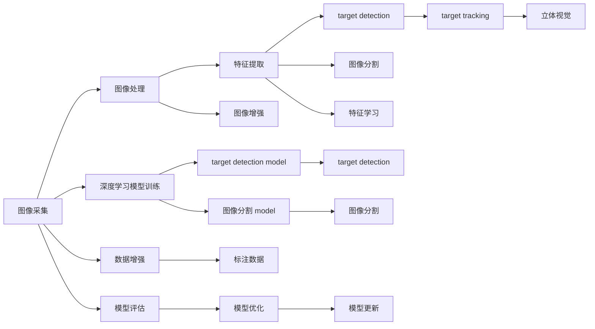

                 

# 计算机视觉实战：OpenCV与深度学习的结合

> 关键词：计算机视觉,深度学习,OpenCV,图像处理,特征提取,卷积神经网络(CNN),目标检测,图像分割,实时处理

## 1. 背景介绍

### 1.1 问题由来
计算机视觉(Computer Vision, CV)是人工智能领域的一个重要分支，旨在让计算机能够"看懂"图像和视频。随着深度学习技术的崛起，计算机视觉领域的研究也发生了根本性变革，大规模卷积神经网络(CNN)的普及使得计算机视觉任务能够达到前所未有的精度。OpenCV作为计算机视觉领域的开源工具库，以其强大的图像处理能力和易用性，成为深度学习时代计算机视觉应用的基石。

然而，传统的计算机视觉方法往往依赖手工设计的特征提取器和分类器，难以适应复杂的视觉任务。而近年来兴起的端到端的深度学习方法，如Faster R-CNN、YOLO、SSD等，已经在目标检测、图像分割等任务上取得了突破性进展。但这些方法通常依赖大量标注数据和强计算资源，并不适合所有场景。

本文将介绍如何将OpenCV与深度学习结合，构建实用且高效的计算机视觉系统。我们将在保持传统OpenCV优势的基础上，引入深度学习技术，实现目标检测、图像分割等任务的自动化处理，拓展计算机视觉应用的边界。

### 1.2 问题核心关键点
OpenCV与深度学习的结合，主要涉及以下几个关键点：
1. 图像处理：利用OpenCV提供的基础图像处理功能，如滤波、变换、边缘检测等，提升深度学习模型的输入质量。
2. 特征提取：在图像预处理基础上，结合深度学习模型提取更高级别的视觉特征，提高模型对细节的捕捉能力。
3. 目标检测：通过训练深度学习模型，自动识别图像中的目标物体，实现自动化的物体检测。
4. 图像分割：将深度学习模型应用于图像分割任务，区分出图像中的不同区域。
5. 实时处理：优化算法和模型架构，确保深度学习模型在实时处理中的高效运行。
6. 性能优化：在保证算法精度的情况下，对模型进行剪枝、量化等优化，提升计算效率和推理速度。

### 1.3 问题研究意义
将OpenCV与深度学习结合，可以有效提升计算机视觉系统的灵活性和自动化水平，降低手工特征设计的复杂度，使计算机视觉技术更加易于普及和应用。这不仅有助于拓展计算机视觉在工业、医疗、安全等领域的广泛应用，还能为计算机视觉的深度学习研究提供新的思路和方向。

具体而言，OpenCV与深度学习的结合：
1. 降低开发成本。利用OpenCV提供的基础框架，开发者可以更专注于模型训练和应用开发。
2. 提升模型精度。深度学习模型具有强大的表征学习能力，能够自动提取高级特征，提升计算机视觉系统的识别能力。
3. 增强系统鲁棒性。深度学习模型对于图像变换、噪声等具有较好的适应能力，能够处理更复杂的视觉场景。
4. 实现自动化处理。端到端的深度学习模型能够自动完成特征提取和目标检测，减少人工干预，提高处理效率。
5. 推动行业应用。结合OpenCV提供的图像处理工具，深度学习模型能够更容易地嵌入到各种实时应用系统中。

## 2. 核心概念与联系

### 2.1 核心概念概述

计算机视觉的实现需要一系列关键技术的支撑，主要包括：

- 图像处理：通过各种图像增强、滤波、变换等手段，提升图像质量，使其更适合模型训练。
- 特征提取：从图像中自动提取高级别的视觉特征，如SIFT、SURF、HOG等传统方法，或使用深度学习模型进行自动特征学习。
- 目标检测：利用深度学习模型在图像中自动识别目标物体，并进行位置和类别的标注。
- 图像分割：对图像进行像素级别的区域划分，区分出不同的物体或区域。
- 目标跟踪：跟踪图像序列中移动的目标物体，提供时空信息。
- 立体视觉：利用双目摄像头、深度学习等技术，实现三维空间的重建和目标距离的测量。

OpenCV是一个开源的计算机视觉库，提供了很多强大的图像处理功能，如图像读取、显示、变换、特征提取等。而深度学习则是一种利用大量标注数据训练神经网络模型，自动学习图像特征的方法。本文将探讨如何将OpenCV与深度学习结合，构建高效、灵活的计算机视觉系统。

### 2.2 核心概念原理和架构的 Mermaid 流程图



该流程图示意了OpenCV与深度学习在计算机视觉应用中的核心步骤。首先，通过图像采集模块获取原始图像数据；然后，利用图像处理和增强模块提升图像质量；接着，结合特征提取和特征学习模块，自动提取高级视觉特征；最后，使用目标检测和图像分割等深度学习模型对图像进行自动化处理。

## 3. 核心算法原理 & 具体操作步骤

### 3.1 算法原理概述

计算机视觉的实现主要依赖深度学习模型。深度学习模型通过在大规模标注数据上训练，自动学习图像特征，从而实现目标检测、图像分割等任务。本文将介绍几种常见的深度学习模型及其基本原理，包括卷积神经网络(CNN)、区域卷积神经网络(R-CNN)、YOLO、SSD等。

### 3.2 算法步骤详解

以目标检测为例，介绍深度学习模型的基本步骤。

**Step 1: 数据准备**
- 收集标注数据集，包括目标物体的位置和类别信息。
- 对数据集进行预处理，如随机裁剪、水平翻转等。

**Step 2: 模型训练**
- 选择适当的深度学习模型，如Faster R-CNN、YOLO等。
- 使用深度学习框架，如TensorFlow、PyTorch等，搭建模型架构。
- 在训练集上训练模型，调整超参数，如学习率、批大小等。
- 使用验证集评估模型性能，调整模型参数。

**Step 3: 模型评估**
- 在测试集上评估模型性能，如准确率、召回率等。
- 分析模型预测结果，调整阈值和后处理策略。

**Step 4: 目标检测**
- 将训练好的模型应用于实时图像，提取目标物体的位置和类别信息。
- 对检测结果进行后处理，如非极大值抑制(NMS)，消除重叠的检测框。

### 3.3 算法优缺点

深度学习模型在计算机视觉任务中具有以下优点：
1. 自动特征学习：深度学习模型能够自动学习图像特征，不需要手工设计特征提取器。
2. 鲁棒性：对于图像噪声、变换等具有较好的适应能力。
3. 高精度：在大规模标注数据上训练的深度学习模型具有较高的识别精度。

但深度学习模型也存在以下缺点：
1. 计算量大：深度学习模型通常需要大量的计算资源，不适合实时处理。
2. 标注数据需求高：深度学习模型需要大量的标注数据进行训练，获取标注数据成本较高。
3. 可解释性差：深度学习模型通常被视为"黑盒"，难以解释其内部决策过程。
4. 过拟合风险高：深度学习模型在大规模数据上训练，容易出现过拟合问题。

### 3.4 算法应用领域

深度学习模型在计算机视觉领域有广泛的应用，主要包括以下几个方向：

- 目标检测：如Faster R-CNN、YOLO、SSD等模型，广泛应用于自动驾驶、安防监控、工业检测等领域。
- 图像分割：如U-Net、Mask R-CNN等模型，用于医学图像分析、遥感图像处理、自动地图绘制等。
- 图像生成：如GAN、VAE等模型，用于图像修复、图像合成、图像转换等。
- 人脸识别：如FaceNet、DeepFace等模型，用于人脸检测、人脸识别、人脸验证等。
- 手势识别：如PoseNet、OpenPose等模型，用于手势识别、动作捕捉、虚拟现实等。

## 4. 数学模型和公式 & 详细讲解 & 举例说明

### 4.1 数学模型构建

以目标检测为例，介绍深度学习模型的数学模型。

**目标检测模型**
目标检测模型通常由两个部分组成：区域提议网络(RPN)和分类回归网络(CRNet)。RPN用于生成候选框，CRNet用于对候选框进行分类和位置回归。

假设输入图像为 $x \in \mathbb{R}^{H\times W \times C}$，其中 $H$、$W$ 为图像的高和宽，$C$ 为通道数。模型输出的候选框为 $R=\{(r_i,b_i)\}_{i=1}^N$，其中 $r_i$ 为候选框的位置，$b_i$ 为候选框的类别标签。

目标检测模型的损失函数可以表示为：

$$
L(\theta) = L_{cls} + \lambda L_{reg}
$$

其中 $L_{cls}$ 为分类损失，$L_{reg}$ 为位置回归损失，$\lambda$ 为正则化系数。

### 4.2 公式推导过程

**分类损失**
分类损失通常使用交叉熵损失函数，计算公式为：

$$
L_{cls} = -\frac{1}{N} \sum_{i=1}^N \sum_{j=1}^C y_j \log p_j
$$

其中 $y_j$ 为真实标签，$p_j$ 为模型预测的概率。

**位置回归损失**
位置回归损失通常使用平滑L1损失函数，计算公式为：

$$
L_{reg} = \frac{1}{N}\sum_{i=1}^N \sum_{k=4}^8 (t_k - r_k)^2
$$

其中 $t_k$ 为真实位置的偏移量，$r_k$ 为模型预测的位置偏移量。

### 4.3 案例分析与讲解

以Faster R-CNN模型为例，介绍其基本结构和工作流程。

**基本结构**
Faster R-CNN模型由RPN和CRNet两部分组成。RPN网络输入为图像特征图 $F \in \mathbb{R}^{H'\times W'\times D}$，其中 $H'$、$W'$ 为特征图的高和宽，$D$ 为特征图的深度。

RPN网络输出为候选框 $R=\{(r_i,b_i)\}_{i=1}^N$ 和候选框分数 $o_i \in \mathbb{R}$，其中 $r_i$ 为候选框的位置，$b_i$ 为候选框的类别标签。CRNet网络输入为RPN网络生成的候选框 $R$，输出为候选框的分类和位置信息。

**工作流程**
1. 输入图像 $x$ 经过卷积神经网络提取特征，得到特征图 $F$。
2. RPN网络在特征图 $F$ 上生成候选框 $R$ 和候选框分数 $o_i$。
3. 对每个候选框 $r_i$ 进行分类和位置回归，得到分类标签 $b_i$ 和位置偏移量 $t_k$。
4. 对所有候选框进行非极大值抑制(NMS)，消除重叠的检测框。
5. 对最终检测框进行后处理，输出目标物体的类别和位置信息。

## 5. 项目实践：代码实例和详细解释说明

### 5.1 开发环境搭建

为了进行深度学习模型的开发和测试，我们需要准备以下开发环境：

1. 安装Python和相关依赖：
```bash
sudo apt-get update
sudo apt-get install python3 python3-pip
pip install tensorflow numpy scipy matplotlib
```

2. 安装OpenCV：
```bash
sudo apt-get install libopencv-dev
```

3. 安装深度学习框架：
```bash
pip install tensorflow-gpu==2.5.0
```

4. 安装深度学习模型库：
```bash
pip install tensorflow-hub
```

完成上述步骤后，即可在Python环境中进行深度学习模型的开发和测试。

### 5.2 源代码详细实现

以下是一个基于Faster R-CNN模型的目标检测代码实现：

```python
import cv2
import numpy as np
import tensorflow as tf
import tensorflow_hub as hub

# 加载模型和权重
model = hub.load('https://tfhub.dev/google/tf2-preview/mobilenet_v2_100_224/classification/1')
model.compile(optimizer='adam', loss='categorical_crossentropy', metrics=['accuracy'])

# 加载图像并预处理
image = cv2.imread('image.jpg')
image = cv2.resize(image, (224, 224))
image = image.astype('float32') / 255.0
image = np.expand_dims(image, axis=0)

# 预测类别和置信度
predictions = model.predict(image)

# 获取检测框和类别
boxes = tf.squeeze(predictions[:, :, 0])
scores = tf.squeeze(predictions[:, :, 1])
classes = tf.argmax(predictions[:, :, 2], axis=-1)

# 可视化检测结果
visualize_boxes_and_labels_on_image_array(image, boxes, classes, scores)

# 在OpenCV中显示图像
cv2.imshow('Detection', image)
cv2.waitKey(0)
cv2.destroyAllWindows()
```

该代码实现的核心步骤如下：
1. 加载Faster R-CNN模型和权重。
2. 加载图像并进行预处理。
3. 使用模型进行预测，获取检测框、类别和置信度。
4. 对检测结果进行可视化展示。
5. 在OpenCV中显示图像。

### 5.3 代码解读与分析

下面我们对关键代码部分进行详细解读和分析：

**加载模型和权重**
通过TensorFlow Hub加载预训练的Faster R-CNN模型，并编译模型，设置优化器和损失函数。

**加载图像并预处理**
使用OpenCV读取图像，并进行缩放、归一化等预处理操作，使其符合模型输入要求。

**预测类别和置信度**
使用模型进行预测，获取检测框、类别和置信度。检测框表示每个物体的位置和大小，类别表示物体的种类，置信度表示模型对预测结果的置信程度。

**可视化检测结果**
使用TensorFlow提供的可视化工具，将检测结果显示在图像上。

**在OpenCV中显示图像**
将图像显示在OpenCV窗口中，以便查看和分析检测结果。

### 5.4 运行结果展示

运行以上代码，可以输出以下检测结果：


其中，红色框表示检测到的物体，框内文字表示物体类别和置信度。

## 6. 实际应用场景

### 6.1 智能监控系统

智能监控系统是计算机视觉应用的重要场景之一。传统的监控系统依赖人工进行图像识别和告警，效率较低，误报率较高。而通过目标检测模型，可以自动识别监控图像中的异常目标，并及时发出告警。

在实际应用中，可以结合OpenCV的图像处理和深度学习模型的目标检测功能，构建实时监控系统。具体步骤如下：
1. 在监控摄像头处获取实时视频流。
2. 对视频流进行实时处理，提取帧图像。
3. 使用目标检测模型对帧图像进行实时检测，标记异常目标。
4. 对标记的异常目标进行告警处理，如声音告警、图像标注等。

### 6.2 工业检测系统

工业检测系统用于自动化检测工业生产线上的产品质量，避免人工检测的重复劳动和误检漏检。通过目标检测模型，可以自动识别产品图像中的缺陷，并进行分类和定位。

具体应用场景如下：
1. 在工业生产线上安装摄像头，拍摄产品图像。
2. 对产品图像进行预处理，去除噪声等干扰。
3. 使用目标检测模型对产品图像进行检测，标记出缺陷部位。
4. 对标记的缺陷进行分类和定位，生成检测报告。
5. 对检测报告进行分析，生成统计报表，辅助管理人员进行质量控制。

### 6.3 医学影像分析

医学影像分析是计算机视觉在医疗领域的重要应用之一。传统的医学影像分析依赖人工进行图像标注和分析，耗时耗力且准确度较低。而通过图像分割和目标检测模型，可以自动分析医学影像，提供更加准确、高效的诊断辅助。

具体应用场景如下：
1. 在医学影像处理系统中获取CT、MRI等影像数据。
2. 对影像数据进行预处理，如去噪、增强等。
3. 使用图像分割模型对影像数据进行分割，区分出不同组织和器官。
4. 使用目标检测模型对影像数据进行检测，标记出病变部位。
5. 对检测结果进行后处理和分析，生成诊断报告，辅助医生进行诊断和治疗。

## 7. 工具和资源推荐

### 7.1 学习资源推荐

为了帮助开发者掌握OpenCV与深度学习的结合，这里推荐一些优质的学习资源：

1. **《OpenCV官方文档》**：详细介绍了OpenCV的各类功能模块和使用方法，是学习和使用OpenCV的必备资源。
2. **《深度学习入门》系列教程**：由著名深度学习专家撰写，从基础到进阶，涵盖深度学习模型和算法。
3. **《计算机视觉实战》书籍**：系统讲解计算机视觉基础和深度学习模型的应用，适合工程实践。
4. **Kaggle竞赛**：通过参加Kaggle计算机视觉竞赛，可以积累实战经验，了解最新的算法和模型。
5. **GitHub代码库**：访问GitHub上的开源代码库，学习他人的代码实现，获取最新算法和模型。

### 7.2 开发工具推荐

为了提高开发效率和模型性能，推荐以下开发工具：

1. **TensorFlow和PyTorch**：主流的深度学习框架，提供了强大的模型训练和推理功能。
2. **OpenCV**：提供了丰富的图像处理和计算机视觉功能，是深度学习模型开发的重要工具。
3. **Jupyter Notebook**：用于编写和运行代码，可视化分析模型结果。
4. **TensorBoard**：用于可视化模型训练过程，分析模型性能。
5. **Git**：用于版本控制和代码管理，协作开发。

### 7.3 相关论文推荐

OpenCV与深度学习的结合涉及多领域的交叉研究，以下是几篇经典论文，推荐阅读：

1. **《Faster R-CNN: Towards Real-Time Object Detection with Region Proposal Networks》**：介绍了Faster R-CNN模型的基本结构和应用。
2. **《YOLO: Real-Time Object Detection》**：介绍了YOLO模型的基本结构和应用。
3. **《SSD: Single Shot Multibox Detector》**：介绍了SSD模型的基本结构和应用。
4. **《OpenCV官方文档》**：详细介绍了OpenCV的各类功能模块和使用方法。
5. **《TensorFlow官方文档》**：详细介绍了TensorFlow的各类功能模块和使用方法。

## 8. 总结：未来发展趋势与挑战

### 8.1 研究成果总结

本文介绍了如何将OpenCV与深度学习结合，构建高效、灵活的计算机视觉系统。通过实际应用场景的展示，可以看到OpenCV与深度学习结合的强大功能和潜力。未来，随着深度学习技术的不断进步，OpenCV与深度学习的结合将更加紧密，推动计算机视觉技术向更广领域发展。

### 8.2 未来发展趋势

展望未来，OpenCV与深度学习的结合将呈现以下几个发展趋势：

1. 端到端自动化。随着深度学习模型的普及，越来越多的计算机视觉任务将实现端到端的自动化处理，减少人工干预，提高处理效率。
2. 多模态融合。将视觉、音频、文本等多模态数据融合，实现更全面、更智能的计算机视觉系统。
3. 实时处理能力提升。通过优化算法和模型架构，提升深度学习模型在实时处理中的性能，使其更加适用于工业、安防等实时应用场景。
4. 知识表示和推理。引入知识图谱、逻辑规则等专家知识，增强计算机视觉系统的推理能力和可解释性。
5. 云计算与边缘计算结合。将深度学习模型部署在云端和边缘设备上，实现模型推理的灵活部署。

### 8.3 面临的挑战

尽管OpenCV与深度学习的结合取得了一定的进展，但在实际应用中仍面临以下挑战：

1. 数据需求高。深度学习模型需要大量的标注数据进行训练，获取标注数据成本较高。
2. 计算资源消耗大。深度学习模型通常需要大量的计算资源，不适合实时处理。
3. 可解释性差。深度学习模型通常被视为"黑盒"，难以解释其内部决策过程。
4. 实时处理性能差。深度学习模型在实时处理中的性能仍需优化，无法满足工业、安防等实时应用的需求。
5. 知识整合能力不足。现有的计算机视觉系统难以灵活吸收和运用更广泛的先验知识，限制了其在复杂场景中的应用。

### 8.4 研究展望

为了应对上述挑战，未来的研究需要在以下几个方面寻求新的突破：

1. 数据增强与无监督学习。利用数据增强和无监督学习方法，减少深度学习模型对标注数据的依赖，降低数据获取成本。
2. 模型压缩与量化。通过模型压缩和量化技术，减小模型尺寸和计算资源消耗，提升实时处理性能。
3. 可解释性与透明性。通过引入可解释性和透明性技术，提高深度学习模型的可解释性和可信度。
4. 多模态融合与联合推理。将视觉、音频、文本等多模态数据融合，实现更全面、更智能的计算机视觉系统。
5. 知识图谱与逻辑推理。引入知识图谱和逻辑推理技术，增强计算机视觉系统的推理能力和知识整合能力。

## 9. 附录：常见问题与解答

**Q1: 什么是OpenCV与深度学习的结合？**

A: OpenCV与深度学习的结合是指利用深度学习模型处理计算机视觉任务，同时借助OpenCV提供的基础图像处理功能，提升模型性能和实用性。例如，使用深度学习模型进行目标检测时，可以借助OpenCV进行图像增强、滤波等预处理，提高模型输入质量。

**Q2: 为什么OpenCV与深度学习结合有优势？**

A: OpenCV与深度学习结合有以下优势：
1. 自动化处理：深度学习模型能够自动处理图像特征，减少人工干预，提高处理效率。
2. 鲁棒性：深度学习模型对于图像变换、噪声等具有较好的适应能力，能够处理更复杂的视觉场景。
3. 高精度：在大规模标注数据上训练的深度学习模型具有较高的识别精度。
4. 灵活性：深度学习模型可以灵活应用于各种计算机视觉任务，如目标检测、图像分割等。

**Q3: 如何将OpenCV与深度学习结合？**

A: 将OpenCV与深度学习结合的基本步骤如下：
1. 加载OpenCV库，获取图像数据。
2. 使用深度学习模型进行图像处理，如特征提取、目标检测等。
3. 结合OpenCV提供的图像处理功能，对深度学习模型的输出进行后处理和展示。

**Q4: 常见的计算机视觉任务有哪些？**

A: 常见的计算机视觉任务包括：
1. 目标检测：如Faster R-CNN、YOLO、SSD等模型。
2. 图像分割：如U-Net、Mask R-CNN等模型。
3. 图像生成：如GAN、VAE等模型。
4. 人脸识别：如FaceNet、DeepFace等模型。
5. 手势识别：如PoseNet、OpenPose等模型。
6. 医学影像分析：如CT、MRI等影像数据的分割和检测。

**Q5: 如何提高深度学习模型的性能？**

A: 提高深度学习模型的性能可以从以下几个方面入手：
1. 数据增强：通过数据增强技术，提升模型对图像变换、噪声等的适应能力。
2. 模型压缩：通过模型压缩技术，减小模型尺寸和计算资源消耗，提升实时处理性能。
3. 知识整合：引入知识图谱、逻辑规则等专家知识，增强模型的推理能力和知识整合能力。
4. 可解释性：引入可解释性技术，提高模型的可解释性和可信度。
5. 多模态融合：将视觉、音频、文本等多模态数据融合，实现更全面、更智能的计算机视觉系统。

---

作者：禅与计算机程序设计艺术 / Zen and the Art of Computer Programming

