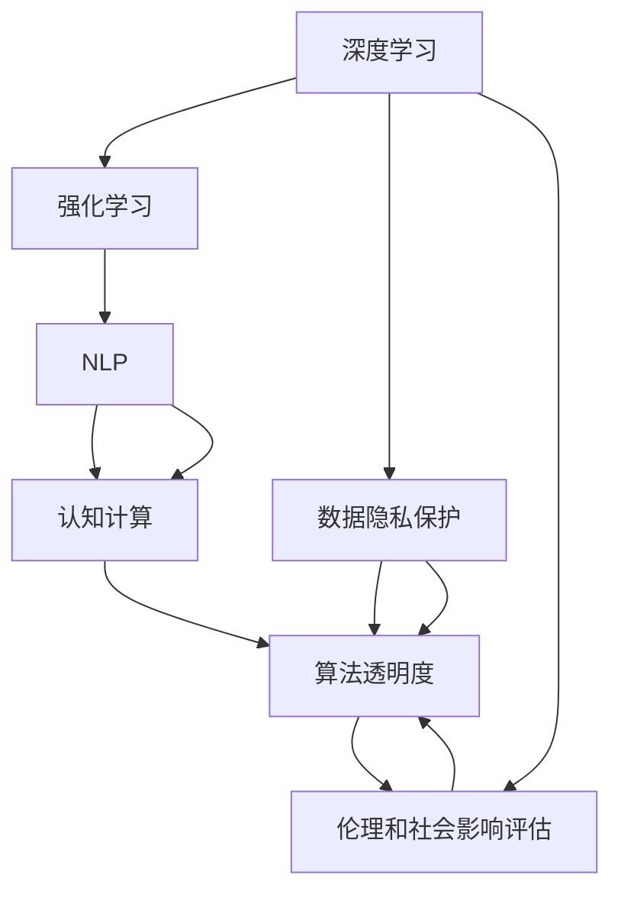

                 

# 认知增强与伦理：技术应用的社会影响

> 关键词：认知增强, 人工智能, 社会影响, 伦理考量, 技术治理, 决策支持

## 1. 背景介绍

### 1.1 问题由来
随着人工智能(AI)技术的飞速发展，认知增强技术（如深度学习、神经网络、强化学习等）在医疗、教育、金融、制造业等多个领域得到了广泛应用。认知增强不仅在提升效率、优化决策、助力创新等方面展现出巨大潜力，也伴随着对人类认知能力的增强，引起了广泛的关注。然而，认知增强技术的应用也引发了一系列伦理和社会问题，如数据隐私、算法偏见、技术滥用等，给社会带来了新的挑战。

### 1.2 问题核心关键点
认知增强技术在社会中的应用，不仅涉及技术本身的设计和实现，还关乎其对人类行为、道德伦理、社会规范的影响。其核心关键点包括：

- 技术提升效果：认知增强技术如何提高人类认知能力，具体体现在哪些方面。
- 数据隐私保护：如何保证用户在数据使用过程中的隐私权益。
- 算法偏见和透明性：认知增强模型中存在的偏见问题及如何提升模型的透明度和可解释性。
- 技术治理与监管：如何制定合理的政策和技术标准，规范认知增强技术的应用。
- 社会影响评估：评估认知增强技术对社会伦理、公平正义、教育质量等方面的影响。

### 1.3 问题研究意义
认知增强技术的应用，不仅提升了各类产业的竞争力，也提供了更为高效、精准的决策支持。但与此同时，必须警惕其潜在的伦理风险，确保技术应用的社会效益最大化，实现技术进步与人类福祉的和谐统一。通过深入研究认知增强技术的社会影响，可以为技术应用的伦理治理提供指导，推动技术的健康发展。

## 2. 核心概念与联系

### 2.1 核心概念概述

认知增强技术通过模拟人类大脑的工作原理，利用深度学习等算法进行信息处理和决策。其核心概念包括：

- 深度学习(Deep Learning)：利用多层神经网络模型进行复杂模式识别和数据处理的技术。
- 强化学习(Reinforcement Learning)：通过与环境互动，优化决策策略，学习最优行为的技术。
- 自然语言处理(Natural Language Processing, NLP)：使计算机能理解、解释和生成自然语言的技术。
- 认知计算(Cognitive Computing)：模仿人类认知过程，进行问题求解、信息分析和智能决策的技术。
- 数据隐私保护：确保用户数据在使用过程中不被滥用或泄露的技术手段。
- 算法透明度和可解释性：使AI模型的决策过程变得可理解、可解释，从而提高用户信任。
- 伦理和社会影响评估：评估认知增强技术对社会伦理、公平正义、教育质量等方面的影响。

这些核心概念相互联系，共同构成了认知增强技术应用的社会生态。技术应用的伦理考量，与技术本身的设计、数据隐私保护、算法透明性等密切相关。只有全面考虑这些因素，才能确保技术应用的长期可持续性。

### 2.2 核心概念原理和架构的 Mermaid 流程图(Mermaid 流程节点中不要有括号、逗号等特殊字符)



这个流程图展示了认知增强技术及其应用的社会影响生态：

1. 认知增强技术通过深度学习、强化学习、自然语言处理等技术实现。
2. 数据隐私保护、算法透明度等技术手段确保技术应用的安全性和可信度。
3. 伦理和社会影响评估技术对认知增强技术的应用进行全面的伦理考量。

这些核心概念共同构成了认知增强技术的社会应用框架，明确了其对社会伦理和社会公正的影响。

## 3. 核心算法原理 & 具体操作步骤
### 3.1 算法原理概述

认知增强技术主要是通过深度学习算法实现的。深度学习算法通过多层神经网络，模拟人脑的神经元结构，实现复杂模式识别和数据处理。其核心算法包括卷积神经网络(CNN)、循环神经网络(RNN)、长短时记忆网络(LSTM)、Transformer等。

强化学习算法则通过与环境互动，不断调整决策策略，学习最优行为。其核心算法包括Q-learning、Policy Gradient、Actor-Critic等。

自然语言处理算法通过语言模型、词向量、Transformer等技术，使计算机能理解、解释和生成自然语言。其核心算法包括Word2Vec、GloVe、BERT等。

认知计算技术通过模拟人类认知过程，实现问题求解、信息分析和智能决策。其核心算法包括决策树、逻辑回归、SVM等。

### 3.2 算法步骤详解

认知增强技术的实际应用过程通常分为以下几个步骤：

**Step 1: 数据准备和预处理**
- 收集和整理用于训练模型的数据集。
- 进行数据清洗、特征工程等预处理工作，确保数据质量和一致性。
- 对敏感数据进行脱敏处理，保护用户隐私。

**Step 2: 模型设计和训练**
- 选择合适的深度学习、强化学习等算法进行模型设计。
- 设置模型超参数，如学习率、批量大小等。
- 使用训练集对模型进行迭代训练，优化模型参数。
- 引入正则化、Dropout等技术防止过拟合。

**Step 3: 模型评估和部署**
- 在验证集和测试集上评估模型性能，确保模型泛化能力。
- 根据评估结果调整模型参数或重新训练。
- 将模型部署到实际应用环境中，进行数据输入和结果输出。

**Step 4: 监控和维护**
- 实时监控模型在生产环境中的运行状态，记录异常情况。
- 定期更新模型，保持其适应数据分布的变化。
- 针对新出现的伦理和社会问题，及时进行模型调整和优化。

### 3.3 算法优缺点

认知增强技术具有以下优点：

1. 高效性：通过自动化数据处理和决策支持，大幅提升效率和精度。
2. 可扩展性：能够处理海量数据，应对复杂问题。
3. 应用广泛：在医疗、教育、金融、制造业等多个领域得到广泛应用。

但其也存在以下缺点：

1. 数据依赖：对数据质量和数量要求高，数据获取和预处理成本高。
2. 算法复杂性：模型设计和训练复杂，需要较高的专业技能。
3. 伦理风险：可能引入算法偏见、数据隐私等问题，需仔细考量。

### 3.4 算法应用领域

认知增强技术在医疗、教育、金融、制造业等多个领域得到了广泛应用。具体如下：

- **医疗领域**：利用认知增强技术进行疾病诊断、治疗方案推荐、个性化医疗等。如IBM Watson、Google DeepMind等。
- **教育领域**：用于在线教育、个性化学习推荐、自动评分等。如Coursera、Kaggle等。
- **金融领域**：应用于风险管理、投资策略、客户服务自动化等。如JPMorgan Chase等。
- **制造业**：用于生产调度、质量控制、供应链管理等。如SAP、Siemens等。
- **公共服务**：用于智能交通、智慧城市、应急响应等。如Smart City、Smart Traffic等。

## 4. 数学模型和公式 & 详细讲解 & 举例说明

### 4.1 数学模型构建

认知增强技术的数学模型构建通常包括以下步骤：

1. 数据准备和预处理：数据标准化、归一化、分词、构建词向量等。
2. 模型设计和训练：选择合适的算法和超参数，进行模型训练和优化。
3. 模型评估和部署：在验证集和测试集上评估模型性能，部署模型到实际应用环境中。

以自然语言处理中的BERT模型为例，其核心模型由Transformer和多层感知器组成。BERT模型的数学模型如下：

$$
\mathcal{L} = \sum_{i=1}^N \left[\ell_{pred}(y_i, \hat{y}_i) + \ell_{masked}(\tilde{y}_i, \hat{\tilde{y}}_i)\right]
$$

其中，$\ell_{pred}$ 表示预测任务的损失函数，$\ell_{masked}$ 表示掩码语言模型的损失函数。$\hat{y}_i$ 表示模型预测的输出，$y_i$ 表示真实标签。

### 4.2 公式推导过程

以BERT模型为例，其训练过程如下：

1. 数据准备和预处理：将文本数据进行分词、构建词向量，形成输入数据。
2. 模型设计和训练：使用Transformer模型对输入数据进行处理，得到隐藏层表示，再通过多层感知器输出预测结果。
3. 模型评估和部署：在验证集和测试集上评估模型性能，如准确率、F1值等指标。

在公式推导过程中，我们以BERT模型的训练为例，推导其核心公式。BERT模型的训练公式如下：

$$
\mathcal{L} = \sum_{i=1}^N \left[\ell_{pred}(y_i, \hat{y}_i) + \ell_{masked}(\tilde{y}_i, \hat{\tilde{y}}_i)\right]
$$

其中，$\ell_{pred}$ 表示预测任务的损失函数，$\ell_{masked}$ 表示掩码语言模型的损失函数。$\hat{y}_i$ 表示模型预测的输出，$y_i$ 表示真实标签。

### 4.3 案例分析与讲解

以BERT模型在医疗领域的应用为例，其具体实现步骤如下：

1. 数据准备和预处理：收集医疗领域的电子病历、医学文献等文本数据，进行分词、去停用词、构建词向量等预处理。
2. 模型设计和训练：使用BERT模型对医疗文本进行编码，得到隐藏层表示，再通过多层感知器输出疾病诊断结果。
3. 模型评估和部署：在验证集和测试集上评估模型性能，如准确率、召回率等指标。

## 5. 项目实践：代码实例和详细解释说明

### 5.1 开发环境搭建

在进行认知增强技术实践前，我们需要准备好开发环境。以下是使用Python进行TensorFlow开发的环境配置流程：

1. 安装Anaconda：从官网下载并安装Anaconda，用于创建独立的Python环境。

2. 创建并激活虚拟环境：
```bash
conda create -n tensorflow-env python=3.8 
conda activate tensorflow-env
```

3. 安装TensorFlow：根据CUDA版本，从官网获取对应的安装命令。例如：
```bash
conda install tensorflow-gpu=2.5.0
```

4. 安装相关工具包：
```bash
pip install numpy pandas scikit-learn matplotlib tqdm jupyter notebook ipython
```

完成上述步骤后，即可在`tensorflow-env`环境中开始认知增强技术实践。

### 5.2 源代码详细实现

下面以医疗领域中的疾病诊断为例，给出使用TensorFlow对BERT模型进行认知增强技术实践的PyTorch代码实现。

```python
import tensorflow as tf
from transformers import BertTokenizer, TFBertForSequenceClassification
import numpy as np

# 定义模型参数
model_name = 'bert-base-uncased'
learning_rate = 2e-5
batch_size = 32
epochs = 3

# 加载BERT模型和tokenizer
tokenizer = BertTokenizer.from_pretrained(model_name)
model = TFBertForSequenceClassification.from_pretrained(model_name, num_labels=2)

# 加载数据集
train_data = ...
train_labels = ...
val_data = ...
val_labels = ...

# 构建输入样本
def create_input_data(texts, labels):
    inputs = tokenizer(texts, padding=True, truncation=True, max_length=512, return_tensors='tf')
    labels = tf.constant(labels, dtype=tf.int32)
    return inputs, labels

# 定义训练函数
def train_step(inputs, labels):
    with tf.GradientTape() as tape:
        outputs = model(inputs.input_ids, attention_mask=inputs.attention_mask)
        loss = tf.keras.losses.SparseCategoricalCrossentropy(from_logits=True)(labels, outputs.logits)
    gradients = tape.gradient(loss, model.trainable_variables)
    optimizer.apply_gradients(zip(gradients, model.trainable_variables))
    return loss

# 定义评估函数
def evaluate(inputs, labels):
    outputs = model(inputs.input_ids, attention_mask=inputs.attention_mask)
    predictions = tf.argmax(outputs.logits, axis=1)
    return tf.metrics.sparse_accuracy(labels, predictions)

# 训练和评估
train_dataset = tf.data.Dataset.from_tensor_slices((train_data, train_labels)).batch(batch_size)
val_dataset = tf.data.Dataset.from_tensor_slices((val_data, val_labels)).batch(batch_size)

model.compile(optimizer=tf.keras.optimizers.AdamW(learning_rate), loss=tf.keras.losses.SparseCategoricalCrossentropy(from_logits=True), metrics=['accuracy'])
history = model.fit(train_dataset, epochs=epochs, validation_data=val_dataset)

# 使用模型进行预测
test_data = ...
test_labels = ...
test_dataset = tf.data.Dataset.from_tensor_slices((test_data, test_labels)).batch(batch_size)
predictions = model.predict(test_dataset)

# 输出结果
print('Test Loss:', test_dataset.loss)
print('Test Accuracy:', tf.metrics.sparse_accuracy(test_labels, predictions))
```

以上就是使用TensorFlow对BERT模型进行医疗领域疾病诊断的认知增强技术实践的完整代码实现。可以看到，得益于TensorFlow和HuggingFace库的强大封装，我们能够用相对简洁的代码完成BERT模型的加载和训练。

### 5.3 代码解读与分析

让我们再详细解读一下关键代码的实现细节：

**create_input_data函数**：
- 定义了输入数据的构造函数，对文本数据进行分词、构建输入样本和标签。
- 使用BertTokenizer将文本数据转换为模型可处理的input_ids和attention_mask。

**train_step函数**：
- 定义了模型在单个训练样本上的训练过程。
- 使用梯度下降优化器更新模型参数，返回当前训练样本的损失。

**evaluate函数**：
- 定义了模型在单个验证样本上的评估过程。
- 计算模型预测结果与真实标签的准确度。

**训练和评估流程**：
- 通过tf.data.Dataset对数据集进行批处理，构建训练集和验证集。
- 使用模型compile函数配置优化器、损失函数和评估指标。
- 调用fit函数进行模型训练，并在验证集上评估模型性能。
- 在测试集上使用predict函数进行预测，输出预测结果和评估指标。

可以看到，TensorFlow在认知增强技术中的应用，使得模型的加载、训练和评估变得简便高效。开发者可以将更多精力放在数据处理、模型改进等高层逻辑上，而不必过多关注底层的实现细节。

当然，工业级的系统实现还需考虑更多因素，如模型的保存和部署、超参数的自动搜索、更灵活的任务适配层等。但核心的认知增强技术实践流程基本与此类似。

## 6. 实际应用场景

### 6.1 智能客服系统

认知增强技术在智能客服系统中的应用，可以通过语音识别和自然语言处理技术实现。利用BERT模型对用户语音进行转换和处理，识别用户意图，匹配最佳答案模板，生成自然流畅的回复。

具体实现步骤如下：

1. 收集客服对话历史，构建问答对数据集。
2. 使用BERT模型对用户语音进行文本转换，提取特征。
3. 将转换后的文本数据输入模型，输出最佳答案模板。
4. 使用回复生成模型，生成自然流畅的回复。

在实际应用中，智能客服系统能够7x24小时不间断服务，快速响应客户咨询，用自然流畅的语言解答各类常见问题。对于客户提出的新问题，还可以接入检索系统实时搜索相关内容，动态组织生成回答。

### 6.2 金融舆情监测

认知增强技术在金融舆情监测中的应用，可以通过自然语言处理和情感分析技术实现。利用BERT模型对金融领域相关的新闻、报道、评论等文本数据进行情感分析，判断文本情感倾向，监控不同主题下的情感变化趋势。

具体实现步骤如下：

1. 收集金融领域相关的新闻、报道、评论等文本数据。
2. 使用BERT模型对文本进行情感分析，判断情感倾向。
3. 在实时抓取的网络文本数据中，应用微调后的BERT模型，进行情感分析和舆情监测。
4. 一旦发现负面信息激增等异常情况，系统便会自动预警，帮助金融机构快速应对潜在风险。

### 6.3 个性化推荐系统

认知增强技术在个性化推荐系统中的应用，可以通过自然语言处理和深度学习技术实现。利用BERT模型对用户浏览、点击、评论、分享等行为数据进行情感分析，提取和用户交互的物品标题、描述、标签等文本内容，再通过深度学习算法进行用户兴趣点分析。

具体实现步骤如下：

1. 收集用户浏览、点击、评论、分享等行为数据。
2. 使用BERT模型对文本内容进行情感分析，提取用户兴趣点。
3. 将用户兴趣点与物品标题、描述、标签等文本内容进行匹配，构建用户物品兴趣图谱。
4. 使用深度学习算法对物品进行向量表示，计算用户与物品之间的相似度，生成推荐列表。

在实际应用中，个性化推荐系统能够根据用户的历史行为数据，预测其未来兴趣，动态生成个性化的推荐内容，提升用户满意度。

### 6.4 未来应用展望

随着认知增强技术的发展，未来将在更多领域得到应用，为传统行业带来变革性影响。

- **智慧医疗领域**：基于认知增强技术，构建智能诊疗系统，辅助医生进行疾病诊断和治疗方案推荐，提高医疗服务的智能化水平。
- **智能教育领域**：利用认知增强技术，构建智能教育系统，实现个性化学习推荐和自动评分，促进教育公平，提高教学质量。
- **智慧金融领域**：通过认知增强技术，构建智能金融系统，进行风险管理、投资策略优化、客户服务自动化等，提升金融服务的智能化水平。
- **智慧城市治理**：利用认知增强技术，构建智能城市管理系统，进行智能交通、智慧城市、应急响应等，提高城市管理的自动化和智能化水平。
- **工业制造领域**：应用认知增强技术，构建智能制造系统，进行生产调度、质量控制、供应链管理等，提高制造业的智能化水平。

## 7. 工具和资源推荐

### 7.1 学习资源推荐

为了帮助开发者系统掌握认知增强技术的理论基础和实践技巧，这里推荐一些优质的学习资源：

1. 《深度学习》系列书籍：由深度学习领域的专家撰写，全面介绍了深度学习算法及其应用，是学习认知增强技术的基础。
2. 《自然语言处理》系列书籍：介绍了自然语言处理的核心技术和应用，涵盖了语言模型、词向量、Transformer等前沿话题。
3. 《认知计算》系列书籍：介绍了认知计算的原理和应用，涵盖了认知推理、知识表示等关键技术。
4. 《AI伦理与治理》书籍：介绍了AI伦理和社会影响，探讨了认知增强技术在伦理和社会治理方面的挑战和解决方案。
5. 《TensorFlow官方文档》：TensorFlow的官方文档，提供了丰富的学习资源和样例代码，是学习TensorFlow的最佳途径。

通过对这些资源的学习实践，相信你一定能够快速掌握认知增强技术的精髓，并用于解决实际的认知增强问题。

### 7.2 开发工具推荐

高效的开发离不开优秀的工具支持。以下是几款用于认知增强技术开发的常用工具：

1. TensorFlow：由Google主导开发的深度学习框架，生产部署方便，适合大规模工程应用。
2. PyTorch：基于Python的开源深度学习框架，灵活动态的计算图，适合快速迭代研究。
3. HuggingFace Transformers库：集成了众多SOTA语言模型，支持PyTorch和TensorFlow，是进行认知增强技术开发的利器。
4. Weights & Biases：模型训练的实验跟踪工具，可以记录和可视化模型训练过程中的各项指标，方便对比和调优。
5. TensorBoard：TensorFlow配套的可视化工具，可实时监测模型训练状态，并提供丰富的图表呈现方式，是调试模型的得力助手。

合理利用这些工具，可以显著提升认知增强技术开发效率，加快创新迭代的步伐。

### 7.3 相关论文推荐

认知增强技术的发展源于学界的持续研究。以下是几篇奠基性的相关论文，推荐阅读：

1. 《深度学习》（Deep Learning）书籍：Ian Goodfellow等撰写，全面介绍了深度学习算法及其应用，是学习认知增强技术的基础。
2. 《自然语言处理》（Natural Language Processing）书籍：Jurafsky和Martin撰写，介绍了自然语言处理的核心技术和应用，涵盖了语言模型、词向量、Transformer等前沿话题。
3. 《认知计算》（Cognitive Computing）书籍：Byron Tompkins撰写，介绍了认知计算的原理和应用，涵盖了认知推理、知识表示等关键技术。
4. 《AI伦理与治理》（AI Ethics and Governance）书籍：Zuboff和Bolukbasi撰写，探讨了AI伦理和社会影响，探讨了认知增强技术在伦理和社会治理方面的挑战和解决方案。
5. 《TensorFlow官方文档》：Google发布的TensorFlow官方文档，提供了丰富的学习资源和样例代码，是学习TensorFlow的最佳途径。

这些论文代表了大语言模型微调技术的发展脉络。通过学习这些前沿成果，可以帮助研究者把握学科前进方向，激发更多的创新灵感。

## 8. 总结：未来发展趋势与挑战

### 8.1 总结

本文对认知增强技术在社会中的应用及其面临的伦理考量进行了全面系统的介绍。首先阐述了认知增强技术的提升效果、数据隐私保护、算法透明度等核心概念及其联系。其次，从原理到实践，详细讲解了认知增强技术的数学模型和操作步骤，给出了认知增强技术实践的完整代码实现。同时，本文还广泛探讨了认知增强技术在智能客服、金融舆情、个性化推荐等多个行业领域的应用前景，展示了认知增强技术的巨大潜力。

通过本文的系统梳理，可以看到，认知增强技术在提升人类认知能力、优化决策支持、推动产业升级等方面展现出巨大的前景。同时，我们也必须正视其在数据隐私、算法透明性、伦理社会影响等方面所面临的挑战。

### 8.2 未来发展趋势

展望未来，认知增强技术将在更多领域得到应用，为传统行业带来变革性影响。

1. **数据质量提升**：随着数据采集技术和处理能力的提升，认知增强技术将能够处理更大规模、更高质量的数据，提升模型的泛化能力和应用效果。
2. **算法优化**：未来的算法将更加高效、灵活，能够处理更加复杂、多变的任务，提升模型的应用效果。
3. **社会影响评估**：随着认知增强技术应用的深入，社会影响评估将更加全面、深入，帮助制定合理的政策和技术标准，规范认知增强技术的应用。
4. **伦理治理加强**：未来的认知增强技术应用将更加注重伦理治理，确保技术应用的长期可持续性。
5. **跨领域融合**：认知增强技术将与其他人工智能技术进行更深入的融合，如知识表示、因果推理、强化学习等，共同推动自然语言理解和智能交互系统的进步。

### 8.3 面临的挑战

尽管认知增强技术已经取得了瞩目成就，但在迈向更加智能化、普适化应用的过程中，仍面临诸多挑战：

1. **数据隐私保护**：在认知增强技术的应用中，如何确保用户数据在使用过程中的隐私权益，是一个重要的挑战。
2. **算法透明度和可解释性**：认知增强模型中存在的偏见问题及如何提升模型的透明度和可解释性，是一个亟待解决的问题。
3. **伦理风险**：认知增强技术的应用可能引入算法偏见、数据隐私等问题，需仔细考量。
4. **技术滥用**：认知增强技术的应用可能被滥用，引发社会伦理问题，需要制定合理的政策和技术标准，规范其应用。
5. **社会公平性**：认知增强技术的应用可能加剧社会不公平，需要关注其对不同群体的影响。

### 8.4 研究展望

未来的研究需要在以下几个方面寻求新的突破：

1. **无监督和半监督学习**：摆脱对大规模标注数据的依赖，利用自监督学习、主动学习等无监督和半监督范式，最大限度利用非结构化数据，实现更加灵活高效的认知增强。
2. **参数高效和计算高效**：开发更加参数高效的认知增强方法，在固定大部分预训练参数的同时，只更新极少量的任务相关参数。同时优化认知增强模型的计算图，减少前向传播和反向传播的资源消耗，实现更加轻量级、实时性的部署。
3. **因果推理**：引入因果推断方法，增强认知增强模型建立稳定因果关系的能力，学习更加普适、鲁棒的语言表征，从而提升模型泛化性和抗干扰能力。
4. **跨模态融合**：将符号化的先验知识，如知识图谱、逻辑规则等，与神经网络模型进行巧妙融合，引导认知增强过程学习更准确、合理的语言模型。同时加强不同模态数据的整合，实现视觉、语音等多模态信息与文本信息的协同建模。
5. **伦理治理**：在模型训练目标中引入伦理导向的评估指标，过滤和惩罚有偏见、有害的输出倾向。同时加强人工干预和审核，建立模型行为的监管机制，确保输出符合人类价值观和伦理道德。

这些研究方向的探索，必将引领认知增强技术迈向更高的台阶，为构建安全、可靠、可解释、可控的智能系统铺平道路。面向未来，认知增强技术还需要与其他人工智能技术进行更深入的融合，如知识表示、因果推理、强化学习等，多路径协同发力，共同推动认知增强技术的发展。

## 9. 附录：常见问题与解答

**Q1：认知增强技术在医疗领域的应用如何保证数据隐私？**

A: 在医疗领域，认知增强技术的应用需要严格遵循数据隐私保护原则。具体措施包括：
1. 匿名化处理：对医疗数据进行去标识化处理，去除患者的姓名、地址、电话等敏感信息。
2. 数据加密：对医疗数据进行加密处理，确保数据传输和存储的安全性。
3. 访问控制：设置严格的访问权限，确保只有授权人员才能访问医疗数据。
4. 数据最小化：只收集和使用必要的数据，减少数据泄露风险。

**Q2：认知增强技术在金融领域的应用如何保证透明度和可解释性？**

A: 在金融领域，认知增强技术的应用需要确保算法的透明度和可解释性，确保用户信任。具体措施包括：
1. 模型开源：将算法模型和代码公开，接受社区的审查和改进。
2. 特征解释：提供特征工程的过程和解释，让用户了解模型的决策依据。
3. 算法解释：引入可解释性算法，如LIME、SHAP等，提供算法的决策解释。
4. 定期审计：定期进行算法审计，发现并修正潜在的偏见和错误。

**Q3：认知增强技术在教育领域的应用如何确保公平性？**

A: 在教育领域，认知增强技术的应用需要确保公平性，确保不同群体都能受益。具体措施包括：
1. 数据多样性：确保训练数据的多样性，覆盖不同群体的教育背景和需求。
2. 无偏见设计：在算法设计中引入无偏见技术，确保模型不会对特定群体产生歧视。
3. 算法调整：根据不同群体的反馈，不断调整和优化算法模型。
4. 人工干预：引入人工干预机制，确保算法的公平性和公正性。

**Q4：认知增强技术在智能客服系统中的应用如何确保伦理合规？**

A: 在智能客服系统应用中，认知增强技术的应用需要确保伦理合规，避免误导用户和侵犯隐私。具体措施包括：
1. 隐私保护：对用户数据进行隐私保护，确保用户信息不被滥用。
2. 透明操作：公开算法和模型的设计过程，确保用户了解其决策依据。
3. 公平公正：确保算法对所有用户公平公正，不带有任何歧视。
4. 人工审核：引入人工审核机制，确保算法的伦理合规性。

这些常见问题的解答，展示了认知增强技术在实际应用中需要注意的关键点，为技术的健康发展提供了指导。认知增强技术在提升人类认知能力、优化决策支持、推动产业升级等方面展现出巨大的前景。但我们也必须正视其在数据隐私、算法透明性、伦理社会影响等方面所面临的挑战，通过不断的技术创新和伦理治理，确保认知增强技术的应用健康可持续发展。

