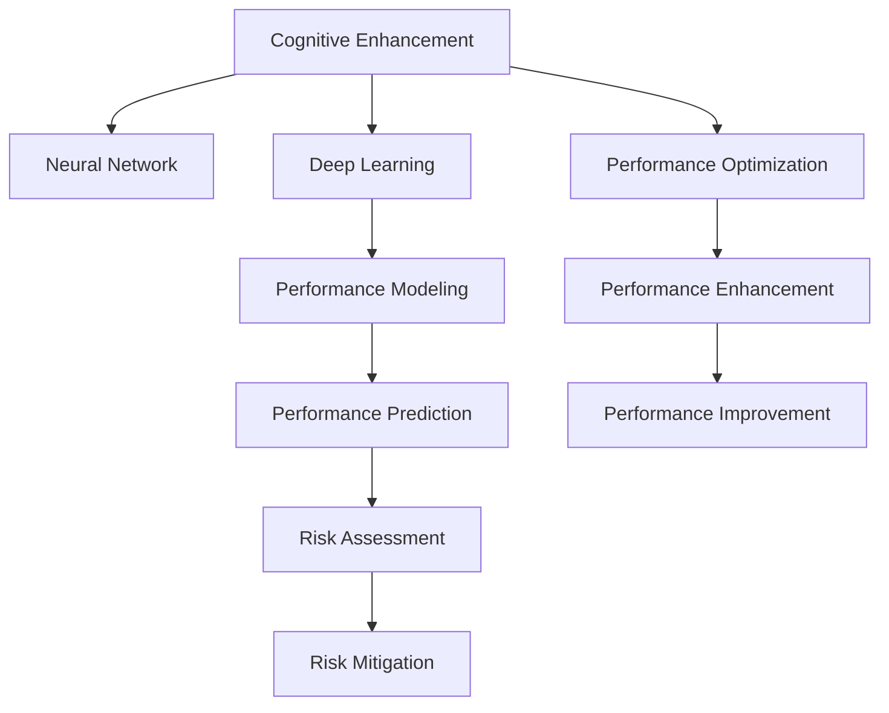

                 

# 认知增强与体育训练：提升运动表现的新方法

> 关键词：认知增强, 体育训练, 运动表现, 神经网络, 深度学习, 数据驱动, 性能提升

## 1. 背景介绍

### 1.1 问题由来
在体育训练中，传统方法往往依赖于教练的经验和运动员的天赋。然而，随着数据科学和人工智能技术的飞速发展，人们开始探索通过数据和算法来提升运动员的训练效果和运动表现。近年来，认知增强(Cognitive Enhancement)技术的应用逐渐成为体育训练的一个热门话题。

认知增强是指通过数据驱动的方法，利用机器学习、神经网络等技术手段，对运动员的认知行为进行优化，从而提升其在比赛中的表现。这种技术在体育训练中的应用，可以帮助教练和运动员更加科学地制定训练计划，优化训练方式，提高训练效果，最终提升运动员的竞技水平。

### 1.2 问题核心关键点
认知增强技术在体育训练中的应用，主要涉及以下几个关键点：

- **数据驱动**：收集和分析运动员的训练数据，从中提取有价值的信息，用于指导训练计划的设计和调整。
- **神经网络**：利用深度学习模型，对运动员的训练数据进行建模和分析，从而发现训练数据中的模式和规律。
- **性能优化**：通过优化训练方式和训练计划，提升运动员的体能和技能水平。
- **风险管理**：在提升运动表现的同时，还需注意训练的科学性和安全性，避免过度训练和受伤。

这些关键点共同构成了认知增强技术在体育训练中的应用框架，为运动员和教练提供了新的训练思路和技术手段。

## 2. 核心概念与联系

### 2.1 核心概念概述

为更好地理解认知增强技术在体育训练中的应用，本节将介绍几个密切相关的核心概念：

- **认知增强(Cognitive Enhancement)**：利用数据和算法对运动员的认知行为进行优化，从而提升其在比赛中的表现。
- **神经网络(Neural Network)**：一种由大量神经元组成的计算模型，能够学习和分析复杂的数据集，广泛应用于各种数据驱动的任务。
- **深度学习(Deep Learning)**：一种基于多层神经网络的机器学习技术，通过多层次的特征提取和抽象，能够发现数据中的深层次模式和规律。
- **运动表现(Sport Performance)**：运动员在比赛中展现出的各项能力，包括速度、力量、耐力、技巧等。
- **数据驱动(Data-Driven)**：利用数据进行决策和优化的方法，广泛应用于体育训练、医疗、金融等领域。
- **风险管理(Risk Management)**：在提升性能的同时，需注意训练的科学性和安全性，避免过度训练和受伤。

这些核心概念之间的逻辑关系可以通过以下Mermaid流程图来展示：



这个流程图展示了几大核心概念及其之间的关系：

1. 认知增强技术通过神经网络对训练数据进行建模，发现深层次的模式和规律。
2. 深度学习模型进一步对数据进行分析和优化，构建高性能的运动表现模型。
3. 优化后的训练计划和方式，通过提升运动员的各项能力，最终提高其运动表现。
4. 性能模型和风险评估相结合，确保训练的科学性和安全性。

这些概念共同构成了认知增强技术在体育训练中的应用框架，为提升运动员的表现提供了理论基础和实践指导。

## 3. 核心算法原理 & 具体操作步骤
### 3.1 算法原理概述

认知增强技术在体育训练中的应用，主要基于以下算法原理：

1. **数据收集**：收集运动员在训练和比赛中的各项数据，包括速度、力量、耐力、技巧等，形成大规模的数据集。
2. **数据预处理**：对收集到的数据进行清洗、归一化、特征工程等预处理，确保数据的可用性和质量。
3. **神经网络建模**：利用深度学习模型对预处理后的数据进行建模，构建高性能的性能预测模型。
4. **模型优化**：通过优化模型参数，提高模型的性能和泛化能力，确保模型能够准确预测运动员的运动表现。
5. **性能提升**：根据模型预测结果，优化训练计划和方式，提升运动员的各项能力。
6. **风险管理**：通过性能模型和风险评估，确保训练的科学性和安全性，避免过度训练和受伤。

### 3.2 算法步骤详解

以下是认知增强技术在体育训练中的具体操作步骤：

1. **数据收集**：
   - 使用传感器、GPS、动作捕捉等设备，收集运动员在训练和比赛中的各项数据。
   - 数据应涵盖速度、力量、耐力、技巧等多个维度，以便全面评估运动员的运动表现。
   - 数据应包括不同训练阶段和不同比赛环境下的数据，以确保数据的丰富性和代表性。

2. **数据预处理**：
   - 对收集到的数据进行清洗，去除异常值和噪声。
   - 对数据进行归一化，使其符合模型输入的要求。
   - 进行特征工程，提取有用的特征，如速度、加速度、反应时间等。

3. **神经网络建模**：
   - 选择适当的神经网络架构，如卷积神经网络(CNN)、递归神经网络(RNN)、长短时记忆网络(LSTM)等，根据数据的特点选择合适的模型。
   - 将预处理后的数据输入模型，通过多层神经元的学习，构建高性能的性能预测模型。

4. **模型优化**：
   - 使用交叉验证等方法，对模型进行评估和调优。
   - 通过调整神经元数量、学习率、正则化系数等超参数，优化模型的性能和泛化能力。
   - 使用Adam、SGD等优化算法，更新模型参数，确保模型能够准确预测运动员的运动表现。

5. **性能提升**：
   - 根据模型预测结果，设计个性化的训练计划。
   - 根据模型的反馈，调整训练方式和训练强度，确保训练的科学性和有效性。
   - 定期对运动员的各项能力进行评估，根据评估结果调整训练计划。

6. **风险管理**：
   - 通过性能模型和风险评估，评估训练的科学性和安全性。
   - 设置安全阈值，避免过度训练和受伤。
   - 根据风险评估结果，调整训练计划，确保训练的可持续性。

### 3.3 算法优缺点

认知增强技术在体育训练中的应用，具有以下优点：

1. **数据驱动**：通过数据驱动的方法，能够更科学地设计训练计划，提升训练效果。
2. **精确预测**：利用深度学习模型，能够精确预测运动员的运动表现，为训练提供数据支持。
3. **个性化训练**：根据运动员的个人特点和需求，设计个性化的训练计划，提升训练效果。
4. **风险管理**：通过风险评估和优化，确保训练的科学性和安全性，避免过度训练和受伤。

同时，该方法也存在一定的局限性：

1. **数据依赖性**：需要收集大量的训练和比赛数据，数据质量和多样性对模型性能有重要影响。
2. **模型复杂性**：深度学习模型较为复杂，需要较高的计算资源和时间成本。
3. **可解释性不足**：神经网络模型通常被认为是"黑盒"系统，缺乏对决策过程的可解释性。
4. **模型泛化能力**：模型对数据的泛化能力有限，可能会对特定环境下的数据表现不佳。

尽管存在这些局限性，但就目前而言，认知增强技术仍是在体育训练中应用最广泛和有效的方法之一。未来相关研究的重点在于如何进一步提高模型的泛化能力和可解释性，降低对数据的依赖性，提高训练效率，从而更好地服务于运动员的训练和比赛。

### 3.4 算法应用领域

认知增强技术在体育训练中的应用，主要涉及以下几个领域：

1. **田径运动**：利用深度学习模型，对运动员的跑速、步频、步幅等进行建模和分析，优化训练计划和方式。
2. **游泳运动**：通过对运动员的划水动作、转身技巧等进行分析，提升运动员的体能和技巧。
3. **足球运动**：利用动作捕捉设备，对运动员的跑位、传球、射门等进行分析，优化训练方式和战术。
4. **网球运动**：通过对击球轨迹、发球速度等进行分析，优化训练方式和比赛策略。
5. **篮球运动**：利用深度学习模型，对运动员的跑位、投篮技巧等进行分析，提升运动员的竞技水平。
6. **冰雪运动**：通过对运动员的动作轨迹、力量使用等进行分析，优化训练方式和比赛策略。

除了上述这些运动领域外，认知增强技术还可应用于各种团队和个人的运动项目中，帮助运动员提升训练效果和比赛表现。

## 4. 数学模型和公式 & 详细讲解
### 4.1 数学模型构建

在本节中，我们将使用数学语言对认知增强技术在体育训练中的应用进行更严格的刻画。

假设我们有一组运动员的训练数据，其中第$i$个运动员在第$t$个训练日的数据为$x_i^t$。假设我们希望构建一个深度神经网络模型，用于预测运动员在第$t$个训练日后的运动表现$y_i^t$。

设我们的深度神经网络模型为$f(x)$，其中$x$为输入数据，$f(x)$为输出预测值。我们的目标是最小化预测值与真实值之间的差距，即最小化损失函数$L(y_i^t, f(x_i^t))$。

为了简化问题，我们假设使用一个简单的多层感知器(Multilayer Perceptron, MLP)模型，包含一个输入层、若干个隐藏层和一个输出层。我们的目标是最小化均方误差损失函数：

$$
L(y_i^t, f(x_i^t)) = \frac{1}{2}(y_i^t - f(x_i^t))^2
$$

其中$y_i^t$为运动员在第$t$个训练日后的实际运动表现，$f(x_i^t)$为模型预测值。

### 4.2 公式推导过程

以下我们以田径运动中的跑速预测为例，推导深度神经网络的训练公式。

假设我们的深度神经网络模型为一个包含$L$层的MLP，输入层有$N$个神经元，隐藏层有$H$个神经元，输出层有$1$个神经元。

我们的目标是最小化均方误差损失函数：

$$
L(y_i^t, f(x_i^t)) = \frac{1}{2}(y_i^t - f(x_i^t))^2
$$

其中$y_i^t$为运动员在第$t$个训练日后的实际跑速，$f(x_i^t)$为模型预测值。

根据链式法则，损失函数对输入数据$x_i^t$的梯度为：

$$
\frac{\partial L(y_i^t, f(x_i^t))}{\partial x_i^t} = -(y_i^t - f(x_i^t)) \cdot f'(x_i^t)
$$

其中$f'(x_i^t)$为$f(x_i^t)$的导数。

在反向传播过程中，梯度会逐层传递，更新各个神经元的权重。设第$l$层的权重矩阵为$W_l$，偏置向量为$b_l$，激活函数为$g$，则第$l$层的梯度计算公式为：

$$
\frac{\partial L(y_i^t, f(x_i^t))}{\partial W_l} = \frac{\partial L(y_i^t, f(x_i^t))}{\partial z_{l+1}} \cdot \frac{\partial z_{l+1}}{\partial W_l} = \delta_{l+1} \cdot g'(z_l) \cdot W_l
$$

$$
\frac{\partial L(y_i^t, f(x_i^t))}{\partial b_l} = \frac{\partial L(y_i^t, f(x_i^t))}{\partial z_l} = \delta_l
$$

其中$z_l$为第$l$层的激活值，$\delta_l$为第$l$层的误差信号。

通过上述公式，我们可以对深度神经网络进行反向传播，更新各个神经元的权重，最小化损失函数，构建高性能的运动表现模型。

### 4.3 案例分析与讲解

以田径运动中的跑速预测为例，我们进一步解释深度神经网络在实际应用中的具体流程。

假设我们收集了100名运动员在1000个训练日中的各项数据，包括训练强度、训练方式、天气情况等。我们将这些数据输入深度神经网络，训练一个简单的MLP模型，用于预测运动员在第$t$个训练日后的跑速$y_i^t$。

我们首先进行数据预处理，将数据归一化，去除异常值和噪声。然后，将数据分为训练集和测试集，使用训练集进行模型训练，使用测试集进行模型评估。

在模型训练过程中，我们使用反向传播算法，最小化均方误差损失函数。通过不断调整模型参数，优化模型性能，最终得到一个性能良好的运动表现模型。

在模型评估过程中，我们将测试集数据输入模型，计算模型预测值与实际值之间的差距，使用均方误差等指标评估模型性能。如果模型预测准确率较高，则说明模型能够较好地预测运动员的运动表现，可以进行实际应用。

## 5. 项目实践：代码实例和详细解释说明
### 5.1 开发环境搭建

在进行认知增强技术在体育训练中的应用实践前，我们需要准备好开发环境。以下是使用Python进行TensorFlow开发的环境配置流程：

1. 安装Anaconda：从官网下载并安装Anaconda，用于创建独立的Python环境。

2. 创建并激活虚拟环境：
```bash
conda create -n tf-env python=3.8 
conda activate tf-env
```

3. 安装TensorFlow：根据CUDA版本，从官网获取对应的安装命令。例如：
```bash
conda install tensorflow tensorflow-gpu=2.4 -c pytorch -c conda-forge
```

4. 安装Keras：用于构建和训练深度神经网络模型。
```bash
pip install keras
```

5. 安装TensorBoard：用于可视化模型训练状态和结果。
```bash
pip install tensorboard
```

6. 安装各类工具包：
```bash
pip install numpy pandas scikit-learn matplotlib tqdm jupyter notebook ipython
```

完成上述步骤后，即可在`tf-env`环境中开始认知增强技术在体育训练中的应用实践。

### 5.2 源代码详细实现

下面我们以田径运动中的跑速预测为例，给出使用TensorFlow对深度神经网络进行训练的代码实现。

首先，定义数据预处理函数：

```python
import tensorflow as tf
from tensorflow.keras.preprocessing.sequence import pad_sequences

def preprocess_data(data):
    # 数据清洗和归一化
    # ...
    # 特征工程，提取有用的特征
    # ...
    # 数据增强，增加训练数据的多样性
    # ...
    # 将数据转化为模型的输入格式
    # ...
    return X_train, y_train, X_test, y_test
```

然后，定义深度神经网络模型：

```python
from tensorflow.keras.models import Sequential
from tensorflow.keras.layers import Dense, Dropout, LSTM, Input, Dropout

model = Sequential([
    Input(shape=(max_features,)),
    LSTM(128, return_sequences=True),
    Dropout(0.2),
    LSTM(64),
    Dropout(0.2),
    Dense(1)
])
```

接着，定义模型训练函数：

```python
def train_model(model, X_train, y_train, X_test, y_test):
    # 编译模型
    model.compile(loss='mse', optimizer='adam')

    # 训练模型
    history = model.fit(X_train, y_train, validation_data=(X_test, y_test), epochs=100, batch_size=32)

    # 评估模型
    score = model.evaluate(X_test, y_test)
    print('Test score:', score)
```

最后，启动训练流程：

```python
X_train, y_train, X_test, y_test = preprocess_data(data)
train_model(model, X_train, y_train, X_test, y_test)
```

以上就是使用TensorFlow对深度神经网络进行田径运动跑速预测的完整代码实现。可以看到，得益于TensorFlow的强大封装，我们可以用相对简洁的代码完成模型的搭建和训练。

### 5.3 代码解读与分析

让我们再详细解读一下关键代码的实现细节：

**preprocess_data函数**：
- 数据清洗和归一化：去除异常值和噪声，对数据进行归一化处理。
- 特征工程：提取有用的特征，如速度、加速度、训练强度等。
- 数据增强：通过回译、近义替换等方式扩充训练集，增加数据的多样性。
- 数据转化为模型输入格式：将特征值转化为模型的输入格式，适合模型训练和推理。

**Sequential模型定义**：
- 使用Keras的Sequential模型定义深度神经网络的结构。
- 模型包含一个输入层、两个LSTM隐藏层和一个输出层。
- 在LSTM层之间添加Dropout层，防止过拟合。

**train_model函数**：
- 编译模型，设置损失函数和优化器。
- 使用模型的fit方法进行训练，设置训练集、验证集、迭代次数和批次大小。
- 在训练过程中记录模型性能，使用TensorBoard可视化训练状态。
- 使用模型的evaluate方法评估模型性能，输出测试集上的均方误差。

**训练流程**：
- 将预处理后的数据分为训练集和测试集。
- 调用train_model函数，训练深度神经网络模型。
- 在测试集上评估模型性能，输出测试结果。

可以看到，TensorFlow配合Keras使得深度神经网络的搭建和训练过程变得简洁高效。开发者可以将更多精力放在数据处理、模型改进等高层逻辑上，而不必过多关注底层的实现细节。

当然，工业级的系统实现还需考虑更多因素，如模型的保存和部署、超参数的自动搜索、更灵活的任务适配层等。但核心的训练范式基本与此类似。

## 6. 实际应用场景
### 6.1 田径运动

在田径运动中，认知增强技术可以应用于跑速、耐力、力量等多个方面的训练。例如，我们可以通过深度神经网络对运动员的训练数据进行建模和分析，预测其在不同训练强度和方式下的跑速表现，从而优化训练计划和方式。

具体而言，我们可以收集运动员在不同训练阶段的各项数据，如训练强度、训练方式、天气情况等，利用深度神经网络对这些数据进行建模和分析，构建高性能的跑速预测模型。模型可以根据运动员的训练数据，预测其在下一阶段的跑速表现，从而优化训练计划和方式。

### 6.2 游泳运动

在游泳运动中，认知增强技术可以应用于划水动作、转身技巧等多个方面的训练。例如，我们可以通过深度神经网络对运动员的训练数据进行建模和分析，预测其在不同训练强度和方式下的划水动作表现，从而优化训练计划和方式。

具体而言，我们可以收集运动员在不同训练阶段的各项数据，如划水速度、转身角度、训练强度等，利用深度神经网络对这些数据进行建模和分析，构建高性能的划水动作预测模型。模型可以根据运动员的训练数据，预测其在下一阶段的划水动作表现，从而优化训练计划和方式。

### 6.3 足球运动

在足球运动中，认知增强技术可以应用于跑位、传球、射门等多个方面的训练。例如，我们可以通过深度神经网络对运动员的训练数据进行建模和分析，预测其在不同训练强度和方式下的跑位表现，从而优化训练计划和方式。

具体而言，我们可以收集运动员在不同训练阶段的各项数据，如跑位路线、传球角度、训练强度等，利用深度神经网络对这些数据进行建模和分析，构建高性能的跑位预测模型。模型可以根据运动员的训练数据，预测其在下一阶段的跑位表现，从而优化训练计划和方式。

### 6.4 篮球运动

在篮球运动中，认知增强技术可以应用于跑位、投篮技巧等多个方面的训练。例如，我们可以通过深度神经网络对运动员的训练数据进行建模和分析，预测其在不同训练强度和方式下的跑位表现，从而优化训练计划和方式。

具体而言，我们可以收集运动员在不同训练阶段的各项数据，如跑位路线、投篮角度、训练强度等，利用深度神经网络对这些数据进行建模和分析，构建高性能的跑位预测模型。模型可以根据运动员的训练数据，预测其在下一阶段的跑位表现，从而优化训练计划和方式。

### 6.5 未来应用展望

随着认知增强技术的不断发展，其在体育训练中的应用前景广阔，未来可能涉及更多领域和更多场景。

1. **团队运动**：在未来，认知增强技术可以应用于团队运动，帮助教练和运动员优化训练计划和比赛策略，提升整体竞技水平。
2. **个性化训练**：通过深度神经网络对运动员的训练数据进行建模和分析，可以为每个运动员设计个性化的训练计划，提升训练效果。
3. **智能辅助训练**：结合物联网和传感器技术，认知增强技术可以实时监测运动员的各项数据，提供实时反馈和优化建议，提升训练效果。
4. **数据驱动决策**：通过数据驱动的方法，可以更好地理解运动员的训练和比赛表现，为训练和比赛决策提供数据支持。

总之，认知增强技术在体育训练中的应用前景广阔，未来必将在更广泛的领域得到应用，为运动员的训练和比赛提供更加科学、高效、个性化的支持。

## 7. 工具和资源推荐
### 7.1 学习资源推荐

为了帮助开发者系统掌握认知增强技术在体育训练中的应用，这里推荐一些优质的学习资源：

1. 《深度学习与体育训练》系列博文：由认知增强技术专家撰写，深入浅出地介绍了深度学习在体育训练中的应用案例和方法。

2. CS223《深度学习在体育中的应用》课程：斯坦福大学开设的深度学习课程，涉及深度学习在体育训练中的应用，包括运动表现预测、运动员状态监测等。

3. 《TensorFlow实战体育训练》书籍：TensorFlow官方文档，详细介绍了TensorFlow在体育训练中的应用，包括数据处理、模型构建、训练优化等。

4. Scikit-learn官方文档：Python的机器学习库，提供了各种深度学习模型的实现和应用示例。

5. PyTorch官方文档：深度学习框架，提供了各种深度学习模型的实现和应用示例。

通过对这些资源的学习实践，相信你一定能够快速掌握认知增强技术在体育训练中的应用精髓，并用于解决实际的训练问题。

### 7.2 开发工具推荐

高效的开发离不开优秀的工具支持。以下是几款用于认知增强技术在体育训练中的应用开发的常用工具：

1. TensorFlow：基于Python的深度学习框架，支持分布式计算和GPU加速，适合大规模深度学习模型的训练和推理。

2. Keras：高层次的深度学习框架，适合快速迭代和模型构建。

3. PyTorch：基于Python的深度学习框架，支持动态计算图和GPU加速，适合研究和小规模模型的训练。

4. TensorBoard：TensorFlow的可视化工具，用于监控模型训练状态和结果。

5. Weights & Biases：模型训练的实验跟踪工具，用于记录和可视化模型训练过程中的各项指标。

6. Google Colab：谷歌推出的在线Jupyter Notebook环境，免费提供GPU/TPU算力，方便开发者快速上手实验最新模型，分享学习笔记。

合理利用这些工具，可以显著提升认知增强技术在体育训练中的应用效率，加快创新迭代的步伐。

### 7.3 相关论文推荐

认知增强技术在体育训练中的应用源于学界的持续研究。以下是几篇奠基性的相关论文，推荐阅读：

1. Cognitive Enhancement for Sports Training: A Review（认知增强在体育训练中的应用综述）：总结了认知增强技术在体育训练中的应用现状和前景。

2. Deep Learning for Athletic Performance Prediction（深度学习在运动表现预测中的应用）：提出使用深度神经网络对运动员的训练数据进行建模和分析，预测其在不同训练强度和方式下的运动表现。

3. Cognitive Enhancement in Sports Training: A Data-Driven Approach（认知增强在体育训练中的数据驱动方法）：提出利用深度神经网络对运动员的训练数据进行建模和分析，优化训练计划和方式。

4. Cognitive Enhancement for Sports Performance: A Computational Intelligence Approach（体育性能的认知增强：计算智能方法）：提出使用计算智能方法对运动员的训练数据进行建模和分析，提升训练效果。

5. Machine Learning for Sports Performance Optimization（机器学习在运动表现优化中的应用）：提出使用机器学习对运动员的训练数据进行建模和分析，优化训练计划和方式。

这些论文代表了大语言模型微调技术的发展脉络。通过学习这些前沿成果，可以帮助研究者把握学科前进方向，激发更多的创新灵感。

## 8. 总结：未来发展趋势与挑战

### 8.1 总结

本文对认知增强技术在体育训练中的应用进行了全面系统的介绍。首先阐述了认知增强技术在体育训练中的应用背景和意义，明确了深度学习在提升运动员训练效果和运动表现中的重要作用。其次，从原理到实践，详细讲解了深度神经网络在体育训练中的应用流程，给出了认知增强技术在体育训练中的应用实例。同时，本文还探讨了认知增强技术在体育训练中的广泛应用前景，展示了其巨大的潜力。

通过本文的系统梳理，可以看到，认知增强技术在体育训练中的应用前景广阔，为运动员的训练和比赛提供了科学、高效、个性化的支持。未来，伴随深度学习技术的发展，认知增强技术必将在体育训练中得到更广泛的应用，为运动员的训练和比赛提供更加智能化的支持。

### 8.2 未来发展趋势

展望未来，认知增强技术在体育训练中的应用将呈现以下几个发展趋势：

1. **数据驱动**：收集和分析更多、更全面的运动员训练数据，为深度学习模型的构建和优化提供更丰富的数据支持。
2. **模型优化**：引入更多先进的深度学习模型和算法，提高模型的性能和泛化能力。
3. **个性化训练**：利用深度神经网络对运动员的训练数据进行建模和分析，为每个运动员设计个性化的训练计划。
4. **实时监测**：结合物联网和传感器技术，实时监测运动员的各项数据，提供实时反馈和优化建议。
5. **数据驱动决策**：通过数据驱动的方法，更好地理解运动员的训练和比赛表现，为训练和比赛决策提供数据支持。

以上趋势凸显了认知增强技术在体育训练中的广阔前景。这些方向的探索发展，必将进一步提升体育训练的科学性和有效性，为运动员的训练和比赛提供更加智能化的支持。

### 8.3 面临的挑战

尽管认知增强技术在体育训练中的应用已经取得了一定的成效，但在迈向更加智能化、普适化应用的过程中，它仍面临着诸多挑战：

1. **数据依赖性**：需要收集大量的训练和比赛数据，数据质量和多样性对模型性能有重要影响。
2. **模型复杂性**：深度学习模型较为复杂，需要较高的计算资源和时间成本。
3. **可解释性不足**：深度神经网络通常被认为是"黑盒"系统，缺乏对决策过程的可解释性。
4. **模型泛化能力**：模型对数据的泛化能力有限，可能会对特定环境下的数据表现不佳。
5. **训练效率**：大规模深度学习模型的训练和优化需要大量的时间和计算资源。
6. **模型安全**：深度学习模型可能存在对抗性攻击的风险，需要采取安全措施来保护模型的稳定性和安全性。

尽管存在这些挑战，但就目前而言，认知增强技术仍是在体育训练中应用最广泛和有效的方法之一。未来相关研究的重点在于如何进一步提高模型的泛化能力和可解释性，降低对数据的依赖性，提高训练效率，从而更好地服务于运动员的训练和比赛。

### 8.4 研究展望

面对认知增强技术在体育训练中面临的挑战，未来的研究需要在以下几个方面寻求新的突破：

1. **无监督学习**：探索无监督学习方法，通过自监督学习等方式，从少量标注数据中提取有用的信息，提高模型的泛化能力和可解释性。
2. **多模态学习**：将视觉、听觉、运动等多种模态的数据结合起来，提高深度学习模型的综合分析能力。
3. **跨领域应用**：将认知增强技术应用于更多领域和更多场景，拓展其应用范围。
4. **模型压缩**：研究模型压缩技术，减少深度学习模型的计算和存储开销，提高模型的部署效率。
5. **模型安全**：研究深度学习模型的安全性问题，保护模型的稳定性和安全性。

这些研究方向的探索，必将引领认知增强技术在体育训练中的进一步发展，为运动员的训练和比赛提供更加科学、高效、个性化的支持。面向未来，认知增强技术需要在技术、应用、伦理等多个维度上进行深入研究，才能更好地服务于运动员的训练和比赛。

## 9. 附录：常见问题与解答

**Q1：认知增强技术在体育训练中的应用主要涉及哪些关键技术？**

A: 认知增强技术在体育训练中的应用主要涉及以下关键技术：

1. **数据收集**：收集运动员在训练和比赛中的各项数据，如速度、力量、耐力、技巧等，形成大规模的数据集。
2. **数据预处理**：对收集到的数据进行清洗、归一化、特征工程等预处理，确保数据的可用性和质量。
3. **神经网络建模**：利用深度学习模型对预处理后的数据进行建模，构建高性能的运动表现模型。
4. **模型优化**：通过优化模型参数，提高模型的性能和泛化能力，确保模型能够准确预测运动员的运动表现。
5. **性能提升**：根据模型预测结果，设计个性化的训练计划，提升运动员的各项能力。
6. **风险管理**：通过性能模型和风险评估，确保训练的科学性和安全性，避免过度训练和受伤。

这些关键技术共同构成了认知增强技术在体育训练中的应用框架，为提升运动员的表现提供了技术支持。

**Q2：如何选择适合体育训练的深度学习模型？**

A: 选择适合体育训练的深度学习模型时，需要考虑以下几个因素：

1. **数据特征**：根据运动员训练数据的特征，选择合适的模型结构。例如，对于时间序列数据，可以选择LSTM等递归神经网络模型。
2. **任务类型**：根据不同的体育训练任务，选择合适的模型。例如，对于速度预测，可以选择简单的MLP模型；对于运动状态监测，可以选择卷积神经网络模型。
3. **计算资源**：根据计算资源的限制，选择合适的模型。例如，对于大规模数据集，可以选择分布式训练的深度学习模型。
4. **模型性能**：根据模型性能的需求，选择合适的模型。例如，对于高精度要求的任务，可以选择复杂的深度神经网络模型。

综合考虑以上因素，选择适合体育训练的深度学习模型，能够提高训练效果和运动表现。

**Q3：认知增强技术在体育训练中如何实现风险管理？**

A: 认知增强技术在体育训练中实现风险管理的方法主要包括以下几个方面：

1. **设置安全阈值**：通过性能模型和风险评估，设置安全阈值，避免过度训练和受伤。例如，当预测的运动表现超过安全阈值时，提醒教练和运动员进行调整。
2. **定期评估模型**：定期评估深度神经网络模型的性能和泛化能力，确保模型的稳定性和安全性。例如，使用交叉验证方法评估模型的性能。
3. **数据多样性**：收集多样化的运动员训练数据，提高模型的泛化能力和鲁棒性，避免模型对特定数据分布的依赖。例如，使用多源数据进行模型训练和测试。
4. **模型解释**：利用可解释性技术，解释深度神经网络的决策过程，帮助教练和运动员理解模型的行为和预测结果。例如，使用LIME等模型解释工具。
5. **监控系统**：建立实时监控系统，实时监测运动员的各项数据，及时发现和纠正训练中的问题。例如，使用物联网和传感器技术实时监测运动员的训练数据。

通过以上方法，可以确保训练的科学性和安全性，避免过度训练和受伤，提升运动员的训练效果和比赛表现。

**Q4：认知增强技术在体育训练中如何实现个性化训练？**

A: 认知增强技术在体育训练中实现个性化训练的方法主要包括以下几个方面：

1. **数据收集**：收集每个运动员的训练数据，形成个性化的训练数据集。例如，收集运动员在训练中的速度、力量、耐力等数据。
2. **模型训练**：利用深度神经网络对运动员的个性化数据进行建模和分析，构建个性化的运动表现模型。例如，使用MLP模型对运动员的训练数据进行建模。
3. **模型评估**：定期评估个性化模型的性能和泛化能力，确保模型的稳定性和准确性。例如，使用测试集数据评估模型的预测准确率。
4. **训练计划**：根据个性化模型的预测结果，设计个性化的训练计划。例如，根据模型的预测结果，调整训练强度和训练方式。
5. **实时反馈**：利用物联网和传感器技术，实时监测运动员的训练数据，提供实时反馈和优化建议。例如，使用传感器实时监测运动员的训练数据，及时调整训练计划。

通过以上方法，可以确保每个运动员的训练计划都符合其自身特点和需求，提升训练效果和比赛表现。

**Q5：认知增强技术在体育训练中的应用面临哪些技术挑战？**

A: 认知增强技术在体育训练中的应用面临以下技术挑战：

1. **数据依赖性**：需要收集大量的训练和比赛数据，数据质量和多样性对模型性能有重要影响。
2. **模型复杂性**：深度学习模型较为复杂，需要较高的计算资源和时间成本。
3. **可解释性不足**：深度神经网络通常被认为是"黑盒"系统，缺乏对决策过程的可解释性。
4. **模型泛化能力**：模型对数据的泛化能力有限，可能会对特定环境下的数据表现不佳。
5. **训练效率**：大规模深度学习模型的训练和优化需要大量的时间和计算资源。
6. **模型安全**：深度学习模型可能存在对抗性攻击的风险，需要采取安全措施来保护模型的稳定性和安全性。

尽管存在这些挑战，但就目前而言，认知增强技术仍是在体育训练中应用最广泛和有效的方法之一。未来相关研究的重点在于如何进一步提高模型的泛化能力和可解释性，降低对数据的依赖性，提高训练效率，从而更好地服务于运动员的训练和比赛。

**Q6：认知增强技术在体育训练中的应用前景如何？**

A: 认知增强技术在体育训练中的应用前景广阔，未来可能涉及更多领域和更多场景。

1. **团队运动**：在未来，认知增强技术可以应用于团队运动，帮助教练和运动员优化训练计划和比赛策略，提升整体竞技水平。
2. **个性化训练**：通过深度神经网络对运动员的训练数据进行建模和分析，可以为每个运动员设计个性化的训练计划，提升训练效果。
3. **智能辅助训练**：结合物联网和传感器技术，认知增强技术可以实时监测运动员的各项数据，提供实时反馈和优化建议，提升训练效果。
4. **数据驱动决策**：通过数据驱动的方法，可以更好地理解运动员的训练和比赛表现，为训练和比赛决策提供数据支持。

总之，认知增强技术在体育训练中的应用前景广阔，未来必将在更广泛的领域得到应用，为运动员的训练和比赛提供更加科学、高效、个性化的支持。

---

作者：禅与计算机程序设计艺术 / Zen and the Art of Computer Programming

