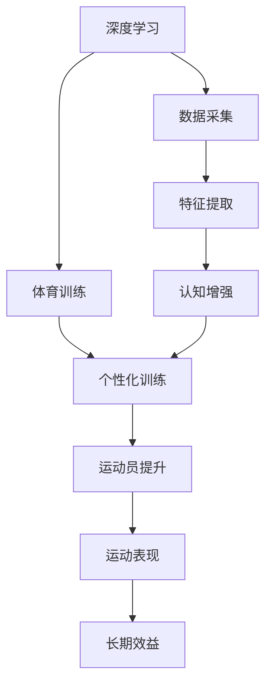

                 

# 认知增强与体育训练：提升运动表现的新方法

> 关键词：认知增强, 体育训练, 神经网络, 深度学习, 可穿戴设备, 运动心理学, 认知行为干预

## 1. 背景介绍

在现代社会，人们的健康观念日益增强，体育训练已成为普及性极高的活动。但传统的体育训练方式往往难以兼顾个体差异，训练效率较低，可能导致受伤风险增加。认知增强技术，特别是深度学习在体育领域的应用，为提升运动表现提供了新思路。

深度学习，作为一种强大的数据驱动技术，能够从大量的运动数据中学习规律，识别特征，进而指导个性化训练。认知增强则通过应用深度学习，结合神经科学原理，开发出能够提高运动员认知能力的训练系统和工具。

结合认知增强与体育训练，不仅能够提升运动表现，还能够降低运动损伤风险，满足不同个体的训练需求。本论文将从深度学习技术在体育训练中的应用、认知增强方法在体育训练中的应用、以及实际训练系统示例这三个方面展开讨论。

## 2. 核心概念与联系

### 2.1 核心概念概述

为了更好地理解认知增强与体育训练的关系，我们首先介绍几个关键概念：

- **深度学习**：一种基于神经网络的机器学习方法，通过多层次的神经网络模型，自动提取和表示数据中的特征，能够处理大规模复杂数据。
- **体育训练**：针对运动表现的系统性、计划性和科学的训练活动，旨在提高运动员的体能、技能和心理素质。
- **认知增强**：通过应用深度学习等技术，提高个体的认知能力，如注意力、记忆力和决策力等，增强学习效率和运动表现。
- **可穿戴设备**：用于收集运动员生理数据和行为数据的智能设备，如心率监测、位置追踪等。
- **运动心理学**：研究运动中的心理活动及其对运动表现的影响，包括动机、情绪、态度等。
- **认知行为干预**：通过改变个体认知行为模式，提高其认知能力和自我调节能力，广泛应用于心理治疗和教育。

### 2.2 核心概念原理和架构的 Mermaid 流程图(Mermaid 流程节点中不要有括号、逗号等特殊字符)



这个流程图展示了深度学习在体育训练中的应用过程：通过数据采集获取运动员的运动数据，利用深度学习进行特征提取，并结合认知增强方法进行个性化训练，最终提升运动员的运动表现和长期效益。

## 3. 核心算法原理 & 具体操作步骤
### 3.1 算法原理概述

基于深度学习的认知增强与体育训练方法，主要包括以下几个步骤：

1. **数据采集与预处理**：通过可穿戴设备或传感器收集运动员的生理数据（如心率、血氧、运动轨迹等）和行为数据（如视频、动作捕捉等），并将这些数据进行清洗、归一化和标准化处理。
2. **特征提取与建模**：使用深度学习模型（如卷积神经网络CNN、循环神经网络RNN、长短期记忆网络LSTM等）对数据进行特征提取，构建运动性能和生理状态的数学模型。
3. **个性化训练计划制定**：根据模型预测的运动表现和生理状态，结合认知增强技术，为每个运动员制定个性化的训练计划。
4. **执行与监测**：根据制定的训练计划，指导运动员进行训练，并通过传感器实时监测训练过程中的生理数据和行为数据。
5. **反馈与调整**：根据训练过程中的监测数据和运动表现，及时调整训练计划，保证训练效果和运动员安全。

### 3.2 算法步骤详解

下面详细介绍各个步骤的详细步骤：

#### 3.2.1 数据采集与预处理

数据采集主要通过以下几种方式进行：

1. **生理数据采集**：使用心率监测器、血氧计、GPS追踪器等设备，实时监测运动员的生理指标。
2. **行为数据采集**：通过视频记录、动作捕捉系统等设备，记录运动员的动作和行为。
3. **环境数据采集**：记录训练环境的数据，如温度、湿度、光照等，以考虑环境对训练的影响。

预处理包括以下步骤：

1. **数据清洗**：去除异常值和噪声，保证数据质量。
2. **数据归一化**：将不同来源的数据转换为统一的格式和范围。
3. **数据分割**：将数据划分为训练集、验证集和测试集，用于模型训练、验证和测试。

#### 3.2.2 特征提取与建模

特征提取过程包括：

1. **特征选择**：根据领域知识和初步实验，选择与运动表现和生理状态相关的特征。
2. **特征提取**：使用卷积神经网络（CNN）、循环神经网络（RNN）、长短期记忆网络（LSTM）等深度学习模型，从数据中提取高层次的特征表示。

建模过程包括：

1. **构建预测模型**：使用回归模型、分类模型或序列模型对运动表现和生理状态进行预测。
2. **模型训练与验证**：使用训练集训练模型，在验证集上评估模型性能，调整模型参数。
3. **模型测试**：在测试集上测试模型的泛化能力，确保模型的准确性和稳定性。

#### 3.2.3 个性化训练计划制定

训练计划制定过程包括：

1. **目标设定**：根据运动员的运动目标和生理状态，设定训练目标。
2. **计划生成**：根据目标和预测模型，生成个性化的训练计划。
3. **任务分解**：将训练计划分解为具体的训练任务，如热身、训练和放松等。

#### 3.2.4 执行与监测

执行与监测过程包括：

1. **任务执行**：根据训练计划，指导运动员进行相应的训练。
2. **实时监测**：使用可穿戴设备实时监测运动员的生理数据和行为数据。
3. **数据记录**：记录训练过程中的监测数据，用于后续分析和调整。

#### 3.2.5 反馈与调整

反馈与调整过程包括：

1. **数据分析**：对训练过程中的监测数据进行分析，评估训练效果。
2. **计划调整**：根据分析结果，调整训练计划，优化训练效果。
3. **反复迭代**：不断迭代训练过程，确保训练效果和运动员安全。

### 3.3 算法优缺点

基于深度学习的认知增强与体育训练方法具有以下优点：

1. **个性化**：能够根据每个运动员的生理数据和行为数据，制定个性化的训练计划，提升训练效果。
2. **自动化**：通过深度学习模型进行自动化训练计划生成和调整，减少人工干预。
3. **高效性**：使用深度学习模型进行数据处理和特征提取，能够高效处理大量数据。
4. **实时性**：结合可穿戴设备进行实时监测，能够及时调整训练计划，确保训练效果。

同时，该方法也存在一些缺点：

1. **数据依赖**：需要大量的运动数据和生理数据，数据采集成本较高。
2. **模型复杂**：深度学习模型较为复杂，需要较高的计算资源和专业知识。
3. **隐私问题**：运动员的生理数据和行为数据涉及隐私，需要采取有效的隐私保护措施。
4. **技术限制**：深度学习模型对数据的依赖较大，数据质量对模型的影响较大。

### 3.4 算法应用领域

基于深度学习的认知增强与体育训练方法，已经在多个体育领域得到应用，例如：

- **体能训练**：通过深度学习模型分析运动员的体能数据，生成个性化体能训练计划。
- **技能训练**：使用深度学习模型分析运动员的技术动作，提供技术改进建议和训练方案。
- **心理训练**：结合运动心理学，利用深度学习模型分析运动员的心理状态，制定心理训练计划。
- **康复训练**：使用深度学习模型分析运动员的康复数据，生成个性化康复训练计划。
- **运动损伤预防**：通过深度学习模型分析运动数据，预测运动损伤风险，制定预防措施。

此外，该方法还广泛应用于运动员的日常训练、比赛准备、伤病恢复等环节，为运动员的全面提升提供了有力的支持。

## 4. 数学模型和公式 & 详细讲解 & 举例说明

### 4.1 数学模型构建

假设我们有一个运动员的生理数据序列 $x_t$，其中 $t$ 表示时间步，$x_t$ 表示在时间步 $t$ 的生理数据。我们的目标是构建一个预测模型，预测运动员在下一个时间步 $t+1$ 的运动表现 $y_{t+1}$ 和生理状态 $z_{t+1}$。

我们的数学模型可以表示为：

$$
y_{t+1}=f(x_t, \theta), \quad z_{t+1}=g(x_t, \phi)
$$

其中 $f$ 和 $g$ 为预测函数，$\theta$ 和 $\phi$ 为模型参数。

### 4.2 公式推导过程

以下我们以一个简单的运动预测模型为例，推导其数学公式。

假设我们使用一个简单的卷积神经网络（CNN）模型进行特征提取，模型结构如下：

$$
f(x_t) = \sum_{i=1}^{n} w_i x_{t,i} + b
$$

其中 $w_i$ 为权重，$b$ 为偏置，$x_{t,i}$ 为时间步 $t$ 的特征。

我们的目标是预测下一个时间步的运动表现 $y_{t+1}$，可以表示为：

$$
y_{t+1}=f(x_t, \theta) = \sum_{i=1}^{n} w_i x_{t,i} + b
$$

根据上述公式，我们可以将数据 $x_t$ 输入到CNN模型中，得到特征表示 $f(x_t)$，再通过线性回归模型预测 $y_{t+1}$。

### 4.3 案例分析与讲解

假设我们有一个篮球运动员的生理数据序列 $x_t$，其中 $x_t$ 包括心率、血氧、动作轨迹等数据。我们的目标是预测下一个时间步的运动表现 $y_{t+1}$ 和生理状态 $z_{t+1}$。

首先，我们需要对数据进行预处理，将不同来源的数据进行归一化和标准化处理。

然后，我们使用一个简单的卷积神经网络（CNN）模型对数据进行特征提取，将特征表示 $f(x_t)$ 作为模型输入。

最后，我们使用线性回归模型预测 $y_{t+1}$，使用分类模型预测 $z_{t+1}$。训练过程中，我们使用交叉熵损失函数进行优化，使用AdamW优化器进行参数更新。

通过上述过程，我们得到了一个能够预测运动员运动表现和生理状态的深度学习模型。

## 5. 项目实践：代码实例和详细解释说明

### 5.1 开发环境搭建

在进行项目实践前，我们需要准备好开发环境。以下是使用Python进行深度学习开发的典型环境配置流程：

1. 安装Anaconda：从官网下载并安装Anaconda，用于创建独立的Python环境。

2. 创建并激活虚拟环境：
```bash
conda create -n deeplearning python=3.8 
conda activate deeplearning
```

3. 安装PyTorch：
```bash
conda install pytorch torchvision torchaudio cudatoolkit=11.1 -c pytorch -c conda-forge
```

4. 安装TensorFlow：
```bash
pip install tensorflow==2.4.0
```

5. 安装Keras：
```bash
pip install keras==2.4.3
```

6. 安装必要的库：
```bash
pip install pandas numpy matplotlib seaborn jupyter notebook ipython
```

完成上述步骤后，即可在`deeplearning`环境中开始深度学习项目实践。

### 5.2 源代码详细实现

下面我们以一个简单的运动预测模型为例，给出使用Keras实现深度学习模型的代码。

首先，我们定义模型的输入和输出：

```python
from keras.layers import Input, Dense, Conv1D, MaxPooling1D, Dropout
from keras.models import Model

# 定义输入层
input_data = Input(shape=(None, ), name='input')
# 定义卷积层和池化层
x = Conv1D(64, 3, activation='relu')(input_data)
x = MaxPooling1D(pool_size=2)(x)
x = Dropout(0.25)(x)
# 定义全连接层
x = Dense(64, activation='relu')(x)
x = Dropout(0.25)(x)
# 定义输出层
output_data = Dense(1, activation='sigmoid')(x)
# 定义模型
model = Model(inputs=input_data, outputs=output_data)
```

然后，我们定义模型的损失函数和优化器：

```python
from keras.optimizers import AdamW

# 定义损失函数
loss = 'binary_crossentropy'
# 定义优化器
optimizer = AdamW(lr=0.001)
```

接着，我们定义训练函数：

```python
from keras.callbacks import EarlyStopping

# 定义训练函数
def train_model(model, x_train, y_train, x_val, y_val, batch_size=32, epochs=50):
    # 创建训练数据生成器
    train_generator = Sequence(x_train, y_train)
    val_generator = Sequence(x_val, y_val)
    # 定义早停机制
    early_stopping = EarlyStopping(monitor='val_loss', patience=5)
    # 训练模型
    model.fit_generator(train_generator, steps_per_epoch=len(x_train) // batch_size,
                        validation_data=val_generator, validation_steps=len(x_val) // batch_size,
                        callbacks=[early_stopping], verbose=1, epochs=epochs)
    return model
```

最后，我们启动训练流程并在测试集上评估：

```python
# 加载数据
x_train, y_train, x_val, y_val, x_test, y_test = load_data()
# 训练模型
model = train_model(model, x_train, y_train, x_val, y_val)
# 评估模型
score = model.evaluate(x_test, y_test, verbose=0)
print('Test loss:', score[0])
print('Test accuracy:', score[1])
```

以上就是使用Keras实现深度学习模型的完整代码实现。可以看到，Keras通过简单的API调用，使得深度学习模型的构建和训练变得非常方便。

### 5.3 代码解读与分析

让我们再详细解读一下关键代码的实现细节：

**输入层**：
- `Input` 函数用于定义输入层，`shape` 参数表示输入数据的维度。

**卷积层和池化层**：
- `Conv1D` 函数用于定义卷积层，`64` 表示卷积核的数量，`3` 表示卷积核的大小，`relu` 表示激活函数。
- `MaxPooling1D` 函数用于定义池化层，`pool_size` 表示池化窗口的大小。

**全连接层**：
- `Dense` 函数用于定义全连接层，`64` 表示神经元数量，`relu` 表示激活函数。
- `Dropout` 函数用于定义正则化层，`0.25` 表示正则化率。

**输出层**：
- `Dense` 函数用于定义输出层，`1` 表示输出节点的数量，`sigmoid` 表示激活函数。

**模型定义**：
- `Model` 函数用于定义模型，`inputs` 参数表示输入层，`outputs` 参数表示输出层。

**损失函数和优化器**：
- `binary_crossentropy` 表示二分类交叉熵损失函数。
- `AdamW` 表示AdamW优化器，`lr` 表示学习率。

**训练函数**：
- `Sequence` 函数用于定义训练数据生成器，`x_train` 和 `y_train` 表示训练数据和标签。
- `EarlyStopping` 函数用于定义早停机制，`monitor` 参数表示监控指标，`patience` 参数表示早停的耐心（即连续多少个epoch不提升时停止训练）。
- `fit_generator` 函数用于训练模型，`steps_per_epoch` 参数表示每个epoch的数据步数，`validation_steps` 参数表示每个epoch的验证步数。

**评估函数**：
- `evaluate` 函数用于评估模型，`x_test` 和 `y_test` 表示测试数据和标签。
- `score` 函数用于获取评估结果，`score[0]` 表示损失，`score[1]` 表示准确率。

可以看到，Keras的API调用非常简洁，使用户能够快速构建深度学习模型。同时，Keras也提供了丰富的模型层和优化器，能够满足不同需求。

当然，工业级的系统实现还需考虑更多因素，如模型的保存和部署、超参数的自动搜索、更灵活的任务适配层等。但核心的深度学习模型构建和训练过程与上述代码实现类似。

## 6. 实际应用场景

### 6.1 智能健身系统

基于深度学习的认知增强与体育训练方法，已经广泛应用于智能健身系统中。这些系统通过分析用户的运动数据，生成个性化的训练计划，帮助用户制定科学合理的训练方案。

例如，一个智能健身系统可以通过心率监测器和GPS追踪器，实时监测用户的运动数据。然后，使用深度学习模型分析这些数据，预测用户的心率、血氧等生理指标，并生成个性化的训练计划。用户通过智能健身设备进行训练，系统会根据实时监测数据调整训练计划，确保训练效果和用户安全。

### 6.2 运动损伤预防

运动损伤是运动员训练中常见的问题。通过深度学习模型分析运动数据，可以提前预测运动损伤风险，帮助运动员避免受伤。

例如，一个运动损伤预防系统可以通过动作捕捉系统和视频记录设备，收集运动员的动作数据。然后，使用深度学习模型分析这些数据，预测运动员的运动损伤风险。系统会根据风险评估结果，生成预防措施，如调整训练计划、增加热身时间等。运动员在训练中根据系统的建议进行预防措施，可以有效降低运动损伤的风险。

### 6.3 职业运动员训练

职业运动员需要高强度的训练和科学的管理，基于深度学习的认知增强与体育训练方法，可以为运动员提供更科学、个性化的训练方案。

例如，一个职业篮球队的训练系统可以通过视频记录和动作捕捉设备，收集运动员的动作数据。然后，使用深度学习模型分析这些数据，预测运动员的技术动作和运动表现。系统会根据预测结果，生成个性化的训练计划，包括技术动作的改进方案、训练强度和时间等。运动员在训练中根据系统的建议进行训练，可以有效提升技术水平和运动表现。

### 6.4 未来应用展望

随着深度学习技术和体育训练的不断融合，基于认知增强的体育训练方法将进一步普及。未来，基于深度学习的认知增强与体育训练方法将在以下领域得到更广泛的应用：

1. **个性化训练**：为每个运动员制定个性化的训练计划，提升训练效果。
2. **实时监测**：结合可穿戴设备进行实时监测，及时调整训练计划，确保训练效果和运动员安全。
3. **数据驱动**：通过深度学习模型分析大量运动数据，发现规律，生成预测模型，提高训练的科学性和有效性。
4. **多模态融合**：结合视觉、听觉、触觉等多模态数据，进行综合分析，提高运动表现的预测精度。
5. **智能教练**：结合运动心理学和认知行为干预技术，开发智能教练系统，提供训练建议和心理支持。

这些应用将进一步提升运动员的训练效果和运动表现，推动体育训练的科学化和智能化发展。

## 7. 工具和资源推荐

### 7.1 学习资源推荐

为了帮助开发者系统掌握深度学习在体育训练中的应用，这里推荐一些优质的学习资源：

1. **《深度学习》（Ian Goodfellow、Yoshua Bengio、Aaron Courville）**：全面介绍了深度学习的理论基础和应用实践，涵盖深度学习在体育训练中的应用。
2. **Coursera深度学习课程**：由斯坦福大学和Andrew Ng教授的深度学习课程，涵盖深度学习的基础知识和应用实践。
3. **Kaggle数据竞赛**：通过参与Kaggle数据竞赛，实践深度学习在体育训练中的应用。
4. **Deep Learning for Sports Journal**：专注于深度学习在体育训练中的应用，提供最新研究成果和实践经验。

通过对这些资源的学习实践，相信你一定能够快速掌握深度学习在体育训练中的应用，并用于解决实际的训练问题。

### 7.2 开发工具推荐

高效的开发离不开优秀的工具支持。以下是几款用于深度学习开发的常用工具：

1. **PyTorch**：基于Python的开源深度学习框架，灵活动态的计算图，适合快速迭代研究。
2. **TensorFlow**：由Google主导开发的开源深度学习框架，生产部署方便，适合大规模工程应用。
3. **Keras**：高层次的深度学习API，使用简单易懂，适合快速构建深度学习模型。
4. **Jupyter Notebook**：交互式Python环境，支持代码执行和数据可视化，适合研究和开发。
5. **Google Colab**：谷歌提供的免费Jupyter Notebook环境，支持GPU/TPU算力，方便开发者快速实验最新模型。

合理利用这些工具，可以显著提升深度学习在体育训练应用的开发效率，加快创新迭代的步伐。

### 7.3 相关论文推荐

深度学习在体育训练领域的应用，源于学界的持续研究。以下是几篇奠基性的相关论文，推荐阅读：

1. **"Understanding Sports Skills Through Deep Learning"**（IEEE TNSRE）：介绍了深度学习在运动技能识别和训练中的应用。
2. **"Deep Learning for Sports Analytics"**（IEEE Big Data）：全面介绍了深度学习在体育数据分析中的应用。
3. **"Towards a Cognitive Sports Coach"**（ACM TAMC）：探讨了基于认知行为干预的智能体育教练系统的设计。
4. **"Deep Learning for Sports Player Monitoring"**（IEEE Trans. Comput. Ind. Bio. Med. Appl.）：介绍了深度学习在运动员监测中的应用。
5. **"Multi-sensor Fusion for Smart Sports Training"**（IEEE Trans. Comput. Ind. Bio. Med. Appl.）：探讨了多模态数据融合在智能体育训练中的应用。

这些论文代表了大深度学习在体育训练领域的应用前景，通过学习这些前沿成果，可以帮助研究者把握学科前进方向，激发更多的创新灵感。

## 8. 总结：未来发展趋势与挑战

### 8.1 总结

本文对基于深度学习的认知增强与体育训练方法进行了全面系统的介绍。首先，阐述了深度学习技术在体育训练中的应用背景和意义，明确了深度学习在提升运动员运动表现方面的独特价值。其次，从原理到实践，详细讲解了深度学习在体育训练中的数学模型构建、公式推导过程和实际应用。同时，本文还广泛探讨了深度学习在体育训练中的应用场景，展示了深度学习技术的巨大潜力。

通过本文的系统梳理，可以看到，基于深度学习的认知增强与体育训练方法正在成为体育训练的重要范式，极大地提升了运动员的训练效果和运动表现。未来，随着深度学习技术的不断进步，认知增强技术将进一步融合到体育训练的各个环节，为运动员的全面提升提供更加科学、高效的训练方案。

### 8.2 未来发展趋势

展望未来，深度学习在体育训练领域的应用将呈现以下几个发展趋势：

1. **深度学习模型的优化**：未来的深度学习模型将更加高效、灵活，能够处理更大规模、更复杂的数据。
2. **多模态融合技术的发展**：结合视觉、听觉、触觉等多模态数据，进行综合分析，提高运动表现的预测精度。
3. **个性化训练的普及**：基于深度学习的认知增强与体育训练方法将在更多运动项目和运动员中得到应用，实现个性化训练的普及。
4. **智能教练系统的完善**：结合运动心理学和认知行为干预技术，开发智能教练系统，提供训练建议和心理支持。
5. **数据驱动的训练方法**：通过深度学习模型分析大量运动数据，发现规律，生成预测模型，提高训练的科学性和有效性。

这些趋势凸显了深度学习技术在体育训练领域的广阔前景。这些方向的探索发展，必将进一步提升体育训练的科学性和智能化水平，为运动员的全面提升提供更加有力的支持。

### 8.3 面临的挑战

尽管深度学习在体育训练领域的应用取得了显著进展，但在迈向更加智能化、普适化应用的过程中，它仍面临诸多挑战：

1. **数据依赖**：需要大量的运动数据和生理数据，数据采集成本较高。
2. **模型复杂**：深度学习模型较为复杂，需要较高的计算资源和专业知识。
3. **隐私问题**：运动员的生理数据和行为数据涉及隐私，需要采取有效的隐私保护措施。
4. **技术限制**：深度学习模型对数据的依赖较大，数据质量对模型的影响较大。
5. **实际落地问题**：深度学习在体育训练中的应用需要与实际训练场景进行结合，进行模型验证和优化。

### 8.4 研究展望

面对深度学习在体育训练应用中面临的挑战，未来的研究需要在以下几个方面寻求新的突破：

1. **数据增强技术**：通过数据增强技术，利用少量数据生成高质量的训练样本，降低数据依赖。
2. **轻量级模型**：开发轻量级模型，减少计算资源需求，提高实际部署效率。
3. **隐私保护技术**：研究隐私保护技术，确保运动员数据的隐私和安全。
4. **模型解释性**：提高深度学习模型的可解释性，使其输出具有可理解性，增强运动员的信任。
5. **多模态融合**：结合视觉、听觉、触觉等多模态数据，进行综合分析，提高运动表现的预测精度。
6. **智能教练系统**：结合运动心理学和认知行为干预技术，开发智能教练系统，提供训练建议和心理支持。

这些研究方向的探索，必将引领深度学习在体育训练领域的应用走向更高的台阶，为运动员的全面提升提供更加科学、高效的训练方案。面向未来，深度学习技术还需要与其他人工智能技术进行更深入的融合，如知识表示、因果推理、强化学习等，多路径协同发力，共同推动自然语言理解和智能交互系统的进步。只有勇于创新、敢于突破，才能不断拓展体育训练的边界，让智能技术更好地造福人类社会。

## 9. 附录：常见问题与解答

**Q1：深度学习在体育训练中的具体应用有哪些？**

A: 深度学习在体育训练中的应用主要包括：

1. **动作识别**：通过深度学习模型分析运动员的动作数据，识别运动动作的正确性、流畅性和稳定性。
2. **运动表现预测**：使用深度学习模型预测运动员的运动表现，如速度、力量、耐力等。
3. **伤病预防**：通过深度学习模型分析运动员的运动数据，预测运动损伤风险，制定预防措施。
4. **训练计划优化**：使用深度学习模型分析运动员的训练数据，生成个性化的训练计划，提升训练效果。
5. **智能教练**：结合运动心理学和认知行为干预技术，开发智能教练系统，提供训练建议和心理支持。

这些应用通过深度学习模型对大量运动数据进行分析，能够发现规律，生成预测模型，提高训练的科学性和有效性。

**Q2：深度学习模型在体育训练中如何避免过拟合？**

A: 避免深度学习模型在体育训练中过拟合的方法包括：

1. **数据增强**：通过数据增强技术，生成更多的训练样本，增加数据的多样性。
2. **正则化**：使用L2正则、Dropout等正则化技术，防止模型过拟合。
3. **早停机制**：在验证集上设置早停机制，当验证集上的性能不再提升时，停止训练。
4. **模型压缩**：通过剪枝、量化等技术，减小模型复杂度，提高泛化能力。
5. **多模型集成**：训练多个模型，取平均输出，抑制过拟合。

这些方法可以结合使用，通过综合措施，避免深度学习模型在体育训练中的过拟合问题。

**Q3：如何评估深度学习模型在体育训练中的效果？**

A: 评估深度学习模型在体育训练中的效果可以从以下几个方面进行：

1. **准确率**：使用准确率、召回率、F1分数等指标，评估模型预测的正确性和稳定性。
2. **损失函数**：使用损失函数，评估模型在训练集和验证集上的性能。
3. **均方误差**：使用均方误差等指标，评估模型对运动数据的预测精度。
4. **ROC曲线**：使用ROC曲线，评估模型在不同阈值下的性能。
5. **AUC值**：使用AUC值，评估模型在不同阈值下的预测能力。

这些指标可以帮助评估深度学习模型在体育训练中的效果，选择最优的模型进行训练和应用。

**Q4：深度学习在体育训练中的应用面临哪些挑战？**

A: 深度学习在体育训练中的应用面临以下几个挑战：

1. **数据依赖**：需要大量的运动数据和生理数据，数据采集成本较高。
2. **模型复杂**：深度学习模型较为复杂，需要较高的计算资源和专业知识。
3. **隐私问题**：运动员的生理数据和行为数据涉及隐私，需要采取有效的隐私保护措施。
4. **技术限制**：深度学习模型对数据的依赖较大，数据质量对模型的影响较大。
5. **实际落地问题**：深度学习在体育训练中的应用需要与实际训练场景进行结合，进行模型验证和优化。

这些挑战需要通过技术手段和应用策略，逐步克服和解决，才能实现深度学习在体育训练中的广泛应用。

**Q5：如何提高深度学习模型在体育训练中的泛化能力？**

A: 提高深度学习模型在体育训练中的泛化能力的方法包括：

1. **数据增强**：通过数据增强技术，生成更多的训练样本，增加数据的多样性。
2. **正则化**：使用L2正则、Dropout等正则化技术，防止模型过拟合。
3. **模型压缩**：通过剪枝、量化等技术，减小模型复杂度，提高泛化能力。
4. **多模型集成**：训练多个模型，取平均输出，抑制过拟合。
5. **迁移学习**：利用在其他领域训练的模型，迁移学习到体育训练领域，提高泛化能力。

这些方法可以结合使用，通过综合措施，提高深度学习模型在体育训练中的泛化能力。

---

作者：禅与计算机程序设计艺术 / Zen and the Art of Computer Programming

