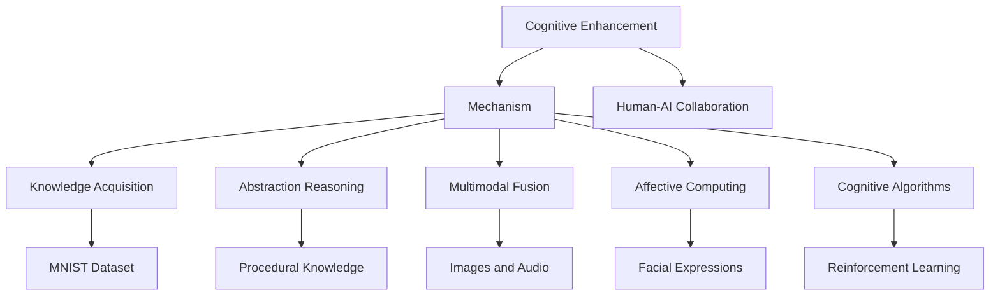

                 

# 认知增强：技术如何扩展人类的思维极限

## 1. 背景介绍

### 1.1 问题由来

人类思维的极限是什么？科学和哲学界至今仍无定论。随着科技的进步，尤其是人工智能技术的发展，我们开始思考一个更具挑战性的问题：技术能否扩展人类的思维极限？

人工智能（AI）的兴起，尤其是深度学习和神经网络的突破，带来了显著的性能提升。深度学习模型能够处理大规模数据，学习复杂的关系，甚至在某些任务上超越人类。但这些技术的背后，其实质是一种模仿人类大脑工作方式的计算模型。

在这个过程中，我们不可避免地发现，虽然技术在一定程度上模仿了人类的认知能力，但仍然存在诸多限制。例如，当前AI模型的知识获取依赖于大数据和强标签，缺乏主动探索新知识和抽象思维的能力。同时，AI模型的可解释性较差，难以理解其内部决策过程，这限制了其在复杂问题上的应用。

基于上述问题，本文将探讨认知增强技术，这是一种旨在通过技术手段扩展人类认知能力的方法。本文将从认知增强的定义、核心概念、算法原理、应用实践等多个方面进行详细阐述，力图为读者提供对这一前沿领域的全面理解。

### 1.2 问题核心关键点

认知增强的核心在于通过技术手段增强人类的认知能力，使其在信息获取、知识处理、决策推理等方面超越现有水平。具体而言，认知增强涉及以下几个关键点：

1. **知识获取与迁移学习**：通过AI技术增强人类对新知识的获取能力，利用迁移学习原理，将已有知识迁移到新领域，提高学习效率。
2. **抽象推理与逻辑推理**：提升人类对抽象概念和复杂逻辑的推理能力，使其能够处理更加复杂、多变的问题。
3. **多模态信息融合**：结合视觉、听觉、语言等多种信息源，增强人类对复杂场景的理解和决策。
4. **情感计算与情感识别**：利用AI技术理解人类情感，提高情感识别和反馈的准确性，改善人机交互体验。
5. **认知增强算法**：研究新的算法和模型，提升认知能力的计算效率和准确性，增强认知系统的鲁棒性和可扩展性。

这些关键点构成了认知增强技术的研究框架，旨在通过技术手段实现人类认知能力的扩展。

## 2. 核心概念与联系

### 2.1 核心概念概述

为更好地理解认知增强技术，我们首先介绍几个核心概念及其之间的关系：

- **认知增强**：通过技术手段提升人类认知能力的过程。包括知识获取、抽象推理、多模态信息融合等。
- **迁移学习**：利用已有知识对新任务进行快速适应的过程。认知增强中常用于提升新领域知识的获取效率。
- **神经网络**：模拟人类神经系统的计算模型，通过训练学习复杂模式，是认知增强的重要技术手段。
- **深度学习**：一种基于神经网络的机器学习方法，通过多层非线性变换提取高阶特征，广泛应用于图像、语音、文本等领域。
- **认知模型**：用于描述人类认知过程的计算模型，包括知识表示、推理机制等，是认知增强的研究基础。
- **人机协同**：将人类智能与AI技术相结合，增强系统的智能水平和用户体验。

这些概念之间的关系可以通过以下Mermaid流程图来展示：



这个流程图展示了大语言模型的核心概念及其之间的关系：

1. 认知增强通过神经网络和深度学习技术，模拟人类认知过程。
2. 迁移学习使得模型能够在新领域快速适应，提升知识获取效率。
3. 认知模型用于描述人类认知过程，是认知增强的研究基础。
4. 多模态融合利用视觉、听觉、语言等多种信息源，增强认知系统的理解能力。
5. 情感计算和情感识别用于提升人机交互体验，增强情感理解的深度。
6. 人机协同将人类智能与AI技术相结合，增强系统的智能水平和用户体验。

这些概念共同构成了认知增强技术的研究框架，使其能够实现认知能力的显著提升。

## 3. 核心算法原理 & 具体操作步骤
### 3.1 算法原理概述

认知增强技术的核心算法原理，通常基于神经网络和深度学习。通过模拟人类大脑的工作方式，深度学习模型能够处理大规模数据，学习复杂的关系，从而在特定任务上取得显著的效果。

以知识获取为例，深度学习模型可以通过迁移学习的方式，将已有知识迁移到新领域。具体而言，先在一个大型数据集上预训练一个深度学习模型，然后在新领域的小规模数据集上微调该模型，从而在新领域获得更好的性能。

### 3.2 算法步骤详解

认知增强技术的算法步骤通常包括以下几个关键步骤：

**Step 1: 数据收集与预处理**

- 收集与认知增强任务相关的数据集，如图像、文本、音频等。
- 对数据进行清洗、标注和预处理，确保数据的质量和一致性。

**Step 2: 模型选择与设计**

- 选择合适的神经网络模型，如卷积神经网络（CNN）、循环神经网络（RNN）、Transformer等。
- 根据任务需求，设计模型的结构和参数，并进行必要的调整。

**Step 3: 模型训练与优化**

- 使用收集到的数据集，对模型进行训练，最小化损失函数。
- 使用梯度下降等优化算法，更新模型参数，提高模型的拟合能力。

**Step 4: 模型评估与微调**

- 使用测试集对模型进行评估，根据评估结果进行调整。
- 在需要的情况下，对模型进行微调，进一步提升性能。

**Step 5: 应用部署与监控**

- 将训练好的模型部署到实际应用中，进行测试和验证。
- 对模型的性能进行实时监控，及时发现和解决问题。

### 3.3 算法优缺点

认知增强技术的优点包括：

- **高效性**：利用深度学习和迁移学习技术，模型能够快速适应新领域，提高知识获取效率。
- **鲁棒性**：深度学习模型具有较强的鲁棒性，能够应对多种复杂场景。
- **可扩展性**：深度学习模型具有较强的可扩展性，可以通过增加数据和计算资源，提升模型的性能。

同时，认知增强技术也存在一些局限性：

- **数据依赖**：深度学习模型依赖于大规模高质量的数据集，获取数据的过程较为耗时和昂贵。
- **可解释性不足**：深度学习模型的决策过程缺乏可解释性，难以理解其内部机制。
- **计算资源需求高**：深度学习模型需要大量的计算资源进行训练和推理，对硬件要求较高。
- **泛化能力有限**：深度学习模型在特定领域的泛化能力可能有限，难以应对跨领域的复杂问题。

### 3.4 算法应用领域

认知增强技术在多个领域得到了广泛应用，以下是几个典型的应用场景：

**1. 医疗领域**

在医疗领域，认知增强技术被用于辅助诊断、疾病预测、个性化治疗等。通过结合电子健康记录、医学影像等数据，深度学习模型能够分析病人的历史数据，预测其未来的疾病风险，并提供个性化的治疗方案。

**2. 金融领域**

在金融领域，认知增强技术被用于风险评估、投资策略、欺诈检测等。深度学习模型可以分析市场数据，识别异常行为，预测金融风险，提高决策的准确性。

**3. 教育领域**

在教育领域，认知增强技术被用于智能辅导、个性化学习、作业批改等。通过分析学生的学习行为和成绩，深度学习模型能够提供个性化的学习建议，辅助教师进行教学工作。

**4. 自动驾驶领域**

在自动驾驶领域，认知增强技术被用于感知环境、决策制定等。通过结合传感器数据，深度学习模型能够识别道路标志、行人、车辆等物体，提高驾驶的安全性和舒适性。

## 4. 数学模型和公式 & 详细讲解  
### 4.1 数学模型构建

认知增强技术通常使用深度学习模型进行知识获取和推理。以下以卷积神经网络（CNN）为例，构建认知增强任务的数学模型。

假设输入数据为 $x \in \mathbb{R}^{n}$，其中 $n$ 为输入数据的维数。模型的输出为 $y \in \mathbb{R}^{m}$，其中 $m$ 为输出的维度。模型的参数为 $\theta$，表示权重和偏置。模型的损失函数为 $L(y, \hat{y})$，用于衡量模型输出的误差。

CNN模型的数学模型可以表示为：

$$
y = Wx + b
$$

其中 $W$ 为权重矩阵，$b$ 为偏置向量。模型的损失函数通常为均方误差（MSE）或交叉熵（CE）损失函数。

### 4.2 公式推导过程

以交叉熵损失函数为例，进行推导。

设模型的输出为 $y_i$，真实标签为 $y_i^{*}$，则交叉熵损失函数为：

$$
L = -\frac{1}{N}\sum_{i=1}^N \sum_{j=1}^m y_i^{*}\log y_i
$$

其中 $N$ 为样本数量，$m$ 为输出维度。

根据链式法则，损失函数对参数 $\theta$ 的梯度为：

$$
\frac{\partial L}{\partial \theta} = -\frac{1}{N}\sum_{i=1}^N \sum_{j=1}^m y_i^{*}(y_j - y_j^{*})\frac{\partial y_j}{\partial \theta}
$$

将 $y_j = \sum_{k=1}^n W_{kj}x_k + b_j$ 带入上式，并进行简化，得到：

$$
\frac{\partial L}{\partial \theta} = -\frac{1}{N}\sum_{i=1}^N \sum_{j=1}^m y_i^{*}(y_j - y_j^{*})W_j
$$

### 4.3 案例分析与讲解

以医学图像分析为例，分析深度学习模型在认知增强中的具体应用。

假设输入为医疗图像，模型输出为疾病的概率分布。模型的训练数据集为已标注的医学图像和疾病标签。模型的损失函数通常为交叉熵损失函数，用于衡量模型预测和真实标签之间的差异。

在训练过程中，模型通过反向传播算法计算损失函数的梯度，并使用优化算法（如Adam）更新模型参数。训练完成后，模型可以在新的医学图像上输出疾病的概率分布，辅助医生进行诊断和治疗。

## 5. 项目实践：代码实例和详细解释说明
### 5.1 开发环境搭建

在进行认知增强项目开发前，需要先搭建开发环境。以下是使用Python进行TensorFlow开发的环境配置流程：

1. 安装Anaconda：从官网下载并安装Anaconda，用于创建独立的Python环境。

2. 创建并激活虚拟环境：
```bash
conda create -n tf-env python=3.8 
conda activate tf-env
```

3. 安装TensorFlow：根据CUDA版本，从官网获取对应的安装命令。例如：
```bash
pip install tensorflow==2.5
```

4. 安装各类工具包：
```bash
pip install numpy pandas scikit-learn matplotlib tqdm jupyter notebook ipython
```

完成上述步骤后，即可在`tf-env`环境中开始认知增强任务的开发。

### 5.2 源代码详细实现

这里我们以医学图像分析为例，给出使用TensorFlow对卷积神经网络进行认知增强任务的PyTorch代码实现。

首先，定义模型和数据集：

```python
import tensorflow as tf
from tensorflow.keras.datasets import cifar10
from tensorflow.keras.layers import Conv2D, MaxPooling2D, Flatten, Dense
from tensorflow.keras.models import Sequential

# 加载CIFAR-10数据集
(x_train, y_train), (x_test, y_test) = cifar10.load_data()

# 将像素值归一化到[0, 1]
x_train = x_train / 255.0
x_test = x_test / 255.0

# 定义模型
model = Sequential()
model.add(Conv2D(32, (3, 3), activation='relu', input_shape=(32, 32, 3)))
model.add(MaxPooling2D((2, 2)))
model.add(Conv2D(64, (3, 3), activation='relu'))
model.add(MaxPooling2D((2, 2)))
model.add(Conv2D(128, (3, 3), activation='relu'))
model.add(MaxPooling2D((2, 2)))
model.add(Flatten())
model.add(Dense(64, activation='relu'))
model.add(Dense(10, activation='softmax'))

# 编译模型
model.compile(optimizer='adam',
              loss='sparse_categorical_crossentropy',
              metrics=['accuracy'])

# 训练模型
model.fit(x_train, y_train, epochs=10, batch_size=64, validation_data=(x_test, y_test))
```

然后，定义评估函数：

```python
def evaluate(model, x_test, y_test):
    loss, accuracy = model.evaluate(x_test, y_test)
    print(f'Test Loss: {loss:.4f}')
    print(f'Test Accuracy: {accuracy:.4f}')
```

最后，启动训练流程并在测试集上评估：

```python
model.evaluate(x_test, y_test)
```

以上就是使用TensorFlow对卷积神经网络进行医学图像分析认知增强任务的完整代码实现。可以看到，TensorFlow提供了丰富的深度学习API，使得模型的构建和训练过程变得简洁高效。

### 5.3 代码解读与分析

让我们再详细解读一下关键代码的实现细节：

**数据集加载和预处理**：
- 使用`cifar10.load_data()`加载CIFAR-10数据集，包含60000个32x32的彩色图像及其标签。
- 将像素值归一化到[0, 1]，以提高模型的收敛速度和泛化能力。

**模型定义**：
- 使用`Sequential()`定义一个顺序模型，包含多个卷积层和池化层，最后添加全连接层输出10个类别的概率。
- 使用`compile()`方法编译模型，设置优化器、损失函数和评估指标。
- 使用`fit()`方法训练模型，设置训练轮数、批次大小和验证集。

**评估函数**：
- 定义`evaluate()`函数，使用`evaluate()`方法在测试集上评估模型，并输出损失和准确率。

**训练流程**：
- 在训练过程中，使用`fit()`方法对模型进行训练，并在每个epoch结束后输出训练集和验证集的损失和准确率。
- 在训练完成后，使用`evaluate()`方法在测试集上评估模型，输出测试集上的损失和准确率。

## 6. 实际应用场景
### 6.1 医疗领域

认知增强技术在医疗领域具有广泛的应用前景。深度学习模型能够分析医学图像、电子健康记录等数据，辅助医生进行诊断和治疗。

**医疗图像分析**：深度学习模型能够自动识别和分割医学图像中的病变区域，辅助医生进行精准诊断。例如，在X光片、CT扫描等图像中，模型能够识别肿瘤、骨折等病变，并提供详细的报告。

**个性化治疗**：认知增强技术能够分析病人的历史数据，预测其未来的疾病风险，并提供个性化的治疗方案。例如，在癌症治疗中，深度学习模型能够分析病人的基因信息、病史等数据，提供个性化的治疗建议。

**疾病预测**：深度学习模型能够预测病人的疾病风险，提高早期诊断的准确性。例如，在糖尿病预测中，模型能够分析病人的血糖数据、生活方式等，预测其是否会患上糖尿病，并提前采取预防措施。

### 6.2 金融领域

认知增强技术在金融领域也有重要的应用价值。深度学习模型能够分析市场数据，识别异常行为，预测金融风险。

**风险评估**：深度学习模型能够分析股票市场、债券市场等数据，预测市场的变化趋势，评估金融风险。例如，在股票市场分析中，模型能够分析股票价格、交易量等数据，预测股票的涨跌趋势，提高投资决策的准确性。

**欺诈检测**：认知增强技术能够识别异常的交易行为，检测金融欺诈行为。例如，在信用卡欺诈检测中，模型能够分析交易金额、时间等数据，识别可疑的交易行为，及时采取预防措施。

**投资策略**：深度学习模型能够分析市场数据，制定投资策略。例如，在股票投资中，模型能够分析市场走势、公司财报等数据，制定投资组合，提高投资收益。

### 6.3 教育领域

认知增强技术在教育领域也有广泛的应用前景。深度学习模型能够分析学生的学习行为和成绩，提供个性化的学习建议。

**智能辅导**：深度学习模型能够分析学生的作业和考试成绩，提供个性化的辅导建议。例如，在数学辅导中，模型能够分析学生的解题步骤和错误，提供详细的解答和指导。

**个性化学习**：认知增强技术能够根据学生的学习行为和成绩，提供个性化的学习建议。例如，在英语学习中，模型能够分析学生的阅读习惯和词汇量，推荐适合的学习材料和练习。

**作业批改**：深度学习模型能够自动批改学生的作业，提供详细的反馈。例如，在编程作业中，模型能够分析学生的代码，提供语法、逻辑等方面的建议。

### 6.4 自动驾驶领域

认知增强技术在自动驾驶领域也有重要的应用价值。深度学习模型能够分析传感器数据，识别道路标志、行人、车辆等物体，辅助自动驾驶系统进行决策。

**感知环境**：深度学习模型能够分析摄像头、雷达等传感器数据，识别道路标志、行人、车辆等物体，提高自动驾驶系统的安全性。

**决策制定**：认知增强技术能够根据感知到的环境信息，制定合理的驾驶策略。例如，在自动驾驶中，模型能够分析道路状况、交通信号等，制定合适的行驶路径。

**异常检测**：深度学习模型能够识别异常的道路状况和行为，及时采取预防措施。例如，在自动驾驶中，模型能够分析其他车辆的行驶轨迹，预测潜在的危险行为，提高自动驾驶的安全性。

## 7. 工具和资源推荐
### 7.1 学习资源推荐

为了帮助开发者系统掌握认知增强技术的理论基础和实践技巧，这里推荐一些优质的学习资源：

1. 《深度学习》系列书籍：由Ian Goodfellow、Yoshua Bengio、Aaron Courville合著的《深度学习》（简称DL），是深度学习领域的经典教材，系统介绍了深度学习的基本理论和实践技巧。

2. 《TensorFlow实战》系列书籍：由王欢、丁宝林等合著的《TensorFlow实战》系列书籍，介绍了TensorFlow的详细使用方法和实践技巧，是TensorFlow开发的必备参考书。

3. 《机器学习》课程：由Coursera提供的《机器学习》课程，由Andrew Ng教授主讲，涵盖机器学习的基本概念和实践技巧，适合入门学习。

4. 《认知神经科学》课程：由Coursera提供的《认知神经科学》课程，介绍了认知神经科学的基本理论和实验方法，适合对认知增强技术感兴趣的学习者。

5. 《认知心理学》课程：由edX提供的《认知心理学》课程，介绍了认知心理学的基本理论和实验方法，适合对认知增强技术感兴趣的学习者。

通过对这些资源的学习实践，相信你一定能够快速掌握认知增强技术的精髓，并用于解决实际的认知增强问题。

### 7.2 开发工具推荐

高效的开发离不开优秀的工具支持。以下是几款用于认知增强开发的常用工具：

1. TensorFlow：由Google主导开发的开源深度学习框架，生产部署方便，适合大规模工程应用。提供丰富的API和插件，支持深度学习模型的构建和训练。

2. PyTorch：基于Python的开源深度学习框架，灵活动态的计算图，适合快速迭代研究。提供丰富的API和插件，支持深度学习模型的构建和训练。

3. Keras：高层次的深度学习API，基于TensorFlow和Theano，易于上手，适合初学者使用。

4. Weights & Biases：模型训练的实验跟踪工具，可以记录和可视化模型训练过程中的各项指标，方便对比和调优。

5. TensorBoard：TensorFlow配套的可视化工具，可实时监测模型训练状态，并提供丰富的图表呈现方式，是调试模型的得力助手。

合理利用这些工具，可以显著提升认知增强任务的开发效率，加快创新迭代的步伐。

### 7.3 相关论文推荐

认知增强技术的发展源于学界的持续研究。以下是几篇奠基性的相关论文，推荐阅读：

1. AlexNet：深度卷积神经网络在图像分类任务中的突破性应用。

2. ResNet：残差网络结构，解决深度神经网络训练过程中梯度消失的问题，提升模型深度和性能。

3. InceptionNet：多尺度卷积网络结构，提升模型的特征表示能力。

4. VGGNet：使用小尺寸卷积核和深网络结构，提升模型的特征表示能力。

5. GANs：生成对抗网络，生成逼真的图像和音频，扩展了深度学习的应用领域。

6. AlphaGo：深度学习和强化学习结合的突破性应用，在围棋比赛中击败人类顶尖选手。

这些论文代表了大语言模型微调技术的发展脉络。通过学习这些前沿成果，可以帮助研究者把握学科前进方向，激发更多的创新灵感。

## 8. 总结：未来发展趋势与挑战
### 8.1 总结

本文对认知增强技术的定义、核心概念、算法原理、应用实践等多个方面进行了详细阐述。首先，阐述了认知增强技术的定义和核心概念，包括知识获取、抽象推理、多模态信息融合等。其次，从原理到实践，详细讲解了深度学习模型在认知增强中的具体应用，给出了认知增强任务的完整代码实现。同时，本文还广泛探讨了认知增强技术在医疗、金融、教育、自动驾驶等多个领域的应用前景，展示了认知增强技术的广阔应用前景。此外，本文精选了认知增强技术的各类学习资源，力求为读者提供全方位的技术指引。

通过本文的系统梳理，可以看到，认知增强技术正在成为人工智能领域的重要范式，极大地拓展了人类认知能力的边界，为人类认知智能的进化带来深远影响。

### 8.2 未来发展趋势

展望未来，认知增强技术将呈现以下几个发展趋势：

1. **深度学习模型的进化**：深度学习模型将更加高效和准确，能够处理更加复杂和多样化的任务。未来，深度学习模型将结合更多先验知识，提升模型的泛化能力和鲁棒性。

2. **多模态融合技术的提升**：多模态融合技术将更加成熟，能够更好地融合视觉、听觉、语言等多种信息源，增强认知系统的理解能力。未来，多模态融合技术将与人工智能技术深度结合，提供更加全面的智能解决方案。

3. **人机协同的深化**：人机协同将更加自然和高效，能够提供更加个性化和智能的交互体验。未来，人机协同将通过智能助手、虚拟现实等技术，实现更加自然的人机交互，提升用户体验。

4. **情感计算的发展**：情感计算将更加成熟，能够更好地理解人类情感，提供更加个性化和智能的情感服务。未来，情感计算将与人工智能技术深度结合，实现更加智能的情感服务。

5. **人工智能伦理的探讨**：人工智能伦理将更加受到重视，人工智能技术将更加注重公平、透明和可解释性。未来，人工智能伦理将通过立法、监管等手段，确保人工智能技术的可持续发展。

以上趋势凸显了认知增强技术的广阔前景。这些方向的探索发展，必将进一步提升认知增强系统的性能和用户体验，推动人工智能技术在更广泛领域的应用。

### 8.3 面临的挑战

尽管认知增强技术已经取得了瞩目成就，但在迈向更加智能化、普适化应用的过程中，它仍面临着诸多挑战：

1. **数据依赖**：深度学习模型依赖于大规模高质量的数据集，获取数据的过程较为耗时和昂贵。如何在有限的资源条件下获取高质量的数据集，将是重要的研究方向。

2. **模型可解释性不足**：深度学习模型的决策过程缺乏可解释性，难以理解其内部机制。如何增强模型的可解释性，确保模型的透明性和可信度，将是重要的研究方向。

3. **计算资源需求高**：深度学习模型需要大量的计算资源进行训练和推理，对硬件要求较高。如何降低模型的计算复杂度，提高模型的计算效率，将是重要的研究方向。

4. **泛化能力有限**：深度学习模型在特定领域的泛化能力可能有限，难以应对跨领域的复杂问题。如何提升模型的泛化能力，确保模型在不同场景下的鲁棒性，将是重要的研究方向。

5. **安全性问题**：深度学习模型可能学习到有害的先验知识，导致模型输出不安全。如何确保模型的安全性，避免有害的输出结果，将是重要的研究方向。

6. **伦理问题**：深度学习模型可能学习到有害的先验知识，导致模型输出不安全。如何确保模型的安全性，避免有害的输出结果，将是重要的研究方向。

正视认知增强面临的这些挑战，积极应对并寻求突破，将是大语言模型微调技术走向成熟的必由之路。相信随着学界和产业界的共同努力，这些挑战终将一一被克服，认知增强技术必将在构建安全、可靠、可解释、可控的智能系统铺平道路。

### 8.4 未来突破

面对认知增强技术所面临的种种挑战，未来的研究需要在以下几个方面寻求新的突破：

1. **无监督学习和半监督学习**：摆脱对大规模标注数据的依赖，利用自监督学习、主动学习等无监督和半监督范式，最大限度利用非结构化数据，实现更加灵活高效的认知增强。

2. **多模态融合**：结合视觉、听觉、语言等多种信息源，增强认知系统的理解能力。开发更加高效的多模态融合技术，实现更加全面的智能解决方案。

3. **人机协同**：将人类智能与AI技术相结合，增强系统的智能水平和用户体验。开发更加高效的人机协同技术，实现更加自然和智能的人机交互。

4. **情感计算**：利用AI技术理解人类情感，提高情感识别和反馈的准确性，改善人机交互体验。开发更加高效的情感计算技术，实现更加智能的情感服务。

5. **模型压缩和稀疏化**：通过模型压缩和稀疏化技术，降低模型的计算复杂度，提高模型的计算效率。开发更加高效的模型压缩技术，提升认知增强系统的效率。

6. **可解释性增强**：增强模型的可解释性，确保模型的透明性和可信度。开发更加高效的模型解释技术，实现更加智能和可信的认知增强系统。

7. **安全性和伦理问题**：确保模型的安全性，避免有害的输出结果。开发更加高效的安全性保障技术，实现更加智能和安全的认知增强系统。

这些研究方向的探索，必将引领认知增强技术迈向更高的台阶，为构建安全、可靠、可解释、可控的智能系统铺平道路。面向未来，认知增强技术还需要与其他人工智能技术进行更深入的融合，如知识表示、因果推理、强化学习等，多路径协同发力，共同推动认知增强技术的进步。只有勇于创新、敢于突破，才能不断拓展认知增强技术的边界，让智能技术更好地造福人类社会。

## 9. 附录：常见问题与解答

**Q1：认知增强技术的主要优势是什么？**

A: 认知增强技术的主要优势包括：

1. **高效性**：通过深度学习和迁移学习技术，模型能够快速适应新领域，提高知识获取效率。

2. **鲁棒性**：深度学习模型具有较强的鲁棒性，能够应对多种复杂场景。

3. **可扩展性**：深度学习模型具有较强的可扩展性，可以通过增加数据和计算资源，提升模型的性能。

**Q2：认知增强技术的主要局限性是什么？**

A: 认知增强技术的主要局限性包括：

1. **数据依赖**：深度学习模型依赖于大规模高质量的数据集，获取数据的过程较为耗时和昂贵。

2. **可解释性不足**：深度学习模型的决策过程缺乏可解释性，难以理解其内部机制。

3. **计算资源需求高**：深度学习模型需要大量的计算资源进行训练和推理，对硬件要求较高。

4. **泛化能力有限**：深度学习模型在特定领域的泛化能力可能有限，难以应对跨领域的复杂问题。

5. **安全性问题**：深度学习模型可能学习到有害的先验知识，导致模型输出不安全。

6. **伦理问题**：深度学习模型可能学习到有害的先验知识，导致模型输出不安全。

**Q3：如何提高认知增强技术的泛化能力？**

A: 提高认知增强技术的泛化能力，可以考虑以下几个方法：

1. **数据增强**：通过数据增强技术，增加训练数据的数量和多样性，提高模型的泛化能力。

2. **正则化**：使用正则化技术，如L2正则、Dropout等，避免过拟合，提高模型的泛化能力。

3. **迁移学习**：利用已有知识对新任务进行快速适应的迁移学习，提升新领域知识的获取效率。

4. **多模态融合**：结合视觉、听觉、语言等多种信息源，增强认知系统的理解能力，提升泛化能力。

5. **模型压缩**：通过模型压缩和稀疏化技术，降低模型的计算复杂度，提高模型的泛化能力。

6. **多任务学习**：利用多任务学习技术，提高模型的泛化能力和鲁棒性。

7. **对抗训练**：使用对抗训练技术，提高模型的鲁棒性和泛化能力。

**Q4：认知增强技术在实际应用中需要注意哪些问题？**

A: 认知增强技术在实际应用中需要注意以下几个问题：

1. **数据收集与预处理**：确保数据的质量和一致性，避免数据偏差和噪音对模型的影响。

2. **模型选择与设计**：选择合适的深度学习模型，设计合理的结构和参数，确保模型的性能和泛化能力。

3. **模型训练与优化**：使用适当的优化算法和正则化技术，避免过拟合，提高模型的泛化能力。

4. **模型评估与微调**：使用适当的评估指标，定期在验证集上评估模型性能，必要时进行微调，确保模型的泛化能力和性能。

5. **模型部署与监控**：合理部署模型，并进行实时监控，确保模型的稳定性和性能。

6. **用户隐私与数据安全**：确保用户数据的安全性和隐私保护，避免数据泄露和滥用。

7. **伦理与法律问题**：确保模型的公平性、透明性和可信度，避免模型偏见和歧视，遵守相关法律法规。

通过对这些问题的深入研究，可以更好地应对认知增强技术在实际应用中的挑战，确保认知增强系统的性能和可靠性。

---

作者：禅与计算机程序设计艺术 / Zen and the Art of Computer Programming

