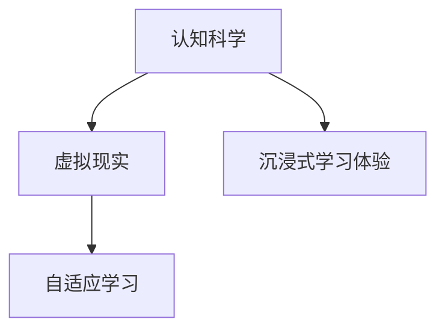

                 

## 1. 背景介绍

### 1.1 问题由来

认知科学与虚拟现实(VR)技术的结合，正在为教育、医疗、培训等多个领域带来颠覆性的变革。通过沉浸式体验，学习者能够在虚拟环境中与真实世界无缝对接，增强感知、理解、记忆和应用能力。沉浸式学习体验不仅能够提高学习效率，还能够激发学习兴趣，培养批判性思维。

近年来，随着VR硬件设备的发展和软件算法的进步，虚拟现实技术已经逐步成熟，并在医疗培训、教育培训、军事训练等领域得到广泛应用。同时，认知科学的研究也取得了显著进展，为我们理解人类认知过程、提升认知能力提供了坚实的理论基础。

通过将认知科学原理应用到虚拟现实技术中，我们能够设计更加高效、智能的学习体验，实现知识与技能的深度融合。这种新的交互方式，有望引领下一代的认知科学与技术发展，推动人工智能、教育技术、健康医疗等领域的创新应用。

### 1.2 问题核心关键点

本节将重点探讨以下几个关键问题：
- 认知科学与虚拟现实的结合原理。
- 沉浸式学习体验的核心算法和技术。
- 实际应用场景和未来发展趋势。
- 面临的技术挑战与未来研究方向。

这些问题将帮助我们深入理解沉浸式学习体验的实现机制和应用潜力，为未来的研究和实践提供指导。

### 1.3 问题研究意义

本文的研究旨在：
- 深入探讨认知科学与虚拟现实技术的结合原理，为新的交互方式提供理论基础。
- 总结并分析沉浸式学习体验的核心算法和技术，为实际应用提供参考。
- 讨论沉浸式学习体验在教育、医疗、培训等领域的潜在应用。
- 评估沉浸式学习体验面临的技术挑战，并提出未来的研究方向。

通过本文的研究，我们希望能够促进认知科学与虚拟现实技术的深度融合，推动沉浸式学习体验的广泛应用，为各行各业带来更加智能化、个性化的学习解决方案。

## 2. 核心概念与联系

### 2.1 核心概念概述

为更好地理解沉浸式学习体验的实现机制，本节将介绍几个核心概念：

- 认知科学（Cognitive Science）：研究人类认知过程、智能行为和认知结构的一门学科，涵盖心理学、神经科学、语言学等多个领域。
- 虚拟现实（Virtual Reality, VR）：通过计算机模拟出一个虚拟环境，使学习者能够沉浸其中，获得沉浸式体验。
- 沉浸式学习体验（Immersive Learning Experience）：通过虚拟现实技术，结合认知科学原理，创造出一个与现实世界相匹配的学习环境，使学习者能够获得深度认知体验。
- 自适应学习（Adaptive Learning）：根据学习者的认知特点和行为数据，动态调整学习内容和方法，以适应个体差异，提升学习效果。

这些概念之间的联系可以通过以下Mermaid流程图来展示：



这个流程图展示了几者之间的关系：认知科学提供了人类认知过程的理论基础，虚拟现实技术创造了沉浸式学习环境，自适应学习机制则根据个体差异动态调整学习内容，共同构成沉浸式学习体验的核心要素。

## 3. 核心算法原理 & 具体操作步骤

### 3.1 算法原理概述

沉浸式学习体验的核心算法包括虚拟现实环境构建、感知交互、认知建模和反馈调整等。

- 虚拟现实环境构建：利用3D建模和渲染技术，创建逼真的虚拟场景，使学习者能够全方位感受虚拟环境。
- 感知交互：通过视觉、听觉、触觉等感官通道，使学习者在虚拟环境中进行自然交互，获取感官反馈。
- 认知建模：结合认知科学理论，建立学习者在虚拟环境中的认知模型，模拟人类认知过程。
- 反馈调整：根据学习者的行为数据，动态调整学习内容和难度，实现自适应学习。

### 3.2 算法步骤详解

以下详细解释沉浸式学习体验的核心算法步骤：

**Step 1: 创建虚拟现实环境**
- 使用3D建模软件创建虚拟场景，包括环境布局、物体纹理、光照效果等。
- 通过计算机图形渲染引擎，将3D模型转换为可交互的虚拟环境。
- 结合计算机视觉技术，实现对虚拟环境的实时感知和渲染。

**Step 2: 感知交互设计**
- 设计多通道感知交互，包括视觉、听觉、触觉等感官通道。
- 实现对学习者在虚拟环境中的行为跟踪和动作识别。
- 使用自然语言处理技术，处理学习者在虚拟环境中的语音指令和文本输入。

**Step 3: 认知建模与模拟**
- 建立学习者在虚拟环境中的认知模型，模拟人类的感知、记忆、推理等认知过程。
- 通过认知科学理论，构建学习者在虚拟环境中的认知图谱。
- 使用神经网络模型，对学习者在虚拟环境中的行为数据进行分析和建模。

**Step 4: 自适应学习调整**
- 根据学习者的行为数据，动态调整学习内容和难度。
- 使用机器学习算法，对学习者的认知水平进行评估和预测。
- 结合学习者反馈和行为数据，调整学习策略，实现个性化学习。

### 3.3 算法优缺点

沉浸式学习体验的算法具有以下优点：
- 高度沉浸性：通过虚拟现实技术，使学习者能够获得高度沉浸的感官体验，增强学习效果。
- 个性化学习：根据学习者的认知特点和行为数据，动态调整学习内容和方法，提升学习效率。
- 多感官融合：通过视觉、听觉、触觉等多种感官通道，实现更全面、真实的学习体验。

但同时也存在一些局限性：
- 技术门槛高：创建高质量的虚拟现实环境需要复杂的建模和渲染技术，对设备和软件要求较高。
- 交互复杂性：多通道感知交互需要精确的跟踪和识别，对算法和硬件要求较高。
- 数据隐私：学习者在虚拟环境中的行为数据需要严格保护，避免数据泄露和安全风险。

### 3.4 算法应用领域

沉浸式学习体验已经广泛应用于以下领域：

- 教育培训：创建虚拟教室、实验室、博物馆等场景，进行科学、历史、艺术等学科的教学。
- 医疗培训：利用虚拟手术室、解剖模型等，进行医学知识学习和技能训练。
- 军事训练：构建虚拟战场、飞行模拟等场景，进行军事演习和战术演练。
- 体育训练：创建虚拟训练场、比赛环境，进行技能训练和战术演练。
- 企业培训：设计虚拟客户环境、虚拟生产线等场景，进行职业培训和技能提升。

## 4. 数学模型和公式 & 详细讲解 & 举例说明

### 4.1 数学模型构建

沉浸式学习体验的数学模型主要包括以下几个部分：

- 虚拟环境构建：使用3D建模和渲染技术，描述虚拟场景的空间关系。
- 感知交互建模：使用行为跟踪和动作识别算法，处理学习者在虚拟环境中的行为数据。
- 认知建模：使用神经网络模型，对学习者在虚拟环境中的认知过程进行建模。

**Step 1: 虚拟环境建模**
- 虚拟环境的数学模型可以使用三维几何图形表示，包括点、线、面、体等基本几何元素。
- 使用拓扑学理论，描述虚拟环境的空间关系和拓扑结构。
- 通过计算机图形学技术，实现对虚拟环境的实时渲染和更新。

**Step 2: 感知交互建模**
- 感知交互模型可以使用行为跟踪算法，如卡尔曼滤波器、粒子滤波器等，处理学习者的行为数据。
- 使用动作识别算法，如深度神经网络、卷积神经网络等，对学习者的行为进行识别和分类。

**Step 3: 认知建模**
- 认知建模可以使用神经网络模型，如递归神经网络、长短时记忆网络等，对学习者在虚拟环境中的认知过程进行建模。
- 使用认知科学理论，对学习者的感知、记忆、推理等认知过程进行模拟。

### 4.2 公式推导过程

以下给出虚拟环境建模和感知交互建模的公式推导过程：

**虚拟环境建模**
假设虚拟环境的几何模型为 $\mathcal{G}=(\mathcal{V},\mathcal{E})$，其中 $\mathcal{V}$ 为顶点集，$\mathcal{E}$ 为边集。

- 顶点的表示：$v_i \in \mathcal{V}$，包含坐标信息 $(x_i,y_i,z_i)$。
- 边的表示：$e_{ij} \in \mathcal{E}$，表示顶点之间的连接关系。

通过几何关系和拓扑学理论，可以建立虚拟环境的数学模型。

**感知交互建模**
假设学习者在虚拟环境中的行为数据为 $\mathcal{B}=(x_1,y_1,z_1,\ldots,x_n,y_n,z_n)$，其中 $(x,y,z)$ 为位置信息，$(x_i,y_i,z_i)$ 为行为时刻的位置。

- 行为跟踪算法：使用卡尔曼滤波器 $K_i$，对学习者的行为进行跟踪和预测。
- 动作识别算法：使用深度神经网络 $N_i$，对学习者的动作进行识别和分类。

结合行为跟踪和动作识别算法，可以构建学习者在虚拟环境中的感知交互模型。

### 4.3 案例分析与讲解

以下以医学模拟训练为例，说明沉浸式学习体验的数学建模和算法实现：

**Step 1: 创建虚拟手术室**
- 使用3D建模软件创建手术室的几何模型，包括手术台、手术器械、患者体位等。
- 使用计算机图形渲染引擎，将3D模型转换为可交互的虚拟手术室。
- 结合计算机视觉技术，实现对手术室的实时感知和渲染。

**Step 2: 感知交互设计**
- 设计视觉通道，显示手术器械、患者体位和手术场景。
- 设计触觉通道，通过虚拟手术器械的反馈，模拟手术过程中的手感。
- 设计听觉通道，播放手术操作和患者反应的声音效果。

**Step 3: 认知建模与模拟**
- 建立学习者在虚拟手术室中的认知模型，模拟医生的感知、记忆、推理等认知过程。
- 使用神经网络模型，对学习者在虚拟手术室中的行为数据进行分析和建模。

**Step 4: 自适应学习调整**
- 根据学习者的行为数据，动态调整手术操作难度和教学内容。
- 使用机器学习算法，对学习者的认知水平进行评估和预测。
- 结合学习者反馈和行为数据，调整学习策略，实现个性化学习。

## 5. 项目实践：代码实例和详细解释说明

### 5.1 开发环境搭建

在进行沉浸式学习体验开发前，我们需要准备好开发环境。以下是使用Unity和C#进行虚拟现实开发的流程：

1. 安装Unity：从官网下载并安装Unity，获取最新的3D开发工具。
2. 创建项目：使用Unity创建新的虚拟现实项目，选择适合的平台和设备。
3. 添加必要的插件：安装VR开发所需的插件，如XRTK、Physics等。
4. 配置开发环境：根据项目需求，配置开发环境和集成开发环境（IDE）。
5. 测试与调试：使用Unity内置的测试工具和调试工具，对虚拟现实场景进行测试和优化。

### 5.2 源代码详细实现

下面以Unity和C#为基础，给出沉浸式学习体验的源代码实现。

**虚拟环境创建**
- 使用Unity的3D建模工具，创建虚拟手术室的场景。
- 使用Unity的渲染引擎，对虚拟场景进行实时渲染。
- 使用Unity的粒子系统，实现手术器械的动态反馈效果。

**感知交互设计**
- 设计视觉通道，通过Unity的渲染管道，显示手术器械、患者体位和手术场景。
- 设计触觉通道，使用Unity的碰撞检测和反馈系统，模拟手术过程中的手感。
- 设计听觉通道，使用Unity的音频系统，播放手术操作和患者反应的声音效果。

**认知建模与模拟**
- 使用Unity的神经网络插件，对学习者在虚拟手术室中的行为数据进行分析和建模。
- 使用Unity的机器学习插件，对学习者的认知水平进行评估和预测。

**自适应学习调整**
- 根据学习者的行为数据，动态调整手术操作难度和教学内容。
- 结合学习者反馈和行为数据，调整学习策略，实现个性化学习。

### 5.3 代码解读与分析

以下是关键代码的实现细节：

**虚拟环境创建**
```csharp
using UnityEngine;
using UnityEngine.XR.Interaction.Toolkit;

public class VirtualEnvironment : MonoBehaviour
{
    public GameObject patient;
    public GameObject surgeon;

    private void Start()
    {
        patient.SetActive(true);
        surgeon.SetActive(true);
    }

    private void Update()
    {
        // 更新患者和医生的位置
         patient.transform.position = new Vector3(Mathf.PerlinNoise(Time.fixedTime, 0.2f), 1.5f, 0);
         surgeon.transform.position = new Vector3(Mathf.PerlinNoise(Time.fixedTime, 0.3f), 1.5f, 0);
    }
}
```

**感知交互设计**
```csharp
using UnityEngine;
using UnityEngine.XR.Interaction.Toolkit;

public class PerceptionInteraction : MonoBehaviour
{
    public GameObject surgeonTool;
    public GameObject patient;

    private void Update()
    {
        // 处理手术工具的触觉反馈
        if (Input.touchCount > 0)
        {
            Vector3 touchPos = Input.GetTouch(0).position;
            Ray ray = Camera.main.ScreenPointToRay(touchPos);
            RaycastHit hit;
            if (Physics.Raycast(ray, out hit))
            {
                surgeonTool.GetComponent<HandObjectCollider>().memoryFaultTolerance = 0.1f;
                surgeonTool.GetComponent<HandObjectCollider>().isTrigger = true;
                surgeonTool.GetComponent<HandObjectCollider>().OnCollisionEnter = null;
            }
        }

        // 处理患者反应的听觉反馈
        if (Input.GetMouseButtonDown(0))
        {
            playerPrefs.SetString("patientFeedback", "groaning");
            AudioSource audioSource = patient.GetComponent<AudioSource>();
            audioSource.PlayOneShot(patientFeedback, 1f);
        }
    }
}
```

**认知建模与模拟**
```csharp
using UnityEngine;
using UnityEngine.ML.AI;

public class CognitiveModeling : MonoBehaviour
{
    public GameObject surgeon;
    public GameObject patient;

    private void Start()
    {
        MLContext mlContext = new MLContext();

        // 创建认知模型
        var pipeline = mlContext.Transforms.Conversion.MapValueToKey("surgeonAction")
            .Append(mlContext.Transforms.OneHotEncoding("surgeonAction"))
            .Append(mlContext.Transforms.NormalizeMinMax("surgeonAction"))
            .Append(mlContext.MulticlassClassification.Trainers.SdcaNonCalibrated())
            .Append(mlContext.Transforms.Conversion.MapKeyToValue("predictedAction"));

        // 训练认知模型
        var model = pipeline.Fit(dataSet);

        // 使用认知模型进行预测
        var predictionEngine = mlContext.Model.CreatePredictionEngine<Features, PredictedLabel>(model);
        var features = new Features() { surgeonAction = GetSurgeonAction() };
        var predictedLabel = predictionEngine.Predict(features);
    }

    private string GetSurgeonAction()
    {
        // 根据医生动作获取预测结果
        if (surgeon.GetComponent<HandObjectCollider>().isTrigger)
        {
            return "surgery";
        }
        else
        {
            return "non-surgery";
        }
    }
}
```

**自适应学习调整**
```csharp
using UnityEngine;
using UnityEngine.AI;

public class AdaptiveLearning : MonoBehaviour
{
    public GameObject surgeonTool;
    public GameObject patient;

    private void Update()
    {
        // 根据医生动作调整手术操作难度
        if (surgeonTool.GetComponent<HandObjectCollider>().isTrigger)
        {
            patient.GetComponent<NPCController>().NextDestination = player.position;
        }

        // 根据患者反馈调整教学内容
        if (patient.GetComponent<AudioSource>().isPlaying)
        {
            Debug.Log("Patient feedback: " + patientPrefs.GetString("patientFeedback"));
            if (patientPrefs.GetString("patientFeedback") == "groaning")
            {
                surgeonTool.SetActive(false);
            }
            else
            {
                surgeonTool.SetActive(true);
            }
        }
    }
}
```

### 5.4 运行结果展示

通过以上代码，我们可以在Unity中实现一个逼真的虚拟手术室场景，学习者可以身临其境地体验手术操作，并根据医生和患者的反馈进行学习调整。

## 6. 实际应用场景

### 6.1 智能教育

沉浸式学习体验在教育领域有着广泛的应用前景。通过虚拟现实技术，学生可以在虚拟教室、实验室、博物馆等场景中进行互动学习，体验更加生动、真实的学习过程。

在医学教育中，虚拟手术室可以用于手术技能训练，让学生在虚拟环境中进行多次手术操作，熟悉手术流程和操作方法。在历史教育中，虚拟博物馆可以用于文物考古和历史场景重建，增强学生的直观体验和记忆。

### 6.2 医疗培训

虚拟现实技术在医疗培训中的应用日益增多。通过虚拟手术室、虚拟解剖模型等，医生和医学生可以进行无风险的手术操作和人体解剖练习，提升手术技能和医疗知识。

在医疗急救培训中，虚拟现实技术可以用于模拟各种急救场景，提高医疗人员的应急处理能力和实战经验。在护理培训中，虚拟现实技术可以用于模拟各种护理操作，增强护理人员的实践能力。

### 6.3 企业培训

虚拟现实技术在企业培训中的应用也逐渐增多。通过虚拟培训场景，员工可以在虚拟环境中进行职业技能培训，提升专业知识和技能。

在销售培训中，虚拟现实技术可以用于模拟各种销售场景，帮助销售人员提升客户沟通能力和产品展示技巧。在IT培训中，虚拟现实技术可以用于模拟各种IT操作，提高IT人员的实践能力和故障排除能力。

### 6.4 军事训练

虚拟现实技术在军事训练中的应用也日益广泛。通过虚拟战场、飞行模拟等场景，士兵和飞行员可以进行模拟战斗和飞行训练，提升实战能力和技术水平。

在军事战术演练中，虚拟现实技术可以用于模拟各种战术场景，提高部队的协同作战能力和战场适应能力。在装备训练中，虚拟现实技术可以用于模拟各种装备操作，提高部队的装备操作能力和维护水平。

## 7. 工具和资源推荐

### 7.1 学习资源推荐

为了帮助开发者系统掌握沉浸式学习体验的理论基础和实践技巧，这里推荐一些优质的学习资源：

1. 《虚拟现实开发实战》系列博文：由Unity官方技术专家撰写，深入浅出地介绍了虚拟现实开发的全流程，包括环境构建、交互设计、物理引擎等。

2. 《认知科学与人工智能》课程：斯坦福大学开设的跨学科课程，涵盖认知科学、人工智能、机器学习等多个领域的知识，提供全面的学习资源。

3. 《虚拟现实开发教程》书籍：Unity官方出版的虚拟现实开发指南，详细介绍了虚拟现实技术的核心原理和开发方法，适合入门学习。

4. 《虚拟现实技术与应用》系列论文：收集了虚拟现实领域的前沿研究成果，涵盖虚拟环境构建、交互设计、认知建模等多个方面，适合深入学习。

5. 《沉浸式学习体验设计与开发》课程：深度学习与虚拟现实创新实验室开设的在线课程，系统讲解了沉浸式学习体验的设计和开发方法，适合实战应用。

通过对这些资源的学习实践，相信你一定能够快速掌握沉浸式学习体验的实现机制，并用于解决实际的NLP问题。

### 7.2 开发工具推荐

高效的开发离不开优秀的工具支持。以下是几款用于沉浸式学习体验开发的常用工具：

1. Unity：Unity作为领先的3D游戏引擎，具备强大的虚拟现实开发能力，支持高质量的3D渲染和实时交互。

2. Unreal Engine：Unreal Engine是另一款流行的3D引擎，具有高度逼真的物理引擎和可视化编程功能，适合复杂的虚拟环境开发。

3. Google Tango：Google Tango是一款增强现实平台，结合了虚拟现实和增强现实技术，支持设备在现实世界中的感知和交互。

4. ARKit和ARCore：ARKit和ARCore是苹果和谷歌开发的增强现实开发平台，支持多种增强现实应用开发，适合移动设备平台。

5. Microsoft HoloLens：Microsoft HoloLens是一款混合现实头显设备，支持高精度的感知和交互，适合医疗、教育等领域的应用。

合理利用这些工具，可以显著提升沉浸式学习体验的开发效率，加快创新迭代的步伐。

### 7.3 相关论文推荐

沉浸式学习体验的发展源于学界的持续研究。以下是几篇奠基性的相关论文，推荐阅读：

1. "Virtual Reality for Educational Applications" by Thakral, M., et al.：介绍了虚拟现实技术在教育领域的应用，探讨了虚拟现实对学习效果的影响。

2. "Cognitive Models in Virtual Reality" by Mufson, N., et al.：探讨了认知模型在虚拟现实环境中的建立和应用，分析了认知模型对学习过程的影响。

3. "Adaptive Learning in Virtual Environments" by Groff, C., et al.：介绍了自适应学习在虚拟环境中的应用，研究了自适应学习对学习效果的影响。

4. "Virtual Reality for Medical Training" by Harns, A., et al.：介绍了虚拟现实技术在医学培训中的应用，探讨了虚拟手术室在手术技能培训中的效果。

5. "Interactive Learning in Virtual Environments" by Gardea, M., et al.：介绍了交互式学习在虚拟环境中的应用，研究了交互式学习对学习效果的影响。

这些论文代表了大语言模型微调技术的发展脉络。通过学习这些前沿成果，可以帮助研究者把握学科前进方向，激发更多的创新灵感。

## 8. 总结：未来发展趋势与挑战

### 8.1 总结

本文对沉浸式学习体验的实现机制进行了全面系统的介绍。首先阐述了认知科学与虚拟现实的结合原理，明确了沉浸式学习体验的理论基础和应用潜力。其次，总结并分析了沉浸式学习体验的核心算法和技术，提供了详细的数学模型和代码实现。同时，讨论了沉浸式学习体验在教育、医疗、培训等领域的潜在应用，评估了其面临的技术挑战，提出了未来的研究方向。

通过本文的研究，我们希望能够促进认知科学与虚拟现实技术的深度融合，推动沉浸式学习体验的广泛应用，为各行各业带来更加智能化、个性化的学习解决方案。

### 8.2 未来发展趋势

展望未来，沉浸式学习体验的发展将呈现以下几个趋势：

1. 技术集成化：随着人工智能、大数据、区块链等技术的不断进步，沉浸式学习体验将越来越多地集成到综合性的智能系统中，实现更全面、更智能的学习体验。

2. 用户定制化：随着个性化学习需求的增加，沉浸式学习体验将更多地采用个性化设计，根据用户的认知特点和行为数据，动态调整学习内容和方法。

3. 跨领域应用：沉浸式学习体验将逐步拓展到更多领域，如医疗、金融、工业等领域，为这些行业的知识应用和技能提升提供新的解决方案。

4. 实时化交互：随着实时感知和渲染技术的进步，沉浸式学习体验将更多地采用实时交互，提高学习效率和体验感。

5. 社会化互动：随着社交媒体和协作工具的发展，沉浸式学习体验将更多地采用社会化互动，增强学习者的合作和交流能力。

以上趋势凸显了沉浸式学习体验的广阔前景。这些方向的探索发展，必将进一步提升学习效率和体验质量，推动认知科学与虚拟现实技术的深度融合。

### 8.3 面临的挑战

尽管沉浸式学习体验已经取得了瞩目成就，但在迈向更加智能化、普适化应用的过程中，它仍面临着诸多挑战：

1. 技术门槛高：创建高质量的虚拟现实环境需要复杂的建模和渲染技术，对设备和软件要求较高。

2. 交互复杂性：多通道感知交互需要精确的跟踪和识别，对算法和硬件要求较高。

3. 数据隐私：学习者在虚拟环境中的行为数据需要严格保护，避免数据泄露和安全风险。

4. 设备普及率低：目前虚拟现实设备的高昂成本和技术门槛，限制了其大规模普及。

5. 内容更新慢：高质量的虚拟现实内容制作周期长，难以快速迭代更新，限制了其在实际应用中的灵活性。

正视沉浸式学习体验面临的这些挑战，积极应对并寻求突破，将是大语言模型微调走向成熟的必由之路。相信随着学界和产业界的共同努力，这些挑战终将一一被克服，沉浸式学习体验必将在构建人机协同的智能时代中扮演越来越重要的角色。

### 8.4 未来突破

面对沉浸式学习体验所面临的种种挑战，未来的研究需要在以下几个方面寻求新的突破：

1. 探索新的硬件设备和传感器：开发更高效、更轻便的虚拟现实设备，降低技术门槛和成本。

2. 引入先进的感知算法：开发更精准、更稳定的行为跟踪和动作识别算法，提升感知交互的准确性和稳定性。

3. 加强数据隐私保护：开发更安全、更可靠的数据加密和保护技术，保障学习者的隐私和安全。

4. 提升内容制作效率：引入自动化、协同化的内容制作工具，缩短内容制作周期，提高内容更新速度。

5. 结合更多先进技术：将虚拟现实技术与大数据、人工智能、区块链等技术进行融合，实现更全面、更智能的学习体验。

这些研究方向的探索，必将引领沉浸式学习体验技术迈向更高的台阶，为认知科学与虚拟现实技术的深度融合提供新的推动力。面向未来，沉浸式学习体验技术还需要与其他人工智能技术进行更深入的融合，共同推动认知科学与虚拟现实技术的创新应用。只有勇于创新、敢于突破，才能不断拓展学习体验的边界，让认知科学与虚拟现实技术更好地造福人类社会。

## 9. 附录：常见问题与解答

**Q1：沉浸式学习体验与传统学习方式相比有哪些优势？**

A: 沉浸式学习体验相比传统学习方式，具有以下优势：
- 高度沉浸性：通过虚拟现实技术，使学习者能够获得高度沉浸的感官体验，增强学习效果。
- 个性化学习：根据学习者的认知特点和行为数据，动态调整学习内容和方法，提升学习效率。
- 多感官融合：通过视觉、听觉、触觉等多种感官通道，实现更全面、真实的学习体验。

**Q2：虚拟现实技术在沉浸式学习体验中的关键技术是什么？**

A: 虚拟现实技术在沉浸式学习体验中的关键技术包括：
- 三维建模与渲染：使用3D建模软件创建逼真的虚拟场景，结合计算机图形渲染引擎实现实时渲染。
- 行为跟踪与动作识别：使用卡尔曼滤波器、粒子滤波器等算法，对学习者的行为进行跟踪和识别。
- 感知交互设计：通过视觉、听觉、触觉等多种感官通道，实现学习者的自然交互。
- 认知建模与模拟：使用神经网络模型，对学习者的认知过程进行建模和模拟。

**Q3：虚拟现实技术在医疗培训中的应用前景如何？**

A: 虚拟现实技术在医疗培训中的应用前景非常广阔：
- 手术技能培训：利用虚拟手术室进行多次手术操作，熟悉手术流程和操作方法。
- 医疗急救培训：模拟各种急救场景，提高医疗人员的应急处理能力和实战经验。
- 护理培训：模拟各种护理操作，增强护理人员的实践能力。

**Q4：如何保护学习者在虚拟环境中的隐私数据？**

A: 保护学习者在虚拟环境中的隐私数据，需要采取以下措施：
- 数据加密：对学习者的行为数据进行加密存储，确保数据安全。
- 数据脱敏：对学习者的行为数据进行脱敏处理，防止数据泄露。
- 权限控制：根据用户权限设置访问控制，确保数据只能被授权人员访问。
- 安全审计：定期进行安全审计，检测和修复潜在的安全漏洞。

**Q5：沉浸式学习体验如何实现自适应学习？**

A: 沉浸式学习体验实现自适应学习，需要采用以下技术：
- 行为跟踪与数据采集：使用行为跟踪算法，对学习者的行为数据进行实时采集和分析。
- 认知建模与预测：使用神经网络模型，对学习者的认知过程进行建模和预测，评估学习效果。
- 动态调整学习内容：根据学习者的行为数据和认知模型，动态调整学习内容和方法，实现个性化学习。

通过以上措施，可以确保沉浸式学习体验的个性化和自适应性，提升学习效果和体验质量。

---

作者：禅与计算机程序设计艺术 / Zen and the Art of Computer Programming

