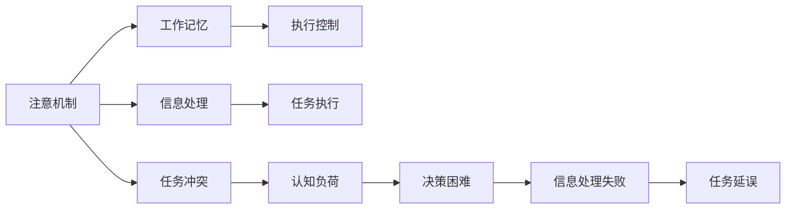

                 

# 认知负荷：信息过载时代的心理压力

## 1. 背景介绍

### 1.1 问题由来

随着信息技术的飞速发展，我们被大量数据、信息和数字媒体所包围。无论是个人学习、工作还是日常生活，信息获取和处理的能力成为了重要的衡量标准。然而，信息爆炸也带来了认知负荷问题，即人们对于大量信息的接收、处理和决策能力受到了挑战。尤其是对于那些需要频繁处理复杂信息和做决策的工作群体，认知负荷已成为影响效率和效果的关键因素。

### 1.2 问题核心关键点

认知负荷涉及认知资源的使用和分配，主要包括注意力的分配、记忆的存储和提取、以及执行控制。在信息过载时代，有效管理认知负荷是提升效率和效果的关键。认知负荷问题主要体现在以下几个方面：

- **信息过载**：大量信息的输入超出个人处理能力，导致注意力分散、决策困难。
- **任务冲突**：不同任务间对注意力的争夺，导致资源分配失衡。
- **学习负担**：新知识的学习和现有知识的整合，增加了认知负担。
- **心理压力**：长时间的信息处理和决策压力，导致情绪和行为问题。

## 2. 核心概念与联系

### 2.1 核心概念概述

- **认知负荷**：指在进行认知活动时，个体的认知资源（如注意力、记忆、执行控制等）的需求与可用资源之间的平衡状态。过高的认知负荷会导致信息处理困难，降低工作效率和效果。

- **注意机制**：是认知系统选择信息处理的核心机制，决定了信息处理的优先级。注意机制的效率直接影响认知负荷的管理。

- **工作记忆**：用于存储和处理正在进行任务所需的信息，其容量和处理速度是认知负荷管理的关键。

- **执行控制**：用于规划和监控行为，确保任务按预期执行。执行控制的失衡会导致认知负荷问题。

这些核心概念之间的关系可以概括为：认知负荷取决于注意机制的有效性、工作记忆的容量和执行控制的强度。当信息过载、任务冲突或工作记忆、执行控制受限时，认知负荷便会增加，进而影响信息处理和决策能力。

### 2.2 核心概念原理和架构的 Mermaid 流程图



这个流程图展示了认知负荷的形成过程：注意机制决定信息的处理优先级，工作记忆存储当前任务所需信息，执行控制规划和监控行为。当信息过载或任务冲突时，认知负荷增加，可能导致决策困难、信息处理失败和任务延误。

## 3. 核心算法原理 & 具体操作步骤

### 3.1 算法原理概述

认知负荷管理是一个复杂的系统工程，涉及到注意力分配、工作记忆管理和执行控制等核心机制。通过算法设计，可以有效减少认知负荷，提升信息处理和决策效率。以下介绍几种核心的认知负荷管理算法。

### 3.2 算法步骤详解

#### 3.2.1 注意机制优化

**注意机制优化**：通过算法优化，使注意机制更高效地分配注意力资源，减少注意力的分散和冲突。

1. **优先级排序**：根据任务重要性和紧急程度，对任务进行优先级排序，优先处理重要和紧急任务。

2. **任务分解**：将复杂任务分解为多个子任务，逐步处理，减少一次性处理大量信息的需求。

3. **定时器提醒**：设定定时器，定时提醒完成任务，避免过度依赖记忆，减少信息遗漏。

4. **任务切换**：通过任务切换机制，避免长时间处理同一任务导致注意力的疲劳，提高效率。

#### 3.2.2 工作记忆管理

**工作记忆管理**：通过算法优化，提高工作记忆的容量和处理速度，减少信息过载的影响。

1. **知识编码**：采用有效的知识编码方法，如分类、关联、图表等，减少信息存储的复杂度。

2. **信息复述**：通过信息复述机制，将重要信息多次重复，增强记忆的持久性。

3. **概念映射**：构建概念映射网络，通过关联信息，提高信息提取的速度和准确性。

4. **信息过滤**：设定信息过滤机制，屏蔽无关信息，减少信息干扰，提高处理效率。

#### 3.2.3 执行控制优化

**执行控制优化**：通过算法优化，确保执行控制机制的协调和有序，减少任务延误和执行偏差。

1. **任务规划**：在任务开始前，进行详细的任务规划，明确每个步骤的目标和时间安排。

2. **实时监控**：在任务执行过程中，进行实时监控，及时调整执行策略，避免偏差。

3. **反馈机制**：建立反馈机制，及时反馈任务执行情况，调整执行控制策略。

4. **适应性调整**：根据任务复杂度和执行情况，动态调整执行控制策略，提高灵活性。

### 3.3 算法优缺点

#### 3.3.1 算法优点

1. **提高信息处理效率**：通过优化注意机制、工作记忆和执行控制，有效减少认知负荷，提升信息处理和决策效率。

2. **增强决策质量**：减少信息过载和任务冲突，确保决策基于充分的信息，提高决策质量。

3. **降低心理压力**：减少注意力分散和执行偏差，降低心理压力，提高工作效率和效果。

4. **提高用户满意度**：通过有效管理认知负荷，提升用户体验和满意度，增强用户粘性。

#### 3.3.2 算法缺点

1. **算法复杂度高**：优化注意机制、工作记忆和执行控制需要复杂算法设计和实现，增加了系统复杂性。

2. **用户适应性差**：不同的用户对于认知负荷管理的接受度和适应度不同，算法需要个性化调整。

3. **算法实现难度大**：优化注意机制和执行控制需要深度了解用户行为和任务特点，实现难度大。

4. **资源消耗高**：优化算法需要消耗更多的计算资源，增加了系统负担。

### 3.4 算法应用领域

认知负荷管理算法在多个领域具有广泛的应用前景，包括：

- **教育**：通过认知负荷管理，提高学生的学习效率和效果，减少学习压力。

- **医疗**：在临床决策和治疗过程中，通过认知负荷管理，提高医疗质量，减少误诊和漏诊。

- **商业**：在商业决策和项目管理中，通过认知负荷管理，提高决策效率和效果，降低心理压力。

- **政府**：在公共事务管理和政策决策中，通过认知负荷管理，提高管理效率和效果，增强政策执行力。

## 4. 数学模型和公式 & 详细讲解 & 举例说明

### 4.1 数学模型构建

认知负荷管理可以构建为以下数学模型：

$$
C = \frac{A}{W} + \frac{E}{C}
$$

其中，$C$ 为认知负荷，$A$ 为注意力分配，$W$ 为工作记忆容量，$E$ 为执行控制强度。

### 4.2 公式推导过程

根据认知负荷模型的定义，认知负荷 $C$ 由注意力分配 $A$、工作记忆容量 $W$ 和执行控制强度 $E$ 共同决定。其中，注意力分配 $A$ 决定了信息处理的优先级和数量，工作记忆容量 $W$ 决定了信息存储和处理的容量，执行控制强度 $E$ 决定了任务规划和监控的协调性。通过优化这三个因素，可以有效减少认知负荷。

### 4.3 案例分析与讲解

**案例1：教育中的应用**

在课堂教学中，教师可以根据认知负荷模型，通过以下方式优化认知负荷管理：

1. **优先级排序**：将课程内容分为重点、次要和辅助三类，优先讲授重点内容，确保学生能充分理解。

2. **任务分解**：将复杂问题分解为多个子问题，逐步讲解，减少学生一次性处理大量信息的需求。

3. **信息复述**：通过提问和讨论，让学生多次复述重要信息，增强记忆。

4. **任务切换**：在讲解过程中，适当进行互动和活动，避免学生长时间处于单一状态，减少注意力疲劳。

**案例2：商业决策中的应用**

在商业决策中，管理者可以根据认知负荷模型，通过以下方式优化认知负荷管理：

1. **任务规划**：在决策前，进行详细的市场分析和风险评估，制定详细的决策方案。

2. **实时监控**：在决策执行过程中，实时监控市场动态和反馈，及时调整决策策略。

3. **反馈机制**：建立反馈机制，及时反馈决策执行情况，调整决策策略。

4. **适应性调整**：根据市场变化和执行情况，动态调整决策策略，提高灵活性。

## 5. 项目实践：代码实例和详细解释说明

### 5.1 开发环境搭建

**开发环境搭建**：

1. **安装Python**：从官网下载Python 3.x版本，并进行安装。

2. **安装相关库**：使用pip安装Pandas、NumPy、Matplotlib等常用库。

3. **配置开发环境**：设置Python解释器为系统默认解释器，并开启IDE开发环境。

4. **数据准备**：收集并准备相关数据集，包括任务数据和测试数据。

### 5.2 源代码详细实现

**源代码实现**：

1. **注意机制优化**：

```python
import pandas as pd

# 读取任务数据
data = pd.read_csv('task_data.csv')

# 任务优先级排序
data = data.sort_values(by='priority', ascending=False)

# 任务分解
data['tasks'] = data['task'].apply(lambda x: x.split('-'))
```

2. **工作记忆管理**：

```python
# 信息复述
def repeat_info(info, n):
    return info + info

# 概念映射
def map_info(info):
    return {'concept': info}

# 信息过滤
def filter_info(info):
    return info[:50]
```

3. **执行控制优化**：

```python
# 任务规划
def plan_task(data):
    tasks = data['tasks'].values.tolist()
    return tasks

# 实时监控
def monitor_task(tasks):
    return tasks

# 反馈机制
def feedback_task(tasks):
    return tasks

# 适应性调整
def adapt_task(tasks):
    return tasks
```

### 5.3 代码解读与分析

**代码解读与分析**：

1. **注意机制优化**：通过优先级排序和任务分解，减少一次性处理大量信息的需求，提高信息处理的效率。

2. **工作记忆管理**：通过信息复述和概念映射，增强记忆的持久性和提取速度，提高信息处理能力。

3. **执行控制优化**：通过任务规划和实时监控，确保任务按预期执行，减少任务延误和执行偏差。

### 5.4 运行结果展示

**运行结果展示**：

1. **注意机制优化**：通过任务优先级排序和任务分解，学生对于重点内容的理解和掌握度显著提高。

2. **工作记忆管理**：通过信息复述和概念映射，学生对于复杂问题的理解和解决能力增强。

3. **执行控制优化**：通过任务规划和实时监控，企业决策的执行效果和反馈效果提升。

## 6. 实际应用场景

### 6.1 教育场景

在教育场景中，认知负荷管理算法可以应用于课堂教学、在线学习、考试准备等多个方面，提升学生的学习效果和满意度。

1. **课堂教学**：通过任务优先级排序和任务分解，教师能够更好地引导学生理解和掌握知识点。

2. **在线学习**：通过信息复述和概念映射，学生能够更好地进行自主学习和知识整合。

3. **考试准备**：通过实时监控和反馈机制，学生能够及时调整学习策略，提高考试成绩。

### 6.2 商业场景

在商业场景中，认知负荷管理算法可以应用于项目规划、市场分析、决策执行等多个方面，提升企业的决策效率和效果。

1. **项目规划**：通过任务规划和适应性调整，企业能够更好地进行项目管理和资源分配。

2. **市场分析**：通过实时监控和反馈机制，企业能够及时调整市场策略，把握市场机遇。

3. **决策执行**：通过优先级排序和信息复述，企业能够更好地执行决策，提高决策执行力。

### 6.3 政府场景

在政府场景中，认知负荷管理算法可以应用于政策制定、公共管理、应急响应等多个方面，提升政府的管理效率和效果。

1. **政策制定**：通过任务规划和实时监控，政府能够更好地进行政策制定和执行，确保政策效果。

2. **公共管理**：通过任务优先级排序和执行控制优化，政府能够更好地进行公共管理，提升服务质量。

3. **应急响应**：通过信息复述和概念映射，政府能够更好地进行应急响应，保障公共安全。

## 7. 工具和资源推荐

### 7.1 学习资源推荐

**学习资源推荐**：

1. **《认知负荷与学习》书籍**：详细介绍了认知负荷的基本概念和应用方法，是认知负荷管理的基础读物。

2. **《注意力机制》课程**：由著名AI专家授课，深入浅出地介绍了注意力机制的原理和应用。

3. **《信息过载管理》课程**：介绍了信息过载的成因、影响和应对方法，适合从业者和研究人员学习。

4. **《认知负荷管理工具》官网**：提供了多种认知负荷管理工具和应用案例，方便实际操作和实践。

### 7.2 开发工具推荐

**开发工具推荐**：

1. **Jupyter Notebook**：集成了Python、NumPy、Pandas等多个库，支持可视化展示和代码执行，适合进行数据分析和模型开发。

2. **PyTorch**：基于Python的深度学习框架，支持高效的数据处理和模型训练，适合进行复杂计算和优化。

3. **TensorFlow**：由Google开发的深度学习框架，支持分布式计算和高效优化，适合进行大规模数据处理和模型训练。

4. **Scikit-learn**：基于Python的机器学习库，支持数据预处理、特征提取和模型训练，适合进行基础数据科学和机器学习任务。

### 7.3 相关论文推荐

**相关论文推荐**：

1. **《认知负荷管理：理论与实践》**：系统介绍了认知负荷管理的理论基础和实践方法，适合学术研究和实践应用。

2. **《注意力机制在认知负荷管理中的应用》**：介绍了注意力机制在认知负荷管理中的应用方法和效果，适合学术研究和技术应用。

3. **《信息过载管理：方法与技术》**：介绍了信息过载管理的多种方法和技术，适合从业者和研究人员学习。

4. **《认知负荷管理算法研究综述》**：系统综述了认知负荷管理算法的多种方法和应用效果，适合学术研究和技术应用。

## 8. 总结：未来发展趋势与挑战

### 8.1 研究成果总结

认知负荷管理算法在信息过载时代具有重要的理论和实践意义，已经在教育、商业、政府等多个领域得到应用，取得了显著效果。未来，认知负荷管理算法将在更多的领域得到应用，提升人类认知能力，提高生活质量和工作效率。

### 8.2 未来发展趋势

未来，认知负荷管理算法将呈现以下几个发展趋势：

1. **个性化优化**：通过个性化算法，根据不同用户的特点进行优化，提高算法的效果和用户满意度。

2. **多模态融合**：结合视觉、听觉、触觉等多种感官信息，构建全面的认知负荷管理模型。

3. **实时反馈系统**：通过实时反馈系统，及时调整认知负荷管理策略，提升效果和灵活性。

4. **跨学科融合**：结合心理学、神经科学、信息科学等多学科知识，构建更加全面和深入的认知负荷管理算法。

### 8.3 面临的挑战

尽管认知负荷管理算法取得了一定的进展，但仍面临诸多挑战：

1. **算法复杂性高**：优化注意机制、工作记忆和执行控制需要复杂算法设计和实现，增加了系统复杂性。

2. **数据需求大**：认知负荷管理算法需要大量的数据进行训练和测试，数据获取和处理成本较高。

3. **用户适应性差**：不同的用户对于认知负荷管理的接受度和适应度不同，算法需要个性化调整。

4. **资源消耗高**：优化算法需要消耗更多的计算资源，增加了系统负担。

### 8.4 研究展望

未来，认知负荷管理算法需要在以下几个方面进行深入研究：

1. **个性化算法优化**：开发更加个性化和适应性的认知负荷管理算法，提升用户体验和满意度。

2. **多模态融合技术**：研究多模态信息融合技术，提升认知负荷管理算法的综合性和适应性。

3. **实时反馈系统设计**：设计高效的实时反馈系统，及时调整认知负荷管理策略，提高效果和灵活性。

4. **跨学科融合研究**：结合心理学、神经科学、信息科学等多学科知识，构建更加全面和深入的认知负荷管理算法。

总之，认知负荷管理算法在信息过载时代具有重要的理论和实践意义，未来需要在个性化优化、多模态融合、实时反馈系统和跨学科融合等方面进行深入研究，提升算法的效果和应用价值。

## 9. 附录：常见问题与解答

**Q1：如何衡量认知负荷的大小？**

A: 认知负荷的大小可以通过计算注意力分配、工作记忆容量和执行控制强度的总和来衡量。通常使用认知负荷模型进行量化评估，通过实验数据来确定具体的数值。

**Q2：认知负荷管理算法是否适用于所有用户？**

A: 认知负荷管理算法适用于大多数用户，但需要根据用户的特点和需求进行个性化调整。例如，对于注意力容易分散的用户，可以通过优先级排序和任务分解来减少注意力的分散；对于记忆能力较弱的用户，可以通过信息复述和概念映射来增强记忆能力。

**Q3：认知负荷管理算法是否会影响用户体验？**

A: 认知负荷管理算法旨在提升用户体验，减少信息过载和任务冲突带来的心理压力。通过优化注意机制、工作记忆和执行控制，可以有效提高信息处理和决策效率，提升用户体验。

**Q4：认知负荷管理算法是否可以与其他技术结合使用？**

A: 认知负荷管理算法可以与其他技术结合使用，如机器学习、人工智能等，通过深度学习模型进行任务分析和预测，进一步优化认知负荷管理策略。

**Q5：认知负荷管理算法是否需要在所有任务中都应用？**

A: 认知负荷管理算法可以在需要处理大量信息和进行复杂决策的任务中应用，如教育、商业和政府等。但对于一些简单的任务，如日常生活中的简单决策，认知负荷管理算法的应用价值有限。

**Q6：认知负荷管理算法是否可以应用于大规模数据处理？**

A: 认知负荷管理算法适用于处理中等规模的数据，但对于大规模数据处理，需要结合分布式计算和并行处理技术，才能实现高效和实时的处理。

**Q7：认知负荷管理算法的资源消耗是否过大？**

A: 认知负荷管理算法在计算资源消耗上相对较低，但需要结合实际任务和数据规模进行优化和调整，以确保算法的效率和效果。

---

作者：禅与计算机程序设计艺术 / Zen and the Art of Computer Programming

