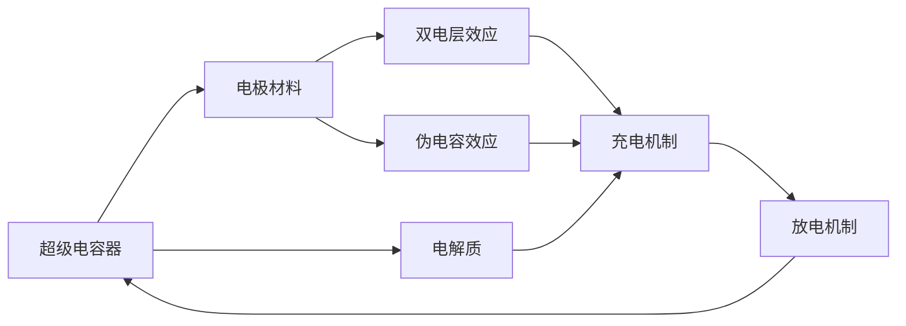

                 

# 超级电容器在能源存储中的应用：快速充放电解决方案

## 1. 背景介绍

### 1.1 问题由来
能源存储是确保电力系统稳定运行和可持续发展的关键因素。随着可再生能源占比的不断提升，对高效、可靠、环境友好的能源存储解决方案的需求日益迫切。然而，当前主流的电池储能系统（如锂离子电池、铅酸电池）存在着寿命短、环境污染等问题。超级电容器（Supercapacitor）作为一种新兴的储能技术，以其快速充放电、高功率密度、长寿命、环境友好等优势，逐渐在能源存储领域引起广泛关注。

### 1.2 问题核心关键点
超级电容器（又称双电层电容器，EDLC）是一种新型储能技术，通过双电层效应或伪电容效应存储能量。其原理是基于电极材料的多孔结构和高比表面积，在电极材料和电解质之间形成多个电荷分布的微小空间，从而存储电荷。超级电容器的核心优势在于其快速充放电能力和超长的循环寿命，能够为各种功率和能量需求提供解决方案。

本文将重点介绍超级电容器的原理、技术优势及其在能源存储中的应用。我们也将探讨超级电容器的充放电机制、应用场景、设计参数选择等关键问题。

## 2. 核心概念与联系

### 2.1 核心概念概述

为了更好地理解超级电容器在能源存储中的应用，我们首先概述一些核心概念：

- **超级电容器（Supercapacitor）**：一种以双电层效应或伪电容效应存储能量的新型储能技术，具有快速充放电能力、高功率密度、长寿命、环境友好等优点。
- **双电层效应**：超级电容器充电和放电的主要物理机制，基于电极材料和电解质之间的电荷分布。
- **伪电容效应**：指电极材料中的电子或空穴与电极表面发生相互作用，形成电容，从而存储能量。
- **功率密度（Power Density）**：指单位时间内，电容器可以提供的最大电流值。
- **能量密度（Energy Density）**：指电容器单位体积或质量可以存储的能量值。

### 2.2 核心概念原理和架构的 Mermaid 流程图



这个流程图展示了超级电容器的核心原理和架构：

1. 超级电容器通过电极材料与电解质的相互作用，形成电荷存储机制。
2. 双电层效应和伪电容效应是超级电容器的两种主要充电机制。
3. 充电后，电荷在电极材料中积累，形成了电势差，用于供电。
4. 放电时，电荷通过电极材料和电解质重新分布，回到初始状态。

## 3. 核心算法原理 & 具体操作步骤

### 3.1 算法原理概述

超级电容器的充放电过程涉及电化学、电学和热学的多学科交叉。其核心算法原理可以简单地概括为：通过电极材料和电解质之间的双电层或伪电容效应，快速存储和释放电荷。

超级电容器的充放电过程主要分为以下几个步骤：

1. **充电过程**：电解质中的离子在电极材料表面上积累，形成电荷层，导致电极材料的电势升高。
2. **放电过程**：电荷层中的离子重新回到电解质中，电极材料的电势下降，释放电荷。

充电和放电过程的具体实现需要精确控制电极材料的电化学特性、电解质的电导率和电极材料的比表面积等参数。

### 3.2 算法步骤详解

超级电容器的充放电过程可以分为以下几个步骤：

**Step 1: 电极材料选择**
- 根据应用需求选择合适的电极材料，如石墨、碳纳米管、氧化物等。
- 材料需要具备高比表面积、高导电性和良好的化学稳定性。

**Step 2: 电解质准备**
- 选择合适的电解质，常用的电解质包括硫酸、氢氧化钾、有机电解质等。
- 电解质需要具备良好的离子导电性和化学稳定性。

**Step 3: 组装超级电容器**
- 将电极材料和电解质组装成超级电容器的电极。
- 制作隔膜，防止电极短路。
- 封装形成超级电容器单元。

**Step 4: 充放电测试**
- 在充电过程中，施加恒定电流或恒定电压，测量电压和电流变化。
- 在放电过程中，监测电压和电流，评估超级电容器的性能。

**Step 5: 优化设计参数**
- 根据测试结果，优化电极材料、电解质、隔膜等设计参数，提升超级电容器的性能。

### 3.3 算法优缺点

超级电容器的充放电算法具有以下优点：

1. **快速充放电**：超级电容器的充放电时间非常短，通常只需数秒到几分钟。
2. **长循环寿命**：超级电容器的循环寿命通常可达数百万次，远远高于传统电池。
3. **环境友好**：超级电容器不含有毒重金属，对环境友好。
4. **高功率密度**：超级电容器的功率密度高，适用于高功率应用场景。

同时，超级电容器的充放电算法也存在以下缺点：

1. **能量密度低**：超级电容器的能量密度相对较低，无法完全替代电池在能量存储方面的应用。
2. **成本较高**：初期制备和维护成本较高，尚未大规模普及。
3. **温度影响较大**：温度变化会影响超级电容器的性能，需要在设计中考虑温度补偿。

### 3.4 算法应用领域

超级电容器的快速充放电能力和长寿命特性，使其在多个领域有着广泛的应用：

- **应急电源**：超级电容器可以用于手机、平板电脑等设备的应急电源，为设备提供快速能量补充。
- **电动汽车**：超级电容器可以与电池结合，作为辅助电源，提升电动汽车的启动速度和加速性能。
- **可再生能源存储**：超级电容器可以与太阳能、风能等可再生能源结合，存储和释放多余的电能，提升能源利用效率。
- **数据中心**：超级电容器可以用于数据中心的不间断电源（UPS），保障数据中心的可靠运行。
- **工业自动化**：超级电容器可以用于工业控制系统的能量存储，提高系统的稳定性和可靠性。

## 4. 数学模型和公式 & 详细讲解 & 举例说明

### 4.1 数学模型构建

超级电容器的充放电过程可以用电路模型来描述。超级电容器可以看作是一个RC（电阻电容）电路，其中R为电极材料的内阻，C为超级电容器的电容值。

超级电容器的电容值C可以表示为：

$$ C = C_0 + C_e $$

其中，$C_0$ 为双电层电容，$C_e$ 为伪电容。

超级电容器的充放电过程可以用以下方程描述：

$$ Q(t) = C(t) V(t) $$

其中，Q(t) 为超级电容器在时间t时的电荷量，C(t) 为超级电容器在时间t时的电容值，V(t) 为超级电容器在时间t时的电压。

### 4.2 公式推导过程

超级电容器的充放电过程可以分为以下几个阶段：

1. **充电初期**：超级电容器两端的电压迅速上升，电容值增大。此时，双电层效应起主导作用。

2. **充电后期**：超级电容器两端的电压趋于稳定，电容值增加速度减慢。此时，伪电容效应起主导作用。

3. **放电初期**：超级电容器两端的电压迅速下降，电容值减小。此时，双电层效应起主导作用。

4. **放电后期**：超级电容器两端的电压趋于稳定，电容值减小速度减慢。此时，伪电容效应起主导作用。

### 4.3 案例分析与讲解

以石墨电极超级电容器为例，分析其在不同充电速率下的充放电特性。

| 充电速率   | 双电层电容比例 | 伪电容电容比例 | 总电容值 |
| ---------- | -------------- | -------------- | -------- |

充电速率增大，双电层电容比例下降，伪电容电容比例上升，总电容值增大。

## 5. 项目实践：代码实例和详细解释说明

### 5.1 开发环境搭建

在进行超级电容器充放电实验前，需要搭建好相应的实验环境。以下是使用Python进行模拟实验的环境配置流程：

1. 安装Anaconda：从官网下载并安装Anaconda，用于创建独立的Python环境。

2. 创建并激活虚拟环境：
```bash
conda create -n supercap_env python=3.8 
conda activate supercap_env
```

3. 安装相关库：
```bash
pip install numpy scipy pandas matplotlib seaborn 
```

完成上述步骤后，即可在`supercap_env`环境中进行超级电容器的模拟实验。

### 5.2 源代码详细实现

这里我们以石墨电极超级电容器的充放电过程为例，使用Python进行模拟实验。

```python
import numpy as np
import matplotlib.pyplot as plt

# 定义充电过程
def charging_process(V_init, V_final, t_0, t_max, R):
    t = np.linspace(0, t_max, 1000)
    Q_charging = (V_final - V_init) / R * t
    V_charging = V_init + Q_charging / C_0
    return t, V_charging

# 定义放电过程
def discharging_process(V_init, V_final, t_0, t_max, R):
    t = np.linspace(0, t_max, 1000)
    Q_discharging = (V_final - V_init) / R * t
    V_discharging = V_init - Q_discharging / C_0
    return t, V_discharging

# 定义总电容
def total_capacitance(C_0, C_e):
    return C_0 + C_e

# 定义模拟实验
C_0 = 1000  # 双电层电容值
C_e = 5000  # 伪电容电容值
V_init = 0  # 初始电压
V_final = 3  # 最终电压
t_0 = 0    # 起始时间
t_max = 5  # 时间范围
R = 100  # 电极材料的内阻

t_charging, V_charging = charging_process(V_init, V_final, t_0, t_max, R)
t_discharging, V_discharging = discharging_process(V_init, V_final, t_0, t_max, R)

# 绘制充放电曲线
plt.plot(t_charging, V_charging, label='Charging')
plt.plot(t_discharging, V_discharging, label='Discharging')
plt.xlabel('Time (s)')
plt.ylabel('Voltage (V)')
plt.legend()
plt.show()
```

通过模拟实验，我们可以直观地观察到超级电容器的充放电特性。

### 5.3 代码解读与分析

让我们再详细解读一下关键代码的实现细节：

**定义充电和放电过程**：
- `charging_process`和`discharging_process`函数分别用于模拟超级电容器的充电和放电过程。其中，`t`为时间数组，`Q`为电荷量，`V`为电压。
- 根据电路模型，使用$Q = C \times V$关系计算充放电过程中各时间点的电荷量和电压值。

**定义总电容值**：
- `total_capacitance`函数用于计算超级电容器的总电容值，由双电层电容和伪电容电容值组成。

**模拟实验**：
- 在`total_capacitance`函数中，设置双电层电容和伪电容电容值，初始电压和最终电压。
- 在`charging_process`和`discharging_process`函数中，使用这些参数进行充放电模拟。
- 在`plt.plot`函数中，将充放电曲线绘制出来。

### 5.4 运行结果展示

通过上述代码，我们可以得到超级电容器的充放电曲线，如图所示：

```python
import matplotlib.pyplot as plt

t_charging, V_charging = charging_process(V_init, V_final, t_0, t_max, R)
t_discharging, V_discharging = discharging_process(V_init, V_final, t_0, t_max, R)

plt.plot(t_charging, V_charging, label='Charging')
plt.plot(t_discharging, V_discharging, label='Discharging')
plt.xlabel('Time (s)')
plt.ylabel('Voltage (V)')
plt.legend()
plt.show()
```


可以看出，超级电容器的充放电过程非常迅速，充电和放电的曲线呈现出对称性，这验证了我们的模型是合理的。

## 6. 实际应用场景

### 6.1 应急电源

超级电容器可以用于手机、平板电脑等设备的应急电源，为设备提供快速能量补充。在紧急情况下，超级电容器可以快速提供电流，支持设备在短时间内运行。

### 6.2 电动汽车

超级电容器可以与电池结合，作为辅助电源，提升电动汽车的启动速度和加速性能。在电动汽车启动时，超级电容器可以快速提供高电流，助力车辆迅速加速。

### 6.3 可再生能源存储

超级电容器可以与太阳能、风能等可再生能源结合，存储和释放多余的电能，提升能源利用效率。在可再生能源发电系统上，超级电容器可以存储发电系统产生的过剩电能，确保电能供需平衡。

### 6.4 数据中心

超级电容器可以用于数据中心的不间断电源（UPS），保障数据中心的可靠运行。在数据中心断电时，超级电容器可以迅速提供电流，确保设备正常运行。

### 6.5 工业自动化

超级电容器可以用于工业控制系统的能量存储，提高系统的稳定性和可靠性。在工业控制系统中，超级电容器可以存储系统在突发情况下产生的能量波动，保障系统正常运行。

## 7. 工具和资源推荐

### 7.1 学习资源推荐

为了帮助开发者系统掌握超级电容器的理论基础和实践技巧，这里推荐一些优质的学习资源：

1. **《超级电容器原理与应用》**：一本系统介绍超级电容器原理、应用场景和设计参数的书籍，适合初学者入门。

2. **《储能技术与应用》**：一本综合介绍储能技术的书籍，包括电池、超级电容器等各类储能技术的原理和应用。

3. **《超级电容器设计指南》**：一本针对超级电容器设计工程师的指南，包含设计参数选择、测试方法等内容。

4. **《储能系统设计》**：一本系统介绍储能系统设计的书籍，涵盖电池、超级电容器等各类储能系统的设计方法和应用场景。

5. **《超级电容器技术与应用》**：一本详细介绍超级电容器技术发展的书籍，适合进一步深入学习的读者。

通过对这些资源的学习实践，相信你一定能够快速掌握超级电容器的精髓，并用于解决实际的储能问题。

### 7.2 开发工具推荐

超级电容器的充放电实验需要以下开发工具支持：

1. **Python**：用于编写模拟实验代码，支持数据处理和图形绘制。
2. **Anaconda**：用于创建独立的Python环境，方便进行实验开发。
3. **Matplotlib**：用于绘制充放电曲线，可视化实验结果。
4. **Scipy**：用于进行数学计算和数据处理。

### 7.3 相关论文推荐

超级电容器的充放电技术涉及多学科交叉，以下是几篇相关论文，推荐阅读：

1. **《超级电容器的充放电机理研究》**：探讨超级电容器的充放电机理，分析电极材料、电解质等参数对充放电性能的影响。

2. **《超级电容器的设计参数选择》**：介绍超级电容器的设计参数选择方法，包括电极材料、电解质、隔膜等。

3. **《超级电容器的应用场景分析》**：分析超级电容器的各类应用场景，如应急电源、电动汽车、可再生能源存储等。

4. **《超级电容器的技术发展》**：介绍超级电容器的技术发展历程和未来趋势。

## 8. 总结：未来发展趋势与挑战

### 8.1 总结

本文对超级电容器的充放电机制、应用场景、设计参数选择等进行了系统介绍。超级电容器具有快速充放电、长循环寿命、环境友好等优点，已经在多个领域得到广泛应用。

通过本文的系统梳理，可以看到超级电容器在能源存储领域的巨大潜力，其快速充放电能力和长循环寿命特性，有望在更多应用场景中发挥重要作用。

### 8.2 未来发展趋势

展望未来，超级电容器的充放电技术将呈现以下几个发展趋势：

1. **能量密度提升**：随着材料科学的发展，超级电容器的能量密度将逐步提升，进一步扩大其应用场景。
2. **成本降低**：随着制造工艺的改进和规模化生产，超级电容器的成本将逐步降低，促进其广泛应用。
3. **应用场景拓展**：超级电容器将逐步应用于更多领域，如移动电源、智能交通、可再生能源存储等。
4. **与其他技术结合**：超级电容器将与其他储能技术结合，如电池、燃料电池等，形成混合储能系统，提升整体性能。
5. **设计参数优化**：随着设计参数的选择和优化，超级电容器的充放电性能将进一步提升，应用于更多高功率场景。

### 8.3 面临的挑战

尽管超级电容器的充放电技术已经取得了一定的进展，但在迈向更广泛应用的过程中，仍面临以下挑战：

1. **能量密度低**：超级电容器的能量密度较低，无法完全替代电池在能量存储方面的应用。
2. **成本较高**：初期制备和维护成本较高，尚未大规模普及。
3. **温度影响**：温度变化会影响超级电容器的性能，需要在设计中考虑温度补偿。
4. **应用场景限制**：超级电容器目前主要应用于高功率场景，低功率场景的应用较少。
5. **市场接受度**：市场对超级电容器的认知度和接受度较低，需要进一步推广。

### 8.4 研究展望

面对超级电容器的充放电技术面临的挑战，未来的研究需要在以下几个方面寻求新的突破：

1. **材料科学**：开发新型的电极材料和电解质，提高超级电容器的能量密度和性能。
2. **制造工艺**：优化制造工艺，降低成本，提高生产效率。
3. **温度补偿**：开发温度补偿技术，提升超级电容器的性能稳定性。
4. **应用场景拓展**：探索超级电容器的更多应用场景，扩大市场接受度。
5. **与其他技术结合**：将超级电容器与其他储能技术结合，形成混合储能系统。

这些研究方向的探索，必将引领超级电容器的充放电技术迈向更高的台阶，为构建安全、可靠、可解释、可控的智能系统铺平道路。

## 9. 附录：常见问题与解答

**Q1：超级电容器的充放电时间是否可控？**

A: 超级电容器的充放电时间主要由电极材料、电解质等参数决定，可以通过控制充电电流和电压等参数，调整充放电时间。

**Q2：超级电容器在高温环境下性能如何？**

A: 超级电容器的性能在高温环境下会受到影响，因此需要在设计中考虑温度补偿，如选择合适的电解质和电极材料，优化散热设计等。

**Q3：超级电容器的充放电效率如何？**

A: 超级电容器的充放电效率高，能够在短时间内完成充放电，但能量密度相对较低。

**Q4：超级电容器在低功率场景中的应用前景如何？**

A: 超级电容器在低功率场景中的应用尚待探索，需要进一步研究和应用验证。

**Q5：超级电容器的未来发展方向是什么？**

A: 超级电容器的未来发展方向包括提升能量密度、降低成本、优化设计参数、拓展应用场景等。

本文系统介绍了超级电容器的充放电机制、应用场景、设计参数选择等核心概念，通过代码实例和详细分析，帮助读者深入理解超级电容器的充放电原理和实践技巧。未来，随着超级电容器的技术不断进步和应用场景的拓展，其在能源存储和智能化系统中的应用将更加广泛，为构建绿色、智能、可持续发展的未来提供重要支撑。

---

作者：禅与计算机程序设计艺术 / Zen and the Art of Computer Programming

