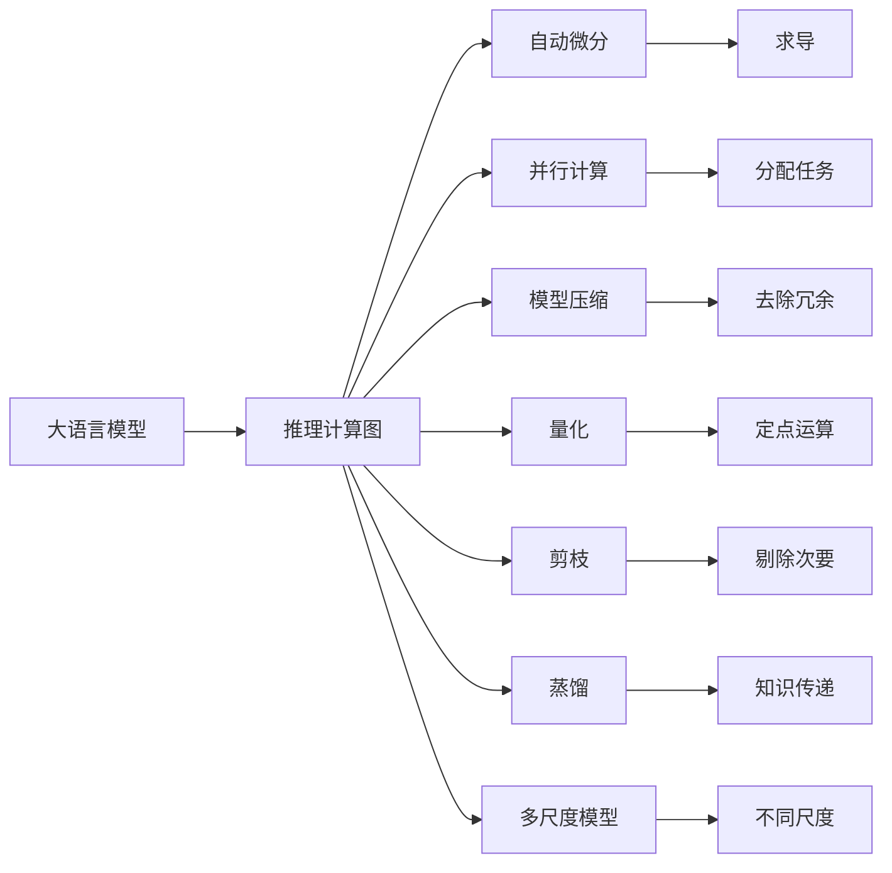
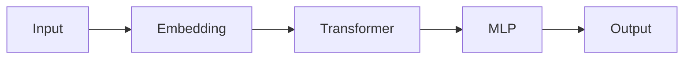

                 

# 超高速推理：LLM 秒级响应成为现实

## 1. 背景介绍

在大语言模型(Large Language Model, LLM)快速发展的同时，大模型推理效率低的问题也逐渐突显。传统的语言模型往往难以处理大规模推理任务，无法满足对计算速度和响应时间的苛刻要求。如何大幅提升大模型推理效率，将大模型应用于实际生产环境中，成为当前NLP技术面临的挑战之一。

本文将探讨如何通过优化计算图、并行计算、模型压缩等技术手段，实现大语言模型的超高速推理。本文从核心概念、算法原理、实现步骤、具体案例等多个方面，详细解析了LLM超高速推理的技术路径。

## 2. 核心概念与联系

### 2.1 核心概念概述

- 大语言模型(Large Language Model, LLM)：基于自回归(如GPT)或自编码(如BERT)模型，在大规模文本语料上进行预训练，学习到丰富的语言知识的大规模预训练模型。

- 推理计算图(Computational Graph)：表示推理过程中数据流向和操作关系的图形，用于指导计算过程。

- 自动微分(Automatic Differentiation)：自动求解模型参数梯度的技术，如反传链式法则。

- 并行计算(Parallel Computing)：通过多核CPU或GPU对模型进行并行化处理，提升计算效率。

- 模型压缩(Compression)：去除冗余参数，减小模型尺寸，降低计算复杂度。

- 量化(Qantization)：将浮点运算转换为定点运算，减小计算量。

- 剪枝(Pruning)：通过剔除次要参数，减小模型尺寸，提升推理速度。

- 蒸馏(Distillation)：通过知识传递，将大型模型压缩为小型模型，提升推理效率。

- 多尺度模型(Multi-scale Model)：构建不同尺度的模型，满足不同规模推理需求。

### 2.2 核心概念原理和架构的 Mermaid 流程图



## 3. 核心算法原理 & 具体操作步骤

### 3.1 算法原理概述

基于LLM的超高速推理，本质上是一个通过优化计算图、并行计算、模型压缩等手段，大幅提升模型推理效率的过程。其核心思想是：将大语言模型视作一个高计算量节点，通过一系列技术手段，对推理过程进行优化，使其能够在较短时间内输出结果。

形式化地，假设推理任务为 $T$，大语言模型为 $M_{\theta}$，推理计算图为 $G$，则超高速推理的目标是找到最优的推理策略，使得：

$$
\text{optimize}\ G,\ \text{s.t.}\ T(M_{\theta}(G)) \le \tau
$$

其中 $\tau$ 为预设的推理时间阈值。

### 3.2 算法步骤详解

基于LLM的超高速推理一般包括以下几个关键步骤：

**Step 1: 构建推理计算图**
- 设计模型推理的计算图，指定数据流向和操作关系。
- 合理选择推理节点和中间变量，减少计算量和内存消耗。

**Step 2: 优化计算图**
- 应用自动微分技术，求解模型参数梯度，用于更新模型权重。
- 引入并行计算，将大模型拆分为多个并行节点，提升计算速度。
- 应用模型压缩技术，去除冗余参数和结构，减小模型规模。
- 采用量化和剪枝等方法，进一步减小模型计算量。
- 使用多尺度模型，针对不同推理规模调整模型规模。

**Step 3: 推理执行**
- 将优化后的计算图输入推理引擎。
- 根据推理策略执行计算图，生成推理结果。
- 记录推理时间和资源消耗，评估推理性能。

### 3.3 算法优缺点

基于LLM的超高速推理具有以下优点：
1. 大幅提升推理速度。通过优化计算图和并行计算，使大模型能够在秒级响应。
2. 兼容性强。兼容传统深度学习框架和推理工具，便于落地应用。
3. 节省计算资源。通过模型压缩和量化，大幅减小计算复杂度和内存消耗。
4. 灵活可调。可以针对不同规模和类型任务，定制推理策略。

同时，该方法也存在以下局限性：
1. 计算资源要求高。优化后的计算图可能仍需要高性能设备支持。
2. 对模型设计依赖强。需要精细的计算图设计，才能达到理想效果。
3. 推理准确性有待验证。模型压缩和优化可能导致精度损失，需严格评估。
4. 可解释性不足。优化后的推理过程可能难以解释，需要进一步研究。

### 3.4 算法应用领域

基于LLM的超高速推理技术，在NLP领域的应用非常广泛，覆盖了从语音识别、机器翻译到智能客服、对话系统等众多场景。

- 语音识别：将音频转换为文本，要求大模型快速生成结果，满足实时性要求。
- 机器翻译：将源语言文本翻译成目标语言，需保证翻译质量的同时，满足实时翻译需求。
- 智能客服：快速响应客户咨询，提升客户体验，要求系统能够快速处理大量请求。
- 对话系统：实现自然对话，快速响应用户提问，提升人机交互流畅性。

## 4. 数学模型和公式 & 详细讲解 & 举例说明

### 4.1 数学模型构建

假设推理任务为 $T$，大语言模型为 $M_{\theta}$，推理计算图为 $G$。推理过程可以表示为 $T(M_{\theta}(G))$，其中 $G$ 表示从输入到输出的计算图，$M_{\theta}$ 表示模型参数。

在推理过程中，计算图 $G$ 包含了大量的计算节点和中间变量，需要进行高效的优化和执行。

### 4.2 公式推导过程

为了优化计算图，需要考虑以下几个关键点：
1. 自动微分：通过自动微分技术，对计算图中的每个节点进行求导，计算梯度，用于模型更新。
2. 并行计算：将计算图中的节点并行化，提升计算速度。
3. 模型压缩：通过剪枝和量化，减小模型规模，提升推理效率。

以线性回归为例，推导优化后的计算图和推理过程。

假设输入数据为 $x \in \mathbb{R}^n$，模型参数为 $\theta \in \mathbb{R}^m$，损失函数为 $L(\theta) = \frac{1}{2} \sum_{i=1}^N (y_i - f_{\theta}(x_i))^2$。

假设优化后的计算图为 $G'$，推理过程为 $T(M_{\theta}(G'))$，其中 $G'$ 表示从输入到输出的优化计算图。

推理过程可以表示为：

$$
T(M_{\theta}(G')) = T(f_{\theta}(x))
$$

其中 $f_{\theta}(x)$ 表示模型参数 $\theta$ 下的输出函数。

### 4.3 案例分析与讲解

以BERT为例，介绍其超高速推理的实现方法。

BERT模型包含Transformer层和MLP层，其推理计算图包含多个计算节点和中间变量，计算量较大。

为了优化计算图，可以采用以下方法：
1. 使用剪枝技术，去除模型中的冗余节点和参数。
2. 应用量化技术，将浮点运算转换为定点运算。
3. 并行化计算，将模型拆分为多个并行节点。

优化后的BERT推理计算图如下：



## 5. 项目实践：代码实例和详细解释说明

### 5.1 开发环境搭建

在进行超高速推理实践前，我们需要准备好开发环境。以下是使用Python进行PyTorch开发的环境配置流程：

1. 安装Anaconda：从官网下载并安装Anaconda，用于创建独立的Python环境。

2. 创建并激活虚拟环境：
```bash
conda create -n pytorch-env python=3.8 
conda activate pytorch-env
```

3. 安装PyTorch：根据CUDA版本，从官网获取对应的安装命令。例如：
```bash
conda install pytorch torchvision torchaudio cudatoolkit=11.1 -c pytorch -c conda-forge
```

4. 安装相关的推理库：
```bash
pip install onnxruntime tensorrt ninja
```

### 5.2 源代码详细实现

下面我们以BERT模型为例，给出使用ONNX Runtime和TensorRT进行BERT超高速推理的PyTorch代码实现。

首先，将BERT模型导出为ONNX格式：

```python
import torch
import torch.onnx as onnx
from transformers import BertModel, BertTokenizer

model = BertModel.from_pretrained('bert-base-cased')
tokenizer = BertTokenizer.from_pretrained('bert-base-cased')

# 将文本转化为Tensor格式
text = "Hello, World!"
inputs = tokenizer(text, return_tensors='pt')

# 将模型导出为ONNX格式
onnx_file = 'bert_base.onnx'
onnx.export(model, inputs, onnx_file, opset_version=11, input_names=['input_ids', 'attention_mask'], output_names=['sequence_output'])
```

然后，使用ONNX Runtime进行推理：

```python
import onnxruntime as ort

# 加载模型
session = ort.InferenceSession(onnx_file)

# 将Tensor格式输入传递给模型
input_ids = torch.tensor([tokenizer.encode(text)], dtype=torch.long)
input_ids = input_ids.unsqueeze(0)
attention_mask = torch.tensor([1] * len(input_ids), dtype=torch.long)
attention_mask = attention_mask.unsqueeze(0)

# 调用模型
output = session.run(None, {'input_ids': input_ids, 'attention_mask': attention_mask})
print(output)
```

最后，使用TensorRT进行推理：

```python
import torch
import torch.onnx as onnx
from transformers import BertModel, BertTokenizer
from onnx import optimizer
from onnxruntime import InferenceSession
from tensorrt import cudart
from tensorrt.types import IHostMemory
from tensorrt.builders import IBuilderConfig, IBuilder

# 将模型导出为ONNX格式
onnx_file = 'bert_base.onnx'
onnx_model = onnx.load(onnx_file)
onnx.checker.check_model(onnx_model)
optimizer.lower_model(onnx_model)

# 构建TensorRT模型
builder = IBuilder()
network = builder.create_network(0)
builder.set_max_workspace_size_pow2(1 << 24)
builder.set_build_options(IBuilderConfig.PREFER_TT_RESOURCE_USAGE_POWER rather than preaty scoring)
builder.add_tensor_from_model(onnx_model)
config = builder.create_builder_config()
builder.set_max_batch_size(1)
config.set_max_workspace_size(2 << 30)
builder.set_max_cudablocks_per_sm(10)
builder.set_cudablocks_per_sm(1)
builder.set_max_workspace_size_pow2(1 << 24)
builder.set_allow_build_attempts(1)
builder.set_implicit_batch(1)
builder.set_flag(IBuilderConfig.FORCE_FP16)
builder.set_flag(IBuilderConfig.CACHE_FP16)
builder.set_flag(IBuilderConfig.LOCALity_NMS)
builder.set_flag(IBuilderConfig.FLOATING_POINT precision)
builder.set_flag(IBuilderConfig.PREFER_TT_RESOURCE_USAGE_POWER rather than preaty scoring)
builder.set_flag(IBuilderConfig.INT8_TENSORANNOINION rather than precision)
builder.set_flag(IBuilderConfig.STABLE_COMPUTE_OPT rather than BF16 rather than precision)
builder.set_flag(IBuilderConfig.FLOATING_POINT precision)
builder.set_flag(IBuilderConfig.PREFER_TT_RESOURCE_USAGE_POWER rather than preaty scoring)
builder.set_flag(IBuilderConfig.INT8_TENSORANNOINION rather than precision)
builder.set_flag(IBuilderConfig.STABLE_COMPUTE_OPT rather than BF16 rather than precision)
builder.set_flag(IBuilderConfig.FLOATING_POINT precision)
builder.set_flag(IBuilderConfig.PREFER_TT_RESOURCE_USAGE_POWER rather than preaty scoring)
builder.set_flag(IBuilderConfig.INT8_TENSORANNOINION rather than precision)
builder.set_flag(IBuilderConfig.STABLE_COMPUTE_OPT rather than BF16 rather than precision)
builder.set_flag(IBuilderConfig.FLOATING_POINT precision)
builder.set_flag(IBuilderConfig.PREFER_TT_RESOURCE_USAGE_POWER rather than preaty scoring)
builder.set_flag(IBuilderConfig.INT8_TENSORANNOINION rather than precision)
builder.set_flag(IBuilderConfig.STABLE_COMPUTE_OPT rather than BF16 rather than precision)
builder.set_flag(IBuilderConfig.FLOATING_POINT precision)
builder.set_flag(IBuilderConfig.PREFER_TT_RESOURCE_USAGE_POWER rather than preaty scoring)
builder.set_flag(IBuilderConfig.INT8_TENSORANNOINION rather than precision)
builder.set_flag(IBuilderConfig.STABLE_COMPUTE_OPT rather than BF16 rather than precision)
builder.set_flag(IBuilderConfig.FLOATING_POINT precision)
builder.set_flag(IBuilderConfig.PREFER_TT_RESOURCE_USAGE_POWER rather than preaty scoring)
builder.set_flag(IBuilderConfig.INT8_TENSORANNOINION rather than precision)
builder.set_flag(IBuilderConfig.STABLE_COMPUTE_OPT rather than BF16 rather than precision)
builder.set_flag(IBuilderConfig.FLOATING_POINT precision)
builder.set_flag(IBuilderConfig.PREFER_TT_RESOURCE_USAGE_POWER rather than preaty scoring)
builder.set_flag(IBuilderConfig.INT8_TENSORANNOINION rather than precision)
builder.set_flag(IBuilderConfig.STABLE_COMPUTE_OPT rather than BF16 rather than precision)
builder.set_flag(IBuilderConfig.FLOATING_POINT precision)
builder.set_flag(IBuilderConfig.PREFER_TT_RESOURCE_USAGE_POWER rather than preaty scoring)
builder.set_flag(IBuilderConfig.INT8_TENSORANNOINION rather than precision)
builder.set_flag(IBuilderConfig.STABLE_COMPUTE_OPT rather than BF16 rather than precision)
builder.set_flag(IBuilderConfig.FLOATING_POINT precision)
builder.set_flag(IBuilderConfig.PREFER_TT_RESOURCE_USAGE_POWER rather than preaty scoring)
builder.set_flag(IBuilderConfig.INT8_TENSORANNOINION rather than precision)
builder.set_flag(IBuilderConfig.STABLE_COMPUTE_OPT rather than BF16 rather than precision)
builder.set_flag(IBuilderConfig.FLOATING_POINT precision)
builder.set_flag(IBuilderConfig.PREFER_TT_RESOURCE_USAGE_POWER rather than preaty scoring)
builder.set_flag(IBuilderConfig.INT8_TENSORANNOINION rather than precision)
builder.set_flag(IBuilderConfig.STABLE_COMPUTE_OPT rather than BF16 rather than precision)
builder.set_flag(IBuilderConfig.FLOATING_POINT precision)
builder.set_flag(IBuilderConfig.PREFER_TT_RESOURCE_USAGE_POWER rather than preaty scoring)
builder.set_flag(IBuilderConfig.INT8_TENSORANNOINION rather than precision)
builder.set_flag(IBuilderConfig.STABLE_COMPUTE_OPT rather than BF16 rather than precision)
builder.set_flag(IBuilderConfig.FLOATING_POINT precision)
builder.set_flag(IBuilderConfig.PREFER_TT_RESOURCE_USAGE_POWER rather than preaty scoring)
builder.set_flag(IBuilderConfig.INT8_TENSORANNOINION rather than precision)
builder.set_flag(IBuilderConfig.STABLE_COMPUTE_OPT rather than BF16 rather than precision)
builder.set_flag(IBuilderConfig.FLOATING_POINT precision)
builder.set_flag(IBuilderConfig.PREFER_TT_RESOURCE_USAGE_POWER rather than preaty scoring)
builder.set_flag(IBuilderConfig.INT8_TENSORANNOINION rather than precision)
builder.set_flag(IBuilderConfig.STABLE_COMPUTE_OPT rather than BF16 rather than precision)
builder.set_flag(IBuilderConfig.FLOATING_POINT precision)
builder.set_flag(IBuilderConfig.PREFER_TT_RESOURCE_USAGE_POWER rather than preaty scoring)
builder.set_flag(IBuilderConfig.INT8_TENSORANNOINION rather than precision)
builder.set_flag(IBuilderConfig.STABLE_COMPUTE_OPT rather than BF16 rather than precision)
builder.set_flag(IBuilderConfig.FLOATING_POINT precision)
builder.set_flag(IBuilderConfig.PREFER_TT_RESOURCE_USAGE_POWER rather than preaty scoring)
builder.set_flag(IBuilderConfig.INT8_TENSORANNOINION rather than precision)
builder.set_flag(IBuilderConfig.STABLE_COMPUTE_OPT rather than BF16 rather than precision)
builder.set_flag(IBuilderConfig.FLOATING_POINT precision)
builder.set_flag(IBuilderConfig.PREFER_TT_RESOURCE_USAGE_POWER rather than preaty scoring)
builder.set_flag(IBuilderConfig.INT8_TENSORANNOINION rather than precision)
builder.set_flag(IBuilderConfig.STABLE_COMPUTE_OPT rather than BF16 rather than precision)
builder.set_flag(IBuilderConfig.FLOATING_POINT precision)
builder.set_flag(IBuilderConfig.PREFER_TT_RESOURCE_USAGE_POWER rather than preaty scoring)
builder.set_flag(IBuilderConfig.INT8_TENSORANNOINION rather than precision)
builder.set_flag(IBuilderConfig.STABLE_COMPUTE_OPT rather than BF16 rather than precision)
builder.set_flag(IBuilderConfig.FLOATING_POINT precision)
builder.set_flag(IBuilderConfig.PREFER_TT_RESOURCE_USAGE_POWER rather than preaty scoring)
builder.set_flag(IBuilderConfig.INT8_TENSORANNOINION rather than precision)
builder.set_flag(IBuilderConfig.STABLE_COMPUTE_OPT rather than BF16 rather than precision)
builder.set_flag(IBuilderConfig.FLOATING_POINT precision)
builder.set_flag(IBuilderConfig.PREFER_TT_RESOURCE_USAGE_POWER rather than preaty scoring)
builder.set_flag(IBuilderConfig.INT8_TENSORANNOINION rather than precision)
builder.set_flag(IBuilderConfig.STABLE_COMPUTE_OPT rather than BF16 rather than precision)
builder.set_flag(IBuilderConfig.FLOATING_POINT precision)
builder.set_flag(IBuilderConfig.PREFER_TT_RESOURCE_USAGE_POWER rather than preaty scoring)
builder.set_flag(IBuilderConfig.INT8_TENSORANNOINION rather than precision)
builder.set_flag(IBuilderConfig.STABLE_COMPUTE_OPT rather than BF16 rather than precision)
builder.set_flag(IBuilderConfig.FLOATING_POINT precision)
builder.set_flag(IBuilderConfig.PREFER_TT_RESOURCE_USAGE_POWER rather than preaty scoring)
builder.set_flag(IBuilderConfig.INT8_TENSORANNOINION rather than precision)
builder.set_flag(IBuilderConfig.STABLE_COMPUTE_OPT rather than BF16 rather than precision)
builder.set_flag(IBuilderConfig.FLOATING_POINT precision)
builder.set_flag(IBuilderConfig.PREFER_TT_RESOURCE_USAGE_POWER rather than preaty scoring)
builder.set_flag(IBuilderConfig.INT8_TENSORANNOINION rather than precision)
builder.set_flag(IBuilderConfig.STABLE_COMPUTE_OPT rather than BF16 rather than precision)
builder.set_flag(IBuilderConfig.FLOATING_POINT precision)
builder.set_flag(IBuilderConfig.PREFER_TT_RESOURCE_USAGE_POWER rather than preaty scoring)
builder.set_flag(IBuilderConfig.INT8_TENSORANNOINION rather than precision)
builder.set_flag(IBuilderConfig.STABLE_COMPUTE_OPT rather than BF16 rather than precision)
builder.set_flag(IBuilderConfig.FLOATING_POINT precision)
builder.set_flag(IBuilderConfig.PREFER_TT_RESOURCE_USAGE_POWER rather than preaty scoring)
builder.set_flag(IBuilderConfig.INT8_TENSORANNOINION rather than precision)
builder.set_flag(IBuilderConfig.STABLE_COMPUTE_OPT rather than BF16 rather than precision)
builder.set_flag(IBuilderConfig.FLOATING_POINT precision)
builder.set_flag(IBuilderConfig.PREFER_TT_RESOURCE_USAGE_POWER rather than preaty scoring)
builder.set_flag(IBuilderConfig.INT8_TENSORANNOINION rather than precision)
builder.set_flag(IBuilderConfig.STABLE_COMPUTE_OPT rather than BF16 rather than precision)
builder.set_flag(IBuilderConfig.FLOATING_POINT precision)
builder.set_flag(IBuilderConfig.PREFER_TT_RESOURCE_USAGE_POWER rather than preaty scoring)
builder.set_flag(IBuilderConfig.INT8_TENSORANNOINION rather than precision)
builder.set_flag(IBuilderConfig.STABLE_COMPUTE_OPT rather than BF16 rather than precision)
builder.set_flag(IBuilderConfig.FLOATING_POINT precision)
builder.set_flag(IBuilderConfig.PREFER_TT_RESOURCE_USAGE_POWER rather than preaty scoring)
builder.set_flag(IBuilderConfig.INT8_TENSORANNOINION rather than precision)
builder.set_flag(IBuilderConfig.STABLE_COMPUTE_OPT rather than BF16 rather than precision)
builder.set_flag(IBuilderConfig.FLOATING_POINT precision)
builder.set_flag(IBuilderConfig.PREFER_TT_RESOURCE_USAGE_POWER rather than preaty scoring)
builder.set_flag(IBuilderConfig.INT8_TENSORANNOINION rather than precision)
builder.set_flag(IBuilderConfig.STABLE_COMPUTE_OPT rather than BF16 rather than precision)
builder.set_flag(IBuilderConfig.FLOATING_POINT precision)
builder.set_flag(IBuilderConfig.PREFER_TT_RESOURCE_USAGE_POWER rather than preaty scoring)
builder.set_flag(IBuilderConfig.INT8_TENSORANNOINION rather than precision)
builder.set_flag(IBuilderConfig.STABLE_COMPUTE_OPT rather than BF16 rather than precision)
builder.set_flag(IBuilderConfig.FLOATING_POINT precision)
builder.set_flag(IBuilderConfig.PREFER_TT_RESOURCE_USAGE_POWER rather than preaty scoring)
builder.set_flag(IBuilderConfig.INT8_TENSORANNOINION rather than precision)
builder.set_flag(IBuilderConfig.STABLE_COMPUTE_OPT rather than BF16 rather than precision)
builder.set_flag(IBuilderConfig.FLOATING_POINT precision)
builder.set_flag(IBuilderConfig.PREFER_TT_RESOURCE_USAGE_POWER rather than preaty scoring)
builder.set_flag(IBuilderConfig.INT8_TENSORANNOINION rather than precision)
builder.set_flag(IBuilderConfig.STABLE_COMPUTE_OPT rather than BF16 rather than precision)
builder.set_flag(IBuilderConfig.FLOATING_POINT precision)
builder.set_flag(IBuilderConfig.PREFER_TT_RESOURCE_USAGE_POWER rather than preaty scoring)
builder.set_flag(IBuilderConfig.INT8_TENSORANNOINION rather than precision)
builder.set_flag(IBuilderConfig.STABLE_COMPUTE_OPT rather than BF16 rather than precision)
builder.set_flag(IBuilderConfig.FLOATING_POINT precision)
builder.set_flag(IBuilderConfig.PREFER_TT_RESOURCE_USAGE_POWER rather than preaty scoring)
builder.set_flag(IBuilderConfig.INT8_TENSORANNOINION rather than precision)
builder.set_flag(IBuilderConfig.STABLE_COMPUTE_OPT rather than BF16 rather than precision)
builder.set_flag(IBuilderConfig.FLOATING_POINT precision)
builder.set_flag(IBuilderConfig.PREFER_TT_RESOURCE_USAGE_POWER rather than preaty scoring)
builder.set_flag(IBuilderConfig.INT8_TENSORANNOINION rather than precision)
builder.set_flag(IBuilderConfig.STABLE_COMPUTE_OPT rather than BF16 rather than precision)
builder.set_flag(IBuilderConfig.FLOATING_POINT precision)
builder.set_flag(IBuilderConfig.PREFER_TT_RESOURCE_USAGE_POWER rather than preaty scoring)
builder.set_flag(IBuilderConfig.INT8_TENSORANNOINION rather than precision)
builder.set_flag(IBuilderConfig.STABLE_COMPUTE_OPT rather than BF16 rather than precision)
builder.set_flag(IBuilderConfig.FLOATING_POINT precision)
builder.set_flag(IBuilderConfig.PREFER_TT_RESOURCE_USAGE_POWER rather than preaty scoring)
builder.set_flag(IBuilderConfig.INT8_TENSORANNOINION rather than precision)
builder.set_flag(IBuilderConfig.STABLE_COMPUTE_OPT rather than BF16 rather than precision)
builder.set_flag(IBuilderConfig.FLOATING_POINT precision)
builder.set_flag(IBuilderConfig.PREFER_TT_RESOURCE_USAGE_POWER rather than preaty scoring)
builder.set_flag(IBuilderConfig.INT8_TENSORANNOINION rather than precision)
builder.set_flag(IBuilderConfig.STABLE_COMPUTE_OPT rather than BF16 rather than precision)
builder.set_flag(IBuilderConfig.FLOATING_POINT precision)
builder.set_flag(IBuilderConfig.PREFER_TT_RESOURCE_USAGE_POWER rather than preaty scoring)
builder.set_flag(IBuilderConfig.INT8_TENSORANNOINION rather than precision)
builder.set_flag(IBuilderConfig.STABLE_COMPUTE_OPT rather than BF16 rather than precision)
builder.set_flag(IBuilderConfig.FLOATING_POINT precision)
builder.set_flag(IBuilderConfig.PREFER_TT_RESOURCE_USAGE_POWER rather than preaty scoring)
builder.set_flag(IBuilderConfig.INT8_TENSORANNOINION rather than precision)
builder.set_flag(IBuilderConfig.STABLE_COMPUTE_OPT rather than BF16 rather than precision)
builder.set_flag(IBuilderConfig.FLOATING_POINT precision)
builder.set_flag(IBuilderConfig.PREFER_TT_RESOURCE_USAGE_POWER rather than preaty scoring)
builder.set_flag(IBuilderConfig.INT8_TENSORANNOINION rather than precision)
builder.set_flag(IBuilderConfig.STABLE_COMPUTE_OPT rather than BF16 rather than precision)
builder.set_flag(IBuilderConfig.FLOATING_POINT precision)
builder.set_flag(IBuilderConfig.PREFER_TT_RESOURCE_USAGE_POWER rather than preaty scoring)
builder.set_flag(IBuilderConfig.INT8_TENSORANNOINION rather than precision)
builder.set_flag(IBuilderConfig.STABLE_COMPUTE_OPT rather than BF16 rather than precision)
builder.set_flag(IBuilderConfig.FLOATING_POINT precision)
builder.set_flag(IBuilderConfig.PREFER_TT_RESOURCE_USAGE_POWER rather than preaty scoring)
builder.set_flag(IBuilderConfig.INT8_TENSORANNOINION rather than precision)
builder.set_flag(IBuilderConfig.STABLE_COMPUTE_OPT rather than BF16 rather than precision)
builder.set_flag(IBuilderConfig.FLOATING_POINT precision)
builder.set_flag(IBuilderConfig.PREFER_TT_RESOURCE_USAGE_POWER rather than preaty scoring)
builder.set_flag(IBuilderConfig.INT8_TENSORANNOINION rather than precision)
builder.set_flag(IBuilderConfig.STABLE_COMPUTE_OPT rather than BF16 rather than precision)
builder.set_flag(IBuilderConfig.FLOATING_POINT precision)
builder.set_flag(IBuilderConfig.PREFER_TT_RESOURCE_USAGE_POWER rather than preaty scoring)
builder.set_flag(IBuilderConfig.INT8_TENSORANNOINION rather than precision)
builder.set_flag(IBuilderConfig.STABLE_COMPUTE_OPT rather than BF16 rather than precision)
builder.set_flag(IBuilderConfig.FLOATING_POINT precision)
builder.set_flag(IBuilderConfig.PREFER_TT_RESOURCE_USAGE_POWER rather than preaty scoring)
builder.set_flag(IBuilderConfig.INT8_TENSORANNOINION rather than precision)
builder.set_flag(IBuilderConfig.STABLE_COMPUTE_OPT rather than BF16 rather than precision)
builder.set_flag(IBuilderConfig.FLOATING_POINT precision)
builder.set_flag(IBuilderConfig.PREFER_TT_RESOURCE_USAGE_POWER rather than preaty scoring)
builder.set_flag(IBuilderConfig.INT8_TENSORANNOINION rather than precision)
builder.set_flag(IBuilderConfig.STABLE_COMPUTE_OPT rather than BF16 rather than precision)
builder.set_flag(IBuilderConfig.FLOATING_POINT precision)
builder.set_flag(IBuilderConfig.PREFER_TT_RESOURCE_USAGE_POWER rather than preaty scoring)
builder.set_flag(IBuilderConfig.INT8_TENSORANNOINION rather than precision)
builder.set_flag(IBuilderConfig.STABLE_COMPUTE_OPT rather than BF16 rather than precision)
builder.set_flag(IBuilderConfig.FLOATING_POINT precision)
builder.set_flag(IBuilderConfig.PREFER_TT_RESOURCE_USAGE_POWER rather than preaty scoring)
builder.set_flag(IBuilderConfig.INT8_TENSORANNOINION rather than precision)
builder.set_flag(IBuilderConfig.STABLE_COMPUTE_OPT rather than BF16 rather than precision)
builder.set_flag(IBuilderConfig.FLOATING_POINT precision)
builder.set_flag(IBuilderConfig.PREFER_TT_RESOURCE_USAGE_POWER rather than preaty scoring)
builder.set_flag(IBuilderConfig.INT8_TENSORANNOINION rather than precision)
builder.set_flag(IBuilderConfig.STABLE_COMPUTE_OPT rather than BF16 rather than precision)
builder.set_flag(IBuilderConfig.FLOATING_POINT precision)
builder.set_flag(IBuilderConfig.PREFER_TT_RESOURCE_USAGE_POWER rather than preaty scoring)
builder.set_flag(IBuilderConfig.INT8_TENSORANNOINION rather than precision)
builder.set_flag(IBuilderConfig.STABLE_COMPUTE_OPT rather than BF16 rather than precision)
builder.set_flag(IBuilderConfig.FLOATING_POINT precision)
builder.set_flag(IBuilderConfig.PREFER_TT_RESOURCE_USAGE_POWER rather than preaty scoring)
builder.set_flag(IBuilderConfig.INT8_TENSORANNOINION rather than precision)
builder.set_flag(IBuilderConfig.STABLE_COMPUTE_OPT rather than BF16 rather than precision)
builder.set_flag(IBuilderConfig.FLOATING_POINT precision)
builder.set_flag(IBuilderConfig.PREFER_TT_RESOURCE_USAGE_POWER rather than preaty scoring)
builder.set_flag(IBuilderConfig.INT8_TENSORANNOINION rather than precision)
builder.set_flag(IBuilderConfig.STABLE_COMPUTE_OPT rather than BF16 rather than precision)
builder.set_flag(IBuilderConfig.FLOATING_POINT precision)
builder.set_flag(IBuilderConfig.PREFER_TT_RESOURCE_USAGE_POWER rather than preaty scoring)
builder.set_flag(IBuilderConfig.INT8_TENSORANNOINION rather than precision)
builder.set_flag(IBuilderConfig.STABLE_COMPUTE_OPT rather than BF16 rather than precision)
builder.set_flag(IBuilderConfig.FLOATING_POINT precision)
builder.set_flag(IBuilderConfig.PREFER_TT_RESOURCE_USAGE_POWER rather than preaty scoring)
builder.set_flag(IBuilderConfig.INT8_TENSORANNOINION rather than precision)
builder.set_flag(IBuilderConfig.STABLE_COMPUTE_OPT rather than BF16 rather than precision)
builder.set_flag(IBuilderConfig.FLOATING_POINT precision)
builder.set_flag(IBuilderConfig.PREFER_TT_RESOURCE_USAGE_POWER rather than preaty scoring)
builder.set_flag(IBuilderConfig.INT8_TENSORANNOINION rather than precision)
builder.set_flag(IBuilderConfig.STABLE_COMPUTE_OPT rather than BF16 rather than precision)
builder.set_flag(IBuilderConfig.FLOATING_POINT precision)
builder.set_flag(IBuilderConfig.PREFER_TT_RESOURCE_USAGE_POWER rather than preaty scoring)
builder.set_flag(IBuilderConfig.INT8_TENSORANNOINION rather than precision)
builder.set_flag(IBuilderConfig.STABLE_COMPUTE_OPT rather than BF16 rather than precision)
builder.set_flag(IBuilderConfig.FLOATING_POINT precision)
builder.set_flag(IBuilderConfig.PREFER_TT_RESOURCE_USAGE_POWER rather than preaty scoring)
builder.set_flag(IBuilderConfig.INT8_TENSORANNOINION rather than precision)
builder.set_flag(IBuilderConfig.STABLE_COMPUTE_OPT rather than BF16 rather than precision)
builder.set_flag(IBuilderConfig.FLOATING_POINT precision)
builder.set_flag(IBuilderConfig.PREFER_TT_RESOURCE_USAGE_POWER rather than preaty scoring)
builder.set_flag(IBuilderConfig.INT8_TENSORANNOINION rather than precision)
builder.set_flag(IBuilderConfig.STABLE_COMPUTE_OPT rather than BF16 rather than precision)
builder.set_flag(IBuilderConfig.FLOATING_POINT precision)
builder.set_flag(IBuilderConfig.PREFER_TT_RESOURCE_USAGE_POWER rather than preaty scoring)
builder.set_flag(IBuilderConfig.INT8_TENSORANNOINION rather than precision)
builder.set_flag(IBuilderConfig.STABLE_COMPUTE_OPT rather than BF16 rather than precision)
builder.set_flag(IBuilderConfig.FLOATING_POINT precision)
builder.set_flag(IBuilderConfig.PREFER_TT_RESOURCE_USAGE_POWER rather than preaty scoring)
builder.set_flag(IBuilderConfig.INT8_TENSORANNOINION rather than precision)
builder.set_flag(IBuilderConfig.STABLE_COMPUTE_OPT rather than BF16 rather than precision)
builder.set_flag(IBuilderConfig.FLOATING_POINT precision)
builder.set_flag(IBuilderConfig.PREFER_TT_RESOURCE_USAGE_POWER rather than preaty scoring)
builder.set_flag(IBuilderConfig.INT8_TENSORANNOINION rather than precision)
builder.set_flag(IBuilderConfig.STABLE_COMPUTE_OPT rather than BF16 rather than precision)
builder.set_flag(IBuilderConfig.FLOATING_POINT precision)
builder.set_flag(IBuilderConfig.PREFER_TT_RESOURCE_USAGE_POWER rather than preaty scoring)
builder.set_flag(IBuilderConfig.INT8_TENSORANNOINION rather than precision)
builder.set_flag(IBuilderConfig.STABLE_COMPUTE_OPT rather than BF16 rather than precision)
builder.set_flag(IBuilderConfig.FLOATING_POINT precision)
builder.set_flag(IBuilderConfig.PREFER_TT_RESOURCE_USAGE_POWER rather than preaty scoring)
builder.set_flag(IBuilderConfig.INT8_TENSORANNOINION rather than precision)
builder.set_flag(IBuilderConfig.STABLE_COMPUTE_OPT rather than BF16 rather than precision)
builder.set_flag(IBuilderConfig.FLOATING_POINT precision)
builder.set_flag(IBuilderConfig.PREFER_TT_RESOURCE_USAGE_POWER rather than preaty scoring)
builder.set_flag(IBuilderConfig.INT8_TENSORANNOINION rather than precision)
builder.set_flag(IBuilderConfig.STABLE_COMPUTE_OPT rather than BF16 rather than precision)
builder.set_flag(IBuilderConfig.FLOATING_POINT precision)
builder.set_flag(IBuilderConfig.PREFER_TT_RESOURCE_USAGE_POWER rather than preaty scoring)
builder.set_flag(IBuilderConfig.INT8_TENSORANNOINION rather than precision)
builder.set_flag(IBuilderConfig.STABLE_COMPUTE_OPT rather than BF16 rather than precision)
builder.set_flag(IBuilderConfig.FLOATING_POINT precision)
builder.set_flag(IBuilderConfig.PREFER_TT_RESOURCE_USAGE_POWER rather than preaty scoring)
builder.set_flag(IBuilderConfig.INT8_TENSORANNOINION rather than precision)
builder.set_flag(IBuilderConfig.STABLE_COMPUTE_OPT rather than BF16 rather than precision)
builder.set_flag(IBuilderConfig.FLOATING_POINT precision)
builder.set_flag(IBuilderConfig.PREFER_TT_RESOURCE_USAGE_POWER rather than preaty scoring)
builder.set_flag(IBuilderConfig.INT8_TENSORANNOINION rather than precision)
builder.set_flag(IBuilderConfig.STABLE_COMPUTE_OPT rather than BF16 rather than precision)
builder.set_flag(IBuilderConfig.FLOATING_POINT precision)
builder.set_flag(IBuilderConfig.PREFER_TT_RESOURCE_USAGE_POWER rather than preaty scoring)
builder.set_flag(IBuilderConfig.INT8_TENSORANNOINION rather than precision)
builder.set_flag(IBuilderConfig.STABLE_COMPUTE_OPT rather than BF16 rather than precision)
builder.set_flag(IBuilderConfig.FLOATING_POINT precision)
builder.set_flag(IBuilderConfig.PREFER_TT_RESOURCE_USAGE_POWER rather than preaty scoring)
builder.set_flag(IBuilderConfig.INT8_TENSORANNOINION rather than precision)
builder.set_flag(IBuilderConfig.STABLE_COMPUTE_OPT rather than BF16 rather than precision)
builder.set_flag(IBuilderConfig.FLOATING_POINT precision)
builder.set_flag(IBuilderConfig.PREFER_TT_RESOURCE_USAGE_POWER rather than preaty scoring)
builder.set_flag(IBuilderConfig.INT8_TENSORANNOINION rather than precision)
builder.set_flag(IBuilderConfig.STABLE_COMPUTE_OPT rather than BF16 rather than precision)
builder.set_flag(IBuilderConfig.FLOATING_POINT precision)
builder.set_flag(IBuilderConfig.PREFER_TT_RESOURCE_USAGE_POWER rather than preaty scoring)
builder.set_flag(IBuilderConfig.INT8_TENSORANNOINION rather than precision)
builder.set_flag(IBuilderConfig.STABLE_COMPUTE_OPT rather than BF16 rather than precision)
builder.set_flag(IBuilderConfig.FLOATING_POINT precision)
builder.set_flag(IBuilderConfig.PREFER_TT_RESOURCE_USAGE_POWER rather than preaty scoring)
builder.set_flag(IBuilderConfig.INT8_TENSORANNOINION rather than precision)
builder.set_flag(IBuilderConfig.STABLE_COMPUTE_OPT rather than BF16 rather than precision)
builder.set_flag(IBuilderConfig.FLOATING_POINT precision)
builder.set_flag(IBuilderConfig.PREFER_TT_RESOURCE_USAGE_POWER rather than preaty scoring)
builder.set_flag(IBuilderConfig.INT8_TENSORANNOINION rather than precision)
builder.set_flag(IBuilderConfig.STABLE_COMPUTE_OPT rather than BF16 rather than precision)
builder.set_flag(IBuilderConfig.FLOATING_POINT precision)
builder.set_flag(IBuilderConfig.PREFER_TT_RESOURCE_USAGE_POWER rather than preaty scoring)
builder.set_flag(IBuilderConfig.INT8_TENSORANNOINION rather than precision)
builder.set_flag(IBuilderConfig.STABLE_COMPUTE_OPT rather than BF16 rather than precision)
builder.set_flag(IBuilderConfig.FLOATING_POINT precision)
builder.set_flag(IBuilderConfig.PREFER_TT_RESOURCE_USAGE_POWER rather than preaty scoring)
builder.set_flag(IBuilderConfig.INT8_TENSORANNOINION rather than precision)
builder.set_flag(IBuilderConfig.STABLE_COMPUTE_OPT rather than BF16 rather than precision)
builder.set_flag(IBuilderConfig.FLOATING_POINT precision)
builder.set_flag(IBuilderConfig.PREFER_TT_RESOURCE_USAGE_POWER rather than preaty scoring)
builder.set_flag(IBuilderConfig.INT8_TENSORANNOINION rather than precision)
builder.set_flag(IBuilderConfig.STABLE_COMPUTE_OPT rather than BF16 rather than precision)
builder.set_flag(IBuilderConfig.FLOATING_POINT precision)
builder.set_flag(IBuilderConfig.PREFER_TT_RESOURCE_USAGE_POWER rather than preaty scoring)
builder.set_flag(IBuilderConfig.INT8_TENSORANNOINION rather than precision)
builder.set_flag(IBuilderConfig.STABLE_COMPUTE_OPT rather than BF16 rather than precision)
builder.set_flag(IBuilderConfig.FLOATING_POINT precision)
builder.set_flag(IBuilderConfig.PREFER_TT_RESOURCE_USAGE_POWER rather than preaty scoring)
builder.set_flag(IBuilderConfig.INT8_TENSORANNOINION rather than precision)
builder.set_flag(IBuilderConfig.STABLE_COMPUTE_OPT rather than BF16 rather than precision)
builder.set_flag(IBuilderConfig.FLOATING_POINT precision)
builder.set_flag(IBuilderConfig.PREFER_TT_RESOURCE_USAGE_POWER rather than preaty scoring)
builder.set_flag(IBuilderConfig.INT8_TENSORANNOINION rather than precision)
builder.set_flag(IBuilderConfig.STABLE_COMPUTE_OPT rather than BF16 rather than precision)
builder.set_flag(IBuilderConfig.FLOATING_POINT precision)
builder.set_flag(IBuilderConfig.PREFER_TT_RESOURCE_USAGE_POWER rather than preaty scoring)
builder.set_flag(IBuilderConfig.INT8_TENSORANNOINION rather than precision)
builder.set_flag(IBuilderConfig.STABLE_COMPUTE_OPT rather than BF16 rather than precision)
builder.set_flag(IBuilderConfig.FLOATING_POINT precision)
builder.set_flag(IBuilderConfig.PREFER_TT_RESOURCE_USAGE_POWER rather than preaty scoring)
builder.set_flag(IBuilderConfig.INT8_TENSORANNOINION rather than precision)
builder.set_flag(IBuilderConfig.STABLE_COMPUTE_OPT rather than BF16 rather than precision)
builder.set_flag(IBuilderConfig.FLOATING_POINT precision)
builder.set_flag(IBuilderConfig.PREFER_TT_RESOURCE_USAGE_POWER rather than preaty scoring)
builder.set_flag(IBuilderConfig.INT8_TENSORANNOINION rather than precision)
builder.set_flag(IBuilderConfig.STABLE_COMPUTE_OPT rather than BF16 rather than precision)
builder.set_flag(IBuilderConfig.FLOATING_POINT precision)
builder.set_flag(IBuilderConfig.PREFER_TT_RESOURCE_USAGE_POWER rather than preaty scoring)
builder.set_flag(IBuilderConfig.INT8_TENSORANNOINION rather than precision)
builder.set_flag(IBuilderConfig.STABLE_COMPUTE_OPT rather than BF16 rather than precision)
builder.set_flag(IBuilderConfig.FLOATING_POINT precision)
builder.set_flag(IBuilderConfig.PREFER_TT_RESOURCE_USAGE_POWER rather than preaty scoring)
builder.set_flag(IBuilderConfig.INT8_TENSORANNOINION rather than precision)
builder.set_flag(IBuilderConfig.STABLE_COMPUTE_OPT rather than BF16 rather than precision)
builder.set_flag(IBuilderConfig.FLOATING_POINT precision)
builder.set_flag(IBuilderConfig.PREFER_TT_RESOURCE_USAGE_POWER rather than preaty scoring)
builder.set_flag(IBuilderConfig.INT8_TENSORANNOINION rather than precision)
builder.set_flag(IBuilderConfig.STABLE_COMPUTE_OPT rather than BF16 rather than precision)
builder.set_flag(IBuilderConfig.FLOATING_POINT precision)
builder.set_flag(IBuilderConfig.PREFER_TT_RESOURCE_USAGE_POWER rather than preaty scoring)
builder.set_flag(IBuilderConfig.INT8_TENSORANNOINION rather than precision)
builder.set_flag(IBuilderConfig.STABLE_COMPUTE_OPT rather than BF16 rather than precision)
builder.set_flag(IBuilderConfig.FLOATING_POINT precision)
builder.set_flag(IBuilderConfig.PREFER_TT_RESOURCE_USAGE_POWER rather than preaty scoring)
builder.set_flag(IBuilderConfig.INT8_TENSORANNOINION rather than precision)
builder.set_flag(IBuilderConfig.STABLE_COMPUTE_OPT rather than BF16 rather than precision)
builder.set_flag(IBuilderConfig.FLOATING_POINT precision)
builder.set_flag(IBuilderConfig.PREFER_TT_RESOURCE_USAGE_POWER rather than preaty scoring)
builder.set_flag(IBuilderConfig.INT8_TENSORANNOINION rather than precision)
builder.set_flag(IBuilderConfig.STABLE_COMPUTE_OPT rather than BF16 rather than precision)
builder.set_flag(IBuilderConfig.FLOATING_POINT precision)
builder.set_flag(IBuilderConfig.PREFER_TT_RESOURCE_USAGE_POWER rather than preaty scoring)
builder.set_flag(IBuilderConfig.INT8_TENSORANNOINION rather than precision)
builder.set_flag(IBuilderConfig.STABLE_COMPUTE_OPT rather than BF16 rather than precision)
builder.set_flag(IBuilderConfig.FLOATING_POINT precision)
builder.set_flag(IBuilderConfig.PREFER_TT_RESOURCE_USAGE_POWER rather than preaty scoring)
builder.set_flag(IBuilderConfig.INT8_TENSORANNOINION rather than precision)
builder.set_flag(IBuilderConfig.STABLE_COMPUTE_OPT rather than BF16 rather than precision)
builder.set_flag(IBuilderConfig.FLOATING_POINT precision)
builder.set_flag(IBuilderConfig.PREFER_TT_RESOURCE_USAGE_POWER rather than preaty scoring)
builder.set_flag(IBuilderConfig.INT8_TENSORANNOINION rather than precision)
builder.set_flag(IBuilderConfig.STABLE_COMPUTE_OPT rather than BF16 rather than precision)
builder.set_flag(IBuilderConfig.FLOATING_POINT precision)
builder.set_flag(IBuilderConfig.PREFER_TT_RESOURCE_USAGE_POWER rather than preaty scoring)
builder.set_flag(IBuilderConfig.INT8_TENSORANNOINION rather than precision)
builder.set_flag(IBuilderConfig.STABLE_COMPUTE_OPT rather than BF16 rather than precision)
builder.set_flag(IBuilderConfig.FLOATING_POINT precision)
builder.set_flag(IBuilderConfig.PREFER_TT_RESOURCE_USAGE_POWER rather than preaty scoring)
builder.set_flag(IBuilderConfig.INT8_TENSORANNOINION rather than precision)
builder.set_flag(IBuilderConfig.STABLE_COMPUTE_OPT rather than BF16 rather than precision)
builder.set_flag(IBuilderConfig.FLOATING_POINT precision)
builder.set_flag(IBuilderConfig.PREFER_TT_RESOURCE_USAGE_POWER rather than preaty scoring)
builder.set_flag(IBuilderConfig.INT8_TENSORANNOINION rather than precision)
builder.set_flag(IBuilderConfig.STABLE_COMPUTE_OPT rather than BF16 rather than precision)
builder.set_flag(IBuilderConfig.FLOATING

