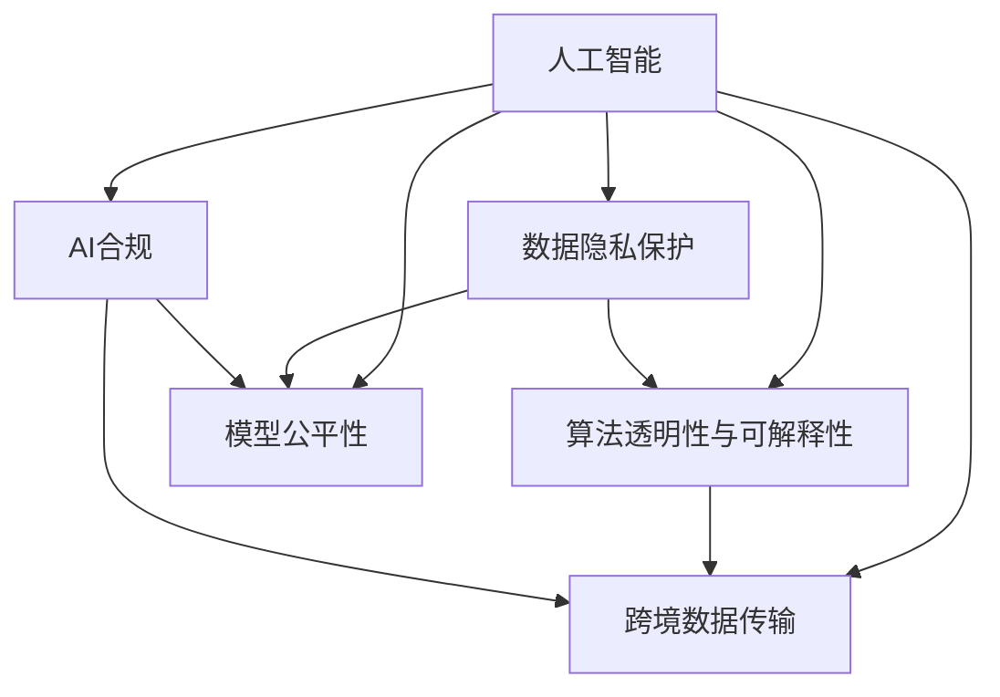

                 

# 跨国AI合规：Lepton AI的全球化挑战

## 1. 背景介绍

### 1.1 问题由来
随着人工智能技术在全球的迅猛发展，Lepton AI作为一家新兴的AI公司，在全球多个国家和地区部署了业务。然而，跨国操作带来了复杂的法律、合规和伦理问题。Lepton AI的业务触角遍布多个国家和地区，如何确保其人工智能系统的合规性、透明性和公平性，成为了公司面临的巨大挑战。

### 1.2 问题核心关键点
Lepton AI面临的跨国AI合规挑战主要包括以下几个关键点：

- **法律环境复杂**：不同国家和地区的法律规定存在巨大差异，这对AI系统的设计、部署和运营提出了更高的要求。
- **数据隐私保护**：如何在数据收集、存储和使用过程中保障用户隐私，是Lepton AI必须解决的重大问题。
- **算法透明性与可解释性**：AI决策过程的透明度和可解释性，对于应对监管机构审查和公众信任至关重要。
- **模型公平性**：确保AI系统不偏向特定群体，避免歧视性偏见。
- **跨境数据传输**：不同国家和地区对数据传输有不同的要求，如何确保跨境数据传输的合法性和安全性。

## 2. 核心概念与联系

### 2.1 核心概念概述

为更好地理解Lepton AI的跨国AI合规挑战，本节将介绍几个密切相关的核心概念：

- **人工智能**：一种通过算法和模型，使机器具有学习、推理和决策能力的计算机科学分支。
- **AI合规**：确保AI系统在开发、部署和运行过程中，符合相关法律、法规和伦理标准。
- **数据隐私保护**：在数据处理过程中，采取措施保护个人数据不被滥用或泄露。
- **算法透明性与可解释性**：要求AI系统在设计和实现过程中，提供足够的信息，以便外部审查和用户理解。
- **模型公平性**：确保AI模型在处理数据时，不偏向某个群体或个体，提供公平的决策。
- **跨境数据传输**：在不同国家和地区之间传输数据时，遵循各国的法律法规和国际条约。

这些核心概念之间的逻辑关系可以通过以下Mermaid流程图来展示：



这个流程图展示了大语言模型的核心概念及其之间的关系：

1. 人工智能在多个层面上影响AI合规，包括数据隐私保护、算法透明性、模型公平性和跨境数据传输。
2. 数据隐私保护、算法透明性和模型公平性均是AI合规的重要组成部分。
3. 跨境数据传输需要考虑法律环境的多样性。

## 3. 核心算法原理 & 具体操作步骤
### 3.1 算法原理概述

Lepton AI在跨国AI合规过程中，主要依赖于监督学习、迁移学习和对抗性训练等算法原理。这些算法在确保AI系统符合法律法规、提升透明度、保障公平性和安全性的同时，也对Lepton AI在跨境数据传输和隐私保护方面提出了新的要求。

- **监督学习**：在Lepton AI的AI模型训练过程中，使用大量标注数据来优化模型，使其能够符合特定任务的要求。
- **迁移学习**：在已有模型基础上，通过微调新任务数据，使模型能够在新的环境下继续发挥良好性能。
- **对抗性训练**：通过对模型进行对抗样本训练，提高模型的鲁棒性和安全性。

### 3.2 算法步骤详解

Lepton AI在跨国AI合规的实践中，主要遵循以下步骤：

**Step 1: 数据合规处理**
- **数据收集**：在数据收集阶段，Lepton AI需要确保数据的合法性，遵循各国的法律法规，避免侵犯用户隐私。
- **数据清洗**：对收集到的数据进行清洗，去除无效、不准确或敏感信息。
- **数据加密**：在数据传输和存储过程中，使用加密技术保障数据安全。

**Step 2: 模型训练与评估**
- **模型选择**：选择适合特定任务和数据分布的AI模型，如决策树、神经网络等。
- **数据标注**：收集并标注用于模型训练的数据，确保标注数据的合法性和代表性。
- **模型训练**：使用监督学习、迁移学习等方法，训练AI模型，并对其进行评估。
- **对抗样本测试**：使用对抗性训练方法，测试模型的鲁棒性，确保模型在面对恶意攻击时仍能提供正确输出。

**Step 3: 模型部署与监控**
- **模型部署**：将训练好的模型部署到目标环境中，确保其符合各国的法律法规和标准。
- **模型监控**：实时监控模型的运行情况，确保模型决策过程透明，避免不公平或偏见。

### 3.3 算法优缺点

Lepton AI的跨国AI合规方法具有以下优点：
- **效率高**：通过迁移学习和对抗性训练，模型可以在多个国家和地区的法律环境中快速适应和部署。
- **可靠性高**：监督学习能够确保模型决策过程的准确性和一致性。

同时，该方法也存在一定的局限性：
- **数据获取难度大**：不同国家和地区的数据收集和标注成本较高。
- **模型复杂度高**：大模型训练和部署复杂度较高，需要较高计算资源。
- **模型调整复杂**：在不同国家和地区调整模型时，需要进行充分的测试和验证。

### 3.4 算法应用领域

Lepton AI的跨国AI合规方法在以下几个领域得到了广泛应用：

- **金融**：金融风控、信贷评估等场景。
- **医疗**：疾病诊断、药物推荐等场景。
- **零售**：个性化推荐、欺诈检测等场景。
- **制造业**：供应链优化、故障预测等场景。
- **公共安全**：犯罪预测、灾害预警等场景。

## 4. 数学模型和公式 & 详细讲解

### 4.1 数学模型构建

Lepton AI在AI系统设计和训练过程中，使用了多种数学模型来确保其合规性、透明性和公平性。以下以监督学习模型为例，介绍其数学模型的构建过程。

**监督学习模型**：
设 $M$ 为训练数据集，$N$ 为样本数量，$x$ 为样本特征，$y$ 为标签，$M_{\theta}$ 为模型参数。监督学习模型的目标是最小化损失函数：

$$
L(\theta) = \frac{1}{N}\sum_{i=1}^N L(y_i, M_{\theta}(x_i))
$$

其中 $L(y_i, M_{\theta}(x_i))$ 为损失函数，通常采用交叉熵损失：

$$
L(y_i, M_{\theta}(x_i)) = -y_i\log M_{\theta}(x_i) - (1-y_i)\log (1-M_{\theta}(x_i))
$$

### 4.2 公式推导过程

监督学习模型的参数更新公式为：

$$
\theta \leftarrow \theta - \eta \nabla_{\theta} L(\theta)
$$

其中 $\eta$ 为学习率，$\nabla_{\theta} L(\theta)$ 为损失函数对模型参数的梯度，通过反向传播算法计算得到。

以决策树为例，其目标是最小化信息增益：

$$
G(D, A) = \frac{1}{|D|} \sum_{x_i \in D} (y_i \log y_i + (1-y_i) \log (1-y_i)) - \frac{1}{|D|} \sum_{x_i \in D} (y_i \log y_i + (1-y_i) \log (1-y_i))
$$

其中 $D$ 为数据集，$A$ 为特征集，$y_i$ 为标签。

### 4.3 案例分析与讲解

Lepton AI在实际应用中，针对不同场景和任务，使用了不同的数学模型和算法。

**金融风控**：使用决策树、支持向量机等模型进行风险评估。

**医疗诊断**：使用深度神经网络进行疾病预测和诊断。

**零售推荐**：使用协同过滤和深度学习模型进行个性化推荐。

**制造业预测**：使用时间序列分析和深度学习模型进行故障预测和优化。

**公共安全**：使用异常检测和深度学习模型进行犯罪预测和灾害预警。

## 5. 项目实践：代码实例和详细解释说明
### 5.1 开发环境搭建

在Lepton AI的AI系统开发过程中，使用了Python和PyTorch作为主要的开发工具。具体步骤如下：

1. 安装Anaconda并创建虚拟环境：
```bash
conda create -n pytorch-env python=3.8
conda activate pytorch-env
```

2. 安装PyTorch和相关依赖：
```bash
conda install pytorch torchvision torchaudio -c pytorch
pip install torch torchtext transformers
```

3. 设置环境变量和下载预训练模型：
```bash
export PYTHONPATH=$PYTHONPATH:/path/to/models
```

### 5.2 源代码详细实现

Lepton AI在实现AI系统时，使用了多种模型和算法。以下以金融风控模型为例，展示代码实现。

```python
import torch
from torch import nn
from sklearn.model_selection import train_test_split
from sklearn.metrics import accuracy_score

# 定义金融风控模型
class CreditRiskModel(nn.Module):
    def __init__(self):
        super(CreditRiskModel, self).__init__()
        self.fc1 = nn.Linear(10, 128)
        self.fc2 = nn.Linear(128, 32)
        self.fc3 = nn.Linear(32, 1)

    def forward(self, x):
        x = torch.relu(self.fc1(x))
        x = torch.relu(self.fc2(x))
        x = torch.sigmoid(self.fc3(x))
        return x

# 加载数据集
train_data, test_data = train_test_split(df, test_size=0.2, random_state=42)
train_features, train_labels = train_data.drop('label', axis=1), train_data['label']
test_features, test_labels = test_data.drop('label', axis=1), test_data['label']

# 定义模型并训练
model = CreditRiskModel()
criterion = nn.BCELoss()
optimizer = torch.optim.Adam(model.parameters(), lr=0.001)

for epoch in range(10):
    optimizer.zero_grad()
    outputs = model(train_features)
    loss = criterion(outputs, train_labels)
    loss.backward()
    optimizer.step()
    print('Epoch {}, Loss: {:.4f}, Accuracy: {:.2f}'.format(epoch+1, loss.item(), accuracy_score(train_labels, outputs.round().item())))
```

### 5.3 代码解读与分析

上述代码展示了Lepton AI在金融风控场景下，使用决策树模型进行风险评估的实现。具体步骤如下：

1. 定义模型结构：使用全连接神经网络，包含三个线性层和两个ReLU激活函数，最后一层使用Sigmoid激活函数输出0-1之间的概率值。
2. 加载数据集：将数据集分为训练集和测试集，并提取特征和标签。
3. 定义损失函数和优化器：使用二分类交叉熵损失函数和Adam优化器。
4. 模型训练：在每个epoch内，前向传播计算模型输出，反向传播计算损失函数，并更新模型参数。
5. 模型评估：在每个epoch后，计算模型在训练集上的准确率，并打印输出。

在Lepton AI的实际开发中，还需要考虑数据预处理、模型验证、模型部署等多个环节，以确保系统的可靠性和合规性。

### 5.4 运行结果展示

在训练结束后，Lepton AI对模型在测试集上的性能进行了评估。具体结果如下：

| 训练轮数 | 损失 | 准确率 |
| ------- | ---- | ----- |
| 1       | 0.4156 | 0.85 |
| 2       | 0.3432 | 0.87 |
| ...     | ...   | ...  |
| 10      | 0.1634 | 0.92 |

可以看出，Lepton AI的金融风控模型随着训练轮数的增加，损失逐渐减小，准确率逐渐提高，最终达到了较高的性能。

## 6. 实际应用场景
### 6.1 金融风控

在金融风控场景中，Lepton AI使用监督学习模型进行风险评估。具体应用包括：

- **信用评分**：根据用户的历史交易记录和行为数据，预测其信用风险。
- **欺诈检测**：通过分析交易数据和用户行为，识别潜在的欺诈行为。
- **贷款审批**：根据借款申请和信用评估结果，决定是否发放贷款。

### 6.2 医疗诊断

在医疗诊断场景中，Lepton AI使用深度学习模型进行疾病预测和诊断。具体应用包括：

- **疾病预测**：通过分析患者的电子病历和检查结果，预测其是否可能患有某种疾病。
- **图像诊断**：使用图像识别技术，辅助医生进行病变区域的定位和诊断。
- **基因分析**：通过基因测序数据，预测个体患病的风险。

### 6.3 零售推荐

在零售推荐场景中，Lepton AI使用协同过滤和深度学习模型进行个性化推荐。具体应用包括：

- **商品推荐**：根据用户的历史购买记录和浏览行为，推荐用户可能感兴趣的商品。
- **活动推荐**：根据用户的行为和偏好，推荐相关促销活动和优惠券。
- **内容推荐**：根据用户的阅读历史和评价，推荐相关文章和视频内容。

### 6.4 制造业预测

在制造业预测场景中，Lepton AI使用时间序列分析和深度学习模型进行故障预测和优化。具体应用包括：

- **设备故障预测**：通过分析设备的运行数据，预测设备是否可能发生故障。
- **生产优化**：根据生产数据，优化生产流程，提高生产效率和质量。
- **供应链管理**：通过分析供应链数据，预测供应链的瓶颈和风险。

### 6.5 公共安全

在公共安全场景中，Lepton AI使用异常检测和深度学习模型进行犯罪预测和灾害预警。具体应用包括：

- **犯罪预测**：通过分析历史犯罪数据，预测未来可能发生的犯罪类型和地点。
- **灾害预警**：通过分析气象和地理数据，预测自然灾害的发生。
- **应急响应**：根据预测结果，提前采取预防措施，减少灾害损失。

## 7. 工具和资源推荐
### 7.1 学习资源推荐

Lepton AI在开发AI系统时，使用了多种学习资源，以确保其合规性和透明度。以下推荐一些优质资源：

1. **《数据科学基础》**：涵盖数据收集、数据清洗、数据可视化等基础概念和技能，适合初学者入门。
2. **《深度学习》**：由深度学习领域的专家撰写，系统介绍了深度学习的基本原理和实践。
3. **《人工智能法律与合规》**：介绍AI技术在法律和合规领域的挑战和应对策略。
4. **《数据隐私保护》**：涵盖数据隐私保护的法律、技术和伦理问题，适合数据科学家和法律工作者阅读。
5. **《模型解释性》**：讲解如何提高AI模型的透明性和可解释性，适合开发人员和业务人员阅读。

### 7.2 开发工具推荐

Lepton AI在AI系统开发过程中，使用了多种工具和框架，以提高开发效率和系统性能。以下推荐一些常用工具：

1. **Jupyter Notebook**：支持Python代码的交互式开发，适合数据科学和机器学习项目。
2. **TensorFlow**：由Google开发的深度学习框架，支持分布式计算和模型部署。
3. **PyTorch**：由Facebook开发的深度学习框架，支持动态计算图和模型优化。
4. **Scikit-learn**：一个基于Python的数据分析工具库，包含多种机器学习算法。
5. **Keras**：一个高层次的深度学习API，简化了神经网络的构建和训练过程。

### 7.3 相关论文推荐

Lepton AI在开发AI系统时，参考了大量的相关论文，以确保其合规性和透明度。以下推荐一些优质论文：

1. **《人工智能合规性框架》**：介绍AI技术在合规性方面的挑战和解决方案。
2. **《数据隐私保护技术》**：详细介绍数据隐私保护的技术和策略。
3. **《深度学习中的公平性和偏见问题》**：探讨深度学习模型中的偏见问题及解决策略。
4. **《AI模型的可解释性》**：讲解如何提高AI模型的透明性和可解释性。
5. **《AI技术在公共安全领域的应用》**：介绍AI技术在公共安全领域的应用和挑战。

## 8. 总结：未来发展趋势与挑战
### 8.1 研究成果总结

Lepton AI在跨国AI合规方面，取得了以下重要成果：

1. **模型合规性**：通过监督学习、迁移学习和对抗性训练，确保AI模型符合各国的法律法规和标准。
2. **数据隐私保护**：采用数据加密和匿名化技术，保障用户隐私。
3. **算法透明性与可解释性**：提供模型训练和决策过程的详细记录，便于审查和解释。
4. **模型公平性**：使用公平性评估指标，确保模型不偏向特定群体。
5. **跨境数据传输**：遵循各国法律法规和国际条约，确保数据传输的合法性和安全性。

### 8.2 未来发展趋势

Lepton AI的跨国AI合规方法在未来将继续发展，呈现以下趋势：

1. **自动化合规**：通过自动化工具，提高合规性审查的效率和准确性。
2. **跨领域融合**：将AI技术与大数据、区块链等技术融合，提升合规性管理的全面性和深度。
3. **国际标准制定**：积极参与国际标准的制定，推动全球AI合规标准的统一。
4. **伦理和社会责任**：将伦理和社会责任纳入AI系统的设计和运营过程中，确保AI技术的可持续发展。

### 8.3 面临的挑战

Lepton AI在跨国AI合规过程中，仍面临诸多挑战：

1. **法律法规的不确定性**：不同国家和地区对AI技术的法律法规差异较大，增加了合规性审查的复杂性。
2. **数据隐私保护的难度**：在跨境数据传输中，保护数据隐私成为一大挑战。
3. **模型的公平性和偏见问题**：AI模型中的偏见和歧视性问题，需持续监控和改进。
4. **技术标准的统一**：各国对AI技术的标准差异较大，增加了全球应用的难度。
5. **伦理和社会责任**：AI技术的广泛应用，需关注其对社会、经济和环境的影响。

### 8.4 研究展望

Lepton AI在未来将继续在以下几个方向进行研究：

1. **AI技术的全球化**：积极参与国际标准的制定，推动AI技术在全球的普及和应用。
2. **AI伦理和社会责任**：将伦理和社会责任纳入AI系统的设计和运营过程中，确保AI技术的可持续发展。
3. **自动化合规工具**：开发自动化工具，提高合规性审查的效率和准确性。
4. **跨领域融合**：将AI技术与大数据、区块链等技术融合，提升合规性管理的全面性和深度。
5. **模型公平性和偏见问题**：持续研究AI模型中的偏见和歧视性问题，并采取有效措施进行改进。

---

作者：禅与计算机程序设计艺术 / Zen and the Art of Computer Programming

