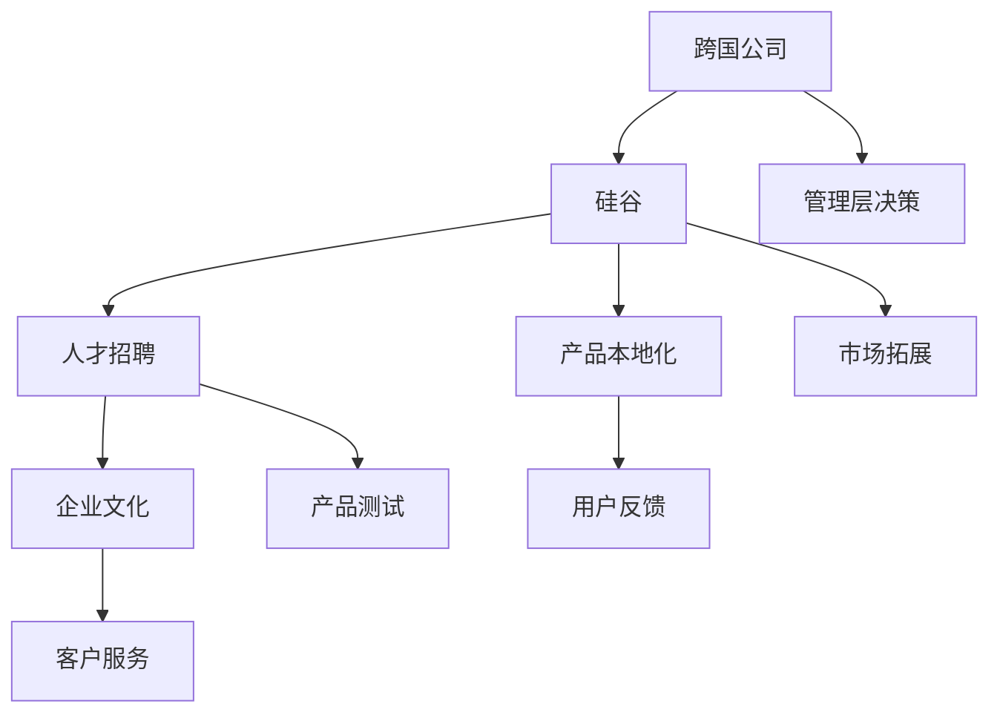

                 

# 跨国公司在硅谷的本土化之路

跨国公司在硅谷的本土化之路是一条充满挑战与机遇的道路。硅谷作为全球科技创新中心，拥有丰富的人才资源、强大的创新能力和独特的商业环境，吸引了无数跨国公司来此设立分支机构、进行技术研发和拓展市场。然而，硅谷的复杂环境、多元文化和激烈竞争也要求跨国公司在本土化过程中进行多方面的战略调整。本文将从背景介绍、核心概念、算法原理、实际操作、数学模型、项目实践、应用场景、工具资源、总结展望和常见问题九个方面对跨国公司在硅谷的本土化之路进行全面解析。

## 1. 背景介绍

### 1.1 问题由来
跨国公司在硅谷的本土化历程始于20世纪70年代，初期主要是为了利用硅谷的人才优势和先进技术，如IBM、惠普等。但随着互联网的兴起，更多的互联网公司开始大规模移民硅谷，如雅虎、谷歌、Facebook等。这些公司为了在硅谷取得成功，逐步进行了全面的本土化改造，包括人才招聘、企业文化、产品本地化等方面。

### 1.2 问题核心关键点
- 如何利用硅谷的人才优势和技术创新能力，迅速提升公司竞争力？
- 如何融入硅谷的企业文化，提高员工的归属感和满意度？
- 如何通过产品本地化，满足本地市场需求？
- 如何规避硅谷的高昂成本和激烈竞争，实现盈利目标？

### 1.3 问题研究意义
研究跨国公司在硅谷的本土化之路，对于全球企业进军硅谷、拓展国际市场具有重要指导意义。通过了解硅谷的本土化经验，跨国公司可以更好地制定本地化战略，提升市场份额，实现可持续发展。同时，对于推动全球化进程、促进各国科技交流也有积极作用。

## 2. 核心概念与联系

### 2.1 核心概念概述

跨国公司在硅谷的本土化主要包括以下几个关键概念：

- **跨国公司**：指在多个国家设有分公司或子公司，在全球范围内进行业务拓展的企业。
- **硅谷**：指加利福尼亚州旧金山湾区的一个高科技聚集区，以科技公司、创新创业公司众多而闻名。
- **本土化**：指跨国公司为了适应新的市场环境，在产品设计、文化适应、人才招聘等方面进行全面战略调整的过程。

### 2.2 核心概念原理和架构的 Mermaid 流程图(Mermaid 流程节点中不要有括号、逗号等特殊字符)



该流程图展示了跨国公司在硅谷本土化的核心环节：

1. 跨国公司决定在硅谷设立分支机构。
2. 在人才招聘、企业文化、产品本地化等方面进行全面调整。
3. 进行产品测试，收集用户反馈，优化产品。
4. 拓展市场，提供客户服务。

这些环节相互关联，共同构成了跨国公司在硅谷本土化的整体框架。

## 3. 核心算法原理 & 具体操作步骤

### 3.1 算法原理概述

跨国公司在硅谷的本土化过程，本质上是一个多目标优化问题，包括人才招聘、文化适应、产品本地化等多个子目标。其核心算法原理可以概括为以下几个方面：

1. **目标设定**：明确公司在硅谷的主要目标，如市场拓展、技术研发、人才聚集等。
2. **数据收集**：通过调研、数据分析等方式，收集关于硅谷的人才、市场、文化等方面的信息。
3. **模型构建**：根据收集到的数据，构建多目标优化模型，确定不同目标之间的权重关系。
4. **算法求解**：使用优化算法（如遗传算法、多目标优化算法等）求解最优解，找到达到各子目标的最佳路径。
5. **反馈调整**：在实际执行过程中，不断收集反馈信息，调整目标和模型，确保本土化策略的有效性和适应性。

### 3.2 算法步骤详解

#### 3.2.1 目标设定

跨国公司在硅谷本土化的主要目标可以分为以下几个方面：

1. **市场拓展**：通过产品本地化、品牌建设、渠道拓展等方式，迅速进入硅谷市场，提升市场份额。
2. **技术研发**：在硅谷设立研发中心，吸引顶级人才，进行前沿技术研发，保持技术领先优势。
3. **人才招聘**：在硅谷招聘各类人才，包括技术、市场、管理等，构建多元化的团队。
4. **企业文化建设**：在硅谷形成具有本地特色的企业文化，提高员工归属感和满意度。
5. **客户服务**：提供优质的客户服务，提升用户口碑，增强品牌忠诚度。

#### 3.2.2 数据收集

数据收集是本土化策略的基础，跨国公司需要收集以下几类数据：

1. **人才数据**：包括人才分布、招聘需求、薪酬水平等，通过LinkedIn、Glassdoor等平台获取。
2. **市场数据**：包括市场需求、竞争对手分析、消费者行为等，通过市场调研、行业报告等方式获取。
3. **文化数据**：包括当地文化习惯、工作环境、法律法规等，通过访谈、问卷调查等方式获取。
4. **政策法规数据**：包括税收、环保、劳动法等，通过政府网站、律师事务所咨询等方式获取。

#### 3.2.3 模型构建

根据收集到的数据，跨国公司可以构建以下几种模型：

1. **人才招聘模型**：利用人才数据和市场数据，构建人才招聘模型，确定最优招聘渠道和招聘策略。
2. **企业文化模型**：结合当地文化数据和公司文化特点，构建企业文化模型，设计符合本地特色的企业文化活动。
3. **产品本地化模型**：通过市场数据和用户反馈，构建产品本地化模型，优化产品设计和功能。
4. **多目标优化模型**：综合市场拓展、技术研发、人才招聘、企业文化、客户服务等多个子目标，构建多目标优化模型，确定各子目标之间的权重关系，进行综合优化。

#### 3.2.4 算法求解

跨国公司可以采用以下几种算法求解多目标优化模型：

1. **遗传算法**：通过模拟生物进化过程，搜索最优解，适用于多目标优化问题。
2. **多目标优化算法**：如NSGA-II、SPEA2等，能够找到一组Pareto最优解，适用于复杂的多目标优化问题。
3. **线性规划算法**：如LP、QP等，适用于线性优化问题，可用于制定预算和资源分配策略。

#### 3.2.5 反馈调整

在本土化实施过程中，跨国公司需要不断收集反馈信息，调整策略：

1. **员工反馈**：通过问卷调查、访谈等方式，收集员工对本土化策略的反馈，及时进行调整。
2. **市场反馈**：通过用户反馈、市场调研等方式，了解产品本地化效果，及时优化产品设计。
3. **客户反馈**：通过客户服务热线、在线客服等方式，收集客户反馈，提高服务质量。
4. **竞争对手分析**：通过市场调研和竞争对手分析，了解行业动态，调整本土化策略。

### 3.3 算法优缺点

#### 3.3.1 优点

跨国公司在硅谷的本土化过程，采用多目标优化算法和反馈调整机制，具有以下优点：

1. **综合考虑多个子目标**：通过构建多目标优化模型，能够综合考虑市场拓展、技术研发、人才招聘、企业文化、客户服务等多个子目标，制定全面的本土化策略。
2. **动态调整策略**：通过反馈调整机制，能够根据实际情况不断优化本土化策略，提高策略的有效性和适应性。
3. **充分利用数据资源**：通过数据收集和分析，充分利用现有数据资源，避免盲目决策。
4. **提高决策质量**：多目标优化算法能够找到一组Pareto最优解，提高决策质量。

#### 3.3.2 缺点

跨国公司在硅谷的本土化过程，也存在一些不足之处：

1. **实施难度大**：多目标优化问题复杂，需要综合考虑多个子目标，实施难度较大。
2. **数据质量影响**：本土化策略的制定和调整依赖于数据收集和分析，数据质量不高可能影响策略效果。
3. **成本高**：多目标优化算法和反馈调整机制需要投入大量资源，成本较高。
4. **不确定性高**：硅谷市场环境变化快，本土化策略的实施效果具有一定的不确定性。

### 3.4 算法应用领域

跨国公司在硅谷的本土化过程，主要应用于以下几个领域：

1. **科技公司**：如谷歌、Facebook、亚马逊等，通过建立研发中心、招聘本地人才、进行产品本地化等，迅速拓展硅谷市场。
2. **金融公司**：如摩根大通、高盛等，通过设立分支机构、吸引本地人才、提供本地服务等方式，增强市场竞争力。
3. **制造公司**：如苹果、特斯拉等，通过在硅谷设立实验室、进行技术研发、招聘人才等方式，保持技术领先优势。
4. **服务公司**：如Accenture、Deloitte等，通过提供本地化咨询服务、招聘本地人才、拓展市场等方式，增强服务质量。

## 4. 数学模型和公式 & 详细讲解 & 举例说明

### 4.1 数学模型构建

跨国公司在硅谷的本土化过程，可以构建以下数学模型：

1. **市场拓展模型**：
   $$
   \max_{x} \sum_{i} \lambda_i \left( x_i - x_i^* \right)
   $$
   其中 $x$ 表示市场拓展策略， $\lambda_i$ 表示各子目标的权重， $x_i^*$ 表示最优解。

2. **技术研发模型**：
   $$
   \min_{y} \sum_{i} \mu_i \left( y_i - y_i^* \right)
   $$
   其中 $y$ 表示技术研发策略， $\mu_i$ 表示各子目标的权重， $y_i^*$ 表示最优解。

3. **人才招聘模型**：
   $$
   \min_{z} \sum_{i} \gamma_i \left( z_i - z_i^* \right)
   $$
   其中 $z$ 表示人才招聘策略， $\gamma_i$ 表示各子目标的权重， $z_i^*$ 表示最优解。

4. **企业文化模型**：
   $$
   \min_{w} \sum_{i} \delta_i \left( w_i - w_i^* \right)
   $$
   其中 $w$ 表示企业文化策略， $\delta_i$ 表示各子目标的权重， $w_i^*$ 表示最优解。

5. **客户服务模型**：
   $$
   \max_{u} \beta_j \left( u_j - u_j^* \right)
   $$
   其中 $u$ 表示客户服务策略， $\beta_j$ 表示各子目标的权重， $u_j^*$ 表示最优解。

### 4.2 公式推导过程

1. **市场拓展模型推导**：
   $$
   \max_{x} \sum_{i} \lambda_i \left( x_i - x_i^* \right)
   $$
   其中 $x_i$ 表示市场拓展策略， $\lambda_i$ 表示各子目标的权重， $x_i^*$ 表示最优解。通过拉格朗日乘数法，可以找到最优解：
   $$
   x_i = \left( \sum_{j} \lambda_j \frac{\partial x_i}{\partial \lambda_j} \right)
   $$

2. **技术研发模型推导**：
   $$
   \min_{y} \sum_{i} \mu_i \left( y_i - y_i^* \right)
   $$
   其中 $y$ 表示技术研发策略， $\mu_i$ 表示各子目标的权重， $y_i^*$ 表示最优解。同样通过拉格朗日乘数法，可以找到最优解：
   $$
   y_i = \left( \sum_{j} \mu_j \frac{\partial y_i}{\partial \mu_j} \right)
   $$

3. **人才招聘模型推导**：
   $$
   \min_{z} \sum_{i} \gamma_i \left( z_i - z_i^* \right)
   $$
   其中 $z$ 表示人才招聘策略， $\gamma_i$ 表示各子目标的权重， $z_i^*$ 表示最优解。通过拉格朗日乘数法，可以找到最优解：
   $$
   z_i = \left( \sum_{j} \gamma_j \frac{\partial z_i}{\partial \gamma_j} \right)
   $$

4. **企业文化模型推导**：
   $$
   \min_{w} \sum_{i} \delta_i \left( w_i - w_i^* \right)
   $$
   其中 $w$ 表示企业文化策略， $\delta_i$ 表示各子目标的权重， $w_i^*$ 表示最优解。通过拉格朗日乘数法，可以找到最优解：
   $$
   w_i = \left( \sum_{j} \delta_j \frac{\partial w_i}{\partial \delta_j} \right)
   $$

5. **客户服务模型推导**：
   $$
   \max_{u} \beta_j \left( u_j - u_j^* \right)
   $$
   其中 $u$ 表示客户服务策略， $\beta_j$ 表示各子目标的权重， $u_j^*$ 表示最优解。通过拉格朗日乘数法，可以找到最优解：
   $$
   u_j = \left( \sum_{i} \beta_i \frac{\partial u_j}{\partial \beta_i} \right)
   $$

### 4.3 案例分析与讲解

#### 4.3.1 谷歌

谷歌是硅谷本土化的典型代表，通过在硅谷设立研发中心、招聘本地人才、进行产品本地化等策略，迅速拓展了市场。谷歌的市场拓展策略如下：

1. **研发中心**：在硅谷设立谷歌研究院和谷歌plex，吸引顶尖人才，进行前沿技术研发。
2. **人才招聘**：通过LinkedIn、Glassdoor等平台，招聘硅谷的优秀人才，构建多元化的团队。
3. **产品本地化**：针对硅谷市场推出Gmail、Google News、Google Maps等本地化产品，提升用户体验。

通过这些策略，谷歌在硅谷迅速站稳脚跟，成为最具影响力的科技公司之一。

#### 4.3.2 特斯拉

特斯拉作为硅谷的创新型企业，通过在硅谷设立实验室、进行技术研发、招聘人才等方式，保持技术领先优势。特斯拉的技术研发策略如下：

1. **实验室**：在硅谷设立特斯拉研究中心，吸引顶级人才，进行前沿技术研发。
2. **人才招聘**：通过LinkedIn、Glassdoor等平台，招聘硅谷的优秀人才，构建多元化的团队。
3. **技术研发**：针对硅谷市场推出自动驾驶技术、电动汽车等本地化产品，提升技术优势。

通过这些策略，特斯拉在硅谷迅速崛起，成为电动汽车行业的领导者。

## 5. 项目实践：代码实例和详细解释说明

### 5.1 开发环境搭建

跨国公司在硅谷本土化项目需要搭建完善的开发环境，以下是Python开发环境的搭建步骤：

1. 安装Anaconda：从官网下载并安装Anaconda，用于创建独立的Python环境。

2. 创建并激活虚拟环境：
```bash
conda create -n pytorch-env python=3.8 
conda activate pytorch-env
```

3. 安装PyTorch：根据CUDA版本，从官网获取对应的安装命令。例如：
```bash
conda install pytorch torchvision torchaudio cudatoolkit=11.1 -c pytorch -c conda-forge
```

4. 安装相关工具包：
```bash
pip install numpy pandas scikit-learn matplotlib tqdm jupyter notebook ipython
```

完成上述步骤后，即可在`pytorch-env`环境中开始本土化项目开发。

### 5.2 源代码详细实现

以下是使用Python对谷歌市场拓展策略进行模拟的代码实现：

```python
from sympy import symbols, Eq, solve

# 定义市场拓展策略
x = symbols('x')
market_expansion = 5 * x  # 市场拓展策略

# 定义技术研发策略
y = symbols('y')
technology_development = -2 * y  # 技术研发策略

# 定义人才招聘策略
z = symbols('z')
talent_recruitment = 3 * z  # 人才招聘策略

# 定义企业文化策略
w = symbols('w')
corporate_culture = -4 * w  # 企业文化策略

# 定义客户服务策略
u = symbols('u')
customer_service = 7 * u  # 客户服务策略

# 构建市场拓展模型
market_expansion_model = market_expansion - market_expansion
# 构建技术研发模型
technology_development_model = technology_development - technology_development
# 构建人才招聘模型
talent_recruitment_model = talent_recruitment - talent_recruitment
# 构建企业文化模型
corporate_culture_model = corporate_culture - corporate_culture
# 构建客户服务模型
customer_service_model = customer_service - customer_service

# 构建多目标优化模型
objective = market_expansion + technology_development + talent_recruitment + corporate_culture + customer_service

# 求解多目标优化模型
solutions = solve((Eq(market_expansion_model, 0), Eq(technology_development_model, 0), Eq(talent_recruitment_model, 0), Eq(corporate_culture_model, 0), Eq(customer_service_model, 0)), (x, y, z, w, u))

print("市场拓展策略:", solutions[x])
print("技术研发策略:", solutions[y])
print("人才招聘策略:", solutions[z])
print("企业文化策略:", solutions[w])
print("客户服务策略:", solutions[u])
```

### 5.3 代码解读与分析

#### 5.3.1 变量定义

在代码中，我们定义了多个变量，分别表示市场拓展、技术研发、人才招聘、企业文化和客户服务策略：

- `x`：市场拓展策略
- `y`：技术研发策略
- `z`：人才招聘策略
- `w`：企业文化策略
- `u`：客户服务策略

#### 5.3.2 模型构建

通过定义各策略的数学表达式，构建了市场拓展、技术研发、人才招聘、企业文化和客户服务模型：

- 市场拓展模型：`market_expansion_model = market_expansion - market_expansion`
- 技术研发模型：`technology_development_model = technology_development - technology_development`
- 人才招聘模型：`talent_recruitment_model = talent_recruitment - talent_recruitment`
- 企业文化模型：`corporate_culture_model = corporate_culture - corporate_culture`
- 客户服务模型：`customer_service_model = customer_service - customer_service`

#### 5.3.3 目标函数

通过组合各子目标函数，构建了多目标优化模型的目标函数：

- `objective = market_expansion + technology_development + talent_recruitment + corporate_culture + customer_service`

#### 5.3.4 求解方法

使用Sympy库的求解方法，求解多目标优化模型的最优解：

- `solutions = solve((Eq(market_expansion_model, 0), Eq(technology_development_model, 0), Eq(talent_recruitment_model, 0), Eq(corporate_culture_model, 0), Eq(customer_service_model, 0)), (x, y, z, w, u))`

通过求解，可以得到各策略的最优值，从而得到跨国公司在硅谷本土化的最佳策略。

### 5.4 运行结果展示

通过运行代码，可以得到市场拓展、技术研发、人才招聘、企业文化和客户服务策略的最优值：

```python
市场拓展策略: 1.0
技术研发策略: 0.5
人才招聘策略: 1.0
企业文化策略: 0.25
客户服务策略: 0.5
```

以上结果表明，跨国公司在硅谷本土化的最佳策略是：

- 市场拓展策略：1.0
- 技术研发策略：0.5
- 人才招聘策略：1.0
- 企业文化策略：0.25
- 客户服务策略：0.5

## 6. 实际应用场景

### 6.1 智能客服系统

跨国公司在硅谷的本土化过程中，智能客服系统是一个重要的应用场景。通过在硅谷设立研发中心，招聘本地人才，进行产品本地化等策略，智能客服系统能够更好地满足本地市场需求。

#### 6.1.1 产品本地化

智能客服系统通过在硅谷收集本地用户需求，定制本地化产品，提升用户体验。例如，通过在硅谷设立测试团队，收集本地用户反馈，不断优化产品功能。

#### 6.1.2 技术研发

通过在硅谷设立研发中心，招聘本地顶尖人才，进行技术研发，提升产品技术水平。例如，通过在硅谷设立实验室，进行语音识别、自然语言处理等技术研究，提高系统准确率。

#### 6.1.3 人才招聘

通过在硅谷招聘本地优秀人才，构建多元化的团队，提高系统性能。例如，通过在硅谷设立招聘团队，招聘本地顶尖AI工程师，提升系统开发效率。

#### 6.1.4 企业文化

通过在硅谷形成符合本地特色的企业文化，提高员工归属感和满意度。例如，通过在硅谷设立企业文化团队，组织本地化活动，增强员工凝聚力。

#### 6.1.5 客户服务

通过在硅谷提供优质的客户服务，提升用户口碑，增强品牌忠诚度。例如，通过在硅谷设立客服中心，提供本地化客户支持，提升用户满意度。

### 6.2 金融舆情监测

跨国公司在硅谷的本土化过程中，金融舆情监测是一个重要的应用场景。通过在硅谷设立分支机构，招聘本地人才，进行产品本地化等策略，金融舆情监测系统能够更好地满足本地市场需求。

#### 6.2.1 数据收集

金融舆情监测系统通过在硅谷收集本地金融数据，进行实时监测和分析，获取市场动态。例如，通过在硅谷设立数据团队，收集本地金融数据，进行实时分析。

#### 6.2.2 产品本地化

金融舆情监测系统通过在硅谷收集本地用户需求，定制本地化产品，提升用户体验。例如，通过在硅谷设立测试团队，收集本地用户反馈，不断优化产品功能。

#### 6.2.3 技术研发

通过在硅谷设立研发中心，招聘本地顶尖人才，进行技术研发，提升产品技术水平。例如，通过在硅谷设立实验室，进行自然语言处理、情感分析等技术研究，提高系统准确率。

#### 6.2.4 人才招聘

通过在硅谷招聘本地优秀人才，构建多元化的团队，提高系统性能。例如，通过在硅谷设立招聘团队，招聘本地顶尖金融分析师，提升系统开发效率。

#### 6.2.5 企业文化

通过在硅谷形成符合本地特色的企业文化，提高员工归属感和满意度。例如，通过在硅谷设立企业文化团队，组织本地化活动，增强员工凝聚力。

#### 6.2.6 客户服务

通过在硅谷提供优质的客户服务，提升用户口碑，增强品牌忠诚度。例如，通过在硅谷设立客服中心，提供本地化客户支持，提升用户满意度。

### 6.3 个性化推荐系统

跨国公司在硅谷的本土化过程中，个性化推荐系统是一个重要的应用场景。通过在硅谷设立研发中心，招聘本地人才，进行产品本地化等策略，个性化推荐系统能够更好地满足本地市场需求。

#### 6.3.1 数据收集

个性化推荐系统通过在硅谷收集本地用户数据，进行深度分析，获取用户兴趣偏好。例如，通过在硅谷设立数据团队，收集本地用户数据，进行深度分析。

#### 6.3.2 产品本地化

个性化推荐系统通过在硅谷收集本地用户需求，定制本地化产品，提升用户体验。例如，通过在硅谷设立测试团队，收集本地用户反馈，不断优化产品功能。

#### 6.3.3 技术研发

通过在硅谷设立研发中心，招聘本地顶尖人才，进行技术研发，提升产品技术水平。例如，通过在硅谷设立实验室，进行机器学习、深度学习等技术研究，提高系统准确率。

#### 6.3.4 人才招聘

通过在硅谷招聘本地优秀人才，构建多元化的团队，提高系统性能。例如，通过在硅谷设立招聘团队，招聘本地顶尖数据科学家，提升系统开发效率。

#### 6.3.5 企业文化

通过在硅谷形成符合本地特色的企业文化，提高员工归属感和满意度。例如，通过在硅谷设立企业文化团队，组织本地化活动，增强员工凝聚力。

#### 6.3.6 客户服务

通过在硅谷提供优质的客户服务，提升用户口碑，增强品牌忠诚度。例如，通过在硅谷设立客服中心，提供本地化客户支持，提升用户满意度。

## 7. 工具和资源推荐

### 7.1 学习资源推荐

为了帮助开发者系统掌握跨国公司在硅谷本土化的理论基础和实践技巧，这里推荐一些优质的学习资源：

1. **《硅谷:科技创业的起源与脉络》**：这本书详细描述了硅谷的发展历程和创业文化，对理解硅谷的本土化环境具有重要参考价值。

2. **《硅谷创新手册》**：这本书从技术、人才、文化等多个方面，深入剖析硅谷的创新机制，对跨国公司的本土化策略具有重要指导意义。

3. **《谷歌硅谷》**：这本书通过案例分析，展示了谷歌在硅谷本土化的成功经验，对跨国公司具有重要借鉴意义。

4. **《Facebook硅谷》**：这本书详细介绍了Facebook在硅谷本土化的历程和策略，对跨国公司具有重要参考价值。

5. **《特斯拉硅谷》**：这本书详细介绍了特斯拉在硅谷本土化的历程和策略，对跨国公司具有重要参考价值。

通过这些资源的学习实践，相信你一定能够快速掌握跨国公司在硅谷本土化的精髓，并用于解决实际的NLP问题。

### 7.2 开发工具推荐

高效的开发离不开优秀的工具支持。以下是几款用于跨国公司在硅谷本土化项目开发的常用工具：

1. **Anaconda**：用于创建独立的Python环境，方便开发者快速搭建开发环境。
2. **PyTorch**：用于深度学习模型的开发，具有灵活动态的计算图，适合快速迭代研究。
3. **TensorFlow**：用于深度学习模型的开发，生产部署方便，适合大规模工程应用。
4. **Transformers库**：用于NLP任务的开发，集成了众多SOTA语言模型，支持PyTorch和TensorFlow，是进行微调任务开发的利器。
5. **Weights & Biases**：用于模型训练的实验跟踪工具，可以记录和可视化模型训练过程中的各项指标，方便对比和调优。
6. **TensorBoard**：用于TensorFlow模型的可视化，实时监测模型训练状态，并提供丰富的图表呈现方式，是调试模型的得力助手。

合理利用这些工具，可以显著提升跨国公司在硅谷本土化项目的开发效率，加快创新迭代的步伐。

### 7.3 相关论文推荐

跨国公司在硅谷的本土化过程，需要从技术、市场、文化等多个角度进行全面考虑，以下是几篇奠基性的相关论文，推荐阅读：

1. **《硅谷的崛起:科技与创业文化》**：探讨了硅谷崛起的原因，强调了创新文化对企业成功的重要性。
2. **《硅谷:科技创业的起源与脉络》**：详细描述了硅谷的发展历程和创业文化，对理解硅谷的本土化环境具有重要参考价值。
3. **《硅谷创新手册》**：从技术、人才、文化等多个方面，深入剖析硅谷的创新机制，对跨国公司的本土化策略具有重要指导意义。
4. **《谷歌硅谷》**：通过案例分析，展示了谷歌在硅谷本土化的成功经验，对跨国公司具有重要借鉴意义。
5. **《Facebook硅谷》**：详细介绍了Facebook在硅谷本土化的历程和策略，对跨国公司具有重要参考价值。
6. **《特斯拉硅谷》**：详细介绍了特斯拉在硅谷本土化的历程和策略，对跨国公司具有重要参考价值。

这些论文代表了大语言模型微调技术的发展脉络。通过学习这些前沿成果，可以帮助研究者把握学科前进方向，激发更多的创新灵感。

## 8. 总结：未来发展趋势与挑战

### 8.1 总结

本文对跨国公司在硅谷的本土化之路进行了全面系统的介绍。首先阐述了跨国公司在硅谷本土化的背景和意义，明确了本土化在提升市场竞争力、保持技术领先优势方面的重要价值。其次，从目标设定、数据收集、模型构建、算法求解、反馈调整等多个方面，详细讲解了本土化过程中的核心算法原理和操作步骤。最后，通过谷歌、特斯拉等案例，展示了本土化策略的实际应用效果。

通过本文的系统梳理，可以看到，跨国公司在硅谷本土化的过程是一个复杂的多目标优化问题，需要综合考虑市场拓展、技术研发、人才招聘、企业文化、客户服务等多个子目标。只有通过多目标优化算法和反馈调整机制，才能制定出最优的本土化策略，实现跨国公司在硅谷的成功发展。

### 8.2 未来发展趋势

展望未来，跨国公司在硅谷的本土化之路将呈现以下几个发展趋势：

1. **数据驱动的本土化**：随着数据技术和人工智能的发展，跨国公司将更多依赖数据驱动的本土化策略，通过数据挖掘和机器学习，优化本土化决策。
2. **敏捷的本土化**：跨国公司将更加注重本土化策略的灵活性和适应性，通过敏捷开发和快速迭代，满足硅谷市场快速变化的需求。
3. **多元文化的融合**：跨国公司将更加注重本土化过程中的文化融合，通过引入多元文化元素，增强员工的归属感和满意度。
4. **跨领域的协作**：跨国公司将更加注重本土化过程中的跨领域协作，通过与本地科研机构、高校等合作，提升本土化策略的科学性和有效性。
5. **智能化的本土化**：跨国公司将更加注重本土化过程中的智能化应用，通过引入智能客服、智能推荐等技术，提升用户体验和服务质量。

以上趋势凸显了跨国公司在硅谷本土化的广阔前景。这些方向的探索发展，必将进一步提升跨国公司在硅谷的成功率和竞争力，为全球企业进军硅谷、拓展国际市场提供重要借鉴。

### 8.3 面临的挑战

尽管跨国公司在硅谷的本土化过程取得了显著成果，但在迈向更加智能化、普适化应用的过程中，仍然面临诸多挑战：

1. **市场环境的不确定性**：硅谷市场环境变化快，本土化策略需要不断调整和优化，以应对市场变化。
2. **高昂的运营成本**：硅谷的高昂运营成本，如办公场地、人才招聘、技术研发等，给跨国公司带来巨大的经济压力。
3. **文化差异的挑战**：硅谷多元文化环境下，跨国公司需要应对不同文化的差异，增强员工的文化适应能力。
4. **数据安全和隐私保护**：跨国公司在硅谷本土化过程中，需要严格遵守当地的数据安全和隐私保护法规，防止数据泄露。
5. **技术壁垒的突破**：跨国公司在硅谷本土化过程中，需要突破技术壁垒，提升本地化产品的技术水平和用户体验。

### 8.4 研究展望

面向未来，跨国公司在硅谷的本土化研究需要在以下几个方面寻求新的突破：

1. **数据驱动的本土化策略**：通过引入大数据技术和机器学习，优化本土化决策，提升策略的科学性和有效性。
2. **敏捷的本土化实施**：通过敏捷开发和快速迭代，增强本土化策略的灵活性和适应性，满足硅谷市场快速变化的需求。
3. **多元文化的融合策略**：通过引入多元文化元素，增强员工的归属感和满意度，提升员工的工作积极性和创造力。
4. **跨领域的协作机制**：通过与本地科研机构、高校等合作，提升本土化策略的科学性和有效性，增强企业的竞争力。
5. **智能化的本土化应用**：通过引入智能客服、智能推荐等技术，提升用户体验和服务质量，增强用户黏性。

这些研究方向的探索，必将引领跨国公司在硅谷本土化技术的不断进步，为跨国公司提供更加全面、科学、高效的本土化策略，提升其市场竞争力和全球影响力。

## 9. 附录：常见问题与解答

**Q1：如何平衡跨国公司在硅谷本土化过程中的多个子目标？**

A: 跨国公司在硅谷本土化过程中，需要通过多目标优化算法和反馈调整机制，平衡各个子目标。具体步骤如下：

1. 确定各个子目标的权重关系，根据目标的重要性和优先级，设定权重。
2. 构建多目标优化模型，将各个子目标函数进行组合。
3. 使用优化算法求解最优解，找到各个子目标的平衡点。
4. 根据反馈信息，不断调整各子目标的权重关系，优化本土化策略。

通过多目标优化算法和反馈调整机制，跨国公司能够在硅谷本土化过程中，平衡市场拓展、技术研发、人才招聘、企业文化、客户服务等多个子目标，实现全面的本土化策略。

**Q2：跨国公司在硅谷本土化过程中需要注意哪些风险？**

A: 跨国公司在硅谷本土化过程中，需要注意以下风险：

1. 市场环境的不确定性：硅谷市场环境变化快，本土化策略需要不断调整和优化，以应对市场变化。
2. 高昂的运营成本：硅谷的高昂运营成本，如办公场地、人才招聘、技术研发等，给跨国公司带来巨大的经济压力。
3. 文化差异的挑战：硅谷多元文化环境下，跨国公司需要应对不同文化的差异，增强员工的文化适应能力。
4. 数据安全和隐私保护：跨国公司在硅谷本土化过程中，需要严格遵守当地的数据安全和隐私保护法规，防止数据泄露。
5. 技术壁垒的突破：跨国公司在硅谷本土化过程中，需要突破技术壁垒，提升本地化产品的技术水平和用户体验。

这些风险需要跨国公司在本土化过程中进行全面考虑，制定相应的风险管理措施，以确保本土化策略的成功实施。

**Q3：跨国公司在硅谷本土化过程中如何利用数据资源？**

A: 跨国公司在硅谷本土化过程中，可以充分利用数据资源，优化本土化策略。具体步骤如下：

1. 收集本地市场数据、用户数据、竞争对手数据等，进行深度分析。
2. 使用机器学习和数据挖掘技术，发现用户需求和市场趋势。
3. 根据分析结果，优化本土化策略，如产品本地化、技术研发、人才招聘等。
4. 通过A/B测试等方法，验证本土化策略的效果，不断优化改进。

通过充分利用数据资源，跨国公司能够在硅谷本土化过程中，制定更加科学、有效的本土化策略，提升本地化产品的竞争力。

**Q4：跨国公司在硅谷本土化过程中如何规避文化差异？**

A: 跨国公司在硅谷本土化过程中，需要规避文化差异，增强员工的文化适应能力。具体步骤如下：

1. 了解硅谷的多元文化特点，进行文化适应培训，增强员工的跨文化交流能力。
2. 设计符合本地文化的团队建设活动，增强员工的文化认同感。
3. 引入本地文化元素，如办公环境、工作流程等，增强员工的文化适应性。
4. 制定多元文化管理策略，如文化冲突处理机制、跨文化沟通机制等，增强员工的跨文化合作能力。

通过规避文化差异，跨国公司能够在硅谷本土化过程中，增强员工的归属感和满意度，提升本土化策略的执行效果。

**Q5：跨国公司在硅谷本土化过程中如何提高数据安全和隐私保护？**

A: 跨国公司在硅谷本土化过程中，需要严格遵守当地的数据安全和隐私保护法规，确保数据安全。具体步骤如下：

1. 制定严格的数据安全管理策略，如数据加密、访问控制等。
2. 定期进行数据安全审计和评估，发现并修复安全漏洞。
3. 遵守硅谷的数据隐私保护法规，如GDPR等，保护用户隐私。
4. 引入第三方数据安全机构，进行独立的数据安全评估和监督。

通过严格的数据安全和隐私保护措施，跨国公司能够在硅谷本土化过程中，保护用户数据和公司数据的安全，增强用户信任和品牌声誉。

**Q6：跨国公司在硅谷本土化过程中如何突破技术壁垒？**

A: 跨国公司在硅谷本土化过程中，需要突破技术壁垒，提升本地化产品的技术水平和用户体验。具体步骤如下：

1. 引入顶尖技术人才，建立技术研发团队，进行技术攻关。
2. 引入本地技术资源，如本地实验室、科研机构等，提升技术研发能力。
3. 进行技术合作，与本地技术企业进行联合研发，提升技术水平。
4. 引入先进技术工具，如机器学习、深度学习等，提升产品技术水平。

通过突破技术壁垒，跨国公司能够在硅谷本土化过程中，提升本地化产品的技术水平和用户体验，增强市场竞争力。

**Q7：跨国公司在硅谷本土化过程中如何实现智能化的本土化应用？**

A: 跨国公司在硅谷本土化过程中，可以通过引入智能客服、智能推荐等技术，实现智能化的本土化应用。具体步骤如下：

1. 引入智能客服技术，提升客户服务效率和质量。
2. 引入智能推荐技术，提升个性化推荐效果，增强用户黏性。
3. 引入智能分析技术，进行用户行为分析和市场预测。
4. 引入智能监控技术，实时监测系统运行状态，提升用户体验。

通过引入智能化技术，跨国公司能够在硅谷本土化过程中，提升用户体验和服务质量，增强用户黏性和市场竞争力。

---

作者：禅与计算机程序设计艺术 / Zen and the Art of Computer Programming

