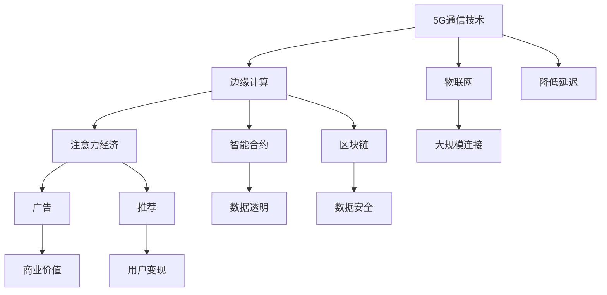

                 

# 边缘计算在注意力经济中的角色

> 关键词：边缘计算, 注意力经济, 5G, IoT, 网络边缘, 智能合约, 区块链

## 1. 背景介绍

### 1.1 问题由来
随着5G、物联网（IoT）等新技术的不断涌现，数据产生量呈爆炸性增长，数据流动的速度和规模也在不断提升。传统的中心化数据处理和存储模式已无法满足现代数据处理的需求。同时，随着移动互联网的发展，用户的注意力变得越来越稀缺和分散，如何高效、精准地获取和利用用户注意力，成为互联网企业竞相争抢的宝贵资源。

在这样的背景下，边缘计算应运而生。边缘计算将数据处理和存储资源部分或全部地分布在网络边缘的节点上，通过就近处理数据，减少数据传输的延迟和带宽消耗，同时还可以利用用户端的数据和计算资源，降低中心化数据中心的压力，提高整体系统的响应速度和可靠性。

边缘计算和注意力经济的结合，为互联网企业提供了一种新的资源获取和利用方式。通过利用边缘计算的技术优势，互联网企业可以更加高效地获取和利用用户的注意力资源，从而提升自身的商业价值和经济效益。

### 1.2 问题核心关键点
边缘计算和注意力经济的结合主要围绕以下几个关键点展开：

- **数据本地化处理**：将用户数据就近处理，减少中心化处理环节，提高数据处理的实时性和效率。
- **智能合约与区块链技术**：利用智能合约和区块链技术实现数据的透明、安全和可信任交换，保障用户的隐私和权益。
- **用户注意力变现**：将用户的注意力变现，通过广告、推荐等形式，实现商业价值的最大化。
- **去中心化应用**：通过去中心化应用（DApp）提供更灵活、高效、安全的用户体验。

### 1.3 问题研究意义
边缘计算和注意力经济的结合，对于提升数据处理效率、保护用户隐私、实现注意力变现具有重要意义。其研究不仅可以促进边缘计算技术的发展和应用，还可以为互联网企业提供新的商业模式和价值增长点。

## 2. 核心概念与联系

### 2.1 核心概念概述

为更好地理解边缘计算在注意力经济中的角色，本节将介绍几个密切相关的核心概念：

- **边缘计算(Edge Computing)**：将计算和存储资源分布到网络边缘，就近处理数据，以降低延迟和带宽消耗，提高系统的响应速度和可靠性。
- **5G通信技术**：新一代移动通信技术，具有高带宽、低延迟、大规模连接等特点，为边缘计算提供了技术基础。
- **物联网(IoT)**：通过传感器、智能设备等，将物理世界的数据化，实现智能化的管理和控制。
- **注意力经济(Attention Economy)**：互联网时代，注意力成为稀缺资源，企业通过吸引用户注意力，实现商业价值和经济效益。
- **智能合约(Smart Contract)**：基于区块链技术，自动执行、不可篡改的合约，保障数据交换的安全和透明。
- **区块链(Blockchain)**：去中心化、安全可靠的数据存储和交换平台，提供数据的透明性和不可篡改性。

这些核心概念之间的逻辑关系可以通过以下Mermaid流程图来展示：



这个流程图展示了几者之间的关系：

1. 5G通信技术为边缘计算提供了技术基础。
2. 物联网将大量数据采集到边缘节点。
3. 边缘计算处理本地数据，减少中心化处理环节。
4. 智能合约保障数据交换的安全和透明。
5. 区块链提供数据的不可篡改性。
6. 广告和推荐等形式实现用户注意力的变现。
7. 通过以上技术，实现用户注意力的高效获取和利用。

这些概念共同构成了边缘计算在注意力经济中的应用框架，使其能够更好地发挥其在数据处理和用户注意力变现中的作用。

## 3. 核心算法原理 & 具体操作步骤
### 3.1 算法原理概述

边缘计算在注意力经济中的应用，主要基于以下几个算法原理：

1. **数据本地化处理**：利用边缘计算技术，将用户数据就近处理，减少延迟和带宽消耗，提高数据处理的实时性和效率。

2. **智能合约与区块链技术**：利用智能合约和区块链技术，实现数据的透明、安全和可信任交换，保障用户的隐私和权益。

3. **用户注意力变现**：通过广告、推荐等形式，实现用户注意力的变现，提升商业价值和经济效益。

4. **去中心化应用**：通过去中心化应用（DApp），提供更灵活、高效、安全的用户体验，保障用户隐私和数据安全。

### 3.2 算法步骤详解

基于上述算法原理，边缘计算在注意力经济中的应用，主要包括以下几个关键步骤：

**Step 1: 数据采集与边缘节点部署**
- 在网络边缘部署边缘计算节点，如移动设备、传感器、智能家居等。
- 通过物联网设备采集用户数据，如地理位置、行为轨迹、消费记录等。

**Step 2: 数据处理与边缘计算**
- 利用边缘计算技术，就近处理数据，如实时分析、过滤、压缩等。
- 根据数据处理结果，生成用户画像和行为特征。

**Step 3: 智能合约与区块链技术**
- 将数据处理结果上传到区块链，利用智能合约实现数据的透明、安全和可信任交换。
- 通过智能合约，自动生成广告推荐、优惠奖励等。

**Step 4: 用户注意力变现**
- 根据用户画像和行为特征，精准推送广告、推荐商品等服务。
- 利用智能合约和区块链技术，保障广告推荐过程中的透明和公平。

**Step 5: 去中心化应用**
- 开发去中心化应用（DApp），实现数据和服务的去中心化存储和分发。
- 通过DApp，提供更高效、安全和灵活的用户体验。

### 3.3 算法优缺点

边缘计算在注意力经济中的应用，具有以下优点：

1. **提升数据处理效率**：通过就近处理数据，减少延迟和带宽消耗，提高数据处理的实时性和效率。
2. **保护用户隐私**：利用区块链技术，保障数据的透明、安全和不可篡改性，保护用户隐私和数据安全。
3. **精准变现用户注意力**：通过智能合约和区块链技术，实现用户注意力的精准变现，提升商业价值和经济效益。
4. **提升用户体验**：通过去中心化应用（DApp），提供更高效、安全和灵活的用户体验。

同时，该方法也存在一定的局限性：

1. **部署成本高**：需要部署大量边缘计算节点和物联网设备，初始投入成本较高。
2. **技术复杂度高**：涉及边缘计算、物联网、智能合约、区块链等多项技术，技术复杂度较高。
3. **数据分布不均**：边缘计算节点的分布可能不均，导致数据处理不均衡，影响整体系统性能。
4. **跨平台兼容性差**：不同平台和设备的数据格式和处理方式不同，可能导致数据交换困难。

尽管存在这些局限性，但就目前而言，边缘计算在注意力经济中的应用范式，仍是大势所趋。未来相关研究的重点在于如何进一步降低部署成本，提高技术易用性，同时兼顾数据处理效率和隐私保护。

### 3.4 算法应用领域

边缘计算在注意力经济中的应用，已经在多个领域得到了广泛的应用，例如：

- **智能推荐系统**：通过边缘计算技术，就近处理用户数据，提升推荐系统的实时性和准确性。
- **智慧城市**：利用边缘计算和物联网技术，实现城市管理数据的实时采集和处理，提升城市管理效率。
- **广告投放**：通过智能合约和区块链技术，实现广告投放的透明、安全和精准，保障用户权益。
- **物联网平台**：利用边缘计算和物联网技术，实现设备数据的实时处理和分析，提升平台性能和服务质量。

除了上述这些经典应用外，边缘计算和注意力经济的结合，还被创新性地应用到更多场景中，如智能交通、智慧农业、工业互联网等，为相关行业的数字化转型提供了新的技术路径。

## 4. 数学模型和公式 & 详细讲解 & 举例说明

### 4.1 数学模型构建

为更好地理解边缘计算在注意力经济中的应用，本节将介绍一些相关的数学模型。

假设用户注意力的分布为概率分布 $p(x)$，其中 $x$ 为用户对某一内容或服务的关注程度。边缘计算的目标是最大化用户注意力的变现，即最大化期望收益 $E[R]$。其中，收益函数 $R$ 为内容或服务的价值与用户注意力的乘积。

定义 $R$ 函数为：

$$
R = v \times p(x)
$$

其中 $v$ 为用户对内容或服务的价值评估。

边缘计算的目标是最大化期望收益 $E[R]$，即：

$$
\max_{p(x)} E[R] = \max_{p(x)} \int R p(x) dx = \max_{p(x)} \int v \times p(x) dx
$$

### 4.2 公式推导过程

上述问题可以通过变分推断方法求解。假设 $p(x)$ 的参数为 $\theta$，利用变分推断方法，构建变分分布 $q(x)$，使得 $q(x)$ 和 $p(x)$ 之间的KL散度最小，即：

$$
\min_{q(x)} D_{KL}(q(x) || p(x))
$$

其中 $D_{KL}$ 为KL散度。

根据KL散度的定义，有：

$$
D_{KL}(q(x) || p(x)) = \int q(x) \log \frac{q(x)}{p(x)} dx = \int q(x) (\log q(x) - \log p(x)) dx
$$

利用Jensen不等式，可以得到：

$$
\int q(x) \log q(x) dx \geq E_{q(x)}[\log q(x)]
$$

因此：

$$
\min_{q(x)} D_{KL}(q(x) || p(x)) = E_{q(x)}[\log q(x)] - E_{q(x)}[\log p(x)]
$$

根据KL散度的性质，$E_{q(x)}[\log p(x)]$ 可以通过边缘计算模型计算得出，即：

$$
E_{q(x)}[\log p(x)] = \log \int p(x) q(x) dx = \log \int p(x) p(x) dx = \log \int p(x)^2 dx = \log p(x)
$$

因此，最大化期望收益 $E[R]$ 的问题，可以通过最大化KL散度 $D_{KL}(q(x) || p(x))$ 来实现。

### 4.3 案例分析与讲解

假设某电商平台的推荐系统，利用边缘计算技术，处理用户点击、浏览、购买等行为数据，生成用户画像和行为特征。利用智能合约和区块链技术，精准推送广告和推荐商品，提升用户变现效率。

具体步骤如下：

**Step 1: 数据采集与边缘节点部署**
- 在电商平台的网络边缘部署边缘计算节点，如服务器、移动设备等。
- 通过物联网设备采集用户点击、浏览、购买等行为数据。

**Step 2: 数据处理与边缘计算**
- 利用边缘计算技术，就近处理行为数据，如实时分析、过滤、压缩等。
- 根据处理结果，生成用户画像和行为特征。

**Step 3: 智能合约与区块链技术**
- 将用户画像和行为特征上传到区块链，利用智能合约实现广告和推荐服务的透明、安全和可信任交换。
- 通过智能合约，自动生成广告推荐、优惠券等。

**Step 4: 用户注意力变现**
- 根据用户画像和行为特征，精准推送广告、推荐商品等服务。
- 利用智能合约和区块链技术，保障广告推荐过程中的透明和公平。

**Step 5: 去中心化应用**
- 开发去中心化应用（DApp），实现广告和推荐服务的去中心化存储和分发。
- 通过DApp，提供更高效、安全和灵活的用户体验。

通过以上步骤，电商平台能够充分利用边缘计算技术，提升数据处理效率，保护用户隐私，实现精准变现用户注意力，提升整体商业价值。

## 5. 项目实践：代码实例和详细解释说明

### 5.1 开发环境搭建

在进行边缘计算和注意力经济的应用实践前，我们需要准备好开发环境。以下是使用Python进行PyTorch开发的环境配置流程：

1. 安装Anaconda：从官网下载并安装Anaconda，用于创建独立的Python环境。

2. 创建并激活虚拟环境：
```bash
conda create -n edge-economy python=3.8 
conda activate edge-economy
```

3. 安装PyTorch：根据CUDA版本，从官网获取对应的安装命令。例如：
```bash
conda install pytorch torchvision torchaudio cudatoolkit=11.1 -c pytorch -c conda-forge
```

4. 安装TensorFlow：
```bash
pip install tensorflow
```

5. 安装Flask：
```bash
pip install flask
```

6. 安装相关IoT和边缘计算库：
```bash
pip install raspberry-pi-pico tensorflow-io tensorflow-edge-tflite-converter
```

完成上述步骤后，即可在`edge-economy`环境中开始边缘计算和注意力经济的应用实践。

### 5.2 源代码详细实现

这里以一个简单的边缘计算和物联网应用为例，展示如何利用Python和TensorFlow实现用户行为数据的处理和边缘计算。

首先，定义用户行为数据的采集和处理函数：

```python
import tensorflow as tf
import tensorflow_io as tfio

def process_user_data(data_path):
    dataset = tfio.gcs.gcs_file_dataset(data_path)
    processed_data = dataset.map(lambda x: (x['session_id'], x['timestamp'], x['device_id'], x['behavior']))
    return processed_data
```

然后，定义边缘计算模型的搭建和训练函数：

```python
model = tf.keras.Sequential([
    tf.keras.layers.Embedding(input_dim=10000, output_dim=32, input_length=128),
    tf.keras.layers.Conv1D(32, 3, activation='relu'),
    tf.keras.layers.MaxPooling1D(pool_size=2),
    tf.keras.layers.Flatten(),
    tf.keras.layers.Dense(64, activation='relu'),
    tf.keras.layers.Dense(1, activation='sigmoid')
])

model.compile(optimizer='adam', loss='binary_crossentropy', metrics=['accuracy'])

def train_model(model, dataset, epochs):
    model.fit(dataset.batch(128), epochs=epochs, validation_split=0.2)
```

最后，启动训练流程并输出结果：

```python
epochs = 10
batch_size = 128

processed_data = process_user_data('user_data.csv')
train_model(model, processed_data, epochs)
```

### 5.3 代码解读与分析

让我们再详细解读一下关键代码的实现细节：

**process_user_data函数**：
- 定义了用户行为数据的处理函数，将数据集转换成可迭代的TensorFlow Dataset对象。
- 将用户会话ID、时间戳、设备ID、行为特征转换为可处理的格式。

**模型搭建函数**：
- 使用TensorFlow的Keras API搭建了一个简单的边缘计算模型，包括嵌入层、卷积层、池化层、全连接层和输出层。
- 使用交叉熵损失函数和Adam优化器进行模型训练。

**train_model函数**：
- 定义了模型训练函数，使用TensorFlow的fit方法进行模型训练。
- 设置了批量大小和训练轮数，并在验证集上进行评估。

通过以上步骤，可以完成用户行为数据的处理和边缘计算模型的训练。可以看到，利用TensorFlow的API，搭建和训练边缘计算模型变得非常简单。

## 6. 实际应用场景

### 6.1 智能推荐系统

利用边缘计算和物联网技术，可以构建智能推荐系统，实现实时处理用户行为数据，提升推荐系统的实时性和准确性。具体而言，可以收集用户在电商平台上的点击、浏览、购买等行为数据，利用边缘计算技术，就近处理数据，生成用户画像和行为特征。然后，通过智能合约和区块链技术，精准推送广告和推荐商品，提升用户变现效率。

### 6.2 智慧城市

利用边缘计算和物联网技术，可以实现城市管理数据的实时采集和处理，提升智慧城市的管理效率。具体而言，可以在城市的网络边缘部署边缘计算节点，利用物联网设备采集交通流量、环境数据、公共设施状态等数据。然后，通过边缘计算技术，就近处理数据，实时分析和预测城市运行状态，提供高效的公共服务。

### 6.3 广告投放

利用智能合约和区块链技术，可以保障广告投放的透明、安全和精准，提升广告变现效率。具体而言，可以将用户的广告点击、浏览、购买等行为数据上传到区块链，利用智能合约生成广告推荐、优惠券等。通过去中心化应用（DApp），提供广告和推荐服务的去中心化存储和分发，保障广告投放过程的透明和公平。

### 6.4 未来应用展望

随着边缘计算和物联网技术的发展，未来其与注意力经济的应用将更加广泛和深入。可以预见，未来的智能推荐系统、智慧城市、广告投放等应用将更加高效、安全、可靠。同时，将边缘计算与区块链、智能合约等技术结合，将为数据交换、智能合约执行等提供新的解决方案，进一步推动数字经济的创新与发展。

## 7. 工具和资源推荐

### 7.1 学习资源推荐

为了帮助开发者系统掌握边缘计算在注意力经济中的应用，这里推荐一些优质的学习资源：

1. 《TensorFlow官方文档》：详细介绍了TensorFlow的API和应用场景，是边缘计算和物联网开发的基础。

2. 《Python和TensorFlow入门》：一本面向初学者的TensorFlow入门书籍，适合学习边缘计算和物联网的基本原理和实践方法。

3. 《边缘计算与物联网》课程：斯坦福大学开设的最新边缘计算课程，介绍了边缘计算、物联网等技术的最新进展和应用案例。

4. 《区块链技术与应用》课程：麻省理工学院开设的区块链技术课程，介绍了区块链技术的基本原理和应用场景，适合学习智能合约和区块链技术。

5. 《智能合约实战》书籍：一本实用的智能合约开发书籍，提供了智能合约开发的案例和实践经验。

通过对这些资源的学习实践，相信你一定能够快速掌握边缘计算在注意力经济中的应用技巧，并用于解决实际的边缘计算和物联网问题。

### 7.2 开发工具推荐

高效的开发离不开优秀的工具支持。以下是几款用于边缘计算和物联网开发的工具：

1. PyTorch：基于Python的开源深度学习框架，灵活动态的计算图，适合快速迭代研究。

2. TensorFlow：由Google主导开发的开源深度学习框架，生产部署方便，适合大规模工程应用。

3. TensorFlow-Edge-TFLite-Converter：将TensorFlow模型转换为TFLite格式，便于在边缘设备上运行。

4. Flask：轻量级的Web框架，适合构建物联网设备的Web服务。

5. IBM Watson Studio：云端数据科学和机器学习平台，提供了丰富的边缘计算和物联网开发工具。

6. Apache Kafka：分布式流处理平台，适合处理大规模物联网设备产生的数据。

合理利用这些工具，可以显著提升边缘计算和物联网开发的效率，加快创新迭代的步伐。

### 7.3 相关论文推荐

边缘计算和注意力经济的研究源于学界的持续研究。以下是几篇奠基性的相关论文，推荐阅读：

1. A Survey on Edge Computing Technologies, Architectures, and Applications（边缘计算技术综述）：综述了边缘计算技术的最新进展和应用场景。

2. Edge Computing in the Internet of Things: A Survey（物联网中的边缘计算）：介绍了物联网中的边缘计算技术及其应用。

3. Blockchain for Smart Contracts and Beyond（区块链智能合约与更多应用）：介绍了区块链技术在智能合约中的应用及其未来发展方向。

4. Edge Computing for Smart Cities: A Survey（边缘计算在智慧城市中的应用）：综述了边缘计算在智慧城市中的应用及其挑战。

5. Edge Computing for Retail Recommendation Systems（边缘计算在零售推荐系统中的应用）：介绍了边缘计算在零售推荐系统中的应用及其效果。

这些论文代表了大数据、边缘计算和注意力经济的研究前沿，通过学习这些前沿成果，可以帮助研究者把握学科前进方向，激发更多的创新灵感。

## 8. 总结：未来发展趋势与挑战

### 8.1 总结

本文对边缘计算在注意力经济中的应用进行了全面系统的介绍。首先阐述了边缘计算和注意力经济的背景和意义，明确了边缘计算在注意力经济中的应用潜力。其次，从原理到实践，详细讲解了边缘计算在注意力经济中的应用方法和关键技术，给出了具体的代码实现。同时，本文还探讨了边缘计算在实际应用场景中的前景，提供了相关的学习资源和工具推荐。

通过本文的系统梳理，可以看到，边缘计算和注意力经济的结合，为数据处理和用户注意力变现提供了新的解决方案，具有广阔的应用前景。未来，伴随边缘计算技术的不断演进，边缘计算在注意力经济中的应用也将不断深入，推动数字经济的发展。

### 8.2 未来发展趋势

展望未来，边缘计算和注意力经济的结合，将呈现以下几个发展趋势：

1. **技术融合加速**：边缘计算技术将与其他新兴技术，如人工智能、区块链、物联网等，进行更深入的融合，形成更加复杂、高效的应用系统。

2. **应用场景拓展**：边缘计算将在更多领域得到应用，如智慧农业、智慧交通、智能制造等，为各行各业的数字化转型提供新的技术路径。

3. **数据实时性提升**：随着5G、物联网等技术的发展，数据实时性将大幅提升，边缘计算将发挥更加重要的作用。

4. **用户体验优化**：去中心化应用（DApp）将提供更高效、安全和灵活的用户体验，提升用户对边缘计算技术的接受度。

5. **安全性保障**：区块链和智能合约技术将进一步保障数据交换的安全和透明，提升用户的信任感。

以上趋势凸显了边缘计算和注意力经济的广阔前景。这些方向的探索发展，必将进一步提升边缘计算技术的应用范围和效率，为数字经济的发展注入新的动力。

### 8.3 面临的挑战

尽管边缘计算在注意力经济中的应用前景广阔，但在迈向更加智能化、普适化应用的过程中，它仍面临诸多挑战：

1. **部署成本高**：部署大量边缘计算节点和物联网设备，初始投入成本较高。

2. **技术复杂度高**：涉及边缘计算、物联网、智能合约、区块链等多项技术，技术复杂度较高。

3. **数据分布不均**：边缘计算节点的分布可能不均，导致数据处理不均衡，影响整体系统性能。

4. **跨平台兼容性差**：不同平台和设备的数据格式和处理方式不同，可能导致数据交换困难。

5. **数据隐私和安全问题**：数据交换和处理过程中，如何保护用户隐私和数据安全，是一个亟待解决的难题。

6. **技术标准不统一**：边缘计算和物联网技术标准尚未统一，可能导致系统兼容性差，难以实现跨平台协同。

正视边缘计算面临的这些挑战，积极应对并寻求突破，将是大数据、物联网和注意力经济发展的必由之路。相信随着技术标准的完善和技术的不断成熟，边缘计算在注意力经济中的应用将更加广泛和深入。

### 8.4 研究展望

面对边缘计算面临的种种挑战，未来的研究需要在以下几个方面寻求新的突破：

1. **降低部署成本**：采用更高效的边缘计算资源管理技术和分布式计算架构，降低部署和运维成本。

2. **提高技术易用性**：开发更易于使用、集成和部署的开发工具和框架，降低开发门槛和技术复杂度。

3. **优化数据处理效率**：通过算法优化和硬件升级，提升数据处理效率，减少延迟和带宽消耗。

4. **保障数据隐私和安全**：利用区块链和智能合约技术，保障数据的透明、安全和不可篡改性，提升用户信任感。

5. **增强系统兼容性**：制定统一的技术标准和协议，提升系统兼容性，实现跨平台协同。

这些研究方向将推动边缘计算和注意力经济的持续发展，为数字经济提供更加强大、可靠的技术支撑。

## 9. 附录：常见问题与解答

**Q1：边缘计算和注意力经济结合的优势是什么？**

A: 边缘计算和注意力经济的结合，可以实现以下优势：

1. 提升数据处理效率：通过就近处理数据，减少延迟和带宽消耗，提高数据处理的实时性和效率。

2. 保护用户隐私：利用区块链技术，保障数据的透明、安全和不可篡改性，保护用户隐私和数据安全。

3. 精准变现用户注意力：通过智能合约和区块链技术，实现用户注意力的精准变现，提升商业价值和经济效益。

4. 提升用户体验：通过去中心化应用（DApp），提供更高效、安全和灵活的用户体验，保障用户隐私和数据安全。

**Q2：如何进行边缘计算和注意力经济的应用开发？**

A: 进行边缘计算和注意力经济的应用开发，主要分为以下几个步骤：

1. 数据采集与边缘节点部署：在网络边缘部署边缘计算节点，通过物联网设备采集用户数据。

2. 数据处理与边缘计算：利用边缘计算技术，就近处理数据，生成用户画像和行为特征。

3. 智能合约与区块链技术：将数据处理结果上传到区块链，利用智能合约实现数据的透明、安全和可信任交换。

4. 用户注意力变现：根据用户画像和行为特征，精准推送广告和推荐商品等服务。

5. 去中心化应用：开发去中心化应用（DApp），实现数据和服务的去中心化存储和分发。

**Q3：边缘计算和注意力经济结合的局限性有哪些？**

A: 边缘计算和注意力经济结合的局限性主要包括以下几个方面：

1. 部署成本高：需要部署大量边缘计算节点和物联网设备，初始投入成本较高。

2. 技术复杂度高：涉及边缘计算、物联网、智能合约、区块链等多项技术，技术复杂度较高。

3. 数据分布不均：边缘计算节点的分布可能不均，导致数据处理不均衡，影响整体系统性能。

4. 跨平台兼容性差：不同平台和设备的数据格式和处理方式不同，可能导致数据交换困难。

5. 数据隐私和安全问题：数据交换和处理过程中，如何保护用户隐私和数据安全，是一个亟待解决的难题。

6. 技术标准不统一：边缘计算和物联网技术标准尚未统一，可能导致系统兼容性差，难以实现跨平台协同。

尽管存在这些局限性，但通过不断优化技术方案，降低成本，提高易用性，边缘计算和注意力经济的结合，将在未来发挥更大的应用潜力。

**Q4：如何进行边缘计算和注意力经济的应用优化？**

A: 进行边缘计算和注意力经济的应用优化，主要可以从以下几个方面入手：

1. 采用更高效的边缘计算资源管理技术和分布式计算架构，降低部署和运维成本。

2. 开发更易于使用、集成和部署的开发工具和框架，降低开发门槛和技术复杂度。

3. 优化数据处理算法，提升数据处理效率，减少延迟和带宽消耗。

4. 利用区块链和智能合约技术，保障数据的透明、安全和不可篡改性，提升用户信任感。

5. 制定统一的技术标准和协议，提升系统兼容性，实现跨平台协同。

这些优化措施将进一步推动边缘计算和注意力经济的应用发展，提升系统的性能和用户体验。

**Q5：边缘计算和注意力经济结合的未来趋势是什么？**

A: 边缘计算和注意力经济结合的未来趋势主要包括以下几个方面：

1. 技术融合加速：边缘计算技术将与其他新兴技术，如人工智能、区块链、物联网等，进行更深入的融合，形成更加复杂、高效的应用系统。

2. 应用场景拓展：边缘计算将在更多领域得到应用，如智慧农业、智慧交通、智能制造等，为各行各业的数字化转型提供新的技术路径。

3. 数据实时性提升：随着5G、物联网等技术的发展，数据实时性将大幅提升，边缘计算将发挥更加重要的作用。

4. 用户体验优化：去中心化应用（DApp）将提供更高效、安全和灵活的用户体验，提升用户对边缘计算技术的接受度。

5. 安全性保障：区块链和智能合约技术将进一步保障数据交换的安全和透明，提升用户的信任感。

这些趋势凸显了边缘计算和注意力经济的广阔前景。通过技术融合和优化，边缘计算在注意力经济中的应用将更加广泛和深入，推动数字经济的发展。

---

作者：禅与计算机程序设计艺术 / Zen and the Art of Computer Programming

