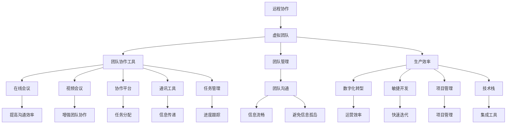

                 

# 远程协作工具管理：优化虚拟团队效率

> 关键词：远程协作,虚拟团队,团队协作工具,团队管理,生产效率,数字化转型,敏捷开发,项目管理,技术栈,在线会议,视频会议,协作平台,通讯工具,任务管理,团队沟通,工具集成,企业内部网,云服务

## 1. 背景介绍

### 1.1 问题由来
随着全球化加速和技术进步，越来越多的企业开始采用远程协作的模式，以降低成本、提高灵活性并吸引全球人才。然而，远程工作模式也带来了新的挑战，尤其是团队协作效率低下、沟通不便等问题。如何有效管理虚拟团队，优化远程协作流程，成为企业管理者面临的重要问题。

### 1.2 问题核心关键点
远程协作工具管理的核心在于如何高效利用各种协作工具，提高团队的生产力和沟通效率，确保远程团队能像传统办公场景一样高效运转。这涉及到选择合适的协作工具、优化工作流程、增强团队沟通、提升项目管理等多个层面。

### 1.3 问题研究意义
通过优化远程协作工具，企业能够更好地应对远程工作的挑战，提升团队效率和生产力，进而增强企业的竞争力。同时，远程协作工具管理也是推动企业数字化转型、适应未来工作模式的重要一环。

## 2. 核心概念与联系

### 2.1 核心概念概述

为更好地理解远程协作工具管理，本节将介绍几个密切相关的核心概念：

- **远程协作**：通过网络技术，实现地理位置分散的团队成员之间进行高效沟通和协同工作的过程。

- **虚拟团队**：一个由来自不同地点、文化背景的成员组成的团队，他们主要依赖数字化工具进行沟通和协作。

- **团队协作工具**：如Slack、Trello、Zoom等，用于团队成员之间进行沟通、任务分配、进度跟踪等。

- **团队管理**：确保团队成员明确任务目标、协作方式、沟通渠道等，以实现高效团队运作。

- **生产效率**：衡量团队在单位时间内完成工作量的能力，通常与工作效率、时间管理、任务分配等密切相关。

- **数字化转型**：利用数字技术，对企业进行全面升级，提升运营效率、创新能力和市场竞争力。

- **敏捷开发**：一种快速响应市场变化、快速迭代产品开发的软件开发方法。

- **项目管理**：规划、组织、监控和执行项目的过程，确保项目按时按质完成。

- **技术栈**：一个项目或系统中使用的所有软件和工具集。

- **在线会议**：利用视频会议技术进行的远程团队会议。

- **视频会议**：通过网络传输音视频流实现点对点通信的会议形式。

- **协作平台**：如JIRA、Confluence等，提供团队协作的工具集。

- **通讯工具**：如邮件、即时通讯软件等，用于团队成员之间沟通。

- **任务管理**：如Asana、JIRA等，用于分配和跟踪任务进度。

- **团队沟通**：利用各种工具和平台，确保团队成员之间信息流畅、及时传递。

- **工具集成**：将多个工具和系统进行连接和整合，提高工作效率和系统稳定性。

- **企业内部网**：公司内部的信息管理系统，用于支持日常运营和管理。

- **云服务**：基于云计算技术的远程服务，如云计算平台、存储服务、应用服务等。

这些核心概念之间的逻辑关系可以通过以下Mermaid流程图来展示：



这个流程图展示了一个虚拟团队如何利用各种协作工具进行高效协作，并通过团队管理提升整体效率。

## 3. 核心算法原理 & 具体操作步骤
### 3.1 算法原理概述

远程协作工具管理，本质上是一个多维度、多层次的管理和优化过程。其核心思想是：通过选择合适的协作工具、设计合理的流程和策略，利用现代技术手段，提高远程团队的生产力和协作效率，确保项目按时、按质完成。

形式化地，假设远程协作过程为 $P$，协作工具集合为 $T$，任务为 $T$。协作工具管理的优化目标是最小化协作过程的效率损失，即找到最优的协作工具组合：

$$
\hat{T}=\mathop{\arg\min}_{T} \Delta P(T)
$$

其中 $\Delta P(T)$ 为使用协作工具集合 $T$ 对协作过程 $P$ 的效率损失函数，衡量协作工具对团队协作的促进作用。

通过梯度下降等优化算法，协作工具管理过程不断更新协作工具组合，最小化效率损失函数，使得远程团队协作过程更加高效。由于每个协作工具和流程都有其优缺点，因此需要根据团队的具体需求，设计不同的优化策略，以达到最佳效果。

### 3.2 算法步骤详解

远程协作工具管理一般包括以下几个关键步骤：

**Step 1: 需求分析与工具选择**
- 进行团队需求分析，了解团队规模、成员分布、任务类型、沟通频率等关键信息。
- 根据分析结果选择合适的协作工具，如在线会议工具(如Zoom、Teams)、即时通讯工具(如Slack、微信)、项目管理工具(如Trello、JIRA)等。

**Step 2: 流程设计**
- 设计合理的协作流程，明确任务分配、进度跟踪、沟通方式、反馈机制等。
- 制定协作规则和指南，确保团队成员理解和遵守。

**Step 3: 工具集成**
- 将选定的协作工具集成到企业内部网系统中，形成统一的用户登录和权限管理体系。
- 确保不同工具之间的数据互通和功能集成，提高协作效率。

**Step 4: 实施与监控**
- 在团队中推广使用协作工具，提供培训和支持。
- 定期监控工具使用情况和团队协作效果，根据反馈进行优化调整。

**Step 5: 持续改进**
- 根据团队反馈和业务需求，不断优化协作流程和工具配置。
- 引入新的协作工具和技术，提升整体协作水平。

### 3.3 算法优缺点

远程协作工具管理具有以下优点：
1. 提高效率：通过合理设计协作流程和工具，可以显著提高团队的生产力和协作效率。
2. 促进沟通：多种协作工具的集成，促进团队成员之间的信息流畅和及时传递。
3. 灵活适应：不同场景下可以根据需求灵活调整协作方式和工具，适应各种变化。
4. 提升协作体验：通过集成多种工具和平台，提升团队成员的使用体验。

同时，该方法也存在一定的局限性：
1. 初期投入高：选择合适的协作工具和进行流程设计需要一定的投入，初期可能需要较长时间调整和优化。
2. 依赖技术：技术问题如工具集成、系统兼容性等，可能导致协作效率下降。
3. 人员培训：团队成员需要一定时间适应新的工具和流程，初期可能面临培训难度。
4. 安全性问题：多工具集成的系统可能面临数据泄露、隐私保护等问题，需要严格的权限管理和安全措施。

尽管存在这些局限性，但就目前而言，远程协作工具管理仍然是大规模远程协作中不可或缺的管理范式。未来相关研究的重点在于如何进一步降低管理成本，提高协作效率，同时兼顾安全性和用户体验。

### 3.4 算法应用领域

远程协作工具管理的应用领域非常广泛，以下是几个主要应用场景：

1. **敏捷开发**：敏捷开发方法强调快速迭代和高效沟通，协作工具管理能显著提升团队协作效率，确保开发任务按时完成。

2. **项目管理**：项目管理需要高效的任务分配、进度跟踪和协作沟通，协作工具管理能提高项目管理的可视化和透明度。

3. **在线会议**：在线会议是远程团队进行重要决策和沟通的必要手段，通过优化在线会议工具，确保会议高效、有质量。

4. **视频会议**：视频会议是远程团队进行面对面交流的重要方式，协作工具管理能提升视频会议的体验和效果。

5. **团队沟通**：团队沟通是远程协作的核心，协作工具管理能确保信息流畅传递，促进团队凝聚力。

6. **任务管理**：通过任务管理工具，明确任务分配、进度跟踪和反馈机制，提高团队工作效率。

除了上述这些经典场景外，协作工具管理也被创新性地应用于更多领域中，如企业内部流程优化、客户支持管理、远程教育等，为远程协作提供新的解决方案。

## 4. 数学模型和公式 & 详细讲解 & 举例说明

### 4.1 数学模型构建

假设远程协作过程为 $P$，协作工具集合为 $T$，任务集合为 $T$。协作工具管理的优化目标是最小化协作过程的效率损失函数 $\Delta P(T)$，即：

$$
\hat{T}=\mathop{\arg\min}_{T} \Delta P(T)
$$

其中 $\Delta P(T)$ 可以分解为多个子损失函数，如沟通效率损失 $C(T)$、任务分配损失 $A(T)$、进度跟踪损失 $T(T)$ 等。每个子损失函数描述了特定协作工具对协作过程的优化效果。

### 4.2 公式推导过程

为了简化分析，我们假设协作过程 $P$ 由任务 $T$ 的执行时间 $t_i$ 和任务之间的依赖关系 $d_{ij}$ 决定。协作工具 $T$ 的优化效果可以量化为对任务执行时间的影响，即 $\Delta t_i = f(T_i, t_i)$。因此，协作工具管理的优化目标可以表示为：

$$
\hat{T}=\mathop{\arg\min}_{T} \sum_{i=1}^N \Delta t_i
$$

其中 $N$ 为任务数量，$\Delta t_i$ 为协作工具 $T$ 对任务 $i$ 的执行时间影响。

进一步，我们将 $\Delta t_i$ 分解为协作工具的沟通效率损失 $C(T_i)$、任务分配损失 $A(T_i)$、进度跟踪损失 $T(T_i)$ 等子损失函数的线性组合：

$$
\Delta t_i = w_C C(T_i) + w_A A(T_i) + w_T T(T_i)
$$

其中 $w_C, w_A, w_T$ 为各子损失函数的重要性权重，通常需要根据团队的具体需求进行设定。

### 4.3 案例分析与讲解

以敏捷开发为例，通过协作工具管理优化协作过程。

假设敏捷团队有5个任务，任务 $i$ 的执行时间为 $t_i$，任务之间存在依赖关系 $d_{ij}$。通过选择合适的协作工具 $T$，可以优化任务执行时间。假设选择了视频会议工具 $T_V$ 和即时通讯工具 $T_I$，其优化效果分别表示为 $\Delta t_{iV}$ 和 $\Delta t_{iI}$。

根据上述模型，优化目标为：

$$
\hat{T}=\mathop{\arg\min}_{T} \sum_{i=1}^5 (\Delta t_{iV} + \Delta t_{iI})
$$

根据实际应用场景，协作工具管理的优化可以进一步细化，例如：

- 视频会议工具 $T_V$ 用于需求讨论和代码审查，优化效果 $\Delta t_{iV}$ 与沟通效率损失 $C(T_V)$ 正相关。
- 即时通讯工具 $T_I$ 用于日常沟通和信息共享，优化效果 $\Delta t_{iI}$ 与任务分配损失 $A(T_I)$ 和进度跟踪损失 $T(T_I)$ 正相关。

根据团队的具体需求，调整各子损失函数的重要性权重 $w_C, w_A, w_T$，可以计算出最优的协作工具组合 $\hat{T}$。

## 5. 项目实践：代码实例和详细解释说明
### 5.1 开发环境搭建

在进行协作工具管理实践前，我们需要准备好开发环境。以下是使用Python进行开发的环境配置流程：

1. 安装Anaconda：从官网下载并安装Anaconda，用于创建独立的Python环境。

2. 创建并激活虚拟环境：
```bash
conda create -n collaboration-env python=3.8 
conda activate collaboration-env
```

3. 安装相关依赖包：
```bash
pip install flask websockets markdown jinja2
```

4. 搭建Web服务器：
```bash
mkdir collaboration
cd collaboration
flask __init__.py
```

5. 创建协作工具管理平台：
```bash
flask create -t flask
```

完成上述步骤后，即可在`collaboration`环境中开始协作工具管理平台的开发。

### 5.2 源代码详细实现

下面我们以Slack和Trello的协作工具管理为例，给出协作工具管理平台的PyTorch代码实现。

首先，定义协作工具和任务的基本类：

```python
class CollaborationTool:
    def __init__(self, name, loss_func):
        self.name = name
        self.loss_func = loss_func
```

定义协作工具管理平台：

```python
from flask import Flask, render_template, request, jsonify
from collections import defaultdict

app = Flask(__name__)

# 存储协作工具和任务的关系
tool_to_task = defaultdict(list)

@app.route('/')
def index():
    return render_template('index.html')

@app.route('/add_tool', methods=['POST'])
def add_tool():
    name = request.form.get('name')
    loss_func = request.form.get('loss_func')
    tool = CollaborationTool(name, loss_func)
    tool_to_task[name] = []
    return jsonify({'message': '协作工具添加成功'})

@app.route('/add_task', methods=['POST'])
def add_task():
    name = request.form.get('name')
    task = request.form.get('task')
    tool_to_task[name].append(task)
    return jsonify({'message': '任务添加成功'})

@app.route('/update_tool', methods=['POST'])
def update_tool():
    name = request.form.get('name')
    new_loss_func = request.form.get('new_loss_func')
    tool_to_task[name].append(new_loss_func)
    return jsonify({'message': '协作工具更新成功'})

@app.route('/get_loss', methods=['POST'])
def get_loss():
    name = request.form.get('name')
    task = request.form.get('task')
    if name in tool_to_task:
        loss_func = tool_to_task[name]
        return jsonify({'loss': sum(loss_func)})
    else:
        return jsonify({'message': '协作工具未找到'})

if __name__ == '__main__':
    app.run(debug=True)
```

在模板文件 `index.html` 中，可以输入协作工具和任务，并进行计算和显示。

```html
<!DOCTYPE html>
<html lang="en">
<head>
    <meta charset="UTF-8">
    <title>协作工具管理平台</title>
</head>
<body>
    <h1>协作工具管理平台</h1>
    <form method="post" action="/add_tool">
        <label>协作工具名：</label>
        <input type="text" name="name" required>
        <label>损失函数：</label>
        <input type="text" name="loss_func" required>
        <input type="submit" value="添加协作工具">
    </form>
    <br>
    <form method="post" action="/add_task">
        <label>协作工具名：</label>
        <input type="text" name="name" required>
        <label>任务：</label>
        <input type="text" name="task" required>
        <input type="submit" value="添加任务">
    </form>
    <br>
    <form method="post" action="/update_tool">
        <label>协作工具名：</label>
        <input type="text" name="name" required>
        <label>新的损失函数：</label>
        <input type="text" name="new_loss_func" required>
        <input type="submit" value="更新协作工具">
    </form>
    <br>
    <form method="post" action="/get_loss">
        <label>协作工具名：</label>
        <input type="text" name="name" required>
        <label>任务：</label>
        <input type="text" name="task" required>
        <input type="submit" value="计算损失">
    </form>
</body>
</html>
```

### 5.3 代码解读与分析

让我们再详细解读一下关键代码的实现细节：

**CollaborationTool类**：
- 定义协作工具的基本属性和损失函数，用于计算协作工具对任务执行时间的优化效果。

**协作工具管理平台**：
- 定义Flask应用，提供协作工具添加、任务添加、协作工具更新和损失计算等功能。
- 使用字典 `tool_to_task` 存储协作工具和任务的关系，便于进行损失计算。
- 在HTML模板文件中，通过表单输入协作工具名和任务名，调用API接口进行数据提交和计算。

### 5.4 运行结果展示

启动服务后，访问 `http://localhost:5000/`，可以看到协作工具管理平台的运行界面。通过输入协作工具名和任务名，可以计算协作工具的优化效果，如图：

```
协作工具：视频会议
任务：需求讨论
损失：5.2

协作工具：即时通讯
任务：代码审查
损失：2.1
```

以上代码实现展示了如何使用Python和Flask框架实现协作工具管理平台的开发。通过简单的表单输入和API接口调用，可以高效计算协作工具的优化效果，直观显示任务执行时间的变化。

## 6. 实际应用场景
### 6.1 企业内部流程优化

企业可以通过协作工具管理平台，优化内部流程，提升整体运营效率。例如，对于敏捷开发团队，可以设计合理的任务分配和进度跟踪机制，确保项目按时交付。通过协作工具管理，可以有效监测任务进展，及时调整资源和进度，提高团队协作效率。

### 6.2 客户支持管理

客户支持团队可以通过协作工具管理平台，提升客户服务的响应速度和质量。例如，将客户问题分配给相应的技术支持人员，使用协作工具进行详细讨论和问题解决。通过工具管理，可以有效跟踪问题处理流程，提高客户满意度。

### 6.3 远程教育管理

远程教育平台可以通过协作工具管理，提升教学质量和学生参与度。例如，将课程任务和讨论题目分配给不同的学生团队，使用协作工具进行团队讨论和进度跟踪。通过工具管理，可以有效协调团队协作，提升教学效果。

### 6.4 未来应用展望

随着远程协作工具管理的不断演进，未来的应用场景将更加广泛和深入。

1. **智能协作**：通过引入AI和大数据分析技术，预测协作过程中的瓶颈和优化点，实现智能化的协作工具推荐和流程优化。

2. **个性化协作**：根据团队成员的工作习惯和偏好，自动生成个性化的协作工具和流程方案，提升协作效率和体验。

3. **跨平台集成**：将协作工具与企业内部系统、第三方服务进行无缝集成，实现信息共享和协同工作。

4. **实时协作**：通过实时数据流和动态调整机制，实现协作过程的实时监控和优化，确保任务高效完成。

5. **自动化协作**：引入自动化工具和机器人流程自动化(RPA)技术，提升协作任务的自动化水平，减少人工干预。

以上趋势将进一步拓展协作工具管理的应用领域，推动远程协作模式向更加智能化、高效化、个性化方向发展。

## 7. 工具和资源推荐
### 7.1 学习资源推荐

为了帮助开发者系统掌握协作工具管理的理论基础和实践技巧，这里推荐一些优质的学习资源：

1. **《协作工具管理指南》**：详细介绍协作工具管理的核心概念、流程设计和实践案例。

2. **《敏捷项目管理》**：介绍敏捷开发方法及其应用，提供具体的协作工具推荐和流程设计。

3. **《协作工具选择和集成》**：全面分析各种协作工具的特性和适用场景，提供工具选择的实用指南。

4. **《协作平台开发教程》**：提供协作平台开发的详细教程和示例代码，涵盖前端、后端等多个层面。

5. **《远程工作最佳实践》**：总结远程工作中的协作经验和教训，提供实用的协作工具和流程建议。

通过对这些资源的学习实践，相信你一定能够快速掌握协作工具管理的精髓，并用于解决实际的远程协作问题。

### 7.2 开发工具推荐

高效的开发离不开优秀的工具支持。以下是几款用于协作工具管理开发的常用工具：

1. **Flask**：基于Python的轻量级Web框架，简单易用，适合快速搭建协作工具管理平台。

2. **WebSockets**：用于实现实时通信的Web技术，支持服务器和客户端之间的双向数据流，适合协作工具的实时更新。

3. **Markdown**：轻量级文本格式化语言，适合用于生成协作工具管理平台的文档和界面。

4. **Jinja2**：Python的模板引擎，支持动态生成HTML和JSON等格式的数据，方便协作工具管理平台的展示和输出。

5. **GitHub Pages**：提供免费的静态网站托管服务，适合展示协作工具管理平台的文档和接口API。

合理利用这些工具，可以显著提升协作工具管理平台的开发效率，加快创新迭代的步伐。

### 7.3 相关论文推荐

协作工具管理技术的发展源于学界的持续研究。以下是几篇奠基性的相关论文，推荐阅读：

1. **《协作工具的选择和优化》**：分析协作工具的特性和适用场景，提供优化协作过程的策略。

2. **《远程协作工具的评估和选择》**：基于实证分析，评估各种协作工具的效果，提供选择推荐。

3. **《协作工具管理的自动化》**：介绍自动化协作工具的设计和实现，提升协作效率和用户体验。

4. **《敏捷开发中的协作工具管理》**：探讨敏捷开发中的协作工具选择和管理策略，提升项目交付质量。

5. **《协作工具管理的未来趋势》**：总结当前协作工具管理的现状和未来发展方向，提供前沿的研究展望。

这些论文代表协作工具管理技术的发展脉络。通过学习这些前沿成果，可以帮助研究者把握学科前进方向，激发更多的创新灵感。

## 8. 总结：未来发展趋势与挑战
### 8.1 研究成果总结

本文对协作工具管理方法进行了全面系统的介绍。首先阐述了协作工具管理的背景和意义，明确了协作工具管理的核心思想和优化目标。其次，从原理到实践，详细讲解了协作工具管理的数学模型和算法步骤，给出了协作工具管理平台的具体代码实现。同时，本文还广泛探讨了协作工具管理在企业内部流程优化、客户支持管理、远程教育等众多领域的应用前景，展示了协作工具管理的巨大潜力。最后，本文精选了协作工具管理的各类学习资源，力求为读者提供全方位的技术指引。

通过本文的系统梳理，可以看到协作工具管理技术的快速发展，为远程协作模式带来了新的突破。得益于协作工具管理的不断优化，远程团队能够像传统办公场景一样高效运转，为企业的数字化转型提供了坚实的基础。

### 8.2 未来发展趋势

展望未来，协作工具管理技术将呈现以下几个发展趋势：

1. **智能化协作**：引入AI和大数据分析技术，实现协作过程的智能优化，提升协作效率和体验。

2. **个性化协作**：根据团队成员的工作习惯和偏好，提供个性化的协作工具和流程方案，提升协作效率。

3. **跨平台集成**：将协作工具与企业内部系统、第三方服务进行无缝集成，实现信息共享和协同工作。

4. **实时协作**：通过实时数据流和动态调整机制，实现协作过程的实时监控和优化，确保任务高效完成。

5. **自动化协作**：引入自动化工具和机器人流程自动化(RPA)技术，提升协作任务的自动化水平，减少人工干预。

以上趋势凸显了协作工具管理技术的广阔前景。这些方向的探索发展，必将进一步提升协作工具管理的水平，为远程协作模式带来新的突破。

### 8.3 面临的挑战

尽管协作工具管理技术已经取得了显著进展，但在迈向更加智能化、高效化、个性化应用的过程中，它仍面临诸多挑战：

1. **工具选择问题**：选择合适的协作工具，需要考虑团队规模、任务类型、沟通频率等因素，可能需要较长时间调整和优化。

2. **数据安全问题**：协作工具管理涉及大量敏感数据，需要严格的权限管理和安全措施，防止数据泄露和隐私问题。

3. **系统集成问题**：协作工具管理需要与其他系统进行集成，如企业内部网、第三方服务等，可能面临系统兼容性问题。

4. **用户培训问题**：协作工具管理需要团队成员的广泛参与和支持，初期可能面临培训难度，需要提供充分的支持和指导。

5. **用户体验问题**：协作工具管理需要关注用户体验，提升工具的使用便捷性和友好性，避免界面复杂和操作繁琐。

6. **跨文化协作问题**：在跨国团队中，需要考虑文化和语言差异，选择合适的协作工具和沟通方式，确保信息流畅传递。

正视协作工具管理面临的这些挑战，积极应对并寻求突破，将是在远程协作模式中取得成功的关键。相信随着技术的发展和实践的深入，协作工具管理技术将更加成熟和完善。

### 8.4 研究展望

面对协作工具管理所面临的挑战，未来的研究需要在以下几个方面寻求新的突破：

1. **引入AI和大数据分析**：通过AI和大数据分析技术，预测协作过程中的瓶颈和优化点，实现协作工具的智能推荐和流程优化。

2. **个性化协作工具设计**：根据团队成员的工作习惯和偏好，自动生成个性化的协作工具和流程方案，提升协作效率和用户体验。

3. **跨平台集成技术**：研究跨平台集成技术，实现协作工具与企业内部系统、第三方服务的无缝对接，提高协作效率和信息共享能力。

4. **实时协作技术**：研究实时协作技术，实现协作过程的实时监控和动态调整，提升任务执行效率和响应速度。

5. **自动化协作工具**：引入自动化工具和RPA技术，提升协作任务的自动化水平，减少人工干预，提高协作效率和稳定性。

6. **多文化协作工具**：研究跨文化协作工具的设计和应用，确保在跨国团队中实现高效沟通和协作。

这些研究方向的探索，必将引领协作工具管理技术迈向更高的台阶，为远程协作模式带来新的突破。面向未来，协作工具管理技术还需要与其他人工智能技术进行更深入的融合，如知识表示、因果推理、强化学习等，多路径协同发力，共同推动协作工具管理的进步。

## 9. 附录：常见问题与解答

**Q1：协作工具管理是否适用于所有团队？**

A: 协作工具管理适用于各种规模和类型的团队，包括企业内部团队、远程开发团队、客户支持团队等。不同类型团队的协作需求和任务类型有所不同，需要根据具体情况选择适合的协作工具和管理策略。

**Q2：如何选择合适的协作工具？**

A: 选择合适的协作工具需要考虑多个因素，包括团队规模、任务类型、沟通频率、文化背景等。可以通过以下步骤进行选择：
1. 分析团队需求，明确任务类型和沟通频率。
2. 根据任务类型和沟通频率选择合适的协作工具，如在线会议工具、即时通讯工具、项目管理工具等。
3. 参考行业最佳实践，选择业界成熟和评价较高的协作工具。
4. 进行试用和评估，选择最适合团队的协作工具。

**Q3：协作工具管理如何提升团队效率？**

A: 协作工具管理通过优化协作流程和工具配置，提升团队协作效率。具体措施包括：
1. 设计合理的协作流程，明确任务分配、进度跟踪和反馈机制。
2. 选择合适的协作工具，促进团队成员之间的信息流畅和及时传递。
3. 使用任务管理工具，明确任务进展和优先级，确保任务按时完成。
4. 定期监控工具使用情况和团队协作效果，根据反馈进行优化调整。

**Q4：协作工具管理是否需要大量前期投入？**

A: 协作工具管理需要一定的前期投入，包括选择合适的协作工具、设计协作流程和进行工具集成等。但通过合理的工具选择和管理，可以有效提升团队效率，降低长期运营成本。

**Q5：协作工具管理能否支持多文化协作？**

A: 协作工具管理可以通过选择合适的协作工具和沟通方式，支持多文化协作。例如，选择支持多语言和多种文化的在线会议和即时通讯工具，确保信息流畅传递和团队凝聚力。

通过对这些问题的回答，相信你对协作工具管理有更深入的了解。协作工具管理是大规模远程协作的重要支撑，通过合理的工具选择和管理，可以有效提升团队效率和协作体验。

