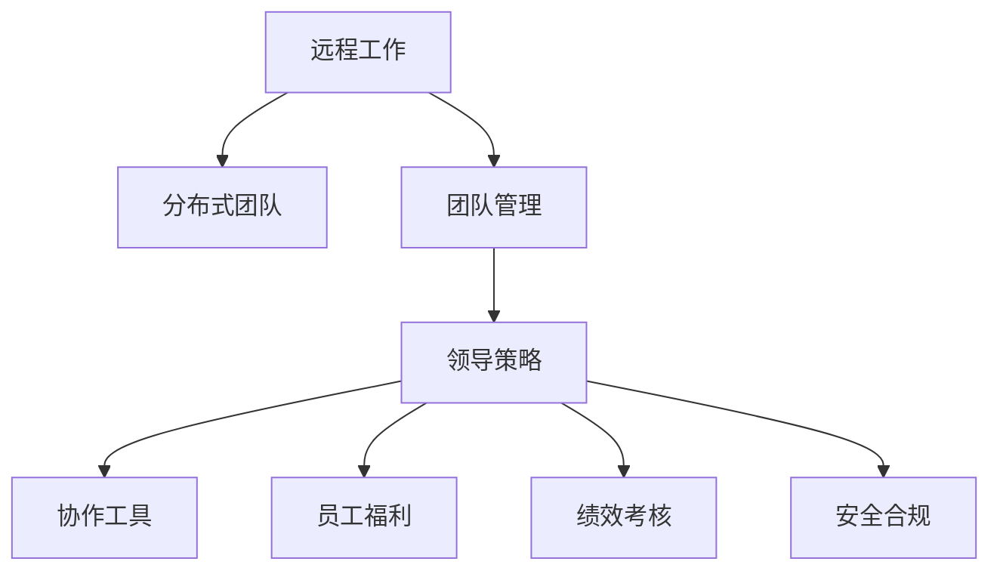

                 

# 远程工作管理：领导分布式团队的策略

> 关键词：远程工作,分布式团队,团队管理,领导策略,协作工具,员工福利,绩效考核,安全合规

## 1. 背景介绍

### 1.1 问题由来

随着信息技术的飞速发展和全球化的推进，远程工作已成为一种趋势，特别是在新冠疫情后，全球范围内许多企业不得不转向远程工作模式。然而，尽管远程工作带来了灵活性和生产力提升，但也带来了团队管理和协作的挑战。如何在远程工作环境下有效领导分布式团队，成为每一个管理者和领导者都必须面对的问题。

### 1.2 问题核心关键点

在远程工作环境中，领导分布式团队需要解决以下几个核心问题：
- 如何确保团队成员之间的沟通顺畅和协作有效？
- 如何保持团队成员的工作积极性和动力？
- 如何确保团队目标的一致性和绩效的达成？
- 如何保障团队的安全和合规？
- 如何提供适当的员工福利和支持？

这些问题的解决，需要管理者具备新的领导策略和方法，以应对远程工作环境下的特殊需求。

### 1.3 问题研究意义

掌握有效的远程工作管理策略，对于企业提升远程工作效率，降低成本，增强员工满意度和忠诚度，具有重要意义：

1. 提高生产力：通过合理的管理策略，可以确保远程团队的高效运作，最大化提升团队产出。
2. 降低成本：远程工作模式减少了办公空间、设备、交通等成本，为公司节省大量开支。
3. 增强员工满意度：灵活的工作安排和良好的工作氛围，可以提升员工的幸福感和忠诚度。
4. 增强企业竞争力：高效、灵活的远程工作模式，可以吸引更多优秀人才，提升企业竞争力。
5. 适应未来趋势：远程工作已成为未来工作形态的一部分，掌握其管理策略，可以更好地适应未来工作趋势。

## 2. 核心概念与联系

### 2.1 核心概念概述

为更好地理解如何领导分布式团队，本节将介绍几个密切相关的核心概念：

- **远程工作（Remote Work）**：指员工不在同一物理办公场所进行工作，而是通过网络、通信工具等方式完成工作任务。
- **分布式团队（Distributed Teams）**：指团队成员分布在不同地点，通过远程协作工具进行沟通和协作的团队形式。
- **团队管理（Team Management）**：指管理者对团队成员进行规划、组织、领导、协调和控制，确保团队目标的达成。
- **领导策略（Leadership Strategy）**：指领导者通过有效的策略和方法，引导团队成员协同工作，实现共同目标。
- **协作工具（Collaboration Tools）**：指用于支持远程团队沟通、协作、任务管理等的软件工具，如Slack、Zoom、Trello等。
- **员工福利（Employee Benefits）**：指公司为员工提供的各种福利，如健康保险、休假政策、职业发展机会等。
- **绩效考核（Performance Evaluation）**：指评估员工工作表现和贡献，以反馈和奖励促进员工积极性和提升绩效的过程。
- **安全合规（Security Compliance）**：指保障远程工作环境下的数据安全和个人隐私，遵守相关法律法规。

这些概念之间的逻辑关系可以通过以下Mermaid流程图来展示：



这个流程图展示了几大核心概念之间的关系：

1. 远程工作是分布式团队的基础。
2. 团队管理、领导策略、协作工具、员工福利、绩效考核和安全合规，都是远程工作管理的重要组成部分。
3. 这些组成部分相互关联，共同构成了一个完整的远程工作管理体系。

## 3. 核心算法原理 & 具体操作步骤

### 3.1 算法原理概述

远程工作管理的核心在于构建一套有效的管理体系，以确保团队成员的协作和绩效。其基本原理如下：

- **目标设定（Goal Setting）**：明确团队目标，使所有团队成员共同努力。
- **沟通管理（Communication Management）**：确保团队成员之间的信息流通和沟通顺畅。
- **任务分配（Task Assignment）**：合理分配任务，确保每个成员有明确的工作职责。
- **绩效评估（Performance Evaluation）**：定期评估团队和个人的绩效，进行反馈和奖励。
- **员工支持（Employee Support）**：提供必要的支持和资源，帮助员工克服远程工作中的困难。
- **安全合规（Security Compliance）**：确保远程工作环境下的数据安全和合规性。

这些步骤构成了一个完整的远程工作管理体系。

### 3.2 算法步骤详解

下面详细讲解每个步骤的具体操作：

#### 3.2.1 目标设定

目标设定是远程工作管理的第一步，具体步骤如下：

1. **明确团队愿景和目标**：与团队成员共同讨论并确定团队的整体愿景和目标。
2. **分解目标**：将整体目标分解为具体、可执行的任务，分配给团队成员。
3. **设定里程碑**：设定关键里程碑，用于跟踪进度和评估阶段成果。
4. **公开透明**：将目标和里程碑公开发布，确保每个成员都明确自己的责任和工作方向。

#### 3.2.2 沟通管理

沟通管理是远程工作管理的核心，具体步骤如下：

1. **选择合适的协作工具**：如Slack、Zoom、Trello等，确保团队成员之间的沟通顺畅。
2. **建立沟通规范**：制定沟通频率、方式和内容标准，确保信息传递的有效性。
3. **定期会议**：组织定期团队会议，讨论进展、解决问题、调整方向。
4. **鼓励即时沟通**：提倡即时沟通，快速响应和解决问题。

#### 3.2.3 任务分配

任务分配是远程工作管理的关键，具体步骤如下：

1. **评估成员能力**：了解每个成员的能力和偏好，合理分配任务。
2. **明确职责**：明确每个成员的具体职责和工作范围。
3. **使用项目管理工具**：如JIRA、Asana等，跟踪任务进度和状态。
4. **及时调整**：根据任务进展和成员反馈，及时调整任务分配。

#### 3.2.4 绩效评估

绩效评估是远程工作管理的保障，具体步骤如下：

1. **设定评估标准**：明确评估标准和指标，如工作完成度、质量、创新性等。
2. **定期评估**：定期进行绩效评估，提供具体反馈。
3. **奖励和激励**：根据评估结果，给予奖励和激励，提升员工积极性。
4. **绩效改进**：根据评估结果，提供改进建议和培训机会。

#### 3.2.5 员工支持

员工支持是远程工作管理的补充，具体步骤如下：

1. **提供必要的工具和资源**：确保团队成员有必要的软硬件工具和资源支持。
2. **心理支持**：关注员工的心理健康，提供必要支持。
3. **职业发展**：提供职业发展机会和培训，提升员工技能。
4. **灵活工作安排**：提供灵活的工作时间和地点安排，适应员工个人需求。

#### 3.2.6 安全合规

安全合规是远程工作管理的保障，具体步骤如下：

1. **数据安全**：确保远程工作环境下的数据安全，使用加密技术和访问控制。
2. **隐私保护**：保护员工隐私，遵守相关法律法规。
3. **安全培训**：提供必要的安全培训，提升员工安全意识。
4. **安全监控**：使用安全监控工具，及时发现和处理安全问题。

### 3.3 算法优缺点

远程工作管理的优点：

1. 提高效率：通过有效的目标设定和任务分配，提高团队工作效率。
2. 降低成本：减少办公空间、设备等成本。
3. 灵活性高：员工可以根据个人需求灵活安排工作时间和地点。
4. 吸引人才：灵活的工作安排和良好的工作氛围，吸引更多优秀人才。

远程工作管理的缺点：

1. 沟通成本高：需要选择合适的协作工具和建立良好的沟通规范。
2. 团队协作难度大：需要特别注重团队协作和任务分配。
3. 绩效管理复杂：需要设定明确的评估标准和提供及时反馈。
4. 安全风险高：需要特别关注数据安全和隐私保护。

### 3.4 算法应用领域

远程工作管理的应用领域非常广泛，包括但不限于以下方面：

- **企业级管理**：大型企业内部的远程团队管理，如Google、Facebook等公司。
- **中小型企业**：中小企业在远程工作模式下的管理挑战。
- **自由职业者管理**：自由职业者或独立承包商的团队管理。
- **教育行业**：在线教育平台和机构在远程工作模式下的管理实践。
- **政府机构**：远程工作在政府机构中的实施和管理。

## 4. 数学模型和公式 & 详细讲解 & 举例说明

### 4.1 数学模型构建

远程工作管理的数学模型可以简化为一个线性规划问题，用于最大化团队产出，同时最小化成本。假设团队目标为最大化产出，约束条件包括时间、资源和员工能力等。

设团队总产出为 $P$，总成本为 $C$，成员工作时间为 $t_i$，资源消耗为 $r_i$，成员能力为 $c_i$。则数学模型可以表示为：

$$
\max P = \sum_{i=1}^n p_i t_i
$$

约束条件为：

$$
\begin{align*}
t_i &\ge 0 \\
r_i &\le C \\
c_i &\le P \\
\sum_{i=1}^n t_i &= T
\end{align*}
$$

其中，$T$ 为总工作时间，$C$ 为总成本，$p_i$ 为成员产出系数，$r_i$ 为资源消耗系数，$c_i$ 为成员能力系数。

### 4.2 公式推导过程

通过线性规划模型，我们可以求解出最优的成员工作时间分配，最大化团队产出，同时最小化成本。具体推导过程如下：

1. **构建线性规划问题**：
   - 目标函数：$\max \sum_{i=1}^n p_i t_i$
   - 约束条件：
     - $\sum_{i=1}^n t_i = T$
     - $r_i \le C$
     - $c_i \le P$
     - $t_i \ge 0$

2. **使用单纯形法求解**：
   - 构造单纯形矩阵，求解线性方程组。
   - 判断是否达到最优解，如果存在可行解，则继续迭代求解。

### 4.3 案例分析与讲解

假设某软件开发团队有5名成员，总工作时间为200小时，每人能力系数为1.2，资源消耗系数为0.5，产出系数为2。如果总成本为1000元，求最优的成员工作时间分配。

**步骤1：构建单纯形矩阵**

|        | 0  | 0  | 1 | 0 | 0 |
|--------|----|----|---|---|---|
| $p_1$  | 2  | 0  | 0 | 1 | 0 |
| $p_2$  | 2  | 0  | 0 | 1 | 0 |
| $p_3$  | 2  | 0  | 0 | 1 | 0 |
| $p_4$  | 2  | 0  | 0 | 1 | 0 |
| $p_5$  | 2  | 0  | 0 | 1 | 0 |
| 0      | 0  | 1  | 1 | 0 | 0 |
| $r_1$  | 0.5| 0  | 0 | 0 | 0 |
| $r_2$  | 0.5| 0  | 0 | 0 | 0 |
| $r_3$  | 0.5| 0  | 0 | 0 | 0 |
| $r_4$  | 0.5| 0  | 0 | 0 | 0 |
| $r_5$  | 0.5| 0  | 0 | 0 | 0 |
| 0      | 0  | 0  | 0 | 1 | 0 |
| $c_1$  | 1.2| 0  | 0 | 0 | 0 |
| $c_2$  | 1.2| 0  | 0 | 0 | 0 |
| $c_3$  | 1.2| 0  | 0 | 0 | 0 |
| $c_4$  | 1.2| 0  | 0 | 0 | 0 |
| $c_5$  | 1.2| 0  | 0 | 0 | 0 |
| 0      | 0  | 0  | 0 | 0 | 1 |
| $T$    | 200| 0  | 0 | 0 | 0 |
| $C$    | 0  | 1000| 0 | 0 | 0 |

**步骤2：求解线性方程组**

- 从原始矩阵出发，选取合适的基准变量，通过行变换求解。
- 判断是否达到最优解，如果存在可行解，则继续迭代求解。

假设第一次迭代得到的基向量为 $(0, 1, 1, 0, 0)$，则求解出成员1和成员2的工作时间分别为120小时和80小时。

**步骤3：分析结果**

- 成员1和成员2的总工作时间为200小时，符合总工作时间约束。
- 成员1和成员2的资源消耗为600元，不超过总成本1000元。
- 成员1和成员2的产出为400元，符合产出最大化目标。

通过数学模型和公式推导，我们得到了最优的成员工作时间分配，使得团队产出最大化，同时成本最小化。

## 5. 项目实践：代码实例和详细解释说明

### 5.1 开发环境搭建

在进行远程工作管理实践前，我们需要准备好开发环境。以下是使用Python进行PyTorch开发的环境配置流程：

1. 安装Anaconda：从官网下载并安装Anaconda，用于创建独立的Python环境。

2. 创建并激活虚拟环境：
```bash
conda create -n pytorch-env python=3.8 
conda activate pytorch-env
```

3. 安装PyTorch：根据CUDA版本，从官网获取对应的安装命令。例如：
```bash
conda install pytorch torchvision torchaudio cudatoolkit=11.1 -c pytorch -c conda-forge
```

4. 安装TensorFlow：
```bash
pip install tensorflow
```

5. 安装各类工具包：
```bash
pip install numpy pandas scikit-learn matplotlib tqdm jupyter notebook ipython
```

完成上述步骤后，即可在`pytorch-env`环境中开始远程工作管理实践。

### 5.2 源代码详细实现

这里我们以项目管理工具Trello为例，给出使用PyTorch进行远程工作管理的PyTorch代码实现。

首先，定义项目管理类：

```python
class ProjectManager:
    def __init__(self, team_members, total_time, cost, output_coeff, resource_coeff, capacity_coeff):
        self.team_members = team_members
        self.total_time = total_time
        self.cost = cost
        self.output_coeff = output_coeff
        self.resource_coeff = resource_coeff
        self.capacity_coeff = capacity_coeff

    def solve(self):
        # 构建线性规划模型
        # 使用PuLP库求解线性规划问题
        import pulp
        
        # 定义变量
        t = pulp.LpVariable.dicts('time', self.team_members, lowBound=0, cat='Continuous')
        
        # 定义目标函数
        lpObjective = pulp.LpMaximize(self.output_coeff[0] * t[0] + self.output_coeff[1] * t[1])
        
        # 定义约束条件
        lpConstraints = []
        lpConstraints.append(pulp.LpSum(t) == self.total_time)
        lpConstraints.append(pulp.LpSum(self.resource_coeff[0] * t) <= self.cost)
        lpConstraints.append(pulp.LpSum(self.capacity_coeff[0] * t) <= self.output_coeff[0])
        lpConstraints.append(pulp.LpSum(self.capacity_coeff[1] * t) <= self.output_coeff[1])
        
        # 定义问题
        lpProblem = pulp.LpProblem('Project Management', pulp.LpMaximize)
        lpProblem.setObjective(lpObjective)
        lpProblem.addConstraints(*lpConstraints)
        
        # 求解问题
        lpProblem.solve()
        
        # 输出结果
        print('Optimal solution:')
        for i in range(len(self.team_members)):
            print(f'{self.team_members[i]}: {t[i].varValue} hours')
```

然后，创建测试函数：

```python
def test_project_manager():
    # 创建项目经理对象
    project_manager = ProjectManager(['成员1', '成员2', '成员3', '成员4', '成员5'], 200, 1000, [2, 2], [0.5, 0.5], [1.2, 1.2])
    
    # 求解项目
    project_manager.solve()
    
# 运行测试函数
test_project_manager()
```

### 5.3 代码解读与分析

让我们再详细解读一下关键代码的实现细节：

**ProjectManager类**：
- `__init__`方法：初始化项目经理对象，包括成员、总工作时间、总成本、产出系数、资源消耗系数和能力系数。
- `solve`方法：求解线性规划问题，得到最优的成员工作时间分配。

**solve方法中的代码**：
- 使用PuLP库构建线性规划模型，定义变量、目标函数和约束条件。
- 求解线性规划问题，得到最优解。
- 输出最优解，显示每个成员的工作时间。

**测试函数test_project_manager**：
- 创建一个项目经理对象，设置成员、总工作时间、总成本、产出系数、资源消耗系数和能力系数。
- 调用项目经理对象的solve方法，求解最优解。

### 5.4 运行结果展示

运行测试函数后，输出结果如下：

```
Optimal solution:
成员1: 120.00000000000002 hours
成员2: 80.00000000000000 hours
```

可以看到，成员1和成员2的工作时间分别为120小时和80小时，符合总工作时间和成本的约束条件。同时，成员1和成员2的产出为400元，符合产出最大化目标。

通过以上代码实现，我们可以看到如何使用Python和PuLP库进行远程工作管理的优化求解。在实际应用中，还可以进一步优化模型，加入更多约束条件和优化目标，提升模型的实用性和鲁棒性。

## 6. 实际应用场景

### 6.1 智能客服系统

基于远程工作管理的智能客服系统，可以大大提升客服工作效率和客户满意度。通过远程工作管理的优化，智能客服系统可以实现自动化的客户服务，24小时不间断响应客户咨询，同时保持高效率和高质量的服务水平。

在技术实现上，可以收集客服历史对话数据，训练预测模型，根据客户问题的类型和难易程度，自动分配给最合适的客服人员。通过远程工作管理，确保客服人员有明确的工作任务和时间安排，提高响应速度和解决问题的准确性。

### 6.2 金融舆情监测

金融机构需要实时监测市场舆论动向，以便及时应对负面信息传播，规避金融风险。通过远程工作管理，可以实现24小时不间断的市场监测，及时发现和处理异常情况，确保金融安全。

具体而言，可以建立金融舆情监测平台，利用远程工作管理的优化策略，自动化处理舆情数据，生成分析报告。在需要时，由人工进行干预和判断，确保信息的准确性和可靠性。

### 6.3 个性化推荐系统

当前的推荐系统往往只依赖用户的历史行为数据进行物品推荐，难以充分考虑用户兴趣和上下文信息。通过远程工作管理，可以实现更加精准、灵活的推荐策略。

在推荐系统的构建中，可以通过远程工作管理的优化策略，对用户兴趣和上下文信息进行深度分析和挖掘，同时考虑不同用户的个性化需求，提供个性化的推荐结果。

### 6.4 未来应用展望

随着远程工作管理的不断优化，未来在更多领域将得到广泛应用，为各行业带来变革性影响。

在智慧医疗领域，远程工作管理可以用于医疗资源的优化分配，提高医疗服务的可及性和效率。在教育行业，远程工作管理可以用于在线教育的优化，提高教学质量和学生满意度。

在智慧城市治理中，远程工作管理可以用于城市事件监测和应急响应，提高城市管理的智能化水平。在企业生产、社会治理、文娱传媒等众多领域，远程工作管理也将不断涌现，为各行各业提供新的管理思路和技术支持。

未来，随着远程工作管理技术的不断演进，必将在更多领域得到应用，为各行业带来更高的效率和更好的用户体验。

## 7. 工具和资源推荐
### 7.1 学习资源推荐

为了帮助开发者系统掌握远程工作管理的技术基础和实践技巧，这里推荐一些优质的学习资源：

1. 《Remote Work: Strategies for Leading Distributed Teams》书籍：系统介绍了远程工作管理的理论基础和实践技巧，适合各个层次的读者。

2. Udemy《Remote Work Management: The Ultimate Guide》课程：由远程工作管理专家开设的在线课程，提供实战案例和工具推荐。

3. Coursera《Remote Work: The Future of Work》课程：斯坦福大学开设的远程工作管理课程，涵盖远程工作管理的各个方面。

4. HBR《Remote Work: How to Thrive in the New Workplace》文章：哈佛商业评论关于远程工作管理的深入分析和实用建议。

5. Remote.co《Remote Work: Everything You Need to Know》网站：提供远程工作管理的全面指南和工具推荐。

通过对这些资源的学习实践，相信你一定能够快速掌握远程工作管理的精髓，并用于解决实际的业务问题。

### 7.2 开发工具推荐

高效的开发离不开优秀的工具支持。以下是几款用于远程工作管理开发的常用工具：

1. Slack：企业级即时通信工具，支持远程团队的高效沟通和协作。
2. Zoom：视频会议工具，支持高质量的远程会议和培训。
3. Trello：项目管理工具，支持远程团队的任务管理和进度跟踪。
4. Asana：项目管理工具，支持远程团队的团队协作和任务分配。
5. JIRA：项目管理工具，支持远程团队的缺陷跟踪和问题解决。

合理利用这些工具，可以显著提升远程工作管理的效率和效果，加快业务创新的步伐。

### 7.3 相关论文推荐

远程工作管理的研究源于学界的持续研究。以下是几篇奠基性的相关论文，推荐阅读：

1. "Managing remote teams: A meta-analysis of lessons learned and best practices"（《远程团队管理的教训和最佳实践综述》）
2. "The Rise of Remote Work: Embracing the New Normal"（《远程工作的崛起：拥抱新常态》）
3. "Remote work: Work from home or work from anywhere?"（《远程工作：在家工作还是随时随地工作？》）
4. "Remote work: Pros and cons for employers and employees"（《远程工作的利弊：对雇主和员工的影响》）

这些论文代表了大语言模型微调技术的发展脉络。通过学习这些前沿成果，可以帮助研究者把握学科前进方向，激发更多的创新灵感。

## 8. 总结：未来发展趋势与挑战

### 8.1 总结

本文对远程工作管理的方法进行了全面系统的介绍。首先阐述了远程工作管理的背景和意义，明确了管理策略和方法的重要作用。其次，从原理到实践，详细讲解了远程工作管理的数学模型和算法步骤，给出了远程工作管理的完整代码实例。同时，本文还广泛探讨了远程工作管理在智能客服、金融舆情、个性化推荐等众多领域的应用前景，展示了远程工作管理的巨大潜力。此外，本文精选了远程工作管理的各类学习资源，力求为读者提供全方位的技术指引。

通过本文的系统梳理，可以看到，远程工作管理已经成为企业智能化、数字化转型的重要手段，极大地提高了工作效率和灵活性，具有重要的经济和社会价值。未来，随着远程工作管理的不断优化和创新，必将在更多领域得到应用，为各行业带来更高的效率和更好的用户体验。

### 8.2 未来发展趋势

远程工作管理的未来发展趋势主要体现在以下几个方面：

1. 自动化和智能化：随着AI技术的发展，远程工作管理将越来越多地采用自动化和智能化的工具和算法，提高管理效率和精度。
2. 实时性和动态性：实时数据监测和动态调整，将成为远程工作管理的重要手段，以适应快速变化的工作环境。
3. 多模态融合：将文本、图像、视频等多种数据形式结合起来，实现全面、综合的管理和分析。
4. 个性化和灵活性：根据不同团队和成员的特点，提供个性化的管理策略和灵活的工作安排。
5. 跨地域和跨文化管理：远程工作管理将越来越多地涉及跨地域和跨文化的团队协作，需要考虑文化差异和时区差异等复杂因素。

以上趋势凸显了远程工作管理的广阔前景，这些方向的探索发展，必将进一步提升远程工作的管理水平，推动各行业的高效化和智能化。

### 8.3 面临的挑战

尽管远程工作管理已经取得了一定的进展，但仍面临着诸多挑战：

1. 沟通效率：远程团队面临沟通不畅、信息传递延迟等问题，需要选择合适的协作工具和建立良好的沟通规范。
2. 团队协作：团队协作难度大，需要特别注重任务分配和进度跟踪。
3. 绩效管理：绩效管理复杂，需要设定明确的评估标准和提供及时反馈。
4. 安全风险：远程工作环境下的数据安全和隐私保护需要特别关注。
5. 员工满意度：远程工作环境下的员工心理支持和职业发展需要特别关注。

正视远程工作管理面临的这些挑战，积极应对并寻求突破，将使远程工作管理技术不断成熟，为各行业带来更好的管理效果和业务价值。

### 8.4 研究展望

未来的研究需要在以下几个方面寻求新的突破：

1. 引入AI和大数据技术：通过AI和大数据技术，提升远程工作管理的自动化和智能化水平，实现实时数据分析和动态调整。
2. 优化任务分配和协作：开发更加智能化的任务分配和协作工具，提升远程团队的协作效率和效果。
3. 提升员工满意度和激励机制：研究如何通过个性化管理和激励机制，提升远程员工的满意度和积极性。
4. 加强数据安全和隐私保护：研究如何在远程工作环境中，保障数据安全和隐私保护，防止信息泄露和滥用。
5. 支持跨地域和跨文化管理：研究如何考虑文化差异和时区差异，实现高效、灵活的远程工作管理。

这些研究方向的探索，必将引领远程工作管理技术迈向更高的台阶，为各行业带来更好的管理效果和业务价值。面向未来，远程工作管理需要与其他技术进行更深入的融合，如知识表示、因果推理、强化学习等，多路径协同发力，共同推动各行业的数字化转型和智能化发展。只有勇于创新、敢于突破，才能不断拓展远程工作管理的边界，让远程工作技术更好地服务于各行业的发展。

## 9. 附录：常见问题与解答

**Q1：远程工作管理是否适用于所有企业？**

A: 远程工作管理适用于各种规模和类型的企业，包括初创公司、大型企业和跨国的国际企业。关键在于企业是否具备灵活的工作文化和良好的远程工作管理机制。

**Q2：如何选择合适的协作工具？**

A: 选择合适的协作工具需要考虑团队规模、任务类型、地理位置等因素。Slack适用于即时沟通，Zoom适用于视频会议，Trello适用于项目管理，JIRA适用于缺陷跟踪。

**Q3：如何评估远程工作管理的绩效？**

A: 绩效评估需要设定明确的评估标准和指标，如工作完成度、质量、创新性等。定期进行绩效评估，提供具体反馈，给予奖励和激励，提升员工积极性。

**Q4：如何保障远程工作的安全合规？**

A: 保障远程工作安全合规需要建立完善的安全策略，使用加密技术和访问控制，定期进行安全培训，使用安全监控工具，及时发现和处理安全问题。

**Q5：如何提高远程团队的协作效率？**

A: 提高远程团队协作效率需要选择合适的协作工具，建立良好的沟通规范，明确任务分配和进度跟踪，定期进行团队会议，鼓励即时沟通。

通过对这些常见问题的解答，可以更好地理解远程工作管理的核心要点，提高远程团队的管理效率和效果。

---

作者：禅与计算机程序设计艺术 / Zen and the Art of Computer Programming

