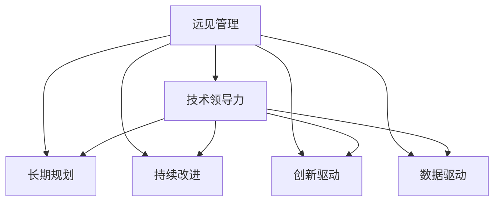

                 

# 远见管理：培养长期战略思维

> 关键词：远见管理, 战略思维, 技术领导力, 长期规划, 持续改进, 创新驱动, 企业治理, 商业智能, 大数据, 人工智能

## 1. 背景介绍

### 1.1 问题由来

在现代商业环境中，企业面临的竞争日益激烈，不确定性日益增加。如何在充满变化的市场中保持竞争力，如何制定长期的战略规划，成为了所有企业高层管理人员必须面对的问题。与此同时，技术在各行各业的作用愈发重要，如何有效地利用技术来支持企业发展战略，成为了技术领导者的重要使命。

近年来，随着人工智能(AI)、大数据、区块链等新兴技术的兴起，企业需要更强的技术领导力来应对这些变化。传统的以短期盈利为核心的管理方式，已经无法满足未来企业的发展需求。企业需要一种新的管理思维方式，能够在复杂多变的环境中保持长期的竞争力。

### 1.2 问题核心关键点

远见管理（Visionary Management）强调通过高瞻远瞩、前瞻性的思维来指导企业的长期发展，避免了短视行为导致的长期损失。在远见管理中，技术领导力扮演着至关重要的角色，需要掌握如何在复杂多变的技术环境中制定和执行长期战略规划。

具体来说，远见管理的关键点包括：
- 前瞻性思维：具备长远眼光，理解未来技术趋势，能够预见潜在风险和机会。
- 持续改进：在技术快速发展的环境中，不断进行自我更新和优化，保持竞争优势。
- 创新驱动：以技术创新为核心，持续推动企业向前发展。
- 数据驱动：利用大数据、商业智能工具，全面掌握市场动态和用户需求。

## 2. 核心概念与联系

### 2.1 核心概念概述

为了更好地理解远见管理，本节将介绍几个密切相关的核心概念：

- **远见管理（Visionary Management）**：一种基于前瞻性思维的管理方式，强调长期战略规划，避免短视行为。
- **技术领导力（Technical Leadership）**：利用技术能力来推动企业战略的实施，具备技术前瞻性思维和执行力的能力。
- **长期规划（Long-term Planning）**：制定超越短期目标的战略计划，注重企业的可持续发展。
- **持续改进（Continuous Improvement）**：在技术环境中不断进行优化和改进，保持竞争优势。
- **创新驱动（Innovation-Driven）**：以技术创新为核心，推动企业发展。
- **数据驱动（Data-Driven）**：利用数据和商业智能工具，全面掌握市场动态和用户需求。

这些核心概念之间的逻辑关系可以通过以下Mermaid流程图来展示：



这个流程图展示了几大核心概念之间的关系：

1. 远见管理是整个管理过程的基石，强调前瞻性和长期视角。
2. 技术领导力是实现远见管理的关键，需要具备前瞻性思维和执行力。
3. 长期规划、持续改进、创新驱动和数据驱动都是实现远见管理的具体方法。

## 3. 核心算法原理 & 具体操作步骤

### 3.1 算法原理概述

远见管理强调通过高瞻远瞩、前瞻性的思维来指导企业的长期发展。其核心在于理解未来技术趋势，预见潜在风险和机会，制定出能够应对未来变化的长期战略规划。

形式化地，假设企业当前的状态为 $S_t$，面临的未来状态为 $S_{t+1}$，则远见管理的目标是最小化未来风险，即：

$$
\min_{\pi} \mathbb{E}[R(S_{t+1}, \pi)]
$$

其中 $\pi$ 为企业的长期策略，$R(S_{t+1}, \pi)$ 为策略 $\pi$ 在状态 $S_{t+1}$ 下的预期回报。

### 3.2 算法步骤详解

远见管理的具体操作步骤包括以下几个关键步骤：

**Step 1: 收集和分析数据**

- 收集市场、行业、技术等方面的数据，理解当前和未来的发展趋势。
- 分析数据，识别出潜在的机会和风险，形成数据驱动的洞察。

**Step 2: 制定战略规划**

- 根据数据驱动的洞察，制定长期战略规划，设定未来发展目标。
- 制定具体的执行步骤和时间表，确保战略规划的可操作性。

**Step 3: 执行和监控**

- 按照战略规划执行，确保每个阶段的目标都得到实现。
- 实时监控战略执行情况，根据变化及时调整策略。

**Step 4: 持续改进**

- 定期评估战略执行效果，发现问题并及时改进。
- 不断进行创新，提高企业的适应性和竞争力。

**Step 5: 评估和反馈**

- 定期评估战略实施效果，进行结果反馈和总结。
- 根据评估结果，优化未来战略规划。

### 3.3 算法优缺点

远见管理的优点包括：
1. 前瞻性强：通过数据分析和市场洞察，能够预测未来的变化，制定更加有针对性的战略规划。
2. 风险控制：提前识别潜在的风险，采取措施避免或减轻影响。
3. 长期稳定性：避免短期行为导致的长期损失，实现可持续发展。
4. 持续改进：不断进行优化和改进，保持企业的竞争优势。

同时，远见管理也存在一些局限性：
1. 数据依赖性：需要大量的数据支持，数据质量和完整性对决策影响较大。
2. 执行难度：长期战略的实施需要时间，短期内可能难以看到明显效果。
3. 变化频繁：市场和技术环境的变化较快，需要持续关注和调整。
4. 资源投入：制定和执行长期战略需要大量的人力和物力投入。

尽管存在这些局限性，但远见管理在应对长期和复杂环境变化方面具有不可替代的优势，是企业长期发展的重要保障。

### 3.4 算法应用领域

远见管理适用于各种行业和规模的企业，特别是那些需要长期规划和前瞻性决策的领域。以下是几个具体的应用场景：

- **高科技企业**：科技日新月异，远见管理能够帮助企业保持技术领先地位。
- **金融行业**：金融市场波动较大，远见管理能够帮助企业提前识别风险，制定风险应对策略。
- **制造业**：制造业面临的技术变革和市场需求变化较快，远见管理能够帮助企业制定适应未来的制造战略。
- **医疗保健**：医疗技术发展迅猛，远见管理能够帮助企业把握技术趋势，提高医疗服务质量。
- **教育行业**：教育需求和内容不断变化，远见管理能够帮助学校和教育机构制定适应未来教育模式的战略。

## 4. 数学模型和公式 & 详细讲解 & 举例说明

### 4.1 数学模型构建

在远见管理中，核心目标是制定能够应对未来变化的长期战略规划。数学模型可以从以下几个方面构建：

- **风险评估模型**：评估未来可能面临的风险，形成风险矩阵。
- **趋势预测模型**：利用数据和算法预测未来市场和技术趋势。
- **战略优化模型**：基于风险评估和趋势预测结果，优化长期战略规划。

### 4.2 公式推导过程

以风险评估模型为例，假设企业面临 $n$ 种潜在风险 $R_1, R_2, ..., R_n$，每种风险的概率为 $p_i$，风险造成的损失为 $l_i$，则风险评估模型的目标是最小化总损失，即：

$$
\min_{p} \sum_{i=1}^n p_i l_i
$$

其中 $p$ 为风险概率向量，满足 $0 \leq p_i \leq 1$ 且 $\sum_{i=1}^n p_i = 1$。

利用拉格朗日乘数法，可以求解出最优的风险概率向量 $p^*$，进而得到最小化总损失的风险评估结果。

### 4.3 案例分析与讲解

**案例：某科技公司风险评估**

某科技公司面临三种潜在风险：市场需求波动、技术变革、竞争对手威胁。通过数据收集和分析，得到每种风险的概率和损失如下：

| 风险 | 概率 $p_i$ | 损失 $l_i$ |
| --- | --- | --- |
| 市场需求波动 | 0.3 | 100万元 |
| 技术变革 | 0.2 | 50万元 |
| 竞争对手威胁 | 0.4 | 30万元 |

使用上述风险评估模型，可以计算出最优的风险概率向量 $p^*$，得到最小化总损失的期望风险值。该期望风险值可以作为公司制定风险应对策略的依据。

## 5. 项目实践：代码实例和详细解释说明

### 5.1 开发环境搭建

在进行远见管理实践前，我们需要准备好开发环境。以下是使用Python进行数据分析和风险评估的环境配置流程：

1. 安装Anaconda：从官网下载并安装Anaconda，用于创建独立的Python环境。

2. 创建并激活虚拟环境：
```bash
conda create -n visionary-env python=3.8 
conda activate visionary-env
```

3. 安装PyTorch：根据CUDA版本，从官网获取对应的安装命令。例如：
```bash
conda install pytorch torchvision torchaudio cudatoolkit=11.1 -c pytorch -c conda-forge
```

4. 安装Pandas、Numpy等数据处理库：
```bash
pip install pandas numpy matplotlib scikit-learn
```

完成上述步骤后，即可在`visionary-env`环境中开始风险评估实践。

### 5.2 源代码详细实现

以下是一个简单的风险评估模型的Python代码实现：

```python
import numpy as np
from scipy.optimize import linprog

# 定义风险参数
probabilities = np.array([0.3, 0.2, 0.4])
losses = np.array([100, 50, 30])

# 构建线性规划问题
c = np.zeros(probabilities.size) # 目标函数系数
A = np.eye(probabilities.size) # 约束矩阵
b = np.ones(probabilities.size) # 约束等式
x0_bounds = (0, 1) # 风险概率的下限和上限
x1_bounds = (0, 1) # 风险概率的下限和上限

# 求解线性规划
res = linprog(c, A_ub=A, b_ub=b, bounds=(x0_bounds, x1_bounds))
risk_min = np.dot(res.x, losses)
risk_min
```

这段代码实现了风险评估模型的求解，具体步骤包括：
1. 定义风险参数和损失矩阵。
2. 构建线性规划问题，目标函数为0（最小化），约束条件为风险概率向量非负且和为1。
3. 使用scipy库中的linprog函数求解线性规划，得到最优的风险概率向量。
4. 计算最小化总损失的风险值。

### 5.3 代码解读与分析

让我们再详细解读一下关键代码的实现细节：

**风险参数定义**：
- `probabilities`：定义每种风险的概率向量，假设风险数量为3。
- `losses`：定义每种风险的损失矩阵，假设损失数量为3。

**线性规划构建**：
- `c`：目标函数系数，由于最小化总损失，系数为0。
- `A`：约束矩阵，确保风险概率向量非负且和为1。
- `b`：约束等式，确保风险概率向量满足约束条件。
- `x0_bounds`和`x1_bounds`：定义风险概率向量的下限和上限，确保概率值在合理范围内。

**求解线性规划**：
- `linprog`：使用scipy库中的线性规划求解器，求解目标函数最小化的线性规划问题。
- `res`：返回的结果对象，包含最优解向量、约束矩阵、目标函数值等。
- `risk_min`：计算最小化总损失的风险值，即为最终的风险评估结果。

**风险评估结果**：
- `risk_min`：最优的风险值，表示企业在当前情况下面临的总风险期望。

可以看到，利用Python和Scipy库，可以很方便地进行风险评估模型的求解，为企业的战略规划提供数据支持。

## 6. 实际应用场景

### 6.1 风险管理

风险管理是企业战略规划的重要组成部分。在复杂多变的环境中，企业需要提前识别和评估潜在风险，制定有效的应对策略。

以金融行业为例，银行可以通过远见管理来评估信用风险、市场风险、流动性风险等，制定相应的风险控制措施。例如，银行可以定期进行信用评估，识别出高风险客户，采取提前催收、提高贷款利率等措施，降低信用风险。同时，银行可以建立市场风险监控系统，实时分析市场波动，根据风险情况调整投资组合，降低市场风险。

### 6.2 技术创新

技术创新是企业长期发展的关键驱动力。企业需要前瞻性地布局技术研发，避免被技术变革淘汰。

例如，某科技公司可以采用远见管理来制定技术研发战略。公司可以分析行业技术趋势，评估未来技术发展方向，制定相应的技术路线图。同时，公司可以设定技术创新目标，定期进行技术评估，确保技术研发方向符合公司战略。

### 6.3 产品规划

产品规划是企业战略规划的重要组成部分，决定着企业未来的市场竞争力和盈利能力。企业需要通过远见管理来制定前瞻性的产品规划。

以消费电子行业为例，某电子产品公司可以采用远见管理来规划未来产品线。公司可以分析市场需求和技术趋势，识别出未来的技术热点和消费趋势，制定相应的产品规划。同时，公司可以设定产品研发目标，定期进行产品评估，确保产品规划符合市场和战略需求。

## 7. 工具和资源推荐

### 7.1 学习资源推荐

为了帮助企业高层管理人员掌握远见管理的核心思想和实践方法，这里推荐一些优质的学习资源：

1. **《远见管理》（Visionary Management）**：一本关于远见管理的经典书籍，详细介绍了远见管理的理论基础和实践方法。
2. **《领导力转型》（Leadership Transformations）**：一本关于领导力发展的书籍，介绍了如何培养前瞻性思维和长期战略能力。
3. **《创新驱动的组织》（Innovation-Driven Organization）**：一本关于创新管理的书籍，介绍了如何通过创新驱动企业发展。
4. **Coursera的“远见管理”课程”（Visionary Management）**：由知名管理专家授课，涵盖远见管理的基本概念和具体实践。
5. **Harvard Business Review的文章”（哈佛商业评论的文章）**：哈佛商学院的专家文章，深入探讨远见管理的理论和实践。

通过这些资源的学习，相信企业高层管理人员能够更好地掌握远见管理的精髓，提升企业战略规划的能力。

### 7.2 开发工具推荐

高效的开发离不开优秀的工具支持。以下是几款用于远见管理开发的常用工具：

1. **Anaconda**：用于创建独立的Python环境，方便进行数据分析和模型开发。
2. **Jupyter Notebook**：免费的交互式编程环境，支持Python和R等多种语言。
3. **PyTorch**：用于深度学习模型开发，支持复杂的数学计算和深度学习算法。
4. **Scipy**：用于科学计算和数据处理，包含丰富的数学和统计函数。
5. **TensorFlow**：用于机器学习和深度学习模型开发，支持分布式计算和模型优化。

合理利用这些工具，可以显著提升远见管理任务的开发效率，加快创新迭代的步伐。

### 7.3 相关论文推荐

远见管理的研究涉及多个领域，涵盖了战略管理、组织行为、创新管理等多个学科。以下是几篇奠基性的相关论文，推荐阅读：

1. **“远见管理”（Visionary Management）**：Gary Hamel和C.K. Prahalad的开创性论文，介绍了远见管理的核心思想和实践方法。
2. **“风险评估”（Risk Assessment）**：Richard A. DeMierelle和James J. Prybutok的论文，介绍了如何使用数学模型进行风险评估。
3. **“技术创新”（Technological Innovation）**：George Merrikhi和Shahid M. Ali的论文，介绍了技术创新的驱动因素和成功因素。
4. **“产品规划”（Product Planning）**：Michael A. Cusumano和Oren L. Itzkowitz的论文，介绍了如何通过产品规划提升企业竞争力和市场份额。

这些论文代表了远见管理的发展脉络，通过学习这些前沿成果，可以帮助企业高层管理人员更好地理解远见管理的精髓，提升企业战略规划的水平。

## 8. 总结：未来发展趋势与挑战

### 8.1 总结

本文对远见管理进行了全面系统的介绍。首先阐述了远见管理的背景和重要性，明确了技术领导力在远见管理中的关键作用。其次，从原理到实践，详细讲解了远见管理的数学模型和操作步骤，给出了风险评估的代码实例。同时，本文还广泛探讨了远见管理在风险管理、技术创新、产品规划等多个领域的应用场景，展示了远见管理的广阔前景。最后，本文精选了远见管理的各类学习资源，力求为读者提供全方位的技术指引。

通过本文的系统梳理，可以看到，远见管理作为一种前瞻性管理方式，能够帮助企业在复杂多变的环境中保持长期的竞争力。随着技术的发展和市场的变化，远见管理将不断创新和演进，成为企业发展的重要保障。

### 8.2 未来发展趋势

展望未来，远见管理将呈现以下几个发展趋势：

1. **数据驱动的决策**：随着大数据和商业智能技术的成熟，远见管理将更加依赖数据驱动的决策，提高决策的科学性和准确性。
2. **智能化分析**：远见管理将利用人工智能技术，进行更深入的数据分析和趋势预测，提升战略规划的前瞻性和准确性。
3. **跨部门协作**：远见管理将促进不同部门之间的协作，实现资源共享和协同创新，提高企业的整体竞争力。
4. **动态调整**：远见管理将不断根据市场变化进行动态调整，确保战略规划的灵活性和适应性。
5. **全球化视野**：远见管理将更加注重全球化视角，理解全球市场和技术趋势，制定全球化的战略规划。

以上趋势凸显了远见管理在应对未来复杂环境变化中的重要性和发展方向。

### 8.3 面临的挑战

尽管远见管理在企业战略规划中具有重要价值，但在实际应用中仍面临一些挑战：

1. **数据质量问题**：数据的完整性和准确性对远见管理的效果影响较大，企业需要投入大量资源进行数据清洗和处理。
2. **文化阻力**：远见管理需要高层管理者的高度支持，一些企业可能面临文化和组织结构的阻力。
3. **资源投入高**：远见管理需要投入大量的人力、物力和财力，对于一些中小企业来说，成本较高。
4. **执行难度大**：远见管理的目标和步骤较为复杂，需要长期的执行和监控，可能面临执行不力的风险。

### 8.4 研究展望

面对远见管理面临的挑战，未来的研究需要在以下几个方面寻求新的突破：

1. **数据质量提升**：开发更高效的数据清洗和处理算法，提高数据的准确性和完整性。
2. **文化变革**：推广远见管理的理念，促进企业文化的变革，提升高层管理者的前瞻性思维。
3. **资源优化**：采用更高效的工具和方法，降低远见管理的企业资源投入。
4. **执行改进**：改进远见管理的执行流程，增强战略规划的可操作性和灵活性。

这些研究方向的探索，必将引领远见管理技术迈向更高的台阶，为构建前瞻性、可持续发展的企业提供坚实的理论基础和实践指导。

## 9. 附录：常见问题与解答

**Q1: 远见管理是否适用于所有企业？**

A: 远见管理适用于具有复杂多变环境的企业，特别是那些需要长期规划和前瞻性决策的领域。对于一些小规模企业或传统行业，远见管理可能需要根据实际情况进行调整和优化。

**Q2: 远见管理需要哪些关键资源？**

A: 远见管理需要高层管理者的支持、数据驱动的决策、跨部门协作等关键资源。企业需要投入大量的人力、物力和财力，才能实现远见管理的目标。

**Q3: 如何评估远见管理的实施效果？**

A: 可以通过定期进行战略评估和绩效评估，衡量战略规划的效果。同时，可以建立反馈机制，收集员工的意见和建议，不断改进战略规划。

**Q4: 远见管理与传统管理方式有何不同？**

A: 远见管理强调前瞻性思维和长期规划，而传统管理方式更多关注短期利益和当下决策。远见管理能够帮助企业应对未来的变化，实现可持续发展。

**Q5: 如何培养远见管理的能力？**

A: 通过系统的学习、实践和反思，逐步培养前瞻性思维和长期规划能力。企业可以设立专门的远见管理团队，负责战略规划和执行。

---

作者：禅与计算机程序设计艺术 / Zen and the Art of Computer Programming

