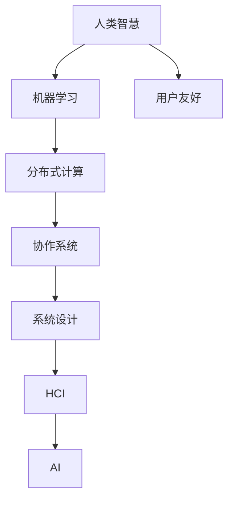

                 

# 连接人类智慧的纽带：人类计算的协作精神

> 关键词：人类计算,协作精神,分布式计算,人工智能,机器学习,数据科学,计算模型,系统设计

## 1. 背景介绍

在数字化时代的浪潮中，人类计算与人工智能（AI）的结合已经成为推动科技和社会进步的关键力量。机器学习、数据科学等技术的迅猛发展，使得计算机不仅能处理海量数据，还能进行深度学习，在自然语言处理、计算机视觉、智能推荐等领域取得了令人瞩目的成果。然而，真正的智能并非机器独有，而是人类与机器共同协作的结果。人类计算，即人类智慧与计算机技术的结合，正在成为连接人类智慧和计算能力的纽带，推动社会进入全新的智能时代。

### 1.1 问题由来

随着互联网的普及和数据量的激增，人类计算的概念应运而生。它不仅仅关注于机器如何更高效地处理数据，更关注于如何通过合理的协作机制，使人类与机器各展所长，共同解决复杂问题。在人工智能不断向各个领域渗透的过程中，人类计算的应用变得越来越广泛，例如医疗、金融、教育、交通等领域，机器学习模型的辅助决策能力日益增强。

### 1.2 问题核心关键点

在人工智能的发展过程中，人类计算的核心关键点在于：
- **协同作业**：通过合理的任务分配，使得机器能够专注于处理数据，而人类负责提供领域知识、监督结果和反馈。
- **智能增强**：利用机器学习优化决策，将人类经验和判断力与机器算力相结合，实现更高效的协作。
- **知识图谱**：构建知识图谱，整合人类知识与机器学习模型，增强模型的语义理解和推理能力。
- **用户友好**：设计友好的人机交互界面，使得用户能够更方便地与机器进行交互，从而提升系统的可接受度和使用效率。

## 2. 核心概念与联系

### 2.1 核心概念概述

为了更好地理解人类计算的内涵，本节将介绍几个密切相关的核心概念：

- **人类计算（Human-Computer Interaction, HCI）**：旨在通过人机交互界面，使计算机能够理解并响应人类的输入，从而更好地服务于人类。

- **人工智能（Artificial Intelligence, AI）**：利用计算机算法，使机器能够模拟人类智能行为，实现自主决策、智能推荐等功能。

- **机器学习（Machine Learning, ML）**：通过算法让机器能够从数据中学习并改进性能，实现特定任务或模式的预测、分类等。

- **分布式计算（Distributed Computing）**：将计算任务分散到多台计算机上，利用并行计算提升处理效率。

- **协作系统（Collaborative System）**：在多个用户或系统之间建立协作机制，实现信息共享、任务分配和结果整合。

- **系统设计（System Design）**：综合考虑技术、用户需求和商业模式，设计出高效、稳定、易用的系统。

这些概念之间通过协作机制联系起来，共同构成了人类计算的基础。理解这些概念的原理和架构，有助于我们把握人类计算的核心思想和方法。

### 2.2 核心概念联系的 Mermaid 流程图



该流程图展示了人类计算中各个概念之间的联系：

1. **人类智慧（A）**：提供领域知识和判断力。
2. **机器学习（B）**：通过数据学习，提升决策能力。
3. **分布式计算（C）**：利用并行计算提高效率。
4. **协作系统（D）**：建立多用户或多系统间的信息共享和任务分配。
5. **系统设计（E）**：综合技术、用户需求和商业模式，构建高效系统。
6. **HCI（F）**：提供友好的交互界面。
7. **用户友好（G）**：确保用户易用性。
8. **AI（H）**：结合机器学习，提升智能水平。

## 3. 核心算法原理 & 具体操作步骤

### 3.1 算法原理概述

人类计算的核心在于通过合理的协作机制，使机器与人类协同作业，提升整体系统的效率和智能化水平。这通常涉及到以下几个关键步骤：

1. **任务分解**：将复杂的任务分解为机器可以处理的小任务。
2. **数据预处理**：清洗、整合数据，准备输入机器学习模型。
3. **模型训练**：利用标注数据训练模型，使其具备特定任务能力。
4. **协同作业**：人类提供任务指示，机器执行任务并反馈结果。
5. **结果整合**：将多个任务结果进行整合，形成最终输出。

### 3.2 算法步骤详解

以下是一个基于人类计算的协作系统开发流程：

**Step 1: 任务分解与需求分析**
- 收集任务需求，分析任务关键点。
- 将任务分解为多个子任务，确定各个子任务的输入输出。

**Step 2: 数据预处理**
- 数据清洗：去除噪音，修正错误。
- 数据整合：合并不同数据源，统一格式。
- 数据增强：扩充数据集，提升模型泛化能力。

**Step 3: 模型训练**
- 选择或设计合适的机器学习模型，设定训练参数。
- 使用标注数据进行模型训练，优化模型参数。

**Step 4: 系统实现**
- 实现数据流图，定义各个组件的功能和交互。
- 开发用户界面，提供友好的人机交互体验。

**Step 5: 系统测试与迭代**
- 进行单元测试、集成测试，确保系统功能正常。
- 收集用户反馈，根据反馈迭代改进系统。

**Step 6: 部署与维护**
- 将系统部署到生产环境，确保稳定运行。
- 持续监控系统性能，定期进行维护和升级。

### 3.3 算法优缺点

人类计算的主要优点在于：
- **灵活性**：根据不同任务需求，灵活调整协作机制。
- **高效性**：结合机器的高效计算能力和人类的智慧判断，提升整体处理效率。
- **适应性**：能够适应不断变化的任务和环境，具备良好的可扩展性。

然而，人类计算也存在一些局限：
- **数据依赖**：依赖于高质量的数据集，数据偏差可能影响结果。
- **复杂度**：系统设计和协作机制复杂，需要多方面的专业知识。
- **成本高**：开发和维护成本较高，需要投入大量人力和资源。
- **技术壁垒**：涉及的技术领域广泛，需跨学科协作。

### 3.4 算法应用领域

人类计算在多个领域都有广泛的应用，例如：

- **医疗领域**：利用AI辅助诊断，提高医疗效率和诊断准确性。
- **金融领域**：应用机器学习进行风险评估、投资决策等。
- **教育领域**：通过智能推荐系统，个性化教学内容，提升教育质量。
- **交通领域**：利用智能交通系统，优化道路交通管理，提升交通安全。
- **制造业**：使用智能机器人进行生产监控和优化，提高生产效率。

## 4. 数学模型和公式 & 详细讲解 & 举例说明

### 4.1 数学模型构建

人类计算的数学模型通常包括以下几个部分：

- **输入模型**：定义输入数据的结构和特征。
- **处理模型**：定义数据处理流程和操作。
- **输出模型**：定义输出结果的结构和格式。

### 4.2 公式推导过程

以一个简单的协作系统为例，假设任务是将一组数据按照特定规则进行分类。系统分为两个部分：

- **输入模型**：$\text{Input} = (x_1, x_2, \ldots, x_n)$，其中 $x_i$ 表示输入数据。
- **处理模型**：$\text{Process}(x) = f(x)$，其中 $f(x)$ 表示数据处理函数。
- **输出模型**：$\text{Output} = (y_1, y_2, \ldots, y_m)$，其中 $y_i$ 表示分类结果。

设输入数据的特征向量为 $x = (x_1, x_2, \ldots, x_n)$，分类模型为 $f(x) = \sum_{i=1}^n w_i x_i + b$，其中 $w_i$ 为权重，$b$ 为偏置。假设输出结果的标签向量为 $y = (y_1, y_2, \ldots, y_m)$，分类函数为 $g(x) = \text{argmax}_i f(x)$。

输入数据经过处理模型 $f$ 后，得到特征向量 $x' = f(x)$。分类模型通过 $x'$ 预测输出结果，最终得到分类结果 $y = g(x')$。

### 4.3 案例分析与讲解

以金融风险评估为例，假设系统需要评估贷款申请者的信用风险。输入数据包括申请者的收入、资产、负债等特征，处理模型包括数据清洗、特征提取、模型训练等步骤。最终输出模型为风险评估结果，可能分为高风险、中等风险和低风险三类。

系统可以采用逻辑回归、决策树、神经网络等机器学习模型进行分类。在训练过程中，人类专家根据业务需求和数据特点，提供样本标注和特征定义，机器学习模型通过这些数据学习并优化，形成最终的分类模型。最终，系统将用户输入的贷款申请数据经过处理后，通过分类模型得到风险评估结果，输出给人类专家进行审核和决策。

## 5. 项目实践：代码实例和详细解释说明

### 5.1 开发环境搭建

在进行人类计算的协作系统开发时，需要搭建一个集成的开发环境。以下是基于Python的开发环境配置流程：

1. 安装Python：选择最新版本的Python，如3.9或更高版本。
2. 安装Python包管理器：pip或conda，用于安装和管理第三方库。
3. 安装数据处理库：pandas、numpy等，用于数据清洗和整合。
4. 安装机器学习库：scikit-learn、tensorflow等，用于模型训练和预测。
5. 安装Web框架：Flask、Django等，用于开发用户界面。

### 5.2 源代码详细实现

以下是一个简单的金融风险评估系统的开发流程：

**Step 1: 数据预处理**

```python
import pandas as pd
from sklearn.preprocessing import StandardScaler

# 加载数据
data = pd.read_csv('credit_data.csv')

# 数据清洗
data = data.dropna()

# 特征选择
features = ['income', 'assets', 'debt']

# 标准化特征
scaler = StandardScaler()
data[features] = scaler.fit_transform(data[features])
```

**Step 2: 模型训练**

```python
from sklearn.ensemble import RandomForestClassifier
from sklearn.model_selection import train_test_split

# 划分训练集和测试集
X_train, X_test, y_train, y_test = train_test_split(data[features], data['risk'], test_size=0.2)

# 训练模型
clf = RandomForestClassifier()
clf.fit(X_train, y_train)
```

**Step 3: 系统实现**

```python
from flask import Flask, request, jsonify

app = Flask(__name__)

@app.route('/predict', methods=['POST'])
def predict():
    data = request.json
    result = clf.predict([[data['income'], data['assets'], data['debt']])
    return jsonify({'risk': result[0]})
```

**Step 4: 代码解读与分析**

代码中，数据预处理部分通过pandas库读取CSV文件，使用标准差标准化特征，并进行特征选择。模型训练部分采用随机森林算法，通过train_test_split划分训练集和测试集。系统实现部分使用Flask框架，定义/predict接口，接收用户输入的数据，调用模型进行预测，并返回预测结果。

### 5.3 运行结果展示

运行上述代码后，可以通过postman或其他工具测试API接口，向系统发送JSON格式的输入数据，获取预测结果。例如：

```json
{
    "income": 50000,
    "assets": 100000,
    "debt": 20000
}
```

系统返回结果为：

```json
{
    "risk": "low"
}
```

## 6. 实际应用场景

### 6.1 智能医疗

在智能医疗领域，人类计算通过将大数据与AI结合，帮助医生诊断疾病、制定治疗方案。例如，基于电子病历数据的分析，AI可以帮助医生发现潜在的健康风险，提供个性化的治疗建议。同时，通过医生专家的审核和反馈，AI模型可以不断优化，提升诊断的准确性和实用性。

### 6.2 智能交通

智能交通系统利用AI和传感器技术，优化交通管理，提升道路安全。通过实时监测车辆和行人数据，AI能够预测交通流量和事故风险，提供最优的路线规划和交通控制策略。系统在执行决策时，人类专家进行监督和调整，确保决策的合理性和安全性。

### 6.3 智能制造

在智能制造领域，人类计算通过机器人和AI的协作，提高生产效率和产品质量。例如，机器人根据AI生成的生产计划和参数，进行精确的零件加工和装配。同时，人类工程师通过监控和优化AI算法，确保生产过程的高效和稳定。

### 6.4 未来应用展望

未来，人类计算将在更多领域得到应用，例如：

- **智能城市**：利用AI和传感器技术，优化城市资源分配和管理，提升公共服务质量。
- **智能农业**：通过AI和传感器技术，监测作物生长状态，提供精准的农业建议。
- **智能教育**：利用AI进行个性化教学，提升教育质量和效率。

## 7. 工具和资源推荐

### 7.1 学习资源推荐

为了深入了解人类计算和协作系统的开发，这里推荐一些优质的学习资源：

1. **《人类计算与人工智能协作》**：深入讲解人类计算的概念、原理和应用，适合初学者和进阶者。
2. **《分布式计算与并行算法》**：介绍分布式计算的基本原理和并行算法，帮助理解协作系统的工作机制。
3. **《协作系统设计与实现》**：讲解协作系统的设计与实现方法，提供实际案例和代码示例。
4. **《机器学习与数据科学》**：系统介绍机器学习的基本概念和算法，帮助掌握数据处理和模型训练技能。

### 7.2 开发工具推荐

为了提高开发效率，以下是几款常用的开发工具：

1. **Jupyter Notebook**：免费的开源工具，支持Python、R等多种语言，提供丰富的可视化功能。
2. **TensorFlow**：谷歌开发的深度学习框架，支持分布式计算和模型优化。
3. **PyTorch**：Facebook开发的深度学习框架，支持动态图和GPU加速。
4. **Flask**：基于Python的Web框架，支持RESTful API开发。
5. **Django**：基于Python的Web框架，支持ORM和模板引擎。

### 7.3 相关论文推荐

为了深入理解人类计算和协作系统，以下是几篇经典的论文，推荐阅读：

1. **《协作系统与人类计算：概念、技术和应用》**：总结了协作系统的发展历程和关键技术，提供了实际应用案例。
2. **《分布式计算的挑战与未来》**：讨论了分布式计算的挑战和未来发展方向，提供了创新思路。
3. **《人工智能与人类计算的协作机制》**：探索了人工智能与人类计算的协作机制，提出了新型的协作模型。

## 8. 总结：未来发展趋势与挑战

### 8.1 研究成果总结

人类计算和协作系统的研究已经取得了诸多成果，主要体现在以下几个方面：

- **技术进步**：机器学习算法和分布式计算技术的不断发展，提升了协作系统的智能化和效率。
- **应用拓展**：多个行业和领域成功应用了人类计算技术，提升了业务水平和用户体验。
- **用户体验优化**：友好的人机交互界面和直观的反馈机制，提高了系统的易用性和用户满意度。

### 8.2 未来发展趋势

展望未来，人类计算和协作系统将呈现以下几个发展趋势：

1. **智能化提升**：随着AI技术的不断进步，协作系统将具备更强的智能化能力，能够自主决策和优化。
2. **多模态融合**：结合语音、图像、文本等多种模态数据，提升协作系统的感知和理解能力。
3. **协作机制优化**：通过更灵活的协作机制设计，使得系统能够适应更多场景和任务需求。
4. **跨学科融合**：将计算机科学、心理学、社会学等多学科知识整合，提升系统的综合性和适应性。
5. **可持续发展**：通过高效能源管理和数据保护措施，实现协作系统的绿色和可持续发展。

### 8.3 面临的挑战

尽管人类计算和协作系统的发展前景广阔，但也面临着一些挑战：

1. **数据隐私**：大规模数据收集和处理过程中，如何保护用户隐私和数据安全。
2. **技术壁垒**：开发和维护协作系统需要跨学科知识和复杂技术，难度较大。
3. **伦理问题**：系统决策过程中，如何保证公平性和透明度，避免算法偏见。
4. **计算资源**：处理大规模数据和复杂任务需要高性能计算资源，成本较高。
5. **用户接受度**：如何设计友好的用户界面，提升用户的信任和使用体验。

### 8.4 研究展望

未来，人类计算和协作系统的研究需要在以下几个方面取得新的突破：

1. **隐私保护技术**：开发高效、安全的隐私保护算法，保护用户数据隐私。
2. **跨学科协作**：推动多学科的交叉研究，提升系统的综合性和适应性。
3. **模型透明化**：研究透明化的模型解释方法，提升系统的可解释性和可信度。
4. **智能增强**：结合AI和人类智慧，设计更加智能和高效的系统。
5. **伦理监管**：建立系统伦理监管机制，确保系统的公平和透明。

总之，人类计算和协作系统的研究需要结合技术进步和社会需求，不断创新和优化。只有在技术、伦理和社会三方面取得均衡，才能真正实现人类与机器的协作共生，推动社会的持续进步。

## 9. 附录：常见问题与解答

**Q1: 如何确保协作系统的可靠性和安全性？**

A: 确保协作系统的可靠性和安全性需要从以下几个方面入手：

1. **数据安全**：对数据进行加密和匿名化处理，防止数据泄露。
2. **模型透明**：设计可解释的模型，使得系统决策过程透明可控。
3. **监控审计**：实时监控系统运行状态，及时发现和修复问题。
4. **用户信任**：提供用户友好的界面和清晰的操作指导，建立用户信任。

**Q2: 协作系统中如何处理复杂任务？**

A: 处理复杂任务需要从以下几个方面入手：

1. **任务分解**：将复杂任务分解为多个子任务，并明确各个子任务的责任和输入输出。
2. **模型选择**：根据任务特点选择合适的机器学习模型，确保模型具备足够的泛化能力。
3. **协同作业**：设计高效的协同机制，确保多个组件之间的协调和信息共享。
4. **结果整合**：对各个子任务的输出进行整合和优化，形成最终的结果。

**Q3: 如何设计友好的人机交互界面？**

A: 设计友好的人机交互界面需要考虑以下几个方面：

1. **简洁直观**：界面设计要简洁明了，易于用户理解和操作。
2. **交互自然**：界面应具备自然语言处理能力，支持语音输入和自然语言指令。
3. **反馈及时**：界面应提供及时的反馈，使用户能够快速了解系统状态和结果。
4. **用户友好**：界面应具备一定的自适应能力，根据用户习惯和需求进行调整。

---

作者：禅与计算机程序设计艺术 / Zen and the Art of Computer Programming

