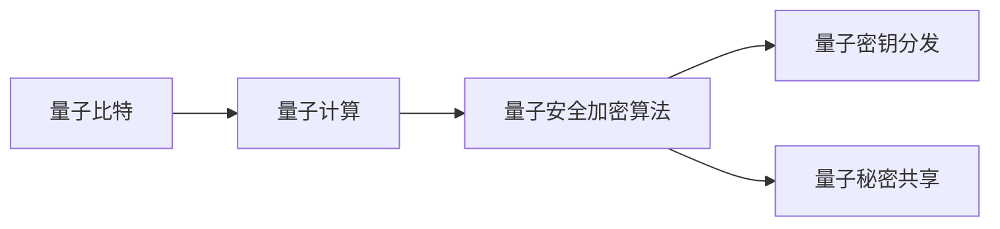

                 

# 量子计算在密码学中的应用：未来安全通信的基石

量子计算是21世纪最为颠覆性的技术之一，其原理基于量子力学的原理，通过量子比特（qubit）来进行计算，其计算能力远超传统计算机。然而，量子计算也为密码学带来了巨大的挑战，量子计算能够轻易破解当前广泛使用的公钥加密算法，因此，量子计算在密码学中的应用亟需新型的量子安全加密算法。

## 1. 背景介绍

### 1.1 问题由来
随着量子计算的发展，传统的公钥加密算法（如RSA、ECC）将不再安全。RSA算法基于大数分解问题，而量子计算机可以通过Shor算法在多项式时间内解决大数分解问题，因此不再安全。椭圆曲线加密算法（ECC）基于椭圆曲线上的点乘问题，虽然更安全一些，但同样面临量子计算机的威胁。

因此，为了保护数据安全，亟需新型的量子安全加密算法，这种新型的算法能够抵抗量子计算的攻击。

### 1.2 问题核心关键点
量子安全加密算法需要满足以下几个核心关键点：
- **量子计算抵抗性**：算法需要能够在量子计算机攻击下保证安全性。
- **高效性**：算法需要能够在实际应用中高效运行，满足性能要求。
- **易用性**：算法需要易于部署和使用。
- **可扩展性**：算法需要能够适用于不同的应用场景和规模。

## 2. 核心概念与联系

### 2.1 核心概念概述

为了理解量子计算在密码学中的应用，我们需要了解以下几个关键概念：

- **量子比特（qubit）**：量子比特是量子计算的基本单位，与传统计算机的比特不同，量子比特可以处于多个状态的叠加态，具有量子纠缠和叠加的性质。
- **量子计算**：利用量子比特进行计算，能够在某些特定问题上大幅提升计算能力。
- **量子安全加密算法**：能够在量子计算攻击下保证安全性的加密算法。
- **量子密钥分发（QKD）**：通过量子信道安全分发密钥，保证密钥的安全性。
- **量子秘密共享（QSS）**：将密钥分割成多份，并通过量子手段分发，只有满足特定条件时才能解密。

### 2.2 核心概念原理和架构的 Mermaid 流程图



## 3. 核心算法原理 & 具体操作步骤

### 3.1 算法原理概述

量子安全加密算法主要基于以下几个原理：

- **量子不可克隆定理**：量子态无法被精确复制，因此量子信息一旦被破坏，就无法恢复。
- **量子纠缠**：两个量子比特之间可以形成纠缠态，改变其中一个量子比特的状态可以立即影响到另一个量子比特。
- **量子态叠加**：量子比特可以处于多种状态的叠加态，只有测量时才能确定具体状态。

基于这些原理，量子安全加密算法能够实现安全通信。

### 3.2 算法步骤详解

量子安全加密算法的步骤主要包括：

1. **密钥生成**：生成一对量子密钥，分别保存在发送方和接收方。
2. **量子传输**：使用量子信道将密钥传输给接收方。
3. **密钥检测**：接收方对收到的量子密钥进行检测，确认其完整性和正确性。
4. **加密解密**：使用量子密钥进行加密和解密。

### 3.3 算法优缺点

量子安全加密算法的优点：

- **量子计算抵抗性**：能够抵抗量子计算机的攻击，保证数据安全。
- **安全性强**：基于量子力学的基本原理，非常安全。

量子安全加密算法的缺点：

- **实现难度大**：量子密钥分发和量子秘密共享等技术实现难度较大。
- **资源消耗大**：量子通信需要高精度的量子态控制，消耗大量资源。

### 3.4 算法应用领域

量子安全加密算法主要应用于以下几个领域：

- **政府和军事**：保护通信安全，防止信息泄露。
- **金融**：保护金融数据的安全传输。
- **医疗**：保护患者隐私数据的安全传输。
- **互联网**：保护互联网通信的安全。

## 4. 数学模型和公式 & 详细讲解

### 4.1 数学模型构建

量子安全加密算法主要基于以下几个数学模型：

- **量子比特模型**：描述量子比特的叠加态和纠缠态。
- **量子门模型**：描述量子比特之间的操作和变换。
- **量子态测量模型**：描述量子比特的测量和读取。

### 4.2 公式推导过程

量子安全加密算法的公式推导过程如下：

1. **量子密钥生成**：
   - 生成一对量子比特的叠加态，表示为 $\left| \psi \right\rangle = \alpha \left| 0 \right\rangle + \beta \left| 1 \right\rangle$
   - 将量子比特发送给接收方，接收方使用量子纠缠和量子门操作，得到另一组量子比特。

2. **量子密钥传输**：
   - 使用量子信道将量子比特传输给接收方，接收方通过量子态测量得到量子密钥。

3. **量子密钥检测**：
   - 接收方通过量子态检测，确认量子密钥的正确性和完整性。

4. **加密解密**：
   - 使用量子密钥进行加密和解密，确保数据的安全性。

### 4.3 案例分析与讲解

以量子密钥分发（QKD）为例，分析量子安全加密算法的实现过程：

1. **密钥生成**：
   - 生成一对量子比特的叠加态，表示为 $\left| \psi \right\rangle = \alpha \left| 0 \right\rangle + \beta \left| 1 \right\rangle$

2. **量子传输**：
   - 使用量子信道将量子比特 $\left| \psi \right\rangle$ 传输给接收方。

3. **密钥检测**：
   - 接收方对收到的量子比特进行量子态测量，得到量子密钥。

4. **加密解密**：
   - 使用量子密钥进行加密和解密，确保数据的安全性。

## 5. 项目实践：代码实例和详细解释说明

### 5.1 开发环境搭建

进行量子安全加密算法的开发，需要以下开发环境：

- **量子编程框架**：如Qiskit、Cirq、OpenQASM等。
- **量子计算机模拟器**：如IBM Q Experience、Google Cirq模拟器等。

### 5.2 源代码详细实现

下面以Qiskit为例，给出量子密钥分发（QKD）的代码实现：

```python
from qiskit import QuantumCircuit, execute, Aer
from qiskit.visualization import plot_histogram

# 创建量子电路
qc = QuantumCircuit(2, 2)

# 生成量子比特的叠加态
qc.h(0)

# 生成量子纠缠态
qc.cx(0, 1)

# 测量量子比特
qc.measure([0, 1], [0, 1])

# 运行量子电路
backend = Aer.get_backend('qasm_simulator')
job = execute(qc, backend, shots=1000)

# 获取测量结果
result = job.result()
counts = result.get_counts(qc)

# 打印结果
print(counts)
```

### 5.3 代码解读与分析

上述代码实现了量子密钥分发的基本过程，包括生成量子比特的叠加态、生成量子纠缠态、测量量子比特和运行量子电路等步骤。通过运行量子电路，可以得到量子密钥的测量结果，从而实现量子密钥分发。

## 6. 实际应用场景

### 6.1 政府和军事

在政府和军事领域，量子安全加密算法可以用于保护通信安全，防止信息泄露。例如，可以使用量子密钥分发（QKD）技术，在政府内部和军队之间进行安全的通信。

### 6.2 金融

在金融领域，量子安全加密算法可以用于保护金融数据的安全传输。例如，银行可以将其客户的交易数据进行量子加密，确保数据在传输过程中的安全性。

### 6.3 医疗

在医疗领域，量子安全加密算法可以用于保护患者隐私数据的安全传输。例如，医院可以将患者的医疗数据进行量子加密，确保数据在传输过程中的安全性。

### 6.4 互联网

在互联网领域，量子安全加密算法可以用于保护互联网通信的安全。例如，可以使用量子密钥分发（QKD）技术，确保网络通信的安全性。

## 7. 工具和资源推荐

### 7.1 学习资源推荐

为了帮助开发者系统掌握量子计算在密码学中的应用，这里推荐一些优质的学习资源：

1. **《量子计算导论》**：这本书详细介绍了量子计算的基本原理和应用，包括量子安全加密算法。
2. **《量子通信原理》**：这本书详细介绍了量子通信的基本原理和实现方法，包括量子密钥分发。
3. **量子编程框架官方文档**：如Qiskit、Cirq、OpenQASM等官方文档，提供了详细的量子编程和算法实现。

### 7.2 开发工具推荐

- **Qiskit**：IBM开发的量子编程框架，支持Python，支持量子电路的构建和模拟。
- **Cirq**：Google开发的量子编程框架，支持Python，支持量子电路的构建和模拟。
- **OpenQASM**：开源的量子编程语言，支持量子电路的构建和模拟。

### 7.3 相关论文推荐

量子计算在密码学中的应用是一个非常前沿的研究方向，以下是几篇奠基性的相关论文，推荐阅读：

1. **《量子计算和量子密码学》**：这篇文章详细介绍了量子计算和量子密码学的基本原理和应用。
2. **《量子密钥分发原理和实现》**：这篇文章详细介绍了量子密钥分发的原理和实现方法。
3. **《量子秘密共享原理和实现》**：这篇文章详细介绍了量子秘密共享的原理和实现方法。

## 8. 总结：未来发展趋势与挑战

### 8.1 研究成果总结

量子安全加密算法的研究已经取得了一定的进展，但仍有许多问题需要解决。

### 8.2 未来发展趋势

量子计算在密码学中的应用将有以下几个发展趋势：

- **量子计算抵抗性**：未来的量子安全加密算法将具有更强的量子计算抵抗性。
- **高效性**：未来的量子安全加密算法将更加高效，能够适用于实际应用。
- **易用性**：未来的量子安全加密算法将更加易用，便于部署和使用。
- **可扩展性**：未来的量子安全加密算法将能够适用于不同的应用场景和规模。

### 8.3 面临的挑战

量子计算在密码学中的应用仍面临以下几个挑战：

- **实现难度大**：量子安全加密算法的实现难度较大，需要高精度的量子态控制。
- **资源消耗大**：量子安全加密算法需要大量的计算资源，消耗大量时间和精力。
- **安全性问题**：量子安全加密算法仍存在一定的安全性问题，需要进一步改进和完善。

### 8.4 研究展望

未来的研究将主要集中在以下几个方面：

- **量子计算抵抗性**：研究新的量子安全加密算法，具有更强的量子计算抵抗性。
- **高效性**：研究更加高效的量子安全加密算法，能够适用于实际应用。
- **易用性**：研究更加易用和易部署的量子安全加密算法，便于使用。
- **可扩展性**：研究具有可扩展性的量子安全加密算法，适用于不同的应用场景和规模。

## 9. 附录：常见问题与解答

**Q1：量子安全加密算法是否能够抵抗量子计算的攻击？**

A: 是的，量子安全加密算法能够抵抗量子计算的攻击，因为它们基于量子力学的基本原理，具有量子计算抵抗性。

**Q2：量子安全加密算法的实现难度大吗？**

A: 是的，量子安全加密算法的实现难度较大，需要高精度的量子态控制和复杂的量子操作。

**Q3：量子安全加密算法在实际应用中是否高效？**

A: 目前量子安全加密算法还存在一些效率问题，需要进一步优化和改进。

**Q4：量子安全加密算法是否易用和易部署？**

A: 目前量子安全加密算法还存在一些易用性和易部署性的问题，需要进一步研究和改进。

**Q5：量子安全加密算法的可扩展性如何？**

A: 量子安全加密算法具有较好的可扩展性，可以适用于不同的应用场景和规模。

---

作者：禅与计算机程序设计艺术 / Zen and the Art of Computer Programming

