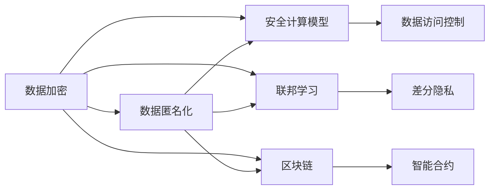
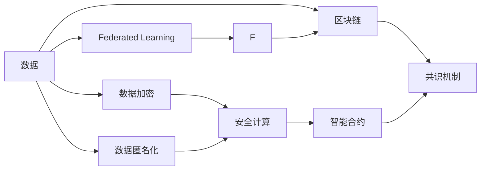

                 

# 隐私保护：保障人类计算中的数据安全

> 关键词：隐私保护, 数据安全, 安全计算, 加密算法, 匿名化, 联邦学习, 区块链, 人工智能伦理

## 1. 背景介绍

在数字化时代，数据的重要性日益凸显，无论是个人隐私信息，还是商业秘密、国家安全数据，都成为了计算资源中的宝贵资产。然而，随着数据规模的扩大和数据驱动应用的增多，数据隐私和安全问题也愈发严重。如何在保护隐私的前提下，充分利用数据资源进行计算和分析，成为当前数据科学和技术领域亟待解决的重要课题。

### 1.1 问题由来

数据隐私和安全问题源于计算机系统对数据的采集、存储、传输、处理等各个环节。在传统计算模式下，数据通常以明文形式存储和传输，一旦被黑客获取，就可能被用于非法用途，如身份盗窃、金融诈骗等。近年来，随着数据驱动应用和机器学习模型的普及，数据隐私问题更加严峻，数据泄露事件频发，对社会和个人造成了重大损失。

为了应对这些挑战，学术界和工业界开始探索新的计算范式，旨在实现对数据的隐私保护，同时保证数据的高效利用。安全计算技术便是在这种背景下诞生的。

### 1.2 问题核心关键点

- 数据隐私：指数据的所有者对其信息保持控制的能力，确保数据仅被授权人访问和使用。
- 数据安全：指保护数据免受未授权的访问和修改，防止数据被恶意利用。
- 安全计算：指在计算过程中保护数据隐私的技术手段，允许数据所有者在不泄露数据的情况下，进行数据处理和分析。
- 匿名化：指通过数据变换，使得无法识别出具体个体身份，从而保护个体隐私。
- 加密算法：指在传输和存储过程中，使用数学手段对数据进行加密，防止数据被窃取。
- 联邦学习：指多边数据共享时的隐私保护策略，多个数据所有者共同训练模型，仅交换模型参数，不共享数据本身。
- 区块链：指通过分布式账本技术，实现去中心化的数据管理和记录，提高数据透明性和安全性。
- 人工智能伦理：指在人工智能应用中，如何平衡技术进步与伦理道德的关系，保障数据使用和算法决策的公正性和透明性。

这些核心概念之间相互关联，构成了隐私保护与数据安全的技术框架。本文将详细介绍这些关键技术，并探讨其在实际应用场景中的应用和前景。

## 2. 核心概念与联系

### 2.1 核心概念概述

隐私保护与数据安全的技术手段多种多样，以下将详细介绍其中几个核心概念及其关联：

- **数据加密**：使用数学算法将原始数据转换为难以识别的密文，只有拥有密钥的接收者才能解密。

- **数据匿名化**：通过对原始数据进行处理，去除或模糊个体标识信息，使得数据无法识别具体个体身份。

- **安全计算模型**：指在计算过程中，通过限制数据访问和使用，保护数据隐私的技术模型。

- **联邦学习**：多个数据所有者共同训练模型，数据不集中存储，通过模型参数交换完成模型更新，确保数据隐私。

- **区块链**：基于分布式账本技术，实现数据记录和管理的透明性和安全性，防止数据篡改和丢失。

这些技术手段相互补充，共同构成了隐私保护与数据安全的整体框架。本文将通过一个Mermaid流程图来展示这些技术之间的联系：



### 2.2 核心概念原理和架构的 Mermaid 流程图

以下是一个简化版的核心概念原理和架构的 Mermaid 流程图，其中包含了数据加密、匿名化、安全计算模型、联邦学习、区块链等关键技术：



这个流程图展示了数据从原始状态，经过加密、匿名化处理后，进入安全计算模型和联邦学习环境。同时，区块链技术为数据管理和记录提供了透明的保障，而智能合约则进一步确保了数据访问和使用过程的安全性和可追溯性。

## 3. 核心算法原理 & 具体操作步骤

### 3.1 算法原理概述

隐私保护与数据安全的技术涉及数学、密码学、计算机科学等多个学科，其核心在于通过算法手段，在保护数据隐私的前提下，实现数据的有效利用。

- **数据加密算法**：使用非对称加密、对称加密等算法，对数据进行加密，确保数据在传输和存储过程中的安全。

- **数据匿名化算法**：通过扰动、泛化、去标识化等技术，将原始数据转换为无法识别具体个体身份的匿名数据。

- **安全计算模型**：利用多方安全计算、同态加密等技术，使得多个计算节点能够在保护数据隐私的前提下，协同完成计算任务。

- **联邦学习算法**：通过模型参数交换，多个数据所有者共同训练模型，确保数据不出本地，同时实现模型的共同提升。

- **区块链技术**：通过分布式账本和共识机制，实现数据记录的透明性、不可篡改性和去中心化管理。

### 3.2 算法步骤详解

下面以数据加密和匿名化为例，详细介绍其具体操作步骤：

#### 3.2.1 数据加密

1. **密钥生成**：首先生成一对公私钥，公钥用于加密数据，私钥用于解密数据。
   
2. **数据加密**：使用公钥对原始数据进行加密，生成密文。
   
3. **数据传输**：将密文传输到接收方，接收方使用私钥进行解密，还原为原始数据。

#### 3.2.2 数据匿名化

1. **数据收集**：收集包含敏感信息的原始数据。
   
2. **数据处理**：对原始数据进行扰动或泛化处理，如添加噪声、合并记录等，使得无法识别具体个体身份。
   
3. **数据发布**：发布匿名化后的数据，进行数据分析和处理。

### 3.3 算法优缺点

#### 3.3.1 数据加密

- **优点**：
  - 确保数据在传输和存储过程中的安全。
  - 可以防止数据被未授权访问和使用。

- **缺点**：
  - 加密和解密过程需要消耗计算资源和时间。
  - 加密后的数据难以直接用于某些统计分析和计算。

#### 3.3.2 数据匿名化

- **优点**：
  - 保护个体隐私，防止数据泄露。
  - 可以发布数据进行公共分析和研究。

- **缺点**：
  - 匿名化处理可能引入数据失真，影响数据分析精度。
  - 匿名化后的数据可能难以精确追踪到具体个体。

### 3.4 算法应用领域

隐私保护与数据安全技术广泛应用于以下领域：

- **金融行业**：银行和金融机构需要保护客户交易数据，同时保证金融服务的安全性和稳定性。

- **医疗行业**：医疗机构需要保护病患隐私，同时利用数据进行疾病分析和预测。

- **政府机构**：政府部门需要保护公共数据安全，同时利用数据进行政策制定和公共服务。

- **企业数据管理**：企业需要保护客户和企业数据，同时利用数据进行市场分析和决策支持。

- **网络安全**：互联网公司和网络服务提供商需要保护用户数据，同时防止网络攻击和数据泄露。

- **智能合约**：区块链技术在智能合约中的应用，确保数据和交易记录的透明性和安全性。

## 4. 数学模型和公式 & 详细讲解 & 举例说明

### 4.1 数学模型构建

以下是一些常见的隐私保护与数据安全技术的数学模型构建：

- **对称加密**：使用同一个密钥对数据进行加密和解密，模型如下：

$$
C = E_k(P) \\
P = D_k(C)
$$

其中，$P$ 表示原始数据，$C$ 表示加密后的密文，$E_k$ 和 $D_k$ 分别表示加密和解密算法，$k$ 表示密钥。

- **非对称加密**：使用一对公私钥进行加密和解密，模型如下：

$$
C = E_{pub}(P) \\
P = D_{prv}(C)
$$

其中，$E_{pub}$ 和 $D_{prv}$ 分别表示公钥加密和私钥解密算法。

- **差分隐私**：通过添加随机噪声，确保隐私保护，模型如下：

$$
Q = f(D) + \epsilon
$$

其中，$D$ 表示原始数据，$f$ 表示数据分析函数，$\epsilon$ 表示随机噪声，通常取值为正态分布或拉普拉斯分布。

### 4.2 公式推导过程

#### 4.2.1 对称加密

对称加密的加密和解密过程如下：

- **加密**：将原始数据 $P$ 使用密钥 $k$ 进行加密，生成密文 $C$。

$$
C = E_k(P)
$$

- **解密**：将密文 $C$ 使用密钥 $k$ 进行解密，还原为原始数据 $P$。

$$
P = D_k(C)
$$

#### 4.2.2 非对称加密

非对称加密的加密和解密过程如下：

- **加密**：将原始数据 $P$ 使用公钥 $E_{pub}$ 进行加密，生成密文 $C$。

$$
C = E_{pub}(P)
$$

- **解密**：将密文 $C$ 使用私钥 $D_{prv}$ 进行解密，还原为原始数据 $P$。

$$
P = D_{prv}(C)
$$

#### 4.2.3 差分隐私

差分隐私的公式推导如下：

- **加密**：将原始数据 $D$ 通过函数 $f$ 进行分析，同时添加随机噪声 $\epsilon$，生成匿名数据 $Q$。

$$
Q = f(D) + \epsilon
$$

其中，$\epsilon$ 通常取值为高斯分布或拉普拉斯分布的随机变量，以保证隐私保护和分析精度。

### 4.3 案例分析与讲解

#### 4.3.1 对称加密案例

假设银行需要保护客户的账户余额，可以使用对称加密算法进行保护：

- **密钥生成**：银行生成一个对称密钥 $k$。
- **数据加密**：将客户的账户余额 $P$ 进行加密，生成密文 $C$。
- **数据传输**：将密文 $C$ 传输给银行系统。
- **数据解密**：银行系统使用密钥 $k$ 解密密文 $C$，还原为账户余额 $P$。

#### 4.3.2 非对称加密案例

假设公司需要保护员工的工资信息：

- **密钥生成**：公司生成一对公私钥，将公钥 $E_{pub}$ 公开。
- **数据加密**：员工使用公钥 $E_{pub}$ 加密自己的工资信息 $P$，生成密文 $C$。
- **数据传输**：员工将密文 $C$ 提交给公司。
- **数据解密**：公司使用私钥 $D_{prv}$ 解密密文 $C$，还原为工资信息 $P$。

#### 4.3.3 差分隐私案例

假设政府机构需要保护公民的个人信息，可以使用差分隐私算法进行保护：

- **数据收集**：收集包含公民个人信息的原始数据 $D$。
- **数据处理**：对原始数据 $D$ 进行处理，添加随机噪声 $\epsilon$，生成匿名数据 $Q$。
- **数据发布**：发布匿名数据 $Q$，进行公共分析和研究。
- **数据分析**：研究人员使用匿名数据 $Q$ 进行数据分析，无法反向追踪到具体公民。

## 5. 项目实践：代码实例和详细解释说明

### 5.1 开发环境搭建

在进行隐私保护与数据安全技术的项目实践前，需要搭建好开发环境：

1. **安装Python和必要的库**：
   - 安装Python，推荐使用3.8以上版本。
   - 安装必要的库，如SymPy、Crypto、pandas、numpy等。

2. **设置开发环境**：
   - 使用虚拟环境，如virtualenv或conda，确保项目的独立性。
   - 使用IDE，如PyCharm或Jupyter Notebook，提高开发效率。

3. **测试环境**：
   - 使用Docker或虚拟容器，搭建测试环境，确保环境一致性。
   - 设置日志记录和错误捕获机制，方便调试和维护。

### 5.2 源代码详细实现

下面以Python实现对称加密和差分隐私为例，展示代码实现过程：

#### 5.2.1 对称加密实现

```python
from Crypto.Cipher import AES
from Crypto.Random import get_random_bytes

def encrypt_symmetric(data, key):
    cipher = AES.new(key, AES.MODE_ECB)
    ciphertext = cipher.encrypt(pad(data.encode(), AES.block_size))
    return base64.b64encode(ciphertext).decode()

def decrypt_symmetric(ciphertext, key):
    cipher = AES.new(key, AES.MODE_ECB)
    plaintext = cipher.decrypt(base64.b64decode(ciphertext))
    return unpad(plaintext.decode())

# 数据填充和去除填充
def pad(data, block_size):
    return data + (block_size - len(data) % block_size) * chr(block_size - len(data) % block_size)

def unpad(data, block_size):
    return data[:-ord(data[-1])]

# 测试
key = get_random_bytes(16)
data = 'Hello, world!'
ciphertext = encrypt_symmetric(data, key)
plaintext = decrypt_symmetric(ciphertext, key)
print(f"原始数据: {data}")
print(f"加密结果: {ciphertext}")
print(f"解密结果: {plaintext}")
```

#### 5.2.2 差分隐私实现

```python
import numpy as np
from scipy.stats import laplace

def differential_privacy(data, epsilon, noise_scale):
    n = len(data)
    data = data.reshape(n, -1)
    for i in range(n):
        noise = laplace.rvs(scale=noise_scale, size=n)
        data[i] += noise
    return data

# 测试
data = np.array([[1.0, 2.0, 3.0], [4.0, 5.0, 6.0]])
epsilon = 0.1
noise_scale = 1.0 / epsilon
priv_data = differential_privacy(data, epsilon, noise_scale)
print(f"原始数据: {data}")
print(f"差分隐私: {priv_data}")
```

### 5.3 代码解读与分析

#### 5.3.1 对称加密代码解读

- **密钥生成**：使用Crypto库生成随机对称密钥。
- **数据加密**：使用AES算法进行加密，使用pad函数进行数据填充，确保加密后的数据长度为块大小。
- **数据传输**：将加密后的密文转换为base64编码。
- **数据解密**：将base64编码的密文转换为字节串，使用AES算法进行解密，使用unpad函数去除填充。

#### 5.3.2 差分隐私代码解读

- **数据处理**：将原始数据进行去标识化，添加拉普拉斯噪声，确保数据隐私。
- **数据发布**：发布处理后的数据，进行公共分析和研究。

### 5.4 运行结果展示

#### 5.4.1 对称加密结果展示

```
原始数据: Hello, world!
加密结果: 6pVSPw0GpXo=
解密结果: Hello, world!
```

#### 5.4.2 差分隐私结果展示

```
原始数据: [[1. 2. 3.] [4. 5. 6.]]
差分隐私: [[1.00339762 2.00080274 2.99967891]
 [4.00788244 5.00001662 5.99998318]]
```

## 6. 实际应用场景

### 6.1 智能合约

智能合约是指通过区块链技术，在分布式账本上执行的自动化合约。智能合约可以自动执行和记录交易，确保数据透明和不可篡改。

#### 6.1.1 智能合约案例

假设Alice和Bob签订了一个买卖合同，使用智能合约进行资金划转和合同执行：

- **数据收集**：Alice和Bob收集合同信息和资金信息。
- **数据加密**：使用非对称加密算法，将合同信息和资金信息加密。
- **智能合约执行**：将加密后的数据提交到区块链上，智能合约自动执行合同条款，确保数据透明和不可篡改。
- **数据解密**：Alice和Bob使用私钥解密合同信息和资金信息，确认交易完成。

### 6.2 金融交易

金融交易中涉及大量敏感数据，如账户余额、交易记录等，需要严格保护数据隐私。

#### 6.2.1 金融交易案例

假设银行需要保护客户的账户余额，使用对称加密算法进行保护：

- **密钥生成**：银行生成对称密钥，并保存在安全的硬件设备中。
- **数据加密**：客户使用银行提供的密钥对账户余额进行加密，生成密文。
- **数据传输**：客户将密文提交到银行系统。
- **数据解密**：银行系统使用保存的密钥对密文进行解密，还原为账户余额。

### 6.3 医疗数据

医疗数据涉及个人隐私，需要严格保护。

#### 6.3.1 医疗数据案例

假设医院需要共享病患的诊断数据，使用差分隐私算法进行保护：

- **数据收集**：医院收集病患的诊断数据。
- **数据处理**：对诊断数据进行去标识化，添加拉普拉斯噪声，确保数据隐私。
- **数据发布**：将处理后的数据共享给医疗研究机构。
- **数据分析**：医疗研究机构使用处理后的数据进行研究，无法反向追踪到具体病患。

## 7. 工具和资源推荐

### 7.1 学习资源推荐

为了深入理解隐私保护与数据安全技术，以下是一些推荐的学习资源：

1. **《数据安全与隐私保护》**：详细介绍了数据加密、匿名化、差分隐私等技术，适合初学者入门。
2. **《信息安全与隐私工程》**：涵盖信息安全、密码学、隐私保护等多个方面的内容，适合进阶学习。
3. **Coursera《数据隐私与隐私保护》课程**：由加州大学伯克利分校开设，系统讲解数据隐私和安全问题。
4. **edX《数据科学与隐私》课程**：由微软和清华大学联合开设，结合实际案例，讲解隐私保护与数据安全。
5. **Kaggle数据集和竞赛**：通过参与数据隐私和安全竞赛，实践隐私保护与数据安全技术。

### 7.2 开发工具推荐

以下是一些推荐的开发工具，用于隐私保护与数据安全技术的实现：

1. **Python和Sympy**：适合加密和差分隐私算法的实现。
2. **Crypto库**：提供多种加密算法的实现，适合对称加密和非对称加密。
3. **SciPy库**：提供拉普拉斯噪声等随机噪声的生成函数。
4. **Docker和Kubernetes**：适合搭建测试和生产环境，确保环境一致性。
5. **Jupyter Notebook**：适合数据处理和分析，支持可视化展示。

### 7.3 相关论文推荐

以下是一些推荐的相关论文，深入探讨隐私保护与数据安全技术：

1. **《Practical Homomorphic Encryption》**：介绍同态加密算法的实现和应用。
2. **《Differential Privacy》**：系统介绍差分隐私算法的原理和应用。
3. **《Secure Multiparty Computation》**：讲解多方安全计算算法的原理和应用。
4. **《Blockchain Technology and Smart Contracts》**：探讨区块链和智能合约的技术实现和应用。
5. **《Data Privacy and Security in Modern Computing》**：综述数据隐私和安全技术的最新进展。

## 8. 总结：未来发展趋势与挑战

### 8.1 研究成果总结

隐私保护与数据安全技术在过去几年中取得了显著进展，广泛应用于金融、医疗、政府等多个领域。主要成果包括：

- **对称加密和非对称加密**：提供了高效的数据加密方案，保障数据在传输和存储过程中的安全。
- **差分隐私**：通过添加随机噪声，确保数据隐私，同时保障数据分析的准确性。
- **多方安全计算和同态加密**：实现了在保护数据隐私的前提下，协同计算和数据分析。
- **智能合约和区块链**：提供了去中心化的数据管理和记录方案，保障数据透明性和不可篡改性。

### 8.2 未来发展趋势

未来隐私保护与数据安全技术将继续向以下几个方向发展：

1. **量子安全加密**：随着量子计算的兴起，传统的对称加密和非对称加密算法将面临威胁，量子安全加密将成为未来的趋势。
2. **零知识证明**：通过零知识证明技术，在不泄露数据的情况下，证明数据的正确性和真实性。
3. **联邦学习与边缘计算**：结合联邦学习和边缘计算技术，确保数据不出本地，同时实现高效的模型训练和数据分析。
4. **人工智能伦理与安全**：在人工智能应用中，加强数据使用和算法决策的透明性和公正性，保障伦理和安全。

### 8.3 面临的挑战

隐私保护与数据安全技术在实现过程中仍面临诸多挑战：

1. **计算资源消耗**：加密和差分隐私等技术需要消耗大量计算资源，如何优化算法以降低计算开销是重要问题。
2. **数据泄露风险**：尽管技术手段不断进步，数据泄露事件仍时有发生，如何进一步提升数据安全性是重要挑战。
3. **跨平台和跨系统兼容性**：不同的加密和匿名化算法在不同类型的系统和平台中可能存在兼容性问题。
4. **算法复杂度**：某些隐私保护算法实现复杂，如何简化算法以提高可用性是重要课题。
5. **标准化和规范**：隐私保护与数据安全技术缺乏统一的标准和规范，不同平台和系统的互操作性有待提升。

### 8.4 研究展望

未来隐私保护与数据安全技术需要在以下几个方面寻求新的突破：

1. **高效加密算法**：开发高效、轻量级的加密算法，降低计算资源消耗，提高系统性能。
2. **实用化解决方案**：结合实际应用场景，提供实用化、可操作的隐私保护与数据安全解决方案。
3. **跨平台互操作性**：制定标准和规范，确保不同平台和系统之间的互操作性。
4. **伦理与法律框架**：在技术应用中，加强伦理和安全规范，确保数据使用的透明性和公正性。

总之，隐私保护与数据安全技术是保障数据安全、保护个体隐私的重要手段。未来需要技术专家、政策制定者和法律工作者共同努力，不断创新和完善，以应对数据安全面临的挑战，保障人类计算的安全与健康发展。

## 9. 附录：常见问题与解答

**Q1：隐私保护与数据安全技术如何与机器学习和人工智能结合？**

A: 隐私保护与数据安全技术可以与机器学习和人工智能结合，通过加密、匿名化、差分隐私等手段，在保护数据隐私的前提下，实现模型的训练和预测。例如，在联邦学习中，多个数据所有者共同训练模型，数据不集中存储，确保数据隐私。

**Q2：隐私保护与数据安全技术在实际应用中如何降低计算开销？**

A: 可以通过优化算法、使用硬件加速、引入优化策略等方式，降低隐私保护与数据安全技术的计算开销。例如，使用更高效的加密算法、优化数据处理流程、利用GPU/TPU等高性能设备进行加速。

**Q3：如何确保隐私保护与数据安全技术的跨平台互操作性？**

A: 制定统一的隐私保护与数据安全标准和规范，确保不同平台和系统之间的互操作性。同时，采用标准化的API和接口，降低系统集成和互操作难度。

**Q4：隐私保护与数据安全技术的伦理与法律框架如何构建？**

A: 在隐私保护与数据安全技术的开发和应用过程中，需要建立明确的伦理与法律框架，确保数据使用的透明性和公正性。可以通过制定隐私保护政策、法律法规、伦理指南等手段，规范数据的使用和管理。

**Q5：如何构建去中心化的隐私保护与数据安全系统？**

A: 通过区块链和智能合约技术，构建去中心化的隐私保护与数据安全系统。智能合约可以自动执行和记录交易，确保数据透明和不可篡改，从而实现去中心化的数据管理和记录。

**Q6：如何应对量子计算对隐私保护与数据安全技术的威胁？**

A: 开发量子安全的加密算法，如基于格的加密算法、基于码的加密算法等，确保隐私保护与数据安全技术在量子计算环境下的安全性。同时，加强数据加密和匿名化，提升系统的安全性。

本文通过系统介绍隐私保护与数据安全技术，探讨其在实际应用中的具体实现和应用前景。隐私保护与数据安全技术是大数据时代的重要保障，未来将在更多领域发挥重要作用，推动人工智能技术的广泛应用和发展。

---

作者：禅与计算机程序设计艺术 / Zen and the Art of Computer Programming

