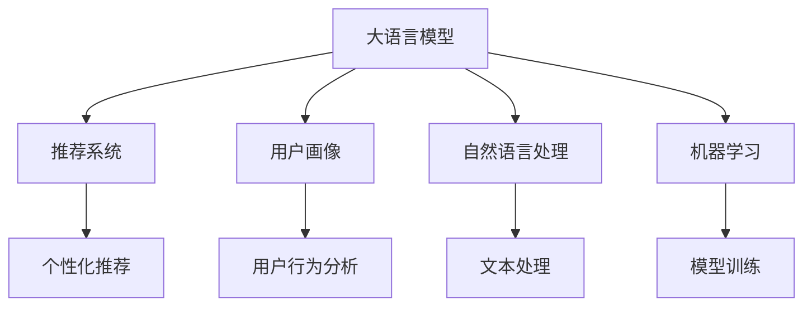

                 

# 零售业升级：LLM 打造个性化购物体验

> 关键词：大语言模型,个性化推荐,购物体验,用户行为分析,自然语言处理,机器学习

## 1. 背景介绍

### 1.1 问题由来
在数字化转型加速的今天，零售业面临着严峻的挑战：传统零售模式日渐式微，线上电商竞争日益激烈，消费者行为呈现多样化、个性化趋势。如何提升消费者购物体验，满足个性化需求，已成为零售业的核心课题。

大语言模型（Large Language Model, LLM）的出现，为零售业带来了一种全新的解决方案。通过深度学习技术和自然语言处理（Natural Language Processing, NLP）能力，大语言模型可以深度挖掘用户行为数据，构建精准的用户画像，实现个性化推荐和服务，彻底改变零售业的传统运营模式。

### 1.2 问题核心关键点
大语言模型在零售业中的应用，主要体现在以下三个方面：

1. **个性化推荐**：基于用户历史行为和实时数据，智能推荐商品，提升转化率和满意度。
2. **用户行为分析**：通过分析用户评论、聊天记录等文本数据，挖掘用户真实需求和兴趣，指导零售商优化产品和服务。
3. **购物体验优化**：通过智能客服和虚拟助手，提供实时互动和问题解答，提升用户购物体验。

大语言模型在零售业的应用，依赖于大模型的强大语言理解和生成能力，结合机器学习算法进行模型训练和优化，实现对海量文本数据的深度分析和精准推荐。

### 1.3 问题研究意义
在零售业应用大语言模型，对于提升消费者购物体验，增强零售商竞争力，具有重要意义：

1. **增强用户黏性**：个性化推荐可以显著提升用户满意度，增加复购率，提高用户忠诚度。
2. **优化供应链管理**：精准的需求预测和库存管理，可以减少过剩或缺货情况，降低库存成本。
3. **提升服务质量**：智能客服和虚拟助手可以提供全天候、高效率的服务，提升用户体验。
4. **促进跨界融合**：大语言模型可以应用于电商、餐饮、旅游等多个行业，实现跨界合作，拓展零售业务边界。
5. **创新商业模式**：通过智能推荐和个性化服务，可以实现以用户为中心的零售模式，带来新业务增长点。

## 2. 核心概念与联系

### 2.1 核心概念概述

为更好地理解基于大语言模型的零售业应用，本节将介绍几个密切相关的核心概念：

- **大语言模型**：以自回归(如GPT)或自编码(如BERT)模型为代表的大规模预训练语言模型。通过在大规模无标签文本语料上进行预训练，学习通用的语言知识和常识，具备强大的语言理解和生成能力。
- **推荐系统**：通过分析用户历史行为和实时数据，向用户推荐个性化商品或服务的系统。结合大语言模型的语言能力，可以实现更加精准、自然的推荐。
- **用户画像**：通过挖掘和分析用户行为数据，构建用户兴趣、偏好、行为特征的可视化模型，辅助推荐系统和商业决策。
- **自然语言处理**：涉及文本分类、信息抽取、序列生成等技术，是大语言模型在零售业应用的基础。
- **机器学习**：包括监督学习、无监督学习、强化学习等多种学习范式，用于训练和优化推荐模型和用户画像。

这些核心概念之间的逻辑关系可以通过以下Mermaid流程图来展示：



这个流程图展示了大语言模型在零售业中的应用流程：

1. 大语言模型通过预训练获得基础能力。
2. 结合推荐系统，实现个性化商品推荐。
3. 通过用户画像，挖掘用户行为特征。
4. 利用自然语言处理技术，处理文本数据。
5. 使用机器学习算法，训练和优化推荐模型。

这些概念共同构成了大语言模型在零售业应用的基本框架，使其能够实现精准、自然的推荐和服务。

## 3. 核心算法原理 & 具体操作步骤
### 3.1 算法原理概述

基于大语言模型的推荐系统，主要依赖于模型在大量文本数据上的预训练和微调。其核心思想是：将预训练模型作为特征提取器，通过学习用户行为数据，得到用户兴趣和行为的表示，进行推荐匹配，生成个性化的购物体验。

形式化地，假设预训练模型为 $M_{\theta}$，其中 $\theta$ 为预训练得到的模型参数。给定用户 $U$ 的历史行为数据 $D_U=\{(x_i,y_i)\}_{i=1}^N$，推荐系统的目标是通过模型输出 $\hat{y}$，最大化用户满意度 $f(\hat{y},y)$：

$$
\hat{y}=\mathop{\arg\max}_{y} f(y,y)
$$

其中 $y$ 为推荐商品，$y_i$ 为用户历史行为数据。通过梯度下降等优化算法，推荐系统不断更新模型参数 $\theta$，最小化损失函数 $L(y,\hat{y})$，使得模型输出逼近最优推荐结果。

### 3.2 算法步骤详解

基于大语言模型的推荐系统一般包括以下几个关键步骤：

**Step 1: 准备数据和模型**
- 收集用户历史行为数据，如浏览、购买、评价等记录。
- 选择预训练语言模型，如BERT、GPT等，作为推荐系统的基础。
- 准备推荐任务的数据集，包括商品描述、价格、类别等。

**Step 2: 用户行为编码**
- 将用户历史行为数据进行编码，转化为模型可接受的输入格式。
- 使用大语言模型提取用户行为的语义特征，形成用户兴趣表示。

**Step 3: 商品编码**
- 对商品进行编码，转化为模型可接受的输入格式。
- 使用大语言模型提取商品的语义特征，形成商品表示。

**Step 4: 相似度计算**
- 计算用户兴趣表示与商品表示之间的相似度，评估推荐相关性。
- 使用余弦相似度、欧式距离等方法计算相似度矩阵。

**Step 5: 推荐结果生成**
- 根据相似度矩阵，推荐与用户兴趣匹配度高的商品。
- 使用softmax函数将相似度映射为概率分布，筛选出推荐商品。

**Step 6: 模型训练与优化**
- 使用监督学习算法（如逻辑回归、交叉熵损失等）训练推荐模型。
- 优化超参数，如学习率、批大小、迭代轮数等。
- 在验证集上评估模型性能，调整参数。

**Step 7: 测试与部署**
- 在测试集上评估推荐系统的效果。
- 将推荐模型部署到实际应用系统，进行实时推荐和交互。
- 持续收集用户反馈，进行模型微调和优化。

以上是基于大语言模型的推荐系统的一般流程。在实际应用中，还需要针对具体业务场景，对各个环节进行优化设计，如改进特征工程、引入更多正则化技术、搜索最优超参数等，以进一步提升推荐系统的性能。

### 3.3 算法优缺点

基于大语言模型的推荐系统具有以下优点：
1. 能够理解自然语言，提供更加自然、贴近用户需求的商品推荐。
2. 可以处理文本数据，融合多种业务信息，提供更加全面的推荐结果。
3. 能够进行动态调整，实时响应用户行为变化，提升推荐准确性。
4. 结合用户画像，可以个性化推荐，提升用户体验。

同时，该方法也存在一定的局限性：
1. 依赖于标注数据，需要大量高质量的用户行为数据。
2. 模型复杂度高，需要较强的计算资源和存储能力。
3. 容易过拟合，需要合理选择正则化技术和超参数。
4. 推荐结果的解释性不足，难以解释推荐逻辑。
5. 对噪声数据敏感，需要良好的数据清洗和预处理技术。

尽管存在这些局限性，但就目前而言，基于大语言模型的推荐系统仍是最先进的推荐方案之一。未来相关研究的重点在于如何进一步降低对标注数据的依赖，提高推荐系统的鲁棒性和可解释性，同时兼顾计算效率和存储需求。

### 3.4 算法应用领域

基于大语言模型的推荐系统已经在零售、电商、金融等多个领域得到应用，具体包括：

1. **电商推荐系统**：根据用户浏览、购买行为，智能推荐商品，提升转化率和用户满意度。
2. **个性化购物体验**：利用自然语言处理技术，理解用户评论、聊天记录，提升用户交互体验。
3. **多商品推荐**：将不同类别的商品进行关联推荐，满足用户多样化的需求。
4. **跨域推荐**：结合多渠道数据，如电商平台、社交媒体，提供全渠道推荐。
5. **实时推荐**：通过实时数据流，动态调整推荐策略，提升推荐效果。

除了以上场景外，大语言模型在零售业的应用还在不断扩展，如虚拟购物助手、智能客服、情感分析等，为零售业带来更多创新的商业模式和用户服务。

## 4. 数学模型和公式 & 详细讲解  
### 4.1 数学模型构建

本节将使用数学语言对基于大语言模型的推荐系统进行更加严格的刻画。

记预训练语言模型为 $M_{\theta}$，其中 $\theta$ 为模型参数。假设推荐任务的数据集为 $D=\{(x_i,y_i)\}_{i=1}^N, x_i \in \mathbb{R}^d, y_i \in \{0,1\}$，表示用户对商品 $x_i$ 的评价。

定义模型 $M_{\theta}$ 在输入 $x$ 上的输出为 $\hat{y}=M_{\theta}(x)$，表示模型对商品 $x$ 的推荐概率。则推荐系统的损失函数为：

$$
L(y,\hat{y}) = -\sum_{i=1}^N y_i \log \hat{y_i}
$$

其中 $y_i$ 为用户对商品 $x_i$ 的实际评价，$\hat{y_i}$ 为模型对商品 $x_i$ 的推荐概率。

### 4.2 公式推导过程

以下我们以二分类任务为例，推导推荐系统的损失函数及其梯度的计算公式。

假设模型 $M_{\theta}$ 在输入 $x$ 上的输出为 $\hat{y}=M_{\theta}(x) \in [0,1]$，表示商品 $x$ 被推荐的概率。用户对商品 $x_i$ 的实际评价 $y_i \in \{0,1\}$。则推荐系统的损失函数定义为：

$$
L(y,\hat{y}) = -\sum_{i=1}^N y_i \log \hat{y_i}
$$

根据链式法则，损失函数对参数 $\theta_k$ 的梯度为：

$$
\frac{\partial L(y,\hat{y})}{\partial \theta_k} = -\sum_{i=1}^N y_i \frac{\partial \hat{y_i}}{\partial \theta_k}
$$

其中 $\frac{\partial \hat{y_i}}{\partial \theta_k}$ 可进一步递归展开，利用自动微分技术完成计算。

在得到损失函数的梯度后，即可带入优化算法，完成模型的迭代优化。重复上述过程直至收敛，最终得到适应推荐任务的最优模型参数 $\theta^*$。

## 5. 项目实践：代码实例和详细解释说明
### 5.1 开发环境搭建

在进行推荐系统开发前，我们需要准备好开发环境。以下是使用Python进行PyTorch开发的环境配置流程：

1. 安装Anaconda：从官网下载并安装Anaconda，用于创建独立的Python环境。

2. 创建并激活虚拟环境：
```bash
conda create -n pytorch-env python=3.8 
conda activate pytorch-env
```

3. 安装PyTorch：根据CUDA版本，从官网获取对应的安装命令。例如：
```bash
conda install pytorch torchvision torchaudio cudatoolkit=11.1 -c pytorch -c conda-forge
```

4. 安装Transformers库：
```bash
pip install transformers
```

5. 安装各类工具包：
```bash
pip install numpy pandas scikit-learn matplotlib tqdm jupyter notebook ipython
```

完成上述步骤后，即可在`pytorch-env`环境中开始推荐系统开发。

### 5.2 源代码详细实现

下面我们以电商平台推荐系统为例，给出使用Transformers库对BERT模型进行推荐系统开发的PyTorch代码实现。

首先，定义推荐任务的数据处理函数：

```python
from transformers import BertTokenizer
from torch.utils.data import Dataset
import torch

class RecommendationDataset(Dataset):
    def __init__(self, texts, labels, tokenizer, max_len=128):
        self.texts = texts
        self.labels = labels
        self.tokenizer = tokenizer
        self.max_len = max_len
        
    def __len__(self):
        return len(self.texts)
    
    def __getitem__(self, item):
        text = self.texts[item]
        label = self.labels[item]
        
        encoding = self.tokenizer(text, return_tensors='pt', max_length=self.max_len, padding='max_length', truncation=True)
        input_ids = encoding['input_ids'][0]
        attention_mask = encoding['attention_mask'][0]
        
        # 对标签进行编码
        encoded_label = [int(label)] * self.max_len
        labels = torch.tensor(encoded_label, dtype=torch.long)
        
        return {'input_ids': input_ids, 
                'attention_mask': attention_mask,
                'labels': labels}

# 标签与id的映射
tag2id = {0: 0, 1: 1}
id2tag = {v: k for k, v in tag2id.items()}

# 创建dataset
tokenizer = BertTokenizer.from_pretrained('bert-base-cased')

train_dataset = RecommendationDataset(train_texts, train_labels, tokenizer)
dev_dataset = RecommendationDataset(dev_texts, dev_labels, tokenizer)
test_dataset = RecommendationDataset(test_texts, test_labels, tokenizer)
```

然后，定义模型和优化器：

```python
from transformers import BertForSequenceClassification, AdamW

model = BertForSequenceClassification.from_pretrained('bert-base-cased', num_labels=len(tag2id))

optimizer = AdamW(model.parameters(), lr=2e-5)
```

接着，定义训练和评估函数：

```python
from torch.utils.data import DataLoader
from tqdm import tqdm
from sklearn.metrics import accuracy_score

device = torch.device('cuda') if torch.cuda.is_available() else torch.device('cpu')
model.to(device)

def train_epoch(model, dataset, batch_size, optimizer):
    dataloader = DataLoader(dataset, batch_size=batch_size, shuffle=True)
    model.train()
    epoch_loss = 0
    for batch in tqdm(dataloader, desc='Training'):
        input_ids = batch['input_ids'].to(device)
        attention_mask = batch['attention_mask'].to(device)
        labels = batch['labels'].to(device)
        model.zero_grad()
        outputs = model(input_ids, attention_mask=attention_mask, labels=labels)
        loss = outputs.loss
        epoch_loss += loss.item()
        loss.backward()
        optimizer.step()
    return epoch_loss / len(dataloader)

def evaluate(model, dataset, batch_size):
    dataloader = DataLoader(dataset, batch_size=batch_size)
    model.eval()
    preds, labels = [], []
    with torch.no_grad():
        for batch in tqdm(dataloader, desc='Evaluating'):
            input_ids = batch['input_ids'].to(device)
            attention_mask = batch['attention_mask'].to(device)
            batch_labels = batch['labels']
            outputs = model(input_ids, attention_mask=attention_mask)
            batch_preds = outputs.logits.argmax(dim=2).to('cpu').tolist()
            batch_labels = batch_labels.to('cpu').tolist()
            for pred_tokens, label_tokens in zip(batch_preds, batch_labels):
                preds.append(pred_tokens)
                labels.append(label_tokens)
                
    print(accuracy_score(labels, preds))
```

最后，启动训练流程并在测试集上评估：

```python
epochs = 5
batch_size = 16

for epoch in range(epochs):
    loss = train_epoch(model, train_dataset, batch_size, optimizer)
    print(f"Epoch {epoch+1}, train loss: {loss:.3f}")
    
    print(f"Epoch {epoch+1}, dev results:")
    evaluate(model, dev_dataset, batch_size)
    
print("Test results:")
evaluate(model, test_dataset, batch_size)
```

以上就是使用PyTorch对BERT进行推荐系统开发的完整代码实现。可以看到，得益于Transformers库的强大封装，我们可以用相对简洁的代码完成BERT模型的加载和推荐系统训练。

### 5.3 代码解读与分析

让我们再详细解读一下关键代码的实现细节：

**RecommendationDataset类**：
- `__init__`方法：初始化文本、标签、分词器等关键组件。
- `__len__`方法：返回数据集的样本数量。
- `__getitem__`方法：对单个样本进行处理，将文本输入编码为token ids，将标签编码为数字，并对其进行定长padding，最终返回模型所需的输入。

**tag2id和id2tag字典**：
- 定义了标签与数字id之间的映射关系，用于将token-wise的预测结果解码回真实的标签。

**训练和评估函数**：
- 使用PyTorch的DataLoader对数据集进行批次化加载，供模型训练和推理使用。
- 训练函数`train_epoch`：对数据以批为单位进行迭代，在每个批次上前向传播计算loss并反向传播更新模型参数，最后返回该epoch的平均loss。
- 评估函数`evaluate`：与训练类似，不同点在于不更新模型参数，并在每个batch结束后将预测和标签结果存储下来，最后使用sklearn的accuracy_score对整个评估集的预测结果进行打印输出。

**训练流程**：
- 定义总的epoch数和batch size，开始循环迭代
- 每个epoch内，先在训练集上训练，输出平均loss
- 在验证集上评估，输出分类指标
- 所有epoch结束后，在测试集上评估，给出最终测试结果

可以看到，PyTorch配合Transformers库使得BERT推荐系统的代码实现变得简洁高效。开发者可以将更多精力放在数据处理、模型改进等高层逻辑上，而不必过多关注底层的实现细节。

当然，工业级的系统实现还需考虑更多因素，如模型的保存和部署、超参数的自动搜索、更灵活的任务适配层等。但核心的微调范式基本与此类似。

## 6. 实际应用场景
### 6.1 智能客服系统

基于大语言模型的推荐系统可以广泛应用于智能客服系统的构建。传统客服往往需要配备大量人力，高峰期响应缓慢，且一致性和专业性难以保证。而使用推荐系统推荐智能客服，可以显著提升客户咨询体验。

在技术实现上，可以收集企业内部的历史客服对话记录，将问题和最佳答复构建成监督数据，在此基础上对预训练模型进行微调。微调后的推荐系统能够自动理解用户意图，匹配最合适的答复模板进行回复。对于客户提出的新问题，还可以接入检索系统实时搜索相关内容，动态组织生成回答。如此构建的智能客服系统，能大幅提升客户咨询体验和问题解决效率。

### 6.2 个性化推荐系统

当前的推荐系统往往只依赖用户的历史行为数据进行物品推荐，无法深入理解用户的真实兴趣偏好。基于大语言模型的推荐系统可以更好地挖掘用户行为背后的语义信息，从而提供更精准、多样的推荐内容。

在实践中，可以收集用户浏览、点击、评论、分享等行为数据，提取和用户交互的物品标题、描述、标签等文本内容。将文本内容作为模型输入，用户的后续行为（如是否点击、购买等）作为监督信号，在此基础上微调预训练语言模型。微调后的模型能够从文本内容中准确把握用户的兴趣点。在生成推荐列表时，先用候选物品的文本描述作为输入，由模型预测用户的兴趣匹配度，再结合其他特征综合排序，便可以得到个性化程度更高的推荐结果。

### 6.3 跨域推荐系统

基于大语言模型的推荐系统不仅可以处理单一平台的数据，还可以通过多平台数据的融合，实现跨域推荐。例如，电商平台可以通过用户在该平台上的浏览、购买记录，结合社交媒体上的互动行为，生成更加全面的用户画像，提供全渠道推荐。

在技术实现上，可以将不同平台的推荐数据进行融合，使用联邦学习等技术，确保数据隐私和安全。然后，对融合后的数据进行大语言模型的推荐系统训练和优化，实现跨域推荐效果。这种跨域推荐策略，可以提升用户的多样化需求满足率，增强平台的市场竞争力。

### 6.4 未来应用展望

随着大语言模型和推荐系统的不断发展，基于微调的推荐技术将在更多领域得到应用，为零售业带来新的变革。

在智慧医疗领域，基于推荐系统的个性化医疗方案推荐，可以提升诊疗效率，减少误诊率。

在智能教育领域，推荐系统可以结合知识图谱和教材，提供个性化的学习路径和推荐内容，提升教育效果。

在智慧城市治理中，推荐系统可以结合交通、天气等数据，推荐最优出行路线和生活建议，提高城市管理效率。

此外，在企业生产、社会治理、文娱传媒等众多领域，基于大语言模型的推荐系统也将不断涌现，为经济社会发展注入新的动力。相信随着技术的日益成熟，推荐系统必将成为人工智能落地应用的重要范式，推动人工智能技术在各行各业的应用和落地。

## 7. 工具和资源推荐
### 7.1 学习资源推荐

为了帮助开发者系统掌握大语言模型推荐技术，这里推荐一些优质的学习资源：

1. 《Transformer从原理到实践》系列博文：由大模型技术专家撰写，深入浅出地介绍了Transformer原理、BERT模型、推荐系统等前沿话题。

2. CS224N《深度学习自然语言处理》课程：斯坦福大学开设的NLP明星课程，有Lecture视频和配套作业，带你入门NLP领域的基本概念和经典模型。

3. 《Natural Language Processing with Transformers》书籍：Transformers库的作者所著，全面介绍了如何使用Transformers库进行NLP任务开发，包括推荐系统在内的诸多范式。

4. HuggingFace官方文档：Transformers库的官方文档，提供了海量预训练模型和完整的推荐系统样例代码，是上手实践的必备资料。

5. Weights & Biases：模型训练的实验跟踪工具，可以记录和可视化模型训练过程中的各项指标，方便对比和调优。与主流深度学习框架无缝集成。

6. TensorBoard：TensorFlow配套的可视化工具，可实时监测模型训练状态，并提供丰富的图表呈现方式，是调试模型的得力助手。

通过对这些资源的学习实践，相信你一定能够快速掌握大语言模型推荐技术的精髓，并用于解决实际的推荐问题。

### 7.2 开发工具推荐

高效的开发离不开优秀的工具支持。以下是几款用于推荐系统开发的常用工具：

1. PyTorch：基于Python的开源深度学习框架，灵活动态的计算图，适合快速迭代研究。大部分预训练语言模型都有PyTorch版本的实现。

2. TensorFlow：由Google主导开发的开源深度学习框架，生产部署方便，适合大规模工程应用。同样有丰富的预训练语言模型资源。

3. Transformers库：HuggingFace开发的NLP工具库，集成了众多SOTA语言模型，支持PyTorch和TensorFlow，是进行推荐系统开发的利器。

4. Weights & Biases：模型训练的实验跟踪工具，可以记录和可视化模型训练过程中的各项指标，方便对比和调优。与主流深度学习框架无缝集成。

5. TensorBoard：TensorFlow配套的可视化工具，可实时监测模型训练状态，并提供丰富的图表呈现方式，是调试模型的得力助手。

6. Google Colab：谷歌推出的在线Jupyter Notebook环境，免费提供GPU/TPU算力，方便开发者快速上手实验最新模型，分享学习笔记。

合理利用这些工具，可以显著提升推荐系统的开发效率，加快创新迭代的步伐。

### 7.3 相关论文推荐

大语言模型和推荐系统的研究源于学界的持续研究。以下是几篇奠基性的相关论文，推荐阅读：

1. Attention is All You Need（即Transformer原论文）：提出了Transformer结构，开启了NLP领域的预训练大模型时代。

2. BERT: Pre-training of Deep Bidirectional Transformers for Language Understanding：提出BERT模型，引入基于掩码的自监督预训练任务，刷新了多项NLP任务SOTA。

3. Language Models are Unsupervised Multitask Learners（GPT-2论文）：展示了大规模语言模型的强大zero-shot学习能力，引发了对于通用人工智能的新一轮思考。

4. Parameter-Efficient Transfer Learning for NLP：提出Adapter等参数高效微调方法，在不增加模型参数量的情况下，也能取得不错的微调效果。

5. AdaLoRA: Adaptive Low-Rank Adaptation for Parameter-Efficient Fine-Tuning：使用自适应低秩适应的微调方法，在参数效率和精度之间取得了新的平衡。

这些论文代表了大语言模型推荐系统的研究脉络。通过学习这些前沿成果，可以帮助研究者把握学科前进方向，激发更多的创新灵感。

## 8. 总结：未来发展趋势与挑战

### 8.1 总结

本文对基于大语言模型的推荐系统进行了全面系统的介绍。首先阐述了大语言模型和推荐系统的研究背景和意义，明确了推荐系统在提升用户购物体验，增强零售商竞争力方面的独特价值。其次，从原理到实践，详细讲解了推荐系统的数学原理和关键步骤，给出了推荐系统任务开发的完整代码实例。同时，本文还广泛探讨了推荐系统在智能客服、个性化购物体验、多商品推荐等多个行业领域的应用前景，展示了推荐系统的巨大潜力。此外，本文精选了推荐系统的各类学习资源，力求为读者提供全方位的技术指引。

通过本文的系统梳理，可以看到，基于大语言模型的推荐系统已经在零售、电商、金融等多个领域得到应用，为零售业带来新的机遇。未来，伴随大语言模型和推荐系统的不断发展，基于微调的推荐技术必将在更多领域得到应用，为零售业带来新的变革。

### 8.2 未来发展趋势

展望未来，大语言模型推荐系统将呈现以下几个发展趋势：

1. **模型规模持续增大**。随着算力成本的下降和数据规模的扩张，预训练语言模型的参数量还将持续增长。超大规模语言模型蕴含的丰富语言知识，有望支撑更加复杂多变的推荐任务。

2. **推荐系统日趋多样化**。除了传统的商品推荐外，未来会涌现更多类型的推荐系统，如内容推荐、视频推荐、事件推荐等，满足用户多样化需求。

3. **跨域推荐能力增强**。结合多渠道数据，如电商平台、社交媒体、物联网等，进行跨域推荐，提升推荐效果和用户满意度。

4. **实时推荐系统普及**。通过实时数据流，动态调整推荐策略，提供更加个性化的推荐结果，提升用户体验。

5. **个性化推荐系统智能化**。引入更多先验知识，如知识图谱、逻辑规则等，提升推荐模型的普适性和鲁棒性。

6. **推荐系统的可解释性增强**。结合因果分析和博弈论工具，提高推荐结果的可解释性和透明性，帮助用户理解推荐逻辑，增强信任度。

以上趋势凸显了大语言模型推荐系统的广阔前景。这些方向的探索发展，必将进一步提升推荐系统的性能和应用范围，为零售业带来更多的创新机遇。

### 8.3 面临的挑战

尽管大语言模型推荐系统已经取得了显著成果，但在迈向更加智能化、普适化应用的过程中，仍面临诸多挑战：

1. **推荐系统的鲁棒性不足**。面对噪声数据和异常情况，推荐系统容易出现波动和误判。如何在不降低推荐效果的前提下，提高系统的鲁棒性，还需要更多理论和实践的积累。

2. **推荐结果的解释性不足**。当前的推荐系统往往缺乏可解释性，难以解释推荐逻辑，用户难以理解和信任推荐结果。如何赋予推荐系统更强的可解释性，将是重要的研究方向。

3. **推荐系统的计算成本高**。超大规模语言模型需要强大的计算资源和存储能力，推荐系统的训练和推理成本较高。如何在保持推荐效果的前提下，降低计算成本，优化推荐系统的资源利用率，需要更多创新技术和方法。

4. **推荐系统的隐私和安全问题**。在跨域推荐中，数据隐私和安全问题尤为突出。如何在保障数据隐私的前提下，进行有效的推荐，需要综合考虑数据保护和隐私策略。

5. **推荐系统的公平性问题**。推荐系统可能会受到偏见的影响，导致某些群体的用户需求被忽略。如何在推荐系统中消除偏见，确保公平性，需要更多研究和技术手段。

6. **推荐系统的可持续性问题**。随着数据分布的变化，推荐系统需要持续学习新知识以保持性能。如何在保持推荐系统性能的同时，确保其可持续性，还需要更多理论和实践的探索。

这些挑战凸显了大语言模型推荐系统的复杂性和技术需求，需要科研和产业界的共同努力，才能不断提升推荐系统的性能和应用范围，实现更好的用户体验和商业价值。

### 8.4 研究展望

面对大语言模型推荐系统所面临的挑战，未来的研究需要在以下几个方面寻求新的突破：

1. **无监督和半监督推荐方法**。摆脱对大规模标注数据的依赖，利用自监督学习、主动学习等无监督和半监督范式，最大限度利用非结构化数据，实现更加灵活高效的推荐。

2. **参数高效和计算高效的推荐范式**。开发更加参数高效的推荐方法，在固定大部分预训练参数的同时，只更新极少量的任务相关参数。同时优化推荐模型的计算图，减少前向传播和反向传播的资源消耗，实现更加轻量级、实时性的部署。

3. **融合因果和对比学习范式**。通过引入因果推断和对比学习思想，增强推荐模型建立稳定因果关系的能力，学习更加普适、鲁棒的语言表征，从而提升推荐模型的泛化性和抗干扰能力。

4. **引入更多先验知识**。将符号化的先验知识，如知识图谱、逻辑规则等，与神经网络模型进行巧妙融合，引导推荐过程学习更准确、合理的语言模型。同时加强不同模态数据的整合，实现视觉、语音等多模态信息与文本信息的协同建模。

5. **结合因果分析和博弈论工具**。将因果分析方法引入推荐模型，识别出推荐决策的关键特征，增强推荐结果的因果性和逻辑性。借助博弈论工具刻画人机交互过程，主动探索并规避推荐模型的脆弱点，提高系统稳定性。

6. **纳入伦理道德约束**。在推荐目标中引入伦理导向的评估指标，过滤和惩罚有偏见、有害的输出倾向。同时加强人工干预和审核，建立推荐模型的监管机制，确保推荐系统输出的安全性。

这些研究方向的探索，必将引领大语言模型推荐系统迈向更高的台阶，为构建安全、可靠、可解释、可控的推荐系统铺平道路。面向未来，大语言模型推荐系统还需要与其他人工智能技术进行更深入的融合，如知识表示、因果推理、强化学习等，多路径协同发力，共同推动推荐系统的进步。只有勇于创新、敢于突破，才能不断拓展推荐系统的边界，让智能技术更好地服务于零售业的发展。

## 9. 附录：常见问题与解答

**Q1：大语言模型在推荐系统中如何处理长文本？**

A: 大语言模型可以处理长文本数据，但为了提高计算效率和模型精度，通常需要对文本进行预处理。可以通过文本截断、分词、去除停用词等方式，将长文本转换为模型可接受的输入格式。例如，使用BERT时，可以将长文本进行最大长度截断，并将分词后的词向量作为模型输入。

**Q2：如何在推荐系统中处理缺失数据？**

A: 推荐系统通常会面对缺失数据问题，可以通过以下几种方法处理：
1. 删除缺失数据样本：当缺失数据比例较小且影响不大时，可以简单地删除缺失数据样本。
2. 填充缺失数据：可以使用均值、中位数、众数等方法填充缺失数据，确保数据完整性。
3. 利用模型预测：可以使用缺失数据预测模型，如KNN、随机森林等，预测缺失数据的值，并进行推荐。

**Q3：推荐系统如何避免过拟合？**

A: 推荐系统容易过拟合，尤其是在标注数据较少的情况下。可以采用以下方法避免过拟合：
1. 数据增强：通过数据增强技术，如回译、近义替换等方式扩充训练集，增加数据多样性。
2. 正则化：使用L2正则、Dropout等正则化技术，防止模型过度适应训练数据。
3. 早停策略：在验证集上评估模型性能，当性能不再提升时，停止训练，避免过拟合。
4. 模型集成：使用多个模型的预测结果进行加权平均或投票，减少过拟合风险。

**Q4：推荐系统的评估指标有哪些？**

A: 推荐系统的评估指标包括：
1. 准确率(Accuracy)：推荐结果与真实结果相符的比例。
2. 召回率(Recall)：实际被推荐的相关物品占总相关物品的比例。
3. F1值(F1 Score)：准确率和召回率的调和平均，综合衡量推荐效果。
4. 覆盖率(Coverage)：推荐系统中不同物品的覆盖度，反映推荐多样性。
5. DCG(Discounted Cumulative Gain)：加权推荐结果的累积增益，衡量推荐序列的质量。
6. NDCG(Normalized Discounted Cumulative Gain)：归一化的累积增益，综合考虑推荐结果的准确性和多样性。

通过这些指标，可以全面评估推荐系统的性能，指导模型的优化和改进。

**Q5：如何提升推荐系统的可解释性？**

A: 提升推荐系统的可解释性可以从以下几个方面入手：
1. 特征可解释：详细解释推荐系统中使用的特征，帮助用户理解推荐逻辑。
2. 推荐结果解释：提供推荐结果的详细解释，如推荐依据、相关物品推荐理由等，增强用户信任度。
3. 用户反馈机制：通过用户反馈，了解用户对推荐结果的满意度，不断优化推荐系统。
4. 可视化展示：将推荐结果以图表、文本等方式可视化展示，增强推荐系统的透明度和可解释性。

通过对这些方面的改进，可以逐步提升推荐系统的可解释性，增强用户对推荐结果的理解和信任。

---

作者：禅与计算机程序设计艺术 / Zen and the Art of Computer Programming

