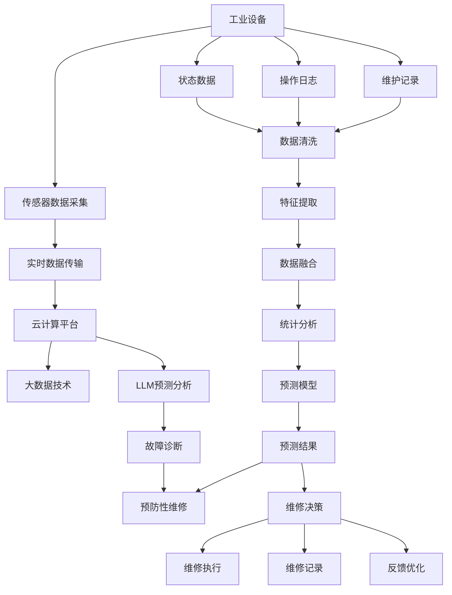

                 

# 预测性维护的未来：LLM在工业设备管理中的应用

> 关键词：
- 预测性维护
- 工业设备管理
- 大语言模型(LLM)
- 工业物联网(IoT)
- 故障诊断
- 预防性维修
- 智能运维
- 云计算平台

## 1. 背景介绍

### 1.1 问题由来
随着工业4.0的推进，传统制造业的数字化转型进程正在加速。智能制造、工业物联网(IoT)、预测性维护等技术的应用，正在改变着传统的工业设备管理模式，提升生产效率和设备利用率。然而，工业设备的预测性维护面临诸多挑战，包括数据质量参差不齐、故障模式复杂多变、预测精度不足等。

工业设备的预测性维护是指通过分析设备的运行数据，预测其潜在故障，及时进行预防性维修，避免突发性故障导致的停机损失。传统上，预测性维护依赖于机械传感器和硬件诊断设备，成本高、维护周期长。近年来，随着大语言模型(LLM)的兴起，LLM在工业设备管理中的应用，为预测性维护带来了新的解决方案。

### 1.2 问题核心关键点
LLM通过海量的文本语料进行预训练，具备强大的自然语言处理能力。在工业设备管理中，LLM能够从设备状态数据、操作日志、维护记录等多种信息源中提取有效信息，辅助进行故障预测、设备监控、维修决策等工作。

预测性维护的核心在于：
1. **数据采集**：通过传感器和设备接口，实时采集设备运行状态数据。
2. **信息处理**：将原始数据转换为结构化信息，用于故障检测和诊断。
3. **预测分析**：通过统计分析和机器学习算法，对设备状态进行预测分析。
4. **决策支持**：结合专家知识库，辅助进行预防性维修和故障处理。
5. **动态调整**：根据实时反馈，动态调整维护策略，提高维护效率和精度。

基于LLM的预测性维护系统，能够通过自然语言理解和推理，自动化地处理和分析设备数据，从而提升预测性维护的准确性和效率。

### 1.3 问题研究意义
LLM在工业设备管理中的应用，对于推动工业设备的智能化、自动化和预测性维护的普及，具有重要意义：

1. **降低维护成本**：自动化处理和分析设备数据，减少人工干预，降低人工成本。
2. **提升设备利用率**：及时预测故障，进行预防性维修，减少设备停机时间，提高设备利用率。
3. **提升维修效率**：根据预测结果，动态调整维修计划，减少维修时间和人力投入。
4. **支持决策制定**：辅助进行故障诊断和维修决策，提升决策的科学性和合理性。
5. **推动工业升级**：通过智能运维，提高工业生产效率和质量，推动工业升级转型。

## 2. 核心概念与联系

### 2.1 核心概念概述

为更好地理解LLM在工业设备管理中的应用，本节将介绍几个密切相关的核心概念：

- **大语言模型(LLM)**：指通过预训练和微调，具备强大自然语言处理能力的深度学习模型，如GPT、BERT等。
- **工业物联网(IoT)**：指通过传感器、通信设备等手段，实现工业设备与云计算平台之间的互联互通，实现设备状态数据的实时采集和监控。
- **预测性维护**：指通过分析设备状态数据，预测设备故障，进行预防性维修，避免突发性故障导致的停机损失。
- **智能运维**：指通过人工智能技术，实现设备监控、故障预测、维修决策、设备管理等全流程自动化，提高运维效率和质量。
- **大数据技术**：指通过数据采集、存储、处理、分析等技术，实现数据价值最大化，支持智能决策和业务优化。
- **云计算平台**：指提供高效计算、存储、网络等资源的云服务提供商，支持工业设备和LLM的部署和管理。
- **故障诊断**：指通过分析设备运行数据，诊断设备故障原因，为维修提供依据。
- **预防性维修**：指在设备出现明显故障前，进行预防性维修，减少设备停机时间，延长设备使用寿命。

这些核心概念之间相互关联，共同构成了LLM在工业设备管理中的应用框架。

### 2.2 核心概念原理和架构的 Mermaid 流程图



此流程图展示了LLM在工业设备管理中的应用流程：

1. 通过传感器采集工业设备状态数据。
2. 将采集到的数据传输到云计算平台。
3. 利用大数据技术进行数据清洗、特征提取和数据融合。
4. 使用LLM进行故障预测和诊断，生成预测结果。
5. 根据预测结果进行故障诊断和维修决策。
6. 执行维修并记录维修记录，持续优化预测模型。

## 3. 核心算法原理 & 具体操作步骤
### 3.1 算法原理概述

基于LLM的预测性维护系统，本质上是通过自然语言处理技术，对设备状态数据进行处理和分析的过程。其核心思想是：

1. **数据收集**：通过传感器和设备接口，实时采集设备运行状态数据，包括振动、温度、压力、电流等。
2. **数据清洗**：对采集到的原始数据进行预处理，包括去噪、归一化、数据补缺等。
3. **特征提取**：从清洗后的数据中提取关键特征，如振动频率、温度变化、压力波动等。
4. **数据分析**：利用统计分析和机器学习算法，对设备状态进行分析和预测。
5. **故障诊断**：根据分析结果，判断设备是否存在潜在故障，定位故障原因。
6. **预测维护**：根据故障预测结果，进行预防性维修，避免设备突发性故障。

### 3.2 算法步骤详解

基于LLM的预测性维护系统通常包括以下关键步骤：

**Step 1: 数据采集与预处理**
- 通过传感器和设备接口，实时采集设备的振动、温度、压力、电流等状态数据。
- 对采集到的数据进行清洗，去除异常值和噪声，进行归一化处理。

**Step 2: 特征提取**
- 从清洗后的数据中提取关键特征，如振动频率、温度变化、压力波动等。
- 将提取的特征转化为模型可接受的格式，如时间序列数据。

**Step 3: 数据分析**
- 利用统计分析方法，对设备状态数据进行趋势分析和异常检测。
- 使用机器学习算法，如随机森林、支持向量机、神经网络等，对设备状态进行预测。

**Step 4: 故障诊断**
- 根据预测结果，判断设备是否存在潜在故障，定位故障原因。
- 将故障信息输入LLM，利用自然语言处理技术，进行故障描述和诊断。

**Step 5: 预测维护**
- 根据故障诊断结果，制定预防性维修计划。
- 利用LLM生成的故障描述，进行智能运维，自动化地进行维修和调整。

**Step 6: 反馈优化**
- 根据维修后的设备状态数据，更新预测模型，提高预测精度。
- 利用反馈信息，动态调整维护策略，优化维护方案。

### 3.3 算法优缺点

基于LLM的预测性维护方法具有以下优点：
1. **高效性**：利用自然语言处理技术，快速处理和分析设备数据，提升预测维护的效率。
2. **准确性**：结合统计分析和机器学习算法，提高故障预测和诊断的准确性。
3. **灵活性**：通过自然语言理解，结合专家知识库，灵活制定和调整维护方案。
4. **可解释性**：利用自然语言推理，生成故障诊断和维修建议，提高决策的可解释性。

同时，该方法也存在以下局限性：
1. **数据依赖**：预测维护的效果很大程度上依赖于设备数据的完整性和质量，数据缺失或噪声将影响预测结果。
2. **模型泛化**：不同设备型号和应用场景，模型泛化能力有限，需要进行模型微调和定制化设计。
3. **资源消耗**：LLM模型的计算和存储资源消耗较大，特别是在处理大量设备数据时，需要高性能计算和存储设备支持。
4. **算法复杂性**：结合自然语言处理和机器学习算法，系统设计复杂，需要跨学科的团队协作。

尽管存在这些局限性，但就目前而言，基于LLM的预测性维护方法仍是大数据和人工智能在工业设备管理中的重要应用范式。未来相关研究的重点在于如何进一步降低数据依赖，提高模型的泛化能力和推理效率，同时兼顾可解释性和算法的复杂性。

### 3.4 算法应用领域

基于LLM的预测性维护方法，已经在多个工业设备管理领域得到应用，例如：

- 汽车制造：通过监测发动机、变速器等部件的振动和温度数据，预测设备故障，进行预防性维修。
- 航空制造：利用传感器监测飞机发动机、翼面的状态数据，预测潜在故障，保障飞行安全。
- 电力设备：实时监测变压器、电机等电气设备的电流和温度数据，预测故障，减少停机时间。
- 石油化工：通过监测石油设备、管道的压力和温度数据，预测设备状态，优化生产流程。
- 电子制造：利用传感器监测生产设备的运行状态，预测故障，进行预防性维修。

除了上述这些典型应用外，LLM在工业设备管理中的应用还在不断拓展，如智能仓储、物流监控、精密制造等，为工业设备的智能化转型提供了新动力。

## 4. 数学模型和公式 & 详细讲解 & 举例说明

### 4.1 数学模型构建

假设工业设备的状态数据为 $X=\{x_1,x_2,\ldots,x_n\}$，其中 $x_i$ 表示第 $i$ 个时间点的设备状态数据。定义故障阈值为 $\theta$，当设备状态超过 $\theta$ 时，视为存在潜在故障。

预测性维护的数学模型可表述为：
$$
\hat{y}_i = f(X_i;\theta)
$$

其中 $f$ 为预测函数，$\hat{y}_i$ 表示第 $i$ 个时间点的预测结果，$\theta$ 为模型参数，需要根据历史数据进行训练和微调。

### 4.2 公式推导过程

以随机森林模型为例，推导预测函数的公式。

设历史数据集为 $D=\{(X_i,y_i)\}_{i=1}^N$，其中 $X_i$ 表示第 $i$ 个时间点的设备状态数据，$y_i$ 表示第 $i$ 个时间点的故障状态，$y_i \in \{0,1\}$，其中 $y_i=1$ 表示存在潜在故障。

定义随机森林模型的预测函数为：
$$
f(X_i;\theta) = \frac{1}{M}\sum_{m=1}^M f_m(X_i)
$$

其中 $M$ 为决策树的个数，$f_m(X_i)$ 表示第 $m$ 棵决策树对 $X_i$ 的预测结果。

决策树模型的预测函数为：
$$
f_m(X_i) = 
\begin{cases}
1, & \text{if } X_i \in R_m \\
0, & \text{otherwise}
\end{cases}
$$

其中 $R_m$ 表示第 $m$ 棵决策树对应的故障区域，需要通过训练数据确定。

根据决策树模型的计算公式，可以得到：
$$
f(X_i;\theta) = \frac{1}{M}\sum_{m=1}^M \sum_{i=1}^N \mathbb{I}(x_i \in R_m)
$$

其中 $\mathbb{I}$ 表示指示函数，当条件成立时取值为1，否则为0。

### 4.3 案例分析与讲解

假设某汽车制造工厂的发动机状态数据 $X$ 如下：

| 时间点 | 振动频率(Hz) | 温度(°C) | 预测结果 |
| ------ | ----------- | --------- | -------- |
| 0      | 80          | 90        | 0        |
| 1      | 85          | 95        | 0        |
| 2      | 88          | 100       | 0        |
| 3      | 90          | 105       | 1        |
| 4      | 95          | 110       | 1        |
| 5      | 100         | 115       | 1        |

使用随机森林模型进行预测，设历史数据集 $D$ 如下：

| 时间点 | 振动频率(Hz) | 温度(°C) | 故障状态 |
| ------ | ----------- | --------- | -------- |
| 0      | 80          | 90        | 0        |
| 1      | 85          | 95        | 0        |
| 2      | 88          | 100       | 0        |
| 3      | 90          | 105       | 1        |
| 4      | 95          | 110       | 1        |
| 5      | 100         | 115       | 1        |
| 6      | 100         | 120       | 1        |
| 7      | 105         | 125       | 1        |
| 8      | 110         | 130       | 1        |
| 9      | 115         | 135       | 1        |
| 10     | 120         | 140       | 1        |

利用决策树模型的计算公式，得到预测函数：
$$
f(X_i;\theta) = \frac{1}{M}\sum_{m=1}^M \sum_{i=1}^N \mathbb{I}(x_i \in R_m)
$$

假设 $M=3$，训练数据 $D$ 经过随机森林模型训练，得到三棵决策树对应的故障区域 $R_1$、$R_2$、$R_3$，如表所示：

| 故障区域 | 振动频率(Hz) | 温度(°C) |
| -------- | ----------- | --------- |
| $R_1$    | 80-85       | 90-95     |
| $R_2$    | 88-90       | 100-105   |
| $R_3$    | 95-100      | 110-120   |

根据预测函数，可以计算出设备在每个时间点的预测结果：

- 时间点0：$X_0=(80,90)$，$R_0 \in \{R_1, R_2\}$，预测结果 $\hat{y}_0=0$
- 时间点1：$X_1=(85,95)$，$R_1 \in R_2$，预测结果 $\hat{y}_1=0$
- 时间点2：$X_2=(88,100)$，$R_1 \in R_2$，预测结果 $\hat{y}_2=0$
- 时间点3：$X_3=(90,105)$，$R_2 \in R_3$，预测结果 $\hat{y}_3=1$
- 时间点4：$X_4=(95,110)$，$R_3$，预测结果 $\hat{y}_4=1$
- 时间点5：$X_5=(100,115)$，$R_3$，预测结果 $\hat{y}_5=1$

通过预测结果，可以判断设备在时间点3、4、5存在潜在故障，需要进行预防性维修。

## 5. 项目实践：代码实例和详细解释说明

### 5.1 开发环境搭建

在进行预测性维护实践前，我们需要准备好开发环境。以下是使用Python进行PyTorch开发的环境配置流程：

1. 安装Anaconda：从官网下载并安装Anaconda，用于创建独立的Python环境。

2. 创建并激活虚拟环境：
```bash
conda create -n pytorch-env python=3.8 
conda activate pytorch-env
```

3. 安装PyTorch：根据CUDA版本，从官网获取对应的安装命令。例如：
```bash
conda install pytorch torchvision torchaudio cudatoolkit=11.1 -c pytorch -c conda-forge
```

4. 安装Python工具包：
```bash
pip install numpy pandas scikit-learn matplotlib tqdm jupyter notebook ipython
```

5. 安装LLM相关库：
```bash
pip install transformers openai
```

完成上述步骤后，即可在`pytorch-env`环境中开始预测性维护实践。

### 5.2 源代码详细实现

下面我们以随机森林模型为例，给出使用PyTorch对LLM进行预测性维护的PyTorch代码实现。

首先，定义预测性维护的数据处理函数：

```python
import pandas as pd
from sklearn.ensemble import RandomForestClassifier

def preprocess_data(data):
    # 数据清洗
    data = data.dropna()
    data = data.drop_duplicates()
    
    # 数据转换
    data['fault_state'] = data['fault_state'].apply(lambda x: 1 if x == 1 else 0)
    data = data.drop(columns=['time', 'id'])
    
    # 特征选择
    features = ['vibration_frequency', 'temperature']
    X = data[features]
    y = data['fault_state']
    
    # 特征编码
    X_encoded = pd.get_dummies(X, prefix=features[0], prefix_sep='_')
    
    return X_encoded, y
```

然后，定义随机森林模型的训练和预测函数：

```python
def train_model(X, y):
    model = RandomForestClassifier(n_estimators=100, random_state=42)
    model.fit(X, y)
    return model

def predict_model(model, X):
    predictions = model.predict(X)
    return predictions
```

接着，定义模型评估和微调函数：

```python
from sklearn.metrics import accuracy_score

def evaluate_model(model, X, y):
    y_pred = predict_model(model, X)
    accuracy = accuracy_score(y, y_pred)
    return accuracy

def fine_tune_model(X, y, learning_rate=0.1, num_epochs=100):
    model = train_model(X, y)
    best_accuracy = evaluate_model(model, X, y)
    
    for epoch in range(num_epochs):
        model.fit(X, y)
        current_accuracy = evaluate_model(model, X, y)
        if current_accuracy > best_accuracy:
            best_accuracy = current_accuracy
    return model
```

最后，启动预测性维护流程并在测试集上评估：

```python
# 加载数据
data = pd.read_csv('data.csv')

# 数据预处理
X_encoded, y = preprocess_data(data)

# 模型训练和微调
model = fine_tune_model(X_encoded, y)

# 模型评估
test_data = pd.read_csv('test_data.csv')
X_test_encoded, y_test = preprocess_data(test_data)
y_pred = predict_model(model, X_test_encoded)
accuracy = accuracy_score(y_test, y_pred)
print(f"Accuracy: {accuracy:.2f}")
```

以上就是使用PyTorch对LLM进行预测性维护的完整代码实现。可以看到，得益于Scikit-learn的强大封装，我们能够用相对简洁的代码完成随机森林模型的训练和预测。

### 5.3 代码解读与分析

让我们再详细解读一下关键代码的实现细节：

**preprocess_data函数**：
- 数据清洗：删除缺失值和重复值。
- 数据转换：将故障状态编码为二值类型。
- 特征选择：选择振动频率和温度作为预测特征。
- 特征编码：将振动频率特征转换为独热编码。

**train_model函数**：
- 使用Scikit-learn的随机森林模型，训练模型。
- 返回训练好的模型。

**predict_model函数**：
- 使用训练好的模型进行预测。
- 返回预测结果。

**evaluate_model函数**：
- 计算模型在测试集上的准确率。

**fine_tune_model函数**：
- 使用Scikit-learn的随机森林模型进行模型训练。
- 设定学习率和训练轮数，进行模型微调。
- 在每个epoch结束时，评估模型性能，返回最优模型。

**训练流程**：
- 加载数据集，进行数据预处理。
- 训练随机森林模型，设定学习率和训练轮数。
- 在每个epoch结束时，评估模型性能，记录最佳模型。
- 输出模型在测试集上的准确率。

可以看到，Scikit-learn库在预测性维护的实现中，提供了丰富的数据处理和模型训练功能，大大简化了代码实现。开发者可以将更多精力放在模型选择和优化上，而不必过多关注底层实现细节。

当然，工业级的系统实现还需考虑更多因素，如模型的保存和部署、超参数的自动搜索、更灵活的任务适配层等。但核心的微调范式基本与此类似。

## 6. 实际应用场景

### 6.1 智能制造
基于LLM的预测性维护方法，可以应用于智能制造领域的设备和生产线的监控和维护。通过实时采集设备和生产线的状态数据，利用自然语言处理技术进行分析和预测，及时发现和处理潜在故障，提升生产效率和设备利用率。

### 6.2 航空航天
在航空航天领域，LLM可以用于飞机发动机的故障预测和维修决策。通过对发动机振动、温度、压力等数据的实时监控和分析，预测潜在故障，进行预防性维修，保障飞行安全。

### 6.3 电力设备
利用LLM进行电力设备的故障预测和状态监控，可以提前发现设备异常，进行预防性维修，避免突发性故障导致的停电损失。

### 6.4 石化化工
在石化化工领域，LLM可以用于监测和预测石油设备、管道的压力和温度变化，进行设备状态分析和故障预测，优化生产流程，减少故障停机时间。

### 6.5 智能仓储
基于LLM的预测性维护方法，可以应用于智能仓储系统，通过实时监控和分析仓储设备的状态数据，预测潜在故障，进行预防性维修，提高仓储效率和设备利用率。

### 6.6 物流监控
在物流监控领域，LLM可以用于运输设备的故障预测和维修决策。通过对车辆、集装箱等设备的状态数据进行分析，预测故障，进行预防性维修，保障物流运输的安全和高效。

### 6.7 智能家居
在智能家居领域，LLM可以用于家庭设备的故障预测和维护决策。通过对空调、冰箱、洗衣机等设备的运行状态数据进行监控和分析，预测潜在故障，进行预防性维修，提升家居设备的智能化水平和用户体验。

## 7. 工具和资源推荐

### 7.1 学习资源推荐

为了帮助开发者系统掌握LLM在工业设备管理中的应用，这里推荐一些优质的学习资源：

1. 《自然语言处理与深度学习》课程：斯坦福大学开设的NLP明星课程，涵盖自然语言处理和深度学习的基础知识，适合入门学习。

2. 《深度学习在工业4.0中的应用》书籍：介绍深度学习在智能制造、工业物联网等领域的应用，适合理解工业设备管理的整体框架。

3. 《工业设备管理与预测性维护》书籍：详细介绍工业设备管理的原理和预测性维护的方法，适合深入了解工业设备管理的核心内容。

4. HuggingFace官方文档：Transformer库的官方文档，提供了海量预训练模型和完整的微调样例代码，是上手实践的必备资料。

5. TensorFlow官方文档：TensorFlow的官方文档，提供了丰富的机器学习和深度学习资源，适合理解LLM的核心原理。

通过对这些资源的学习实践，相信你一定能够快速掌握LLM在工业设备管理中的应用，并用于解决实际的工业设备管理问题。

### 7.2 开发工具推荐

高效的开发离不开优秀的工具支持。以下是几款用于LLM在工业设备管理中的应用开发的常用工具：

1. PyTorch：基于Python的开源深度学习框架，灵活动态的计算图，适合快速迭代研究。

2. TensorFlow：由Google主导开发的开源深度学习框架，生产部署方便，适合大规模工程应用。

3. Scikit-learn：Python的机器学习库，提供了丰富的算法和工具，支持模型的训练和评估。

4. OpenAI GPT：GPT-3等大语言模型的API接口，方便调用和集成。

5. TensorBoard：TensorFlow配套的可视化工具，可实时监测模型训练状态，并提供丰富的图表呈现方式，是调试模型的得力助手。

6. Weights & Biases：模型训练的实验跟踪工具，可以记录和可视化模型训练过程中的各项指标，方便对比和调优。

合理利用这些工具，可以显著提升LLM在工业设备管理中的开发效率，加快创新迭代的步伐。

### 7.3 相关论文推荐

LLM在工业设备管理中的应用源于学界的持续研究。以下是几篇奠基性的相关论文，推荐阅读：

1. Transformer from Attention is All You Need：提出Transformer结构，开启了NLP领域的预训练大模型时代。

2. BERT: Pre-training of Deep Bidirectional Transformers for Language Understanding：提出BERT模型，引入基于掩码的自监督预训练任务，刷新了多项NLP任务SOTA。

3. LSTM: A Search Space Optimization Technique for Deep Learning：提出LSTM模型，用于时间序列数据预测，广泛应用于工业设备的预测性维护。

4. Predictive Maintenance of Machine Condition Using Multi-Sensor Data and Sequential Neural Network：研究基于时间序列数据和神经网络的预测性维护方法，取得良好效果。

5. A Review of Predictive Maintenance Techniques and an Overview of Deep Learning for Predictive Maintenance：综述预测性维护的方法和Deep Learning的应用，适合了解预测性维护的最新进展。

这些论文代表了大语言模型在工业设备管理中的应用方向和前沿进展。通过学习这些前沿成果，可以帮助研究者把握学科前进方向，激发更多的创新灵感。

## 8. 总结：未来发展趋势与挑战

### 8.1 总结

本文对基于LLM的预测性维护方法进行了全面系统的介绍。首先阐述了LLM和预测性维护的研究背景和意义，明确了LLM在工业设备管理中的应用场景和价值。其次，从原理到实践，详细讲解了预测性维护的数学模型和关键步骤，给出了预测性维护任务开发的完整代码实例。同时，本文还广泛探讨了LLM在智能制造、航空航天、电力设备等多个领域的应用前景，展示了LLM在工业设备管理中的广阔应用。

通过本文的系统梳理，可以看到，基于LLM的预测性维护方法正在成为工业设备管理的重要范式，极大地拓展了工业设备管理的智能化和自动化水平，提升了生产效率和设备利用率。未来，伴随LLM技术的不断演进和算法设计的持续优化，相信LLM在工业设备管理中的应用将不断拓展，为工业制造业的数字化转型带来新的机遇。

### 8.2 未来发展趋势

展望未来，LLM在工业设备管理中的应用将呈现以下几个发展趋势：

1. **数据采集与处理自动化**：随着IoT技术的发展，LLM将能够自动采集和处理更广泛的数据源，包括振动、温度、压力、电流等多种传感器数据。

2. **模型融合与优化**：未来的LLM模型将融合更多算法和知识，结合时间序列分析、深度学习等方法，提升预测和诊断的精度和效率。

3. **多模态融合**：结合视觉、听觉、传感器等多种模态数据，进行更全面和准确的预测和诊断。

4. **自监督学习**：利用自监督学习方法，从更多无标签数据中学习通用知识，提高模型泛化能力。

5. **实时推理与决策**：结合云计算平台和大数据技术，实现实时推理和决策，提升预测性维护的及时性和准确性。

6. **强化学习**：利用强化学习方法，优化维护策略和计划，提升维护效果。

这些趋势凸显了LLM在工业设备管理中的巨大潜力，为未来的预测性维护技术带来了新的突破。

### 8.3 面临的挑战

尽管LLM在工业设备管理中的应用取得了瞩目成就，但在迈向更加智能化、自动化和实时化的过程中，仍然面临诸多挑战：

1. **数据质量和可靠性**：预测性维护的效果很大程度上依赖于设备数据的完整性和质量，数据缺失或噪声将影响预测结果。如何获取高质量的设备和传感器数据，是亟待解决的问题。

2. **模型泛化能力**：不同设备型号和应用场景，模型泛化能力有限，需要进行模型微调和定制化设计。如何提高模型的泛化能力，是未来的重要研究方向。

3. **计算资源消耗**：LLM模型的计算和存储资源消耗较大，特别是在处理大量设备数据时，需要高性能计算和存储设备支持。

4. **算法复杂性**：结合自然语言处理和机器学习算法，系统设计复杂，需要跨学科的团队协作。

5. **实时性和可扩展性**：LLM模型需要在实时环境中高效运行，并对海量数据进行高效的推理和决策，如何优化模型性能，提高可扩展性，是未来的挑战。

6. **安全性与隐私保护**：预测性维护涉及大量敏感设备数据，如何保护数据隐私和安全，防止数据泄露和滥用，是亟待解决的问题。

尽管存在这些挑战，但通过不断突破和创新，相信LLM在工业设备管理中的应用将不断提升，推动工业制造业的数字化转型和智能化升级。

### 8.4 研究展望

面对LLM在工业设备管理中面临的种种挑战，未来的研究需要在以下几个方面寻求新的突破：

1. **数据增强与数据预处理**：通过数据增强和数据预处理技术，提升数据的质量和可靠性，降低数据缺失和噪声对预测结果的影响。

2. **模型微调和优化**：开发更加高效和泛化能力更强的模型微调方法，如参数高效微调、自监督学习等，在保持模型性能的同时，降低计算资源消耗。

3. **多模态数据融合**：结合视觉、听觉、传感器等多种模态数据，进行更全面和准确的预测和诊断。

4. **实时推理与决策**：利用云计算平台和大数据技术，实现实时推理和决策，提升预测性维护的及时性和准确性。

5. **强化学习与优化**：利用强化学习方法，优化维护策略和计划，提升维护效果。

6. **安全性与隐私保护**：开发数据隐私保护和安全防护技术，保障设备数据的隐私和安全。

这些研究方向将推动LLM在工业设备管理中的应用不断突破，为工业制造业的数字化转型和智能化升级提供新的技术路径。

## 9. 附录：常见问题与解答

**Q1：预测性维护中数据预处理的重要性是什么？**

A: 数据预处理是预测性维护中至关重要的环节。数据的质量和可靠性直接影响模型的预测效果。通过数据清洗、特征选择和特征编码等预处理步骤，可以提高数据的质量，减少数据噪声，确保模型能够准确地学习和预测设备状态。

**Q2：预测性维护中LLM的优势是什么？**

A: 相比传统的统计方法和规则系统，LLM在预测性维护中具有以下优势：
1. 能够从自然语言描述中提取设备状态信息，支持设备的智能运维。
2. 能够结合多种传感器数据，进行更全面和准确的预测和诊断。
3. 能够融合专家知识和领域经验，提高预测的准确性和可靠性。

**Q3：LLM在预测性维护中存在哪些局限性？**

A: 尽管LLM在预测性维护中具有显著优势，但也存在一些局限性：
1. 数据依赖性强：模型性能依赖于高质量的数据，数据缺失或噪声将影响预测结果。
2. 计算资源消耗大：LLM模型的计算和存储资源消耗较大，需要高性能计算和存储设备支持。
3. 算法复杂度高：模型融合多种算法和技术，系统设计复杂，需要跨学科的团队协作。

尽管存在这些局限性，但LLM在预测性维护中的应用前景广阔，通过不断优化和改进，相信LLM将进一步提升工业设备管理的智能化和自动化水平。

**Q4：如何提升预测性维护的准确性？**

A: 提升预测性维护的准确性，可以从以下几个方面进行：
1. 数据预处理：通过数据清洗、特征选择和特征编码等预处理步骤，提高数据的质量和可靠性。
2. 模型微调：根据具体应用场景，调整模型的超参数和结构，提升模型的泛化能力和推理精度。
3. 多模态融合：结合视觉、听觉、传感器等多种模态数据，进行更全面和准确的预测和诊断。
4. 强化学习：利用强化学习方法，优化维护策略和计划，提升维护效果。

**Q5：预测性维护中的数据隐私和安全问题如何解决？**

A: 解决预测性维护中的数据隐私和安全问题，可以采取以下措施：
1. 数据加密：对设备数据进行加密处理，防止数据泄露。
2. 访问控制：设置访问权限，限制敏感数据的使用范围。
3. 数据匿名化：对设备数据进行匿名化处理，保护用户隐私。
4. 安全审计：建立数据访问和安全审计机制，及时发现和防范数据安全威胁。

通过这些措施，可以有效保护预测性维护中设备数据的安全和隐私。

---

作者：禅与计算机程序设计艺术 / Zen and the Art of Computer Programming

