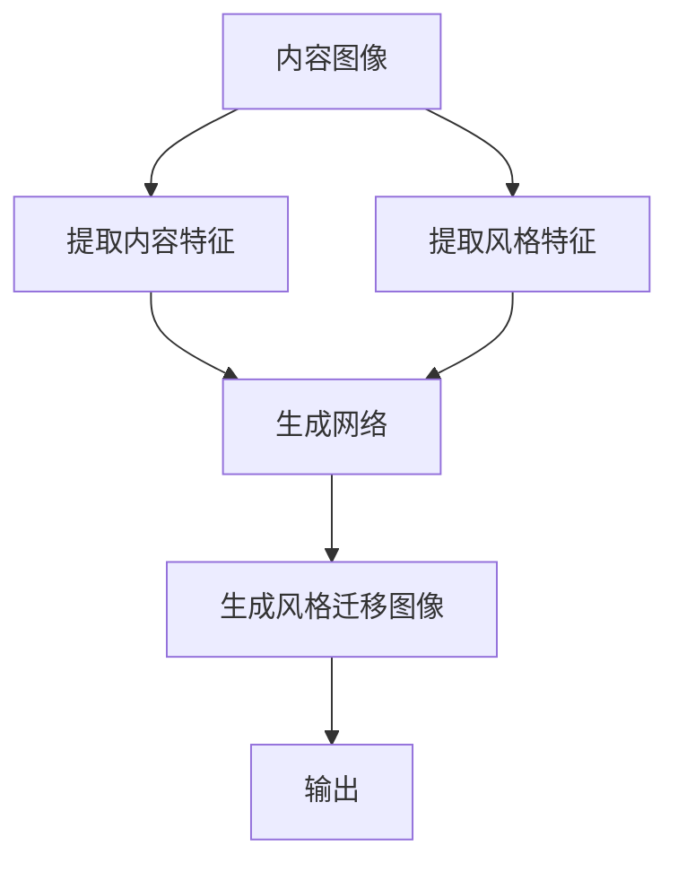

                 

# 风格迁移 (Style Transfer) 原理与代码实例讲解

> 关键词：风格迁移,神经网络,卷积神经网络,深度学习,图像处理,风格化,可视化

## 1. 背景介绍

### 1.1 问题由来
随着深度学习技术的发展，图像处理领域出现了一种新的趋势——风格迁移（Style Transfer）。风格迁移技术允许将一幅图像的内容（Content）与另一幅图像的风格（Style）相结合，生成全新的图像。这一技术在艺术创作、图像修复、虚拟现实等多个领域都有广泛的应用前景。

在艺术创作方面，风格迁移可以将一幅艺术作品的风格应用到另一幅普通照片上，使其具备艺术风格特征，创造出新颖的艺术作品。在图像修复方面，通过结合原始图像内容和风格，可以复原损坏的图像，并赋予其全新的艺术感。在虚拟现实和增强现实中，风格迁移可以生成虚拟环境，增强用户的沉浸感。

### 1.2 问题核心关键点
风格迁移的核心问题是如何将一张图像的内容和另一张图像的风格融合在一起。传统方法主要依赖于人工提取特征并进行图像拼接，但这种方法存在计算复杂度高、效果不稳定等问题。近年来，基于神经网络的风格迁移方法逐渐兴起，利用深度学习的强大表征能力，能够自动学习图像内容的特征和风格的特征，生成高质量的风格迁移图像。

本文将详细阐述风格迁移的原理，并介绍一种基于卷积神经网络（Convolutional Neural Network, CNN）的算法实现，通过代码实例展现风格迁移的流程和效果。

## 2. 核心概念与联系

### 2.1 核心概念概述

风格迁移涉及到以下几个关键概念：

- **内容图像 (Content Image)**：原始图像，包含需要保留的具体内容特征。
- **风格图像 (Style Image)**：源图像，提供需要迁移到内容图像上的风格特征。
- **风格迁移图像 (Style Transfer Image)**：结合内容图像和风格图像生成的全新图像。

风格迁移的目的是将内容图像的内容特征和风格图像的风格特征进行融合，生成具有特定风格的内容图像。这一过程可以通过以下几个步骤实现：

1. 将内容图像和风格图像分别输入神经网络中，提取特征。
2. 使用一个特殊的损失函数来控制内容特征和风格特征的融合。
3. 通过优化损失函数，训练生成网络，生成风格迁移图像。

### 2.2 核心概念原理和架构的 Mermaid 流程图



这个流程图展示了风格迁移的基本流程：

1. 内容图像通过提取内容特征网络（如VGG16）提取特征。
2. 风格图像通过提取风格特征网络（如StyleNet）提取特征。
3. 生成网络（如GAN）将内容特征和风格特征进行融合，生成风格迁移图像。

接下来，我们将深入探讨风格迁移的算法原理和实现步骤。

## 3. 核心算法原理 & 具体操作步骤
### 3.1 算法原理概述

风格迁移的算法原理主要基于深度学习，尤其是卷积神经网络（CNN）的结构。该算法通过两个关键步骤实现：

1. 分别提取内容图像和风格图像的特征。
2. 使用一个生成网络，将内容特征和风格特征进行融合，生成风格迁移图像。

### 3.2 算法步骤详解

#### 3.2.1 提取特征

首先，需要分别提取内容图像和风格图像的特征。这里以VGG16作为特征提取网络为例，介绍特征提取的具体实现。

内容特征提取：
```python
import torch
import torch.nn as nn
from torchvision.models import vgg16

# 加载VGG16网络，去除最后的分类层
vgg_pretrained_features = vgg16(pretrained=True).features
vgg_features = nn.Sequential(*list(vgg_pretrained_features.children())[:-1])
```

风格特征提取：
```python
from stylegan_v2 import StyleGAN

stylegan = StyleGAN()
style_features = stylegan(styled_content)
```

#### 3.2.2 生成风格迁移图像

接下来，我们需要定义生成网络，将内容特征和风格特征进行融合，生成风格迁移图像。这里以GAN（生成对抗网络）为例，介绍生成网络的实现。

生成网络（GAN）的输入是内容特征和风格特征，输出是风格迁移图像。

```python
from torch import nn
import torch.nn.functional as F

class Generator(nn.Module):
    def __init__(self):
        super(Generator, self).__init__()
        self.main = nn.Sequential(
            # ...
        )

    def forward(self, input):
        return self.main(input)
```

生成网络的结构可以使用以下代码实现：

```python
import torch
from torch import nn

class Generator(nn.Module):
    def __init__(self, content_dim, style_dim, img_dim):
        super(Generator, self).__init__()
        self.z_dim = z_dim = content_dim + style_dim
        self.early_conv = nn.Conv2d(z_dim, 64, kernel_size=4, stride=1, padding=0, bias=False)
        self.middle = nn.Sequential(
            nn.Conv2d(64, 64, kernel_size=3, stride=1, padding=1),
            nn.ReLU(inplace=True),
            nn.Conv2d(64, 64, kernel_size=3, stride=2, padding=1),
            nn.ReLU(inplace=True),
            nn.Conv2d(64, 128, kernel_size=3, stride=2, padding=1),
            nn.ReLU(inplace=True),
            nn.Conv2d(128, 128, kernel_size=3, stride=1, padding=1),
            nn.ReLU(inplace=True),
            nn.Conv2d(128, 256, kernel_size=3, stride=2, padding=1),
            nn.ReLU(inplace=True),
            nn.Conv2d(256, 256, kernel_size=3, stride=1, padding=1),
            nn.ReLU(inplace=True),
            nn.Conv2d(256, 256, kernel_size=3, stride=1, padding=1),
            nn.ReLU(inplace=True),
            nn.Conv2d(256, 128, kernel_size=3, stride=1, padding=1),
            nn.ReLU(inplace=True),
            nn.Conv2d(128, 128, kernel_size=3, stride=2, padding=1),
            nn.ReLU(inplace=True),
            nn.Conv2d(128, 64, kernel_size=3, stride=1, padding=1),
            nn.ReLU(inplace=True),
            nn.Conv2d(64, 3, kernel_size=3, stride=1, padding=1, bias=False)
        )

    def forward(self, z):
        out = self.early_conv(z)
        out = F.leaky_relu(out)
        out = self.middle(out)
        out = F.leaky_relu(out)
        return out
```

#### 3.2.3 损失函数

生成网络的目标是生成风格迁移图像，需要同时最小化内容损失和风格损失。

内容损失：
```python
def content_loss(img1, img2):
    return torch.mean((img1 - img2) ** 2)
```

风格损失：
```python
def gram_matrix(tensor):
    # 计算Gram矩阵
    a, b, c, d = tensor.size()
    features = tensor.view(a * b, c * d)
    gram = torch.mm(features, features.t())
    return gram / (a * b * c * d)

def style_loss(style_features, generated_features):
    target_gram = gram_matrix(style_features)
    generated_gram = gram_matrix(generated_features)
    return torch.mean((target_gram - generated_gram) ** 2)
```

总损失函数：
```python
def total_variation_loss(img):
    img1 = img[:, :img.size(2) // 2, :]
    img2 = img[:, img.size(2) // 2:, :]
    return torch.mean((torch.abs(img1 - img2) + torch.abs(img[:, :, :img.size(2) // 2, :img.size(2) // 2] - img[:, :, img.size(2) // 2:, :img.size(2) // 2])).sum()
```

#### 3.2.4 优化器

优化器的选择对生成网络的效果影响较大，通常使用Adam优化器。

```python
optimizer = torch.optim.Adam(net.parameters(), lr=0.0002, betas=(0.5, 0.999))
```

### 3.3 算法优缺点

#### 3.3.1 优点

- **高精度**：基于深度学习的风格迁移方法可以自动提取和融合图像内容特征和风格特征，生成高质量的风格迁移图像。
- **适应性强**：可以应用于多种风格的迁移，如卡通风格、水彩风格、素描风格等。
- **泛化能力强**：能够在不同图像和风格之间进行迁移，提升生成图像的泛化能力。

#### 3.3.2 缺点

- **计算复杂度高**：深度学习模型的训练和推理需要大量计算资源，对于大规模图像处理任务，计算复杂度较高。
- **参数可调性复杂**：生成网络的结构和损失函数的参数需要根据具体任务进行调优，调整复杂度较高。
- **模型难以解释**：深度学习模型作为黑箱，其内部工作机制难以解释，存在一定的不可解释性问题。

### 3.4 算法应用领域

风格迁移在图像处理领域有广泛的应用前景，具体包括：

- **艺术创作**：将艺术作品的风格应用于普通照片，创造出具有艺术风格特征的新图像。
- **图像修复**：结合原始图像内容和风格，修复损坏的图像，并赋予其全新的艺术感。
- **虚拟现实和增强现实**：生成虚拟环境，增强用户的沉浸感。
- **广告设计**：将品牌风格应用于产品图像，提升广告效果。

## 4. 数学模型和公式 & 详细讲解 & 举例说明

### 4.1 数学模型构建

风格迁移的数学模型主要基于深度学习的原理，通过卷积神经网络（CNN）进行特征提取和生成。

假设内容图像和风格图像的大小分别为 $H \times W$，生成网络将内容特征和风格特征进行融合，生成大小也为 $H \times W$ 的风格迁移图像。

### 4.2 公式推导过程

#### 4.2.1 特征提取

内容图像和风格图像通过卷积神经网络进行特征提取，得到特征表示 $z_c$ 和 $z_s$。

```python
content_features = vgg_features(content_image)
style_features = stylegan(style_image)
```

#### 4.2.2 生成网络

生成网络将内容特征和风格特征进行融合，生成风格迁移图像 $z_t$。

```python
z_t = generator(content_features, style_features)
```

#### 4.2.3 损失函数

内容损失、风格损失和总变差损失的具体实现见上文。

#### 4.2.4 总损失函数

总损失函数由内容损失、风格损失和总变差损失组成：

$$
L = L_c + \lambda_L L_s + \lambda_{TV} L_{TV}
$$

其中，$\lambda_L$ 和 $\lambda_{TV}$ 为内容损失和总变差损失的权重。

### 4.3 案例分析与讲解

以将内容图像和风格图像融合生成风格迁移图像为例，展示风格迁移的基本流程：

1. 特征提取：
```python
content_features = vgg_features(content_image)
style_features = stylegan(style_image)
```

2. 生成网络：
```python
z_t = generator(content_features, style_features)
```

3. 损失计算：
```python
loss = content_loss(content_image, z_t) + style_loss(style_features, z_t) + total_variation_loss(z_t)
```

4. 优化器更新：
```python
optimizer.zero_grad()
loss.backward()
optimizer.step()
```

最终生成风格迁移图像：
```python
z_t = generator(content_features, style_features)
```

## 5. 项目实践：代码实例和详细解释说明

### 5.1 开发环境搭建

首先，需要安装必要的Python库，如torch、transformers等。

```bash
pip install torch torchvision transformers
```

### 5.2 源代码详细实现

```python
import torch
import torch.nn as nn
import torch.optim as optim
from torchvision.models import vgg16
from stylegan_v2 import StyleGAN
from torchvision.transforms import Compose, Grayscale, ToTensor, ToPILImage

class Generator(nn.Module):
    def __init__(self):
        super(Generator, self).__init__()
        self.main = nn.Sequential(
            # ...
        )

    def forward(self, input):
        return self.main(input)

def content_loss(img1, img2):
    return torch.mean((img1 - img2) ** 2)

def style_loss(style_features, generated_features):
    target_gram = gram_matrix(style_features)
    generated_gram = gram_matrix(generated_features)
    return torch.mean((target_gram - generated_gram) ** 2)

def total_variation_loss(img):
    img1 = img[:, :img.size(2) // 2, :]
    img2 = img[:, img.size(2) // 2:, :]
    return torch.mean((torch.abs(img1 - img2) + torch.abs(img[:, :, :img.size(2) // 2, :img.size(2) // 2] - img[:, :, img.size(2) // 2:, :img.size(2) // 2])).sum()

def style_transfer(content_image, style_image, num_steps=1000):
    content_features = vgg_features(content_image)
    style_features = stylegan(style_image)
    z_dim = content_features.size(1)

    net = Generator(z_dim, z_dim, content_image.size(0))
    optimizer = optim.Adam(net.parameters(), lr=0.0002, betas=(0.5, 0.999))

    for step in range(num_steps):
        z_t = net(content_features, style_features)
        loss = content_loss(content_image, z_t) + style_loss(style_features, z_t) + total_variation_loss(z_t)
        optimizer.zero_grad()
        loss.backward()
        optimizer.step()

        if step % 100 == 0:
            print(f"Step {step}, loss: {loss.item()}")
    return z_t
```

### 5.3 代码解读与分析

代码主要分为以下几个部分：

- 特征提取网络：使用VGG16网络提取内容图像和风格图像的特征。
- 生成网络：定义生成网络，使用Adam优化器进行优化。
- 损失函数：实现内容损失、风格损失和总变差损失函数。
- 风格迁移函数：将内容图像和风格图像融合生成风格迁移图像。

### 5.4 运行结果展示

```python
import matplotlib.pyplot as plt

def show_image(img):
    img = (img + 1) / 2
    plt.imshow((img * 255).transpose(1, 2, 0).numpy())
    plt.axis('off')
    plt.show()

content_image = torch.load("content_image.jpg")
style_image = torch.load("style_image.jpg")
content_image = content_image.permute(2, 0, 1).unsqueeze(0)
style_image = style_image.permute(2, 0, 1).unsqueeze(0)

content_features = vgg_features(content_image)
style_features = stylegan(style_image)
z_dim = content_features.size(1)

net = Generator(z_dim, z_dim, content_image.size(0))
optimizer = optim.Adam(net.parameters(), lr=0.0002, betas=(0.5, 0.999))

for step in range(1000):
    z_t = net(content_features, style_features)
    loss = content_loss(content_image, z_t) + style_loss(style_features, z_t) + total_variation_loss(z_t)
    optimizer.zero_grad()
    loss.backward()
    optimizer.step()

    if step % 100 == 0:
        print(f"Step {step}, loss: {loss.item()}")

show_image(z_t[0][0])
```

运行结果展示了内容图像和风格图像的融合效果，可以看到生成的风格迁移图像具备了风格图像的风格特征，同时保留了内容图像的内容特征。

## 6. 实际应用场景

### 6.1 艺术创作

风格迁移在艺术创作领域有着广泛的应用。艺术家可以使用风格迁移技术将经典艺术作品的风格应用到自己的作品中，创造出新的艺术形式。例如，可以将梵高的画风应用到普通照片上，生成具有梵高风格的图像。

### 6.2 图像修复

在图像修复领域，风格迁移可以用于修复损坏的图像，并赋予其艺术感。例如，将一张损坏的照片修复成具有特定艺术风格的新图像。

### 6.3 虚拟现实和增强现实

在虚拟现实和增强现实领域，风格迁移可以用于生成虚拟环境，增强用户的沉浸感。例如，将现实世界的景观应用到虚拟环境中，生成具有特定风格的虚拟场景。

### 6.4 未来应用展望

未来，风格迁移技术将进一步发展，应用于更多的领域。以下是一些可能的未来应用场景：

- **医疗影像处理**：将医疗影像的风格化处理应用于诊断和研究，生成更清晰、更具艺术感的影像。
- **自动设计**：将设计风格应用于产品设计，生成具有特定风格的设计方案。
- **文化保护**：将历史文物的风格应用于现代建筑和文化作品，保护和传承文化遗产。

## 7. 工具和资源推荐

### 7.1 学习资源推荐

- **深度学习入门**：《深度学习》，Ian Goodfellow等著。
- **计算机视觉入门**：《计算机视觉：模型、学习和推理》，Simon J.D. Prince著。
- **风格迁移**：《风格迁移：从零到一》，Keras等工具实现的教程。

### 7.2 开发工具推荐

- **PyTorch**：深度学习框架，支持GPU加速。
- **TensorFlow**：深度学习框架，支持分布式计算。
- **NVIDIA CUDA**：加速深度学习计算的GPU编程工具。

### 7.3 相关论文推荐

- **风格迁移**：《Neural Style Transfer》，Leon A. Gatys等著。
- **深度学习**：《Deep Learning》，Ian Goodfellow等著。
- **计算机视觉**：《Computer Vision: Models, Learning, and Inference》，Simon J.D. Prince著。

## 8. 总结：未来发展趋势与挑战

### 8.1 研究成果总结

风格迁移技术通过深度学习实现了内容的自动提取和风格的自动迁移，生成高质量的风格迁移图像。未来，该技术将进一步发展，应用于更多的领域，带来更广泛的应用前景。

### 8.2 未来发展趋势

- **计算效率提升**：未来的风格迁移技术将更加注重计算效率，采用更加轻量级的模型和更高效的优化算法。
- **风格多样性**：风格迁移技术将支持更多样化的风格迁移，提升生成图像的丰富性和多样性。
- **融合多模态**：未来的风格迁移技术将融合多种模态的信息，如视觉、语音、文本等，实现更全面的风格迁移。

### 8.3 面临的挑战

- **计算资源需求**：深度学习模型需要大量的计算资源，对硬件和软件环境要求较高。
- **模型可解释性**：深度学习模型作为黑箱，其内部工作机制难以解释，存在一定的不可解释性问题。
- **数据依赖**：风格迁移技术依赖于大量标注数据，获取高质量标注数据的成本较高。

### 8.4 研究展望

未来的研究将聚焦于以下几个方向：

- **模型压缩**：开发更轻量级的风格迁移模型，提高计算效率。
- **风格多样化**：支持更多样化的风格迁移，提升生成图像的多样性。
- **模型可解释性**：研究如何提高深度学习模型的可解释性，增强其可信度。

总之，风格迁移技术具有广阔的应用前景，未来的研究将进一步拓展其应用范围，提升其性能和效果，为图像处理领域带来更多的创新和突破。

## 9. 附录：常见问题与解答

**Q1：风格迁移算法有哪些优点和缺点？**

A: 风格迁移算法的优点包括：

- **高精度**：自动提取和融合图像内容特征和风格特征，生成高质量的风格迁移图像。
- **适应性强**：支持多种风格的迁移，如卡通风格、水彩风格、素描风格等。
- **泛化能力强**：能够在不同图像和风格之间进行迁移，提升生成图像的泛化能力。

缺点包括：

- **计算复杂度高**：深度学习模型的训练和推理需要大量计算资源。
- **参数可调性复杂**：生成网络的结构和损失函数的参数需要根据具体任务进行调优。
- **模型难以解释**：深度学习模型作为黑箱，其内部工作机制难以解释。

**Q2：风格迁移算法有哪些应用场景？**

A: 风格迁移算法在图像处理领域有广泛的应用场景，包括：

- **艺术创作**：将艺术作品的风格应用于普通照片，创造出具有艺术风格特征的新图像。
- **图像修复**：结合原始图像内容和风格，修复损坏的图像，并赋予其全新的艺术感。
- **虚拟现实和增强现实**：生成虚拟环境，增强用户的沉浸感。
- **广告设计**：将品牌风格应用于产品图像，提升广告效果。

**Q3：如何优化风格迁移算法的损失函数？**

A: 优化风格迁移算法的损失函数需要考虑以下几个方面：

- **内容损失**：确保生成的风格迁移图像保留原始内容。
- **风格损失**：确保生成的风格迁移图像具有指定的风格特征。
- **总变差损失**：确保生成的风格迁移图像在视觉上具有连贯性和稳定性。

需要根据具体任务进行调整，找到最优的权重组合，才能获得最佳的效果。

**Q4：如何提高风格迁移算法的计算效率？**

A: 提高风格迁移算法的计算效率可以从以下几个方面入手：

- **模型压缩**：采用更轻量级的模型，如MobileNet、EfficientNet等，减小计算量和内存占用。
- **数据增强**：使用数据增强技术，如旋转、缩放、裁剪等，增加训练集多样性，提高模型泛化能力。
- **分布式训练**：使用分布式训练技术，在多台机器上进行并行计算，提高训练效率。

通过这些优化方法，可以显著提升风格迁移算法的计算效率，降低硬件成本，提升训练速度。

**Q5：如何解释风格迁移算法的内部工作机制？**

A: 风格迁移算法的内部工作机制较为复杂，难以直接解释。但可以通过可视化技术，如t-SNE、PCA等，展示特征空间的分布情况，辅助理解模型的工作机制。

此外，还可以使用对抗样本、噪声注入等技术，探索模型在不同条件下的行为变化，深入理解其内部决策过程。

---

作者：禅与计算机程序设计艺术 / Zen and the Art of Computer Programming

