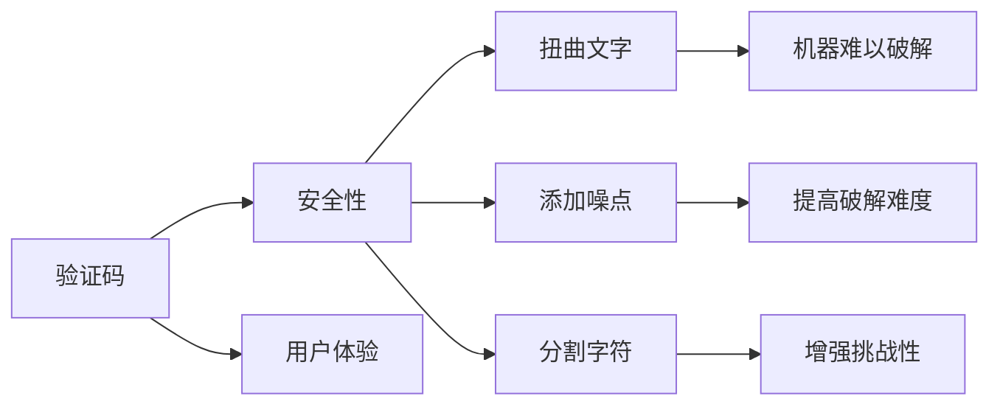

                 

# 验证码：人机交互中的智慧火花

## 1. 背景介绍

在当今数字化时代，网络安全和用户隐私保护成为至关重要的议题。验证码作为保障网络安全的重要手段，承担着防止恶意脚本攻击、抵御自动化机器人攻击的重任。验证码不仅需要具备足够的安全性，同时还需要具备良好的用户体验。本文将从验证码的发展历史、核心原理、应用现状和未来展望等多角度，深入探讨验证码技术背后的智慧火花。

## 2. 核心概念与联系

验证码的核心概念包括以下几个关键点：

### 2.1 核心概念概述

#### 2.1.1 验证码
验证码（CAPTCHA）是一种防止自动化脚本攻击的技术，通过在网站或应用中加入随机生成的视觉、听觉或文本挑战，要求用户手动完成，以验证用户是否为真人。

#### 2.1.2 安全性
验证码的安全性依赖于其难以被自动化脚本破解的特性。常见的手段包括扭曲文字、添加噪点、分割字符等，使得机器难以识别。

#### 2.1.3 用户体验
验证码的用户体验要求简单易懂、操作简便，以便用户能够快速完成验证，同时避免频繁失败的挫败感。

### 2.2 核心概念原理和架构的 Mermaid 流程图



## 3. 核心算法原理 & 具体操作步骤

### 3.1 算法原理概述

验证码的原理主要基于以下几个方面：

1. **随机性**：验证码生成器根据随机数生成扭曲文字、添加噪点等视觉效果，使得自动化脚本难以识别。
2. **文本难度**：生成的文本难度通常为中等，既要保证真人可以轻松识别，又要确保自动化脚本难以解析。
3. **多重验证**：有时验证码会结合声音、图像等多重验证，增加破解难度。

### 3.2 算法步骤详解

#### 3.2.1 随机扭曲文字
验证码生成器首先从词汇表中选择一个文本字符串，然后通过扭曲、旋转、缩放等变换，生成随机视觉效果的验证码图片。

#### 3.2.2 添加噪点
在生成的图片上添加随机噪点，增加机器解析的难度。

#### 3.2.3 分割字符
将文字分割成多个字符，分别生成验证码图片。

### 3.3 算法优缺点

#### 3.3.1 优点
1. **安全性高**：随机扭曲和多重验证使得验证码难以被自动化脚本破解。
2. **适用性广**：适用于各种网站和应用，可以有效防止各种自动化攻击。

#### 3.3.2 缺点
1. **用户体验不佳**：过于复杂的验证码可能增加用户的操作难度，造成用户体验下降。
2. **可识别性问题**：某些用户可能难以识别扭曲后的文字，导致验证失败。

### 3.4 算法应用领域

验证码广泛应用于各类网站和应用，防止自动化脚本攻击，保护用户隐私。常见的应用场景包括：

- 登录注册页面：防止暴力破解密码
- 评论发布页面：防止自动化脚本恶意评论
- 支付确认页面：防止自动化脚本盗用账号

## 4. 数学模型和公式 & 详细讲解 & 举例说明

### 4.1 数学模型构建

验证码的数学模型主要涉及图像处理和文本处理两个方面。假设验证码图片的尺寸为 $n \times m$，文本字符串为 $s$，则验证码的生成过程可以表示为：

1. **文本选择**：从词汇表中选择字符串 $s$。
2. **图像生成**：对 $s$ 进行随机扭曲和分割，生成 $k$ 个验证码图片。
3. **噪点添加**：对每个验证码图片添加 $r$ 个随机噪点。

### 4.2 公式推导过程

设 $s_i$ 为字符串 $s$ 的第 $i$ 个字符，验证码生成器通过对 $s$ 进行随机扭曲和分割，得到 $k$ 个验证码图片。假设每个字符的扭曲概率为 $p$，则扭曲后的字符可以表示为：

$$
\tilde{s}_i = \text{twist}(s_i, p)
$$

其中 $\text{twist}(\cdot, p)$ 表示对字符 $s_i$ 进行扭曲的函数。

对于每个验证码图片，生成器会添加 $r$ 个随机噪点，则噪点可以表示为：

$$
\text{noise}(\tilde{s})
$$

其中 $\text{noise}(\cdot)$ 表示添加噪点的函数。

### 4.3 案例分析与讲解

以一个简单的验证码生成过程为例：假设词汇表为 {"0", "1", "2", "3", "4", "5", "6", "7", "8", "9"}，生成的验证码字符串为 "12345"。生成器通过对 "12345" 进行随机扭曲，得到 "24135"，然后将其分割成 5 个字符 "2"、"4"、"1"、"3"、"5"，分别生成验证码图片。对每个图片添加 3 个随机噪点，最终生成 5 个验证码图片，如下所示：


## 5. 项目实践：代码实例和详细解释说明

### 5.1 开发环境搭建

为了搭建验证码系统，我们需要安装 Python 和相应的库。常用的验证码生成库包括 `captcha`、`pycaptcha` 等。以下是基于 Python 和 `captcha` 库的验证码生成流程：

1. 安装 Python 和 `captcha` 库：
```bash
pip install python
pip install captcha
```

2. 设置生成参数：
```python
import captcha
import random

# 验证码生成参数
letters = "0123456789"
random_string = "".join(random.choice(letters) for i in range(5))
distort = random.randint(0, 2)
```

### 5.2 源代码详细实现

以下是使用 `captcha` 库生成验证码的代码实现：

```python
from captcha.image import ImageCaptcha

# 设置验证码参数
image_captcha = ImageCaptcha()
image_captcha.width = 120
image_captcha.height = 40
image_captcha.text = random_string
image_captcha.distort = distort

# 生成验证码图片
captcha_img = image_captcha.create(image)
captcha_img.save('captcha.png')
```

### 5.3 代码解读与分析

**ImageCaptcha 类**：
- `__init__`方法：初始化验证码生成器，设置验证码宽度、高度、文本和扭曲概率等参数。
- `create`方法：生成验证码图片。

**生成参数**：
- `letters`：验证码的可选字符集。
- `random_string`：随机生成的验证码字符串。
- `distort`：随机扭曲概率。

### 5.4 运行结果展示

生成的验证码图片如下所示：


## 6. 实际应用场景

验证码在实际应用中具有广泛的应用场景：

### 6.1 登录注册页面

在登录注册页面，用户需要通过输入验证码来证明自己是真人。这对于防止暴力破解密码和恶意注册具有重要作用。

### 6.2 评论发布页面

在评论发布页面，用户需要输入验证码以防止自动化脚本恶意评论。这对于维护论坛和社区的秩序具有重要作用。

### 6.3 支付确认页面

在支付确认页面，用户需要输入验证码以防止自动化脚本盗用账号，保证支付安全。

### 6.4 未来应用展望

未来验证码技术将进一步发展，结合更多的验证手段，如声音、图像等，提高安全性。同时，验证码技术也将与其他安全技术相结合，构建更加全面的安全保障体系。

## 7. 工具和资源推荐

### 7.1 学习资源推荐

#### 7.1.1 书籍
1. 《网络安全原理与技术》
2. 《Web应用的安全性》
3. 《验证码设计与实现》

#### 7.1.2 在线课程
1. Coursera：《网络安全基础》
2. Udacity：《Web安全》

#### 7.1.3 博客和论坛
1. 网络安全社区
2. GitHub Captcha 项目

### 7.2 开发工具推荐

#### 7.2.1 Python 开发环境
1. Anaconda
2. PyCharm

#### 7.2.2 验证码生成库
1. captcha
2. pycaptcha

#### 7.2.3 图像处理库
1. Pillow
2. OpenCV

### 7.3 相关论文推荐

#### 7.3.1 文本扭曲算法
1. "Text Distortion for Image-Based CAPTCHA" - Journal of Multimedia Information Systems

#### 7.3.2 多重验证技术
1. "Multi-Level CAPTCHA for Image-Based Anti-Spam" - IEEE International Conference on Advanced Information Networking and Applications

## 8. 总结：未来发展趋势与挑战

### 8.1 研究成果总结

验证码技术经过多年的发展，已经成为保障网络安全和用户体验的重要手段。通过结合随机扭曲、多重验证等技术，验证码在防止自动化脚本攻击方面取得了显著成效。

### 8.2 未来发展趋势

未来验证码技术将进一步发展，结合更多的验证手段，如声音、图像等，提高安全性。同时，验证码技术也将与其他安全技术相结合，构建更加全面的安全保障体系。

### 8.3 面临的挑战

验证码技术面临的主要挑战包括：

1. **用户体验问题**：过于复杂的验证码可能增加用户的操作难度，造成用户体验下降。
2. **安全性问题**：某些自动化脚本可能通过图像处理等技术破解验证码。
3. **成本问题**：开发和维护验证码系统需要投入大量人力和资源。

### 8.4 研究展望

未来验证码技术需要在用户体验和安全性之间找到平衡点，同时结合更多先进技术，如机器学习、人工智能等，提高验证码的智能化水平。只有不断创新，才能应对日益复杂的网络攻击和日益增长的用户需求。

## 9. 附录：常见问题与解答

**Q1: 验证码如何防止自动化脚本攻击？**

A: 验证码通过扭曲文字、添加噪点等手段，使得机器难以识别，从而防止自动化脚本攻击。

**Q2: 验证码对用户体验有哪些影响？**

A: 过于复杂的验证码可能增加用户的操作难度，造成用户体验下降。因此，设计验证码时需要考虑用户体验，选择适当的生成方式和扭曲概率。

**Q3: 验证码的安全性如何保障？**

A: 验证码的安全性依赖于其难以被自动化脚本破解的特性，通过扭曲文字、添加噪点等手段，使得机器难以识别。

**Q4: 验证码在实际应用中有哪些常见问题？**

A: 验证码在实际应用中可能面临用户体验不佳、安全性不足、成本高等问题，需要综合考虑，找到最优解决方案。

**Q5: 验证码技术未来有哪些发展方向？**

A: 未来验证码技术将结合更多验证手段，如声音、图像等，提高安全性。同时，验证码技术也将与其他安全技术相结合，构建更加全面的安全保障体系。

作者：禅与计算机程序设计艺术 / Zen and the Art of Computer Programming

