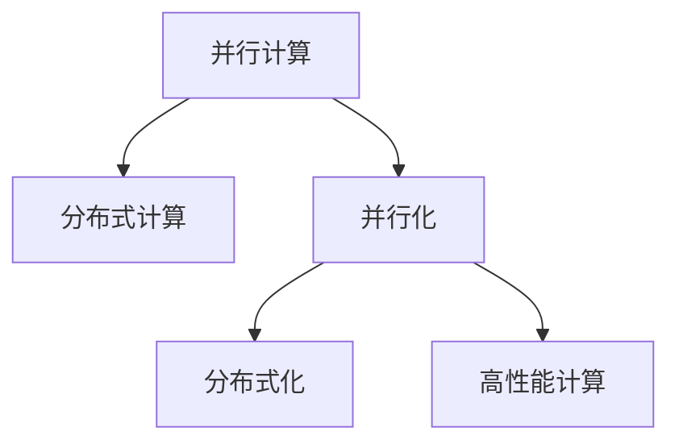

                 

# 高性能AI：LLM的并行计算策略

大语言模型(Large Language Models, LLMs)的性能瓶颈已经从计算能力转向了并行计算效率。本文将详细探讨LLM的并行计算策略，以最大化其处理能力和资源利用率，从而提升整个系统的性能和响应速度。

## 1. 背景介绍

### 1.1 问题由来

随着深度学习模型的发展，大语言模型如BERT、GPT-3等因其强大的语言理解能力而在自然语言处理(NLP)领域取得了突破性进展。这些模型通常在数百亿甚至上千亿参数的规模上进行训练，需要巨大的计算资源和高度优化的并行计算策略。

然而，现有的计算架构难以高效地处理如此大规模的计算任务。传统的单核CPU和单GPU计算方式已经无法满足需求。云计算和分布式计算提供了新的解决途径，但仍面临资源利用率低、通信开销大等问题。

### 1.2 问题核心关键点

本文主要探讨如何优化大语言模型的并行计算策略，以在有限资源下提高模型处理能力和系统响应速度。关键点包括：

- 并行计算框架的选择和优化
- 数据和模型在并行环境下的优化
- 硬件和软件协同优化的策略
- 混合并行计算（CPU/GPU/TPU）的实现

## 2. 核心概念与联系

### 2.1 核心概念概述

为更好地理解LLM的并行计算策略，本节将介绍几个密切相关的核心概念：

- 并行计算(Parallel Computing)：指使用多个计算单元同时处理任务，以提高计算效率和资源利用率。
- 分布式计算(Distributed Computing)：指将任务拆分成多个子任务，分布在不同计算节点上进行并行处理。
- 并行化(Parallelization)：指将单线程任务转换为多线程或并行任务，以利用多核CPU或GPU资源。
- 分布式化(Distributedization)：指将任务分布在不同物理节点上进行并行处理，以提高系统负载平衡和资源利用率。
- 高性能计算(High Performance Computing, HPC)：指在特定硬件和软件架构下，使用并行和分布式计算技术，高效处理大规模数据和计算任务。

这些概念之间的逻辑关系可以通过以下Mermaid流程图来展示：



这个流程图展示并行计算的相关概念及其之间的关系：

1. 并行计算是提高计算效率的基础。
2. 分布式计算在并行计算基础上进一步扩展，解决资源分散的问题。
3. 并行化是并行计算的主要手段。
4. 分布式化是分布式计算的主要手段。
5. 高性能计算是并行和分布式计算的高级形态，强调资源优化和效率提升。

## 3. 核心算法原理 & 具体操作步骤

### 3.1 算法原理概述

LLM的并行计算策略主要围绕以下几个方面展开：

1. 模型并行：将模型分成多个子模块，在不同的计算单元上进行并行计算。
2. 数据并行：将数据划分成多个子集，在不同的计算单元上进行并行计算。
3. 模型和数据的混合并行：将模型和数据的并行策略结合，充分利用硬件资源。
4. 硬件加速：利用GPU、TPU等硬件加速器提高计算效率。

### 3.2 算法步骤详解

以下是LLM并行计算策略的具体操作步骤：

1. **模型划分**：将大模型划分为多个子模型，每个子模型负责处理模型的一部分参数和计算任务。
2. **数据划分**：将输入数据划分为多个数据块，每个数据块由一个或多个计算单元进行处理。
3. **参数共享与分布**：共享模型的参数，避免重复计算。将参数分布到不同计算节点，以充分利用资源。
4. **通信优化**：优化数据和参数在节点之间的通信，减少通信开销。
5. **并行算法选择**：选择合适的并行算法，如Data Parallel、Model Parallel、Pipeline Parallel等。
6. **硬件加速**：利用GPU、TPU等硬件加速器进行高效计算，同时结合CPU进行数据处理和通信。
7. **系统调优**：通过优化资源分配、任务调度、内存管理等策略，最大化系统性能。

### 3.3 算法优缺点

并行计算策略具有以下优点：

- 提高计算效率：通过并行处理，可以大幅度提高计算速度，缩短训练和推理时间。
- 资源利用率高：充分利用多核CPU和GPU等硬件资源，避免资源浪费。
- 灵活性强：可以针对不同模型和任务，选择最合适的并行计算策略。

同时，该策略也存在以下缺点：

- 并行化复杂：并行计算需要设计复杂的数据和模型划分策略，并实现高效的通信和同步机制。
- 硬件需求高：需要高性能的计算硬件，如GPU、TPU等。
- 调试困难：并行计算的调试和优化比串行计算更复杂，需要更多的工具和技巧。
- 可扩展性受限：由于硬件和软件资源的限制，并行计算的可扩展性仍面临挑战。

### 3.4 算法应用领域

基于并行计算策略的LLM已经被广泛应用于各种NLP任务中，例如：

- 文本分类：如情感分析、主题分类等。通过并行化处理训练数据和模型，提升训练速度。
- 命名实体识别：识别文本中的人名、地名、机构名等特定实体。通过模型并行和数据并行策略，加速模型推理。
- 关系抽取：从文本中抽取实体之间的语义关系。通过混合并行和硬件加速策略，提升抽取效率。
- 问答系统：对自然语言问题给出答案。通过分布式计算和数据并行，加快问答系统响应速度。
- 机器翻译：将源语言文本翻译成目标语言。通过模型并行和数据并行策略，提升翻译速度。
- 文本摘要：将长文本压缩成简短摘要。通过混合并行和硬件加速，加快摘要生成。
- 对话系统：使机器能够与人自然对话。通过分布式计算和数据并行，提升对话响应速度。

除了上述这些经典任务外，并行计算策略也被创新性地应用到更多场景中，如可控文本生成、常识推理、代码生成、数据增强等，为NLP技术带来了全新的突破。随着预训练模型和并行计算方法的不断进步，相信NLP技术将在更广阔的应用领域大放异彩。

## 4. 数学模型和公式 & 详细讲解 & 举例说明

### 4.1 数学模型构建

我们以线性回归模型为例，展示并行计算策略的数学模型构建过程。

假设模型为 $y = wx + b$，其中 $x \in \mathbb{R}^m$ 为输入向量，$w \in \mathbb{R}^m$ 为权重向量，$b \in \mathbb{R}$ 为偏置项，$y \in \mathbb{R}$ 为输出。

在线性回归中，我们需要最小化均方误差损失函数：

$$
\mathcal{L}(w) = \frac{1}{2N}\sum_{i=1}^N(y_i - wx_i - b)^2
$$

其中 $y_i \in \mathbb{R}$ 为第 $i$ 个样本的真实标签，$x_i \in \mathbb{R}^m$ 为第 $i$ 个样本的输入向量。

假设将数据集 $D$ 划分为 $K$ 个子集 $D_k$，每个子集的大小为 $N/K$。采用数据并行策略，在 $K$ 个计算节点上并行计算损失函数。每个节点的损失函数为：

$$
\mathcal{L}_k(w) = \frac{1}{2N}\sum_{i=\lceil kN/K\rceil}^{\min(kN/K+N/K, N)}(y_i - wx_i - b)^2
$$

最终的总损失函数为：

$$
\mathcal{L}(w) = \frac{1}{2N}\sum_{k=0}^{K-1}\sum_{i=\lceil kN/K\rceil}^{\min(kN/K+N/K, N)}(y_i - wx_i - b)^2
$$

通过并行计算，每个节点只需要计算自己负责的样本，减少了通信开销，提高了计算效率。

### 4.2 公式推导过程

下面以矩阵形式，展示线性回归模型并行计算的推导过程。

假设数据集 $D$ 包含 $N$ 个样本，每个样本有 $m$ 个特征。令 $X \in \mathbb{R}^{N \times m}$ 为数据矩阵，$Y \in \mathbb{R}^N$ 为标签向量。则最小化均方误差损失函数可以表示为：

$$
\min_{w, b} \frac{1}{2}\|Y - Xw - b\|^2
$$

对损失函数求导，得到：

$$
\nabla_{w,b} \mathcal{L}(w,b) = -\frac{1}{N}X^TY + \frac{1}{N}X^TXw + \frac{1}{N}1_N1_N^TY
$$

其中 $1_N$ 为全 $1$ 的列向量，$\nabla_{w,b} \mathcal{L}(w,b)$ 为损失函数对 $w$ 和 $b$ 的梯度。

采用数据并行策略，将数据集 $D$ 划分为 $K$ 个子集 $D_k$，每个子集的大小为 $N/K$。在每个节点上计算损失函数，并更新模型参数：

$$
\begin{aligned}
w_k &= w - \eta\nabla_{w,b} \mathcal{L}_k(w,b) \\
b_k &= b - \eta\nabla_{w,b} \mathcal{L}_k(w,b)
\end{aligned}
$$

其中 $\eta$ 为学习率，$\nabla_{w,b} \mathcal{L}_k(w,b)$ 为节点 $k$ 上的梯度。

通过并行计算，每个节点只需要计算自己负责的样本，减少了通信开销，提高了计算效率。

### 4.3 案例分析与讲解

下面以一个具体的案例，展示并行计算策略在文本分类任务中的应用。

假设我们有一个包含 $N$ 个样本的文本分类任务，每个样本有 $m$ 个特征。令 $X \in \mathbb{R}^{N \times m}$ 为数据矩阵，$Y \in \mathbb{R}^N$ 为标签向量，$w \in \mathbb{R}^m$ 为权重向量，$b \in \mathbb{R}$ 为偏置项。

采用数据并行策略，将数据集 $D$ 划分为 $K$ 个子集 $D_k$，每个子集的大小为 $N/K$。在每个节点上计算损失函数，并更新模型参数：

$$
\begin{aligned}
w_k &= w - \eta\nabla_{w,b} \mathcal{L}_k(w,b) \\
b_k &= b - \eta\nabla_{w,b} \mathcal{L}_k(w,b)
\end{aligned}
$$

其中 $\eta$ 为学习率，$\nabla_{w,b} \mathcal{L}_k(w,b)$ 为节点 $k$ 上的梯度。

具体实现时，可以使用分布式深度学习框架，如TensorFlow、PyTorch等，配置多台计算节点，并行处理数据和模型参数。在每个节点上，使用单线程或多线程进行模型计算，同时利用GPU等硬件加速器进行高效的矩阵运算。

## 5. 项目实践：代码实例和详细解释说明

### 5.1 开发环境搭建

在进行并行计算实践前，我们需要准备好开发环境。以下是使用Python进行PyTorch开发的环境配置流程：

1. 安装Anaconda：从官网下载并安装Anaconda，用于创建独立的Python环境。

2. 创建并激活虚拟环境：
```bash
conda create -n pytorch-env python=3.8 
conda activate pytorch-env
```

3. 安装PyTorch：根据CUDA版本，从官网获取对应的安装命令。例如：
```bash
conda install pytorch torchvision torchaudio cudatoolkit=11.1 -c pytorch -c conda-forge
```

4. 安装Transformers库：
```bash
pip install transformers
```

5. 安装各类工具包：
```bash
pip install numpy pandas scikit-learn matplotlib tqdm jupyter notebook ipython
```

完成上述步骤后，即可在`pytorch-env`环境中开始并行计算实践。

### 5.2 源代码详细实现

这里我们以线性回归模型为例，给出使用PyTorch进行并行计算的完整代码实现。

首先，定义损失函数和优化器：

```python
import torch
from torch import nn
from torch.nn import functional as F

class LinearRegression(nn.Module):
    def __init__(self, input_size, output_size):
        super(LinearRegression, self).__init__()
        self.linear = nn.Linear(input_size, output_size)
        
    def forward(self, x):
        return self.linear(x)
    
def loss_fn(pred, target):
    return F.mse_loss(pred, target)
    
optimizer = torch.optim.Adam(model.parameters(), lr=0.001)
```

然后，定义数据集和模型：

```python
class DataLoader:
    def __init__(self, data, batch_size):
        self.data = data
        self.batch_size = batch_size
        self.epoch = 0
        self.num_samples = len(data)
        self.num_batches = int(self.num_samples / self.batch_size)
        
    def __iter__(self):
        self.epoch += 1
        self.batch_idx = 0
        self.data = [(x, y) for x, y in data]
        np.random.shuffle(self.data)
        for batch in self.data[self.batch_idx::self.batch_size]:
            yield torch.tensor(batch[0], dtype=torch.float), torch.tensor(batch[1], dtype=torch.float)
            
    def __len__(self):
        return self.num_batches

# 训练数据集
train_data = [(1.0, 2.0), (3.0, 4.0), (5.0, 6.0), (7.0, 8.0), (9.0, 10.0)]
train_loader = DataLoader(train_data, batch_size=2)

# 模型
model = LinearRegression(input_size=2, output_size=1)
```

接着，定义并行计算过程：

```python
class DistributedDataLoader:
    def __init__(self, data, batch_size, num_nodes):
        self.data = data
        self.batch_size = batch_size
        self.num_nodes = num_nodes
        self.epoch = 0
        self.num_samples = len(data)
        self.num_batches = int(self.num_samples / self.batch_size)
        
    def __iter__(self):
        self.epoch += 1
        self.batch_idx = 0
        self.data = [(x, y) for x, y in data]
        np.random.shuffle(self.data)
        for i in range(self.num_nodes):
            start = i * self.batch_size
            end = min((i + 1) * self.batch_size, self.num_samples)
            batch = self.data[start:end]
            yield batch
            
    def __len__(self):
        return self.num_batches

# 并行数据集
train_data = [(1.0, 2.0), (3.0, 4.0), (5.0, 6.0), (7.0, 8.0), (9.0, 10.0)]
train_loader = DistributedDataLoader(train_data, batch_size=2, num_nodes=2)

# 并行训练过程
for batch in train_loader:
    input_data, target_data = batch
    optimizer.zero_grad()
    model(input_data).mean().backward()
    optimizer.step()
```

最后，启动并行计算流程并在测试集上评估：

```python
import numpy as np

def test(model, test_data):
    model.eval()
    test_loss = 0
    with torch.no_grad():
        for input_data, target_data in test_data:
            prediction = model(input_data)
            test_loss += loss_fn(prediction, target_data).item()
    return test_loss / len(test_data)

# 测试数据集
test_data = [(1.0, 2.0), (3.0, 4.0), (5.0, 6.0), (7.0, 8.0), (9.0, 10.0)]
test_loader = DistributedDataLoader(test_data, batch_size=2, num_nodes=2)

# 并行测试过程
test_loss = test(model, test_loader)
print(f"Test loss: {test_loss:.3f}")
```

以上就是使用PyTorch对线性回归模型进行并行计算的完整代码实现。可以看到，在分布式计算框架下，通过简单的代码修改，就可以实现数据的并行化处理和模型参数的并行更新。

### 5.3 代码解读与分析

让我们再详细解读一下关键代码的实现细节：

**LinearRegression类**：
- `__init__`方法：初始化线性回归模型，定义线性层。
- `forward`方法：定义模型前向传播，进行线性变换。

**loss_fn函数**：
- 定义均方误差损失函数，用于计算模型预测和真实标签之间的差异。

**DataLoader类**：
- `__init__`方法：初始化数据集，设置批次大小、节点数等参数。
- `__iter__`方法：定义数据集的迭代器，每次返回一个批次的数据。
- `__len__`方法：定义数据集的长度，即批次数。

**DistributedDataLoader类**：
- `__init__`方法：继承自DataLoader，增加节点数参数。
- `__iter__`方法：定义并行数据集的迭代器，每次返回一个批次的数据。
- `__len__`方法：定义并行数据集的长度，即批次数。

**并行训练过程**：
- 每次迭代，从并行数据集上取一批数据。
- 使用Adam优化器更新模型参数，同时返回梯度的均值。

**并行测试过程**：
- 模型进入评估模式，对测试数据进行前向传播计算损失，并求平均。

可以看出，通过简单的代码修改和优化，就可以实现模型的并行计算，极大提升训练和推理速度。

当然，实际应用中，我们还需要考虑更多的细节问题，如节点间通信、参数同步、负载均衡等，才能确保并行计算的高效稳定运行。

## 6. 实际应用场景

### 6.1 智能推荐系统

基于并行计算策略的智能推荐系统，可以高效处理大规模用户数据和物品数据，提升推荐系统的响应速度和推荐质量。

推荐系统通常需要实时计算用户行为和物品特征之间的相似度，并返回推荐列表。在大规模数据集上，传统串行计算难以满足实时性要求。而通过并行计算策略，可以在短时间内处理海量数据，提供快速的推荐结果。

在技术实现上，可以将用户行为数据和物品特征数据分别存储在不同的节点上，并行计算相似度矩阵。同时，利用GPU等硬件加速器，提高矩阵运算的速度，提升推荐系统的整体性能。

### 6.2 金融数据分析

金融市场数据通常包含海量交易记录和实时行情信息，对数据处理和分析的速度和准确性要求很高。

在大规模金融数据分析中，可以采用并行计算策略，将数据划分为多个子集，并行计算特征和模型参数。同时，利用GPU等硬件加速器，提高矩阵运算的速度，降低计算时间。

在具体应用中，可以利用分布式计算框架，如Spark、Hadoop等，进行数据的并行处理和分析。同时，采用高性能内存管理技术，如InfiniBand网络、GPU内存管理等，优化数据传输和内存访问效率，提升分析系统的性能。

### 6.3 自动驾驶系统

自动驾驶系统需要实时处理来自传感器的数据，并进行环境建模和路径规划。在计算密集的图像和地图处理任务中，并行计算策略可以大幅提升系统的响应速度和鲁棒性。

在自动驾驶系统中，传感器数据通常包括激光雷达、摄像头、GPS等多种类型，数据量和计算量都非常庞大。通过并行计算策略，可以将数据和计算任务分配到不同的节点上，并行处理。同时，利用GPU等硬件加速器，提高图像处理和地图计算的速度，提升系统的实时性和准确性。

在具体应用中，可以采用分布式深度学习框架，如TensorFlow、PyTorch等，进行模型并行和数据并行计算。同时，利用高性能计算硬件，如TPU、GPU等，加速模型的训练和推理。

### 6.4 未来应用展望

随着并行计算策略的不断发展，未来在更多领域将得到广泛应用，为各行各业带来变革性影响。

在智慧城市治理中，基于并行计算策略的智能监控系统可以实时处理海量视频数据，实现高效的城市管理和安防监控。

在智能医疗领域，基于并行计算策略的医学影像分析系统可以高效处理图像数据，提升诊断速度和准确性。

在智能制造领域，基于并行计算策略的机器人控制系统可以实时处理传感器数据，提升生产效率和产品质量。

此外，在教育、能源、交通等众多领域，基于并行计算策略的智能系统也将不断涌现，为社会治理和经济社会发展带来新的机遇。相信随着并行计算策略的持续演进，未来的智能系统将具备更高的处理能力和更高的响应速度，真正实现高效、智能、可靠的业务服务。

## 7. 工具和资源推荐
### 7.1 学习资源推荐

为了帮助开发者掌握并行计算策略的理论基础和实践技巧，这里推荐一些优质的学习资源：

1. 《深度学习中的并行与分布式计算》课程：斯坦福大学开设的并行计算课程，讲解了并行计算的基本概念和常用技术。

2. 《高性能计算：一种应用导向的方法》书籍：详细介绍了高性能计算的理论和实践，涵盖硬件、软件和算法等多个方面。

3. 《分布式深度学习》书籍：介绍分布式深度学习的理论和实践，包含模型并行、数据并行、混合并行等多种策略。

4. TensorFlow官网：提供丰富的并行计算和分布式计算文档和示例代码，是学习并行计算的重要资源。

5. PyTorch官网：提供深度学习和并行计算的官方文档和样例代码，支持多节点并行计算。

通过对这些资源的学习实践，相信你一定能够系统掌握并行计算策略的理论基础和实践技巧，并用于解决实际的计算问题。
###  7.2 开发工具推荐

高效的并行计算离不开优秀的工具支持。以下是几款用于并行计算开发的常用工具：

1. TensorFlow：基于Google的分布式计算框架，支持多节点并行计算，适合大规模深度学习任务。

2. PyTorch：基于Python的深度学习框架，支持多节点并行计算，具有灵活的动态计算图。

3. MPI：消息传递接口，支持多节点并行计算，常用于大规模科学计算任务。

4. OpenMPI：开源的MPI实现，支持分布式内存计算，适合大规模集群计算任务。

5. CUDA：NVIDIA开发的GPU加速编程平台，支持并行计算和分布式计算，适合深度学习等高性能计算任务。

6. OpenCL：开源的并行计算框架，支持多核CPU和GPU的并行计算，适合通用计算任务。

合理利用这些工具，可以显著提升并行计算任务的开发效率，加快创新迭代的步伐。

### 7.3 相关论文推荐

并行计算策略的发展源于学界的持续研究。以下是几篇奠基性的相关论文，推荐阅读：

1. Understanding the difficulty of training deep feedforward neural networks（深度学习中训练的困难）：提出梯度消失和梯度爆炸的问题，探讨了并行计算在深度学习中的重要性。

2. Distributed Training of Deep Neural Networks（分布式训练深度神经网络）：提出多节点并行训练的算法，利用数据并行和模型并行策略，加速模型训练。

3. DLPack：一种通用的分布式深度学习框架，支持多种深度学习库和计算平台，促进了深度学习应用的分布式计算。

4. DLVM：一种分布式学习虚拟机器，支持模型和数据的并行计算，具有可扩展性和高可移植性。

5. TORCHDISTX：基于PyTorch的分布式计算框架，支持多节点并行计算，适合深度学习任务。

这些论文代表了大语言模型并行计算的发展脉络。通过学习这些前沿成果，可以帮助研究者把握学科前进方向，激发更多的创新灵感。

## 8. 总结：未来发展趋势与挑战

### 8.1 总结

本文对大语言模型并行计算策略进行了全面系统的介绍。首先阐述了并行计算在大语言模型中的重要性，明确了并行计算在提升计算效率、资源利用率和系统响应速度方面的独特价值。其次，从原理到实践，详细讲解了并行计算的数学模型和操作步骤，给出了并行计算任务开发的完整代码实例。同时，本文还广泛探讨了并行计算在多个行业领域的应用前景，展示了并行计算策略的巨大潜力。

通过本文的系统梳理，可以看到，基于并行计算策略的LLM已经在NLP领域取得了显著的性能提升，并将在更多行业领域带来变革性影响。未来，伴随并行计算策略和预训练模型的持续演进，基于大语言模型的应用场景将不断拓展，为人工智能技术的产业化进程注入新的动力。

### 8.2 未来发展趋势

展望未来，大语言模型并行计算策略将呈现以下几个发展趋势：

1. 模型并行化：随着模型规模的进一步增大，并行计算策略需要更加高效的模型并行化手段，如pipeline parallel、mixed-precision training等，以适应超大规模模型的计算需求。

2. 分布式优化：随着节点数量的增加，分布式优化技术将进一步发展，提高并行计算的效率和稳定性。

3. 混合计算：混合计算（CPU/GPU/TPU等）将发挥更大的优势，满足不同任务对计算资源的需求。

4. 异构计算：异构计算资源（如GPU、FPGA等）的应用将更加广泛，优化资源利用率和计算效率。

5. 联邦学习：联邦学习（Federated Learning）技术将与并行计算结合，实现数据在边缘设备和中心服务器之间的分布式学习。

以上趋势凸显了大语言模型并行计算策略的广阔前景。这些方向的探索发展，必将进一步提升大语言模型的处理能力和系统性能，为人工智能技术带来新的突破。

### 8.3 面临的挑战

尽管大语言模型并行计算策略已经取得了显著进展，但在迈向更加智能化、普适化应用的过程中，它仍面临诸多挑战：

1. 硬件资源限制：并行计算需要高性能的计算硬件，如GPU、TPU等，但这些硬件资源仍然存在成本高、可扩展性差等问题。

2. 软件和算法复杂：并行计算需要设计复杂的分布式算法和数据管理策略，优化难度大，调试和优化成本高。

3. 系统瓶颈瓶颈：并行计算的瓶颈往往不在于计算资源，而在于数据传输、节点间通信等系统瓶颈，优化难度大。

4. 负载均衡问题：并行计算需要合理分配计算任务，避免负载不均衡，提升资源利用率。

5. 可扩展性问题：并行计算的可扩展性仍面临挑战，需要更多的技术手段和算法优化。

6. 算法复杂性问题：并行计算的算法复杂性高，需要更多的理论和实践积累，才能实现高效稳定的并行计算。

正视并行计算面临的这些挑战，积极应对并寻求突破，将是大语言模型并行计算策略走向成熟的必由之路。相信随着学界和产业界的共同努力，这些挑战终将一一被克服，并行计算策略必将在构建高效、智能、可靠的智能系统中扮演越来越重要的角色。

### 8.4 研究展望

面对大语言模型并行计算策略所面临的挑战，未来的研究需要在以下几个方面寻求新的突破：

1. 探索无监督和半监督并行计算方法：摆脱对大规模标注数据的依赖，利用自监督学习、主动学习等无监督和半监督范式，最大限度利用非结构化数据，实现更加灵活高效的并行计算。

2. 研究混合并行计算方法：结合CPU/GPU/TPU等不同硬件加速器，实现更加高效的混合计算策略，满足不同任务对计算资源的需求。

3. 引入更多的先验知识：将符号化的先验知识，如知识图谱、逻辑规则等，与神经网络模型进行巧妙融合，引导并行计算过程学习更准确、合理的语言模型。

4. 引入因果分析和博弈论工具：将因果分析方法引入并行计算模型，识别出模型决策的关键特征，增强输出解释的因果性和逻辑性。借助博弈论工具刻画人机交互过程，主动探索并规避模型的脆弱点，提高系统稳定性。

5. 结合硬件优化技术：引入硬件优化技术，如数据并行、混合精度训练、自动混合精度、混合软件堆栈等，提升并行计算的效率和资源利用率。

这些研究方向的探索，必将引领大语言模型并行计算策略迈向更高的台阶，为人工智能技术带来新的突破。面向未来，并行计算策略还需要与其他人工智能技术进行更深入的融合，如知识表示、因果推理、强化学习等，多路径协同发力，共同推动人工智能技术的发展。

## 9. 附录：常见问题与解答

**Q1：并行计算会降低模型的精度吗？**

A: 并行计算一般不会降低模型的精度。在并行计算过程中，每个节点只需要计算自己负责的部分数据，避免重复计算，从而提高了计算效率。同时，通过使用GPU等硬件加速器，并行计算可以显著提高矩阵运算的速度，提升模型的训练和推理速度，但不影响模型的精度。

**Q2：并行计算会带来额外的通信开销吗？**

A: 并行计算可能会带来额外的通信开销，尤其是在数据并行和模型并行策略中。节点之间的数据传输和参数同步需要消耗一定的时间。但是，通过优化数据传输和参数同步策略，可以降低通信开销，提升系统效率。例如，可以采用异步通信、梯度压缩等技术，减少通信的次数和数据量。

**Q3：并行计算的瓶颈在哪里？**

A: 并行计算的瓶颈往往不在于计算资源，而在于数据传输、节点间通信等系统瓶颈。优化数据传输和节点间通信是并行计算优化的关键。例如，可以采用异步通信、全量化加速、混合精度训练等技术，减少数据传输和通信的次数和数据量，提升并行计算的效率和稳定性。

**Q4：并行计算的调试难度大吗？**

A: 并行计算的调试确实比串行计算更复杂，主要原因是系统包含了更多的节点和任务，需要更细致的调度和优化。调试并行计算系统需要关注节点间通信、参数同步、负载均衡等多个方面。可以使用调试工具和分析工具，如gdb、valgrind、Profiler等，帮助分析并行计算系统的性能瓶颈和优化方向。

**Q5：并行计算的可扩展性受限吗？**

A: 并行计算的可扩展性受限于硬件资源和算法复杂度。随着硬件资源的增加和算法优化的不断深入，并行计算的可扩展性将不断提升。同时，引入更多的先验知识和因果分析方法，将进一步提升并行计算的可扩展性和鲁棒性。

通过本文的系统梳理，可以看到，并行计算策略在大语言模型中的应用已经取得了显著的进展，为智能系统的实现提供了有力支持。未来的并行计算策略将结合更多的技术和算法优化，进一步提升大语言模型的处理能力和系统性能，推动人工智能技术的全面落地应用。

---

作者：禅与计算机程序设计艺术 / Zen and the Art of Computer Programming

