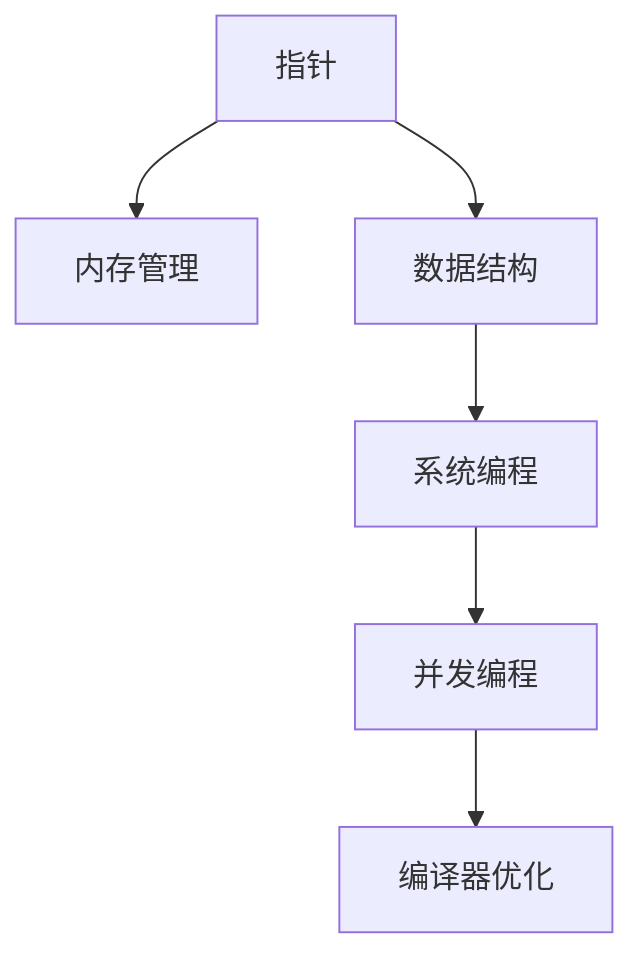

                 

# 高级编程：C 语言的力量

> 关键词：高级编程, C 语言, 编程技巧, 性能优化, 数据结构, 系统编程, 编译器优化, 编程实践

## 1. 背景介绍

### 1.1 问题由来
在现代软件开发中，C语言仍然是最受欢迎和广泛使用的编程语言之一。它具有高效性、灵活性和接近硬件的特性，广泛应用于操作系统、嵌入式系统、游戏开发、高性能计算等领域。然而，C语言的学习曲线较陡，需要开发者对计算机体系结构、操作系统原理、数据结构与算法等知识有较深的理解。

本文将从高级编程的角度，探讨C语言的精髓和技巧，帮助读者提升C语言编程水平，掌握高效开发和高性能编程的核心技能。

### 1.2 问题核心关键点
C语言之所以强大，是因为它提供了一个接近硬件的编程接口，使得程序员能够直接控制计算机资源，实现高效的程序设计。然而，这种灵活性也使得C语言的代码编写和管理变得复杂。本节将围绕C语言的核心概念，阐述其与高级编程之间的联系，以及如何通过C语言编写高效、可维护、可扩展的程序。

## 2. 核心概念与联系

### 2.1 核心概念概述

为了更好地理解C语言和高级编程的关系，本节将介绍几个密切相关的核心概念：

- **指针(Pointer)**：C语言的核心特性之一，允许程序员直接操作内存地址，实现对硬件的低级别控制。
- **内存管理(Memory Management)**：C语言中的动态内存分配和释放，需要程序员手动管理，这对编写高效和可靠的代码至关重要。
- **数据结构(Data Structure)**：C语言提供了丰富的数据类型和结构体，是实现复杂算法和数据处理的基础。
- **系统编程(System Programming)**：C语言在操作系统、网络编程、设备驱动等方面具有天然的优势，是系统编程的首选语言。
- **并发编程(Concurrency Programming)**：C语言的标准库提供了POSIX线程库(pthread)，支持多线程并发编程，提高了程序的效率和响应性。
- **编译器优化(Compiler Optimization)**：C语言的编译器提供了许多优化选项，可以生成高效、紧凑的代码，提高程序的执行效率。

这些核心概念之间的逻辑关系可以通过以下Mermaid流程图来展示：



这个流程图展示了大语言模型的核心概念及其之间的关系：

1. 指针是C语言的基础，通过指针可以直接访问和修改内存地址。
2. 内存管理依赖于指针，程序员需要手动管理内存分配和释放。
3. 数据结构建立在指针和内存管理之上，用于表示复杂的数据类型。
4. 系统编程利用了指针和数据结构的特性，支持对硬件和系统资源的直接操作。
5. 并发编程依赖于系统编程和内存管理，POSIX线程库支持多线程并发。
6. 编译器优化则利用了指针和数据结构的特性，生成高效、紧凑的代码。

这些概念共同构成了C语言和高级编程的核心框架，使得C语言成为系统编程和高性能编程的首选语言。

## 3. 核心算法原理 & 具体操作步骤
### 3.1 算法原理概述

C语言的高级编程依赖于对指针、内存管理、数据结构和系统编程的深入理解。通过合理利用这些特性，可以编写高效、可靠的代码，实现复杂的算法和数据处理。

### 3.2 算法步骤详解

C语言的高级编程主要包括以下几个关键步骤：

**Step 1: 理解指针和内存管理**

- 掌握指针的基本用法，如指针变量声明、指针取值、指针运算等。
- 理解动态内存分配和释放的基本操作，如malloc、free、realloc等函数的使用。
- 熟悉内存泄漏和指针错误等问题，并学会使用valgrind等工具进行内存调试。

**Step 2: 设计数据结构和算法**

- 使用结构体和联合体来定义复杂的数据类型。
- 设计合适的算法，利用指针和数据结构进行操作。
- 编写测试代码，验证算法的正确性。

**Step 3: 实现系统编程和并发编程**

- 理解操作系统原理，掌握文件操作、进程管理、网络编程等系统编程技术。
- 利用线程库实现多线程并发编程，理解线程同步和互斥机制。
- 编写和调试并发程序，确保程序的正确性和性能。

**Step 4: 优化代码性能**

- 学习编译器优化选项，如-O2、-O3、-finline-functions等，以提高程序的执行效率。
- 使用内联汇编和函数内联技术，进一步优化程序性能。
- 分析和诊断程序瓶颈，进行必要的性能改进。

### 3.3 算法优缺点

C语言的高级编程具有以下优点：

1. **高效性**：C语言提供了对硬件的低级别控制，能够实现高效的内存管理和数据处理。
2. **灵活性**：C语言具有丰富的数据类型和结构，支持复杂算法和数据结构的设计。
3. **可移植性**：C语言的标准库和编译器提供了跨平台的支持，可以运行在各种操作系统和硬件平台上。
4. **可维护性**：通过合理利用指针和内存管理，C语言的代码更加模块化，易于维护和扩展。

同时，该方法也存在一定的局限性：

1. **复杂性**：C语言的语法和特性较为复杂，需要程序员具备较高的编程水平。
2. **错误多**：C语言的指针操作和内存管理容易出错，需要程序员谨慎编写和调试代码。
3. **缺乏安全性**：C语言的指针和内存管理不提供自动检查，容易产生内存泄漏、越界访问等问题。
4. **可读性差**：C语言的代码风格和命名规范相对自由，难以编写易于理解和维护的代码。

尽管存在这些局限性，但就目前而言，C语言的高级编程仍是最主流和高效的程序设计范式。未来相关研究的重点在于如何进一步降低C语言的复杂性，提高代码的可读性和可维护性，同时兼顾高效性和可移植性。

### 3.4 算法应用领域

C语言的高级编程广泛应用于以下领域：

- **操作系统**：Linux、Unix等操作系统大部分是用C语言编写的。
- **嵌入式系统**：单片机、智能设备等嵌入式系统的编程语言以C语言为主。
- **游戏开发**：许多游戏引擎和库是用C语言开发的。
- **高性能计算**：科学计算、机器学习等领域，C语言的高效性使其成为首选。
- **网络编程**：C语言的Socket API支持网络编程，广泛应用于服务器端开发。
- **系统安全**：C语言的低级别特性使其在安全编码和漏洞修复中具有重要作用。

这些应用领域展示了C语言和高级编程的强大实力，推动了计算机技术和应用的不断进步。

## 4. 数学模型和公式 & 详细讲解 & 举例说明

### 4.1 数学模型构建

C语言和高级编程涉及许多数学模型和算法。本节将使用数学语言对C语言中的核心算法进行更加严格的刻画。

假设有序数组 $A=\{a_0, a_1, ..., a_{n-1}\}$，其中 $a_i$ 为元素值，$n$ 为数组长度。

定义在有序数组中进行二分查找的函数为：

$$
\text{binarySearch}(A, n, x) = \begin{cases}
i, & \text{如果 } A[i] = x \\
-1, & \text{如果 } x \not\in A
\end{cases}
$$

其中 $x$ 为要查找的元素值。

### 4.2 公式推导过程

在有序数组中进行二分查找的基本步骤如下：

1. 初始化左右指针 $left=0$ 和 $right=n-1$。
2. 计算中间指针 $mid=\lfloor \frac{left+right}{2} \rfloor$。
3. 比较 $A[mid]$ 和 $x$，根据比较结果调整 $left$ 或 $right$ 的值。
4. 重复步骤2-3，直到 $left>right$。

二分查找的时间复杂度为 $O(\log n)$，空间复杂度为 $O(1)$。

### 4.3 案例分析与讲解

以下是一个使用C语言实现二分查找的示例代码：

```c
#include <stdio.h>

int binarySearch(int A[], int n, int x) {
    int left = 0, right = n - 1;
    while (left <= right) {
        int mid = (left + right) / 2;
        if (A[mid] == x) {
            return mid;
        } else if (A[mid] < x) {
            left = mid + 1;
        } else {
            right = mid - 1;
        }
    }
    return -1;
}

int main() {
    int A[] = {1, 3, 5, 7, 9, 11};
    int n = sizeof(A) / sizeof(A[0]);
    int x = 5;
    int index = binarySearch(A, n, x);
    if (index != -1) {
        printf("找到元素 %d，索引为 %d\n", x, index);
    } else {
        printf("未找到元素 %d\n", x);
    }
    return 0;
}
```

代码解释：
- 函数 `binarySearch` 接受有序数组 `A`、数组长度 `n` 和要查找的元素值 `x`。
- 在 `while` 循环中，计算中间指针 `mid`，并比较 $A[mid]$ 和 $x$ 的大小，根据比较结果调整指针。
- 如果找到元素，返回索引；否则返回 -1。
- 在 `main` 函数中，定义有序数组 `A` 和要查找的元素值 `x`，调用 `binarySearch` 函数进行查找，并输出结果。

## 5. 项目实践：代码实例和详细解释说明
### 5.1 开发环境搭建

在进行高级编程实践前，我们需要准备好开发环境。以下是使用Linux系统进行C语言开发的环境配置流程：

1. 安装GNU编译器套件(gcc)：
```bash
sudo apt-get update
sudo apt-get install build-essential
```

2. 安装GNU调试器(gdb)：
```bash
sudo apt-get install gdb
```

3. 安装valgrind：
```bash
sudo apt-get install valgrind
```

4. 安装Emacs或VSCode作为编辑器：
```bash
sudo apt-get install emacs
```

完成上述步骤后，即可在Linux环境下开始C语言高级编程的实践。

### 5.2 源代码详细实现

下面我们以单向链表(Linked List)为例，给出使用C语言实现链表操作和算法的基本代码实现。

```c
#include <stdio.h>
#include <stdlib.h>

// 链表节点定义
typedef struct Node {
    int data;
    struct Node *next;
} Node;

// 插入节点
Node *insert(Node *head, int value) {
    Node *newNode = (Node *)malloc(sizeof(Node));
    newNode->data = value;
    newNode->next = head;
    return newNode;
}

// 打印链表
void printList(Node *head) {
    while (head != NULL) {
        printf("%d ", head->data);
        head = head->next;
    }
    printf("\n");
}

// 查找节点
Node *search(Node *head, int value) {
    while (head != NULL) {
        if (head->data == value) {
            return head;
        }
        head = head->next;
    }
    return NULL;
}

int main() {
    Node *head = NULL;
    head = insert(head, 1);
    head = insert(head, 2);
    head = insert(head, 3);
    head = insert(head, 4);
    head = insert(head, 5);
    printList(head);
    Node *result = search(head, 3);
    if (result != NULL) {
        printf("找到节点 3\n");
    } else {
        printf("未找到节点 3\n");
    }
    return 0;
}
```

代码解释：
- 定义链表节点 `Node` 结构体，包含数据成员 `data` 和指针成员 `next`，指向下一个节点。
- `insert` 函数用于在链表头部插入新节点，返回新节点。
- `printList` 函数用于打印链表中的所有节点。
- `search` 函数用于在链表中查找指定节点，返回节点指针。
- 在 `main` 函数中，创建链表并插入节点，打印链表，查找节点并输出结果。

### 5.3 代码解读与分析

让我们再详细解读一下关键代码的实现细节：

**Node 结构体**：
- 定义了链表节点的基本结构，包含一个整数型数据和指向下一个节点的指针。

**insert 函数**：
- 动态分配内存，插入新节点到链表头部，更新链表头指针。

**printList 函数**：
- 遍历链表，依次输出每个节点的数据值。

**search 函数**：
- 遍历链表，查找指定节点的指针。

**main 函数**：
- 创建链表，插入节点，打印链表，查找指定节点并输出结果。

## 6. 实际应用场景
### 6.1 高性能计算

C语言的高级编程在科学计算、数值模拟、密码学等领域得到了广泛应用。C语言的高效性和灵活性使得程序员能够编写高性能的程序，满足高精度、高速度的需求。

在科学计算中，C语言被广泛应用于数值求解、线性代数、统计分析等领域。例如，LAPACK、BLAS等科学计算库都是用C语言编写的。

在密码学中，C语言的低级别特性使其能够高效地实现加密算法和哈希函数。常用的加密库如OpenSSL、GnuPG都是用C语言实现的。

### 6.2 嵌入式系统

C语言的高级编程在嵌入式系统开发中具有天然优势。嵌入式系统资源有限，需要高效、紧凑的代码。C语言能够直接操作硬件和内存，提供高性能的程序设计。

例如，单片机、智能设备等嵌入式系统的驱动程序和应用程序，通常都是用C语言编写的。这些程序需要高效、稳定、可移植，满足实时性要求。

### 6.3 网络编程

C语言的高级编程在网络编程中得到了广泛应用。网络编程需要高效、低延迟的程序设计，C语言的高效性和灵活性使其成为首选。

例如，Linux系统的网络编程API提供了Socket编程接口，C语言的标准库支持各种网络协议和操作。许多网络服务，如HTTP、SMTP、DNS等，都是用C语言实现的。

### 6.4 系统编程

C语言的高级编程在系统编程中具有重要地位。操作系统、驱动程序、系统服务、文件管理等系统组件，通常都是用C语言编写的。

例如，Unix/Linux操作系统中的大部分组件都是用C语言编写的。C语言的指针和内存管理特性，使得程序员能够高效地操作系统资源。

### 6.5 数据库编程

C语言的高级编程在数据库编程中得到了广泛应用。数据库系统需要高效、可靠的程序设计，C语言的高效性和稳定性使其成为首选。

例如，MySQL、PostgreSQL等数据库系统的核心组件都是用C语言编写的。C语言的指针和数据结构特性，使得程序员能够高效地操作数据库。

### 6.6 人工智能

C语言的高级编程在人工智能领域也得到了广泛应用。人工智能需要高效、可扩展的程序设计，C语言的高效性和灵活性使其成为首选。

例如，TensorFlow、PyTorch等深度学习库提供了C语言的API，使得程序员能够高效地实现深度学习算法。C语言的指针和数据结构特性，使得程序员能够高效地实现数据处理和模型优化。

## 7. 工具和资源推荐
### 7.1 学习资源推荐

为了帮助开发者系统掌握C语言的高级编程，以下是一些优质的学习资源：

1. K&R《The C Programming Language》：C语言的经典教材，详细介绍了C语言的基础语法和编程技巧。
2. Dijkstra《The Cambridge Dictionary of Computing》：解释了许多C语言相关的术语和概念。
3. Agner Fog的《Optimizing Software in C and C++》：介绍了C语言的优化技巧和编程实践。
4. ISO C标准：最新的C语言标准，包含了C语言的所有规范和细节。
5. GeeksforGeeks《C Programming》：提供了大量的C语言编程练习和示例代码。
6. HackerRank《C Programming》：提供了大量的C语言编程挑战，帮助你提高编程水平。

通过对这些资源的学习实践，相信你一定能够全面掌握C语言的高级编程技能，并用于解决实际问题。

### 7.2 开发工具推荐

高效的开发离不开优秀的工具支持。以下是几款用于C语言高级编程开发的常用工具：

1. Emacs：功能强大的文本编辑器，支持自动补全、语法高亮、宏定义等功能。
2. VSCode：轻量级的文本编辑器，支持调试、集成开发环境等功能。
3. clang：开源的C语言编译器，支持语法检查、静态分析等功能。
4. valgrind：内存调试工具，能够检测内存泄漏、越界访问等问题。
5. gdb：开源的调试器，支持断点、单步执行、变量查看等功能。
6. Eclipse：集成开发环境，支持C语言的开发、调试、编译等功能。

合理利用这些工具，可以显著提升C语言高级编程的开发效率，加快创新迭代的步伐。

### 7.3 相关论文推荐

C语言的高级编程涉及许多前沿的研究方向。以下是几篇具有代表性的论文，推荐阅读：

1. Aho, Sethi & Ullman的《Compilers: Principles, Techniques, and Tools》：介绍了编译器原理和优化技术。
2. Tichy的《Advanced C Programming》：介绍了C语言的高级编程技巧和实践。
3. Ulf Adams的《Advanced Topics in C Programming》：介绍了C语言的数据结构、算法和系统编程技术。
4. Leelanand Muley的《Programming in C》：介绍了C语言的高级编程技巧和应用。
5. Rüdiger Paseman的《C Programming: A Problem Solving Approach》：介绍了C语言的问题求解方法和编程实践。

这些论文代表了大语言模型微调技术的发展脉络。通过学习这些前沿成果，可以帮助研究者把握学科前进方向，激发更多的创新灵感。

## 8. 总结：未来发展趋势与挑战

### 8.1 总结

本文对C语言的高级编程进行了全面系统的介绍。首先阐述了C语言和高级编程的关系，明确了高级编程在C语言中的应用场景，以及如何通过C语言编写高效、可维护、可扩展的程序。其次，从原理到实践，详细讲解了C语言中的核心算法和数据结构，并给出了代码实例。最后，本文还探讨了C语言高级编程在实际应用中的广泛应用，展示了C语言和高级编程的强大实力。

通过本文的系统梳理，可以看到，C语言的高级编程是系统编程和高性能编程的首选语言，具有高效性、灵活性和可移植性等优点。未来，伴随计算机技术和硬件设备的不断进步，C语言的高级编程将面临更多的挑战和机遇。

### 8.2 未来发展趋势

展望未来，C语言的高级编程将呈现以下几个发展趋势：

1. **分布式计算**：随着大规模并行计算和分布式系统的兴起，C语言在多核、多线程和分布式编程中的应用将更加广泛。
2. **物联网**：嵌入式系统、智能设备等物联网应用将不断增多，C语言的低级别特性使其能够高效地实现这些应用。
3. **量子计算**：C语言的灵活性和低级别特性使其成为量子计算和量子算法开发的首选语言。
4. **人工智能**：C语言的高级编程在人工智能领域的应用将更加深入，涉及深度学习、数据处理、模型优化等方面。
5. **新语言标准**：C语言的标准化进程将不断推进，新的语言特性和API将不断出现，推动C语言的持续发展。

以上趋势凸显了C语言高级编程的广阔前景，推动了计算机技术和应用的不断进步。

### 8.3 面临的挑战

尽管C语言的高级编程已经取得了瞩目成就，但在迈向更加智能化、普适化应用的过程中，它仍面临着诸多挑战：

1. **复杂性**：C语言的语法和特性较为复杂，需要程序员具备较高的编程水平。
2. **错误多**：C语言的指针操作和内存管理容易出错，需要程序员谨慎编写和调试代码。
3. **可读性差**：C语言的代码风格和命名规范相对自由，难以编写易于理解和维护的代码。
4. **性能优化**：C语言的高效性依赖于合理的代码结构和编译器优化选项，需要对程序进行细致的性能分析和优化。
5. **跨平台兼容性**：C语言的跨平台兼容性需要考虑编译器、操作系统、硬件平台的差异，增加开发复杂度。

尽管存在这些挑战，但就目前而言，C语言的高级编程仍是最主流和高效的程序设计范式。未来相关研究的重点在于如何进一步降低C语言的复杂性，提高代码的可读性和可维护性，同时兼顾高效性和可移植性。

### 8.4 研究展望

未来，C语言的高级编程需要从以下几个方面进行深入研究：

1. **自动化编程工具**：开发更多的自动化编程工具，如IntelliSense、IDE集成等，提高编程效率。
2. **智能编程辅助**：引入智能编程辅助技术，如代码自动生成、自动注释等，提高代码质量。
3. **编译器优化**：优化编译器算法和优化选项，生成更高效、紧凑的代码。
4. **系统编程接口**：开发更多的系统编程接口和库，简化编程复杂度。
5. **嵌入式系统支持**：进一步优化C语言在嵌入式系统中的性能和资源使用。
6. **人工智能应用**：探索C语言在人工智能领域的应用，如深度学习、数据处理等。

这些研究方向的探索，必将引领C语言高级编程技术迈向更高的台阶，为计算机技术和应用的发展提供新的动力。面向未来，C语言的高级编程需要从数据、算法、工程、应用等多个维度协同发力，才能真正实现人工智能技术在垂直行业的规模化落地。

## 9. 附录：常见问题与解答

**Q1: C语言是否适用于所有编程场景？**

A: C语言适用于大多数编程场景，特别是对性能要求较高的应用。但由于C语言的语法和特性较为复杂，对程序员的要求较高。对于一些需求清晰、规则明确的场景，C语言是首选。但对于需要跨平台、易维护、易扩展的场景，可能需要选择其他高级语言。

**Q2: 如何避免C语言中的指针错误？**

A: 避免指针错误的关键在于合理使用指针和内存管理。需要注意以下几点：
1. 初始化指针变量，避免未初始化的指针使用。
2. 避免指针悬挂，即在释放内存后继续使用指针。
3. 避免指针越界访问，即访问数组越界或野指针。
4. 使用工具如valgrind检测内存错误，及时修复问题。

**Q3: 如何提高C语言程序的性能？**

A: 提高C语言程序的性能需要从多个方面入手：
1. 优化算法和数据结构，减少时间复杂度和空间复杂度。
2. 使用内联汇编和函数内联技术，提高代码执行效率。
3. 优化编译器选项，如-O2、-O3、-finline-functions等。
4. 使用指针和数据结构，减少内存占用和复制。
5. 使用多线程和并发编程，提高程序响应性。

**Q4: C语言在人工智能中应用广泛吗？**

A: C语言在人工智能中也有广泛应用，特别是底层系统开发和性能要求较高的场景。例如，TensorFlow、PyTorch等深度学习库提供了C语言API，使得程序员能够高效地实现深度学习算法。但在一些高层次的应用中，Python等高级语言更为适合。

**Q5: C语言和C++的区别是什么？**

A: C语言和C++的区别在于语言特性和编程范式。C++在C语言的基础上添加了类、继承、模板等面向对象特性，支持更高级的编程范式。C++也提供了更丰富的标准库和API，如STL、Boost等，便于开发复杂的系统。但C++的复杂性和语法糖也增加了编程难度。

总之，C语言的高级编程是一门强大的编程技术，掌握了C语言的高级编程技巧，能够编写高效、可靠、可维护的程序。面对未来计算机技术和应用的发展，C语言的高级编程将面临更多的挑战和机遇，需要不断探索和优化。相信通过本文的介绍和引导，读者能够深入理解C语言的高级编程，为未来的软件开发和应用提供新的思路和工具。

