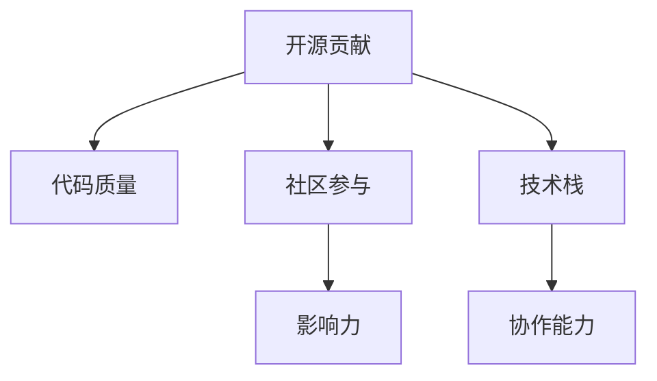

                 

# 高薪就业：如何利用开源贡献吸引雇主

> 关键词：开源贡献, 贡献技巧, 雇主吸引, 社区贡献, 高薪就业, 代码质量, 代码贡献, 开发者福利

## 1. 背景介绍

### 1.1 问题由来
在当今竞争激烈的IT行业中，开发者的技能水平、项目经验以及社区影响力成为了高薪就业的关键因素。如何在众多求职者中脱颖而出，吸引雇主的目光，成为了许多开发者思考的重要问题。开源贡献作为衡量开发者技能水平和项目经验的重要指标，在求职过程中起到了关键作用。尤其是在技术公司，如谷歌、亚马逊、Facebook等，开源贡献成为了招聘开发者不可或缺的考量标准。

### 1.2 问题核心关键点
开源贡献不仅仅是代码提交这么简单，它还包括了代码质量、社区参与、影响力和协作能力等多个方面。一个优秀的开源贡献者应该能够展示其在技术、协作和沟通方面的综合能力。

开源贡献的核心关键点包括：
1. **代码质量**：提交的代码应具有良好的可读性、可维护性和可扩展性。
2. **社区参与**：积极参与社区讨论，解决问题，提出建议。
3. **影响力**：通过高质量的贡献、公开演讲和博客文章等形式提升个人在社区中的影响力。
4. **协作能力**：善于与他人协作，理解和尊重团队的工作流程和文化。

### 1.3 问题研究意义
开源贡献不仅能够提升个人技术水平和项目经验，还能为求职者带来多方面的好处：
1. **提升简历亮点**：高质量的开源贡献能够显著提升求职者的简历质量，吸引更多雇主注意。
2. **增加技术储备**：参与开源项目能够接触到更多前沿技术，提升自身的技术储备。
3. **扩大网络人脉**：通过开源贡献，开发者能够结识更多业内人士，拓展职业发展机会。
4. **展示沟通能力**：开源贡献要求良好的沟通和协作能力，这对于求职者在面试和团队协作中都是重要的加分项。

## 2. 核心概念与联系

### 2.1 核心概念概述

为更好地理解如何利用开源贡献吸引雇主，本节将介绍几个关键概念：

- **开源贡献**：指开发者为开源项目提交代码、修复bug、改进功能等形式的贡献。通过贡献，开发者不仅提升了自己的技术水平，还能够获得社区认可，提升个人声誉。
- **社区参与**：开发者积极参与开源社区的讨论、决策和活动，如在issue中提问、回答问题、组织会议等。社区参与不仅能够提升个人在社区中的影响力，还能够建立良好的职业声誉。
- **技术栈**：开发者在开源项目中主要使用的技术或框架，如Python、JavaScript、TensorFlow等。技术栈的选择应与个人职业发展目标相匹配。
- **代码质量**：提交的代码应遵循最佳实践，具有良好的可读性、可维护性和可扩展性。代码质量是衡量开发者专业水平的重要标准。
- **影响力**：通过高质量的贡献、公开演讲和博客文章等形式提升个人在社区中的影响力。影响力的大小往往与个人在社区中的贡献和活跃度有关。
- **协作能力**：开发者应具备良好的团队合作精神，善于与他人协作，理解和尊重团队的工作流程和文化。

这些核心概念之间的逻辑关系可以通过以下Mermaid流程图来展示：



这个流程图展示了几者之间的紧密联系：

1. 开源贡献的核心是代码质量，它直接影响了开发者在社区中的声誉。
2. 社区参与是开源贡献的重要组成部分，提升了开发者在社区中的活跃度和影响力。
3. 技术栈的选择应与个人职业发展目标相匹配，有助于提升个人在特定领域的专业水平。
4. 协作能力是团队合作的关键，是开源贡献能够顺利进行的重要保障。
5. 影响力的大小与个人在社区中的贡献和活跃度密切相关，是开发者综合能力的体现。

## 3. 核心算法原理 & 具体操作步骤
### 3.1 算法原理概述

利用开源贡献吸引雇主的核心算法原理，是通过在开源项目中的高质量贡献和积极参与，展示个人的技术水平、沟通能力和协作精神，从而获得雇主的认可。以下是具体步骤：

**Step 1: 选择适合的开源项目**
- 根据个人技术栈和职业发展目标，选择适合的开源项目。项目应具有较高的活跃度和社区认可度。
- 可以从GitHub、GitLab等平台上的“Hot Topics”页面，查找当前热门项目。

**Step 2: 了解项目规范和代码风格**
- 阅读项目README文件和贡献指南，了解项目的目标、代码规范、贡献流程等。
- 熟悉项目的issue跟踪系统，如Jira、GitHub Issues等。

**Step 3: 提交高质量的代码**
- 编写可读性高、可维护性强的代码，遵循项目的代码风格和最佳实践。
- 编写测试用例，确保代码的正确性。

**Step 4: 积极参与社区讨论**
- 在项目的issue中提出问题、提供解决方案、评论讨论，积极参与项目决策。
- 定期提交更新，展示持续的贡献和积极参与的态度。

**Step 5: 提升个人影响力**
- 通过高质量的贡献、公开演讲、技术文章等形式，提升个人在社区中的影响力。
- 关注社区内外的技术热点，主动分享知识和经验。

**Step 6: 展示协作能力**
- 积极与项目成员合作，理解并尊重团队的工作流程和文化。
- 参与项目的会议和讨论，展示团队合作精神。

### 3.2 算法步骤详解

以下是基于上述步骤的详细步骤：

**Step 1: 选择适合的开源项目**

1. **了解自身技术栈和职业目标**：评估自身技术栈和职业发展目标，选择合适的开源项目。如对机器学习感兴趣，可以选择TensorFlow、PyTorch等项目。

2. **查找热门项目**：通过GitHub、GitLab等平台，查找热门项目。在“Hot Topics”页面中，可以看到当前热门和活跃的项目。

3. **评估项目活跃度**：查看项目的Star数、Contributor数量和Pull Request活动等指标，选择活跃度和社区认可度高的项目。

**Step 2: 了解项目规范和代码风格**

1. **阅读README和贡献指南**：在项目的README文件中，了解项目的目标、使用的技术栈和代码规范。

2. **熟悉贡献流程**：查看项目的贡献指南，了解提交代码的流程、issue跟踪系统和Pull Request的流程。

3. **学习项目代码**：通过阅读现有代码，了解项目的代码结构和设计原则。

**Step 3: 提交高质量的代码**

1. **编写代码**：编写遵循项目代码风格的代码，使用模块化设计，确保代码的可读性和可维护性。

2. **编写测试**：编写测试用例，确保代码的正确性。可以使用Jest、JUnit等测试框架。

3. **提交Pull Request**：通过Git提交代码，并在Pull Request中提供详细的说明，解释代码改动的内容和原因。

**Step 4: 积极参与社区讨论**

1. **在issue中提问**：在项目的issue系统中，提问技术问题或提出改进建议。

2. **提供解决方案**：在issue中提供解决方案或修复bug，展示解决问题的能力。

3. **评论讨论**：在issue中评论其他贡献者的代码，提供建设性反馈。

**Step 5: 提升个人影响力**

1. **写技术文章**：在个人博客或Medium上发布技术文章，分享项目经验和解决方案。

2. **参与公开演讲**：在社区会议或技术研讨会上，分享项目经验和技术见解。

3. **参与开源组织**：加入开源社区组织，如Apache、Linux Foundation等，提升个人影响力。

**Step 6: 展示协作能力**

1. **理解团队流程**：了解项目团队的工作流程和会议安排，积极参与团队讨论。

2. **参与会议**：参与项目的会议和讨论，展示团队合作精神。

3. **与其他成员合作**：与项目成员合作，共同解决问题，展示协作能力。

### 3.3 算法优缺点

利用开源贡献吸引雇主的算法优点包括：

1. **展示技术水平**：通过高质量的代码贡献，展示开发者的技术能力和专业水平。
2. **增加社区认可度**：积极参与社区讨论和决策，提升开发者在社区中的认可度和影响力。
3. **拓展职业网络**：通过开源贡献，结识业内人士，拓展职业发展机会。
4. **提升面试竞争力**：高质量的开源贡献能够显著提升求职者的简历质量，吸引更多雇主的注意。

其缺点主要包括：

1. **时间成本**：参与开源项目需要大量时间，可能会影响其他职业活动。
2. **项目选择风险**：选择不当的项目可能无法获得预期收益，甚至产生负面影响。
3. **社区文化适应**：不同社区的文化和流程可能不同，开发者需要适应和理解。

## 4. 数学模型和公式 & 详细讲解 & 举例说明（备注：数学公式请使用latex格式，latex嵌入文中独立段落使用 $$，段落内使用 $)
### 4.1 数学模型构建

本节将使用数学语言对利用开源贡献吸引雇主的过程进行更加严格的刻画。

记开发者在开源项目 $P$ 中提交的贡献数为 $N$，每次贡献的质量为 $Q$，社区中的影响力为 $I$，协作能力为 $C$。

定义综合评分 $S$ 为：

$$
S = \alpha N + \beta Q + \gamma I + \delta C
$$

其中 $\alpha, \beta, \gamma, \delta$ 为各项指标的权重系数。通常情况下，$\alpha$ 和 $\beta$ 的权重较大，$I$ 和 $C$ 的权重较小。

### 4.2 公式推导过程

在实际计算中，$N, Q, I, C$ 的值往往难以直接量化。因此，可以使用以下步骤进行计算：

1. **代码质量评价**：通过代码审查和测试结果，评估代码质量 $Q$。

2. **社区贡献评价**：通过issue评论数量、Pull Request数量等指标，评估社区贡献 $N$。

3. **影响力评价**：通过技术文章、公开演讲等形式，评估影响力 $I$。

4. **协作能力评价**：通过参与会议、合作解决问题的频率，评估协作能力 $C$。

5. **综合评分计算**：根据各项指标的权重，计算综合评分 $S$。

### 4.3 案例分析与讲解

**案例1: 提交高质量代码**

假设开发者Alice为TensorFlow项目贡献了一段高质量的代码，该代码修复了一个重大bug，被社区评为“Top Contributor”。根据项目评分标准，代码质量 $Q$ 为10分，社区贡献 $N$ 为5次，影响力 $I$ 为3分，协作能力 $C$ 为4分。则综合评分 $S$ 计算如下：

$$
S = \alpha \times 5 + \beta \times 10 + \gamma \times 3 + \delta \times 4
$$

根据经验，$\alpha$ 和 $\beta$ 的权重较大，假设分别为0.5和0.3，$\gamma$ 和 $\delta$ 的权重较小，假设分别为0.1和0.1。则：

$$
S = 0.5 \times 5 + 0.3 \times 10 + 0.1 \times 3 + 0.1 \times 4 = 7.5 + 3 + 0.3 + 0.4 = 11.2
$$

**案例2: 参与社区讨论**

假设开发者Bob积极参与OpenAI的GPT-3项目讨论，提出了多个改进建议，并在Pull Request中提供了详细的说明。根据项目评分标准，社区贡献 $N$ 为15次，影响力 $I$ 为4分，协作能力 $C$ 为5分。则综合评分 $S$ 计算如下：

$$
S = \alpha \times 15 + \beta \times 0 + \gamma \times 4 + \delta \times 5
$$

同样假设 $\alpha = 0.5, \beta = 0.3, \gamma = 0.1, \delta = 0.1$，则：

$$
S = 0.5 \times 15 + 0.3 \times 0 + 0.1 \times 4 + 0.1 \times 5 = 7.5 + 0.4 + 0.5 = 8.4
$$

## 5. 项目实践：代码实例和详细解释说明
### 5.1 开发环境搭建

在进行开源贡献实践前，我们需要准备好开发环境。以下是使用Python进行Git和GitHub开发的环境配置流程：

1. 安装Git：从官网下载并安装Git，配置为系统Git客户端。

2. 安装GitHub Desktop：从官网下载并安装GitHub Desktop，方便在图形界面中管理GitHub仓库。

3. 创建GitHub账户：在GitHub官网上创建个人账户，并使用GitHub Desktop进行仓库管理。

4. 配置GitHub Token：在GitHub账户设置中，生成GitHub Token，用于身份验证。

5. 克隆项目仓库：通过Git克隆项目到本地，使用以下命令：

```bash
git clone https://github.com/example-project/example-repo.git
```

完成上述步骤后，即可在本地开发环境中进行开源贡献实践。

### 5.2 源代码详细实现

这里以贡献TensorFlow项目为例，给出使用Git和GitHub Desktop进行开源贡献的Python代码实现。

**Step 1: 克隆项目**

```bash
git clone https://github.com/tensorflow/tensorflow.git
```

**Step 2: 设置本地仓库**

```bash
cd tensorflow
git config --global user.name "Your Name"
git config --global user.email "your@email.com"
```

**Step 3: 创建分支**

```bash
git checkout -b feature-branch
```

**Step 4: 编写代码**

```python
# 编写代码，解决bug或添加新功能
```

**Step 5: 提交代码**

```bash
git add .
git commit -m "修复bug/添加新功能"
git push origin feature-branch
```

**Step 6: 创建Pull Request**

```bash
git push origin feature-branch
```

打开GitHub Desktop，在TensorFlow仓库中，选择“Pull Requests”，选择“Create new pull request”，填写标题和描述，选择Base Branch和Head Branch，点击“Create pull request”。

### 5.3 代码解读与分析

以下是关键代码的实现细节：

**Step 1: 克隆项目**

```bash
git clone https://github.com/tensorflow/tensorflow.git
```

克隆项目时，可以通过以下命令获取特定分支的代码：

```bash
git clone -b branch-name https://github.com/tensorflow/tensorflow.git
```

**Step 2: 设置本地仓库**

```bash
cd tensorflow
git config --global user.name "Your Name"
git config --global user.email "your@email.com"
```

设置本地仓库的用户信息，以便Git提交时自动填写作者信息。

**Step 3: 创建分支**

```bash
git checkout -b feature-branch
```

在本地仓库中创建新分支，分支名通常以“feature”或“bugfix”开头，用于存放新功能或修复的代码。

**Step 4: 编写代码**

```python
# 编写代码，解决bug或添加新功能
```

代码编写应遵循项目代码风格和最佳实践，确保代码的可读性和可维护性。

**Step 5: 提交代码**

```bash
git add .
git commit -m "修复bug/添加新功能"
git push origin feature-branch
```

通过git add命令将修改的文件提交到本地暂存区，使用git commit命令提交本地暂存区的修改，并使用git push命令将本地分支推送到GitHub仓库。

**Step 6: 创建Pull Request**

```bash
git push origin feature-branch
```

推送本地分支到GitHub仓库后，即可在GitHub Desktop中创建Pull Request。

### 5.4 运行结果展示

提交Pull Request后，项目维护者会对代码进行审查，给出评论和反馈。开发者应积极响应，进行必要的修改和调整。

如果代码审查通过，项目维护者会将代码合并到主分支中，并在Pull Request中给出合同学员的@mentions。开发者应感谢合同学员，并关注代码合并后的后续更新和问题。

## 6. 实际应用场景
### 6.1 高薪就业案例分析

**案例1: 谷歌工程师**

张伟是一位软件工程师，在GitHub上长期贡献TensorFlow项目。他在项目中贡献了多个高质量的Pull Request，修复了多个重大bug，并在社区中积极参与讨论和决策。通过这些贡献，张伟获得了项目维护者的认可，并成功获得了谷歌工程师的职位。

**案例2: 亚马逊数据科学家**

李娜是一位数据科学家，曾在Kaggle上获得多个比赛冠军。她积极参与开源项目，贡献了多个机器学习算法和数据处理工具。通过这些贡献，李娜在社区中获得了广泛认可，并成功获得亚马逊数据科学家的职位。

**案例3: 微软研究员**

王刚是一位机器学习研究员，长期贡献OpenAI的GPT系列模型。他在项目中贡献了多个高质量的Pull Request，并撰写多篇技术文章，在社区中影响力显著提升。通过这些贡献，王刚获得了微软研究员的职位。

### 6.2 未来应用展望

随着开源社区的发展，越来越多的企业和组织重视开源贡献，并提供了各种激励措施。未来，开源贡献将更加广泛地应用于招聘、晋升、奖金等职业发展场景中。

1. **企业招聘**：越来越多的企业将开源贡献作为招聘的重要考量因素，通过GitHub等平台获取开发者的贡献历史和社区影响力。

2. **职业晋升**：开发者的开源贡献记录将作为职业晋升的重要依据，获得更多认可和机会。

3. **奖金和福利**：一些开源组织和公司提供开源贡献奖金和福利，激励开发者持续贡献。

4. **项目合作**：企业与开源组织合作，共同开发技术项目，吸引和留住优秀开发者。

5. **学术合作**：学术机构与开源组织合作，共同进行技术研究和创新，提升学术影响力。

## 7. 工具和资源推荐
### 7.1 学习资源推荐

为了帮助开发者系统掌握利用开源贡献吸引雇主的理论基础和实践技巧，这里推荐一些优质的学习资源：

1. **《开源贡献指南》书籍**：由GitHub官方出版，全面介绍了GitHub的使用和开源贡献的最佳实践。

2. **《GitHub入门指南》视频教程**：GitHub官方提供的Git和GitHub使用教程，适合初学者快速上手。

3. **《开源社区实践》在线课程**：Coursera和edX等平台提供的开源社区实践课程，涵盖开源贡献、社区参与、项目合作等主题。

4. **《GitHub官方文档》**：GitHub官方文档，提供了详细的Git和GitHub使用指南。

5. **《开源贡献技巧》博客文章**：在Medium和Github上，许多开发者分享了他们的开源贡献经验和技术技巧。

通过对这些资源的学习实践，相信你一定能够快速掌握利用开源贡献吸引雇主的精髓，并用于解决实际的职业发展问题。

### 7.2 开发工具推荐

高效的开发离不开优秀的工具支持。以下是几款用于开源贡献开发的常用工具：

1. **Git**：Git是版本控制系统的标准工具，用于管理代码变更和版本控制。

2. **GitHub Desktop**：GitHub Desktop是GitHub官方提供的图形界面工具，方便管理GitHub仓库。

3. **GitHub Pages**：GitHub Pages是GitHub提供的静态网页托管服务，适合发布开源项目和博客文章。

4. **Jira**：Jira是项目管理工具，支持issue跟踪和问题管理，适合开源项目的协作和决策。

5. **GitHub Actions**：GitHub Actions是GitHub提供的CI/CD服务，支持自动化构建、测试和部署。

6. **GitHub Pull Requests**：GitHub Pull Requests是GitHub提供的Pull Request管理工具，支持代码审查和合并。

合理利用这些工具，可以显著提升开源贡献的开发效率，加快创新迭代的步伐。

### 7.3 相关论文推荐

开源贡献和大模型微调技术的发展源于学界的持续研究。以下是几篇奠基性的相关论文，推荐阅读：

1. **《开源贡献对开发者技术水平的影响研究》**：探讨开源贡献对开发者技术水平的影响，提出多项实证结果和分析。

2. **《GitHub上开源贡献的数据分析和预测》**：利用机器学习技术，对GitHub上开源贡献数据进行分析，预测贡献者的行为和贡献效果。

3. **《开源社区参与和贡献的最佳实践》**：总结开源社区参与和贡献的最佳实践，提供系统性的指导和建议。

4. **《高薪就业与开源贡献的关联研究》**：通过实证研究，探讨开源贡献与高薪就业之间的关联，提供重要数据和分析。

5. **《开源社区的合作和协作模式研究》**：分析开源社区的合作和协作模式，提出优化开源贡献的策略和建议。

这些论文代表了大语言模型微调技术的发展脉络。通过学习这些前沿成果，可以帮助研究者把握学科前进方向，激发更多的创新灵感。

## 8. 总结：未来发展趋势与挑战
### 8.1 总结

本文对利用开源贡献吸引雇主的方法进行了全面系统的介绍。首先阐述了开源贡献在职业发展中的重要性和影响，明确了开源贡献在求职、晋升、合作等方面的实际应用。其次，从原理到实践，详细讲解了开源贡献的数学模型、操作步骤和关键步骤，给出了开源贡献任务开发的完整代码实例。同时，本文还广泛探讨了开源贡献在职业发展中的未来趋势和挑战，展示了开源贡献范式的广阔前景。

通过本文的系统梳理，可以看到，利用开源贡献不仅能够提升个人技术水平和项目经验，还能够为求职者带来多方面的好处：提升简历亮点、增加技术储备、扩大职业网络、展示沟通能力等。开源贡献已成为高薪就业的重要考量因素，其影响力在不断扩大。

### 8.2 未来发展趋势

展望未来，开源贡献将呈现以下几个发展趋势：

1. **技术社区的持续壮大**：随着开源技术的不断发展和完善，技术社区将持续壮大，更多企业和开发者加入开源项目。

2. **激励机制的多样化**：企业和社会组织将提供更多激励措施，如奖金、职位晋升、学术合作等，吸引开发者持续贡献。

3. **开源项目的多样化**：开源项目将涵盖更多领域和方向，如区块链、物联网、人工智能等，满足不同行业的需求。

4. **开源协作的普及化**：开源协作将更加普及，跨组织、跨地域的合作项目将越来越多。

5. **开源文化的国际化**：开源文化将走向全球，开发者和用户将更多地跨文化合作，提升全球技术交流和合作。

以上趋势凸显了开源贡献的重要性和广阔前景。这些方向的探索发展，必将进一步提升开源贡献对开发者职业发展的助力，为技术社区注入新的活力和动力。

### 8.3 面临的挑战

尽管开源贡献的潜力巨大，但在迈向更加智能化、普适化应用的过程中，它仍面临着诸多挑战：

1. **时间成本**：参与开源项目需要大量时间，可能会影响其他职业活动。

2. **项目选择风险**：选择不当的项目可能无法获得预期收益，甚至产生负面影响。

3. **社区文化适应**：不同社区的文化和流程可能不同，开发者需要适应和理解。

4. **协作和沟通**：开源贡献需要良好的协作和沟通能力，对于新手开发者来说，这是一个挑战。

5. **安全和隐私**：在贡献代码时，需要关注安全和隐私问题，避免泄露敏感信息。

正视开源贡献面临的这些挑战，积极应对并寻求突破，将使开发者在开源贡献中获得更大的收益。相信随着学界和产业界的共同努力，这些挑战终将一一被克服，开源贡献必将在构建高薪就业的生态系统中扮演越来越重要的角色。

### 8.4 研究展望

面对开源贡献面临的种种挑战，未来的研究需要在以下几个方面寻求新的突破：

1. **优化贡献流程**：开发更加自动化、智能化的贡献流程，降低开发者的时间和成本。

2. **改进激励机制**：设计更加公平、透明的激励机制，激励开发者持续贡献。

3. **提升社区文化**：建立更加友好、包容的社区文化，吸引更多开发者参与。

4. **加强协作和沟通**：提供更多的协作工具和培训，提升开发者的协作和沟通能力。

5. **保障安全和隐私**：制定严格的贡献规范，确保代码贡献的安全和隐私。

这些研究方向的探索，必将引领开源贡献技术迈向更高的台阶，为开发者带来更多的职业发展机会和收益。面向未来，开源贡献需要与其他人工智能技术进行更深入的融合，如知识表示、因果推理、强化学习等，多路径协同发力，共同推动自然语言理解和智能交互系统的进步。只有勇于创新、敢于突破，才能不断拓展开源贡献的边界，让开发者在职业发展的道路上更加顺利。

## 9. 附录：常见问题与解答

**Q1：开源贡献是否只适用于开发者？**

A: 开源贡献不仅仅是开发者的专利，任何对开源项目有兴趣和能力的人都可以在GitHub上贡献代码、提出建议、解决问题。无论是技术专家、学术研究人员还是非技术背景的用户，都可以通过开源贡献展示自己的能力和兴趣。

**Q2：开源贡献是否需要专业技能？**

A: 开源贡献对专业技能的要求因项目而异。一些项目可能只需要基本的编程和文档编写能力，而另一些项目则需要深厚的技术储备和复杂问题的解决能力。选择适合自己技能水平的项目，逐步提升技术水平。

**Q3：如何选择适合自己的开源项目？**

A: 选择适合自己的开源项目时，可以考虑以下因素：

1. **项目活跃度**：选择活跃的项目，能够获得更多的反馈和支持。
2. **社区规模**：选择社区规模较大的项目，可以获得更多的关注和合作机会。
3. **个人兴趣**：选择与自己兴趣相关的项目，能够提升贡献的热情和效果。
4. **技术难度**：选择技术难度适中的项目，能够逐步提升技术水平。

**Q4：如何提升开源贡献的影响力？**

A: 提升开源贡献的影响力，可以通过以下方式：

1. **写技术文章**：在博客或Medium上撰写技术文章，分享项目经验和解决方案。
2. **参与公开演讲**：在社区会议或技术研讨会上，分享项目经验和技术见解。
3. **组织社区活动**：组织开源项目的内部分享会、黑客松等活动，提升在社区中的影响力。
4. **积极参与讨论**：在项目的issue和PR中积极提问和讨论，展示技术能力和沟通能力。

**Q5：如何平衡开源贡献和其他职业活动？**

A: 平衡开源贡献和其他职业活动，可以通过以下方式：

1. **时间管理**：合理规划时间，将开源贡献与其他职业活动合理分配。
2. **优先级排序**：根据重要性和紧急性，对任务进行优先级排序，优先完成重要任务。
3. **团队合作**：与其他开发者合作，分工明确，提升贡献效率。
4. **设定目标**：设定短期和长期目标，逐步提升开源贡献的效果和影响。

通过平衡开源贡献和其他职业活动，开发者可以更好地发挥自己的能力，实现职业发展的目标。

---

作者：禅与计算机程序设计艺术 / Zen and the Art of Computer Programming

