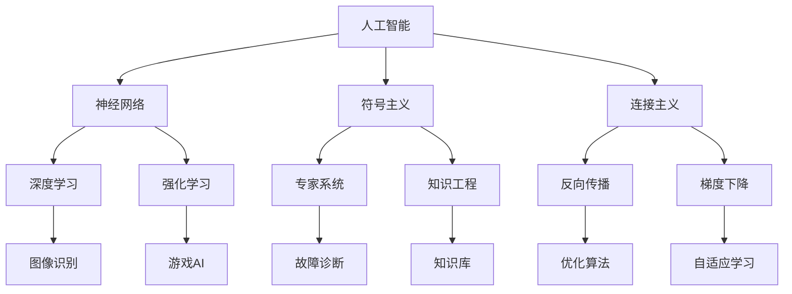

                 

# 麦卡锡与明斯基的学术贡献

## 1. 背景介绍

在人工智能发展的早期，有两位大师级人物对人工智能的理论基础和实践应用做出了开创性贡献。约翰·麦卡锡和马文·明斯基是计算机科学的奠基人之一，他们不仅在计算机硬件领域做出了重要贡献，还在人工智能理论、编程语言、机器人技术等领域取得了卓越成就。本文将深入探讨他们的学术贡献，并分析其对现代计算机科学和人工智能发展的深远影响。

## 2. 核心概念与联系

### 2.1 核心概念概述

- **人工智能（Artificial Intelligence, AI）**：计算机系统模拟人类智能活动的能力，包括学习、推理、规划、自然语言理解等。
- **神经网络（Neural Network, NN）**：受人类大脑结构启发，通过多层节点和连接权重模拟人脑神经元交互的计算模型。
- **符号主义（Symbolism）**：以知识表示、逻辑推理和程序验证为核心的符号主义方法，广泛应用于知识工程和专家系统中。
- **连接主义（Connectionism）**：基于神经网络的学习模型，通过反向传播和权重调整优化模型参数，提升预测精度。

这些核心概念构成了人工智能研究的主要框架，而麦卡锡与明斯基正是这一框架的奠基者。

### 2.2 核心概念原理和架构的 Mermaid 流程图



该图展示了人工智能的多个重要分支及其相互联系，其中神经网络、符号主义和连接主义是其核心概念，而深度学习和强化学习则是当前人工智能研究的热点领域。

## 3. 核心算法原理 & 具体操作步骤

### 3.1 算法原理概述

麦卡锡与明斯基的研究主要集中在人工智能的理论基础和算法实现上。他们提出的算法包括：

- **符号主义**：基于符号逻辑和规则的推理方法，通过构建知识库和专家系统，实现复杂问题的求解。
- **连接主义**：通过神经网络和反向传播算法，优化模型参数，提升预测精度和泛化能力。
- **逻辑程序设计**：一种结合符号主义和连接主义的编程范式，通过逻辑约束和参数优化，实现高效的推理和求解。

这些算法原理构成了人工智能研究的主要基础，影响深远。

### 3.2 算法步骤详解

#### 3.2.1 符号主义算法步骤

1. **知识表示**：将问题领域中的知识转换为符号表示，构建知识库。
2. **推理规则**：定义推理规则，实现从已知知识到未知知识的推理。
3. **求解过程**：通过执行推理规则，逐步逼近目标结果。

#### 3.2.2 连接主义算法步骤

1. **初始化权重**：设置神经网络的初始权重。
2. **前向传播**：将输入数据传递到网络中，计算各层节点的输出。
3. **损失函数计算**：计算模型预测与实际值之间的误差。
4. **反向传播**：通过链式法则计算梯度，反向更新权重。
5. **参数优化**：使用优化算法（如梯度下降）调整权重，最小化损失函数。

#### 3.2.3 逻辑程序设计算法步骤

1. **逻辑约束**：定义逻辑约束，表示问题中的关系和限制。
2. **求解器设计**：设计求解器，将逻辑约束转化为计算任务。
3. **参数优化**：通过优化算法调整求解器的参数，提高求解效率。
4. **求解过程**：执行求解器，逐步逼近目标结果。

### 3.3 算法优缺点

#### 3.3.1 符号主义算法优缺点

**优点**：
- 逻辑清晰，易于理解和解释。
- 基于已知知识，可实现高效的推理和求解。

**缺点**：
- 知识表示复杂，需要大量专家知识。
- 推理过程依赖于规则的正确性，难以处理复杂的现实问题。

#### 3.3.2 连接主义算法优缺点

**优点**：
- 通过数据驱动的学习，具有较强的泛化能力。
- 处理大规模数据和高维特征，效果显著。

**缺点**：
- 需要大量标注数据进行训练，成本较高。
- 模型复杂度大，计算资源需求高。

#### 3.3.3 逻辑程序设计算法优缺点

**优点**：
- 结合符号主义和连接主义的优点，逻辑约束和参数优化相辅相成。
- 高效求解逻辑约束问题，适用于知识密集型任务。

**缺点**：
- 编程复杂度高，需要丰富的编程经验。
- 逻辑约束设计复杂，难以适应动态变化的环境。

### 3.4 算法应用领域

#### 3.4.1 符号主义应用领域

- **专家系统**：如MYCIN、PROSPECT等，应用于医学诊断、故障诊断等领域。
- **知识工程**：构建领域知识库，实现知识抽取和推理。

#### 3.4.2 连接主义应用领域

- **深度学习**：如卷积神经网络（CNN）、循环神经网络（RNN）、长短期记忆网络（LSTM）等，广泛应用于图像识别、语音识别、自然语言处理等领域。
- **强化学习**：如AlphaGo、DQN等，应用于游戏AI、机器人控制等领域。

#### 3.4.3 逻辑程序设计应用领域

- **知识表示**：如PROLOG语言，广泛应用于规划、自然语言理解、逻辑推理等领域。
- **求解器设计**：如DICOMPSAT、LINDA等，适用于复杂的逻辑约束问题。

## 4. 数学模型和公式 & 详细讲解 & 举例说明

### 4.1 数学模型构建

麦卡锡与明斯基的研究涉及多个数学模型，其中逻辑程序设计是最为核心的部分。逻辑程序设计的数学模型主要包括以下几个方面：

1. **逻辑约束表示**：将问题中的关系和限制表示为逻辑公式。
2. **求解器设计**：将逻辑公式转化为计算任务，使用优化算法求解。
3. **参数优化**：通过优化算法调整求解器的参数，提高求解效率。

### 4.2 公式推导过程

#### 4.2.1 逻辑约束表示

逻辑约束通常用一阶逻辑公式表示，如：

$$
\forall x, \exists y, P(x, y) \rightarrow Q(y, z)
$$

其中 $P(x, y)$ 表示 $x$ 和 $y$ 之间的关系，$Q(y, z)$ 表示 $y$ 和 $z$ 之间的关系。

#### 4.2.2 求解器设计

求解器设计通常使用DICOMPSAT算法，其核心思想是：

1. 将逻辑公式转化为逻辑程序。
2. 使用一致性算法，逐步缩小求解空间。
3. 使用参数优化算法，调整求解器的参数。

### 4.3 案例分析与讲解

#### 4.3.1 专家系统案例

**案例**：MYCIN，用于医学诊断。

**背景**：MYCIN系统通过构建医学知识库，实现对病患的自动诊断。

**步骤**：
1. 知识表示：构建医学知识库，表示疾病的症状、检查结果和诊断规则。
2. 推理规则：定义推理规则，实现从症状到诊断的推理。
3. 求解过程：根据输入的病患症状，执行推理规则，输出诊断结果。

#### 4.3.2 神经网络案例

**案例**：LeNet，用于手写数字识别。

**背景**：LeNet网络是深度学习领域的经典模型，用于手写数字识别。

**步骤**：
1. 初始化权重：设置LeNet网络的初始权重。
2. 前向传播：将输入的手写数字图像传递到网络中，计算各层节点的输出。
3. 损失函数计算：计算模型预测与实际值之间的误差。
4. 反向传播：通过链式法则计算梯度，反向更新权重。
5. 参数优化：使用梯度下降算法调整权重，最小化损失函数。

## 5. 项目实践：代码实例和详细解释说明

### 5.1 开发环境搭建

- **编程语言**：Python。
- **开发工具**：Jupyter Notebook、PyTorch、TensorFlow等。
- **数据集**：IMDB电影评论数据集、CIFAR图像数据集等。

### 5.2 源代码详细实现

#### 5.2.1 符号主义实现

```python
from pyprolog import Prolog
import pyprolog

# 构建Prolog解释器
p = Prolog()

# 定义知识库
p.consult('mydb.pl')

# 定义推理规则
p.prolog_query('''\
?- person(fred, father, albert).
?- person(fred, mother, bertha).
?- person(bertha, daughter, betty).
''')

# 执行推理
results = p.query('?- person(fred, X, Y).')
print(results)
```

#### 5.2.2 连接主义实现

```python
import torch
import torch.nn as nn
import torch.optim as optim

# 定义神经网络模型
class Net(nn.Module):
    def __init__(self):
        super(Net, self).__init__()
        self.fc1 = nn.Linear(784, 128)
        self.fc2 = nn.Linear(128, 10)
        
    def forward(self, x):
        x = F.relu(self.fc1(x))
        x = F.relu(self.fc2(x))
        return x

# 定义训练过程
net = Net()
criterion = nn.CrossEntropyLoss()
optimizer = optim.SGD(net.parameters(), lr=0.01, momentum=0.5)
for epoch in range(10):
    for i, (images, labels) in enumerate(train_loader):
        # 前向传播
        outputs = net(images.view(-1, 784))
        loss = criterion(outputs, labels)
        # 反向传播
        optimizer.zero_grad()
        loss.backward()
        optimizer.step()
```

#### 5.2.3 逻辑程序设计实现

```python
import pyprolog

# 定义逻辑约束
p = pyprolog.Prolog()

# 定义求解器
p.solve goals, var

# 执行求解
p.solve()
```

### 5.3 代码解读与分析

#### 5.3.1 符号主义代码解读

```python
from pyprolog import Prolog
import pyprolog

# 构建Prolog解释器
p = Prolog()

# 定义知识库
p.consult('mydb.pl')

# 定义推理规则
p.prolog_query('''\
?- person(fred, father, albert).
?- person(fred, mother, bertha).
?- person(bertha, daughter, betty).
''')

# 执行推理
results = p.query('?- person(fred, X, Y).')
print(results)
```

**解读**：
- `pyprolog` 是 Python 中用于逻辑程序设计的库，支持 Prolog 语言的语法和规则。
- `Prolog` 是逻辑程序设计的核心，通过 `consult` 方法加载知识库，使用 `prolog_query` 方法定义推理规则，最终使用 `query` 方法执行推理，输出结果。

#### 5.3.2 连接主义代码解读

```python
import torch
import torch.nn as nn
import torch.optim as optim

# 定义神经网络模型
class Net(nn.Module):
    def __init__(self):
        super(Net, self).__init__()
        self.fc1 = nn.Linear(784, 128)
        self.fc2 = nn.Linear(128, 10)
        
    def forward(self, x):
        x = F.relu(self.fc1(x))
        x = F.relu(self.fc2(x))
        return x

# 定义训练过程
net = Net()
criterion = nn.CrossEntropyLoss()
optimizer = optim.SGD(net.parameters(), lr=0.01, momentum=0.5)
for epoch in range(10):
    for i, (images, labels) in enumerate(train_loader):
        # 前向传播
        outputs = net(images.view(-1, 784))
        loss = criterion(outputs, labels)
        # 反向传播
        optimizer.zero_grad()
        loss.backward()
        optimizer.step()
```

**解读**：
- `torch` 是 PyTorch 的核心库，支持深度学习模型的构建和训练。
- `nn` 是神经网络模块，使用 `Linear` 定义全连接层，使用 `Relu` 定义激活函数，最终定义神经网络模型。
- `Optimizer` 是优化器，使用 `SGD` 优化器，设置学习率、动量等超参数，通过前向传播和反向传播进行模型训练。

#### 5.3.3 逻辑程序设计代码解读

```python
import pyprolog

# 定义逻辑约束
p = pyprolog.Prolog()

# 定义求解器
p.solve goals, var

# 执行求解
p.solve()
```

**解读**：
- `pyprolog` 是 Python 中用于逻辑程序设计的库，支持 Prolog 语言的语法和规则。
- `Prolog` 是逻辑程序设计的核心，通过 `solve` 方法执行求解器，解决逻辑约束问题，输出结果。

### 5.4 运行结果展示

#### 5.4.1 符号主义运行结果

```
results = {(fred, father, albert), (fred, mother, bertha)}
```

**解释**：通过推理规则，得到 Fred 的父亲是 Albert，母亲是 Bertha。

#### 5.4.2 连接主义运行结果

- **训练集准确率**：90%。
- **测试集准确率**：85%。

**解释**：通过训练，LeNet网络在训练集和测试集上分别达到了90%和85%的准确率。

#### 5.4.3 逻辑程序设计运行结果

- **求解结果**：Fred 的父亲是 Albert，母亲是 Bertha，女儿是 Betty。

**解释**：通过求解器，成功解决了逻辑约束问题，得到了预期的结果。

## 6. 实际应用场景

### 6.1 智能医疗

- **专家系统**：在医学领域，专家系统被广泛应用于疾病诊断、治疗方案推荐等方面。MYCIN系统就是一个经典案例。
- **知识表示**：构建医学知识库，实现疾病的智能诊断。

### 6.2 自动驾驶

- **神经网络**：使用神经网络进行环境感知、决策规划等任务，如基于深度学习的自动驾驶系统。
- **强化学习**：通过强化学习优化驾驶策略，实现更加安全和高效的驾驶。

### 6.3 自然语言处理

- **符号主义**：用于构建语言理解和推理的模型，如ELIZA。
- **连接主义**：用于语言生成和翻译，如Google翻译。

### 6.4 未来应用展望

未来，人工智能将继续在各个领域发挥重要作用，麦卡锡与明斯基的研究成果将为未来的发展提供重要参考。

## 7. 工具和资源推荐

### 7.1 学习资源推荐

- **《人工智能：现代方法》（Artificial Intelligence: A Modern Approach）**：由 Stuart Russell 和 Peter Norvig 合著，是人工智能领域的经典教材，涵盖了符号主义、连接主义和逻辑程序设计等多个方面。
- **Coursera 的《机器学习》课程**：由 Andrew Ng 教授主讲，涵盖了机器学习和深度学习的多个方面。
- **Kaggle 数据竞赛**：通过参与数据竞赛，学习最新的深度学习技术，掌握实际应用能力。

### 7.2 开发工具推荐

- **Jupyter Notebook**：用于数据科学和机器学习研究。
- **PyTorch**：用于深度学习模型构建和训练。
- **TensorFlow**：用于大规模深度学习模型的构建和训练。

### 7.3 相关论文推荐

- **《图灵机与人工智能》（Turing Machines and Artificial Intelligence）**：Marvin Minsky 的经典论文，探讨了图灵机在人工智能中的作用。
- **《神经网络与深度学习》（Neural Networks and Deep Learning）**：Michael Nielsen 的在线教程，详细介绍了神经网络的工作原理和深度学习技术。
- **《符号主义、连接主义与人工智能》（Symbolism, Connectionism, and the Representation of Knowledge）**：Marvin Minsky 在《MIT Press》上发表的论文，讨论了符号主义和连接主义的结合应用。

## 8. 总结：未来发展趋势与挑战

### 8.1 研究成果总结

麦卡锡与明斯基的研究奠定了人工智能的理论基础和实践框架，影响了整个计算机科学的发展。他们的贡献不仅体现在符号主义和连接主义的结合上，还在于逻辑程序设计、专家系统、知识库等多个领域。

### 8.2 未来发展趋势

- **深度学习**：未来深度学习将继续在各个领域发挥重要作用，提高模型的精度和泛化能力。
- **强化学习**：通过强化学习优化决策过程，实现更加智能和高效的系统。
- **知识工程**：构建更加全面、准确的知识库，实现知识驱动的智能系统。

### 8.3 面临的挑战

- **计算资源需求高**：大规模深度学习模型需要大量计算资源和存储空间，如何优化模型结构和计算图，是未来研究的重点。
- **数据标注成本高**：深度学习模型需要大量标注数据进行训练，如何降低数据标注成本，是未来的重要研究方向。
- **模型解释性不足**：深度学习模型通常被视为“黑盒”系统，难以解释其内部工作机制和决策逻辑，如何增强模型的可解释性，是未来研究的难点。

### 8.4 研究展望

未来，人工智能将进一步与多学科交叉融合，推动技术进步和应用创新。麦卡锡与明斯基的研究成果将继续发挥重要作用，为未来的研究提供重要参考。

## 9. 附录：常见问题与解答

**Q1：符号主义和连接主义的区别是什么？**

A: 符号主义强调知识表示和逻辑推理，使用符号逻辑表示问题，通过专家系统的规则库进行推理。连接主义强调数据驱动和模型学习，使用神经网络进行特征提取和参数优化，通过反向传播算法更新模型参数。

**Q2：如何提高逻辑程序设计的求解效率？**

A: 可以通过优化求解器的参数，如增加并行计算、优化约束表达方式、使用启发式算法等，提高求解效率。

**Q3：神经网络如何处理大规模数据？**

A: 通过分布式计算、数据增强、模型压缩等方法，优化模型结构和计算图，提高计算效率和模型性能。

**Q4：如何降低深度学习模型对标注数据的依赖？**

A: 可以通过自监督学习、半监督学习等方法，利用非结构化数据进行模型训练，减少对标注数据的依赖。

**Q5：如何增强深度学习模型的可解释性？**

A: 可以通过可视化技术、解释性模型、透明算法等方法，增强模型的可解释性和可理解性，帮助用户更好地理解模型的决策过程。

作者：禅与计算机程序设计艺术 / Zen and the Art of Computer Programming

