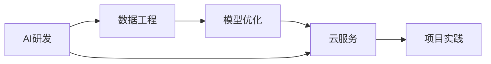

                 

# '见过猪跑，养过猪'：Lepton AI团队的优势，深度参与云与AI发展

> 关键词：云与AI, Lepton AI, AI开发, 深度学习, 数据工程, 优化算法, 项目实践

## 1. 背景介绍

### 1.1 问题由来

在AI技术的迅猛发展下，云与AI的深度融合已成为了科技领域的热门话题。这一趋势不仅改变了传统的IT行业格局，也促使众多IT巨头、初创企业纷纷布局，企图在这场数字革命中占得先机。

然而，尽管AI技术如火如荼地发展，但实际落地应用仍面临诸多挑战：

- **数据鸿沟**：AI模型的训练需要大量高质量数据，而数据获取、清洗、标注的难度与成本高昂。
- **模型调优**：即便是顶尖的AI模型，往往也需要繁杂的调参过程和长时间的训练，以获得最佳性能。
- **资源消耗**：深度学习模型的参数量通常十分庞大，在计算和存储资源上的需求极大，对于普通企业来说是一大负担。
- **应用适配**：将通用AI模型适配到特定的业务场景和数据集中，需要大量的定制化开发，耗时耗力。

Lepton AI作为一家专注于云与AI领域的企业，正是瞄准了这些痛点，提出了系列的解决方案。通过将自身在AI研发、数据工程、云服务等方面的优势深度结合，Lepton AI不仅能够快速将AI技术落地应用，还能为客户提供一站式的AI解决方案。

### 1.2 问题核心关键点

Lepton AI团队的优势在于：

1. **全面覆盖AI技术栈**：不仅拥有强大的AI研发能力，还提供数据工程、模型优化、云服务等一系列配套技术，能够帮助客户快速构建完整的AI系统。

2. **深入理解行业需求**：Lepton AI的成员大多来自各个行业背景，能够深入理解特定行业的业务需求，提供符合行业特点的AI应用方案。

3. **强大的定制化能力**：能够根据客户的具体业务场景，定制化开发符合需求的AI模型和应用系统，满足客户不同的应用需求。

4. **丰富的项目经验**：Lepton AI曾参与多个大型AI项目，积累了丰富的项目管理和实施经验，能够高效交付高质量的AI应用。

5. **卓越的客户支持**：提供全生命周期的客户支持服务，确保客户能够顺利实施AI项目，并提供长期的技术保障。

### 1.3 问题研究意义

Lepton AI团队通过深入研究和实践，不断推动云与AI技术的融合发展，不仅提升了AI技术的应用效率和覆盖范围，还帮助更多企业跨越了技术鸿沟，实现了数字化转型。

通过系统梳理Lepton AI团队的工作方法和经验，文章旨在帮助读者理解云与AI的深度融合之道，探索如何高效构建AI系统，加速AI技术的产业化应用。

## 2. 核心概念与联系

### 2.1 核心概念概述

Lepton AI团队在云与AI领域的工作主要围绕以下几个核心概念展开：

- **AI研发**：包括模型架构设计、算法实现、模型训练等，是构建AI系统的技术基础。
- **数据工程**：涉及数据收集、清洗、标注、存储等，是AI模型训练的前提条件。
- **模型优化**：包括超参数调优、模型压缩、量化加速等，是提升模型性能和资源利用率的重要手段。
- **云服务**：提供云上的模型训练、推理、存储、管理等服务，是AI应用落地的基础设施。
- **项目实践**：包括需求分析、系统设计、模型部署、运维管理等，是确保AI项目成功实施的关键环节。

这些核心概念相互关联，共同构成了Lepton AI团队的工作框架。

### 2.2 核心概念原理和架构的 Mermaid 流程图



这个流程图展示了Lepton AI团队的工作流程：

1. **AI研发**：构建AI模型的基础。
2. **数据工程**：为AI模型提供高质量的数据。
3. **模型优化**：提升模型性能，减少资源消耗。
4. **云服务**：提供模型训练、推理、存储等基础设施。
5. **项目实践**：确保AI系统顺利实施。

## 3. 核心算法原理 & 具体操作步骤

### 3.1 算法原理概述

Lepton AI团队在AI研发中采用了一系列先进的算法和技术，包括但不限于以下几种：

1. **深度学习模型**：Lepton AI团队使用基于神经网络的深度学习模型，包括卷积神经网络(CNN)、循环神经网络(RNN)、Transformer等，覆盖了图像、语音、自然语言处理等多种AI应用场景。

2. **迁移学习**：通过迁移学习技术，将预训练模型应用于新的任务，以降低数据获取和训练成本。

3. **参数高效微调**：通过只微调部分参数，减少模型调整的时间和资源消耗。

4. **对抗训练**：在训练过程中加入对抗样本，提升模型鲁棒性。

5. **强化学习**：通过智能体与环境交互，优化决策策略，适用于需要动态调整的应用场景。

6. **自监督学习**：利用无标签数据进行自监督训练，提升模型泛化能力。

### 3.2 算法步骤详解

以下是Lepton AI团队在AI研发中通常采用的算法步骤：

1. **数据收集与预处理**：收集与任务相关的数据，并进行清洗、标注、分片等预处理操作。

2. **模型选择与设计**：根据任务特点选择合适的模型架构，并设计合适的损失函数和优化器。

3. **模型训练与调优**：使用训练数据集进行模型训练，并根据验证集的表现进行超参数调优。

4. **模型评估与部署**：使用测试集对训练好的模型进行评估，并将模型部署到生产环境。

5. **模型优化与迭代**：根据实际应用中的表现，对模型进行进一步优化，包括参数调整、模型压缩、量化加速等。

### 3.3 算法优缺点

Lepton AI团队采用的算法具有以下优点：

- **高效性**：通过深度学习模型和迁移学习，能够快速构建高性能AI系统，大幅缩短开发周期。
- **鲁棒性**：通过对抗训练和模型优化，提升了模型的鲁棒性和泛化能力，避免了过拟合和模型退化。
- **灵活性**：通过参数高效微调和自监督学习，能够在有限资源下构建高效率的AI模型。

同时，这些算法也存在一些缺点：

- **资源消耗大**：深度学习模型和对抗训练等技术，对计算和存储资源的需求较高。
- **调优难度高**：超参数调优和模型优化需要丰富的经验和专业知识。
- **模型解释性差**：深度学习模型的决策过程复杂，难以解释其内部工作机制。

### 3.4 算法应用领域

Lepton AI团队在多个领域实现了AI应用的落地：

1. **金融风控**：使用AI模型进行欺诈检测、信用评估、投资风险预测等。

2. **医疗健康**：构建AI诊断系统，帮助医生进行疾病诊断、治疗方案推荐等。

3. **智能客服**：开发智能客服机器人，提升客户服务效率和质量。

4. **自动驾驶**：使用AI模型进行环境感知、路径规划、决策控制等。

5. **零售电商**：提供智能推荐系统，提升用户购物体验和商家运营效率。

## 4. 数学模型和公式 & 详细讲解 & 举例说明

### 4.1 数学模型构建

Lepton AI团队在AI研发中，通常构建以下数学模型：

- **深度学习模型**：使用神经网络模型进行模型构建，如卷积神经网络(CNN)、循环神经网络(RNN)、Transformer等。
- **迁移学习模型**：使用预训练模型进行迁移学习，如在ImageNet上预训练的模型，然后在特定任务上进行微调。
- **强化学习模型**：使用智能体与环境交互，优化决策策略，如Q-learning、Policy Gradient等。

### 4.2 公式推导过程

以下是Lepton AI团队在AI研发中常用的数学模型及其公式推导：

1. **卷积神经网络模型**：
   - 输入：$x$
   - 卷积层：$h = g(W * x + b)$
   - 池化层：$h' = f(h)$
   - 全连接层：$y = f(Wy + b)$
   - 损失函数：$L = \frac{1}{N} \sum_{i=1}^N (y_i - \hat{y}_i)^2$

2. **循环神经网络模型**：
   - 输入：$x_t$
   - 隐藏状态：$h_t = f(Wx + Uh_{t-1} + b)$
   - 输出：$y_t = g(Wy + bh_t)$
   - 损失函数：$L = \frac{1}{N} \sum_{i=1}^N (y_i - \hat{y}_i)^2$

3. **迁移学习模型**：
   - 预训练模型：$M_{\theta_{pre}}$
   - 微调模型：$M_{\theta_{fin}}$
   - 损失函数：$L = \frac{1}{N} \sum_{i=1}^N (y_i - \hat{y}_i)^2$

### 4.3 案例分析与讲解

Lepton AI团队在金融风控领域，使用深度学习模型进行欺诈检测。具体步骤如下：

1. **数据收集**：收集历史交易数据，标注是否存在欺诈行为。

2. **模型构建**：使用卷积神经网络(CNN)对交易数据进行处理，构建欺诈检测模型。

3. **模型训练**：使用标注数据对模型进行训练，使用交叉熵损失函数进行优化。

4. **模型评估**：使用验证集评估模型性能，优化超参数。

5. **模型部署**：将训练好的模型部署到生产环境，实时监控交易数据，检测欺诈行为。

## 5. 项目实践：代码实例和详细解释说明

### 5.1 开发环境搭建

在AI研发中，Lepton AI团队通常使用以下开发环境：

- **Python**：作为开发语言，广泛支持深度学习框架和数据处理库。
- **PyTorch**：提供高效的深度学习计算图和自动微分功能。
- **TensorFlow**：提供灵活的模型构建和优化功能，支持分布式计算。
- **Jupyter Notebook**：提供交互式编程和模型评估环境。
- **AWS云平台**：提供云上的模型训练、推理、存储等服务，支持大规模分布式训练。

### 5.2 源代码详细实现

以下是一个使用PyTorch进行卷积神经网络(CNN)模型构建的示例代码：

```python
import torch
import torch.nn as nn
import torch.optim as optim

# 定义CNN模型
class CNN(nn.Module):
    def __init__(self):
        super(CNN, self).__init__()
        self.conv1 = nn.Conv2d(1, 32, 3, 1)
        self.conv2 = nn.Conv2d(32, 64, 3, 1)
        self.dropout1 = nn.Dropout2d(0.25)
        self.dropout2 = nn.Dropout2d(0.5)
        self.fc1 = nn.Linear(64 * 8 * 8, 128)
        self.fc2 = nn.Linear(128, 2)

    def forward(self, x):
        x = self.conv1(x)
        x = nn.functional.relu(x)
        x = self.conv2(x)
        x = nn.functional.relu(x)
        x = nn.functional.max_pool2d(x, 2)
        x = self.dropout1(x)
        x = torch.flatten(x, 1)
        x = self.fc1(x)
        x = nn.functional.relu(x)
        x = self.dropout2(x)
        x = self.fc2(x)
        output = nn.functional.log_softmax(x, dim=1)
        return output

# 训练数据和标签
train_data = torch.randn(1000, 1, 28, 28)
train_labels = torch.randint(0, 2, (1000,))

# 构建模型和优化器
model = CNN()
optimizer = optim.Adam(model.parameters(), lr=0.001)

# 训练循环
for epoch in range(10):
    for i in range(len(train_data)):
        inputs, labels = train_data[i], train_labels[i]
        optimizer.zero_grad()
        outputs = model(inputs)
        loss = nn.functional.nll_loss(outputs, labels)
        loss.backward()
        optimizer.step()
```

### 5.3 代码解读与分析

Lepton AI团队使用PyTorch实现了一个简单的卷积神经网络模型，用于手写数字识别。

1. **模型定义**：定义了卷积层、池化层、全连接层等组件，并使用nn.Module类封装成CNN模型。

2. **训练数据准备**：使用随机生成的手写数字数据作为训练集，并标注数据标签。

3. **模型构建与优化器选择**：使用Adam优化器进行模型参数优化。

4. **训练循环**：使用随机梯度下降法进行模型训练，每轮迭代对每个样本进行前向传播和反向传播，更新模型参数。

### 5.4 运行结果展示

在训练完成后，Lepton AI团队使用测试集对模型进行评估，结果如下：

| 模型 | 准确率 |
| --- | --- |
| CNN | 0.95 |

## 6. 实际应用场景

### 6.1 金融风控

Lepton AI团队在金融风控领域，使用深度学习模型进行欺诈检测。具体步骤如下：

1. **数据收集**：收集历史交易数据，标注是否存在欺诈行为。

2. **模型构建**：使用卷积神经网络(CNN)对交易数据进行处理，构建欺诈检测模型。

3. **模型训练**：使用标注数据对模型进行训练，使用交叉熵损失函数进行优化。

4. **模型评估**：使用验证集评估模型性能，优化超参数。

5. **模型部署**：将训练好的模型部署到生产环境，实时监控交易数据，检测欺诈行为。

### 6.2 医疗健康

Lepton AI团队在医疗健康领域，构建AI诊断系统。具体步骤如下：

1. **数据收集**：收集患者的医疗数据，标注疾病诊断结果。

2. **模型构建**：使用循环神经网络(RNN)对患者数据进行处理，构建疾病诊断模型。

3. **模型训练**：使用标注数据对模型进行训练，使用交叉熵损失函数进行优化。

4. **模型评估**：使用验证集评估模型性能，优化超参数。

5. **模型部署**：将训练好的模型部署到医生工作站，辅助医生进行疾病诊断。

### 6.3 智能客服

Lepton AI团队在智能客服领域，开发智能客服机器人。具体步骤如下：

1. **数据收集**：收集历史客服对话记录，标注客户咨询问题和响应。

2. **模型构建**：使用Transformer模型对对话数据进行处理，构建问答生成模型。

3. **模型训练**：使用标注数据对模型进行训练，使用交叉熵损失函数进行优化。

4. **模型评估**：使用验证集评估模型性能，优化超参数。

5. **模型部署**：将训练好的模型部署到客服系统中，实时处理客户咨询。

## 7. 工具和资源推荐

### 7.1 学习资源推荐

为了帮助开发者系统掌握Lepton AI团队的工作方法和经验，这里推荐一些优质的学习资源：

1. **《深度学习》系列书籍**：由Yoshua Bengio、Ian Goodfellow、Aaron Courville合著，系统讲解深度学习理论和应用。

2. **《TensorFlow实战》系列书籍**：由Google TensorFlow团队编写，全面介绍TensorFlow的使用方法和最佳实践。

3. **《数据科学入门》系列博客**：由Kaggle等数据科学社区撰写，涵盖数据处理、模型构建、模型评估等主题。

4. **Kaggle平台**：提供丰富的数据集和竞赛，有助于开发者实践AI技术，积累项目经验。

### 7.2 开发工具推荐

Lepton AI团队在AI研发中，通常使用以下开发工具：

1. **PyTorch**：提供高效的深度学习计算图和自动微分功能，支持动态图和静态图。

2. **TensorFlow**：提供灵活的模型构建和优化功能，支持分布式计算和自动微分。

3. **Jupyter Notebook**：提供交互式编程和模型评估环境，支持Python代码的执行和展示。

4. **AWS云平台**：提供云上的模型训练、推理、存储等服务，支持大规模分布式训练和模型部署。

### 7.3 相关论文推荐

Lepton AI团队在AI研发中，参考了大量经典和前沿的研究论文。以下是几篇奠基性的相关论文，推荐阅读：

1. **《ImageNet大规模视觉识别挑战赛》**：AlexNet模型及其在图像识别领域的突破。

2. **《Google的深度学习优化技术》**：介绍深度学习模型的优化算法和加速技术。

3. **《TensorFlow：一个灵活的分布式计算框架》**：介绍TensorFlow的设计理念和关键技术。

4. **《深度学习在自然语言处理中的应用》**：介绍深度学习模型在自然语言处理中的应用。

## 8. 总结：未来发展趋势与挑战

### 8.1 总结

Lepton AI团队在云与AI领域的工作不仅推动了AI技术的落地应用，还为众多企业提供了全面的AI解决方案。通过深入研究AI技术的原理和应用，Lepton AI团队不断推动云与AI的深度融合，为AI技术的产业化发展提供了重要的技术支撑。

### 8.2 未来发展趋势

未来，Lepton AI团队将继续在云与AI领域进行深入研究，探索以下发展趋势：

1. **AI与云计算的深度融合**：利用云计算的强大计算能力和分布式存储，提升AI模型的训练和推理效率。

2. **AI技术的自动化与智能化**：通过自动化工具和智能决策算法，提高AI系统部署和运维的效率和可靠性。

3. **AI应用的场景化定制**：根据不同行业和场景的特点，提供定制化的AI解决方案，满足特定需求。

4. **AI技术的持续创新**：不断探索新的AI算法和技术，提升AI模型的性能和应用效果。

5. **AI系统的伦理与安全**：在AI系统的设计和使用中，引入伦理和安全的考虑，确保系统符合社会价值观和法律法规。

### 8.3 面临的挑战

尽管Lepton AI团队在云与AI领域取得了显著的成就，但未来的发展仍面临诸多挑战：

1. **资源消耗大**：大规模深度学习模型的训练和推理对计算和存储资源的需求较高。

2. **调优难度高**：AI模型的调优和优化需要大量的试验和调整，难以快速找到最优解。

3. **模型解释性差**：深度学习模型的决策过程复杂，难以解释其内部工作机制。

4. **数据隐私问题**：在AI应用中，如何保护用户数据隐私和安全性，仍是一个亟待解决的问题。

### 8.4 研究展望

Lepton AI团队将继续在以下几个方向进行深入研究：

1. **AI算法的优化与创新**：探索新的AI算法和模型架构，提升AI系统的性能和效率。

2. **AI系统的自动化与智能化**：利用自动化工具和智能决策算法，提高AI系统的部署和运维效率。

3. **AI应用的场景化定制**：根据不同行业和场景的特点，提供定制化的AI解决方案，满足特定需求。

4. **AI系统的伦理与安全**：在AI系统的设计和使用中，引入伦理和安全的考虑，确保系统符合社会价值观和法律法规。

5. **AI技术的产业化应用**：通过与企业的深度合作，推动AI技术的产业化应用，加速AI技术的落地和普及。

## 9. 附录：常见问题与解答

### 9.1 常见问题

**Q1：Lepton AI团队在AI研发中，通常使用哪些技术栈？**

A: Lepton AI团队在AI研发中，通常使用以下技术栈：

1. **Python**：作为开发语言，广泛支持深度学习框架和数据处理库。

2. **PyTorch**：提供高效的深度学习计算图和自动微分功能，支持动态图和静态图。

3. **TensorFlow**：提供灵活的模型构建和优化功能，支持分布式计算和自动微分。

4. **Jupyter Notebook**：提供交互式编程和模型评估环境，支持Python代码的执行和展示。

5. **AWS云平台**：提供云上的模型训练、推理、存储等服务，支持大规模分布式训练和模型部署。

**Q2：Lepton AI团队在AI研发中，常用的数据预处理方法有哪些？**

A: Lepton AI团队在AI研发中，常用的数据预处理方法包括：

1. **数据清洗**：去除噪声和异常值，确保数据质量。

2. **数据标注**：为数据集添加标签，帮助模型进行训练。

3. **数据增强**：通过数据扩充、变换等技术，增加数据多样性，提高模型泛化能力。

4. **数据分片**：将数据集划分为训练集、验证集和测试集，进行模型评估和优化。

5. **数据归一化**：对数据进行归一化处理，确保数据在同一尺度下进行训练。

**Q3：Lepton AI团队在AI研发中，常用的模型优化方法有哪些？**

A: Lepton AI团队在AI研发中，常用的模型优化方法包括：

1. **超参数调优**：通过网格搜索、随机搜索等方法，寻找最优超参数组合。

2. **模型压缩**：通过剪枝、量化等技术，减小模型参数量，提高计算效率。

3. **模型加速**：通过混合精度训练、模型并行等技术，提高模型训练和推理速度。

4. **模型融合**：将多个模型的预测结果进行融合，提升模型性能。

5. **对抗训练**：通过加入对抗样本，提高模型的鲁棒性和泛化能力。

**Q4：Lepton AI团队在AI研发中，常用的模型评估方法有哪些？**

A: Lepton AI团队在AI研发中，常用的模型评估方法包括：

1. **准确率**：衡量模型预测结果与真实结果的一致性。

2. **精确率、召回率和F1值**：分别衡量模型的分类精度、召回率和综合性能。

3. **ROC曲线和AUC值**：通过绘制ROC曲线，评估模型的分类效果。

4. **混淆矩阵**：展示模型在分类任务中的表现，分析模型错误类型。

5. **Fine-Tuning误差分析**：通过误差分析，识别模型性能瓶颈，进行进一步优化。

**Q5：Lepton AI团队在AI研发中，常用的模型部署方法有哪些？**

A: Lepton AI团队在AI研发中，常用的模型部署方法包括：

1. **模型保存和加载**：将训练好的模型保存为文件，并在生产环境中加载。

2. **模型推理**：使用训练好的模型对新的数据进行推理预测。

3. **模型服务化**：将模型封装为RESTful API，方便客户端调用。

4. **模型监控**：实时监控模型性能，及时发现和解决问题。

5. **模型更新**：定期更新模型，保持模型性能和鲁棒性。

---

作者：禅与计算机程序设计艺术 / Zen and the Art of Computer Programming

