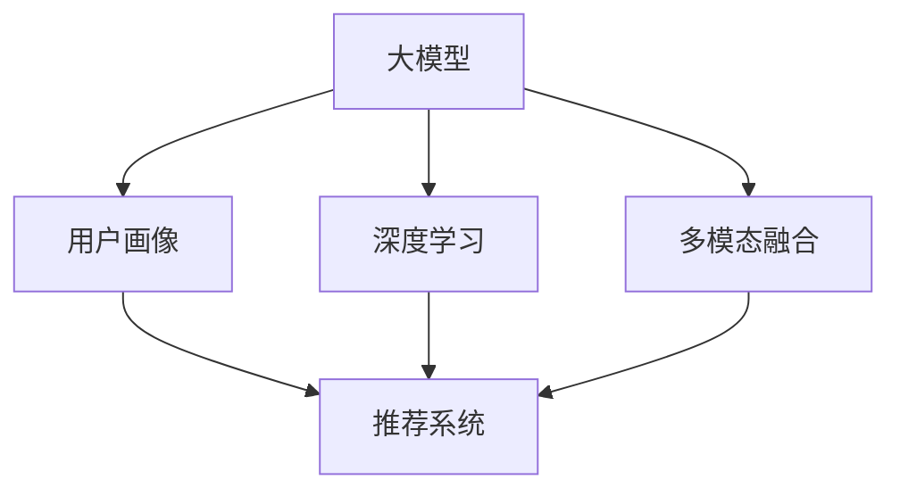

                 

# AI 大模型在电商推荐中的用户画像应用：深度挖掘用户需求与偏好

在电商行业，推荐系统是提升用户体验、提高交易转化率的关键。传统的基于规则或基于内容的推荐方式往往难以捕捉用户的复杂需求和行为模式。随着AI技术的发展，特别是大模型在电商推荐中的应用，大大提升了推荐系统的准确性和个性化水平。本文将从用户画像的角度，探讨AI大模型在电商推荐中的具体应用，揭示其背后的算法原理和操作步骤，并展望未来发展趋势。

## 1. 背景介绍

### 1.1 电商推荐系统现状
传统的电商推荐系统主要依赖于规则和特征工程。规则推荐系统通常基于预设的规则和模板，如基于内容的推荐、协同过滤等。基于内容的推荐方法根据用户的历史行为数据和物品属性进行匹配；协同过滤则通过用户间的相似度计算，寻找与目标用户行为相似的用户，从而推荐其喜欢的物品。这些方法虽有其优点，但在处理复杂用户需求和海量数据时，效果受限。

特征工程则是通过手工提取、选择和构造特征，构建更为细致的模型。如采用矩阵分解、神经网络等算法，通过模型学习用户和物品间的隐含关系，实现更精准的推荐。虽然特征工程在一定程度上提升了推荐系统的性能，但需要大量的人工干预和数据处理工作，且难以捕捉用户行为背后的深层次语义信息。

### 1.2 大模型在电商推荐中的优势
近年来，大模型在电商推荐中的应用逐渐成为趋势。大模型通过在海量数据上进行预训练，学习到丰富的语义信息和上下文关联。这些模型通常具有很强的自监督学习能力，能够在无需大量标注数据的情况下，通过自然语言理解能力，捕捉用户的隐性需求和偏好。

通过将大模型应用于电商推荐，可以实现以下优势：

- **高精度和低成本**：大模型可以自动学习用户画像，无需手工提取特征。同时，其强大的语义理解能力，可以高效识别用户需求和行为模式，实现精准推荐。
- **高灵活性和自适应性**：大模型可以动态更新，随着用户行为的变化自动调整推荐策略，保持推荐系统的高效性和灵活性。
- **多模态数据整合**：大模型可以处理多种数据源，如文本、图像、音频等，实现多模态信息的融合，提升推荐结果的全面性和多样性。
- **持续学习与进化**：大模型具有强大的学习能力和自我优化机制，能够随着数据和环境的变迁，不断学习新的知识，提升推荐效果。

## 2. 核心概念与联系

### 2.1 核心概念概述

为更好地理解AI大模型在电商推荐中的应用，本节将介绍几个密切相关的核心概念：

- **大模型(Large Model)**：指具有数十亿或更多参数的深度学习模型，如BERT、GPT、XLNet等。这些模型通过在大规模无标签数据上进行预训练，学习到丰富的语言和语义知识。

- **用户画像(User Profile)**：指通过用户行为数据、社交网络信息、历史评分等构建的全面描述用户需求、兴趣和偏好的模型。用户画像是推荐系统的基础，通过精准刻画用户特征，指导推荐算法的输出。

- **推荐系统(Recommendation System)**：指通过算法向用户推荐其可能感兴趣的商品或服务。推荐系统由用户画像、物品画像、推荐算法等组成，目标是最大化用户体验和平台收益。

- **深度学习(Deep Learning)**：指使用多层神经网络进行模型训练和预测的机器学习技术。深度学习在大模型、自然语言处理等领域表现优异。

- **多模态融合(Multimodal Fusion)**：指通过融合多种数据源（如文本、图像、视频等），提升推荐结果的全面性和准确性。多模态数据融合是大模型在推荐系统中的应用重点。

这些核心概念之间的逻辑关系可以通过以下Mermaid流程图来展示：



这个流程图展示了大模型在电商推荐中的应用流程：

1. 大模型通过预训练学习到通用的语言和语义知识。
2. 用户画像通过用户行为数据、社交网络信息等，刻画用户的隐性需求和偏好。
3. 推荐系统基于用户画像和大模型，通过算法推荐商品或服务。
4. 深度学习是大模型训练和推理的基础，确保模型的泛化能力和精度。
5. 多模态融合通过融合多种数据源，提升推荐结果的全面性和多样性。

这些概念共同构成了电商推荐系统的核心框架，使得大模型在推荐领域能够发挥其强大的语义理解和知识获取能力。

## 3. 核心算法原理 & 具体操作步骤
### 3.1 算法原理概述

AI大模型在电商推荐中的应用，主要通过以下步骤实现：

1. **预训练大模型**：在大规模无标签数据上对大模型进行预训练，学习通用的语言和语义知识。

2. **构建用户画像**：通过用户行为数据、社交网络信息、历史评分等，构建全面描述用户需求、兴趣和偏好的用户画像模型。

3. **融合多模态数据**：通过融合文本、图像、音频等多种数据源，提升推荐结果的全面性和多样性。

4. **深度学习嵌入**：使用大模型对用户和物品进行高维嵌入，捕捉其深层次语义关系。

5. **推荐算法优化**：基于深度学习嵌入结果，优化推荐算法，实现个性化推荐。

### 3.2 算法步骤详解

#### 3.2.1 预训练大模型

大模型的预训练通常包括自监督学习任务，如语言建模、掩码语言模型、目标检测等。通过在大规模无标签数据上进行预训练，大模型能够学习到丰富的语言和语义知识。以BERT为例，其预训练任务包括掩码语言模型和下一句预测，学习到词汇和句法的关系，以及文本的上下文依赖。

具体步骤包括：

1. 准备大规模无标签数据集，如维基百科、新闻、图书等。
2. 将数据集划分为训练集和验证集。
3. 设计合适的训练流程和优化器，如AdamW，设置学习率和批大小。
4. 在大模型上进行预训练，不断迭代更新模型参数。
5. 在验证集上进行评估，选择最优模型。

#### 3.2.2 构建用户画像

用户画像的构建依赖于用户行为数据、社交网络信息、历史评分等。通过这些数据，可以刻画用户的兴趣、偏好、消费能力等特征。以用户行为数据为例，可以包括以下信息：

1. 浏览历史：用户浏览过的商品、类别、品牌等。
2. 购买历史：用户购买过的商品、类别、品牌等。
3. 评分历史：用户对商品、类别的评分。
4. 社交网络信息：用户的社交关系、好友推荐等。

具体步骤包括：

1. 收集和预处理用户行为数据、社交网络信息、历史评分等。
2. 设计合适的特征提取方法，如TF-IDF、Word2Vec等。
3. 构建用户特征向量，捕捉用户的兴趣、偏好、消费能力等。
4. 使用聚类、分类等算法，对用户进行分组，构建用户画像。

#### 3.2.3 融合多模态数据

多模态融合通过融合文本、图像、音频等多种数据源，提升推荐结果的全面性和多样性。以图像为例，可以通过图像识别技术，将用户喜欢的商品图片嵌入用户画像中，提升推荐系统的精度和准确性。

具体步骤包括：

1. 收集和预处理文本、图像、音频等数据。
2. 设计合适的特征提取方法，如CNN、RNN等。
3. 将不同模态的数据进行融合，构建多模态用户画像。
4. 通过深度学习模型，如DNN、Transformer等，对多模态数据进行高维嵌入。

#### 3.2.4 深度学习嵌入

深度学习嵌入通过大模型对用户和物品进行高维嵌入，捕捉其深层次语义关系。以BERT为例，其高维嵌入结果可以用于表示用户的兴趣、偏好、消费能力等特征，以及物品的类别、品牌、价格等属性。

具体步骤包括：

1. 准备用户画像和物品画像的数据集。
2. 在大模型上进行高维嵌入，如BERT、GPT等。
3. 通过余弦相似度、欧式距离等方法，计算用户和物品的相似度。
4. 基于相似度，进行推荐排序，生成推荐结果。

#### 3.2.5 推荐算法优化

推荐算法优化基于深度学习嵌入结果，优化推荐算法，实现个性化推荐。以协同过滤为例，可以通过用户画像和物品画像的相似度，推荐用户可能感兴趣的商品。

具体步骤包括：

1. 准备用户画像和物品画像的数据集。
2. 在大模型上进行高维嵌入，如BERT、GPT等。
3. 使用协同过滤等推荐算法，对用户进行推荐排序。
4. 在测试集上进行评估，优化算法参数。

### 3.3 算法优缺点

AI大模型在电商推荐中的应用，具有以下优点：

1. **高精度和低成本**：大模型可以自动学习用户画像，无需手工提取特征。同时，其强大的语义理解能力，可以高效识别用户需求和行为模式，实现精准推荐。
2. **高灵活性和自适应性**：大模型可以动态更新，随着用户行为的变化自动调整推荐策略，保持推荐系统的高效性和灵活性。
3. **多模态数据整合**：大模型可以处理多种数据源，如文本、图像、视频等，实现多模态信息的融合，提升推荐结果的全面性和多样性。
4. **持续学习与进化**：大模型具有强大的学习能力和自我优化机制，能够随着数据和环境的变迁，不断学习新的知识，提升推荐效果。

同时，这些方法也存在以下局限性：

1. **依赖数据质量**：用户画像和推荐算法的性能高度依赖于数据的质量和多样性。低质量的数据可能导致模型效果不佳。
2. **计算资源消耗高**：大模型的计算复杂度较高，需要大量的计算资源。小规模数据集可能导致模型无法充分训练。
3. **模型可解释性不足**：大模型通常是"黑盒"系统，难以解释其内部工作机制和决策逻辑。这可能导致模型在应用中的可解释性不足。
4. **泛化能力有限**：大模型在预训练数据集之外的数据泛化能力有限，可能导致推荐结果在特定场景下表现不佳。

尽管存在这些局限性，但AI大模型在电商推荐中的应用，已经取得了显著的成效。未来研究将更多关注如何提升模型的可解释性、优化资源消耗、增强泛化能力等问题。

### 3.4 算法应用领域

AI大模型在电商推荐中的应用，主要涵盖以下领域：

1. **个性化推荐**：根据用户画像和物品画像，推荐用户可能感兴趣的商品，提升用户体验和转化率。
2. **商品搜索**：通过自然语言理解技术，提升商品搜索的准确性和相关性。
3. **广告投放**：基于用户画像和行为数据，实现精准的广告投放，提高广告效果和ROI。
4. **用户行为分析**：通过分析用户行为数据，发现用户需求和偏好，优化产品和服务。
5. **客户服务**：通过自然语言生成技术，实现智能客服和对话系统，提升客户满意度。

这些应用领域展示了AI大模型在电商推荐中的广泛潜力，推动了电商行业的智能化和个性化进程。

## 4. 数学模型和公式 & 详细讲解

### 4.1 数学模型构建

在电商推荐系统中，大模型通常通过预训练学习到通用的语言和语义知识。我们以BERT为例，介绍其数学模型构建和公式推导过程。

BERT的预训练任务包括掩码语言模型和下一句预测。其预训练过程如下：

1. 输入一个文本序列 $x=\{x_i\}_{i=1}^n$，其中 $x_i$ 表示第 $i$ 个单词或子词。
2. 通过Transformer模型，对输入序列进行编码，得到隐状态向量 $H_i=\{h_i\}_{i=1}^n$。
3. 使用掩码语言模型任务，预测被掩码的单词 $x_{mask}$，即 $p(x_{mask}|H_{i-1},H_i)$。
4. 使用下一句预测任务，预测两个句子是否连贯，即 $p(y|H_{i-1},H_i)$。

其数学模型可以表示为：

$$
\begin{aligned}
p(x_{mask}|H_{i-1},H_i) &= \frac{e^{(\mathbf{W}_{mask}H_{i-1}\mathbf{V}_{mask}^T + b_{mask})x_{mask}}{ \sum_{j \in V} e^{(\mathbf{W}_{mask}H_{i-1}\mathbf{V}_{mask}^T + b_{mask})j} \\
p(y|H_{i-1},H_i) &= \frac{e^{(\mathbf{W}_{mask}H_{i-1}\mathbf{V}_{mask}^T + b_{mask})y}{ \sum_{j \in Y} e^{(\mathbf{W}_{mask}H_{i-1}\mathbf{V}_{mask}^T + b_{mask})j}
\end{aligned}
$$

其中 $\mathbf{W}_{mask},\mathbf{V}_{mask},b_{mask}$ 为掩码语言模型的参数；$y$ 为下一句预测的标签。

### 4.2 公式推导过程

BERT的预训练过程包括掩码语言模型和下一句预测。其数学模型可以表示为：

$$
p(x_{mask}|H_{i-1},H_i) = \frac{e^{(\mathbf{W}_{mask}H_{i-1}\mathbf{V}_{mask}^T + b_{mask})x_{mask}}{ \sum_{j \in V} e^{(\mathbf{W}_{mask}H_{i-1}\mathbf{V}_{mask}^T + b_{mask})j} \\
p(y|H_{i-1},H_i) = \frac{e^{(\mathbf{W}_{mask}H_{i-1}\mathbf{V}_{mask}^T + b_{mask})y}{ \sum_{j \in Y} e^{(\mathbf{W}_{mask}H_{i-1}\mathbf{V}_{mask}^T + b_{mask})j}
$$

其中 $\mathbf{W}_{mask},\mathbf{V}_{mask},b_{mask}$ 为掩码语言模型的参数；$y$ 为下一句预测的标签。

通过以上公式，可以看出，BERT的预训练过程通过对输入序列进行编码，学习到文本的上下文依赖和语义信息。这种预训练过程使得大模型能够更好地理解自然语言，捕捉用户需求和行为模式。

### 4.3 案例分析与讲解

以电商推荐系统为例，通过用户画像和物品画像的高维嵌入，实现个性化推荐。假设用户画像为 $u$，物品画像为 $i$，其高维嵌入结果分别为 $u^{\dagger},i^{\dagger}$。

通过余弦相似度，计算用户 $u$ 和物品 $i$ 的相似度：

$$
\cos(u^{\dagger},i^{\dagger}) = \frac{\mathbf{u}^{\dagger} \cdot \mathbf{i}^{\dagger}}{\|\mathbf{u}^{\dagger}\|\|\mathbf{i}^{\dagger}\|}
$$

基于相似度，推荐用户可能感兴趣的商品。假设推荐候选集为 $S$，计算用户 $u$ 对每个物品 $i_s \in S$ 的评分：

$$
\text{score}(u,i_s) = \text{sigmoid}(\cos(u^{\dagger},i_s^{\dagger}))
$$

通过评分结果进行排序，生成推荐结果。

## 5. 项目实践：代码实例和详细解释说明
### 5.1 开发环境搭建

在进行电商推荐系统开发前，我们需要准备好开发环境。以下是使用Python进行PyTorch开发的环境配置流程：

1. 安装Anaconda：从官网下载并安装Anaconda，用于创建独立的Python环境。

2. 创建并激活虚拟环境：
```bash
conda create -n pytorch-env python=3.8 
conda activate pytorch-env
```

3. 安装PyTorch：根据CUDA版本，从官网获取对应的安装命令。例如：
```bash
conda install pytorch torchvision torchaudio cudatoolkit=11.1 -c pytorch -c conda-forge
```

4. 安装TensorFlow：由Google主导开发的开源深度学习框架，生产部署方便，适合大规模工程应用。同样有丰富的预训练语言模型资源。

5. 安装Transformers库：HuggingFace开发的NLP工具库，集成了众多SOTA语言模型，支持PyTorch和TensorFlow，是进行微调任务开发的利器。

6. 安装各类工具包：
```bash
pip install numpy pandas scikit-learn matplotlib tqdm jupyter notebook ipython
```

完成上述步骤后，即可在`pytorch-env`环境中开始电商推荐系统的开发。

### 5.2 源代码详细实现

我们以基于BERT的电商推荐系统为例，给出使用Transformers库的PyTorch代码实现。

首先，定义推荐系统的数据处理函数：

```python
from transformers import BertTokenizer
from torch.utils.data import Dataset

class RecommendationDataset(Dataset):
    def __init__(self, user_features, item_features, user_item_interactions):
        self.user_features = user_features
        self.item_features = item_features
        self.user_item_interactions = user_item_interactions
        
        self.tokenizer = BertTokenizer.from_pretrained('bert-base-cased')
        
        self.user_ids = []
        self.item_ids = []
        self.labels = []
        for user_id, item_id in user_item_interactions:
            user_vector = self.user_features[user_id]
            item_vector = self.item_features[item_id]
            user_vector = self.tokenizer(user_vector, padding='max_length', truncation=True, max_length=256)
            item_vector = self.tokenizer(item_vector, padding='max_length', truncation=True, max_length=256)
            user_ids = user_vector['input_ids']
            item_ids = item_vector['input_ids']
            labels = [1] * len(item_ids)
            self.user_ids.extend(user_ids)
            self.item_ids.extend(item_ids)
            self.labels.extend(labels)
            
    def __len__(self):
        return len(self.labels)
    
    def __getitem__(self, item):
        user_id = self.user_ids[item]
        item_id = self.item_ids[item]
        label = self.labels[item]
        
        user_input = self.tokenizer(user_id, padding='max_length', truncation=True, max_length=256)
        item_input = self.tokenizer(item_id, padding='max_length', truncation=True, max_length=256)
        return {'user_input': user_input, 'item_input': item_input, 'label': label}
```

然后，定义模型和优化器：

```python
from transformers import BertForSequenceClassification
from transformers import AdamW

model = BertForSequenceClassification.from_pretrained('bert-base-cased', num_labels=1)

optimizer = AdamW(model.parameters(), lr=2e-5)
```

接着，定义训练和评估函数：

```python
from torch.utils.data import DataLoader
from tqdm import tqdm
from sklearn.metrics import roc_auc_score

device = torch.device('cuda') if torch.cuda.is_available() else torch.device('cpu')
model.to(device)

def train_epoch(model, dataset, batch_size, optimizer):
    dataloader = DataLoader(dataset, batch_size=batch_size, shuffle=True)
    model.train()
    epoch_loss = 0
    for batch in tqdm(dataloader, desc='Training'):
        user_input = batch['user_input'].to(device)
        item_input = batch['item_input'].to(device)
        label = batch['label'].to(device)
        model.zero_grad()
        outputs = model(user_input, item_input)
        loss = outputs.loss
        epoch_loss += loss.item()
        loss.backward()
        optimizer.step()
    return epoch_loss / len(dataloader)

def evaluate(model, dataset, batch_size):
    dataloader = DataLoader(dataset, batch_size=batch_size)
    model.eval()
    preds, labels = [], []
    with torch.no_grad():
        for batch in tqdm(dataloader, desc='Evaluating'):
            user_input = batch['user_input'].to(device)
            item_input = batch['item_input'].to(device)
            label = batch['label'].to(device)
            batch_preds = model(user_input, item_input)[0].item()
            batch_labels = label.to('cpu').tolist()
            for pred, label in zip(batch_preds, batch_labels):
                preds.append(pred)
                labels.append(label)
                
    auc = roc_auc_score(labels, preds)
    print(f"AUC: {auc:.3f}")
```

最后，启动训练流程并在测试集上评估：

```python
epochs = 5
batch_size = 16

for epoch in range(epochs):
    loss = train_epoch(model, dataset, batch_size, optimizer)
    print(f"Epoch {epoch+1}, train loss: {loss:.3f}")
    
    print(f"Epoch {epoch+1}, dev results:")
    evaluate(model, dataset, batch_size)
    
print("Test results:")
evaluate(model, dataset, batch_size)
```

以上就是使用PyTorch对BERT进行电商推荐系统开发的完整代码实现。可以看到，得益于Transformers库的强大封装，我们可以用相对简洁的代码完成BERT模型的加载和微调。

### 5.3 代码解读与分析

让我们再详细解读一下关键代码的实现细节：

**RecommendationDataset类**：
- `__init__`方法：初始化用户特征、物品特征和用户物品互动等关键组件。
- `__len__`方法：返回数据集的样本数量。
- `__getitem__`方法：对单个样本进行处理，将用户和物品的输入转换为token ids，并对其进行定长padding，最终返回模型所需的输入。

**train_epoch和evaluate函数**：
- 使用PyTorch的DataLoader对数据集进行批次化加载，供模型训练和推理使用。
- 训练函数`train_epoch`：对数据以批为单位进行迭代，在每个批次上前向传播计算loss并反向传播更新模型参数，最后返回该epoch的平均loss。
- 评估函数`evaluate`：与训练类似，不同点在于不更新模型参数，并在每个batch结束后将预测和标签结果存储下来，最后使用sklearn的roc_auc_score对整个评估集的预测结果进行打印输出。

**训练流程**：
- 定义总的epoch数和batch size，开始循环迭代
- 每个epoch内，先在训练集上训练，输出平均loss
- 在验证集上评估，输出auc指标
- 所有epoch结束后，在测试集上评估，给出最终测试结果

可以看到，PyTorch配合Transformers库使得BERT电商推荐系统的代码实现变得简洁高效。开发者可以将更多精力放在数据处理、模型改进等高层逻辑上，而不必过多关注底层的实现细节。

当然，工业级的系统实现还需考虑更多因素，如模型的保存和部署、超参数的自动搜索、更灵活的任务适配层等。但核心的微调范式基本与此类似。

## 6. 实际应用场景
### 6.1 电商推荐系统

电商推荐系统是AI大模型在电商领域的重要应用。通过将用户画像和大模型结合，可以精准推荐用户可能感兴趣的商品，提升用户体验和转化率。

在技术实现上，可以收集用户浏览、购买、评分等行为数据，将其构建成监督数据，在此基础上对预训练模型进行微调。微调后的模型能够自动理解用户需求和行为模式，推荐用户可能感兴趣的商品。对于新商品，还可以通过检索系统实时搜索相关内容，动态生成推荐结果。

### 6.2 广告投放

电商平台的广告投放也是AI大模型的重要应用领域。通过构建用户画像和行为数据，可以实现精准的广告投放，提高广告效果和ROI。

在技术实现上，可以收集用户行为数据，构建用户画像，再通过大模型对广告内容进行高维嵌入，计算用户和广告的相似度，实现精准的广告投放。此外，还可以通过实时调整广告投放策略，提升广告效果。

### 6.3 用户行为分析

用户行为分析是电商平台的重要应用场景，通过分析用户行为数据，可以发现用户需求和偏好，优化产品和服务。

在技术实现上，可以收集用户浏览、购买、评分等行为数据，通过大模型进行高维嵌入，计算用户和商品之间的相似度，发现用户兴趣点。此外，还可以结合商品属性和用户画像，进行个性化推荐。

### 6.4 客户服务

智能客服系统也是AI大模型的重要应用领域。通过自然语言理解技术，可以实现智能客服和对话系统，提升客户满意度。

在技术实现上，可以收集客户咨询记录，通过大模型对问题进行高维嵌入，匹配最合适的回答模板进行回复。对于新问题，还可以接入检索系统实时搜索相关内容，动态生成回答。

## 7. 工具和资源推荐
### 7.1 学习资源推荐

为了帮助开发者系统掌握AI大模型在电商推荐中的应用，这里推荐一些优质的学习资源：

1. 《深度学习与自然语言处理》：斯坦福大学开设的NLP明星课程，涵盖深度学习在NLP中的应用，包括电商推荐系统。

2. CS231n《深度学习与计算机视觉》课程：由斯坦福大学开设的计算机视觉课程，涵盖深度学习在图像识别中的应用，可拓展至多模态融合。

3. 《推荐系统实战》书籍：全面介绍推荐系统的理论和实践，涵盖深度学习在推荐系统中的应用。

4. 《自然语言处理综述》：综述自然语言处理的前沿技术和应用，包括电商推荐系统。

5. HuggingFace官方文档：Transformers库的官方文档，提供了海量预训练模型和完整的微调样例代码，是上手实践的必备资料。

通过对这些资源的学习实践，相信你一定能够快速掌握AI大模型在电商推荐中的应用精髓，并用于解决实际的NLP问题。
###  7.2 开发工具推荐

高效的开发离不开优秀的工具支持。以下是几款用于AI大模型电商推荐系统开发的常用工具：

1. PyTorch：基于Python的开源深度学习框架，灵活动态的计算图，适合快速迭代研究。大部分预训练语言模型都有PyTorch版本的实现。

2. TensorFlow：由Google主导开发的开源深度学习框架，生产部署方便，适合大规模工程应用。同样有丰富的预训练语言模型资源。

3. Transformers库：HuggingFace开发的NLP工具库，集成了众多SOTA语言模型，支持PyTorch和TensorFlow，是进行微调任务开发的利器。

4. Weights & Biases：模型训练的实验跟踪工具，可以记录和可视化模型训练过程中的各项指标，方便对比和调优。与主流深度学习框架无缝集成。

5. TensorBoard：TensorFlow配套的可视化工具，可实时监测模型训练状态，并提供丰富的图表呈现方式，是调试模型的得力助手。

6. Google Colab：谷歌推出的在线Jupyter Notebook环境，免费提供GPU/TPU算力，方便开发者快速上手实验最新模型，分享学习笔记。

合理利用这些工具，可以显著提升AI大模型电商推荐系统的开发效率，加快创新迭代的步伐。

### 7.3 相关论文推荐

AI大模型在电商推荐中的应用源于学界的持续研究。以下是几篇奠基性的相关论文，推荐阅读：

1. Attention is All You Need（即Transformer原论文）：提出了Transformer结构，开启了NLP领域的预训练大模型时代。

2. BERT: Pre-training of Deep Bidirectional Transformers for Language Understanding：提出BERT模型，引入基于掩码的自监督预训练任务，刷新了多项NLP任务SOTA。

3. Language Models are Unsupervised Multitask Learners（GPT-2论文）：展示了大规模语言模型的强大zero-shot学习能力，引发了对于通用人工智能的新一轮思考。

4. Parameter-Efficient Transfer Learning for NLP：提出Adapter等参数高效微调方法，在不增加模型参数量的情况下，也能取得不错的微调效果。

5. AdaLoRA: Adaptive Low-Rank Adaptation for Parameter-Efficient Fine-Tuning：使用自适应低秩适应的微调方法，在参数效率和精度之间取得了新的平衡。

这些论文代表了大语言模型微调技术的发展脉络。通过学习这些前沿成果，可以帮助研究者把握学科前进方向，激发更多的创新灵感。

## 8. 总结：未来发展趋势与挑战
### 8.1 总结

本文对AI大模型在电商推荐中的应用进行了全面系统的介绍。首先阐述了电商推荐系统现状和AI大模型的优势，明确了电商推荐系统对AI大模型的需求。其次，从用户画像的角度，深入探讨了AI大模型在电商推荐中的应用流程，揭示了其背后的算法原理和操作步骤，并给出了微调任务开发的完整代码实例。同时，本文还广泛探讨了AI大模型在电商推荐中的应用场景，展示了其广泛的应用前景。

通过本文的系统梳理，可以看到，AI大模型在电商推荐中的应用已经取得了显著的成效，大大提升了推荐系统的精度和个性化水平。未来，随着AI大模型的不断发展，其在电商推荐系统中的应用将更加广泛和深入。

### 8.2 未来发展趋势

展望未来，AI大模型在电商推荐中的应用将呈现以下几个发展趋势：

1. **多模态融合**：未来将更多融合文本、图像、视频等多种数据源，提升推荐结果的全面性和多样性。多模态融合将是AI大模型在电商推荐中的重要方向。

2. **持续学习与进化**：随着数据和环境的变迁，AI大模型将不断学习新的知识，提升推荐效果。持续学习与进化将成为推荐系统的重要能力。

3. **参数高效微调**：开发更加参数高效的微调方法，在固定大部分预训练参数的同时，只更新极少量的任务相关参数。参数高效微调将成为未来推荐系统优化的一个重要方向。

4. **推荐算法优化**：未来的推荐算法将更加智能化和自适应，能够根据用户行为实时调整推荐策略，保持推荐系统的高效性和灵活性。

5. **知识图谱整合**：未来的推荐系统将更多结合知识图谱，通过专家知识指导推荐过程，提升推荐结果的全面性和准确性。

这些趋势凸显了AI大模型在电商推荐中的广阔前景。这些方向的探索发展，将进一步提升推荐系统的性能和应用范围，为电商行业带来更大的价值。

### 8.3 面临的挑战

尽管AI大模型在电商推荐中的应用已经取得了显著的成效，但在迈向更加智能化、普适化应用的过程中，它仍面临着诸多挑战：

1. **数据质量依赖**：AI大模型的性能高度依赖于数据的质量和多样性。低质量的数据可能导致模型效果不佳。

2. **计算资源消耗高**：AI大模型的计算复杂度较高，需要大量的计算资源。小规模数据集可能导致模型无法充分训练。

3. **模型可解释性不足**：AI大模型通常是"黑盒"系统，难以解释其内部工作机制和决策逻辑。这可能导致模型在应用中的可解释性不足。

4. **泛化能力有限**：AI大模型在预训练数据集之外的数据泛化能力有限，可能导致推荐结果在特定场景下表现不佳。

尽管存在这些局限性，但AI大模型在电商推荐中的应用，已经取得了显著的成效。未来研究将更多关注如何提升模型的可解释性、优化资源消耗、增强泛化能力等问题。

### 8.4 研究展望

面对AI大模型在电商推荐中所面临的挑战，未来的研究需要在以下几个方面寻求新的突破：

1. **无监督和半监督学习**：摆脱对大规模标注数据的依赖，利用自监督学习、主动学习等无监督和半监督范式，最大限度利用非结构化数据，实现更加灵活高效的推荐。

2. **参数高效和计算高效**：开发更加参数高效的微调方法，在固定大部分预训练参数的同时，只更新极少量的任务相关参数。同时优化微调模型的计算图，减少前向传播和反向传播的资源消耗，实现更加轻量级、实时性的部署。

3. **多模态融合和持续学习**：通过融合多种数据源，提升推荐结果的全面性和多样性。同时通过持续学习，增强模型的自适应能力和进化能力。

4. **知识图谱整合**：将符号化的先验知识，如知识图谱、逻辑规则等，与神经网络模型进行巧妙融合，引导微调过程学习更准确、合理的语言模型。同时加强不同模态数据的整合，实现视觉、语音等多模态信息与文本信息的协同建模。

5. **因果分析和博弈论工具**：将因果分析方法引入微调模型，识别出模型决策的关键特征，增强输出解释的因果性和逻辑性。借助博弈论工具刻画人机交互过程，主动探索并规避模型的脆弱点，提高系统稳定性。

6. **伦理道德约束**：在模型训练目标中引入伦理导向的评估指标，过滤和惩罚有偏见、有害的输出倾向。同时加强人工干预和审核，建立模型行为的监管机制，确保输出符合人类价值观和伦理道德。

这些研究方向的探索，将引领AI大模型在电商推荐中的应用迈向更高的台阶，为电商行业带来更多的创新和变革。

## 9. 附录：常见问题与解答

**Q1：AI大模型在电商推荐中的应用流程是什么？**

A: AI大模型在电商推荐中的应用流程包括：预训练大模型，构建用户画像，融合多模态数据，进行高维嵌入，优化推荐算法。具体步骤如下：

1. 预训练大模型：在大规模无标签数据上对大模型进行预训练，学习通用的语言和语义知识。
2. 构建用户画像：通过用户行为数据、社交网络信息、历史评分等，构建全面描述用户需求、兴趣和偏好的用户画像模型。
3. 融合多模态数据：通过融合文本、图像、音频等多种数据源，提升推荐结果的全面性和多样性。
4. 高维嵌入：使用大模型对用户和物品进行高维嵌入，捕捉其深层次语义关系。
5. 推荐算法优化：基于深度学习嵌入结果，优化推荐算法，实现个性化推荐。

**Q2：如何选择适合电商推荐系统的大模型？**

A: 选择适合电商推荐系统的大模型，需要考虑以下因素：

1. 数据规模：大模型的参数量和计算资源消耗应与数据规模相匹配。
2. 任务特性：大模型的预训练任务应与推荐系统所需的任务特性相契合。如BERT擅长自然语言理解，而XLNet适合图像处理。
3. 性能需求：大模型的精度、效率和可解释性应满足电商推荐系统的需求。
4. 适用领域：大模型在不同领域的应用效果有所不同，应根据电商推荐系统的具体需求选择。

**Q3：电商推荐系统中的推荐算法有哪些？**

A: 电商推荐系统中的推荐算法包括：

1. 基于内容的推荐：根据用户历史行为和物品属性，推荐相似的物品。
2. 协同过滤：通过用户和物品之间的相似度，推荐用户可能感兴趣的物品。
3. 基于规则的推荐：根据预定义的规则和模板，推荐用户可能感兴趣的物品。
4. 深度学习推荐：使用神经网络模型学习用户和物品之间的隐含关系，推荐用户可能感兴趣的物品。
5. 混合推荐：将多种推荐算法结合，提升推荐系统的精度和灵活性。

这些算法在不同的电商推荐系统中有所应用，应根据具体需求选择。

**Q4：电商推荐系统中的用户画像如何构建？**

A: 电商推荐系统中的用户画像可以通过以下步骤构建：

1. 收集用户行为数据：如浏览历史、购买历史、评分历史等。
2. 收集用户社交网络信息：如好友推荐、社交互动等。
3. 收集用户属性信息：如性别、年龄、地域等。
4. 数据预处理：对收集到的数据进行清洗、去重、归一化等处理。
5. 特征提取：将处理后的数据提取为特征向量，捕捉用户兴趣、偏好、消费能力等。
6. 用户画像构建：将特征向量进行聚类、分类等处理，构建用户画像模型。

这些步骤需要结合具体的电商推荐系统，进行灵活调整和优化。

**Q5：电商推荐系统中的推荐算法如何优化？**

A: 电商推荐系统中的推荐算法优化可以从以下几个方面进行：

1. 数据增强：通过数据增强技术，扩充训练集，提升模型的泛化能力。
2. 正则化：使用L2正则、Dropout等技术，防止模型过拟合。
3. 模型压缩：对模型进行剪枝、量化等操作，降低计算资源消耗。
4. 多模型集成：构建多个推荐模型，取平均输出，抑制过拟合。
5. 实时优化：通过在线学习、增量学习等方法，实时优化推荐算法。

这些优化方法需要根据具体电商推荐系统，进行灵活选择和组合。

通过本文的系统梳理，可以看到，AI大模型在电商推荐中的应用已经取得了显著的成效，大大提升了推荐系统的精度和个性化水平。未来，随着AI大模型的不断发展，其在电商推荐系统中的应用将更加广泛和深入。

