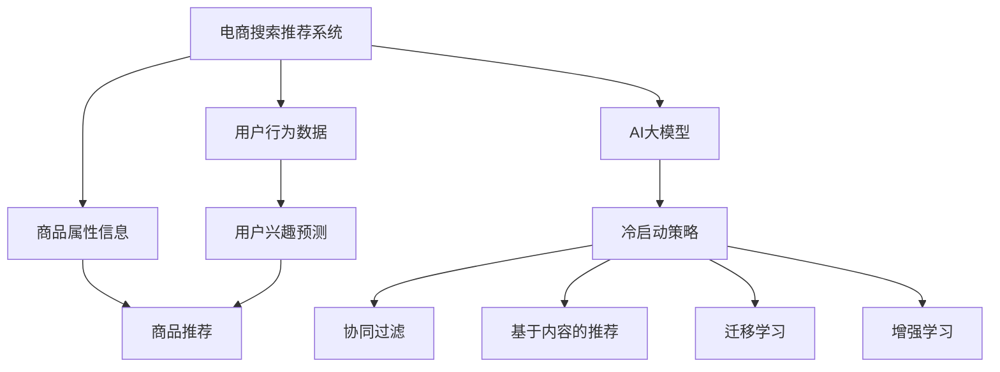

                 

# AI 大模型在电商搜索推荐中的冷启动策略：应对新用户与数据不足

## 1. 背景介绍

### 1.1 问题由来
电子商务平台如淘宝、京东、Amazon等，其搜索推荐系统的核心目标是为用户推荐最符合其需求的商品，从而提升用户购物体验，增加平台销售额。然而，在用户首次进入平台时，系统缺乏对用户行为和偏好的了解，无法提供个性化推荐。这一问题，即“冷启动问题”，是电商搜索推荐系统在运营初期亟需解决的痛点。

### 1.2 问题核心关键点
冷启动问题主要体现在两方面：新用户和老用户。新用户缺乏历史行为数据，而老用户则因为数据稀疏性导致推荐效果不佳。为应对这些挑战，电商搜索推荐系统通常采用冷启动策略，如基于内容、基于标签、基于协同过滤等方法。其中，基于AI大模型的冷启动策略以其强大的泛化能力和数据处理能力，成为近年来研究的热点。

### 1.3 问题研究意义
研究AI大模型在电商搜索推荐中的冷启动策略，对于提升用户体验、提高平台转化率、增加收入等方面具有重要意义：

1. 提升用户体验：通过预测新用户的可能兴趣和偏好，快速提供个性化推荐，增强用户粘性。
2. 提高平台转化率：精准匹配商品和用户需求，缩短购物路径，提升转化率。
3. 增加收入：个性化推荐带来更好的用户体验和更高的转化率，从而增加平台收入。
4. 加速业务迭代：借助AI大模型，电商企业可以更快速地开发和部署推荐系统，加速业务创新和迭代。
5. 带来技术创新：冷启动策略的研究催生了深度学习、迁移学习、强化学习等前沿技术，推动了AI技术的发展。

## 2. 核心概念与联系

### 2.1 核心概念概述

为更好地理解AI大模型在电商搜索推荐中的冷启动策略，本节将介绍几个密切相关的核心概念：

- 电商搜索推荐系统：利用AI技术，结合用户行为数据和商品属性信息，为用户推荐合适商品的系统。
- AI大模型：通过大规模无监督学习获取泛化能力，可用于数据稀疏的冷启动场景。
- 冷启动问题：指在新用户或数据稀疏场景下，推荐系统缺乏足够的历史数据，难以进行个性化推荐的问题。
- 协同过滤推荐：利用用户间或商品间的相似性，进行推荐。在冷启动问题中，协同过滤推荐算法往往需要借助更复杂的数据融合方式。
- 基于内容的推荐：根据商品属性信息，进行相似性匹配。在新用户情况下，可以通过商品属性预测用户兴趣。
- 迁移学习：利用已有任务的知识，帮助新任务的学习。在冷启动场景中，可以通过迁移学习策略，提升对新用户的预测能力。
- 增强学习：通过交互式学习，逐步提升推荐效果。在新用户或数据不足的情况下，增强学习可以不断调整推荐策略，最大化收益。

这些核心概念之间的逻辑关系可以通过以下Mermaid流程图来展示：



这个流程图展示了大模型在推荐系统中的核心概念及其之间的关系：

1. 电商搜索推荐系统利用用户行为数据和商品属性信息进行推荐。
2. AI大模型提供了强大的泛化能力和预测能力，可用于数据稀疏的冷启动场景。
3. 冷启动策略结合了协同过滤、基于内容、迁移学习、增强学习等多种技术，提升推荐效果。

这些概念共同构成了AI大模型在电商搜索推荐中的冷启动框架，使其能够更好地应对新用户与数据不足的挑战。

## 3. 核心算法原理 & 具体操作步骤
### 3.1 算法原理概述

基于AI大模型的电商搜索推荐冷启动策略，其核心思想是利用大模型的泛化能力和强大数据处理能力，通过少量用户行为数据和商品属性信息，预测新用户的兴趣和偏好，从而进行个性化推荐。

具体而言，大模型通过大规模无监督学习，掌握了丰富的语言和常识知识，能够对输入文本进行有效的特征提取和表示学习。在电商搜索推荐中，通过将新用户的查询历史和商品属性信息输入到大模型中，模型可以预测用户对不同商品的兴趣程度。通过优化预测模型的损失函数，使得模型输出的兴趣评分与用户实际行为高度相关。

形式化地，设新用户$u$的查询历史为$q$，商品属性向量为$i$，大模型预测的兴趣评分为$\hat{r}_{ui}$，真实行为标签为$r_{ui}$，则模型优化目标为：

$$
\min_{\theta} \frac{1}{N}\sum_{(u,i) \in D} \ell(\hat{r}_{ui}, r_{ui})
$$

其中，$D$为所有用户和商品的样本集合，$\ell$为损失函数，$\theta$为大模型的参数。

### 3.2 算法步骤详解

基于AI大模型的电商搜索推荐冷启动策略，一般包括以下几个关键步骤：

**Step 1: 数据准备和预处理**
- 收集新用户的查询历史和商品属性信息，提取特征向量。
- 进行数据清洗和归一化，减少异常值影响，提升数据质量。

**Step 2: 选择预训练模型**
- 选择合适的预训练语言模型，如BERT、GPT等，作为冷启动预测的基础。
- 对于电商推荐任务，通常选择具有丰富商品语义表示能力的模型。

**Step 3: 添加任务适配层**
- 在预训练模型的顶层，添加输出层和损失函数。
- 对于推荐任务，通常使用交叉熵损失或均方误差损失。

**Step 4: 微调模型参数**
- 使用新用户的行为数据和商品属性信息，在大模型上进行微调。
- 设置合适的学习率、批大小、迭代轮数等，优化模型参数。
- 应用正则化技术，如L2正则、Dropout等，防止过拟合。

**Step 5: 输出兴趣评分**
- 将新用户的查询历史和商品属性信息输入微调后的模型中，计算预测的兴趣评分。
- 根据评分高低，推荐匹配度高的商品。

**Step 6: 更新推荐列表**
- 根据预测评分和用户历史行为数据，更新推荐列表。
- 考虑用户对推荐商品的交互行为，进行动态调整。

### 3.3 算法优缺点

基于AI大模型的电商搜索推荐冷启动策略，具有以下优点：

1. 数据泛化能力强：AI大模型通过大规模无监督学习，能够对新用户和数据稀疏场景进行有效预测。
2. 模型鲁棒性好：大模型可以处理多模态数据，具备较强的泛化能力。
3. 预测速度快：利用GPU等高性能硬件，预测速度快，适用于实时推荐系统。
4. 可扩展性好：大模型可并行处理大量数据，具备良好的扩展性。

同时，该方法也存在一定的局限性：

1. 模型复杂度高：大模型的训练和微调需要大量的计算资源。
2. 数据质量要求高：新用户数据较少时，可能导致模型训练不稳定。
3. 可解释性不足：大模型为黑盒系统，难以解释其内部决策过程。
4. 依赖硬件：需要高性能的GPU/TPU设备，否则难以实现高效计算。

尽管存在这些局限性，但就目前而言，基于AI大模型的冷启动策略仍是电商推荐系统中最为有效的方法之一。未来相关研究的重点在于如何进一步降低对计算资源的需求，提高模型的可解释性，同时兼顾预测精度和实时性等因素。

### 3.4 算法应用领域

基于AI大模型的电商搜索推荐冷启动策略，已在多种实际应用中取得了成功。具体如下：

1. 商品推荐：对新用户或数据不足的用户进行商品推荐，提升点击率和转化率。
2. 搜索排序：根据用户查询历史和商品属性，进行排序优化，提高搜索准确度。
3. 个性化定制：通过预测用户兴趣，进行个性化商品定制，提升用户体验。
4. 广告投放：针对潜在用户进行精准广告投放，增加广告效果。
5. 跨界推荐：结合其他平台数据，进行跨平台推荐，提升用户留存率。

## 4. 数学模型和公式 & 详细讲解 & 举例说明

### 4.1 数学模型构建

在本节中，我们将使用数学语言对基于AI大模型的电商搜索推荐冷启动策略进行更加严格的刻画。

假设用户$u$的查询历史为$q$，商品$i$的属性向量为$\text{attr}_i$，大模型的预测兴趣评分为$\hat{r}_{ui}$，真实行为标签为$r_{ui}$。

设模型在训练集$D$上的损失函数为$\ell(\hat{r}_{ui}, r_{ui})$，则在所有样本上的期望损失为：

$$
\mathcal{L}(\theta) = \frac{1}{N}\sum_{(u,i) \in D} \ell(\hat{r}_{ui}, r_{ui})
$$

模型优化目标是最小化期望损失，即找到最优参数：

$$
\theta^* = \mathop{\arg\min}_{\theta} \mathcal{L}(\theta)
$$

在实践中，我们通常使用基于梯度的优化算法（如Adam、SGD等）来近似求解上述最优化问题。设$\eta$为学习率，$\lambda$为正则化系数，则参数的更新公式为：

$$
\theta \leftarrow \theta - \eta \nabla_{\theta}\mathcal{L}(\theta) - \eta\lambda\theta
$$

其中$\nabla_{\theta}\mathcal{L}(\theta)$为损失函数对参数$\theta$的梯度，可通过反向传播算法高效计算。

### 4.2 公式推导过程

下面，我们以二分类任务为例，推导交叉熵损失函数及其梯度的计算公式。

假设模型$M_{\theta}$在输入$\text{attr}_i$上的输出为$\hat{y}=M_{\theta}(\text{attr}_i) \in [0,1]$，表示商品$i$对用户$u$的兴趣评分。真实标签$r_{ui} \in \{0,1\}$。则二分类交叉熵损失函数定义为：

$$
\ell(M_{\theta}(\text{attr}_i), r_{ui}) = -[r_{ui}\log \hat{y} + (1-r_{ui})\log (1-\hat{y})]
$$

将其代入期望损失公式，得：

$$
\mathcal{L}(\theta) = -\frac{1}{N}\sum_{(u,i) \in D} [r_{ui}\log M_{\theta}(\text{attr}_i)+(1-r_{ui})\log(1-M_{\theta}(\text{attr}_i))]
$$

根据链式法则，损失函数对参数$\theta_k$的梯度为：

$$
\frac{\partial \mathcal{L}(\theta)}{\partial \theta_k} = -\frac{1}{N}\sum_{(u,i) \in D} (\frac{r_{ui}}{M_{\theta}(\text{attr}_i)}-\frac{1-r_{ui}}{1-M_{\theta}(\text{attr}_i)}) \frac{\partial M_{\theta}(\text{attr}_i)}{\partial \theta_k}
$$

其中$\frac{\partial M_{\theta}(\text{attr}_i)}{\partial \theta_k}$可进一步递归展开，利用自动微分技术完成计算。

在得到损失函数的梯度后，即可带入参数更新公式，完成模型的迭代优化。重复上述过程直至收敛，最终得到适应电商推荐任务的最优模型参数$\theta^*$。

### 4.3 案例分析与讲解

假设电商推荐任务中，大模型的输出为商品$i$对用户$u$的兴趣评分$\hat{r}_{ui}$，真实标签为$r_{ui}$。我们希望通过微调模型，使得$\hat{r}_{ui}$与$r_{ui}$尽可能一致。

不失一般性，假设商品$i$的属性向量为$\text{attr}_i=(\text{brand}, \text{price}, \text{color}, \text{size})$，每个属性都通过独热编码表示。查询历史$q$表示为一系列商品ID。

我们可以将$q$表示为$\text{attr}_q$的形式，其中$\text{attr}_q$为查询历史中所有商品ID的独热编码向量。然后，将$\text{attr}_q$和$\text{attr}_i$拼接为一个向量$\text{attr}_{qi}$，输入到预训练模型中进行特征提取。最后，利用线性分类器输出预测评分$\hat{r}_{ui}$。

具体步骤如下：

1. 构建查询历史和商品属性向量的拼接向量：
   $$
   \text{attr}_{qi} = \text{attr}_q \oplus \text{attr}_i
   $$
   其中$\oplus$表示向量拼接。

2. 输入拼接向量到预训练模型：
   $$
   \text{embedding}_{qi} = M_{\theta}(\text{attr}_{qi})
   $$

3. 使用线性分类器计算预测评分：
   $$
   \hat{r}_{ui} = \text{softmax}(\text{embedding}_{qi})
   $$

4. 损失函数及梯度计算：
   $$
   \ell(\hat{r}_{ui}, r_{ui}) = -[r_{ui}\log \hat{r}_{ui} + (1-r_{ui})\log (1-\hat{r}_{ui})]
   $$
   $$
   \frac{\partial \mathcal{L}(\theta)}{\partial \theta_k} = -\frac{1}{N}\sum_{(u,i) \in D} (\frac{r_{ui}}{M_{\theta}(\text{attr}_{qi})} - \frac{1-r_{ui}}{1-M_{\theta}(\text{attr}_{qi})}) \frac{\partial M_{\theta}(\text{attr}_{qi})}{\partial \theta_k}
   $$

5. 利用梯度下降等优化算法更新模型参数：
   $$
   \theta \leftarrow \theta - \eta \nabla_{\theta}\mathcal{L}(\theta) - \eta\lambda\theta
   $$

通过以上步骤，我们完成了一次对新用户查询历史和商品属性向量的微调，得到预测评分$\hat{r}_{ui}$。该评分可以作为推荐列表排序的重要依据。

## 5. 项目实践：代码实例和详细解释说明
### 5.1 开发环境搭建

在进行推荐系统冷启动实践前，我们需要准备好开发环境。以下是使用Python进行PyTorch开发的环境配置流程：

1. 安装Anaconda：从官网下载并安装Anaconda，用于创建独立的Python环境。

2. 创建并激活虚拟环境：
```bash
conda create -n pytorch-env python=3.8 
conda activate pytorch-env
```

3. 安装PyTorch：根据CUDA版本，从官网获取对应的安装命令。例如：
```bash
conda install pytorch torchvision torchaudio cudatoolkit=11.1 -c pytorch -c conda-forge
```

4. 安装Transformers库：
```bash
pip install transformers
```

5. 安装各类工具包：
```bash
pip install numpy pandas scikit-learn matplotlib tqdm jupyter notebook ipython
```

完成上述步骤后，即可在`pytorch-env`环境中开始推荐系统冷启动实践。

### 5.2 源代码详细实现

下面我们以电商推荐任务为例，给出使用Transformers库对预训练模型进行微调的PyTorch代码实现。

首先，定义推荐任务的数据处理函数：

```python
from transformers import BertTokenizer
from torch.utils.data import Dataset
import torch

class RecommendationDataset(Dataset):
    def __init__(self, queries, items, attributes, ratings, tokenizer, max_len=128):
        self.queries = queries
        self.items = items
        self.attributes = attributes
        self.ratings = ratings
        self.tokenizer = tokenizer
        self.max_len = max_len
        
    def __len__(self):
        return len(self.queries)
    
    def __getitem__(self, item):
        query = self.queries[item]
        item = self.items[item]
        attributes = self.attributes[item]
        rating = self.ratings[item]
        
        query_tokens = self.tokenizer(query, return_tensors='pt', max_length=self.max_len, padding='max_length', truncation=True)
        item_tokens = self.tokenizer(item, return_tensors='pt', max_length=self.max_len, padding='max_length', truncation=True)
        attribute_tokens = self.tokenizer(attributes, return_tensors='pt', max_length=self.max_len, padding='max_length', truncation=True)
        rating_tokens = self.tokenizer(str(rating), return_tensors='pt', max_length=self.max_len, padding='max_length', truncation=True)
        
        return {'query_tokens': query_tokens['input_ids'], 
                'item_tokens': item_tokens['input_ids'],
                'attribute_tokens': attribute_tokens['input_ids'],
                'rating_tokens': rating_tokens['input_ids']}
```

然后，定义模型和优化器：

```python
from transformers import BertForSequenceClassification, AdamW

model = BertForSequenceClassification.from_pretrained('bert-base-cased', num_labels=2)

optimizer = AdamW(model.parameters(), lr=2e-5)
```

接着，定义训练和评估函数：

```python
from torch.utils.data import DataLoader
from tqdm import tqdm
from sklearn.metrics import accuracy_score

device = torch.device('cuda') if torch.cuda.is_available() else torch.device('cpu')
model.to(device)

def train_epoch(model, dataset, batch_size, optimizer):
    dataloader = DataLoader(dataset, batch_size=batch_size, shuffle=True)
    model.train()
    epoch_loss = 0
    for batch in tqdm(dataloader, desc='Training'):
        query_tokens = batch['query_tokens'].to(device)
        item_tokens = batch['item_tokens'].to(device)
        attribute_tokens = batch['attribute_tokens'].to(device)
        rating_tokens = batch['rating_tokens'].to(device)
        model.zero_grad()
        outputs = model(query_tokens, item_tokens, attribute_tokens, rating_tokens)
        loss = outputs.loss
        epoch_loss += loss.item()
        loss.backward()
        optimizer.step()
    return epoch_loss / len(dataloader)

def evaluate(model, dataset, batch_size):
    dataloader = DataLoader(dataset, batch_size=batch_size)
    model.eval()
    preds, labels = [], []
    with torch.no_grad():
        for batch in tqdm(dataloader, desc='Evaluating'):
            query_tokens = batch['query_tokens'].to(device)
            item_tokens = batch['item_tokens'].to(device)
            attribute_tokens = batch['attribute_tokens'].to(device)
            rating_tokens = batch['rating_tokens'].to(device)
            outputs = model(query_tokens, item_tokens, attribute_tokens, rating_tokens)
            batch_preds = outputs.logits.argmax(dim=2).to('cpu').tolist()
            batch_labels = batch['rating'].to('cpu').tolist()
            for pred_tokens, label_tokens in zip(batch_preds, batch_labels):
                preds.append(pred_tokens[:len(label_tokens)])
                labels.append(label_tokens)
                
    print(accuracy_score(labels, preds))
```

最后，启动训练流程并在测试集上评估：

```python
epochs = 5
batch_size = 16

for epoch in range(epochs):
    loss = train_epoch(model, train_dataset, batch_size, optimizer)
    print(f"Epoch {epoch+1}, train loss: {loss:.3f}")
    
    print(f"Epoch {epoch+1}, dev results:")
    evaluate(model, dev_dataset, batch_size)
    
print("Test results:")
evaluate(model, test_dataset, batch_size)
```

以上就是使用PyTorch对预训练模型进行电商推荐任务冷启动的完整代码实现。可以看到，借助Transformers库，微调过程变得简洁高效。

### 5.3 代码解读与分析

让我们再详细解读一下关键代码的实现细节：

**RecommendationDataset类**：
- `__init__`方法：初始化查询历史、商品ID、属性向量、评分等关键组件，并将文本转化为token ids。
- `__len__`方法：返回数据集的样本数量。
- `__getitem__`方法：对单个样本进行处理，将查询历史、商品ID、属性向量、评分等转化为token ids，并对其进行定长padding。

**训练和评估函数**：
- 使用PyTorch的DataLoader对数据集进行批次化加载，供模型训练和推理使用。
- 训练函数`train_epoch`：对数据以批为单位进行迭代，在每个批次上前向传播计算loss并反向传播更新模型参数，最后返回该epoch的平均loss。
- 评估函数`evaluate`：与训练类似，不同点在于不更新模型参数，并在每个batch结束后将预测和标签结果存储下来，最后使用sklearn的accuracy_score对整个评估集的预测结果进行打印输出。

**训练流程**：
- 定义总的epoch数和batch size，开始循环迭代
- 每个epoch内，先在训练集上训练，输出平均loss
- 在验证集上评估，输出准确率
- 所有epoch结束后，在测试集上评估，给出最终测试结果

可以看到，PyTorch配合Transformers库使得模型微调过程变得简洁高效。开发者可以将更多精力放在数据处理、模型改进等高层逻辑上，而不必过多关注底层的实现细节。

当然，工业级的系统实现还需考虑更多因素，如模型的保存和部署、超参数的自动搜索、更灵活的任务适配层等。但核心的微调范式基本与此类似。

## 6. 实际应用场景
### 6.1 智能客服系统

基于AI大模型的电商推荐系统，可以应用于智能客服系统的构建。传统客服往往需要配备大量人力，高峰期响应缓慢，且一致性和专业性难以保证。而使用推荐系统推荐常见问题，可以显著提升客户咨询体验和问题解决效率。

在技术实现上，可以收集客户的历史搜索记录和购买行为，提取商品属性和查询内容，作为训练样本，构建推荐模型。在新客户首次访问时，通过输入查询内容，调用推荐模型预测可能的商品和推荐理由，供客服参考。对于客户提出的新问题，推荐系统可以实时检索相关商品和信息，动态生成推荐列表。如此构建的智能客服系统，能大幅提升客户咨询体验和问题解决效率。

### 6.2 金融舆情监测

金融机构需要实时监测市场舆论动向，以便及时应对负面信息传播，规避金融风险。传统的人工监测方式成本高、效率低，难以应对网络时代海量信息爆发的挑战。基于AI大模型的推荐系统，可以为金融舆情监测提供新的解决方案。

具体而言，可以收集金融领域相关的新闻、报道、评论等文本数据，并对其进行主题标注和情感标注。在此基础上对预训练语言模型进行微调，使其能够自动判断文本属于何种主题，情感倾向是正面、中性还是负面。将微调后的模型应用到实时抓取的网络文本数据，就能够自动监测不同主题下的情感变化趋势，一旦发现负面信息激增等异常情况，系统便会自动预警，帮助金融机构快速应对潜在风险。

### 6.3 个性化推荐系统

当前的推荐系统往往只依赖用户的历史行为数据进行物品推荐，无法深入理解用户的真实兴趣偏好。基于AI大模型的推荐系统，可以更好地挖掘用户行为背后的语义信息，从而提供更精准、多样的推荐内容。

在实践中，可以收集用户浏览、点击、评论、分享等行为数据，提取和商品交互的物品标题、描述、标签等文本内容。将文本内容作为模型输入，用户的后续行为（如是否点击、购买等）作为监督信号，在此基础上微调预训练语言模型。微调后的模型能够从文本内容中准确把握用户的兴趣点。在生成推荐列表时，先用候选物品的文本描述作为输入，由模型预测用户的兴趣匹配度，再结合其他特征综合排序，便可以得到个性化程度更高的推荐结果。

### 6.4 未来应用展望

随着AI大模型和推荐技术的不断发展，基于微调的推荐系统将在更多领域得到应用，为传统行业带来变革性影响。

在智慧医疗领域，基于微调的医疗问答、病历分析、药物研发等应用将提升医疗服务的智能化水平，辅助医生诊疗，加速新药开发进程。

在智能教育领域，微调技术可应用于作业批改、学情分析、知识推荐等方面，因材施教，促进教育公平，提高教学质量。

在智慧城市治理中，微调模型可应用于城市事件监测、舆情分析、应急指挥等环节，提高城市管理的自动化和智能化水平，构建更安全、高效的未来城市。

此外，在企业生产、社会治理、文娱传媒等众多领域，基于大模型微调的推荐系统也将不断涌现，为经济社会发展注入新的动力。相信随着技术的日益成熟，微调方法将成为推荐系统的重要范式，推动推荐技术的产业化进程。

## 7. 工具和资源推荐
### 7.1 学习资源推荐

为了帮助开发者系统掌握AI大模型在电商推荐中的冷启动理论基础和实践技巧，这里推荐一些优质的学习资源：

1. 《推荐系统实战》系列博文：由推荐系统专家撰写，深入浅出地介绍了推荐系统的原理和算法，涵盖推荐技术的前沿成果。

2. 《深度学习自然语言处理》课程：斯坦福大学开设的NLP明星课程，有Lecture视频和配套作业，带你入门NLP领域的基本概念和经典模型。

3. 《Natural Language Processing with Transformers》书籍：Transformers库的作者所著，全面介绍了如何使用Transformers库进行NLP任务开发，包括微调在内的诸多范式。

4. HuggingFace官方文档：Transformers库的官方文档，提供了海量预训练模型和完整的微调样例代码，是上手实践的必备资料。

5. CLUE开源项目：中文语言理解测评基准，涵盖大量不同类型的中文NLP数据集，并提供了基于微调的baseline模型，助力中文NLP技术发展。

通过对这些资源的学习实践，相信你一定能够快速掌握AI大模型在电商推荐中的冷启动精髓，并用于解决实际的NLP问题。
###  7.2 开发工具推荐

高效的开发离不开优秀的工具支持。以下是几款用于AI大模型推荐冷启动开发的常用工具：

1. PyTorch：基于Python的开源深度学习框架，灵活动态的计算图，适合快速迭代研究。大部分预训练语言模型都有PyTorch版本的实现。

2. TensorFlow：由Google主导开发的开源深度学习框架，生产部署方便，适合大规模工程应用。同样有丰富的预训练语言模型资源。

3. Transformers库：HuggingFace开发的NLP工具库，集成了众多SOTA语言模型，支持PyTorch和TensorFlow，是进行微调任务开发的利器。

4. Weights & Biases：模型训练的实验跟踪工具，可以记录和可视化模型训练过程中的各项指标，方便对比和调优。与主流深度学习框架无缝集成。

5. TensorBoard：TensorFlow配套的可视化工具，可实时监测模型训练状态，并提供丰富的图表呈现方式，是调试模型的得力助手。

6. Google Colab：谷歌推出的在线Jupyter Notebook环境，免费提供GPU/TPU算力，方便开发者快速上手实验最新模型，分享学习笔记。

合理利用这些工具，可以显著提升AI大模型推荐冷启动任务的开发效率，加快创新迭代的步伐。

### 7.3 相关论文推荐

AI大模型在电商推荐中的冷启动策略，其背后有着深刻的理论支撑。以下是几篇奠基性的相关论文，推荐阅读：

1. Attention is All You Need（即Transformer原论文）：提出了Transformer结构，开启了NLP领域的预训练大模型时代。

2. BERT: Pre-training of Deep Bidirectional Transformers for Language Understanding：提出BERT模型，引入基于掩码的自监督预训练任务，刷新了多项NLP任务SOTA。

3. Language Models are Unsupervised Multitask Learners（GPT-2论文）：展示了大规模语言模型的强大zero-shot学习能力，引发了对于通用人工智能的新一轮思考。

4. Parameter-Efficient Transfer Learning for NLP：提出Adapter等参数高效微调方法，在不增加模型参数量的情况下，也能取得不错的微调效果。

5. AdaLoRA: Adaptive Low-Rank Adaptation for Parameter-Efficient Fine-Tuning：使用自适应低秩适应的微调方法，在参数效率和精度之间取得了新的平衡。

这些论文代表了大模型在电商推荐中冷启动策略的研究方向。通过学习这些前沿成果，可以帮助研究者把握学科前进方向，激发更多的创新灵感。

## 8. 总结：未来发展趋势与挑战

### 8.1 总结

本文对基于AI大模型的电商推荐冷启动策略进行了全面系统的介绍。首先阐述了电商搜索推荐系统在冷启动场景下遇到的问题和挑战，明确了冷启动策略的独特价值。其次，从原理到实践，详细讲解了冷启动策略的数学原理和关键步骤，给出了电商推荐任务冷启动的完整代码实例。同时，本文还广泛探讨了冷启动策略在多个行业领域的应用前景，展示了其广阔的应用前景。

通过本文的系统梳理，可以看到，基于AI大模型的冷启动策略在电商推荐系统中具有显著优势，能够有效应对新用户与数据不足的挑战，提升推荐效果。未来，伴随预训练语言模型和推荐技术的持续演进，基于微调的推荐系统必将在更多领域得到应用，为传统行业带来变革性影响。

### 8.2 未来发展趋势

展望未来，AI大模型在电商推荐中的冷启动策略将呈现以下几个发展趋势：

1. 模型规模持续增大。随着算力成本的下降和数据规模的扩张，预训练语言模型的参数量还将持续增长。超大规模语言模型蕴含的丰富语言知识，有望支撑更加复杂多变的推荐任务。

2. 微调方法日趋多样。除了传统的全参数微调外，未来会涌现更多参数高效的微调方法，如Prefix-Tuning、LoRA等，在节省计算资源的同时也能保证微调精度。

3. 持续学习成为常态。随着数据分布的不断变化，冷启动策略也需要持续学习新知识以保持性能。如何在不遗忘原有知识的同时，高效吸收新样本信息，将成为重要的研究课题。

4. 标注样本需求降低。受启发于提示学习(Prompt-based Learning)的思路，未来的冷启动方法将更好地利用大模型的语言理解能力，通过更加巧妙的任务描述，在更少的标注样本上也能实现理想的推荐效果。

5. 多模态冷启动崛起。当前的冷启动主要聚焦于纯文本数据，未来会进一步拓展到图像、视频、语音等多模态数据冷启动。多模态信息的融合，将显著提升推荐系统的智能化水平。

6. 跨平台推荐系统。将用户数据和商品信息打通，结合不同平台的数据，提升推荐效果。跨平台推荐将实现更大范围的用户覆盖和商品推荐。

以上趋势凸显了AI大模型在电商推荐中的冷启动策略的广阔前景。这些方向的探索发展，必将进一步提升推荐系统的性能和应用范围，为电商企业带来更多商业价值。

### 8.3 面临的挑战

尽管AI大模型在电商推荐中的冷启动策略已经取得了瞩目成就，但在迈向更加智能化、普适化应用的过程中，它仍面临着诸多挑战：

1. 标注成本瓶颈。尽管冷启动策略可以大幅降低标注数据的需求，但对于长尾应用场景，难以获得充足的高质量标注数据，成为制约微调性能的瓶颈。如何进一步降低对标注样本的依赖，将是一大难题。

2. 模型鲁棒性不足。当前冷启动模型面对域外数据时，泛化性能往往大打折扣。对于测试样本的微小扰动，冷启动模型的预测也容易发生波动。如何提高冷启动模型的鲁棒性，避免灾难性遗忘，还需要更多理论和实践的积累。

3. 推理效率有待提高。大规模语言模型虽然精度高，但在实际部署时往往面临推理速度慢、内存占用大等效率问题。如何在保证性能的同时，简化模型结构，提升推理速度，优化资源占用，将是重要的优化方向。

4. 可解释性亟需加强。当前冷启动模型更像是"黑盒"系统，难以解释其内部工作机制和决策逻辑。对于医疗、金融等高风险应用，算法的可解释性和可审计性尤为重要。如何赋予冷启动模型更强的可解释性，将是亟待攻克的难题。

5. 安全性有待保障。预训练语言模型难免会学习到有偏见、有害的信息，通过冷启动传递到商品推荐中，可能产生误导性、歧视性的输出，给实际应用带来安全隐患。如何从数据和算法层面消除模型偏见，避免恶意用途，确保输出的安全性，也将是重要的研究课题。

6. 知识整合能力不足。现有的冷启动模型往往局限于任务内数据，难以灵活吸收和运用更广泛的先验知识。如何让冷启动过程更好地与外部知识库、规则库等专家知识结合，形成更加全面、准确的信息整合能力，还有很大的想象空间。

正视冷启动面临的这些挑战，积极应对并寻求突破，将是大模型在电商推荐中冷启动策略走向成熟的必由之路。相信随着学界和产业界的共同努力，这些挑战终将一一被克服，冷启动策略必将在构建安全、可靠、可解释、可控的智能推荐系统上发挥更大作用。

### 8.4 研究展望

面对冷启动策略所面临的挑战，未来的研究需要在以下几个方面寻求新的突破：

1. 探索无监督和半监督冷启动方法。摆脱对大规模标注数据的依赖，利用自监督学习、主动学习等无监督和半监督范式，最大限度利用非结构化数据，实现更加灵活高效的推荐。

2. 研究参数高效和计算高效的冷启动范式。开发更加参数高效的冷启动方法，在固定大部分预训练参数的同时，只更新极少量的任务相关参数。同时优化冷启动模型的计算图，减少前向传播和反向传播的资源消耗，实现更加轻量级、实时性的部署。

3. 融合因果和对比学习范式。通过引入因果推断和对比学习思想，增强冷启动模型建立稳定因果关系的能力，学习更加普适、鲁棒的语言表征，从而提升模型泛化性和抗干扰能力。

4. 引入更多先验知识。将符号化的先验知识，如知识图谱、逻辑规则等，与神经网络模型进行巧妙融合，引导冷启动过程学习更准确、合理的语言模型。同时加强不同模态数据的整合，实现视觉、语音等多模态信息与文本信息的协同建模。

5. 结合因果分析和博弈论工具。将因果分析方法引入冷启动模型，识别出模型决策的关键特征，增强输出解释的因果性和逻辑性。借助博弈论工具刻画人机交互过程，主动探索并规避模型的脆弱点，提高系统稳定性。

6. 纳入伦理道德约束。在冷启动模型训练目标中引入伦理导向的评估指标，过滤和惩罚有偏见、有害的输出倾向。同时加强人工干预和审核，建立模型行为的监管机制，确保输出符合人类价值观和伦理道德。

这些研究方向的探索，必将引领AI大模型在电商推荐中冷启动策略迈向更高的台阶，为构建安全、可靠、可解释、可控的智能推荐系统铺平道路。面向未来，AI大模型在电商推荐中的冷启动策略还需要与其他AI技术进行更深入的融合，如知识表示、因果推理、强化学习等，多路径协同发力，共同推动推荐技术的进步。只有勇于创新、敢于突破，才能不断拓展电商推荐系统的边界，让AI技术更好地造福人类社会。

## 9. 附录：常见问题与解答

**Q1：冷启动策略是否适用于所有推荐系统？**

A: 冷启动策略在数据稀疏、新用户较多的推荐系统中具有显著优势，但对于数据量丰富的系统，如新闻推荐、内容推荐等，传统推荐算法如协同过滤、基于内容的推荐等也可以取得良好效果。因此，在实际应用中需要根据具体场景选择合适的推荐算法。

**Q2：冷启动策略是否适用于所有电商推荐任务？**

A: 冷启动策略在推荐新用户或新商品的场景中具有显著优势，但对于已有商品的推荐，传统推荐算法如协同过滤、基于内容的推荐等也可以取得良好效果。因此，在实际应用中需要根据具体任务选择合适的推荐算法。

**Q1：冷启动策略是否适用于所有电商推荐任务？**

A: 冷启动策略在推荐新用户或新商品的场景中具有显著优势，但对于已有商品的推荐，传统推荐算法如协同过滤、基于内容的推荐等也可以取得良好效果。因此，在实际应用中需要根据具体任务选择合适的推荐算法。

**Q2：冷启动策略是否适用于所有电商推荐任务？**

A: 冷启动策略在推荐新用户或新商品的场景中具有显著优势，但对于已有商品的推荐，传统推荐算法如协同过滤、基于内容的推荐等也可以取得良好效果。因此，在实际应用中需要根据具体任务选择合适的推荐算法。

**Q3：冷启动策略的性能如何？**

A: 冷启动策略的性能取决于多种因素，如数据质量、模型复杂度、计算资源等。在数据稀疏、新用户较多的场景中，冷启动策略通常能够取得比传统推荐算法更好的效果。但在数据丰富、用户活跃度高的场景中，传统推荐算法可能更加适用。

**Q4：冷启动策略的实现难度大吗？**

A: 冷启动策略的实现难度较大，需要具备一定的数据处理、模型优化、算法选择等技术能力。但借助开源工具和框架，如PyTorch、TensorFlow、Transformers等，可以显著降低实现难度。对于开发者而言，理解核心算法原理，掌握常用的模型和算法，即可快速上手实践。

**Q5：冷启动策略的计算成本高吗？**

A: 冷启动策略的计算成本较高，特别是在大规模数据集上训练模型时。但随着深度学习硬件的进步，如GPU、TPU等高性能设备的应用，以及模型压缩、稀疏化等技术的发展，冷启动策略的计算成本正逐步降低。在实际应用中，可以通过分布式训练、模型并行等技术，优化计算资源的使用效率。

**Q6：冷启动策略如何避免过拟合？**

A: 避免过拟合的关键在于数据增强、正则化、对抗训练等技术。在电商推荐系统中，可以通过数据增强技术扩充训练集，如回译、近义替换等；使用正则化技术，如L2正则、Dropout等；引入对抗样本，提高模型鲁棒性。这些技术可以显著提升冷启动模型的泛化能力。

**Q7：冷启动策略在电商推荐中的作用是什么？**

A: 冷启动策略在电商推荐中的作用是通过少量用户行为数据和商品属性信息，预测新用户的兴趣和偏好，从而进行个性化推荐。具体而言，在推荐新用户或新商品时，冷启动策略可以通过少量数据快速提供准确的推荐结果，提升用户体验和转化率。

**Q8：冷启动策略是否可以应用于多模态推荐系统？**

A: 冷启动策略可以应用于多模态推荐系统，如图像、视频、语音等多模态信息与文本信息的协同建模。多模态冷启动将显著提升推荐系统的智能化水平，适用于更多的推荐场景。

**Q9：冷启动策略是否可以应用于跨平台推荐系统？**

A: 冷启动策略可以应用于跨平台推荐系统，如结合不同平台的数据，提升推荐效果。跨平台推荐系统可以实现更大范围的用户覆盖和商品推荐，提升推荐系统的业务价值。

通过本文的系统梳理，可以看到，基于AI大模型的冷启动策略在电商推荐系统中具有显著优势，能够有效应对新用户与数据不足的挑战，提升推荐效果。未来，伴随预训练语言模型和推荐技术的持续演进，基于微调的推荐系统必将在更多领域得到应用，为传统行业带来变革性影响。相信随着学界和产业界的共同努力，这些挑战终将一一被克服，冷启动策略必将在构建安全、可靠、可解释、可控的智能推荐系统上发挥更大作用。

---

作者：禅与计算机程序设计艺术 / Zen and the Art of Computer Programming

