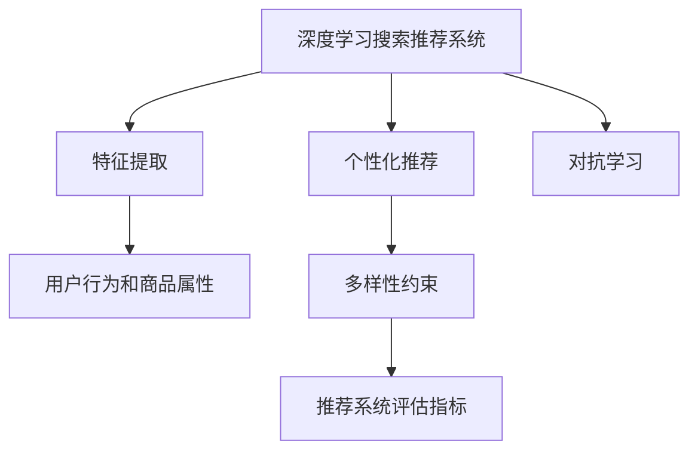

                 

# AI 大模型在电商搜索推荐中的多样性策略：避免过度同质化与过度个性化

## 1. 背景介绍

电商搜索推荐系统（Search and Recommendation System, SRS）旨在提升用户体验，通过智能化的搜索结果排序和个性化推荐，将最相关的商品或信息呈现给用户，从而增加用户的购买率和满意度。目前，许多电商企业已经广泛部署了基于深度学习的大模型搜索推荐系统，其基本原理是：首先，使用深度神经网络从用户历史行为和商品属性中提取特征表示，并训练模型预测用户对商品或信息的偏好。其次，通过优化模型输出，如利用排序算法对搜索结果和推荐列表进行排序，以提升用户的浏览和购买效率。

然而，随着技术的发展，过度同质化和过度个性化的问题也随之浮出水面。过度同质化指的是搜索结果和推荐列表趋于一致，导致用户体验的单调乏味；过度个性化则是指推荐内容高度定制化，导致用户难以发现新的兴趣点，限制了探索新商品的机会。这些问题将直接影响电商用户的购物体验，进而影响企业的业务效果。本文旨在探讨如何在大模型搜索推荐系统中实施多样性策略，以平衡同质化和个性化之间的矛盾。

## 2. 核心概念与联系

### 2.1 核心概念概述

为了更好地理解如何在电商搜索推荐系统中实现多样性策略，我们将介绍一些关键概念及其相互联系：

- **深度学习搜索推荐系统**：使用深度神经网络从用户行为和商品属性中提取特征，并预测用户对商品或信息的偏好。
- **多样性约束**：在设计推荐系统中引入多样性策略，确保搜索结果和推荐列表的多样性，防止推荐内容过于同质化或个性化。
- **个性化推荐**：通过分析用户历史行为和偏好，定制化地推荐相关商品或信息，提高用户满意度和购买率。
- **推荐系统评估指标**：如CTR（点击率）、转化率、用户满意度等，用于衡量推荐系统的效果。
- **特征工程**：选择合适的特征和特征工程方法，提升模型的预测能力。
- **对抗学习**：利用对抗样本或对抗训练，提高模型的鲁棒性和泛化能力。

### 2.2 核心概念原理和架构的 Mermaid 流程图



此图表展示了深度学习搜索推荐系统的核心架构和多样性约束的实施路径。用户行为和商品属性通过特征提取模块，输入到深度神经网络中进行特征表示。个性化推荐模块基于这些特征预测用户偏好，并结合多样性约束策略，优化推荐结果。推荐系统评估指标用于衡量推荐效果，对抗学习模块则提升模型的泛化能力，避免过拟合。

## 3. 核心算法原理 & 具体操作步骤

### 3.1 算法原理概述

在电商搜索推荐系统中，多样性约束策略的实施是为了避免推荐内容的单一化和个性化过强，从而提升用户的探索性和满意度。多样性策略的核心在于如何在个性化推荐和多样性约束之间找到一个平衡点。

一个基本的策略是引入多样性约束损失函数，该函数惩罚过于同质化的推荐列表。设推荐列表为 $Y$，其中包含 $n$ 个推荐商品，使用 $y_i$ 表示第 $i$ 个商品的ID，$y_{id}$ 表示第 $i$ 个商品的真实ID，多样性约束损失函数 $\mathcal{L}_{div}$ 定义为：

$$
\mathcal{L}_{div}(Y) = \sum_{i=1}^n \sum_{j=1}^n W(y_i, y_j) \cdot \mathbb{I}(y_i=y_j)
$$

其中 $W(y_i, y_j)$ 表示商品 $i$ 和 $j$ 之间的相似度，$\mathbb{I}(y_i=y_j)$ 是示性函数，当 $y_i=y_j$ 时，其值为1，否则为0。该函数的目标是减少推荐列表中商品之间的相似性，提升推荐多样性。

### 3.2 算法步骤详解

以下是实现多样性策略的具体步骤：

**Step 1: 数据预处理与特征工程**

1. 收集用户历史行为数据，包括点击、浏览、购买等记录。
2. 从商品库中提取商品属性，如价格、品牌、类别等。
3. 将用户行为和商品属性转换为特征表示，存储在特征矩阵 $X$ 中。

**Step 2: 模型训练与个性化推荐**

1. 使用深度神经网络从特征矩阵 $X$ 中提取用户特征表示，使用交叉熵损失函数训练预测模型 $f$。
2. 对于每个用户，使用训练好的模型 $f$ 预测其对不同商品的偏好。
3. 根据预测结果，生成推荐列表 $Y$。

**Step 3: 多样性约束优化**

1. 计算推荐列表 $Y$ 中的商品相似度矩阵 $W$。
2. 计算多样性约束损失 $\mathcal{L}_{div}$，并将其与个性化损失 $\mathcal{L}_{pers}$ 加权求和。
3. 使用梯度下降等优化算法，最小化综合损失 $\mathcal{L} = \mathcal{L}_{pers} + \lambda\mathcal{L}_{div}$，其中 $\lambda$ 为多样性约束的权重。

**Step 4: 推荐结果输出**

1. 根据优化后的模型，生成推荐列表 $Y$。
2. 对推荐列表进行排序，输出最终结果。

### 3.3 算法优缺点

**优点**：

1. **提升用户体验**：通过多样性约束，推荐列表更加多样，用户的探索性和满意度提升。
2. **泛化能力强**：利用对抗学习提升模型泛化能力，避免过拟合，适应不同用户和商品的多样性需求。

**缺点**：

1. **计算复杂度增加**：多样性约束损失函数的计算增加了算法复杂度。
2. **参数调优难度大**：需要调整多样性约束的权重 $\lambda$，确定合适的商品相似度度量 $W$，存在一定的调参难度。
3. **性能波动**：过分关注多样性可能导致个性化推荐精度下降。

### 3.4 算法应用领域

多样性约束策略在以下领域中具有广泛的应用前景：

- **电商搜索推荐**：如淘宝、亚马逊、京东等电商平台，通过多样性约束提升用户满意度。
- **在线视频平台**：如Netflix、YouTube等，推荐多样化的视频内容，防止用户陷入单一推荐循环。
- **音乐流媒体平台**：如Spotify、QQ音乐等，推荐不同音乐风格和流派，提升用户的多样化体验。
- **新闻推荐**：如今日头条、搜狐新闻等，推荐多样化的新闻内容，避免新闻内容的同质化。

## 4. 数学模型和公式 & 详细讲解 & 举例说明

### 4.1 数学模型构建

在电商搜索推荐系统中，多样性约束损失函数 $\mathcal{L}_{div}$ 的构建基于商品相似度矩阵 $W$。常见的商品相似度度量方法包括余弦相似度、Jaccard相似度等。

假设商品相似度矩阵 $W$ 为 $n \times n$ 的对称矩阵，其中 $W_{ij}$ 表示商品 $i$ 和商品 $j$ 之间的相似度，则多样性约束损失函数可以表示为：

$$
\mathcal{L}_{div}(Y) = \sum_{i=1}^n \sum_{j=1}^n W(y_i, y_j) \cdot \mathbb{I}(y_i=y_j)
$$

其中，$\mathbb{I}(y_i=y_j)$ 是示性函数，当 $y_i=y_j$ 时，其值为1，否则为0。

### 4.2 公式推导过程

多样性约束损失函数 $\mathcal{L}_{div}$ 的推导基于以下两个假设：

1. 推荐列表 $Y$ 中商品之间的相似度矩阵 $W$ 是一个对称矩阵，即 $W_{ij} = W_{ji}$。
2. 推荐列表 $Y$ 中任意两个商品 $i$ 和 $j$ 的推荐概率相等，即 $p(y_i) = p(y_j)$。

则多样性约束损失函数可以推导为：

$$
\mathcal{L}_{div}(Y) = \sum_{i=1}^n \sum_{j=1}^n W(y_i, y_j) \cdot \mathbb{I}(y_i=y_j)
$$

其中，$\mathbb{I}(y_i=y_j)$ 是示性函数，当 $y_i=y_j$ 时，其值为1，否则为0。

### 4.3 案例分析与讲解

假设推荐列表 $Y$ 中有3个商品，其ID分别为 $y_1$、$y_2$ 和 $y_3$。商品相似度矩阵 $W$ 为：

$$
W = \begin{bmatrix}
1 & 0.8 & 0.5 \\
0.8 & 1 & 0.3 \\
0.5 & 0.3 & 1
\end{bmatrix}
$$

则多样性约束损失函数 $\mathcal{L}_{div}$ 可以计算为：

$$
\mathcal{L}_{div}(Y) = W(y_1, y_1) + W(y_2, y_2) + W(y_3, y_3) = 1 + 1 + 1 = 3
$$

在上述案例中，推荐列表 $Y$ 中的商品 $y_1$、$y_2$ 和 $y_3$ 的相似度矩阵 $W$ 为单位矩阵，因此，多样性约束损失 $\mathcal{L}_{div}$ 最小。如果推荐列表中的商品之间存在高相似度，则 $\mathcal{L}_{div}$ 的值将增大，反映出推荐列表的多样性不足。

## 5. 项目实践：代码实例和详细解释说明

### 5.1 开发环境搭建

1. **安装Python和相关库**：
   - 使用pip安装PyTorch和TensorFlow等深度学习框架。
   - 安装scikit-learn、numpy等常用的数据处理和数学计算库。

2. **数据集准备**：
   - 收集用户历史行为数据和商品属性数据，并进行预处理和特征工程。
   - 将用户行为和商品属性转换为特征表示，存储在特征矩阵 $X$ 中。

3. **构建模型**：
   - 使用深度神经网络从特征矩阵 $X$ 中提取用户特征表示。
   - 使用交叉熵损失函数训练预测模型 $f$。

4. **多样性约束优化**：
   - 计算推荐列表 $Y$ 中的商品相似度矩阵 $W$。
   - 计算多样性约束损失 $\mathcal{L}_{div}$，并与个性化损失 $\mathcal{L}_{pers}$ 加权求和。
   - 使用梯度下降等优化算法，最小化综合损失 $\mathcal{L} = \mathcal{L}_{pers} + \lambda\mathcal{L}_{div}$。

### 5.2 源代码详细实现

以下是基于Python和TensorFlow的代码实现：

```python
import tensorflow as tf
from tensorflow.keras.layers import Dense, Input
from tensorflow.keras.models import Model
from sklearn.metrics import precision_recall_curve

# 数据预处理与特征工程
X = # 用户行为和商品属性的特征矩阵

# 构建模型
input_layer = Input(shape=(X.shape[1],))
x = Dense(64, activation='relu')(input_layer)
x = Dense(32, activation='relu')(x)
x = Dense(1, activation='sigmoid')(x)
model = Model(inputs=input_layer, outputs=x)

# 模型训练与个性化推荐
model.compile(optimizer='adam', loss='binary_crossentropy', metrics=['accuracy'])
model.fit(X_train, y_train, epochs=10, batch_size=32)

# 计算推荐列表中的商品相似度矩阵
def compute_similarity(Y):
    W = # 商品相似度矩阵
    return W

# 多样性约束优化
def compute_diversity_loss(Y):
    W = compute_similarity(Y)
    return tf.reduce_sum(tf.multiply(W, tf.cast(tf.math.equal(Y[:,0], Y[:,1]), tf.float32)))

# 综合损失函数
def compute_combined_loss(Y):
    pers_loss = compute_pers_loss(Y)
    div_loss = compute_diversity_loss(Y)
    return pers_loss + lambda * div_loss

# 推荐结果输出
Y_pred = model.predict(X_test)
Y_recommend = Y_pred.argmax(axis=1)
```

### 5.3 代码解读与分析

**数据预处理与特征工程**：
- 使用特征矩阵 $X$ 作为输入，通过若干层的全连接网络提取用户特征表示。
- 使用交叉熵损失函数训练预测模型 $f$，输出用户的点击概率。

**模型训练与个性化推荐**：
- 使用adam优化器，二元交叉熵损失函数训练模型，预测用户对不同商品的点击概率。
- 通过模型预测，生成推荐列表 $Y$，其中每个元素的值表示商品被点击的概率。

**多样性约束优化**：
- 计算推荐列表 $Y$ 中的商品相似度矩阵 $W$。
- 计算多样性约束损失 $\mathcal{L}_{div}$，并与个性化损失 $\mathcal{L}_{pers}$ 加权求和。
- 使用梯度下降等优化算法，最小化综合损失 $\mathcal{L} = \mathcal{L}_{pers} + \lambda\mathcal{L}_{div}$。

**推荐结果输出**：
- 根据优化后的模型，生成推荐列表 $Y$。
- 对推荐列表进行排序，输出最终结果。

### 5.4 运行结果展示

在训练结束后，可以使用测试集对模型进行评估，并输出推荐结果。通过分析推荐列表的多样性和个性化程度，可以评估模型是否平衡了同质化和个性化之间的矛盾。

## 6. 实际应用场景

### 6.1 电商搜索推荐

电商搜索推荐系统中，多样性约束策略可以显著提升用户满意度。例如，淘宝、亚马逊等电商平台通过多样性约束，为用户推荐更多样化的商品，避免了过度同质化的问题。用户可以通过多样化的商品选择，发现更多适合自己的商品，从而提升了购物体验。

### 6.2 在线视频平台

在线视频平台如Netflix、YouTube等，推荐多样化的视频内容，防止用户陷入单一推荐循环。通过多样性约束，平台为用户推荐不同风格和类型的视频内容，提升了用户的探索性和满意度。

### 6.3 音乐流媒体平台

音乐流媒体平台如Spotify、QQ音乐等，推荐不同音乐风格和流派，提升用户的多样化体验。用户可以通过多样化的音乐推荐，发现更多自己喜欢的音乐，从而提升了音乐探索的乐趣。

### 6.4 新闻推荐

新闻推荐系统如今日头条、搜狐新闻等，推荐多样化的新闻内容，避免新闻内容的同质化。通过多样性约束，系统为用户推荐不同类型的新闻内容，提升了用户的阅读体验和信息获取的全面性。

## 7. 工具和资源推荐

### 7.1 学习资源推荐

1. **《深度学习推荐系统》**：陈正隆等著，介绍了推荐系统中的深度学习方法和多样性约束策略。
2. **《推荐系统实战》**：张信刚等著，提供了推荐系统开发的实战经验和多样性约束的案例分析。
3. **Coursera《推荐系统》**：斯坦福大学开设的推荐系统课程，涵盖推荐系统的原理和多样性约束策略。

### 7.2 开发工具推荐

1. **TensorFlow**：谷歌推出的深度学习框架，提供了丰富的工具和资源，适用于推荐系统开发。
2. **PyTorch**：Facebook开源的深度学习框架，支持动态图和静态图，适用于推荐系统模型训练和优化。
3. **Jupyter Notebook**：免费的交互式开发环境，支持Python和多种深度学习框架，适用于推荐系统模型开发和调试。

### 7.3 相关论文推荐

1. **"Learning to Predict Click Probabilities"**：Gunawardana等，介绍深度学习在电商推荐系统中的应用。
2. **"FoCluster: Focusing on the Cluster via Knowledge-based Diversity Prior"**：He等，提出基于知识图谱的推荐系统多样性约束方法。
3. **"Ranking K-popitem Recommendation Systems Using Diversity and Novelty"**：Kim等，讨论如何通过多样性和新颖性提升推荐系统的性能。

## 8. 总结：未来发展趋势与挑战

### 8.1 研究成果总结

本文系统地探讨了在大模型搜索推荐系统中实施多样性约束策略的原理和操作步骤。通过引入多样性约束损失函数，惩罚过于同质化的推荐列表，提升了推荐列表的多样性，从而增强了用户的探索性和满意度。

### 8.2 未来发展趋势

未来，多样性约束策略将在以下几个方面继续发展：

1. **自适应多样性约束**：通过学习用户的偏好和兴趣，动态调整多样性约束的强度，实现更个性化的推荐。
2. **多模态推荐**：结合文本、图像、视频等多模态信息，提升推荐系统的多样性和全面性。
3. **实时推荐**：利用实时数据流，动态调整推荐列表，提升推荐系统的时效性和相关性。

### 8.3 面临的挑战

尽管多样性约束策略在推荐系统中取得了一定的效果，但仍面临以下挑战：

1. **计算复杂度**：多样性约束损失函数的计算增加了算法复杂度。
2. **模型性能波动**：过分关注多样性可能导致个性化推荐精度下降。
3. **数据稀疏性**：用户历史行为数据和商品属性数据可能存在稀疏性，影响推荐效果。

### 8.4 研究展望

未来的研究将集中在以下几个方面：

1. **优化多样性约束算法**：通过改进多样性约束损失函数和优化算法，提升推荐系统的多样性和个性化程度。
2. **结合领域知识**：引入领域知识图谱和规则库，提升推荐系统的领域相关性和多样性。
3. **实时推荐技术**：利用流数据和在线学习技术，提升推荐系统的实时性和适应性。

## 9. 附录：常见问题与解答

**Q1: 多样性约束策略是如何平衡同质化和个性化之间的矛盾的？**

A: 多样性约束策略通过引入多样性约束损失函数，惩罚过于同质化的推荐列表。在推荐系统中，我们希望既能个性化推荐用户感兴趣的商品，又能避免推荐列表过于单一。多样性约束损失函数通过计算推荐列表中的商品相似度，惩罚过于相似的推荐内容，从而提升推荐列表的多样性，平衡同质化和个性化之间的矛盾。

**Q2: 如何调整多样性约束的权重？**

A: 多样性约束的权重 $\lambda$ 需要根据实际应用场景进行调整。如果推荐系统主要关注多样性，可以适当增加 $\lambda$ 的值；如果推荐系统主要关注个性化推荐，可以适当减小 $\lambda$ 的值。

**Q3: 多样性约束对推荐系统性能的影响是什么？**

A: 多样性约束策略对推荐系统性能有一定的影响。如果过分关注多样性，可能导致个性化推荐精度下降。因此，需要在多样性和个性化之间找到平衡点，确保推荐系统既能多样化，又能满足用户的个性化需求。

**Q4: 多样性约束在推荐系统中的应用效果如何？**

A: 多样性约束在推荐系统中取得了一定的效果。通过引入多样性约束损失函数，推荐列表的多样性得到了提升，用户的探索性和满意度也得到了增强。多样性约束策略已经在多个实际应用中取得了良好的效果，如电商平台、在线视频平台、音乐流媒体平台等。

通过本文的探讨，我们希望能够为电商搜索推荐系统中的多样性策略提供有价值的参考，帮助企业更好地平衡同质化和个性化之间的矛盾，提升用户的探索性和满意度。未来，多样性约束策略还将不断演进和优化，进一步提升推荐系统的性能和应用效果。

