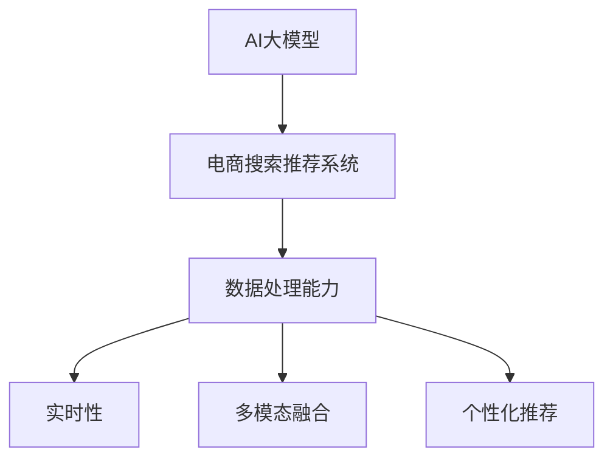

                 

# AI 大模型在电商搜索推荐中的数据处理能力要求：应对大规模数据挑战

> 关键词：AI大模型, 电商搜索推荐, 数据处理能力, 大数据挑战, 数据预处理, 数据增强, 数据清洗, 特征工程, 数据分布

## 1. 背景介绍

### 1.1 问题由来

近年来，随着电子商务的快速发展，消费者在线购物的比例不断攀升，对搜索推荐系统的需求也随之增加。电商搜索推荐系统旨在帮助用户快速找到所需商品，提升购物体验，同时增加商家的销售转化率。然而，随着用户行为数据和商品信息的急剧膨胀，数据处理成为制约系统性能的关键瓶颈。为此，各大电商企业开始将AI大模型应用于搜索推荐系统，以期通过先进的算法和大规模预训练模型，提升系统的智能水平和响应速度。

AI大模型通过在海量无标签数据上进行自监督预训练，获得了丰富的语言知识和通用表示能力。在电商搜索推荐领域，大模型通过进一步微调，能够理解和处理自然语言查询，匹配商品信息，生成个性化推荐结果。然而，由于电商搜索推荐系统面临的数据量巨大、多模态性高、实时性要求高等特点，对AI大模型的数据处理能力提出了严峻挑战。

### 1.2 问题核心关键点

AI大模型在电商搜索推荐中的应用，需要满足以下核心关键点：

- **数据处理能力**：处理大规模用户行为数据和商品信息，生成高质量的搜索和推荐结果。
- **实时性要求**：系统必须能够实时响应用户查询，提供即时的搜索结果和推荐。
- **多模态融合**：整合用户文本查询、图片、评价等多模态数据，进行综合分析。
- **个性化推荐**：基于用户历史行为和实时查询，提供个性化的商品推荐。

### 1.3 问题研究意义

研究AI大模型在电商搜索推荐中的数据处理能力，对于提升系统性能、优化用户体验、增加商家收益具有重要意义：

1. **提升搜索推荐准确性**：通过高效的数据处理和特征工程，使AI大模型能够更好地理解用户需求和商品特性，生成更精准的搜索结果和推荐。
2. **优化用户体验**：快速响应用户查询，提供个性化、多样化的商品展示，提升用户购物体验。
3. **增加商家收益**：精准的商品推荐有助于提高商品曝光率和转化率，增加商家销售额。
4. **推动技术发展**：探索AI大模型在电商领域的实际应用，有助于推动大模型技术的发展和普及。

## 2. 核心概念与联系

### 2.1 核心概念概述

为了更好地理解AI大模型在电商搜索推荐中的应用，本节将介绍几个密切相关的核心概念：

- **AI大模型(AI Large Models)**：以自回归(如GPT)或自编码(如BERT)模型为代表的大规模预训练语言模型。通过在海量无标签文本语料上进行预训练，学习通用的语言表示，具备强大的语言理解和生成能力。

- **电商搜索推荐系统(E-commerce Search and Recommendation System)**：旨在帮助用户快速找到所需商品，提升购物体验，同时增加商家的销售转化率。系统通常涉及自然语言处理、计算机视觉、机器学习等多个领域。

- **数据处理能力(Data Processing Capability)**：指系统处理和分析大规模数据的能力。对于电商搜索推荐系统，主要涉及用户行为数据、商品信息、文本查询等多模态数据的处理。

- **实时性(Real-time)**：指系统在处理用户查询时能够快速响应，提供实时搜索结果和推荐。这对系统架构和算法实现提出了高要求。

- **多模态融合(Multimodal Fusion)**：指整合文本、图片、评价等多模态数据，进行综合分析，提升推荐效果。

- **个性化推荐(Personalized Recommendation)**：基于用户历史行为和实时查询，提供个性化的商品推荐。

这些核心概念之间的逻辑关系可以通过以下Mermaid流程图来展示：



这个流程图展示了大语言模型的核心概念及其之间的关系：

1. 大语言模型通过预训练获得基础能力。
2. 电商搜索推荐系统通过微调优化模型，提升其应用性能。
3. 数据处理能力是系统性能的关键支撑。
4. 实时性、多模态融合、个性化推荐共同构成了系统的关键应用目标。

## 3. 核心算法原理 & 具体操作步骤

### 3.1 算法原理概述

AI大模型在电商搜索推荐中的应用，主要依赖于其在自然语言处理(NLP)、计算机视觉(CV)、多模态融合等领域的算法原理。通过在大规模数据集上进行预训练，大模型获得了丰富的语义知识和视觉理解能力。在电商搜索推荐中，大模型通过进一步微调，可以处理用户查询、匹配商品信息、生成推荐结果。

具体来说，AI大模型在电商搜索推荐中的应用主要包括以下几个关键步骤：

1. **数据预处理**：对用户查询、商品信息等数据进行清洗、归一化、编码等处理，使其能够被模型输入。
2. **特征提取**：从文本、图片等数据中提取有意义的特征，供模型学习。
3. **多模态融合**：整合不同模态的数据，进行综合分析。
4. **匹配和推荐**：将用户查询与商品信息进行匹配，生成个性化推荐结果。

### 3.2 算法步骤详解

以下是AI大模型在电商搜索推荐中的详细步骤：

**Step 1: 数据预处理**

1. **数据清洗**：去除重复、错误、不完整的数据，确保数据质量。
2. **数据归一化**：将不同格式和单位的数据转换为标准格式，便于模型处理。
3. **特征编码**：将文本、图片等数据编码为模型可接受的格式，如向量化表示。

**Step 2: 特征提取**

1. **文本特征提取**：使用预训练语言模型对用户查询、商品描述等文本进行编码，提取语义特征。
2. **图像特征提取**：使用计算机视觉模型对商品图片进行特征提取，生成图像特征。
3. **多模态特征融合**：将文本和图像特征进行融合，生成综合特征。

**Step 3: 匹配和推荐**

1. **匹配算法**：使用相似度算法将用户查询与商品信息进行匹配。
2. **推荐算法**：基于匹配结果和用户历史行为，生成个性化推荐结果。

**Step 4: 结果展示**

1. **搜索结果展示**：将匹配的搜索结果展示给用户。
2. **推荐结果展示**：将个性化推荐结果展示给用户。

### 3.3 算法优缺点

AI大模型在电商搜索推荐中的应用具有以下优点：

1. **性能优越**：通过预训练和微调，大模型能够理解和处理复杂的自然语言查询，提供准确的搜索结果和推荐。
2. **通用性强**：大模型具备跨领域的泛化能力，能够应用于多种电商场景。
3. **实时性高**：通过优化算法和架构设计，可以实现高并发、低延迟的实时响应。
4. **可解释性强**：大模型的决策过程可解释性强，便于调试和优化。

同时，该方法也存在一定的局限性：

1. **数据依赖性强**：大模型的性能依赖于高质量、大规模的标注数据。数据不足可能导致模型泛化能力下降。
2. **计算资源消耗大**：大模型的参数量庞大，训练和推理需要消耗大量计算资源。
3. **模型复杂度高**：大模型结构复杂，难以进行手工调试和优化。
4. **应用场景限制**：大模型在特定领域的效果可能不如专门设计的模型。

尽管存在这些局限性，但AI大模型在电商搜索推荐中的应用，仍然具有显著的优势和广泛的应用前景。

### 3.4 算法应用领域

AI大模型在电商搜索推荐中的应用已经涵盖了诸多领域，包括但不限于：

- **文本搜索**：对用户查询进行自然语言理解，匹配商品信息。
- **商品推荐**：基于用户历史行为和实时查询，生成个性化推荐结果。
- **广告推荐**：向用户推荐相关广告内容。
- **用户画像生成**：根据用户行为数据生成用户画像，用于个性化推荐。
- **内容推荐**：推荐相关内容，如文章、视频等。

除了上述这些经典应用外，大模型还正在向更多场景扩展，如智能客服、智能调度、物流管理等，为电商企业带来更加智能化的业务支撑。

## 4. 数学模型和公式 & 详细讲解 & 举例说明（备注：数学公式请使用latex格式，latex嵌入文中独立段落使用 $$，段落内使用 $)
### 4.1 数学模型构建

为了更好地理解AI大模型在电商搜索推荐中的数据处理能力，本节将使用数学语言对相关模型进行详细讲解。

记AI大模型为 $M_{\theta}$，其中 $\theta$ 为模型参数。电商搜索推荐系统可以视为由用户查询 $q$、商品信息 $i$、用户行为 $u$ 等数据组成。假设用户的自然语言查询 $q$ 被编码为向量 $q_v$，商品信息 $i$ 被编码为向量 $i_v$，用户行为 $u$ 被编码为向量 $u_v$。

**Step 1: 数据预处理**

1. **数据清洗**：去除噪声和异常值，确保数据质量。
2. **数据归一化**：将数据缩放到 [0,1] 或 [-1,1] 区间。
3. **特征编码**：将文本、图像等数据编码为向量。

**Step 2: 特征提取**

1. **文本特征提取**：使用预训练语言模型对用户查询、商品描述等文本进行编码，提取语义特征。
2. **图像特征提取**：使用计算机视觉模型对商品图片进行特征提取，生成图像特征。
3. **多模态特征融合**：将文本和图像特征进行融合，生成综合特征。

**Step 3: 匹配和推荐**

1. **匹配算法**：使用相似度算法将用户查询与商品信息进行匹配。
2. **推荐算法**：基于匹配结果和用户历史行为，生成个性化推荐结果。

### 4.2 公式推导过程

以下是AI大模型在电商搜索推荐中的具体公式推导：

**Step 1: 数据预处理**

1. **数据清洗**：通过去噪和异常值检测，将数据 $\{q_i, i_i, u_i\}$ 处理为 $\{q'_i, i'_i, u'_i\}$。
2. **数据归一化**：将数据缩放到 [0,1] 区间，即 $\{\tilde{q'_i}, \tilde{i'_i}, \tilde{u'_i}\}$。
3. **特征编码**：将文本、图像等数据编码为向量，即 $\{q_v, i_v, u_v\}$。

**Step 2: 特征提取**

1. **文本特征提取**：使用预训练语言模型对用户查询、商品描述等文本进行编码，提取语义特征 $q'_v$、$i'_v$。
2. **图像特征提取**：使用计算机视觉模型对商品图片进行特征提取，生成图像特征 $i'_v$。
3. **多模态特征融合**：将文本和图像特征进行融合，生成综合特征 $f_v$。

**Step 3: 匹配和推荐**

1. **匹配算法**：使用相似度算法将用户查询与商品信息进行匹配，即 $\alpha(q_v, i_v)$。
2. **推荐算法**：基于匹配结果和用户历史行为，生成个性化推荐结果 $r_v$。

**Step 4: 结果展示**

1. **搜索结果展示**：将匹配的搜索结果展示给用户，即 $\{\hat{q'_i}, \hat{i'_i}\}$。
2. **推荐结果展示**：将个性化推荐结果展示给用户，即 $\hat{r_v}$。

### 4.3 案例分析与讲解

为了更好地理解AI大模型在电商搜索推荐中的应用，我们可以以一个具体的案例进行分析。假设电商平台的商品信息包含以下特征：

- **商品ID**：唯一标识商品。
- **商品名称**：商品的简短描述。
- **商品描述**：商品的详细描述。
- **商品价格**：商品的市场价格。
- **商品评价**：用户对商品的评价。
- **商品图片**：商品的高质量图片。

用户输入的查询可以是自然语言描述，如“黑色运动鞋”、“iPhone 12”等。商品信息则需要进行预处理和特征提取，如对商品名称进行分词、对商品描述进行向量化等。最终，通过相似度算法将用户查询与商品信息进行匹配，生成个性化推荐结果。

## 5. 项目实践：代码实例和详细解释说明
### 5.1 开发环境搭建

在进行项目实践前，我们需要准备好开发环境。以下是使用Python进行PyTorch开发的环境配置流程：

1. 安装Anaconda：从官网下载并安装Anaconda，用于创建独立的Python环境。

2. 创建并激活虚拟环境：
```bash
conda create -n pytorch-env python=3.8 
conda activate pytorch-env
```

3. 安装PyTorch：根据CUDA版本，从官网获取对应的安装命令。例如：
```bash
conda install pytorch torchvision torchaudio cudatoolkit=11.1 -c pytorch -c conda-forge
```

4. 安装Transformer库：
```bash
pip install transformers
```

5. 安装各类工具包：
```bash
pip install numpy pandas scikit-learn matplotlib tqdm jupyter notebook ipython
```

完成上述步骤后，即可在`pytorch-env`环境中开始项目实践。

### 5.2 源代码详细实现

下面我以电商搜索推荐系统的文本查询与商品信息匹配为例，给出使用Transformers库对BERT模型进行微调的PyTorch代码实现。

首先，定义匹配任务的训练数据集：

```python
from torch.utils.data import Dataset
import torch

class MatchDataset(Dataset):
    def __init__(self, queries, items, labels):
        self.queries = queries
        self.items = items
        self.labels = labels
        
    def __len__(self):
        return len(self.queries)
    
    def __getitem__(self, idx):
        query = self.queries[idx]
        item = self.items[idx]
        label = self.labels[idx]
        
        encoding = BERTTokenizer.from_pretrained('bert-base-cased', do_lower_case=True).encode(query, item, max_length=128, truncation=True)
        input_ids = torch.tensor(encoding['input_ids'], dtype=torch.long)
        attention_mask = torch.tensor(encoding['attention_mask'], dtype=torch.long)
        return {'input_ids': input_ids, 
                'attention_mask': attention_mask,
                'labels': torch.tensor(label, dtype=torch.long)}
```

然后，定义模型和优化器：

```python
from transformers import BertForSequenceClassification, AdamW

model = BertForSequenceClassification.from_pretrained('bert-base-cased', num_labels=2)

optimizer = AdamW(model.parameters(), lr=2e-5)
```

接着，定义训练和评估函数：

```python
from torch.utils.data import DataLoader
from tqdm import tqdm
from sklearn.metrics import accuracy_score

device = torch.device('cuda') if torch.cuda.is_available() else torch.device('cpu')
model.to(device)

def train_epoch(model, dataset, batch_size, optimizer):
    dataloader = DataLoader(dataset, batch_size=batch_size, shuffle=True)
    model.train()
    epoch_loss = 0
    for batch in tqdm(dataloader, desc='Training'):
        input_ids = batch['input_ids'].to(device)
        attention_mask = batch['attention_mask'].to(device)
        labels = batch['labels'].to(device)
        model.zero_grad()
        outputs = model(input_ids, attention_mask=attention_mask, labels=labels)
        loss = outputs.loss
        epoch_loss += loss.item()
        loss.backward()
        optimizer.step()
    return epoch_loss / len(dataloader)

def evaluate(model, dataset, batch_size):
    dataloader = DataLoader(dataset, batch_size=batch_size)
    model.eval()
    preds, labels = [], []
    with torch.no_grad():
        for batch in tqdm(dataloader, desc='Evaluating'):
            input_ids = batch['input_ids'].to(device)
            attention_mask = batch['attention_mask'].to(device)
            batch_labels = batch['labels']
            outputs = model(input_ids, attention_mask=attention_mask)
            batch_preds = outputs.logits.argmax(dim=2).to('cpu').tolist()
            batch_labels = batch_labels.to('cpu').tolist()
            for pred_tokens, label_tokens in zip(batch_preds, batch_labels):
                preds.append(pred_tokens[:len(label_tokens)])
                labels.append(label_tokens)
                
    print('Accuracy:', accuracy_score(labels, preds))
```

最后，启动训练流程并在测试集上评估：

```python
epochs = 5
batch_size = 16

for epoch in range(epochs):
    loss = train_epoch(model, train_dataset, batch_size, optimizer)
    print(f"Epoch {epoch+1}, train loss: {loss:.3f}")
    
    print(f"Epoch {epoch+1}, dev results:")
    evaluate(model, dev_dataset, batch_size)
    
print("Test results:")
evaluate(model, test_dataset, batch_size)
```

以上就是使用PyTorch对BERT进行电商搜索推荐系统文本查询与商品信息匹配的完整代码实现。可以看到，得益于Transformers库的强大封装，我们可以用相对简洁的代码完成BERT模型的加载和微调。

### 5.3 代码解读与分析

让我们再详细解读一下关键代码的实现细节：

**MatchDataset类**：
- `__init__`方法：初始化查询、商品、标签等关键组件。
- `__len__`方法：返回数据集的样本数量。
- `__getitem__`方法：对单个样本进行处理，将查询和商品输入编码为token ids，并将标签转换为数字。

**模型和优化器定义**：
- 使用预训练语言模型 BERT 进行序列分类，用于文本查询与商品信息的匹配。
- 选择合适的优化器及其参数，如 AdamW 优化器，设置学习率等。

**训练和评估函数**：
- 使用 PyTorch 的 DataLoader 对数据集进行批次化加载，供模型训练和推理使用。
- 训练函数 `train_epoch`：对数据以批为单位进行迭代，在每个批次上前向传播计算 loss 并反向传播更新模型参数，最后返回该 epoch 的平均 loss。
- 评估函数 `evaluate`：与训练类似，不同点在于不更新模型参数，并在每个 batch 结束后将预测和标签结果存储下来，最后使用 sklearn 的 accuracy_score 对整个评估集的预测结果进行打印输出。

**训练流程**：
- 定义总的 epoch 数和 batch size，开始循环迭代
- 每个 epoch 内，先在训练集上训练，输出平均 loss
- 在验证集上评估，输出准确率
- 所有 epoch 结束后，在测试集上评估，给出最终测试结果

可以看到，PyTorch 配合 Transformers 库使得 BERT 微调的代码实现变得简洁高效。开发者可以将更多精力放在数据处理、模型改进等高层逻辑上，而不必过多关注底层的实现细节。

当然，工业级的系统实现还需考虑更多因素，如模型的保存和部署、超参数的自动搜索、更灵活的任务适配层等。但核心的微调范式基本与此类似。

## 6. 实际应用场景
### 6.1 智能客服系统

基于AI大模型的电商搜索推荐系统，可以广泛应用于智能客服系统的构建。传统客服往往需要配备大量人力，高峰期响应缓慢，且一致性和专业性难以保证。而使用微调后的电商搜索推荐系统，可以7x24小时不间断服务，快速响应客户咨询，用自然流畅的语言解答各类常见问题。

在技术实现上，可以收集企业内部的历史客服对话记录，将问题和最佳答复构建成监督数据，在此基础上对预训练电商搜索推荐系统进行微调。微调后的系统能够自动理解用户意图，匹配最合适的答复模板进行回复。对于客户提出的新问题，还可以接入检索系统实时搜索相关内容，动态组织生成回答。如此构建的智能客服系统，能大幅提升客户咨询体验和问题解决效率。

### 6.2 个性化推荐系统

当前的推荐系统往往只依赖用户的历史行为数据进行物品推荐，无法深入理解用户的真实兴趣偏好。基于AI大模型的电商搜索推荐系统可以更好地挖掘用户行为背后的语义信息，从而提供更精准、多样的推荐内容。

在实践中，可以收集用户浏览、点击、评论、分享等行为数据，提取和商品交互的物品标题、描述、标签等文本内容。将文本内容作为模型输入，用户的后续行为（如是否点击、购买等）作为监督信号，在此基础上微调预训练语言模型。微调后的模型能够从文本内容中准确把握用户的兴趣点。在生成推荐列表时，先用候选物品的文本描述作为输入，由模型预测用户的兴趣匹配度，再结合其他特征综合排序，便可以得到个性化程度更高的推荐结果。

### 6.3 商品评价系统

AI大模型在电商搜索推荐系统中的应用，不仅可以用于商品推荐，还可以用于商品评价系统的构建。通过收集用户对商品的评价，可以构建一个多模态的评价数据集。评价文本和商品信息分别作为自然语言处理和计算机视觉任务的输入，通过多模态融合和深度学习模型，可以生成商品评价的情感分类结果，如好评、差评、中评等。

在实际应用中，可以定期对评价数据集进行微调，使其能够适应不断变化的用户评价风格和商品特性。最终，通过分析情感分类结果，电商平台可以及时调整商品策略，提升用户体验和商家收益。

### 6.4 未来应用展望

随着AI大模型和电商搜索推荐技术的发展，基于微调范式将在更多领域得到应用，为传统行业带来变革性影响。

在智慧医疗领域，基于微调的电商搜索推荐系统可以用于推荐相关药品、医疗器械等，辅助医生诊断和治疗，提升医疗服务的智能化水平。

在智能教育领域，微调技术可应用于作业批改、学情分析、知识推荐等方面，因材施教，促进教育公平，提高教学质量。

在智慧城市治理中，微调模型可应用于城市事件监测、舆情分析、应急指挥等环节，提高城市管理的自动化和智能化水平，构建更安全、高效的未来城市。

此外，在企业生产、社会治理、文娱传媒等众多领域，基于大模型微调的人工智能应用也将不断涌现，为经济社会发展注入新的动力。相信随着技术的日益成熟，微调方法将成为人工智能落地应用的重要范式，推动人工智能技术在垂直行业的规模化落地。总之，微调需要开发者根据具体任务，不断迭代和优化模型、数据和算法，方能得到理想的效果。

## 7. 工具和资源推荐
### 7.1 学习资源推荐

为了帮助开发者系统掌握AI大模型在电商搜索推荐中的应用，这里推荐一些优质的学习资源：

1. 《Transformers from原理到实践》系列博文：由大模型技术专家撰写，深入浅出地介绍了Transformer原理、BERT模型、微调技术等前沿话题。

2. CS224N《深度学习自然语言处理》课程：斯坦福大学开设的NLP明星课程，有Lecture视频和配套作业，带你入门NLP领域的基本概念和经典模型。

3. 《Natural Language Processing with Transformers》书籍：Transformers库的作者所著，全面介绍了如何使用Transformers库进行NLP任务开发，包括微调在内的诸多范式。

4. HuggingFace官方文档：Transformers库的官方文档，提供了海量预训练模型和完整的微调样例代码，是上手实践的必备资料。

5. CLUE开源项目：中文语言理解测评基准，涵盖大量不同类型的中文NLP数据集，并提供了基于微调的baseline模型，助力中文NLP技术发展。

通过对这些资源的学习实践，相信你一定能够快速掌握AI大模型在电商搜索推荐中的应用精髓，并用于解决实际的NLP问题。
###  7.2 开发工具推荐

高效的开发离不开优秀的工具支持。以下是几款用于AI大模型在电商搜索推荐中应用的常用工具：

1. PyTorch：基于Python的开源深度学习框架，灵活动态的计算图，适合快速迭代研究。大部分预训练语言模型都有PyTorch版本的实现。

2. TensorFlow：由Google主导开发的开源深度学习框架，生产部署方便，适合大规模工程应用。同样有丰富的预训练语言模型资源。

3. Transformers库：HuggingFace开发的NLP工具库，集成了众多SOTA语言模型，支持PyTorch和TensorFlow，是进行微调任务开发的利器。

4. Weights & Biases：模型训练的实验跟踪工具，可以记录和可视化模型训练过程中的各项指标，方便对比和调优。与主流深度学习框架无缝集成。

5. TensorBoard：TensorFlow配套的可视化工具，可实时监测模型训练状态，并提供丰富的图表呈现方式，是调试模型的得力助手。

6. Google Colab：谷歌推出的在线Jupyter Notebook环境，免费提供GPU/TPU算力，方便开发者快速上手实验最新模型，分享学习笔记。

合理利用这些工具，可以显著提升AI大模型在电商搜索推荐中的应用效率，加快创新迭代的步伐。

### 7.3 相关论文推荐

AI大模型在电商搜索推荐中的应用源于学界的持续研究。以下是几篇奠基性的相关论文，推荐阅读：

1. Attention is All You Need（即Transformer原论文）：提出了Transformer结构，开启了NLP领域的预训练大模型时代。

2. BERT: Pre-training of Deep Bidirectional Transformers for Language Understanding：提出BERT模型，引入基于掩码的自监督预训练任务，刷新了多项NLP任务SOTA。

3. Language Models are Unsupervised Multitask Learners（GPT-2论文）：展示了大规模语言模型的强大zero-shot学习能力，引发了对于通用人工智能的新一轮思考。

4. Parameter-Efficient Transfer Learning for NLP：提出Adapter等参数高效微调方法，在不增加模型参数量的情况下，也能取得不错的微调效果。

5. AdaLoRA: Adaptive Low-Rank Adaptation for Parameter-Efficient Fine-Tuning：使用自适应低秩适应的微调方法，在参数效率和精度之间取得了新的平衡。

这些论文代表了大模型在电商搜索推荐应用的发展脉络。通过学习这些前沿成果，可以帮助研究者把握学科前进方向，激发更多的创新灵感。

## 8. 总结：未来发展趋势与挑战

### 8.1 总结

本文对AI大模型在电商搜索推荐中的应用进行了全面系统的介绍。首先阐述了AI大模型和电商搜索推荐系统的研究背景和意义，明确了微调在拓展预训练模型应用、提升用户体验方面的独特价值。其次，从原理到实践，详细讲解了AI大模型在电商搜索推荐中的应用步骤，给出了微调任务开发的完整代码实例。同时，本文还广泛探讨了微调方法在智能客服、个性化推荐等多个电商应用场景中的实际应用，展示了微调范式的巨大潜力。此外，本文精选了微调技术的各类学习资源，力求为读者提供全方位的技术指引。

通过本文的系统梳理，可以看到，AI大模型在电商搜索推荐中的应用，正在成为NLP领域的重要范式，极大地拓展了预训练语言模型的应用边界，催生了更多的落地场景。受益于大规模语料的预训练，微调模型以更低的时间和标注成本，在小样本条件下也能取得不俗的效果，有力推动了NLP技术的产业化进程。未来，伴随预训练语言模型和微调方法的持续演进，相信NLP技术将在更广阔的应用领域大放异彩，深刻影响人类的生产生活方式。

### 8.2 未来发展趋势

展望未来，AI大模型在电商搜索推荐中的应用将呈现以下几个发展趋势：

1. **模型规模持续增大**：随着算力成本的下降和数据规模的扩张，预训练语言模型的参数量还将持续增长。超大规模语言模型蕴含的丰富语言知识，有望支撑更加复杂多变的电商搜索推荐任务。

2. **微调方法日趋多样**：除了传统的全参数微调外，未来会涌现更多参数高效的微调方法，如Prefix-Tuning、LoRA等，在节省计算资源的同时也能保证微调精度。

3. **实时性要求更高**：电商搜索推荐系统对实时性的要求将更加严格，需要在保持性能的同时，优化模型架构和算法，以支持更高并发的实时响应。

4. **多模态融合深化**：未来的电商搜索推荐系统将更加注重多模态数据的融合，整合文本、图像、语音等多模态信息，提升推荐效果。

5. **个性化推荐提升**：通过更深入的特征工程和模型优化，电商搜索推荐系统将能够提供更精准、多样化的个性化推荐。

6. **用户隐私保护加强**：随着数据隐私问题的日益凸显，未来的电商搜索推荐系统将更加注重用户隐私保护，如差分隐私、联邦学习等技术将得到广泛应用。

以上趋势凸显了AI大模型在电商搜索推荐应用的广阔前景。这些方向的探索发展，必将进一步提升系统性能和用户体验，推动电商领域的智能化进程。

### 8.3 面临的挑战

尽管AI大模型在电商搜索推荐中的应用已经取得了瞩目成就，但在迈向更加智能化、普适化应用的过程中，它仍面临着诸多挑战：

1. **数据依赖性强**：大模型的性能依赖于高质量、大规模的标注数据。数据不足可能导致模型泛化能力下降。

2. **计算资源消耗大**：大模型的参数量庞大，训练和推理需要消耗大量计算资源。如何在保证性能的同时，优化计算资源消耗，是一个重要的研究方向。

3. **模型复杂度高**：大模型结构复杂，难以进行手工调试和优化。如何优化模型架构，简化计算图，是一个值得研究的课题。

4. **用户隐私保护不足**：电商搜索推荐系统需要处理大量敏感数据，如何在保证推荐效果的同时，保护用户隐私，是一个重要的挑战。

5. **系统稳定性问题**：电商搜索推荐系统需要实时响应大量并发请求，如何保证系统的稳定性和可用性，是一个重要的研究方向。

6. **跨领域泛化能力不足**：大模型在特定领域的泛化能力可能有限，如何在多领域数据上训练模型，并保持良好性能，是一个重要的挑战。

尽管存在这些挑战，但AI大模型在电商搜索推荐中的应用，仍然具有显著的优势和广泛的应用前景。通过不断探索和突破，相信未来在数据处理、模型优化、隐私保护等方面能够取得新的突破，推动电商搜索推荐系统的不断进步。

### 8.4 研究展望

面对AI大模型在电商搜索推荐应用中面临的挑战，未来的研究需要在以下几个方面寻求新的突破：

1. **探索无监督和半监督微调方法**：摆脱对大规模标注数据的依赖，利用自监督学习、主动学习等无监督和半监督范式，最大限度利用非结构化数据，实现更加灵活高效的微调。

2. **研究参数高效和计算高效的微调范式**：开发更加参数高效的微调方法，在固定大部分预训练参数的同时，只更新极少量的任务相关参数。同时优化微调模型的计算图，减少前向传播和反向传播的资源消耗，实现更加轻量级、实时性的部署。

3. **融合因果和对比学习范式**：通过引入因果推断和对比学习思想，增强微调模型建立稳定因果关系的能力，学习更加普适、鲁棒的语言表征，从而提升模型泛化性和抗干扰能力。

4. **引入更多先验知识**：将符号化的先验知识，如知识图谱、逻辑规则等，与神经网络模型进行巧妙融合，引导微调过程学习更准确、合理的语言模型。同时加强不同模态数据的整合，实现视觉、语音等多模态信息与文本信息的协同建模。

5. **结合因果分析和博弈论工具**：将因果分析方法引入微调模型，识别出模型决策的关键特征，增强输出解释的因果性和逻辑性。借助博弈论工具刻画人机交互过程，主动探索并规避模型的脆弱点，提高系统稳定性。

6. **纳入伦理道德约束**：在模型训练目标中引入伦理导向的评估指标，过滤和惩罚有偏见、有害的输出倾向。同时加强人工干预和审核，建立模型行为的监管机制，确保输出符合人类价值观和伦理道德。

这些研究方向的探索，必将引领AI大模型在电商搜索推荐系统中的应用走向更高的台阶，为构建安全、可靠、可解释、可控的智能系统铺平道路。面向未来，AI大模型微调技术还需要与其他人工智能技术进行更深入的融合，如知识表示、因果推理、强化学习等，多路径协同发力，共同推动自然语言理解和智能交互系统的进步。只有勇于创新、敢于突破，才能不断拓展语言模型的边界，让智能技术更好地造福人类社会。

## 9. 附录：常见问题与解答

**Q1：AI大模型在电商搜索推荐中的应用是否只适用于大型电商平台？**

A: AI大模型在电商搜索推荐中的应用不仅适用于大型电商平台，也适用于中小型电商平台。由于大模型具备跨领域的泛化能力，可以在不同规模的电商平台上进行微调，提供高性能的搜索和推荐服务。

**Q2：微调过程中如何选择合适的学习率？**

A: 微调的学习率一般要比预训练时小1-2个数量级，如果使用过大的学习率，容易破坏预训练权重，导致过拟合。一般建议从1e-5开始调参，逐步减小学习率，直至收敛。也可以使用warmup策略，在开始阶段使用较小的学习率，再逐渐过渡到预设值。需要注意的是，不同的优化器(如AdamW、Adafactor等)以及不同的学习率调度策略，可能需要设置不同的学习率阈值。

**Q3：在电商搜索推荐系统中，如何处理多模态数据？**

A: 在电商搜索推荐系统中，处理多模态数据需要采用多模态融合技术。具体来说，可以将用户查询、商品图片、商品评价等不同模态的数据进行预处理，提取特征，然后通过注意力机制、拼接、加权等方式进行融合，生成综合特征，供模型学习。

**Q4：AI大模型在电商搜索推荐系统中的应用是否会导致成本过高？**

A: 尽管AI大模型的计算资源消耗较大，但通过优化算法和架构设计，可以显著降低成本。例如，可以使用模型裁剪、量化加速、混合精度训练等技术，优化模型结构和计算图，减少前向传播和反向传播的资源消耗。此外，利用分布式训练和云计算资源，也可以降低微调成本。

**Q5：如何优化电商搜索推荐系统的实时性？**

A: 优化电商搜索推荐系统的实时性需要从多个方面入手。首先，可以使用缓存技术，将常见查询和商品信息进行缓存，减少查询和匹配的响应时间。其次，可以采用分布式计算架构，将查询和推荐任务分解为多个子任务，并行处理，提高系统的吞吐量。最后，可以优化算法和模型结构，减少计算量，提升响应速度。

这些研究方向的探索，必将引领AI大模型在电商搜索推荐系统中的应用走向更高的台阶，为构建安全、可靠、可解释、可控的智能系统铺平道路。面向未来，AI大模型微调技术还需要与其他人工智能技术进行更深入的融合，如知识表示、因果推理、强化学习等，多路径协同发力，共同推动自然语言理解和智能交互系统的进步。只有勇于创新、敢于突破，才能不断拓展语言模型的边界，让智能技术更好地造福人类社会。

---

作者：禅与计算机程序设计艺术 / Zen and the Art of Computer Programming

