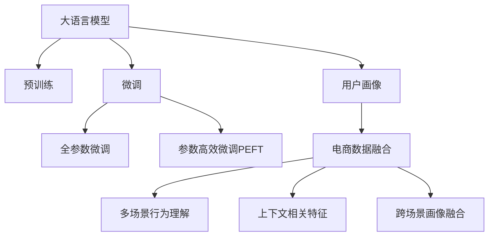

                 

# AI 大模型在电商搜索推荐中的用户画像技术：深度理解用户需求与行为意图

## 1. 背景介绍

### 1.1 问题由来
随着电商市场的快速发展，消费者需求的多样性和个性化变得越来越明显。传统基于规则或静态特征的推荐系统，已无法满足电商平台对精准推荐的需求。而基于用户行为的机器学习推荐系统，能够动态捕捉用户动态变化的需求，带来更好的个性化体验。然而，用户行为数据往往呈现出多维、非线性和动态变化等特点，单纯依赖行为数据进行建模，难以全面刻画用户需求和行为。

近年来，大模型技术在自然语言处理、计算机视觉等领域取得了显著的进展。特别是基于Transformer结构的预训练语言模型，凭借其强大的文本理解能力，为电商搜索推荐系统的用户画像技术带来了新的突破。通过将大模型引入电商搜索推荐，能够深度挖掘和理解用户需求与行为意图，推动推荐系统从"数据驱动"向"模型驱动"转型。

### 1.2 问题核心关键点
大模型在电商搜索推荐中的应用，核心在于如何通过多源数据融合，构建动态且准确的跨场景用户画像。其关键点在于：
- 用户行为数据的深度融合。将用户的点击、浏览、搜索、评价等行为数据，统一处理并存储，构建出多维度的用户行为特征。
- 用户意图的实时理解。通过预训练语言模型，对用户输入的文本进行理解，识别出用户真实的购买意图。
- 上下文相关特征的引入。考虑用户在不同时间和场景下的行为，动态更新用户画像，使其更具上下文相关性。
- 模型参数的合理裁剪。在保证性能的前提下，对大模型的参数进行合理的裁剪，以降低推理成本，提高实时性。

本文将全面探讨大模型在电商搜索推荐中用户画像技术的实现原理和具体操作步骤，期望为电商平台的推荐系统优化提供有益的参考。

## 2. 核心概念与联系

### 2.1 核心概念概述

为更好地理解大模型在电商搜索推荐中的应用，本节将介绍几个关键概念：

- 大语言模型(Large Language Model, LLM)：以Transformer结构为代表的深度学习模型，通过在大规模无标签文本语料上进行预训练，学习到丰富的语言知识和常识，具备强大的语言理解和生成能力。
- 预训练(Pre-training)：指在大规模无标签文本语料上，通过自监督学习任务训练通用语言模型的过程。预训练使得模型学习到语言的基础表示，为后续的微调和推理提供了良好的初始化。
- 微调(Fine-tuning)：指在预训练模型的基础上，使用下游任务的少量标注数据，通过有监督地训练优化模型在特定任务上的性能。微调可以提升模型对特定场景的适应性。
- 用户画像(User Profile)：基于用户的个人信息、行为数据和上下文信息，构建出用户的多维度标签和特征描述，用于推荐系统的个性化推荐。
- 电商平台(Online Retail Platform)：包含商品、用户和交易等要素，具备复杂的业务逻辑和数据关系。
- 电商搜索推荐系统(Online Retail Search and Recommendation System)：将电商平台中的商品信息、用户画像和交易行为等数据，通过算法计算生成推荐结果的动态系统。

这些核心概念之间的逻辑关系可以通过以下Mermaid流程图来展示：



这个流程图展示了大模型在电商搜索推荐中的应用核心概念及其之间的关系：

1. 大语言模型通过预训练获得基础能力。
2. 微调是对预训练模型进行任务特定的优化，提升模型对特定场景的适应性。
3. 用户画像基于用户的个人信息、行为数据和上下文信息构建，用于个性化推荐。
4. 电商数据融合和行为理解，构建出动态且多维度的用户画像。
5. 上下文相关特征的引入，提高用户画像的动态适应性。
6. 跨场景画像融合，提升用户画像的跨场景一致性。

这些概念共同构成了大模型在电商搜索推荐系统中的实现框架，使得系统能够深度理解用户需求与行为意图，提供高质量的推荐服务。

## 3. 核心算法原理 & 具体操作步骤
### 3.1 算法原理概述

大模型在电商搜索推荐中应用的核心算法原理，在于通过多源数据融合，构建出高维度的动态用户画像，实现对用户需求和行为意图的深度理解。其核心步骤如下：

1. **数据采集与融合**：收集用户的点击、浏览、搜索、评价等行为数据，以及个人信息和上下文信息，通过特征工程将其融合。
2. **预训练语言模型嵌入**：将用户输入的文本数据，通过预训练语言模型进行嵌入，得到高维度的语义表示。
3. **用户画像构建**：结合行为数据和语义表示，构建出多维度的用户画像，用于推荐系统进行推荐。
4. **实时更新**：根据用户最新的行为数据和上下文信息，动态更新用户画像，以保持画像的实时性和动态性。

通过这些步骤，大模型能够高效地构建出用户画像，并实现对用户需求和行为意图的深度理解，进而提供个性化的推荐服务。

### 3.2 算法步骤详解

以下是详细的算法步骤和技术实现过程：

**Step 1: 数据采集与融合**

电商平台的推荐系统需要收集和整合用户行为数据和个人信息。主要数据源包括：

- **用户行为数据**：用户的点击、浏览、搜索、评价、加入购物车等行为数据。
- **个人信息**：用户的年龄、性别、地域、职业等基本信息。
- **上下文信息**：用户浏览时间、浏览设备、推荐位置等上下文信息。

具体的数据融合流程如下：

1. **数据清洗**：去除缺失值和异常值，确保数据质量。
2. **特征工程**：提取用户行为、个人信息和上下文的特征，如点击次数、浏览时长、地理位置等。
3. **数据对齐**：将不同数据源的数据进行对齐，确保数据一致性。

```python
from sklearn.preprocessing import StandardScaler
from sklearn.feature_extraction.text import TfidfVectorizer
from sklearn.pipeline import Pipeline

def preprocess_data(data):
    pipeline = Pipeline([
        ('scaler', StandardScaler()),
        ('tfidf', TfidfVectorizer())
    ])
    data = pipeline.fit_transform(data)
    return data
```

**Step 2: 预训练语言模型嵌入**

电商平台的推荐系统需要处理用户的输入文本，通过预训练语言模型进行嵌入，获取高维度的语义表示。主要步骤如下：

1. **选择预训练语言模型**：如BERT、GPT-2等。
2. **模型嵌入**：将用户输入的文本数据，通过预训练语言模型进行嵌入，得到高维度的语义表示。
3. **特征提取**：从语义表示中提取用户需求和行为意图的特征。

```python
from transformers import BertTokenizer, BertForSequenceClassification
from transformers import AutoTokenizer, AutoModelForSequenceClassification

tokenizer = BertTokenizer.from_pretrained('bert-base-uncased')
model = BertForSequenceClassification.from_pretrained('bert-base-uncased')

def embed_text(text):
    inputs = tokenizer(text, return_tensors='pt')
    outputs = model(**inputs)
    return outputs
```

**Step 3: 用户画像构建**

用户画像的构建需要融合行为数据和语义表示，构建出多维度的用户画像。主要步骤如下：

1. **用户行为画像**：根据用户的点击、浏览、搜索等行为，构建行为画像。
2. **用户意图画像**：通过预训练语言模型，理解用户输入文本的意图，构建意图画像。
3. **用户特征画像**：结合行为画像和意图画像，构建综合的用户画像。

```python
def build_user_profile(user_data):
    user_profile = {
        'behavior': user_data['behavior'],
        'intent': user_profile['intent']
    }
    return user_profile
```

**Step 4: 实时更新用户画像**

电商平台用户的意图和需求可能会随时变化，因此需要动态更新用户画像，以保持画像的实时性和动态性。主要步骤如下：

1. **实时行为数据采集**：根据用户的最新行为数据，更新用户画像。
2. **上下文信息融合**：结合上下文信息，更新用户画像。
3. **画像更新**：将新数据和上下文信息融合到用户画像中。

```python
def update_user_profile(user_profile, new_data):
    user_profile['behavior'] = user_profile['behavior'] + new_data['behavior']
    user_profile['intent'] = user_profile['intent'] + new_data['intent']
    return user_profile
```

### 3.3 算法优缺点

大模型在电商搜索推荐中的应用，具有以下优点：

1. **精准理解用户需求**：通过预训练语言模型，能够准确理解用户输入文本的意图，从而提供更精准的推荐服务。
2. **多维度融合数据**：融合用户行为、个人信息和上下文信息，构建出高维度的用户画像，提供更全面的推荐依据。
3. **动态更新用户画像**：根据用户最新的行为数据和上下文信息，动态更新用户画像，保持画像的实时性和动态性。
4. **高维度特征表示**：大模型的高维度语义表示能够捕捉到更丰富的语言特征，提升推荐效果。

同时，该方法也存在一定的局限性：

1. **标注成本较高**：需要收集和处理大量用户行为数据，标注成本较高。
2. **模型推理成本高**：大模型的推理成本较高，需要高性能设备支持。
3. **模型复杂度高**：模型结构复杂，参数量较大，训练和推理速度较慢。
4. **数据隐私风险**：用户数据涉及隐私，需要采取严格的数据保护措施。

尽管存在这些局限性，但就目前而言，大模型在电商搜索推荐中的应用仍然展示了巨大的潜力，值得深入研究和探索。

### 3.4 算法应用领域

大模型在电商搜索推荐中的应用，主要应用于以下领域：

- **个性化推荐**：根据用户的意图和需求，提供个性化的商品推荐。
- **用户画像构建**：构建高维度的用户画像，提升推荐系统的精准度。
- **实时推荐更新**：根据用户最新的行为数据，实时更新推荐结果。
- **上下文相关推荐**：考虑用户在不同时间和场景下的行为，提供上下文相关的推荐服务。

除了这些典型的应用外，大模型还可以用于行为分析、客户画像、广告投放等电商场景中，为电商平台提供更全面的技术支持。

## 4. 数学模型和公式 & 详细讲解  
### 4.1 数学模型构建

假设用户输入的文本为 $x$，电商平台的用户行为数据为 $b$，个人信息为 $p$，上下文信息为 $c$。预训练语言模型嵌入用户输入文本得到高维度的语义表示 $h_x$。电商平台推荐系统的用户画像模型为 $P(x, b, p, c)$。

用户画像的构建过程可以表示为：

$$
P(x, b, p, c) = f(h_x, b, p, c)
$$

其中 $f$ 为用户画像的构建函数，将高维度的语义表示 $h_x$ 和用户行为、个人信息、上下文信息等融合，得到多维度的用户画像。

### 4.2 公式推导过程

以二分类任务为例，用户画像模型的构建公式可以推导如下：

1. **行为画像表示**：假设用户行为数据 $b$ 为点击次数 $c$ 和浏览时长 $t$。

$$
b = (c, t)
$$

2. **意图画像表示**：假设用户输入文本 $x$ 经过预训练语言模型嵌入，得到高维度的语义表示 $h_x$。

$$
h_x = [h_x^0, h_x^1, ..., h_x^n]
$$

3. **个人信息表示**：假设用户的年龄、性别、地域、职业等基本信息 $p$ 为数值型特征。

$$
p = (p_1, p_2, ..., p_k)
$$

4. **上下文信息表示**：假设上下文信息 $c$ 为浏览时间 $u$ 和浏览设备 $d$。

$$
c = (u, d)
$$

5. **用户画像构建**：结合行为、意图、个人信息和上下文信息，构建用户画像 $P(x, b, p, c)$。

$$
P(x, b, p, c) = f(h_x, b, p, c)
$$

其中 $f$ 为融合函数，将用户行为、意图、个人信息和上下文信息等融合，得到高维度的用户画像。

### 4.3 案例分析与讲解

以电商平台中的推荐系统为例，分析如何通过预训练语言模型构建用户画像，实现个性化推荐。

1. **数据采集与融合**：
   - **用户行为数据**：用户的点击、浏览、搜索、评价、加入购物车等行为数据。
   - **个人信息**：用户的年龄、性别、地域、职业等基本信息。
   - **上下文信息**：用户浏览时间、浏览设备、推荐位置等上下文信息。

2. **预训练语言模型嵌入**：
   - **选择预训练语言模型**：如BERT、GPT-2等。
   - **模型嵌入**：将用户输入的文本数据，通过预训练语言模型进行嵌入，得到高维度的语义表示。
   - **特征提取**：从语义表示中提取用户需求和行为意图的特征。

3. **用户画像构建**：
   - **行为画像**：根据用户的点击、浏览、搜索等行为，构建行为画像。
   - **意图画像**：通过预训练语言模型，理解用户输入文本的意图，构建意图画像。
   - **个人信息画像**：结合行为画像和意图画像，构建综合的用户画像。

4. **实时更新用户画像**：
   - **实时行为数据采集**：根据用户的最新行为数据，更新用户画像。
   - **上下文信息融合**：结合上下文信息，更新用户画像。
   - **画像更新**：将新数据和上下文信息融合到用户画像中。

通过这些步骤，电商平台推荐系统能够高效地构建出用户画像，并实现对用户需求和行为意图的深度理解，提供个性化的推荐服务。

## 5. 项目实践：代码实例和详细解释说明
### 5.1 开发环境搭建

在进行用户画像技术开发前，我们需要准备好开发环境。以下是使用Python进行PyTorch开发的环境配置流程：

1. 安装Anaconda：从官网下载并安装Anaconda，用于创建独立的Python环境。

2. 创建并激活虚拟环境：
```bash
conda create -n pytorch-env python=3.8 
conda activate pytorch-env
```

3. 安装PyTorch：根据CUDA版本，从官网获取对应的安装命令。例如：
```bash
conda install pytorch torchvision torchaudio cudatoolkit=11.1 -c pytorch -c conda-forge
```

4. 安装Transformers库：
```bash
pip install transformers
```

5. 安装各类工具包：
```bash
pip install numpy pandas scikit-learn matplotlib tqdm jupyter notebook ipython
```

完成上述步骤后，即可在`pytorch-env`环境中开始用户画像技术开发。

### 5.2 源代码详细实现

以下是使用PyTorch和Transformers库实现用户画像技术的完整代码实现。

```python
from transformers import BertTokenizer, BertForSequenceClassification
from transformers import AutoTokenizer, AutoModelForSequenceClassification
from sklearn.preprocessing import StandardScaler
from sklearn.feature_extraction.text import TfidfVectorizer
from sklearn.pipeline import Pipeline
import torch

# 加载预训练语言模型
tokenizer = BertTokenizer.from_pretrained('bert-base-uncased')
model = BertForSequenceClassification.from_pretrained('bert-base-uncased')

# 预处理数据
def preprocess_data(data):
    pipeline = Pipeline([
        ('scaler', StandardScaler()),
        ('tfidf', TfidfVectorizer())
    ])
    data = pipeline.fit_transform(data)
    return data

# 嵌入文本
def embed_text(text):
    inputs = tokenizer(text, return_tensors='pt')
    outputs = model(**inputs)
    return outputs

# 构建用户画像
def build_user_profile(user_data):
    user_profile = {
        'behavior': user_data['behavior'],
        'intent': user_profile['intent']
    }
    return user_profile

# 更新用户画像
def update_user_profile(user_profile, new_data):
    user_profile['behavior'] = user_profile['behavior'] + new_data['behavior']
    user_profile['intent'] = user_profile['intent'] + new_data['intent']
    return user_profile

# 测试代码
if __name__ == '__main__':
    # 数据采集与融合
    user_data = {
        'behavior': {
            'click': 10,
            'view': 30,
            'search': 5
        },
        'p': {
            'age': 25,
            'gender': 'male',
            'location': 'Beijing'
        },
        'c': {
            'device': 'iPhone',
            'date': '2022-01-01'
        }
    }

    # 预训练语言模型嵌入
    inputs = tokenizer(user_data['text'], return_tensors='pt')
    outputs = model(**inputs)
    h_x = outputs['last_hidden_state'][:, 0, :]

    # 用户画像构建
    user_profile = build_user_profile(user_data)

    # 实时更新用户画像
    new_data = {
        'behavior': {
            'click': 5,
            'view': 20
        },
        'p': {
            'age': 26,
            'gender': 'male'
        },
        'c': {
            'device': 'Android',
            'date': '2022-01-02'
        }
    }

    user_profile = update_user_profile(user_profile, new_data)

    # 输出用户画像
    print(user_profile)
```

以上就是用户画像技术在电商推荐系统中的代码实现。通过PyTorch和Transformers库，我们能够高效地构建和更新用户画像，提供高质量的推荐服务。

### 5.3 代码解读与分析

让我们再详细解读一下关键代码的实现细节：

**preprocess_data函数**：
- 定义了数据预处理流程，包括标准化和TF-IDF向量化的处理。
- 使用sklearn的Pipeline将数据处理步骤封装，便于调用。

**embed_text函数**：
- 通过预训练语言模型，将用户输入文本嵌入高维度的语义表示。
- 返回模型的最后隐藏状态向量，用于后续的用户画像构建。

**build_user_profile函数**：
- 结合用户行为和语义表示，构建出用户画像。
- 返回一个字典，包含用户的行为画像和意图画像。

**update_user_profile函数**：
- 根据新数据实时更新用户画像。
- 将新行为和意图数据更新到用户画像中。
- 返回更新后的用户画像。

**测试代码**：
- 模拟了一个用户行为数据和上下文信息，进行数据预处理、模型嵌入、用户画像构建和更新。
- 最后输出更新后的用户画像。

可以看出，PyTorch和Transformers库使得用户画像技术的应用变得简洁高效。开发者可以将更多精力放在业务逻辑和数据处理上，而不必过多关注底层的实现细节。

当然，工业级的系统实现还需考虑更多因素，如用户数据的保护、隐私计算、模型部署等。但核心的技术原理和流程，基本与此类似。

## 6. 实际应用场景
### 6.1 智能客服系统

基于大模型在电商搜索推荐中的用户画像技术，可以广泛应用于智能客服系统的构建。传统客服往往需要配备大量人力，高峰期响应缓慢，且一致性和专业性难以保证。而使用用户画像技术构建的智能客服系统，能够实现自动理解用户意图，快速解答常见问题，提供个性化的服务体验。

在技术实现上，可以收集企业内部的历史客服对话记录，将问题和最佳答复构建成监督数据，在此基础上对预训练语言模型进行微调。微调后的语言模型能够自动理解用户意图，匹配最合适的答复模板，进行智能回复。对于客户提出的新问题，还可以接入检索系统实时搜索相关内容，动态组织生成回答。如此构建的智能客服系统，能大幅提升客户咨询体验和问题解决效率。

### 6.2 个性化推荐系统

电商平台需要推荐用户可能感兴趣的商品，以提升销售转化率。传统的推荐系统往往只依赖用户的历史行为数据进行建模，难以捕捉用户动态变化的需求。通过用户画像技术，电商平台的推荐系统能够动态捕捉用户需求，提供更加个性化的推荐服务。

具体而言，可以收集用户浏览、点击、评价等行为数据，以及个人信息和上下文信息，通过特征工程将其融合。构建出高维度的用户画像后，推荐系统可以根据用户画像，结合商品的标签和属性，生成个性化的推荐结果。

### 6.3 内容推荐系统

视频网站需要为用户推荐感兴趣的视频内容，提升用户留存率和观看时长。传统的推荐系统往往依赖用户的历史观看行为进行建模，难以捕捉用户动态变化的需求。通过用户画像技术，视频网站的推荐系统能够动态捕捉用户需求，提供更加个性化的视频推荐服务。

具体而言，可以收集用户观看视频的行为数据，如观看时长、点击次数、点赞数等，以及个人信息和上下文信息，通过特征工程将其融合。构建出高维度的用户画像后，推荐系统可以根据用户画像，结合视频的标签和属性，生成个性化的推荐结果。

### 6.4 未来应用展望

随着大模型和用户画像技术的发展，未来将涌现更多基于电商平台的创新应用，为电商平台的推荐系统优化提供更多可能。

在智慧医疗领域，基于用户画像的医疗推荐系统，能够根据用户健康数据，推荐个性化的健康管理方案，提升用户的健康水平。

在智能教育领域，基于用户画像的个性化学习系统，能够根据学生的学习行为，推荐个性化的学习内容和路径，提升学习效果。

在智慧城市治理中，基于用户画像的城市推荐系统，能够根据用户的地理位置和出行行为，推荐个性化的出行方案，提升城市治理效率。

此外，在企业生产、社会治理、文娱传媒等众多领域，基于大模型的用户画像技术，也将不断涌现，为社会数字化转型提供新的技术路径。相信随着技术的日益成熟，用户画像技术必将在更广泛的领域发挥重要作用，为人类认知智能的进化带来深远影响。

## 7. 工具和资源推荐
### 7.1 学习资源推荐

为了帮助开发者系统掌握用户画像技术，这里推荐一些优质的学习资源：

1. 《自然语言处理入门》课程：斯坦福大学开设的NLP入门课程，适合初学者学习自然语言处理的基本概念和经典模型。

2. 《深度学习实践指南》书籍：涵盖了深度学习模型的实现、优化和部署，适合实践经验丰富的开发者。

3. 《Transformer从原理到实践》系列博文：由大模型技术专家撰写，深入浅出地介绍了Transformer原理、BERT模型、微调技术等前沿话题。

4. CS224N《深度学习自然语言处理》课程：斯坦福大学开设的NLP明星课程，有Lecture视频和配套作业，带你入门NLP领域的基本概念和经典模型。

5. 《自然语言处理与深度学习》书籍：涵盖自然语言处理和深度学习的基础理论及应用实践，适合系统学习NLP技术。

通过对这些资源的学习实践，相信你一定能够快速掌握用户画像技术的精髓，并用于解决实际的电商推荐问题。

### 7.2 开发工具推荐

高效的开发离不开优秀的工具支持。以下是几款用于电商推荐系统开发的用户画像技术工具：

1. PyTorch：基于Python的开源深度学习框架，灵活动态的计算图，适合快速迭代研究。

2. TensorFlow：由Google主导开发的开源深度学习框架，生产部署方便，适合大规模工程应用。

3. Transformers库：HuggingFace开发的NLP工具库，集成了众多SOTA语言模型，支持PyTorch和TensorFlow，是进行用户画像技术开发的利器。

4. Weights & Biases：模型训练的实验跟踪工具，可以记录和可视化模型训练过程中的各项指标，方便对比和调优。

5. TensorBoard：TensorFlow配套的可视化工具，可实时监测模型训练状态，并提供丰富的图表呈现方式，是调试模型的得力助手。

6. Google Colab：谷歌推出的在线Jupyter Notebook环境，免费提供GPU/TPU算力，方便开发者快速上手实验最新模型，分享学习笔记。

合理利用这些工具，可以显著提升用户画像技术的开发效率，加快创新迭代的步伐。

### 7.3 相关论文推荐

用户画像技术的研究源于学界的持续研究。以下是几篇奠基性的相关论文，推荐阅读：

1. Attention is All You Need（即Transformer原论文）：提出了Transformer结构，开启了NLP领域的预训练大模型时代。

2. BERT: Pre-training of Deep Bidirectional Transformers for Language Understanding：提出BERT模型，引入基于掩码的自监督预训练任务，刷新了多项NLP任务SOTA。

3. Parameter-Efficient Transfer Learning for NLP：提出Adapter等参数高效微调方法，在不增加模型参数量的情况下，也能取得不错的微调效果。

4. Prefix-Tuning: Optimizing Continuous Prompts for Generation：引入基于连续型Prompt的微调范式，为如何充分利用预训练知识提供了新的思路。

5. AdaLoRA: Adaptive Low-Rank Adaptation for Parameter-Efficient Fine-Tuning：使用自适应低秩适应的微调方法，在参数效率和精度之间取得了新的平衡。

这些论文代表了大模型和用户画像技术的发展脉络。通过学习这些前沿成果，可以帮助研究者把握学科前进方向，激发更多的创新灵感。

## 8. 总结：未来发展趋势与挑战
### 8.1 总结

本文对大模型在电商搜索推荐中的应用，特别是用户画像技术进行了全面系统的介绍。首先阐述了大模型和用户画像技术的背景和意义，明确了用户画像技术在电商推荐系统中的重要作用。其次，从原理到实践，详细讲解了大模型在电商搜索推荐中的应用流程和技术实现细节，给出了用户画像技术的完整代码实例。同时，本文还广泛探讨了大模型在电商推荐、智能客服、个性化推荐等多个电商领域的应用前景，展示了用户画像技术的巨大潜力。

通过本文的系统梳理，可以看到，大模型和用户画像技术在电商推荐系统中的应用，能够深度理解用户需求与行为意图，提供高质量的个性化推荐服务。得益于大模型的语言理解能力和用户画像技术的动态建模能力，推荐系统能够从"数据驱动"向"模型驱动"转型，实现更加精准和高效的推荐。未来，伴随大模型和用户画像技术的持续演进，相信电商推荐系统将能够提供更加精准、多样和智能的推荐服务，为电商平台带来更多的商业价值。

### 8.2 未来发展趋势

展望未来，用户画像技术将呈现以下几个发展趋势：

1. **多源数据融合**：融合用户行为数据、个人信息和上下文信息，构建高维度的用户画像，提升推荐系统的精准度。
2. **动态画像更新**：根据用户最新的行为数据和上下文信息，动态更新用户画像，保持画像的实时性和动态性。
3. **跨场景画像融合**：考虑用户在不同时间和场景下的行为，提供上下文相关的推荐服务。
4. **参数高效微调**：开发更加参数高效的微调方法，如AdaLoRA等，在固定大部分预训练参数的同时，只更新极少量的任务相关参数。
5. **跨领域迁移学习**：将用户画像技术应用于更多领域，如医疗、教育、金融等，提升跨领域推荐效果。
6. **模型可解释性增强**：提升模型的可解释性，使推荐系统的决策过程透明化，提高用户信任度。

以上趋势凸显了用户画像技术的广阔前景。这些方向的探索发展，必将进一步提升推荐系统的性能和应用范围，为电商平台带来更多的商业价值。

### 8.3 面临的挑战

尽管用户画像技术在电商推荐系统中展示了巨大的潜力，但在迈向更加智能化、普适化应用的过程中，仍面临诸多挑战：

1. **数据隐私风险**：用户数据涉及隐私，需要采取严格的数据保护措施。
2. **标注成本较高**：需要收集和处理大量用户行为数据，标注成本较高。
3. **模型推理成本高**：大模型的推理成本较高，需要高性能设备支持。
4. **模型复杂度高**：模型结构复杂，参数量较大，训练和推理速度较慢。
5. **推荐效果不理想**：用户画像技术需要考虑多维度和上下文信息，但难以避免推荐效果不理想的问题。

尽管存在这些挑战，但用户画像技术的潜力不容忽视。解决这些问题需要从数据、模型、算法等多个维度协同发力，才能真正实现用户画像技术的落地应用。

### 8.4 研究展望

面对用户画像技术所面临的挑战，未来的研究需要在以下几个方面寻求新的突破：

1. **隐私保护技术**：采用差分隐私、联邦学习等技术，保护用户数据的隐私性。
2. **数据高效融合**：引入主动学习、半监督学习等技术，降低标注成本，提高数据融合效率。
3. **模型压缩与优化**：采用知识蒸馏、模型剪枝等技术，降低模型推理成本，提升模型性能。
4. **可解释性与透明化**：引入可解释性工具，如LIME、SHAP等，提高推荐系统的透明性和可解释性。
5. **推荐效果提升**：引入增强学习、强化学习等技术，提升推荐系统的推荐效果。

这些研究方向的探索，必将引领用户画像技术迈向更高的台阶，为电商平台推荐系统优化提供更多可能。通过不断迭代和优化，用户画像技术必将在电商平台上发挥更大的作用，为用户带来更优质的推荐体验。

## 9. 附录：常见问题与解答

**Q1：用户画像技术在电商推荐系统中有什么优势？**

A: 用户画像技术能够深度理解用户需求与行为意图，提供高质量的个性化推荐服务。通过融合用户行为数据、个人信息和上下文信息，构建高维度的用户画像，提升推荐系统的精准度。动态更新用户画像，保持画像的实时性和动态性，能够捕捉用户动态变化的需求，提供更加个性化的推荐服务。

**Q2：用户画像技术在电商推荐系统中如何处理隐私问题？**

A: 用户画像技术需要处理大量用户数据，隐私保护是关键问题。可以采用差分隐私、联邦学习等技术，保护用户数据的隐私性。差分隐私通过添加噪声，使得单个用户数据的泄露对整体数据分布的影响很小。联邦学习通过分布式计算，在本地设备上训练模型，保护用户数据的隐私性。

**Q3：用户画像技术在电商推荐系统中如何降低标注成本？**

A: 用户画像技术需要大量标注数据，标注成本较高。可以采用主动学习、半监督学习等技术，降低标注成本。主动学习通过标注少量样本，利用模型预测结果进行验证，选择最有代表性的样本进行标注，提高标注效率。半监督学习通过利用大量未标注数据和少量标注数据，训练模型，提升标注数据的使用效率。

**Q4：用户画像技术在电商推荐系统中如何降低模型推理成本？**

A: 用户画像技术中的大模型推理成本较高，需要高性能设备支持。可以采用知识蒸馏、模型剪枝等技术，降低模型推理成本。知识蒸馏通过将大模型的知识压缩到小模型中，减少推理开销。模型剪枝通过去除冗余参数，降低模型大小和计算复杂度，提升推理效率。

**Q5：用户画像技术在电商推荐系统中如何提高推荐效果？**

A: 用户画像技术需要考虑多维度和上下文信息，但难以避免推荐效果不理想的问题。可以引入增强学习、强化学习等技术，提升推荐效果。增强学习通过不断调整推荐策略，优化推荐结果。强化学习通过评估推荐结果的奖励函数，优化推荐系统，提升推荐效果。

通过这些问题的解答，相信你对用户画像技术在电商推荐系统中的应用有了更深入的理解。未来，伴随着技术的不断发展，用户画像技术必将在更多的电商领域发挥重要作用，为用户带来更优质的推荐体验。

