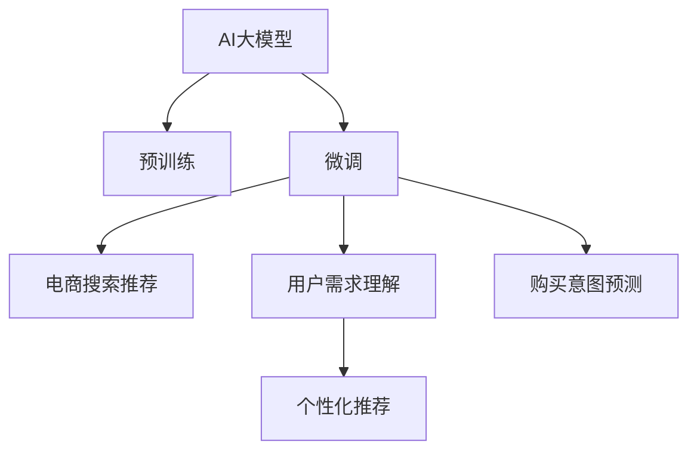

                 

# AI 大模型在电商搜索推荐中的用户行为分析：理解用户需求与购买意图

> 关键词：大模型, 用户行为分析, 电商搜索推荐, 用户需求, 购买意图, 深度学习, 推荐系统, 电商营销, 点击率预测

## 1. 背景介绍

### 1.1 问题由来

在现代社会，电子商务正成为人们日常生活不可或缺的一部分。伴随着网络技术的飞速发展和在线购物场景的日益丰富，电商平台的搜索推荐系统也在不断演进，以期在用户海量数据中精准预测用户需求，优化搜索体验，提升用户购物效率。传统的推荐算法，如协同过滤、基于内容的推荐，已无法满足现代电商用户的个性化需求。

近年来，随着深度学习技术的突破，AI大模型被广泛应用到电商搜索推荐系统中。通过在大规模数据上预训练，AI大模型具备强大的模式识别和推理能力，能够更好地捕捉用户行为模式，预测用户行为，从而提供更加精准的推荐服务。

### 1.2 问题核心关键点

为了利用AI大模型更高效地进行电商搜索推荐，理解用户需求和购买意图是核心关键点：

- **用户需求理解**：通过分析用户的搜索行为、浏览历史、点击行为等，识别用户的真实需求和兴趣，进而提供相关性更高的搜索结果。
- **购买意图预测**：预测用户查看产品详情页后的购买行为，如加入购物车、下单购买等，提升点击转化率。
- **个性化推荐**：针对每个用户进行个性化定制，推送符合其需求和偏好的商品，提升用户满意度。

## 2. 核心概念与联系

### 2.1 核心概念概述

为更好地理解AI大模型在电商搜索推荐中的应用，本节将介绍几个关键概念：

- **AI大模型**：以深度学习为基础，通过在大规模数据上预训练得到的模型。常见的模型包括BERT、GPT、DALL-E等。
- **预训练**：在大规模无标签数据上，通过自监督学习任务训练大模型，使其学习到通用语言表示。
- **微调(Fine-tuning)**：在大模型预训练的基础上，使用有标签的数据集对其进行特定任务优化，提升模型在特定任务上的表现。
- **深度学习**：一种基于多层神经网络的机器学习技术，适用于复杂的数据处理和模式识别。
- **推荐系统**：使用各种算法推荐用户感兴趣的产品或内容，提升用户体验的系统。
- **点击率预测**：通过机器学习算法，预测用户点击某个链接的概率，优化搜索结果展示。

这些概念之间的联系可以通过以下Mermaid流程图来展示：



这个流程图展示了大模型与电商推荐系统的核心概念及其之间的关系：

1. AI大模型通过预训练获得基础能力。
2. 微调在大模型的基础上进行特定任务优化，包括用户需求理解和购买意图预测。
3. 电商搜索推荐系统通过微调后的模型，提供个性化定制的推荐服务。

## 3. 核心算法原理 & 具体操作步骤
### 3.1 算法原理概述

AI大模型在电商搜索推荐中的应用，核心在于通过深度学习和自然语言处理技术，分析用户行为数据，预测用户需求和购买意图，从而提供更加精准的个性化推荐。具体来说，包括以下几个步骤：

1. **用户行为数据收集**：收集用户搜索、浏览、点击、购买等行为数据，构建数据集。
2. **预训练大模型**：在大规模语料库上预训练大模型，学习通用语言表示。
3. **任务微调**：在电商搜索推荐相关任务上微调预训练模型，提升其性能。
4. **用户需求分析**：通过分析用户搜索历史和浏览行为，提取用户兴趣点和需求。
5. **购买意图预测**：利用微调后的模型，预测用户查看商品详情页后的购买行为。
6. **个性化推荐**：根据用户需求和购买意图，提供个性化推荐，提升用户体验。

### 3.2 算法步骤详解

以下是基于AI大模型的电商搜索推荐系统的详细操作步骤：

**Step 1: 数据准备与预处理**

1. **数据收集**：收集用户搜索、浏览、点击、购买等行为数据，构建电商行为数据集。
2. **数据清洗**：去除缺失、噪声和异常值，确保数据质量。
3. **特征工程**：设计合适的特征表示，如文本特征、行为特征等。
4. **数据划分**：将数据集划分为训练集、验证集和测试集，进行交叉验证。

**Step 2: 选择预训练模型**

1. **模型选择**：选择合适的预训练大模型，如BERT、GPT等。
2. **模型加载**：加载预训练模型，设置超参数，包括学习率、批量大小等。

**Step 3: 微调模型**

1. **任务适配**：根据电商搜索推荐任务的特点，设计合适的任务适配层和损失函数。
2. **微调流程**：使用训练集对模型进行微调，使用验证集进行超参数调优。
3. **模型保存**：保存微调后的模型，便于后续推理和优化。

**Step 4: 用户行为分析**

1. **用户行为特征提取**：提取用户的搜索行为、浏览行为、点击行为等特征。
2. **用户兴趣建模**：利用深度学习模型，对用户行为数据进行建模，提取用户兴趣点和需求。
3. **用户需求分析**：通过分析用户搜索历史和浏览行为，识别用户的真实需求。

**Step 5: 购买意图预测**

1. **模型输入准备**：将用户行为数据作为模型的输入。
2. **模型预测**：利用微调后的模型，预测用户查看商品详情页后的购买行为。
3. **结果评估**：在测试集上评估模型预测效果，对比微调前后的精度提升。

**Step 6: 个性化推荐**

1. **推荐生成**：根据用户需求和购买意图，生成个性化推荐列表。
2. **推荐排序**：使用推荐排序算法，对推荐列表进行排序。
3. **推荐展示**：将推荐结果展示给用户，提升用户体验。

### 3.3 算法优缺点

基于AI大模型的电商搜索推荐系统具有以下优点：

1. **高精度预测**：通过预训练和微调，大模型能够精准预测用户需求和购买意图，提升推荐精度。
2. **鲁棒性强**：大模型具备较强的泛化能力，能够在不同用户和场景下保持稳定性能。
3. **可解释性差**：大模型通常是"黑盒"模型，难以解释其内部工作机制和决策逻辑。
4. **计算成本高**：大规模大模型的推理计算资源消耗大，需要高性能硬件支持。

同时，该方法也存在一定的局限性：

1. **数据依赖强**：电商搜索推荐系统的性能依赖于高质量的电商数据，数据质量低会影响模型效果。
2. **隐私风险高**：电商行为数据涉及用户隐私，需注意数据安全和隐私保护。
3. **模型复杂度高**：大模型结构复杂，参数众多，训练和推理成本高。
4. **模型更新慢**：大模型更新频率慢，难以快速响应市场变化。

尽管存在这些局限性，但就目前而言，基于大模型的电商搜索推荐系统仍然是电子商务领域最为先进和有效的推荐技术。

### 3.4 算法应用领域

AI大模型在电商搜索推荐中的应用已经取得了显著成果，广泛用于各类电商场景中，例如：

- **商品推荐**：基于用户搜索历史和浏览行为，推荐用户可能感兴趣的商品。
- **活动推荐**：在特定节假日或促销活动期间，推荐用户可能感兴趣的商品或优惠活动。
- **个性化搜索**：根据用户的搜索行为和历史数据，提供个性化的搜索结果，提升搜索体验。
- **营销推荐**：通过分析用户行为数据，推荐用户可能感兴趣的广告或推广内容。
- **内容推荐**：在商品详情页中，推荐与商品相关的产品或内容，提升用户停留时间。

除了这些经典应用外，大模型在电商搜索推荐领域还有更多创新性应用，如可控文本生成、虚拟试穿等，为电商技术带来了新的突破。

## 4. 数学模型和公式 & 详细讲解 & 举例说明

### 4.1 数学模型构建

本节将使用数学语言对基于AI大模型的电商搜索推荐系统进行更加严格的刻画。

记用户行为数据为 $D=\{(x_i,y_i)\}_{i=1}^N, x_i \in \mathbb{R}^d, y_i \in \{0,1\}$，其中 $x_i$ 表示用户行为数据，$y_i$ 表示用户行为是否发生（如点击、购买等）。

定义电商搜索推荐任务的损失函数为：

$$
\mathcal{L}(\theta) = -\frac{1}{N} \sum_{i=1}^N y_i \log M_{\theta}(x_i)
$$

其中 $M_{\theta}$ 为预训练后的大模型，$\theta$ 为模型参数。目标是优化参数 $\theta$，使得模型在电商搜索推荐任务上的预测准确度最高。

### 4.2 公式推导过程

以点击率预测为例，对模型进行详细推导：

假设用户行为数据 $x$ 表示用户点击了某个产品详情页，模型预测的点击概率为 $\hat{y}=M_{\theta}(x)$。则点击率预测的任务损失函数为：

$$
\ell(M_{\theta}(x),y) = -y\log \hat{y}
$$

将损失函数代入经验风险公式：

$$
\mathcal{L}(\theta) = -\frac{1}{N} \sum_{i=1}^N \ell(M_{\theta}(x_i),y_i)
$$

对损失函数求偏导，得到梯度更新公式：

$$
\frac{\partial \mathcal{L}(\theta)}{\partial \theta_k} = \frac{1}{N} \sum_{i=1}^N -y_i \frac{\partial M_{\theta}(x_i)}{\partial \theta_k}
$$

其中 $\frac{\partial M_{\theta}(x_i)}{\partial \theta_k}$ 为模型的导数，可以通过反向传播算法计算。

### 4.3 案例分析与讲解

以下是一个简单的电商搜索推荐系统的实现案例：

假设某电商平台有A、B、C三款产品，用户对每款产品可能点击也可能不点击。假设有5个用户，他们的行为数据如下：

| 用户ID | 产品ID | 点击行为 | 真实点击行为 |
|--------|--------|----------|-------------|
| 1      | A      | 点击     | 点击         |
| 1      | B      | 不点击   | 不点击       |
| 1      | C      | 不点击   | 不点击       |
| 2      | A      | 点击     | 点击         |
| 2      | B      | 点击     | 点击         |

将用户行为数据输入微调后的模型 $M_{\theta}$，输出预测的点击概率，并对损失函数求偏导，得到梯度更新公式：

$$
\frac{\partial \mathcal{L}(\theta)}{\partial \theta_k} = \frac{1}{5} \left[ (-1) \frac{\partial M_{\theta}(A)}{\partial \theta_k} + 1 \frac{\partial M_{\theta}(B)}{\partial \theta_k} + 0 \frac{\partial M_{\theta}(C)}{\partial \theta_k} \right]
$$

将训练集中的所有数据代入梯度更新公式，得到参数 $\theta$ 的更新方向。通过不断迭代，最小化损失函数 $\mathcal{L}(\theta)$，直到模型收敛。

## 5. 项目实践：代码实例和详细解释说明
### 5.1 开发环境搭建

在进行电商搜索推荐系统的微调实践前，我们需要准备好开发环境。以下是使用Python进行PyTorch开发的环境配置流程：

1. 安装Anaconda：从官网下载并安装Anaconda，用于创建独立的Python环境。

2. 创建并激活虚拟环境：
```bash
conda create -n ecommerce-env python=3.8 
conda activate ecommerce-env
```

3. 安装PyTorch：根据CUDA版本，从官网获取对应的安装命令。例如：
```bash
conda install pytorch torchvision torchaudio cudatoolkit=11.1 -c pytorch -c conda-forge
```

4. 安装Transformers库：
```bash
pip install transformers
```

5. 安装各类工具包：
```bash
pip install numpy pandas scikit-learn matplotlib tqdm jupyter notebook ipython
```

完成上述步骤后，即可在`ecommerce-env`环境中开始微调实践。

### 5.2 源代码详细实现

下面我们以点击率预测任务为例，给出使用Transformers库对BERT模型进行微调的PyTorch代码实现。

首先，定义点击率预测任务的数据处理函数：

```python
from transformers import BertTokenizer
from torch.utils.data import Dataset
import torch

class ClickThroughDataset(Dataset):
    def __init__(self, texts, clicks, tokenizer, max_len=128):
        self.texts = texts
        self.clicks = clicks
        self.tokenizer = tokenizer
        self.max_len = max_len
        
    def __len__(self):
        return len(self.texts)
    
    def __getitem__(self, item):
        text = self.texts[item]
        click = self.clicks[item]
        
        encoding = self.tokenizer(text, return_tensors='pt', max_length=self.max_len, padding='max_length', truncation=True)
        input_ids = encoding['input_ids'][0]
        attention_mask = encoding['attention_mask'][0]
        
        # 对token-wise的标签进行编码
        encoded_click = click
        encoded_click.extend([0.] * (self.max_len - len(encoded_click)))
        labels = torch.tensor(encoded_click, dtype=torch.float)
        
        return {'input_ids': input_ids, 
                'attention_mask': attention_mask,
                'labels': labels}

# 点击标签编码
label2id = {True: 1, False: 0}
id2label = {v: k for k, v in label2id.items()}

# 创建dataset
tokenizer = BertTokenizer.from_pretrained('bert-base-cased')

train_dataset = ClickThroughDataset(train_texts, train_clicks, tokenizer)
dev_dataset = ClickThroughDataset(dev_texts, dev_clicks, tokenizer)
test_dataset = ClickThroughDataset(test_texts, test_clicks, tokenizer)
```

然后，定义模型和优化器：

```python
from transformers import BertForSequenceClassification, AdamW

model = BertForSequenceClassification.from_pretrained('bert-base-cased', num_labels=2)

optimizer = AdamW(model.parameters(), lr=2e-5)
```

接着，定义训练和评估函数：

```python
from torch.utils.data import DataLoader
from tqdm import tqdm
from sklearn.metrics import roc_auc_score

device = torch.device('cuda') if torch.cuda.is_available() else torch.device('cpu')
model.to(device)

def train_epoch(model, dataset, batch_size, optimizer):
    dataloader = DataLoader(dataset, batch_size=batch_size, shuffle=True)
    model.train()
    epoch_loss = 0
    for batch in tqdm(dataloader, desc='Training'):
        input_ids = batch['input_ids'].to(device)
        attention_mask = batch['attention_mask'].to(device)
        labels = batch['labels'].to(device)
        model.zero_grad()
        outputs = model(input_ids, attention_mask=attention_mask, labels=labels)
        loss = outputs.loss
        epoch_loss += loss.item()
        loss.backward()
        optimizer.step()
    return epoch_loss / len(dataloader)

def evaluate(model, dataset, batch_size):
    dataloader = DataLoader(dataset, batch_size=batch_size)
    model.eval()
    preds, labels = [], []
    with torch.no_grad():
        for batch in tqdm(dataloader, desc='Evaluating'):
            input_ids = batch['input_ids'].to(device)
            attention_mask = batch['attention_mask'].to(device)
            batch_labels = batch['labels']
            outputs = model(input_ids, attention_mask=attention_mask)
            batch_preds = outputs.logits.sigmoid().to('cpu').tolist()
            batch_labels = batch_labels.to('cpu').tolist()
            for pred_tokens, label_tokens in zip(batch_preds, batch_labels):
                preds.append(pred_tokens)
                labels.append(label_tokens)
                
    print('AUC:', roc_auc_score(labels, preds))
```

最后，启动训练流程并在测试集上评估：

```python
epochs = 5
batch_size = 16

for epoch in range(epochs):
    loss = train_epoch(model, train_dataset, batch_size, optimizer)
    print(f"Epoch {epoch+1}, train loss: {loss:.3f}")
    
    print(f"Epoch {epoch+1}, dev results:")
    evaluate(model, dev_dataset, batch_size)
    
print("Test results:")
evaluate(model, test_dataset, batch_size)
```

以上就是使用PyTorch对BERT进行点击率预测任务的微调完整代码实现。可以看到，得益于Transformers库的强大封装，我们可以用相对简洁的代码完成BERT模型的加载和微调。

### 5.3 代码解读与分析

让我们再详细解读一下关键代码的实现细节：

**ClickThroughDataset类**：
- `__init__`方法：初始化文本、点击标签、分词器等关键组件。
- `__len__`方法：返回数据集的样本数量。
- `__getitem__`方法：对单个样本进行处理，将文本输入编码为token ids，将点击标签编码为数字，并对其进行定长padding，最终返回模型所需的输入。

**label2id和id2label字典**：
- 定义了点击标签与数字id之间的映射关系，用于将模型预测结果解码回真实的标签。

**训练和评估函数**：
- 使用PyTorch的DataLoader对数据集进行批次化加载，供模型训练和推理使用。
- 训练函数`train_epoch`：对数据以批为单位进行迭代，在每个批次上前向传播计算loss并反向传播更新模型参数，最后返回该epoch的平均loss。
- 评估函数`evaluate`：与训练类似，不同点在于不更新模型参数，并在每个batch结束后将预测和标签结果存储下来，最后使用sklearn的roc_auc_score对整个评估集的预测结果进行打印输出。

**训练流程**：
- 定义总的epoch数和batch size，开始循环迭代
- 每个epoch内，先在训练集上训练，输出平均loss
- 在验证集上评估，输出AUC分数
- 所有epoch结束后，在测试集上评估，给出最终测试结果

可以看到，PyTorch配合Transformers库使得BERT微调的代码实现变得简洁高效。开发者可以将更多精力放在数据处理、模型改进等高层逻辑上，而不必过多关注底层的实现细节。

当然，工业级的系统实现还需考虑更多因素，如模型的保存和部署、超参数的自动搜索、更灵活的任务适配层等。但核心的微调范式基本与此类似。

## 6. 实际应用场景
### 6.1 智能客服系统

基于AI大模型的电商搜索推荐系统，可以应用于智能客服系统的构建。传统客服往往需要配备大量人力，高峰期响应缓慢，且一致性和专业性难以保证。而使用微调后的推荐模型，可以7x24小时不间断服务，快速响应客户咨询，用自然流畅的语言解答各类常见问题。

在技术实现上，可以收集企业内部的历史客服对话记录，将问题和最佳答复构建成监督数据，在此基础上对预训练推荐模型进行微调。微调后的推荐模型能够自动理解用户意图，匹配最合适的答复模板进行回复。对于客户提出的新问题，还可以接入检索系统实时搜索相关内容，动态组织生成回答。如此构建的智能客服系统，能大幅提升客户咨询体验和问题解决效率。

### 6.2 个性化推荐

基于AI大模型的电商搜索推荐系统，可以广泛应用于个性化推荐服务中。通过分析用户的搜索历史和点击行为，推荐符合其兴趣和需求的商品，提升用户体验和满意度。

在具体实现上，可以构建用户行为图，利用图神经网络对用户行为进行建模。然后对用户行为图进行嵌入表示，利用微调后的模型预测用户对商品节点的点击概率。最后根据点击概率排序推荐商品，提升推荐效果。

### 6.3 未来应用展望

随着AI大模型的不断发展，基于电商搜索推荐系统的应用也将更加多样和高效：

1. **跨模态推荐**：结合图像、视频等多模态数据，提供更加丰富的推荐服务。
2. **实时推荐**：通过流式计算和增量学习，实时更新推荐模型，提升推荐精度。
3. **个性化广告**：利用推荐系统，精准推送广告内容，提升广告效果。
4. **内容创作**：通过分析用户行为数据，自动生成推荐内容和商品描述，提升电商平台的内容质量。
5. **风控检测**：利用推荐系统的用户行为数据，检测和防范欺诈行为，保护电商平台的利益。

这些应用将进一步推动电商行业的智能化发展，为用户带来更好的购物体验。未来，伴随AI大模型的进一步突破，基于电商搜索推荐系统的应用也将更加广泛和深入。

## 7. 工具和资源推荐
### 7.1 学习资源推荐

为了帮助开发者系统掌握AI大模型在电商搜索推荐中的应用，这里推荐一些优质的学习资源：

1. 《深度学习与推荐系统实战》书籍：系统讲解深度学习在推荐系统中的应用，包括电商搜索推荐等。
2. 《Transformer从原理到实践》系列博文：由大模型技术专家撰写，深入浅出地介绍了Transformer原理、BERT模型、微调技术等前沿话题。
3. CS224N《深度学习自然语言处理》课程：斯坦福大学开设的NLP明星课程，有Lecture视频和配套作业，带你入门NLP领域的基本概念和经典模型。
4. 《Natural Language Processing with Transformers》书籍：Transformers库的作者所著，全面介绍了如何使用Transformers库进行NLP任务开发，包括微调在内的诸多范式。
5. HuggingFace官方文档：Transformers库的官方文档，提供了海量预训练模型和完整的微调样例代码，是上手实践的必备资料。

通过对这些资源的学习实践，相信你一定能够快速掌握AI大模型在电商搜索推荐中的应用，并用于解决实际的电商问题。

### 7.2 开发工具推荐

高效的开发离不开优秀的工具支持。以下是几款用于AI大模型微调开发的常用工具：

1. PyTorch：基于Python的开源深度学习框架，灵活动态的计算图，适合快速迭代研究。大部分预训练语言模型都有PyTorch版本的实现。
2. TensorFlow：由Google主导开发的开源深度学习框架，生产部署方便，适合大规模工程应用。同样有丰富的预训练语言模型资源。
3. Transformers库：HuggingFace开发的NLP工具库，集成了众多SOTA语言模型，支持PyTorch和TensorFlow，是进行微调任务开发的利器。
4. Weights & Biases：模型训练的实验跟踪工具，可以记录和可视化模型训练过程中的各项指标，方便对比和调优。与主流深度学习框架无缝集成。
5. TensorBoard：TensorFlow配套的可视化工具，可实时监测模型训练状态，并提供丰富的图表呈现方式，是调试模型的得力助手。
6. Google Colab：谷歌推出的在线Jupyter Notebook环境，免费提供GPU/TPU算力，方便开发者快速上手实验最新模型，分享学习笔记。

合理利用这些工具，可以显著提升AI大模型微调任务的开发效率，加快创新迭代的步伐。

### 7.3 相关论文推荐

AI大模型在电商搜索推荐领域的研究也在不断进展，以下是几篇奠基性的相关论文，推荐阅读：

1. Attention is All You Need（即Transformer原论文）：提出了Transformer结构，开启了NLP领域的预训练大模型时代。
2. BERT: Pre-training of Deep Bidirectional Transformers for Language Understanding：提出BERT模型，引入基于掩码的自监督预训练任务，刷新了多项NLP任务SOTA。
3. Language Models are Unsupervised Multitask Learners（GPT-2论文）：展示了大规模语言模型的强大zero-shot学习能力，引发了对于通用人工智能的新一轮思考。
4. Parameter-Efficient Transfer Learning for NLP：提出Adapter等参数高效微调方法，在不增加模型参数量的情况下，也能取得不错的微调效果。
5. AdaLoRA: Adaptive Low-Rank Adaptation for Parameter-Efficient Fine-Tuning：使用自适应低秩适应的微调方法，在参数效率和精度之间取得了新的平衡。
6. MASS: Masked Sequence to Sequence Pre-training for Language Generation：提出掩码序列到序列预训练方法，利用掩码自监督学习，提升语言生成模型的效果。

这些论文代表了大模型在电商搜索推荐领域的研究进展。通过学习这些前沿成果，可以帮助研究者把握学科前进方向，激发更多的创新灵感。

## 8. 总结：未来发展趋势与挑战
### 8.1 总结

本文对基于AI大模型的电商搜索推荐系统进行了全面系统的介绍。首先阐述了电商搜索推荐系统的发展背景和研究意义，明确了AI大模型在其中的核心作用。其次，从原理到实践，详细讲解了电商搜索推荐系统的数学原理和关键步骤，给出了微调任务开发的完整代码实例。同时，本文还广泛探讨了电商搜索推荐系统的实际应用场景，展示了AI大模型的强大应用潜力。此外，本文精选了电商搜索推荐系统的各类学习资源，力求为读者提供全方位的技术指引。

通过本文的系统梳理，可以看到，基于AI大模型的电商搜索推荐系统正在成为电商搜索推荐领域的重要技术手段，极大地拓展了电商搜索推荐系统的应用边界，提升了用户体验和电商平台的转化率。未来，伴随AI大模型的进一步突破，基于电商搜索推荐系统的应用也将更加广泛和深入。

### 8.2 未来发展趋势

展望未来，AI大模型在电商搜索推荐领域将呈现以下几个发展趋势：

1. **多模态融合**：结合图像、视频、语音等多模态数据，提供更加丰富的推荐服务。
2. **实时推荐**：通过流式计算和增量学习，实时更新推荐模型，提升推荐精度。
3. **个性化广告**：利用推荐系统，精准推送广告内容，提升广告效果。
4. **内容创作**：通过分析用户行为数据，自动生成推荐内容和商品描述，提升电商平台的内容质量。
5. **风控检测**：利用推荐系统的用户行为数据，检测和防范欺诈行为，保护电商平台的利益。

这些趋势凸显了AI大模型在电商搜索推荐领域的广阔前景。这些方向的探索发展，必将进一步提升电商搜索推荐系统的性能和应用范围，为用户带来更好的购物体验。

### 8.3 面临的挑战

尽管AI大模型在电商搜索推荐系统中已经取得了显著成果，但在迈向更加智能化、普适化应用的过程中，它仍面临着诸多挑战：

1. **数据依赖强**：电商搜索推荐系统的性能依赖于高质量的电商数据，数据质量低会影响模型效果。
2. **隐私风险高**：电商行为数据涉及用户隐私，需注意数据安全和隐私保护。
3. **模型复杂度高**：AI大模型结构复杂，参数众多，训练和推理成本高。
4. **模型更新慢**：AI大模型更新频率慢，难以快速响应市场变化。

尽管存在这些局限性，但就目前而言，基于AI大模型的电商搜索推荐系统仍然是电子商务领域最为先进和有效的推荐技术。

### 8.4 研究展望

未来的研究需要在以下几个方面寻求新的突破：

1. **数据增强**：利用生成对抗网络、数据扩充等技术，生成更多高质量电商数据，提升模型效果。
2. **跨模态学习**：研究多模态数据的联合表示和推理，提升推荐系统的综合能力。
3. **个性化推荐**：结合用户画像、行为数据等多维度信息，提供更加精准的个性化推荐。
4. **实时推荐系统**：研究增量学习、流式计算等技术，实现实时更新的推荐系统。
5. **用户隐私保护**：利用差分隐私、联邦学习等技术，保护用户隐私，提升数据安全。

这些研究方向的探索，必将引领AI大模型在电商搜索推荐领域的进一步突破，为用户带来更好的电商体验。总之，基于AI大模型的电商搜索推荐系统需要不断优化数据、模型和算法，方能真正实现个性化推荐，提升电商平台的业务价值。

## 9. 附录：常见问题与解答

**Q1：AI大模型微调需要哪些硬件资源？**

A: AI大模型的微调通常需要高性能的GPU或TPU硬件支持，以便进行大规模计算。具体来说，需要以下硬件资源：

1. **GPU或TPU**：用于加速模型的前向传播和反向传播。
2. **大容量内存**：用于存储模型参数和中间计算结果。
3. **高计算带宽**：用于加速数据的读入和写出的速度。

合理配置这些硬件资源，可以显著提升AI大模型微调的效率和精度。

**Q2：AI大模型微调的时间成本如何？**

A: AI大模型微调的时间成本主要取决于以下几个因素：

1. **数据量大小**：数据集越大，微调所需时间越长。
2. **模型复杂度**：模型参数越多，微调所需时间越长。
3. **训练轮数**：训练轮数越多，微调所需时间越长。
4. **硬件配置**：GPU或TPU的计算能力和内存容量越高，微调所需时间越短。

合理配置数据、模型和硬件资源，可以显著降低AI大模型微调的时间成本。

**Q3：AI大模型微调有哪些常见的优化技巧？**

A: 为了提高AI大模型微调的效率和精度，可以采用以下优化技巧：

1. **梯度累积**：将多个小批量梯度进行累加，增加单个批次中的计算量，提升硬件利用率。
2. **混合精度训练**：使用混合精度计算，减少计算精度，提高计算效率。
3. **学习率调度**：采用自适应学习率调度算法，如AdamW，根据模型状态动态调整学习率。
4. **模型裁剪**：去除不必要的层和参数，减小模型尺寸，加快推理速度。
5. **知识蒸馏**：利用预训练模型对微调模型进行知识蒸馏，提高微调模型的泛化能力。
6. **数据增强**：通过数据扩充、数据生成等技术，增强数据的多样性，提升模型泛化能力。

这些优化技巧可以显著提升AI大模型微调的效率和精度，值得开发者在实际应用中加以利用。

**Q4：AI大模型微调的效果如何评估？**

A: 评估AI大模型微调的效果，通常采用以下指标：

1. **精度**：利用各种评估指标，如准确率、召回率、F1分数等，评估模型的预测效果。
2. **AUC**：利用AUC指标评估模型的二分类效果，反映模型区分正负样本的能力。
3. **覆盖率**：评估模型对不同类别样本的覆盖能力，反映模型的泛化能力。
4. **转化率**：评估模型对用户行为的预测效果，反映模型的实际应用效果。
5. **时间成本**：评估模型微调和推理的时间成本，反映模型的计算效率。

合理选择和评估这些指标，可以全面了解AI大模型微调的效果，指导后续优化和改进。

---

作者：禅与计算机程序设计艺术 / Zen and the Art of Computer Programming

