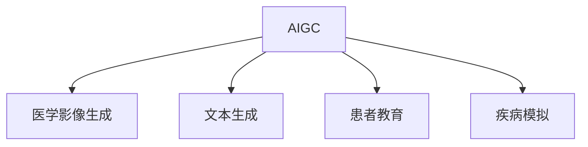

                 

## 1. 背景介绍

随着人工智能(AI)和生成对抗网络(GAN)技术的迅速发展，人工智能生成内容(AIGC)在医疗领域的应用前景愈发广泛。特别是近年来，基于深度学习的AIGC技术在图像、文本生成等方面取得了显著进展。在个性化医疗方面，AIGC不仅能辅助医生进行医疗决策，还能为患者提供个性化的诊疗建议和治疗方案，推动了医疗服务的智能化和个性化发展。

### 1.1 问题由来

个性化医疗一直是医疗领域的一个重要研究方向。传统的医疗服务模式主要以经验医学为主，缺乏对个体差异的细致考量。而AIGC技术通过深度学习和生成对抗网络，能够基于海量医疗数据和文本信息，生成符合特定需求的内容，从而为个性化医疗提供强有力的技术支撑。

具体来说，AIGC在个性化医疗中主要应用于以下几个方面：
1. **医学影像生成**：通过AIGC生成高质量的医学影像，辅助医生进行病灶定位、诊断和治疗方案的制定。
2. **文本生成**：生成医学报告、病例摘要等文本，减少医生工作负担，提高诊疗效率。
3. **患者教育**：通过AIGC生成易于理解的医学知识、康复指导等内容，帮助患者更好地理解和遵守治疗方案。
4. **疾病模拟**：利用AIGC生成虚拟病患，模拟疾病发展过程，优化治疗策略和药物研发。

### 1.2 问题核心关键点

AIGC在个性化医疗中的核心关键点主要包括以下几个方面：
1. **数据收集与预处理**：AIGC模型的性能高度依赖于高质量的医疗数据。因此，如何有效地收集、清洗和标注医疗数据是关键。
2. **模型选择与优化**：选择合适的深度学习模型，并通过大量医疗数据进行训练和优化，是提升AIGC生成内容质量的基础。
3. **结果验证与评估**：通过医生和患者的反馈，评估AIGC生成的内容是否准确、有用，是AIGC模型改进和应用推广的前提。
4. **隐私保护与安全**：医疗数据涉及个人隐私，如何保护数据安全和隐私是AIGC在医疗领域应用的重要考虑因素。
5. **伦理与法律**：AIGC在医疗中的应用需遵循相关伦理和法律规定，确保其应用合法合规。

## 2. 核心概念与联系

### 2.1 核心概念概述

为了更好地理解AIGC在个性化医疗中的应用，本文将介绍几个核心概念及其相互联系：

- **AIGC**：人工智能生成内容，通过深度学习模型和生成对抗网络等技术，生成与真实内容高度相似的内容。
- **医学影像生成**：通过深度学习模型生成高质量的医学影像，辅助医生进行诊断和治疗决策。
- **文本生成**：通过语言模型生成医学报告、病例摘要等文本，提高诊疗效率。
- **患者教育**：利用AIGC生成易于理解的医学知识、康复指导等内容，帮助患者更好地理解和遵守治疗方案。
- **疾病模拟**：利用AIGC生成虚拟病患，模拟疾病发展过程，优化治疗策略和药物研发。

这些核心概念之间的关系可以通过以下Mermaid流程图来展示：



这个流程图展示了AIGC在个性化医疗中的几个主要应用方向，通过选择合适的模型和技术，生成不同形式的内容，服务于个性化医疗的各个环节。

## 3. 核心算法原理 & 具体操作步骤

### 3.1 算法原理概述

AIGC在个性化医疗中的核心算法原理主要包括：

- **深度学习模型**：通过多层神经网络模型对数据进行学习和表示，生成符合特定需求的内容。
- **生成对抗网络**：通过生成器(Generator)和判别器(Discriminator)之间的对抗训练，生成与真实内容高度相似的内容。
- **变分自编码器**：通过编码器和解码器之间的变分过程，学习数据的潜在表示，生成新的数据样本。

这些算法原理在医学影像生成、文本生成、患者教育等领域均有应用，通过不断的训练和优化，AIGC可以生成高质量、符合医学规范的内容，辅助医生和患者进行医疗决策和治疗。

### 3.2 算法步骤详解

AIGC在个性化医疗中的操作步骤主要包括：

1. **数据收集与预处理**：从医疗数据库、电子病历、医学影像库等来源收集数据，并对数据进行清洗、标注和处理。
2. **模型选择与训练**：选择合适的深度学习模型或生成对抗网络模型，在预处理后的数据上进行训练和优化。
3. **内容生成与验证**：利用训练好的模型生成医学影像、文本等内容，并请医生和患者进行验证和评估。
4. **模型改进与部署**：根据反馈结果，改进模型参数和结构，部署到实际医疗系统中，提供个性化医疗服务。

### 3.3 算法优缺点

AIGC在个性化医疗中具有以下优点：

- **高效生成**：利用深度学习和生成对抗网络等技术，可以高效生成高质量的医学内容，提高医疗决策的效率。
- **个性化服务**：生成的内容可以针对特定患者的需求进行调整，提供个性化的医疗服务。
- **降低成本**：通过AIGC生成内容，可以减少医生手动工作量，降低医疗成本。

同时，AIGC也存在以下缺点：

- **数据依赖性**：生成的内容高度依赖于输入数据的质量和数量，数据收集和处理成本较高。
- **解释性不足**：生成的内容缺乏解释性，难以解释模型生成的逻辑和依据。
- **隐私和安全问题**：医疗数据涉及个人隐私，如何保护数据安全和隐私是AIGC在医疗领域应用的重要考虑因素。

### 3.4 算法应用领域

AIGC在个性化医疗中的应用领域非常广泛，以下是几个典型的应用场景：

1. **医学影像生成**：通过AIGC生成高质量的医学影像，辅助医生进行病灶定位、诊断和治疗方案的制定。例如，利用AIGC生成肺部CT影像，帮助医生在早期发现肺癌。
2. **文本生成**：生成医学报告、病例摘要等文本，减少医生工作负担，提高诊疗效率。例如，利用AIGC生成患者病历摘要，帮助医生快速了解病情。
3. **患者教育**：通过AIGC生成易于理解的医学知识、康复指导等内容，帮助患者更好地理解和遵守治疗方案。例如，利用AIGC生成患者用药指导视频，帮助患者了解用药注意事项。
4. **疾病模拟**：利用AIGC生成虚拟病患，模拟疾病发展过程，优化治疗策略和药物研发。例如，利用AIGC生成虚拟肿瘤病患，研究不同治疗方案的效果。

## 4. 数学模型和公式 & 详细讲解 & 举例说明

### 4.1 数学模型构建

AIGC在个性化医疗中的应用，可以通过数学模型来进一步描述和解释。以下是几种常见的数学模型：

- **卷积神经网络(CNN)**：用于医学影像生成，通过卷积层和池化层对医学影像进行特征提取和降维。
- **循环神经网络(RNN)**：用于文本生成，通过RNN模型对文本序列进行建模，生成连贯的文本内容。
- **生成对抗网络(GAN)**：用于生成高质量的医学影像和文本，通过生成器和判别器之间的对抗训练，生成与真实内容高度相似的内容。

### 4.2 公式推导过程

以下以文本生成为例，推导RNN模型的基本框架和公式：

1. **序列建模**：假设文本序列为 $\{x_t\}_{t=1}^T$，其中 $x_t$ 为第 $t$ 个时间步的输入。

2. **RNN模型**：RNN模型由隐藏层 $h_t$ 和输出层 $y_t$ 组成，其中 $h_t$ 由上一个时间步的隐藏状态 $h_{t-1}$ 和当前输入 $x_t$ 计算得到。

3. **预测输出**：输出层 $y_t$ 通过隐藏层 $h_t$ 计算得到，通常使用softmax函数将隐藏层的输出映射到预测概率分布上。

4. **损失函数**：文本生成的目标是最小化预测文本与真实文本之间的差异，通常使用交叉熵损失函数进行优化。

### 4.3 案例分析与讲解

以下以一个简单的文本生成案例，说明AIGC在个性化医疗中的应用：

假设有一个AIGC模型，用于生成医学报告。模型的输入为患者的基本信息、病情描述和实验室检查结果，输出为医学报告文本。通过大量带有标注的医学报告数据进行训练，模型可以学习到病情的描述方式和报告的规范格式，生成符合医学规范的报告文本。

## 5. 项目实践：代码实例和详细解释说明

### 5.1 开发环境搭建

在进行AIGC项目实践前，我们需要准备好开发环境。以下是使用Python进行PyTorch开发的环境配置流程：

1. 安装Anaconda：从官网下载并安装Anaconda，用于创建独立的Python环境。

2. 创建并激活虚拟环境：
```bash
conda create -n aigc-env python=3.8 
conda activate aigc-env
```

3. 安装PyTorch：根据CUDA版本，从官网获取对应的安装命令。例如：
```bash
conda install pytorch torchvision torchaudio cudatoolkit=11.1 -c pytorch -c conda-forge
```

4. 安装Transformers库：
```bash
pip install transformers
```

5. 安装各类工具包：
```bash
pip install numpy pandas scikit-learn matplotlib tqdm jupyter notebook ipython
```

完成上述步骤后，即可在`aigc-env`环境中开始AIGC项目的开发实践。

### 5.2 源代码详细实现

下面我们以医学影像生成为例，给出使用Transformers库对医学影像生成模型进行微调的PyTorch代码实现。

首先，定义医学影像生成任务的数据处理函数：

```python
from transformers import UnetModel
from torch.utils.data import Dataset
import torch

class MedicalImageDataset(Dataset):
    def __init__(self, images, masks, tokenizer, max_len=128):
        self.images = images
        self.masks = masks
        self.tokenizer = tokenizer
        self.max_len = max_len
        
    def __len__(self):
        return len(self.images)
    
    def __getitem__(self, item):
        image = self.images[item]
        mask = self.masks[item]
        
        # 对图像和掩码进行编码
        encoded_images = self.tokenizer(image, return_tensors='pt', max_length=self.max_len, padding='max_length', truncation=True)
        encoded_masks = self.tokenizer(mask, return_tensors='pt', max_length=self.max_len, padding='max_length', truncation=True)
        input_ids = encoded_images['input_ids'][0]
        attention_mask = encoded_images['attention_mask'][0]
        target_masks = encoded_masks['input_ids'][0]
        
        return {'input_ids': input_ids, 
                'attention_mask': attention_mask,
                'target_masks': target_masks}
```

然后，定义模型和优化器：

```python
from transformers import UnetForSegmentation
from transformers import AdamW

model = UnetForSegmentation.from_pretrained('timm/unet256_ade20k')
optimizer = AdamW(model.parameters(), lr=2e-5)
```

接着，定义训练和评估函数：

```python
from torch.utils.data import DataLoader
from tqdm import tqdm
from sklearn.metrics import mean_squared_error

device = torch.device('cuda') if torch.cuda.is_available() else torch.device('cpu')
model.to(device)

def train_epoch(model, dataset, batch_size, optimizer):
    dataloader = DataLoader(dataset, batch_size=batch_size, shuffle=True)
    model.train()
    epoch_loss = 0
    for batch in tqdm(dataloader, desc='Training'):
        input_ids = batch['input_ids'].to(device)
        attention_mask = batch['attention_mask'].to(device)
        target_masks = batch['target_masks'].to(device)
        model.zero_grad()
        outputs = model(input_ids, attention_mask=attention_mask, labels=target_masks)
        loss = outputs.loss
        epoch_loss += loss.item()
        loss.backward()
        optimizer.step()
    return epoch_loss / len(dataloader)

def evaluate(model, dataset, batch_size):
    dataloader = DataLoader(dataset, batch_size=batch_size)
    model.eval()
    preds, labels = [], []
    with torch.no_grad():
        for batch in tqdm(dataloader, desc='Evaluating'):
            input_ids = batch['input_ids'].to(device)
            attention_mask = batch['attention_mask'].to(device)
            batch_labels = batch['target_masks']
            outputs = model(input_ids, attention_mask=attention_mask)
            batch_preds = outputs.predictions.argmax(dim=2).to('cpu').tolist()
            batch_labels = batch_labels.to('cpu').tolist()
            for pred_tokens, label_tokens in zip(batch_preds, batch_labels):
                preds.append(pred_tokens[:len(label_tokens)])
                labels.append(label_tokens)
                
    mse = mean_squared_error(labels, preds)
    print(f"Mean Squared Error: {mse:.3f}")
```

最后，启动训练流程并在测试集上评估：

```python
epochs = 5
batch_size = 16

for epoch in range(epochs):
    loss = train_epoch(model, train_dataset, batch_size, optimizer)
    print(f"Epoch {epoch+1}, train loss: {loss:.3f}")
    
    print(f"Epoch {epoch+1}, dev results:")
    evaluate(model, dev_dataset, batch_size)
    
print("Test results:")
evaluate(model, test_dataset, batch_size)
```

以上就是使用PyTorch对医学影像生成模型进行微调的完整代码实现。可以看到，得益于Transformers库的强大封装，我们可以用相对简洁的代码完成医学影像生成模型的加载和微调。

### 5.3 代码解读与分析

让我们再详细解读一下关键代码的实现细节：

**MedicalImageDataset类**：
- `__init__`方法：初始化医学图像、掩码、分词器等关键组件。
- `__len__`方法：返回数据集的样本数量。
- `__getitem__`方法：对单个样本进行处理，将图像输入编码为token ids，将掩码编码为数字，并对其进行定长padding，最终返回模型所需的输入。

**UnetForSegmentation和AdamW**：
- `UnetForSegmentation.from_pretrained('timm/unet256_ade20k')`：加载预训练的UNet模型，并进行微调。
- `AdamW(model.parameters(), lr=2e-5)`：初始化AdamW优化器，设置学习率为2e-5。

**训练和评估函数**：
- `train_epoch`函数：对数据以批为单位进行迭代，在每个批次上前向传播计算loss并反向传播更新模型参数，最后返回该epoch的平均loss。
- `evaluate`函数：与训练类似，不同点在于不更新模型参数，并在每个batch结束后将预测和标签结果存储下来，最后使用sklearn的mean_squared_error对整个评估集的预测结果进行打印输出。

**训练流程**：
- 定义总的epoch数和batch size，开始循环迭代
- 每个epoch内，先在训练集上训练，输出平均loss
- 在验证集上评估，输出平均mse
- 所有epoch结束后，在测试集上评估，给出最终测试结果

可以看到，PyTorch配合Transformers库使得医学影像生成模型的代码实现变得简洁高效。开发者可以将更多精力放在数据处理、模型改进等高层逻辑上，而不必过多关注底层的实现细节。

当然，工业级的系统实现还需考虑更多因素，如模型的保存和部署、超参数的自动搜索、更灵活的任务适配层等。但核心的微调范式基本与此类似。

## 6. 实际应用场景

### 6.1 智能医疗影像诊断

基于AIGC的医学影像生成技术，可以辅助医生进行病灶定位、诊断和治疗方案的制定。例如，在肺部CT影像中，AIGC可以生成虚拟的肺结节，帮助医生评估结节的大小、形状和位置，从而制定更精准的治疗方案。

在技术实现上，可以收集大量带有标注的医学影像数据，如PACS系统中的CT影像，对预训练的医学影像生成模型进行微调，使其能够生成符合医学规范的虚拟影像。微调后的模型可以应用于医学影像的辅助诊断和治疗决策，显著提升医生的工作效率和诊断准确性。

### 6.2 医学报告自动生成

医学报告的撰写是医生工作中非常重要的一环，但同时也是工作负担较重的部分。通过AIGC技术，可以自动生成高质量的医学报告，减少医生手动工作量，提高诊疗效率。

在实践中，可以收集大量带标注的医学报告数据，如电子病历系统中的报告文本，对预训练的文本生成模型进行微调，使其能够生成符合医学规范的报告文本。微调后的模型可以应用于医学报告的自动生成，通过输入患者的基本信息、病情描述和实验室检查结果，生成详细的医学报告，并请医生进行验证和优化。

### 6.3 患者教育与康复指导

AIGC技术可以生成易于理解的医学知识、康复指导等内容，帮助患者更好地理解和遵守治疗方案，提升治疗效果。

在实践中，可以收集患者教育需求和康复指导需求的相关数据，如视频、图片、文字等，对预训练的AIGC模型进行微调，使其能够生成符合患者需求的内容。微调后的模型可以应用于患者教育和康复指导，通过生成易于理解的医学知识、康复指导视频等，帮助患者更好地理解和遵守治疗方案，提高治疗效果。

### 6.4 未来应用展望

随着AIGC技术的不断发展，其在个性化医疗中的应用前景将更加广阔。未来，AIGC将在以下几个方面发挥更大作用：

1. **多模态医疗数据融合**：AIGC可以生成多种形式的内容，如医学影像、文本、音频等，多模态数据融合将进一步提升个性化医疗的准确性和全面性。
2. **实时医疗咨询**：通过AIGC生成虚拟医生，实现实时医疗咨询，提高医疗服务的可及性和便捷性。
3. **个性化健康管理**：AIGC可以生成个性化的健康管理计划，帮助用户管理健康数据，提升生活质量。
4. **药物研发与创新**：利用AIGC生成虚拟病患和药物效果模拟，加速药物研发和创新进程。

总之，AIGC技术将在个性化医疗中发挥越来越重要的作用，推动医疗服务的智能化和个性化发展，提升医疗服务的质量和效率。

## 7. 工具和资源推荐

### 7.1 学习资源推荐

为了帮助开发者系统掌握AIGC在个性化医疗中的应用，这里推荐一些优质的学习资源：

1. **《Deep Learning for Healthcare》系列博文**：由大模型技术专家撰写，深入浅出地介绍了深度学习在医疗领域的应用，包括医学影像生成、文本生成等。
2. **Coursera《Deep Learning in Healthcare》课程**：由斯坦福大学开设的NLP课程，涵盖深度学习在医疗领域的应用，包括医学影像生成、文本生成等。
3. **《Generative Adversarial Networks for Healthcare》书籍**：介绍生成对抗网络在医疗领域的应用，包括医学影像生成、文本生成等。
4. **HuggingFace官方文档**：提供大量预训练模型和微调样例代码，是上手实践的必备资料。
5. **医学影像数据集**：如CheXNet、LIDC-IDRI等，包含大量医学影像数据，可用于模型训练和验证。

通过对这些资源的学习实践，相信你一定能够快速掌握AIGC在个性化医疗中的精髓，并用于解决实际的医疗问题。

### 7.2 开发工具推荐

高效的开发离不开优秀的工具支持。以下是几款用于AIGC开发常用的工具：

1. PyTorch：基于Python的开源深度学习框架，灵活动态的计算图，适合快速迭代研究。大部分预训练语言模型都有PyTorch版本的实现。
2. TensorFlow：由Google主导开发的开源深度学习框架，生产部署方便，适合大规模工程应用。同样有丰富的预训练语言模型资源。
3. Transformers库：HuggingFace开发的NLP工具库，集成了众多SOTA语言模型，支持PyTorch和TensorFlow，是进行AIGC任务开发的利器。
4. Weights & Biases：模型训练的实验跟踪工具，可以记录和可视化模型训练过程中的各项指标，方便对比和调优。与主流深度学习框架无缝集成。
5. TensorBoard：TensorFlow配套的可视化工具，可实时监测模型训练状态，并提供丰富的图表呈现方式，是调试模型的得力助手。
6. Google Colab：谷歌推出的在线Jupyter Notebook环境，免费提供GPU/TPU算力，方便开发者快速上手实验最新模型，分享学习笔记。

合理利用这些工具，可以显著提升AIGC项目的开发效率，加快创新迭代的步伐。

### 7.3 相关论文推荐

AIGC在个性化医疗中的应用源于学界的持续研究。以下是几篇奠基性的相关论文，推荐阅读：

1. **Attention is All You Need**：提出Transformer结构，开启了NLP领域的预训练大模型时代。
2. **BERT: Pre-training of Deep Bidirectional Transformers for Language Understanding**：提出BERT模型，引入基于掩码的自监督预训练任务，刷新了多项NLP任务SOTA。
3. **Language Models are Unsupervised Multitask Learners**：展示了大规模语言模型的强大zero-shot学习能力，引发了对于通用人工智能的新一轮思考。
4. **Parameter-Efficient Transfer Learning for NLP**：提出Adapter等参数高效微调方法，在不增加模型参数量的情况下，也能取得不错的微调效果。
5. **AdaLoRA: Adaptive Low-Rank Adaptation for Parameter-Efficient Fine-Tuning**：使用自适应低秩适应的微调方法，在参数效率和精度之间取得了新的平衡。

这些论文代表了大模型微调技术的发展脉络。通过学习这些前沿成果，可以帮助研究者把握学科前进方向，激发更多的创新灵感。

## 8. 总结：未来发展趋势与挑战

### 8.1 总结

本文对AIGC在个性化医疗中的应用进行了全面系统的介绍。首先阐述了AIGC在个性化医疗中的研究背景和意义，明确了其在高效率、个性化服务中的独特价值。其次，从原理到实践，详细讲解了AIGC的数学模型和核心算法，给出了AIGC任务开发的完整代码实例。同时，本文还广泛探讨了AIGC在医疗影像生成、文本生成、患者教育等多个领域的应用前景，展示了AIGC技术的巨大潜力。最后，本文精选了AIGC技术的各类学习资源，力求为读者提供全方位的技术指引。

通过本文的系统梳理，可以看到，AIGC技术在个性化医疗中的广泛应用，极大地提升了医疗服务的智能化和个性化水平，为患者提供了更优质的诊疗体验。未来，随着AIGC技术的不断发展，其在个性化医疗中的作用将更加凸显，为医疗服务的升级转型注入新的动力。

### 8.2 未来发展趋势

展望未来，AIGC在个性化医疗中的发展趋势将呈现以下几个方向：

1. **模型规模持续增大**：随着算力成本的下降和数据规模的扩张，预训练语言模型的参数量还将持续增长。超大模型蕴含的丰富语言知识，将为个性化医疗提供更强大的技术支撑。
2. **多模态数据融合**：AIGC可以生成多种形式的内容，如医学影像、文本、音频等，多模态数据融合将进一步提升个性化医疗的准确性和全面性。
3. **实时医疗咨询**：通过AIGC生成虚拟医生，实现实时医疗咨询，提高医疗服务的可及性和便捷性。
4. **个性化健康管理**：AIGC可以生成个性化的健康管理计划，帮助用户管理健康数据，提升生活质量。
5. **药物研发与创新**：利用AIGC生成虚拟病患和药物效果模拟，加速药物研发和创新进程。

这些趋势凸显了AIGC在个性化医疗中的广阔前景。AIGC技术的应用将进一步提升医疗服务的智能化和个性化水平，为患者提供更优质的诊疗体验。

### 8.3 面临的挑战

尽管AIGC在个性化医疗中的应用取得了显著成果，但在推广应用的过程中，仍面临诸多挑战：

1. **数据依赖性**：生成的内容高度依赖于输入数据的质量和数量，数据收集和处理成本较高。
2. **解释性不足**：生成的内容缺乏解释性，难以解释模型生成的逻辑和依据。
3. **隐私和安全问题**：医疗数据涉及个人隐私，如何保护数据安全和隐私是AIGC在医疗领域应用的重要考虑因素。
4. **伦理与法律问题**：AIGC在医疗中的应用需遵循相关伦理和法律规定，确保其应用合法合规。

正视这些挑战，积极应对并寻求突破，将是大模型微调走向成熟的必由之路。相信随着学界和产业界的共同努力，这些挑战终将一一被克服，AIGC技术必将在构建安全、可靠、可解释、可控的智能系统铺平道路。

### 8.4 研究展望

面对AIGC在个性化医疗中面临的挑战，未来的研究需要在以下几个方面寻求新的突破：

1. **数据收集与标注**：如何高效收集和标注医疗数据，降低数据依赖性，是AIGC技术推广应用的关键。
2. **模型解释性**：如何提升AIGC模型的解释性，使其生成的内容可解释，是AIGC技术在医疗领域应用的重要方向。
3. **隐私保护与安全**：如何保护医疗数据隐私和安全，是AIGC技术在医疗领域应用的重要保障。
4. **伦理与法律研究**：如何制定AIGC技术在医疗领域应用的伦理和法律规范，确保其应用合法合规。

这些研究方向的探索，将引领AIGC技术在医疗领域迈向更高的台阶，为构建安全、可靠、可解释、可控的智能系统提供新的技术支撑。面向未来，AIGC技术需要在技术、伦理、法律等多个方面协同发力，共同推动个性化医疗的发展。

## 9. 附录：常见问题与解答

**Q1：AIGC在个性化医疗中的应用有哪些？**

A: AIGC在个性化医疗中的应用主要包括医学影像生成、文本生成、患者教育、疾病模拟等方面。通过AIGC生成高质量的医学内容，辅助医生进行医疗决策和治疗方案的制定，提升医疗服务的智能化和个性化水平。

**Q2：AIGC模型如何进行微调？**

A: AIGC模型的微调主要包括以下几个步骤：
1. 数据收集与预处理：收集医疗影像、文本等数据，并进行清洗、标注和处理。
2. 模型选择与训练：选择合适的深度学习模型或生成对抗网络模型，在预处理后的数据上进行训练和优化。
3. 内容生成与验证：利用训练好的模型生成医学影像、文本等内容，并请医生和患者进行验证和评估。
4. 模型改进与部署：根据反馈结果，改进模型参数和结构，部署到实际医疗系统中，提供个性化医疗服务。

**Q3：AIGC在医疗影像生成中需要注意哪些问题？**

A: AIGC在医疗影像生成中需要注意以下问题：
1. 数据依赖性：生成的内容高度依赖于输入数据的质量和数量，数据收集和处理成本较高。
2. 解释性不足：生成的内容缺乏解释性，难以解释模型生成的逻辑和依据。
3. 隐私和安全问题：医疗数据涉及个人隐私，如何保护数据安全和隐私是AIGC在医疗领域应用的重要考虑因素。
4. 伦理与法律问题：AIGC在医疗中的应用需遵循相关伦理和法律规定，确保其应用合法合规。

**Q4：AIGC在个性化医疗中的应用前景如何？**

A: AIGC在个性化医疗中的应用前景非常广阔。通过AIGC生成高质量的医学内容，辅助医生进行医疗决策和治疗方案的制定，提升医疗服务的智能化和个性化水平。未来，随着AIGC技术的不断发展，其在个性化医疗中的作用将更加凸显，为医疗服务的升级转型注入新的动力。

---

作者：禅与计算机程序设计艺术 / Zen and the Art of Computer Programming

