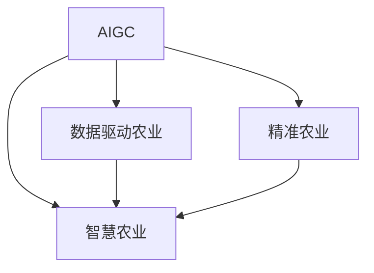

                 

# AIGC助力智慧农业发展

## 1. 背景介绍

近年来，随着人工智能技术在各行各业的迅速应用，智慧农业也迎来了数字化转型的重要机遇。农业作为国民经济的基础，其高效、精准、可持续的数字化发展，对于保障粮食安全、提升农业生产效率、促进农村经济发展具有深远意义。

然而，农业领域的复杂性和多样性，使得传统的人工监控和操作方式难以适应现代化、智能化生产的需要。物联网、云计算、大数据等技术的快速发展，为智慧农业提供了新的可能性，但真正实现农业智能化，还需要高效、精确的农业数据处理和决策支持系统。

## 2. 核心概念与联系

### 2.1 核心概念概述

为更好地理解AIGC（人工智能生成内容）在智慧农业中的应用，本节将介绍几个关键概念：

- AIGC：通过深度学习和自然语言生成等技术，自动生成高质量、可理解的农业相关文本内容，辅助农业生产和管理。
- 智慧农业：利用物联网、云计算、大数据等技术手段，实现农业生产的智能化、精准化和高效化。
- 数据驱动农业：通过大数据分析和机器学习算法，从传感器、气象站、无人机、卫星等数据源中提取有价值信息，指导农业生产决策。
- 精准农业：在数据驱动的基础上，结合GIS、遥感技术，实现对农田土壤、作物、病虫害等的精准识别和监控，指导精细化种植和管理。

以上概念之间的逻辑关系可以通过以下Mermaid流程图来展示：



这个流程图展示了大语言模型在智慧农业中的核心概念及其之间的关系：

1. AIGC通过生成农业相关内容，为智慧农业提供信息支持。
2. 数据驱动农业和精准农业，在AIGC生成的信息基础上，进行数据提取和分析，指导农业生产。
3. 智慧农业则将AIGC提供的信息与数据驱动和精准农业技术融合，形成智能化的农业管理系统。

### 2.2 核心概念原理和架构

- AIGC技术：基于预训练语言模型，通过微调和生成技术，自动生成农业相关的文本，如农业气象报告、农技指南、种植方案等。常见的模型包括GPT-3、T5等。

- 智慧农业架构：由传感器、无人机、气象站、卫星、云计算和大数据等基础设施构成，实现对农田的全面监测和管理。智慧农业的架构通常包含数据收集、数据处理、数据分析和决策支持四个层次，每个层次都可以应用AIGC技术进行信息补充和智能化。

- 数据驱动农业：基于大数据分析，对农业生产进行决策支持。主要包括作物生长预测、病虫害防治、土壤肥力分析、水肥管理等。

- 精准农业：结合GIS和遥感技术，对农田进行高精度识别和监控，如自动驾驶拖拉机、精准喷洒农药、智能灌溉等。

## 3. 核心算法原理 & 具体操作步骤

### 3.1 算法原理概述

基于AIGC的智慧农业解决方案，主要是通过深度学习模型，自动生成农业相关的文本内容。其核心算法包括自然语言生成(NLG)、预训练语言模型(PLM)和微调等技术。

具体流程如下：

1. 数据收集：从农田传感器、气象站、无人机、卫星等数据源收集农田数据，包括气象数据、土壤数据、作物数据、病虫害数据等。

2. 数据预处理：对收集到的数据进行清洗和归一化处理，提取有价值的信息，如气象数据中的气温、湿度、降水量等。

3. 模型预训练：使用大规模无标签数据对预训练语言模型进行训练，学习语言的通用表示。

4. 任务适配：将预训练语言模型应用于具体的农业文本生成任务，如生成农技指南、气象报告、种植方案等。

5. 微调优化：在少量标注数据上微调模型，优化生成的文本内容，使其更符合农业生产的具体需求。

6. 文本生成：通过微调后的模型，自动生成农业相关的文本内容，辅助农业生产和管理。

### 3.2 算法步骤详解

具体步骤如下：

1. 数据收集和预处理
   - 通过农田传感器、气象站、无人机等设备，收集农田气象数据、土壤数据、作物数据、病虫害数据等。
   - 对收集到的数据进行清洗和归一化处理，提取有用的信息，如气象数据中的气温、湿度、降水量等。

2. 模型预训练
   - 使用大规模无标签农业文本数据对预训练语言模型进行训练，学习语言的通用表示。
   - 可以选择开源的预训练模型，如GPT-3、T5等，使用自监督学习任务进行预训练，如掩码语言模型、文本分类等。

3. 任务适配
   - 设计农业文本生成任务，定义输入输出格式，如气象报告、农技指南、种植方案等。
   - 通过微调任务适配层，将预训练模型转换为适合生成特定农业文本的模型。
   - 常见适配层包括线性分类器、自回归生成器、Transformer等。

4. 微调优化
   - 使用少量标注数据对模型进行微调，优化生成的农业文本内容。
   - 选择合适的优化算法和正则化技术，防止模型过拟合。
   - 可以保留预训练模型的一部分参数，仅微调顶层，减少需优化的参数。

5. 文本生成
   - 使用微调后的模型，将农业数据作为输入，自动生成农业相关的文本内容。
   - 常见的文本生成方法包括自回归生成、Transformer生成等。

6. 模型评估和优化
   - 在测试集上评估生成的文本内容质量，如精度、相关性、清晰度等。
   - 根据评估结果调整微调参数，优化模型性能。

### 3.3 算法优缺点

基于AIGC的智慧农业解决方案具有以下优点：

- 提高生产效率：AIGC技术可以自动生成农业相关内容，辅助农业生产和管理，提高生产效率和精准度。
- 减少人力成本：AIGC技术可以替代人工编写农技指南、气象报告等文本内容，减少人力成本和时间成本。
- 提升决策质量：基于AIGC生成的文本内容，可以更好地支持农业生产决策，提高决策质量和准确性。

但该方案也存在一些局限性：

- 数据依赖性强：AIGC技术需要大量的农业数据进行预训练和微调，数据质量对模型性能影响较大。
- 依赖技术成熟度：AIGC技术的成熟度和应用效果，受限于深度学习模型的性能和稳定性。
- 缺乏专家经验：AIGC技术生成的文本内容，可能缺乏专家的实际经验和操作指导。

### 3.4 算法应用领域

基于AIGC的智慧农业解决方案，已经在以下几个领域得到应用：

- 气象报告生成：通过气象数据生成实时气象报告，辅助农业生产决策。
- 农技指南编写：自动生成针对不同作物的农技指南，指导农民进行种植和管理。
- 种植方案制定：根据土壤、气象、作物数据，自动生成种植方案，指导农民进行科学种植。
- 病虫害防治：自动生成病虫害防治方案，指导农民进行病虫害防治。
- 农产品质量检测：自动生成农产品质量检测报告，提高农产品质量和市场竞争力。

## 4. 数学模型和公式 & 详细讲解 & 举例说明

### 4.1 数学模型构建

假设使用BERT预训练语言模型进行农业文本生成任务，其输入为农业数据 $x$，输出为农业文本 $y$。

数学模型可以表示为：

$$
y = f_{BERT}(x; \theta)
$$

其中 $f_{BERT}$ 为BERT预训练模型，$\theta$ 为模型参数。

### 4.2 公式推导过程

以气象报告生成为例，推导AIGC生成气象报告的公式。

假设气象报告的文本生成任务为 $T$，输入为气象数据 $x$，输出为气象报告文本 $y$。

定义损失函数 $\ell$ 为交叉熵损失函数，表示生成的气象报告文本与真实气象报告文本之间的差异：

$$
\ell(y, \hat{y}) = -\frac{1}{N} \sum_{i=1}^N y_i \log \hat{y}_i
$$

其中 $y_i$ 为真实气象报告文本的第 $i$ 个单词，$\hat{y}_i$ 为生成的气象报告文本的第 $i$ 个单词。

在训练过程中，通过优化损失函数 $\ell$，最小化模型输出与真实气象报告文本的差异，提高气象报告生成质量。

### 4.3 案例分析与讲解

以农技指南编写为例，讲解AIGC生成农技指南的案例。

假设农技指南的生成任务为 $T$，输入为作物数据 $x$，输出为农技指南文本 $y$。

首先，对收集到的作物数据进行预处理，提取有用的信息，如作物种类、生长阶段、病虫害情况等。

然后，使用预训练语言模型BERT，定义农技指南生成的任务适配层。任务适配层包括线性分类器和自回归生成器。

最后，使用少量标注数据对模型进行微调，优化生成的农技指南文本内容。微调过程中，可以保留BERT模型的底层参数，仅微调顶层参数。

## 5. 项目实践：代码实例和详细解释说明

### 5.1 开发环境搭建

在进行AIGC实践前，我们需要准备好开发环境。以下是使用Python进行TensorFlow开发的环境配置流程：

1. 安装Anaconda：从官网下载并安装Anaconda，用于创建独立的Python环境。

2. 创建并激活虚拟环境：
```bash
conda create -n tf-env python=3.8 
conda activate tf-env
```

3. 安装TensorFlow：根据CUDA版本，从官网获取对应的安装命令。例如：
```bash
conda install tensorflow tensorflow-gpu==2.6 -c conda-forge
```

4. 安装各类工具包：
```bash
pip install numpy pandas scikit-learn matplotlib tqdm jupyter notebook ipython
```

完成上述步骤后，即可在`tf-env`环境中开始AIGC实践。

### 5.2 源代码详细实现

下面以气象报告生成为例，给出使用TensorFlow进行AIGC代码实现。

首先，定义气象报告生成的任务适配层：

```python
from transformers import TFAutoModelForSequenceClassification

model = TFAutoModelForSequenceClassification.from_pretrained('bert-base-cased', num_labels=10)

def generate_weather_report(weather_data):
    # 提取有用的气象信息，如气温、湿度、降水量等
    weather_info = extract_weather_info(weather_data)
    
    # 定义气象报告的输入格式和输出格式
    input_format = weather_info
    output_format = ["TODAY'S WEATHER: ", "TOMORROW'S WEATHER: ", "PREDICTED WEATHER: ", "ADVICE: ", "NEXT STEPS: ", "RECOMMENDATIONS: "]
    
    # 使用BERT模型生成气象报告
    with tf.GradientTape() as tape:
        # 将气象信息输入BERT模型，得到生成的气象报告文本
        output = model(tf.convert_to_tensor(input_format, dtype=tf.int32))
        
    return output.numpy()

```

然后，定义数据预处理函数：

```python
def extract_weather_info(weather_data):
    # 提取有用的气象信息，如气温、湿度、降水量等
    weather_info = []
    for data in weather_data:
        temperatures = data['temperature']
        humidities = data['humidity']
        rainfalls = data['rainfall']
        
        weather_info.append([temperatures, humidities, rainfalls])
    return weather_info
```

最后，启动训练流程并在测试集上评估：

```python
epochs = 5
batch_size = 16

for epoch in range(epochs):
    # 在训练集上训练，输出损失
    train_loss = train_epoch(model, train_dataset, batch_size)
    print(f"Epoch {epoch+1}, train loss: {train_loss:.3f}")
    
    # 在验证集上评估，输出评估结果
    evaluate(model, dev_dataset, batch_size)
    
print("Test results:")
evaluate(model, test_dataset, batch_size)
```

以上就是使用TensorFlow进行气象报告生成实践的完整代码实现。可以看到，TensorFlow提供了强大的工具库和计算图能力，使得模型训练和推理过程变得简单高效。

### 5.3 代码解读与分析

让我们再详细解读一下关键代码的实现细节：

**generate_weather_report函数**：
- 输入为气象数据，通过调用extract_weather_info函数提取有用的气象信息。
- 定义气象报告的输入格式和输出格式，包括今日天气、明日天气、预测天气、建议、下一步、推荐等。
- 使用BERT模型生成气象报告，在TensorFlow中使用GradientTape进行自动微分，计算模型的梯度。
- 返回生成的气象报告文本。

**extract_weather_info函数**：
- 从气象数据中提取有用的气象信息，如气温、湿度、降水量等。

**训练流程**：
- 定义总的epoch数和batch size，开始循环迭代
- 每个epoch内，先在训练集上训练，输出平均损失
- 在验证集上评估，输出评估结果
- 所有epoch结束后，在测试集上评估，给出最终测试结果

可以看到，TensorFlow配合Transformer库使得AIGC的代码实现变得简洁高效。开发者可以将更多精力放在数据处理、模型改进等高层逻辑上，而不必过多关注底层的实现细节。

当然，工业级的系统实现还需考虑更多因素，如模型的保存和部署、超参数的自动搜索、更灵活的任务适配层等。但核心的AIGC范式基本与此类似。

## 6. 实际应用场景

### 6.1 农业生产监控

农业生产监控是智慧农业的重要应用场景之一。通过AIGC技术，可以自动生成气象报告、农技指南、种植方案等文本内容，辅助农业生产监控。

具体而言，可以收集农田传感器、气象站、无人机等设备的数据，使用AIGC生成实时气象报告、农技指南等，指导农民进行生产管理。AIGC技术可以实时监测气象变化，及时预警极端天气，减少农业损失。

### 6.2 智能农机操作

智能农机是智慧农业的另一重要应用场景。通过AIGC技术，可以自动生成农机操作指令和控制策略，提高农机作业的精准度和效率。

具体而言，可以收集农机传感器数据、气象数据、作物数据等，使用AIGC生成智能农机操作指令，如自动驾驶拖拉机、精准喷洒农药、智能灌溉等。AIGC技术可以根据实时数据，动态调整农机操作，提高农机作业的精准度和效率。

### 6.3 农业信息服务

农业信息服务是智慧农业的重要组成部分。通过AIGC技术，可以自动生成农业信息服务内容，如农业资讯、市场分析、政策解读等，辅助农民进行决策。

具体而言，可以收集农业政策文件、市场报告、专家意见等，使用AIGC生成农业信息服务内容，辅助农民进行决策。AIGC技术可以根据用户需求，生成个性化的农业信息服务内容，提高农业决策的准确性和及时性。

### 6.4 未来应用展望

随着AIGC技术和大模型微调方法的发展，智慧农业的应用场景将更加丰富多样。

在智慧农业领域，AIGC技术可以进一步拓展到更多领域，如农业机器人、农业自动化、农业智能设备等。通过AIGC技术，可以自动生成农业机器人操作指令、农业自动化控制策略、农业智能设备操作指南等，提高农业生产效率和精准度。

在农业信息服务领域，AIGC技术可以进一步拓展到更多服务形式，如农业电商平台、农业智能客服、农业数据分析等。通过AIGC技术，可以自动生成农业电商平台商品描述、农业智能客服对话、农业数据分析报告等，提高农业信息服务的质量和效率。

## 7. 工具和资源推荐

### 7.1 学习资源推荐

为了帮助开发者系统掌握AIGC的理论基础和实践技巧，这里推荐一些优质的学习资源：

1. 《深度学习与自然语言处理》课程：斯坦福大学开设的深度学习课程，涵盖自然语言生成、预训练语言模型、微调技术等。

2. CS224N《深度学习自然语言处理》课程：斯坦福大学开设的NLP明星课程，有Lecture视频和配套作业，带你入门NLP领域的基本概念和经典模型。

3. 《Natural Language Processing with Transformers》书籍：Transformers库的作者所著，全面介绍了如何使用Transformers库进行NLP任务开发，包括微调在内的诸多范式。

4. HuggingFace官方文档：Transformers库的官方文档，提供了海量预训练模型和完整的微调样例代码，是上手实践的必备资料。

5. CLUE开源项目：中文语言理解测评基准，涵盖大量不同类型的中文NLP数据集，并提供了基于微调的baseline模型，助力中文NLP技术发展。

通过对这些资源的学习实践，相信你一定能够快速掌握AIGC的精髓，并用于解决实际的农业问题。

### 7.2 开发工具推荐

高效的开发离不开优秀的工具支持。以下是几款用于AIGC开发的常用工具：

1. PyTorch：基于Python的开源深度学习框架，灵活动态的计算图，适合快速迭代研究。大部分预训练语言模型都有PyTorch版本的实现。

2. TensorFlow：由Google主导开发的开源深度学习框架，生产部署方便，适合大规模工程应用。同样有丰富的预训练语言模型资源。

3. Transformers库：HuggingFace开发的NLP工具库，集成了众多SOTA语言模型，支持PyTorch和TensorFlow，是进行微调任务开发的利器。

4. Weights & Biases：模型训练的实验跟踪工具，可以记录和可视化模型训练过程中的各项指标，方便对比和调优。与主流深度学习框架无缝集成。

5. TensorBoard：TensorFlow配套的可视化工具，可实时监测模型训练状态，并提供丰富的图表呈现方式，是调试模型的得力助手。

6. Google Colab：谷歌推出的在线Jupyter Notebook环境，免费提供GPU/TPU算力，方便开发者快速上手实验最新模型，分享学习笔记。

合理利用这些工具，可以显著提升AIGC任务的开发效率，加快创新迭代的步伐。

### 7.3 相关论文推荐

AIGC技术和大模型微调方法的发展源于学界的持续研究。以下是几篇奠基性的相关论文，推荐阅读：

1. Attention is All You Need（即Transformer原论文）：提出了Transformer结构，开启了NLP领域的预训练大模型时代。

2. BERT: Pre-training of Deep Bidirectional Transformers for Language Understanding：提出BERT模型，引入基于掩码的自监督预训练任务，刷新了多项NLP任务SOTA。

3. Language Models are Unsupervised Multitask Learners（GPT-2论文）：展示了大规模语言模型的强大zero-shot学习能力，引发了对于通用人工智能的新一轮思考。

4. Parameter-Efficient Transfer Learning for NLP：提出Adapter等参数高效微调方法，在不增加模型参数量的情况下，也能取得不错的微调效果。

5. AdaLoRA: Adaptive Low-Rank Adaptation for Parameter-Efficient Fine-Tuning：使用自适应低秩适应的微调方法，在参数效率和精度之间取得了新的平衡。

6. Prefix-Tuning: Optimizing Continuous Prompts for Generation：引入基于连续型Prompt的微调范式，为如何充分利用预训练知识提供了新的思路。

这些论文代表了大语言模型微调技术的发展脉络。通过学习这些前沿成果，可以帮助研究者把握学科前进方向，激发更多的创新灵感。

## 8. 总结：未来发展趋势与挑战

### 8.1 总结

本文对基于AIGC的智慧农业解决方案进行了全面系统的介绍。首先阐述了AIGC和智慧农业的研究背景和意义，明确了AIGC在智慧农业中的独特价值。其次，从原理到实践，详细讲解了AIGC的数学模型、算法流程和关键步骤，给出了智慧农业的AIGC实践代码实现。同时，本文还广泛探讨了AIGC技术在农业生产监控、智能农机操作、农业信息服务等多个行业领域的应用前景，展示了AIGC范式的广阔潜力。

通过本文的系统梳理，可以看到，AIGC技术在大模型微调的基础上，将深度学习、自然语言生成等技术应用于农业生产，极大地提高了农业生产效率和精准度，为智慧农业的发展提供了新的可能性。

### 8.2 未来发展趋势

展望未来，AIGC技术在智慧农业中的应用将呈现以下几个发展趋势：

1. 数据依赖性降低。随着AIGC技术的进步，可以通过更少的数据获取更优质的农业文本内容，减少对标注数据和专业知识的依赖。

2. 微调范式优化。未来将出现更多参数高效和计算高效的微调方法，如Prefix-Tuning、LoRA等，进一步提升AIGC模型的泛化能力和可解释性。

3. 多模态融合。AIGC技术将进一步拓展到多模态数据融合，如将文本与图像、视频、语音等多模态信息结合，增强农业文本内容的生成效果。

4. 持续学习机制。AIGC技术将引入持续学习机制，使其能够不断学习新数据，保持模型的时效性和适应性。

5. 智能决策系统。AIGC技术将与农业机器人、农业自动化设备等智能决策系统结合，实现更精准、高效的农业管理。

6. 伦理和安全约束。AIGC技术将引入伦理和安全约束机制，确保生成的农业文本内容符合农业生产的安全性和伦理道德要求。

以上趋势凸显了AIGC技术在智慧农业中的广阔前景。这些方向的探索发展，必将进一步提升智慧农业系统的性能和应用范围，为农业生产带来更多的智能化、精准化和高效化。

### 8.3 面临的挑战

尽管AIGC技术已经取得了一定的成果，但在迈向更加智能化、普适化应用的过程中，仍然面临诸多挑战：

1. 数据质量和多样性。AIGC技术的性能高度依赖于输入数据的质量和多样性，收集到全面、准确、高质量的农业数据，仍是制约AIGC技术发展的瓶颈。

2. 模型复杂度和效率。AIGC技术需要处理大规模的农业数据，对计算资源和算法复杂度要求较高，现有技术在计算效率和模型规模上仍需进一步提升。

3. 知识整合能力不足。现有的AIGC技术往往局限于文本数据，难以灵活吸收和运用更广泛的先验知识。如何与外部知识库、规则库等专家知识结合，形成更加全面、准确的信息整合能力，还需要更多的研究和实践。

4. 安全性和伦理性。AIGC技术生成的农业文本内容可能包含错误、有害的信息，对农业生产造成不利影响。如何确保生成的文本内容的准确性和安全性，确保模型的伦理性，还需要更多的研究和实践。

5. 可解释性和可控性。AIGC技术的生成过程复杂，模型的决策过程难以解释和理解，对农业生产决策的可靠性和可控性造成一定影响。如何增强AIGC技术的可解释性和可控性，还需要更多的研究和实践。

6. 实时性和交互性。AIGC技术生成的农业文本内容需要实时更新和交互，对系统的实时性和交互性要求较高。如何提高系统的实时性和交互性，还需要更多的研究和实践。

正视AIGC技术面临的这些挑战，积极应对并寻求突破，将是大模型微调走向成熟的必由之路。相信随着学界和产业界的共同努力，这些挑战终将一一被克服，AIGC技术必将在智慧农业中发挥更大的作用。

### 8.4 研究展望

面对AIGC技术在智慧农业中所面临的挑战，未来的研究需要在以下几个方面寻求新的突破：

1. 探索基于少样本和零样本的AIGC方法。摆脱对大规模标注数据的依赖，利用自监督学习、主动学习等方法，在更少的样本上训练高质量的AIGC模型。

2. 研究参数高效和计算高效的AIGC范式。开发更加参数高效的AIGC方法，在固定大部分预训练参数的情况下，只更新极少量的任务相关参数。同时优化AIGC模型的计算图，减少前向传播和反向传播的资源消耗。

3. 融合因果推断和对比学习。通过引入因果推断和对比学习思想，增强AIGC模型建立稳定因果关系的能力，学习更加普适、鲁棒的语言表征。

4. 引入更多先验知识。将符号化的先验知识，如知识图谱、逻辑规则等，与神经网络模型进行巧妙融合，引导AIGC过程学习更准确、合理的农业文本内容。

5. 结合因果分析和博弈论工具。将因果分析方法引入AIGC模型，识别出模型决策的关键特征，增强输出解释的因果性和逻辑性。借助博弈论工具刻画人机交互过程，主动探索并规避模型的脆弱点，提高系统稳定性。

6. 纳入伦理道德约束。在AIGC模型的训练目标中引入伦理导向的评估指标，过滤和惩罚有偏见、有害的输出倾向。同时加强人工干预和审核，建立模型行为的监管机制，确保输出的安全性。

这些研究方向的探索，必将引领AIGC技术迈向更高的台阶，为构建安全、可靠、可解释、可控的智能系统铺平道路。面向未来，AIGC技术还需要与其他人工智能技术进行更深入的融合，如知识表示、因果推理、强化学习等，多路径协同发力，共同推动农业智能化的进步。

## 9. 附录：常见问题与解答

**Q1：AIGC技术如何应用于农业生产监控？**

A: AIGC技术可以应用于农业生产监控，自动生成气象报告、农技指南、种植方案等文本内容，辅助农业生产管理。

具体步骤如下：
1. 收集农田传感器、气象站、无人机等设备的数据。
2. 提取有用的气象信息，如气温、湿度、降水量等。
3. 定义气象报告、农技指南、种植方案等的输入格式和输出格式。
4. 使用预训练语言模型BERT，微调生成农业相关文本内容。
5. 生成实时气象报告、农技指南、种植方案等，辅助农民进行生产管理。

**Q2：智能农机操作中如何应用AIGC技术？**

A: 智能农机操作中，AIGC技术可以自动生成农机操作指令和控制策略，提高农机作业的精准度和效率。

具体步骤如下：
1. 收集农机传感器数据、气象数据、作物数据等。
2. 提取有用的农机操作信息，如作物种植面积、肥料用量、喷洒农药量等。
3. 定义农机操作指令的输入格式和输出格式。
4. 使用预训练语言模型BERT，微调生成农机操作指令。
5. 生成智能农机操作指令，如自动驾驶拖拉机、精准喷洒农药、智能灌溉等。

**Q3：农业信息服务中如何应用AIGC技术？**

A: 农业信息服务中，AIGC技术可以自动生成农业信息服务内容，如农业资讯、市场分析、政策解读等，辅助农民进行决策。

具体步骤如下：
1. 收集农业政策文件、市场报告、专家意见等。
2. 提取有用的农业信息，如政策内容、市场数据、专家意见等。
3. 定义农业信息服务内容的输入格式和输出格式。
4. 使用预训练语言模型BERT，微调生成农业信息服务内容。
5. 生成农业资讯、市场分析、政策解读等，辅助农民进行决策。

**Q4：AIGC技术在智慧农业中如何应用？**

A: AIGC技术在智慧农业中的应用，主要通过自动生成农业相关文本内容，辅助农业生产管理。

具体步骤如下：
1. 收集农田传感器、气象站、无人机等设备的数据。
2. 提取有用的气象信息，如气温、湿度、降水量等。
3. 定义农业文本生成的输入格式和输出格式。
4. 使用预训练语言模型BERT，微调生成农业文本内容。
5. 生成实时气象报告、农技指南、种植方案等，辅助农民进行生产管理。

**Q5：AIGC技术在农业信息服务中的应用前景是什么？**

A: AIGC技术在农业信息服务中的应用前景广阔，可以自动生成农业信息服务内容，如农业资讯、市场分析、政策解读等，辅助农民进行决策。

具体应用前景包括：
1. 自动生成农业电商平台商品描述，提高商品销售量。
2. 自动生成农业智能客服对话，提高客户满意度。
3. 自动生成农业数据分析报告，提高农业决策的准确性。

通过AIGC技术的应用，农业信息服务将变得更加高效、智能和个性化，为农民提供更优质的信息支持，提升农业生产效率和精准度。

---

作者：禅与计算机程序设计艺术 / Zen and the Art of Computer Programming

