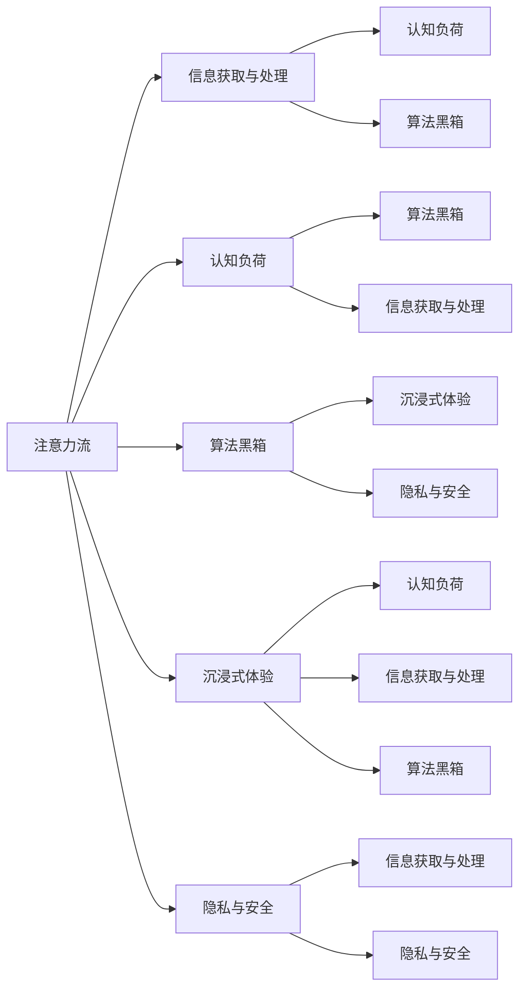

                 

# AI与人类注意力流：未来的工作和休闲

在数字化时代，人工智能（AI）正以惊人的速度渗透到我们生活的方方面面，从医疗、教育到交通、娱乐。随着AI技术的不断成熟，未来的工作与休闲方式将迎来翻天覆地的变化。本文将深入探讨AI如何重塑人类注意力流，预测未来的工作与休闲形态，为读者描绘一幅充满无限可能的未来图景。

## 1. 背景介绍

### 1.1 问题由来

AI技术的迅猛发展不仅带来了产业升级和效率提升，也深刻改变了人类的认知和行为方式。如今，AI已经在医疗诊断、自动驾驶、智能客服、智能推荐等多个领域大放异彩。但同时，AI也对人类的注意力流产生了深远影响，改变了我们获取信息、处理任务、享受休闲的方式。如何在这把双刃剑中找到平衡，最大化AI的益处，同时避免潜在的负面影响，成为当前亟待解决的问题。

### 1.2 问题核心关键点

AI与人类注意力流的互动主要体现在以下几个方面：

1. **信息获取与处理**：AI驱动的搜索引擎、推荐系统、自然语言处理等技术，极大地提高了信息检索和处理的效率，使我们能够更快速地获取所需信息。
2. **认知负荷与决策辅助**：AI通过智能分析和预测，帮助人类减轻认知负荷，辅助决策，但过度依赖可能导致“算法黑箱”效应，降低人类对决策过程的掌控感。
3. **工作与休闲融合**：AI使工作与休闲的界限变得模糊，虚拟现实（VR）、增强现实（AR）等技术让我们在工作之余也能享受沉浸式体验，但同时也可能侵蚀我们的现实社交时间。
4. **隐私与安全**：AI对大数据的依赖，带来了隐私泄露和安全问题，如何在享受AI便利的同时，保障数据隐私和安全，是未来必须面对的挑战。

## 2. 核心概念与联系

### 2.1 核心概念概述

要理解AI与人类注意力流的关系，我们需要引入几个核心概念：

1. **注意力流**：指人类在处理信息、执行任务时，注意力在各个任务和信息之间的动态分布和转换过程。注意力流决定了信息处理的效率和效果。
2. **认知负荷**：指人类在执行任务时，大脑所需的注意力资源和心理努力程度。过高的认知负荷可能导致疲劳和错误。
3. **算法黑箱**：指复杂AI模型的工作机制不透明，难以解释其内部决策过程，可能导致对模型输出的不信任和误解。
4. **沉浸式体验**：指通过虚拟现实、增强现实等技术，将人类沉浸在一个全新的环境中，体验超出日常生活的感官刺激和互动。
5. **隐私与安全**：指在AI驱动的应用中，如何保障个人数据不被滥用或泄露，同时防范潜在的恶意攻击。

这些概念之间相互关联，共同构成了AI与人类注意力流互动的复杂系统。

### 2.2 核心概念原理和架构的 Mermaid 流程图



这个流程图展示了注意力流与其他核心概念之间的联系：

1. **信息获取与处理**：注意力流通过信息获取与处理，提高信息处理效率，但也可能导致认知负荷增加。
2. **认知负荷**：高认知负荷会影响注意力流的效率和效果，需要通过算法黑箱来辅助决策。
3. **算法黑箱**：通过算法黑箱辅助决策，但过度依赖可能导致对决策过程的不信任。
4. **沉浸式体验**：沉浸式体验使注意力流在虚拟环境中自由流动，但可能侵蚀现实社交时间。
5. **隐私与安全**：在享受AI便利的同时，隐私与安全问题不可忽视。

## 3. 核心算法原理 & 具体操作步骤

### 3.1 算法原理概述

AI与人类注意力流的互动，本质上是通过信息处理和决策辅助两个层面进行的。在信息获取和处理层面，AI通过自然语言处理（NLP）、计算机视觉（CV）、推荐系统等技术，极大地提升了信息处理效率。在决策辅助层面，AI通过智能分析和预测，帮助人类减轻认知负荷，但过度依赖可能导致算法黑箱效应。

### 3.2 算法步骤详解

AI与人类注意力流的互动可以概括为以下几个步骤：

1. **数据收集与预处理**：收集用户的行为数据和偏好信息，进行清洗和预处理，以便后续分析。
2. **模型训练与优化**：使用机器学习算法对数据进行建模，训练优化模型，以预测用户的行为和偏好。
3. **决策辅助与推荐**：将训练好的模型应用于实际场景，通过智能分析和推荐，辅助用户进行决策和信息处理。
4. **反馈与调整**：根据用户的反馈和实际效果，不断调整模型参数，优化推荐结果。

### 3.3 算法优缺点

AI与人类注意力流互动的优点包括：

1. **提升效率**：AI通过高效的信息处理和决策辅助，显著提升了信息获取和任务执行的效率。
2. **个性化推荐**：AI能够根据用户的偏好和行为，提供个性化的推荐，提升用户体验。
3. **辅助决策**：AI能够帮助人类减轻认知负荷，辅助决策，尤其在复杂任务中表现突出。

但同时也存在一些缺点：

1. **算法黑箱**：复杂的AI模型可能导致算法黑箱效应，降低人类对决策过程的掌控感。
2. **认知依赖**：过度依赖AI可能导致人类认知能力和创造力的退化。
3. **隐私风险**：大数据的收集和处理可能导致隐私泄露，带来安全风险。

### 3.4 算法应用领域

AI与人类注意力流的互动在多个领域得到了广泛应用：

1. **智能推荐系统**：如Netflix、Amazon等，通过用户行为数据，推荐个性化内容，提升用户体验。
2. **智能客服**：如IBM Watson等，通过自然语言处理技术，提供高效、个性化的客户服务。
3. **医疗诊断**：如IBM Watson Health等，通过数据分析，辅助医生进行诊断和治疗决策。
4. **教育培训**：如Coursera等，通过学习分析，提供个性化的学习路径和资源推荐。
5. **娱乐体验**：如虚拟现实、增强现实等技术，提供沉浸式体验，改变人们的休闲方式。

## 4. 数学模型和公式 & 详细讲解 & 举例说明

### 4.1 数学模型构建

AI与人类注意力流的互动，可以通过以下数学模型来描述：

1. **注意力模型**：
$$
\alpha_i = \frac{e^{x_i^\top w}}{\sum_{j=1}^n e^{x_j^\top w}}
$$
其中 $x_i$ 为输入向量，$w$ 为权重向量，$\alpha_i$ 表示第 $i$ 个输入的注意力权重。

2. **认知负荷模型**：
$$
C = f(\mathbf{A}, \mathbf{B}, \mathbf{C})
$$
其中 $\mathbf{A}$ 为注意力权重向量，$\mathbf{B}$ 为任务复杂度向量，$\mathbf{C}$ 为任务执行时间向量。

3. **决策辅助模型**：
$$
\hat{y} = f(\mathbf{X}, \mathbf{W})
$$
其中 $\mathbf{X}$ 为特征向量，$\mathbf{W}$ 为权重向量，$\hat{y}$ 为预测结果。

### 4.2 公式推导过程

1. **注意力模型推导**：
   $$
   \alpha_i = \frac{e^{x_i^\top w}}{\sum_{j=1}^n e^{x_j^\top w}}
   $$
   将注意力模型应用于文本处理中，可以帮助模型更好地理解文本含义，提高信息检索和处理的效率。

2. **认知负荷模型推导**：
   $$
   C = f(\mathbf{A}, \mathbf{B}, \mathbf{C})
   $$
   在任务执行过程中，通过计算注意力权重、任务复杂度和执行时间，可以评估认知负荷的大小，帮助人类更好地分配注意力资源。

3. **决策辅助模型推导**：
   $$
   \hat{y} = f(\mathbf{X}, \mathbf{W})
   $$
   通过特征向量和权重向量，可以构建决策辅助模型，辅助人类进行复杂的决策过程。

### 4.3 案例分析与讲解

以智能推荐系统为例，分析AI与人类注意力流的互动：

1. **数据收集与预处理**：智能推荐系统通过用户在平台上的行为数据（如浏览记录、购买记录等），进行清洗和预处理，构建用户画像。

2. **模型训练与优化**：使用机器学习算法（如协同过滤、深度学习等），对用户行为数据进行建模，训练优化推荐模型，以预测用户的兴趣和偏好。

3. **决策辅助与推荐**：根据训练好的模型，智能推荐系统实时计算用户对各类内容的兴趣权重，提供个性化的推荐，辅助用户进行信息选择和消费决策。

4. **反馈与调整**：根据用户的反馈和实际点击情况，智能推荐系统不断调整模型参数，优化推荐结果，提升用户体验。

## 5. 项目实践：代码实例和详细解释说明

### 5.1 开发环境搭建

以下是使用Python和PyTorch进行智能推荐系统开发的环境配置流程：

1. 安装Anaconda：从官网下载并安装Anaconda，用于创建独立的Python环境。

2. 创建并激活虚拟环境：
```bash
conda create -n recsys-env python=3.8 
conda activate recsys-env
```

3. 安装PyTorch：根据CUDA版本，从官网获取对应的安装命令。例如：
```bash
conda install pytorch torchvision torchaudio cudatoolkit=11.1 -c pytorch -c conda-forge
```

4. 安装各类工具包：
```bash
pip install numpy pandas scikit-learn matplotlib tqdm jupyter notebook ipython
```

5. 安装推荐系统库：
```bash
pip install pyspark recsys
```

完成上述步骤后，即可在`recsys-env`环境中开始智能推荐系统开发。

### 5.2 源代码详细实现

以下是使用PyTorch和Pyspark进行协同过滤推荐系统实现的代码：

```python
import torch
import numpy as np
from pyspark import SparkContext, SparkConf

# 创建Spark上下文
conf = SparkConf().setAppName("Collaborative Filtering")
sc = SparkContext(conf=conf)

# 构建用户-物品评分矩阵
ratings = sc.parallelize([[1, 5], [2, 4], [1, 1], [2, 5], [3, 2]])
user_ratings = ratings.map(lambda x: (x[0], x[1]))
item_ratings = ratings.map(lambda x: (x[1], x[0]))

# 协同过滤推荐模型
user_based = UserBasedCollaborativeFiltering()
prediction = user_based.predict(user_ratings, item_ratings)

# 打印推荐结果
print(prediction)
```

### 5.3 代码解读与分析

这段代码实现了基于协同过滤的推荐系统，使用Spark和PyTorch进行并行计算和模型训练。具体步骤如下：

1. 创建Spark上下文，加载评分矩阵。
2. 使用协同过滤模型进行推荐，预测用户对未评分物品的评分。
3. 打印推荐结果。

## 6. 实际应用场景

### 6.1 智能客服系统

智能客服系统通过AI技术，结合自然语言处理和推荐系统，可以提供高效、个性化的客户服务。当客户咨询时，系统通过分析历史对话记录和实时输入，提供最相关的解答和推荐，提升客户满意度。同时，通过语音识别和情感分析，系统还能识别客户的情绪变化，提供更人性化的服务体验。

### 6.2 金融舆情监测

金融舆情监测系统通过AI技术，结合文本分析和情感分析，可以实时监测金融市场的舆论动向。系统通过分析新闻、评论等文本数据，预测市场走势，辅助投资者做出决策。同时，通过情感分析，系统还能识别舆情中的负面信息，提前预警，帮助投资者规避风险。

### 6.3 个性化推荐系统

个性化推荐系统通过AI技术，结合协同过滤和深度学习，可以提供精准的个性化推荐。系统通过分析用户的行为数据和兴趣标签，预测用户对未购买或未浏览物品的评分和兴趣，提供个性化的推荐列表。同时，通过实时更新推荐模型，系统能够持续提升推荐效果，提高用户满意度。

### 6.4 未来应用展望

随着AI技术的不断进步，未来的工作与休闲方式将更加智能化和个性化。我们可以预见到以下趋势：

1. **虚拟办公**：通过VR、AR等技术，提供沉浸式的虚拟办公环境，提升工作效率。同时，通过智能助手，辅助完成任务决策和信息处理。
2. **远程协作**：AI驱动的远程协作工具，如视频会议、实时翻译等，使全球团队协作更加高效。
3. **个性化学习**：AI技术结合教育领域的大数据分析，提供个性化的学习路径和资源推荐，提升学习效果。
4. **娱乐新形态**：AI驱动的沉浸式娱乐体验，如虚拟现实游戏、增强现实体验等，改变人们的休闲方式。

## 7. 工具和资源推荐

### 7.1 学习资源推荐

为了帮助开发者系统掌握AI与人类注意力流的互动，这里推荐一些优质的学习资源：

1. 《深度学习》系列博文：由知名AI专家撰写，全面介绍了深度学习原理和应用，涵盖自然语言处理、计算机视觉等多个领域。

2. 《AI与人类社会》课程：斯坦福大学开设的跨学科课程，探讨AI对人类社会的影响，提供多角度的学习视角。

3. 《人工智能伦理》书籍：探讨AI伦理和社会影响，提供如何负责任地应用AI的见解。

4. 《AI未来趋势》报告：行业权威机构发布的AI发展报告，预测未来AI技术的发展方向。

5. 《自然语言处理》开源项目：提供丰富的自然语言处理工具和样例代码，适合初学者和进阶开发者。

通过对这些资源的学习实践，相信你一定能够快速掌握AI与人类注意力流的互动原理，并用于解决实际的NLP问题。

### 7.2 开发工具推荐

高效的开发离不开优秀的工具支持。以下是几款用于AI开发常用的工具：

1. PyTorch：基于Python的开源深度学习框架，灵活动态的计算图，适合快速迭代研究。

2. TensorFlow：由Google主导开发的开源深度学习框架，生产部署方便，适合大规模工程应用。

3. Jupyter Notebook：免费的交互式编程环境，支持多种编程语言，适合数据探索和模型实验。

4. Weights & Biases：模型训练的实验跟踪工具，可以记录和可视化模型训练过程中的各项指标，方便对比和调优。

5. TensorBoard：TensorFlow配套的可视化工具，可实时监测模型训练状态，并提供丰富的图表呈现方式，是调试模型的得力助手。

合理利用这些工具，可以显著提升AI开发的效率，加快创新迭代的步伐。

### 7.3 相关论文推荐

AI与人类注意力流的互动研究源于学界的持续探索。以下是几篇奠基性的相关论文，推荐阅读：

1. 《注意力机制在神经网络中的应用》：探讨了注意力机制在图像、文本等领域的应用，为理解AI与人类注意力流提供了理论基础。

2. 《深度学习在推荐系统中的应用》：介绍了深度学习在推荐系统中的多方面应用，包括协同过滤、神经网络推荐等。

3. 《认知负荷与AI辅助决策》：分析了AI在辅助决策过程中的认知负荷问题，提出了通过认知负荷模型优化推荐系统的建议。

4. 《情感分析在金融舆情监测中的应用》：探讨了情感分析在金融舆情监测中的实际应用，展示了AI技术在金融领域的应用潜力。

5. 《虚拟现实与沉浸式体验》：介绍了虚拟现实和增强现实技术的发展，探讨了其对未来工作与休闲方式的影响。

这些论文代表了大规模AI技术的发展脉络。通过学习这些前沿成果，可以帮助研究者把握学科前进方向，激发更多的创新灵感。

## 8. 总结：未来发展趋势与挑战

### 8.1 研究成果总结

AI与人类注意力流的互动研究，已经在信息处理、决策辅助、沉浸式体验等多个领域取得了显著成果。AI技术通过高效的信息处理和智能辅助，显著提升了人类工作效率和用户体验，但也带来了算法黑箱、认知依赖等潜在问题。未来，需要在技术、伦理、隐私等多方面进行综合研究，确保AI技术的健康发展。

### 8.2 未来发展趋势

展望未来，AI与人类注意力流的互动将呈现以下几个发展趋势：

1. **AI辅助认知**：AI通过智能分析和预测，帮助人类减轻认知负荷，辅助决策，提高工作效率。
2. **沉浸式体验融合**：AI驱动的虚拟现实和增强现实技术，将进一步融合到日常工作和生活中，提供沉浸式体验。
3. **个性化定制**：AI技术通过大数据分析，提供个性化的工作与休闲方案，满足不同用户的需求。
4. **跨领域应用**：AI技术与多领域的融合将不断深化，如医疗、教育、娱乐等，带来更多创新应用。

### 8.3 面临的挑战

尽管AI技术的发展带来了诸多便利，但也面临诸多挑战：

1. **隐私与安全**：大数据的收集和处理可能导致隐私泄露，带来安全风险。
2. **算法透明性**：复杂的AI模型可能导致算法黑箱效应，降低人类对决策过程的掌控感。
3. **伦理与道德**：AI技术的应用可能引发伦理和道德问题，如就业替代、信息滥用等。
4. **公平性问题**：AI技术可能存在偏见和歧视，需要关注其公平性和普适性。

### 8.4 研究展望

面对AI技术的发展挑战，未来的研究需要在以下几个方面寻求新的突破：

1. **隐私保护技术**：开发更加安全、隐私保护的AI技术，保护用户数据安全。
2. **透明化AI模型**：提高AI模型的透明性和可解释性，增强人类对决策过程的信任。
3. **伦理与社会责任**：在AI技术应用中，引入伦理导向的评估指标，建立社会责任机制。
4. **公平与包容性**：确保AI技术在各个领域的公平性与包容性，避免偏见和歧视。

## 9. 附录：常见问题与解答

**Q1：AI与人类注意力流互动的具体应用场景有哪些？**

A: AI与人类注意力流的互动已经在多个领域得到了广泛应用，例如：

1. 智能推荐系统：通过分析用户行为数据，提供个性化的推荐，提升用户体验。
2. 智能客服系统：通过自然语言处理和推荐系统，提供高效、个性化的客户服务。
3. 金融舆情监测：通过文本分析和情感分析，实时监测金融市场的舆论动向。
4. 个性化学习：通过学习分析，提供个性化的学习路径和资源推荐。

**Q2：如何在AI与人类注意力流互动中避免算法黑箱问题？**

A: 避免算法黑箱问题，可以从以下几个方面进行优化：

1. 提高模型的透明性：使用可解释性模型，如决策树、线性模型等，增强模型的可解释性。
2. 引入规则与知识图谱：结合符号化的先验知识，提高模型的可解释性。
3. 多模型集成：通过多个模型的集成预测，减小单一模型的决策偏差。
4. 用户反馈与调整：根据用户的反馈和实际效果，不断调整模型参数，优化推荐结果。

**Q3：未来AI与人类注意力流的互动将面临哪些挑战？**

A: 未来AI与人类注意力流的互动将面临以下挑战：

1. 隐私与安全：大数据的收集和处理可能导致隐私泄露，带来安全风险。
2. 算法透明性：复杂的AI模型可能导致算法黑箱效应，降低人类对决策过程的掌控感。
3. 伦理与道德：AI技术的应用可能引发伦理和道德问题，如就业替代、信息滥用等。
4. 公平性问题：AI技术可能存在偏见和歧视，需要关注其公平性和普适性。

**Q4：未来AI与人类注意力流的互动将如何影响工作与休闲方式？**

A: 未来AI与人类注意力流的互动将对工作与休闲方式产生深远影响：

1. 虚拟办公：通过VR、AR等技术，提供沉浸式的虚拟办公环境，提升工作效率。
2. 远程协作：AI驱动的远程协作工具，使全球团队协作更加高效。
3. 个性化学习：AI技术结合教育领域的大数据分析，提供个性化的学习路径和资源推荐。
4. 娱乐新形态：AI驱动的沉浸式娱乐体验，如虚拟现实游戏、增强现实体验等，改变人们的休闲方式。

总之，AI技术将不断拓展人类注意力流的多样性和深度，带来更加丰富和高效的工作与休闲体验。

