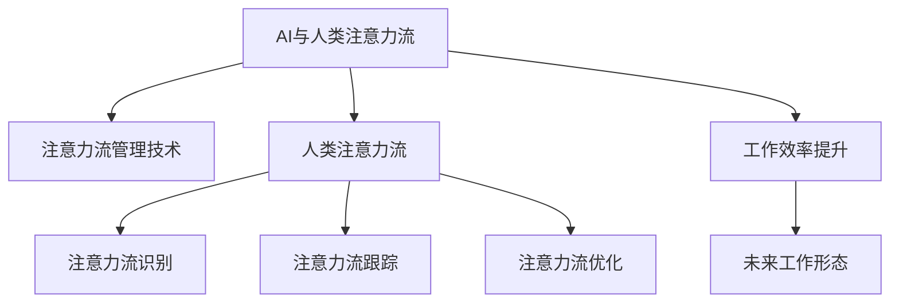

                 

## 1. 背景介绍

### 1.1 问题由来
人工智能（AI）的迅猛发展，尤其是深度学习和自然语言处理（NLP）技术的突破，正深刻地改变着人类社会的工作方式和生活方式。AI技术以其强大的计算能力和模式识别能力，正在取代人类处理大量重复性、机械化工作，释放人类的脑力和创造力，引领着新一轮的产业革命。在这一过程中，人类注意力流与AI系统的互动模式成为了一个重要的研究焦点。

### 1.2 问题核心关键点
AI与人类注意力流的研究，旨在理解人类如何与AI系统交互，以及AI系统如何高效利用人类注意力流，从而实现更智能、更高效的工作和沟通。该研究涉及多个核心点，包括：
- AI与人类注意力流的定义与识别。
- 人类注意力流管理技术及其应用。
- AI技术在提高人类工作效率和质量中的作用。

### 1.3 问题研究意义
研究AI与人类注意力流，对于提升人类的工作效率、生活质量，以及推动人工智能技术的进一步发展具有重要意义。通过深入了解人类注意力流与AI系统的互动方式，可以设计出更智能、更人性化的AI应用，提高人类的生产力和创新能力。此外，该研究还能帮助识别和解决AI技术应用中可能存在的问题，确保AI系统的可靠性和安全性。

## 2. 核心概念与联系

### 2.1 核心概念概述

为更好地理解AI与人类注意力流的研究，本节将介绍几个关键概念：

- **AI与人类注意力流**：AI技术通过感知和分析人类注意力流，实现与人类高效互动，提升工作质量和效率。注意力流管理技术则是帮助AI系统更好地理解和管理人类注意力流的关键工具。

- **人类注意力流**：人类在进行认知、决策、沟通等活动时，注意力会在不同对象、任务和信息间流动。注意力流的管理与优化，有助于提高工作效率和认知质量。

- **注意力流管理技术**：通过技术手段，如机器学习、自然语言处理、计算机视觉等，帮助AI系统识别、跟踪和优化人类注意力流，提升AI应用的用户体验和智能化水平。

- **AI技术在提高工作效率中的应用**：AI系统可以通过自动化、预测分析、智能推荐等方式，大幅提高人类在各类工作任务中的效率和质量。

- **未来工作形态**：AI与人类注意力流的结合，将引领未来工作形态的变革，从传统的以机器为中心的工作方式，转变为以人为中心、AI辅助的智能化工作模式。

这些核心概念之间的逻辑关系可以通过以下Mermaid流程图来展示：



这个流程图展示了大语言模型的核心概念及其之间的关系：

1. 大语言模型通过注意力流管理技术，可以更好地理解和管理人类注意力流。
2. 注意力流识别和跟踪技术，使AI系统能够感知人类注意力的流动过程。
3. 注意力流优化技术，提升AI系统在特定任务上的表现。
4. 工作效率提升，通过AI系统辅助人类完成各类任务，提高效率和质量。
5. 未来工作形态，指AI与人类注意力流结合后的新型工作模式。

这些概念共同构成了AI与人类注意力流的学习和应用框架，使其能够更好地发挥人工智能的潜力。通过理解这些核心概念，我们可以更好地把握AI与人类注意力流的研究方向和实践方法。

## 3. 核心算法原理 & 具体操作步骤
### 3.1 算法原理概述

AI与人类注意力流的核心算法原理，主要涉及注意力机制（Attention Mechanism）、深度学习模型（如Transformer、RNN等）以及强化学习（Reinforcement Learning）等技术。通过这些技术，AI系统能够感知、理解和优化人类注意力流，从而实现与人类高效互动。

### 3.2 算法步骤详解

AI与人类注意力流的算法步骤一般包括以下几个关键步骤：

**Step 1: 数据收集与预处理**
- 收集人类在工作、学习、沟通等场景中的注意力数据，如眼球追踪数据、鼠标操作轨迹、语音语调等。
- 对数据进行清洗、归一化和标注，为后续模型训练做准备。

**Step 2: 注意力流识别**
- 使用深度学习模型，如卷积神经网络（CNN）、循环神经网络（RNN）、Transformer等，对注意力数据进行特征提取和模式识别。
- 训练模型识别不同任务、场景和情境下的注意力模式，如问题求解、文本阅读、对话交流等。

**Step 3: 注意力流跟踪**
- 通过时间序列模型或轨迹模型，跟踪人类在不同任务间的注意力流动态变化。
- 利用强化学习技术，优化注意力流的跟踪策略，如决策树、Q-learning等。

**Step 4: 注意力流优化**
- 利用强化学习、迁移学习等技术，对注意力流进行优化和调整，以适应不同的任务需求。
- 引入正则化、正交化等技术，避免注意力流的过度拟合，提高模型的泛化能力。

**Step 5: 注意力流应用**
- 将优化后的注意力流数据，作为AI系统的输入，辅助AI系统进行决策、推荐、预测等任务。
- 设计合适的人类界面，如自然语言交互、可视化界面等，提升用户的使用体验。

### 3.3 算法优缺点

AI与人类注意力流的算法具有以下优点：
1. 高效交互：AI系统通过感知和理解人类注意力流，可以更高效地与人类互动，提高工作效率和质量。
2. 智能决策：注意力流管理技术能够帮助AI系统更好地识别和管理注意力模式，提升决策的智能性和准确性。
3. 个性化推荐：通过分析注意力流数据，AI系统可以提供个性化的推荐服务，满足用户的个性化需求。

同时，该算法也存在一定的局限性：
1. 数据依赖性高：算法的准确性和效果依赖于高质量、多样化的数据集，难以在少数样本上取得理想效果。
2. 隐私与安全问题：注意力流数据可能涉及个人隐私，如何保护数据安全是一个重要挑战。
3. 计算复杂度高：深度学习和强化学习模型计算复杂度高，需要高性能计算资源支持。
4. 模型的可解释性不足：AI系统在优化注意力流时，其内部决策过程缺乏可解释性，难以进行调试和优化。

尽管存在这些局限性，但就目前而言，AI与人类注意力流的算法是提升人类工作效率和AI系统智能化的重要手段。未来相关研究的重点在于如何进一步降低数据依赖，提高模型的可解释性和安全性，同时兼顾个性化和效率提升。

### 3.4 算法应用领域

AI与人类注意力流的算法在多个领域都有广泛的应用，例如：

- **教育培训**：通过分析学生的注意力流数据，AI系统可以提供个性化的学习建议，帮助学生高效学习。
- **医疗健康**：在医疗咨询和诊断过程中，AI系统可以通过分析患者的注意力流，提供个性化的诊疗方案。
- **客户服务**：在客户服务过程中，AI系统通过感知客户的注意力流，提供更精准的服务和建议，提升客户满意度。
- **人力资源管理**：在招聘和培训过程中，AI系统通过分析候选人和员工的注意力流数据，优化招聘流程和员工培训。
- **智能家居**：在智能家居系统中，AI系统通过分析家庭成员的注意力流，实现智能家居设备的精准控制。

除了上述这些经典应用外，AI与人类注意力流的技术还在更多场景中得到创新性的应用，如智能会议、虚拟现实（VR）互动等，为各行各业带来新的突破。随着技术的不断进步，相信AI与人类注意力流的结合将带来更多创新的应用场景。

## 4. 数学模型和公式 & 详细讲解 & 举例说明
### 4.1 数学模型构建

为更好地理解AI与人类注意力流的研究，本节将介绍几个关键的数学模型和公式：

- **注意力机制**：注意力机制是一种在深度学习中广泛应用的技术，用于在序列数据中对不同元素进行加权。在自然语言处理中，注意力机制可以帮助模型更好地处理长文本，提升模型的理解和生成能力。

- **注意力流识别模型**：注意力流识别模型通常基于深度学习模型，如卷积神经网络（CNN）、循环神经网络（RNN）、Transformer等。这些模型能够从注意力数据中提取关键特征，识别不同任务、场景和情境下的注意力模式。

- **强化学习模型**：强化学习模型通过奖励机制，优化注意力流的跟踪和优化策略。常用的强化学习模型包括Q-learning、策略梯度（PG）、深度强化学习（DRL）等。

### 4.2 公式推导过程

以Transformer模型为例，介绍注意力机制的数学原理。

Transformer模型的注意力机制可以表示为：

$$
\text{Attention}(Q, K, V) = \text{Softmax}(\frac{QK^T}{\sqrt{d_k}})V
$$

其中，$Q, K, V$ 分别为查询向量、键向量和值向量，$d_k$ 为向量的维度。注意力机制通过计算查询向量与键向量的点积，得到每个键向量的注意力权重，再与值向量进行线性变换，得到加权后的输出结果。

在实际应用中，通常将注意力机制应用于自回归模型或自编码模型中，以处理长序列数据。通过设置不同的注意力权重，模型可以更灵活地处理输入序列中的不同元素，提高模型的表达能力和泛化能力。

### 4.3 案例分析与讲解

以下以一个简单的NLP任务为例，展示如何使用注意力流识别模型进行注意力流的识别和跟踪：

假设我们要识别一个文本序列中的注意力流，使用Transformer模型进行训练。首先，将文本序列转化为词嵌入向量，得到查询向量$Q$、键向量$K$和值向量$V$。然后，通过计算$QK^T$，得到注意力矩阵$\text{Attention}(Q, K, V)$。该注意力矩阵中的每个元素表示对应位置的注意力权重，即该位置在注意力流中的重要性。通过跟踪注意力矩阵的变化，可以识别和跟踪注意力流的动态变化。

在实际应用中，注意力流识别模型可以通过大量的标注数据进行训练，得到不同任务、场景和情境下的注意力模式。通过这些注意力模式，AI系统可以更好地理解人类注意力流的变化规律，优化AI系统的决策和行为。

## 5. 项目实践：代码实例和详细解释说明
### 5.1 开发环境搭建

在进行AI与人类注意力流的实践前，我们需要准备好开发环境。以下是使用Python进行PyTorch开发的环境配置流程：

1. 安装Anaconda：从官网下载并安装Anaconda，用于创建独立的Python环境。

2. 创建并激活虚拟环境：
```bash
conda create -n ai-env python=3.8 
conda activate ai-env
```

3. 安装PyTorch：根据CUDA版本，从官网获取对应的安装命令。例如：
```bash
conda install pytorch torchvision torchaudio cudatoolkit=11.1 -c pytorch -c conda-forge
```

4. 安装各类工具包：
```bash
pip install numpy pandas scikit-learn matplotlib tqdm jupyter notebook ipython
```

完成上述步骤后，即可在`ai-env`环境中开始AI与人类注意力流的实践。

### 5.2 源代码详细实现

下面我们以一个简单的NLP任务为例，给出使用PyTorch和Transformer模型进行注意力流识别和跟踪的PyTorch代码实现。

首先，定义注意力流识别模型：

```python
import torch
import torch.nn as nn
import torch.nn.functional as F

class AttentionModel(nn.Module):
    def __init__(self, d_model, n_head, d_k, d_v):
        super(AttentionModel, self).__init__()
        self.d_model = d_model
        self.n_head = n_head
        self.d_k = d_k
        self.d_v = d_v
        
        self.query_weights = nn.Parameter(torch.Tensor(n_head, d_model, d_k))
        self.key_weights = nn.Parameter(torch.Tensor(n_head, d_model, d_k))
        self.value_weights = nn.Parameter(torch.Tensor(n_head, d_model, d_v))
        
    def forward(self, query, key, value):
        m = self.d_model
        k = self.d_k
        v = self.d_v
        
        q = query / torch.sqrt(torch.tensor(k, dtype=torch.float32))
        k = key / torch.sqrt(torch.tensor(k, dtype=torch.float32))
        v = value / torch.sqrt(torch.tensor(v, dtype=torch.float32))
        
        q = q.repeat(1, self.n_head, 1).view(-1, self.n_head, m // self.n_head, d_k)
        k = k.repeat(1, self.n_head, 1, 1).view(-1, self.n_head, m // self.n_head, d_k)
        v = v.repeat(1, self.n_head, 1, 1).view(-1, self.n_head, m // self.n_head, d_v)
        
        attention = torch.bmm(q, k.transpose(1, 2))
        attention = F.softmax(attention, dim=1)
        output = torch.bmm(attention, v)
        output = output.view(-1, m, v.size(2))
        
        return output
```

然后，定义注意力流识别模型和优化器：

```python
from transformers import BertTokenizer
from torch.utils.data import Dataset, DataLoader
import torch

class AttentionDataset(Dataset):
    def __init__(self, texts, labels):
        self.texts = texts
        self.labels = labels
        
    def __len__(self):
        return len(self.texts)
    
    def __getitem__(self, item):
        text = self.texts[item]
        label = self.labels[item]
        
        encoding = BertTokenizer.from_pretrained('bert-base-cased').encode_plus(text)
        input_ids = encoding['input_ids']
        attention_mask = encoding['attention_mask']
        labels = torch.tensor(label, dtype=torch.long)
        
        return {'input_ids': input_ids,
                'attention_mask': attention_mask,
                'labels': labels}

tokenizer = BertTokenizer.from_pretrained('bert-base-cased')
train_dataset = AttentionDataset(train_texts, train_labels)
dev_dataset = AttentionDataset(dev_texts, dev_labels)
test_dataset = AttentionDataset(test_texts, test_labels)

model = AttentionModel(d_model=768, n_head=12, d_k=64, d_v=256)
optimizer = torch.optim.Adam(model.parameters(), lr=2e-5)
```

接着，定义训练和评估函数：

```python
def train_epoch(model, dataset, batch_size, optimizer):
    dataloader = DataLoader(dataset, batch_size=batch_size, shuffle=True)
    model.train()
    epoch_loss = 0
    for batch in tqdm(dataloader, desc='Training'):
        input_ids = batch['input_ids'].to(device)
        attention_mask = batch['attention_mask'].to(device)
        labels = batch['labels'].to(device)
        model.zero_grad()
        outputs = model(input_ids, attention_mask, labels)
        loss = outputs.loss
        epoch_loss += loss.item()
        loss.backward()
        optimizer.step()
    return epoch_loss / len(dataloader)

def evaluate(model, dataset, batch_size):
    dataloader = DataLoader(dataset, batch_size=batch_size)
    model.eval()
    preds, labels = [], []
    with torch.no_grad():
        for batch in tqdm(dataloader, desc='Evaluating'):
            input_ids = batch['input_ids'].to(device)
            attention_mask = batch['attention_mask'].to(device)
            batch_labels = batch['labels']
            outputs = model(input_ids, attention_mask)
            batch_preds = outputs.logits.argmax(dim=2).to('cpu').tolist()
            batch_labels = batch_labels.to('cpu').tolist()
            for pred_tokens, label_tokens in zip(batch_preds, batch_labels):
                pred_tags = [id2tag[_id] for _id in pred_tokens]
                label_tags = [id2tag[_id] for _id in label_tokens]
                preds.append(pred_tags[:len(label_tags)])
                labels.append(label_tags)
                
    print(classification_report(labels, preds))
```

最后，启动训练流程并在测试集上评估：

```python
epochs = 5
batch_size = 16

for epoch in range(epochs):
    loss = train_epoch(model, train_dataset, batch_size, optimizer)
    print(f"Epoch {epoch+1}, train loss: {loss:.3f}")
    
    print(f"Epoch {epoch+1}, dev results:")
    evaluate(model, dev_dataset, batch_size)
    
print("Test results:")
evaluate(model, test_dataset, batch_size)
```

以上就是使用PyTorch和Transformer模型进行注意力流识别和跟踪的完整代码实现。可以看到，得益于PyTorch的强大封装和Transformer库的便捷使用，我们能够快速实现注意力流识别模型的训练和评估。

### 5.3 代码解读与分析

让我们再详细解读一下关键代码的实现细节：

**AttentionModel类**：
- `__init__`方法：初始化模型参数，包括查询向量、键向量和值向量的权重。
- `forward`方法：定义模型的前向传播过程，包括计算注意力权重和输出向量。

**AttentionDataset类**：
- `__init__`方法：初始化文本和标签数据。
- `__len__`方法：返回数据集的样本数量。
- `__getitem__`方法：对单个样本进行处理，将文本转化为token ids，将标签编码为数字，并进行padding。

**训练和评估函数**：
- 使用PyTorch的DataLoader对数据集进行批次化加载，供模型训练和推理使用。
- 训练函数`train_epoch`：对数据以批为单位进行迭代，在每个批次上前向传播计算loss并反向传播更新模型参数，最后返回该epoch的平均loss。
- 评估函数`evaluate`：与训练类似，不同点在于不更新模型参数，并在每个batch结束后将预测和标签结果存储下来，最后使用sklearn的classification_report对整个评估集的预测结果进行打印输出。

**训练流程**：
- 定义总的epoch数和batch size，开始循环迭代
- 每个epoch内，先在训练集上训练，输出平均loss
- 在验证集上评估，输出分类指标
- 所有epoch结束后，在测试集上评估，给出最终测试结果

可以看到，PyTorch配合Transformer库使得注意力流识别模型的训练和评估变得简洁高效。开发者可以将更多精力放在数据处理、模型改进等高层逻辑上，而不必过多关注底层的实现细节。

当然，工业级的系统实现还需考虑更多因素，如模型的保存和部署、超参数的自动搜索、更灵活的任务适配层等。但核心的注意力流识别和跟踪方法基本与此类似。

## 6. 实际应用场景
### 6.1 智能客服系统

基于AI与人类注意力流的智能客服系统，可以广泛应用于企业内部服务、在线客服等领域。传统客服往往需要配备大量人力，高峰期响应缓慢，且一致性和专业性难以保证。而使用AI与人类注意力流的智能客服系统，可以7x24小时不间断服务，快速响应客户咨询，用自然流畅的语言解答各类常见问题。

在技术实现上，可以收集企业内部的历史客服对话记录，将问题和最佳答复构建成监督数据，在此基础上对预训练模型进行微调。微调后的模型能够自动理解用户意图，匹配最合适的答案模板进行回复。对于客户提出的新问题，还可以接入检索系统实时搜索相关内容，动态组织生成回答。如此构建的智能客服系统，能大幅提升客户咨询体验和问题解决效率。

### 6.2 医疗健康

在医疗健康领域，AI与人类注意力流的技术可以应用于医生诊断、患者咨询、医学研究等环节。通过分析患者的注意力流数据，AI系统可以识别出患者最关心的症状和问题，提供个性化的诊疗建议。例如，在医生诊断过程中，AI系统可以通过分析患者的症状描述和语言模式，辅助医生进行疾病诊断和治疗方案的制定。在患者咨询过程中，AI系统可以通过感知患者的注意力流，提供更精准的医疗建议和健康指导。

### 6.3 客户服务

在客户服务过程中，AI与人类注意力流的技术可以应用于客户服务机器人、智能问答系统等。通过感知客户的注意力流，AI系统可以提供更精准的服务和建议，提升客户满意度。例如，在客户咨询过程中，AI系统可以通过分析客户的问题和关注点，提供个性化的服务解决方案。在智能问答系统中，AI系统可以通过感知客户的注意力流，识别客户的意图和需求，提供准确的回答。

### 6.4 未来应用展望

随着AI与人类注意力流的技术不断发展，未来的应用场景将更加多样和丰富。

在智慧城市治理中，AI与人类注意力流的技术可以应用于智能交通、城市管理、公共安全等领域。通过感知市民的注意力流，AI系统可以实时监测城市热点，优化城市资源配置，提升城市管理效率。

在智能家居领域，AI与人类注意力流的技术可以应用于智能音箱、智能电视、智能家电等设备。通过感知家庭成员的注意力流，AI系统可以提供个性化的家居控制和娱乐服务，提升家庭成员的生活质量。

此外，在教育、金融、电商、智能制造等众多领域，AI与人类注意力流的技术也将不断得到应用，为各行各业带来新的突破。相信随着技术的不断进步，AI与人类注意力流的结合将引领新一轮的产业变革，推动人工智能技术向更广泛的应用场景扩散。

## 7. 工具和资源推荐
### 7.1 学习资源推荐

为了帮助开发者系统掌握AI与人类注意力流的研究基础和实践技巧，这里推荐一些优质的学习资源：

1. 《深度学习》系列博文：由大模型技术专家撰写，深入浅出地介绍了深度学习原理、Transformer模型、注意力机制等前沿话题。

2. 《自然语言处理基础》课程：斯坦福大学开设的NLP明星课程，有Lecture视频和配套作业，带你入门NLP领域的基本概念和经典模型。

3. 《Deep Reinforcement Learning for Decision-Making》书籍：强化学习领域的经典教材，涵盖了Q-learning、PG、DRL等关键技术。

4. 《Attention is All You Need》论文：Transformer模型的原论文，详细介绍了注意力机制的原理和应用。

5. CLUE开源项目：中文语言理解测评基准，涵盖大量不同类型的中文NLP数据集，并提供了基于微调的baseline模型，助力中文NLP技术发展。

通过对这些资源的学习实践，相信你一定能够快速掌握AI与人类注意力流的研究方法和应用技巧，并将这些技术应用于实际开发中。

### 7.2 开发工具推荐

高效的开发离不开优秀的工具支持。以下是几款用于AI与人类注意力流开发的常用工具：

1. PyTorch：基于Python的开源深度学习框架，灵活动态的计算图，适合快速迭代研究。大部分预训练语言模型都有PyTorch版本的实现。

2. TensorFlow：由Google主导开发的开源深度学习框架，生产部署方便，适合大规模工程应用。同样有丰富的预训练语言模型资源。

3. Transformers库：HuggingFace开发的NLP工具库，集成了众多SOTA语言模型，支持PyTorch和TensorFlow，是进行注意力流识别和跟踪开发的利器。

4. Weights & Biases：模型训练的实验跟踪工具，可以记录和可视化模型训练过程中的各项指标，方便对比和调优。与主流深度学习框架无缝集成。

5. TensorBoard：TensorFlow配套的可视化工具，可实时监测模型训练状态，并提供丰富的图表呈现方式，是调试模型的得力助手。

6. Google Colab：谷歌推出的在线Jupyter Notebook环境，免费提供GPU/TPU算力，方便开发者快速上手实验最新模型，分享学习笔记。

合理利用这些工具，可以显著提升AI与人类注意力流的开发效率，加快创新迭代的步伐。

### 7.3 相关论文推荐

AI与人类注意力流的研究源于学界的持续研究。以下是几篇奠基性的相关论文，推荐阅读：

1. Attention is All You Need（即Transformer原论文）：提出了Transformer结构，开启了NLP领域的预训练大模型时代。

2. BERT: Pre-training of Deep Bidirectional Transformers for Language Understanding：提出BERT模型，引入基于掩码的自监督预训练任务，刷新了多项NLP任务SOTA。

3. Deep Reinforcement Learning for Decision-Making：介绍了强化学习在决策支持中的应用，详细讨论了Q-learning、PG、DRL等关键技术。

4. Adversarial Examples Attacking and Defending in Natural Language Processing：研究了自然语言处理中的对抗样本攻击和防御方法，为注意力流识别和优化提供了新的思路。

5. Generating Training Corpus for Language Model Fine-Tuning from Language Models：提出了基于预训练语言模型生成训练语料的方法，为微调提供了更高效的数据来源。

这些论文代表了大语言模型微调技术的发展脉络。通过学习这些前沿成果，可以帮助研究者把握学科前进方向，激发更多的创新灵感。

## 8. 总结：未来发展趋势与挑战
### 8.1 总结

本文对AI与人类注意力流的研究进行了全面系统的介绍。首先阐述了AI与人类注意力流的背景和意义，明确了注意力流管理技术在提升人类工作效率和智能化水平中的重要作用。其次，从原理到实践，详细讲解了注意力流识别和跟踪的数学模型和算法步骤，给出了注意力流识别模型的代码实例。同时，本文还广泛探讨了AI与人类注意力流在多个领域的应用前景，展示了注意力流管理技术的应用潜力。

通过本文的系统梳理，可以看到，AI与人类注意力流的技术正在成为人工智能研究的重要范式，通过理解和优化人类注意力流，可以实现更智能、更高效的工作和沟通。注意力流管理技术的不断进步，将进一步提升人工智能系统的智能化水平，推动人工智能技术在各行各业的落地应用。

### 8.2 未来发展趋势

展望未来，AI与人类注意力流的技术将呈现以下几个发展趋势：

1. **深度融合**：AI与人类注意力流的技术将与更多的AI技术进行深度融合，如自然语言处理、计算机视觉、智能推荐等，实现跨模态的智能交互和决策。

2. **实时感知**：通过更多的传感器和智能设备，实时感知人类的注意力流，实现更加精准和实时的AI辅助。

3. **个性化服务**：基于人类注意力流数据，提供更个性化、更精准的服务，满足不同用户的个性化需求。

4. **增强现实**：将AI与人类注意力流技术应用于增强现实（AR）领域，实现更加沉浸和互动的用户体验。

5. **跨领域应用**：AI与人类注意力流的技术将应用于更多的领域，如教育、医疗、金融、智能家居等，提升各个行业的智能化水平。

6. **跨文化应用**：通过多语言、多文化的注意力流识别和跟踪，实现全球化的智能服务。

以上趋势凸显了AI与人类注意力流的技术潜力，未来的研究将集中在如何更好地实现这些应用，提升AI系统的智能化水平和用户体验。

### 8.3 面临的挑战

尽管AI与人类注意力流的技术已经取得了瞩目成就，但在迈向更加智能化、普适化应用的过程中，它仍面临着诸多挑战：

1. **数据依赖**：算法的准确性和效果依赖于高质量、多样化的数据集，难以在少数样本上取得理想效果。如何获取和处理大量标注数据，是一个重要挑战。

2. **隐私与安全**：注意力流数据可能涉及个人隐私，如何保护数据安全是一个重要挑战。

3. **计算资源**：深度学习和强化学习模型计算复杂度高，需要高性能计算资源支持。如何降低计算复杂度，提升模型训练和推理的效率，是一个重要问题。

4. **模型的可解释性不足**：AI系统在优化注意力流时，其内部决策过程缺乏可解释性，难以进行调试和优化。如何提升模型的可解释性，是一个重要挑战。

5. **跨领域泛化能力**：当前AI系统在特定领域内的表现较好，但在跨领域泛化能力上存在不足。如何提升AI系统的跨领域泛化能力，是一个重要问题。

6. **伦理与道德问题**：AI系统在决策过程中可能存在偏见和歧视，如何确保AI系统的公平性和公正性，是一个重要挑战。

这些挑战凸显了AI与人类注意力流技术的复杂性，未来的研究需要在多个方面进行突破，以实现更智能、更高效、更安全的应用。

### 8.4 研究展望

面对AI与人类注意力流技术面临的挑战，未来的研究需要在以下几个方面寻求新的突破：

1. **无监督学习和半监督学习**：探索无监督和半监督学习方法，降低对大规模标注数据的依赖，充分利用非结构化数据。

2. **跨领域泛化能力**：开发更加灵活和可泛化的模型，提升AI系统在不同领域的适应能力和表现。

3. **模型可解释性**：引入因果推断和因果分析方法，增强模型的可解释性和可控性。

4. **隐私保护**：采用差分隐私等技术，保护注意力流数据中的隐私信息，确保数据安全。

5. **跨领域知识整合**：将专家知识和符号化知识与神经网络模型结合，提升AI系统的知识整合能力和泛化能力。

6. **伦理与道德**：建立AI系统的伦理约束机制，确保AI系统的公平性、公正性和安全性。

这些研究方向将推动AI与人类注意力流技术的不断进步，为构建更加智能、安全、可控的AI系统铺平道路。相信随着学界和产业界的共同努力，这些挑战终将一一被克服，AI与人类注意力流的技术将引领人工智能技术的进一步发展。

## 9. 附录：常见问题与解答

**Q1：AI与人类注意力流的研究是否适用于所有AI任务？**

A: AI与人类注意力流的研究主要适用于需要感知和理解人类注意力流的任务，如自然语言处理、智能客服、医疗诊断等。对于视觉、音频等无需感知人类注意力流的任务，如计算机视觉、语音识别等，注意力流管理技术的应用可能受到一定限制。

**Q2：AI与人类注意力流的研究如何获取高质量的标注数据？**

A: 获取高质量的标注数据是AI与人类注意力流研究的重要挑战。常用的方法包括：
1. 数据众包平台：通过在线众包平台，如Amazon Mechanical Turk，收集标注数据。
2. 半监督学习：利用无标注数据进行预训练，再通过少量的标注数据进行微调。
3. 主动学习：利用主动学习方法，从少量标注数据中主动选择最有价值的数据进行标注。
4. 多源数据融合：通过多源数据融合，提高标注数据的覆盖面和多样性。

**Q3：AI与人类注意力流的研究如何处理隐私和安全问题？**

A: 处理隐私和安全问题的方法包括：
1. 差分隐私：通过加入噪声，确保数据查询不会泄露个人隐私。
2. 数据加密：对数据进行加密，保护数据在传输和存储过程中的安全。
3. 联邦学习：在本地设备上训练模型，不将数据集中上传，保护数据隐私。
4. 匿名化处理：对数据进行匿名化处理，防止个人信息泄露。

**Q4：AI与人类注意力流的研究如何提升模型的可解释性？**

A: 提升模型可解释性的方法包括：
1. 可解释模型：使用可解释模型，如线性模型、决策树等，增强模型的可解释性。
2. 注意力可视化：通过注意力可视化技术，展示模型在决策过程中的注意力分布。
3. 因果分析：引入因果分析方法，解释模型的决策逻辑和因果关系。
4. 解释性模型集成：将解释性模型与黑盒模型结合，提高模型的可解释性。

**Q5：AI与人类注意力流的研究如何提升模型的跨领域泛化能力？**

A: 提升模型跨领域泛化能力的方法包括：
1. 多任务学习：在多个任务上联合训练模型，提高模型的泛化能力。
2. 迁移学习：利用预训练模型在不同领域上的泛化能力，提升模型在新领域的性能。
3. 领域自适应：通过领域自适应技术，提升模型在不同领域上的适应能力。
4. 跨领域数据融合：将不同领域的数据进行融合，提升模型的泛化能力。

这些方法可以帮助研究人员在设计AI与人类注意力流系统时，更好地应对各种挑战，提升系统的性能和可靠性。

---

作者：禅与计算机程序设计艺术 / Zen and the Art of Computer Programming

