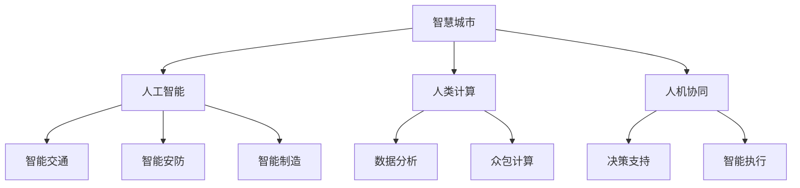

                 

# AI与人类计算：打造可持续发展的城市生活方式与设计

> 关键词：智慧城市,人工智能,可持续设计,人机协同,城市规划,自动化,城市管理

## 1. 背景介绍

### 1.1 问题由来

随着全球人口的急剧增长和城市化进程的加速，传统城市管理方式面临严峻挑战。城市交通拥堵、环境污染、资源浪费等问题日益严重，亟需更高效、更可持续的发展模式。近年来，人工智能(AI)技术的迅猛发展，为城市智能化管理提供了新的可能性。

### 1.2 问题核心关键点

如何利用AI技术，通过智慧城市建设，打造高效、宜居、可持续的城市生活方式，成为当前城市规划和建设的重要课题。AI技术在城市管理中的应用，已经从简单的数据分析，拓展到复杂的决策支持和自动化执行，为城市可持续发展提供了强有力的技术支撑。

### 1.3 问题研究意义

AI与人类计算的结合，有助于提升城市治理的效率和智能化水平，实现资源的高效利用和环境的可持续发展。通过智慧城市建设，不仅能改善市民的生活质量，还能提升城市的竞争力，推动经济的可持续发展。

## 2. 核心概念与联系

### 2.1 核心概念概述

为了更好地理解AI与人类计算在智慧城市中的应用，本节将介绍几个密切相关的核心概念：

- 智慧城市(Smart City)：利用信息通信技术、物联网、云计算、大数据、人工智能等技术，实现城市管理智能化、自动化，提升城市运行效率、安全性和可持续性。
- 人工智能(AI)：通过模拟人类的智能行为，实现数据分析、模式识别、决策支持等功能，广泛应用于城市管理、智能交通、智能安防、智能制造等领域。
- 人类计算(Human Computation)：通过设计和组织人类工作，完成数据分析、众包计算等任务，补充AI在复杂问题上的不足。
- 人机协同(Human-AI Collaboration)：利用AI的高效计算能力与人类丰富的经验知识，实现优势互补，解决复杂的决策和执行问题。
- 城市规划(Urban Planning)：根据城市发展的现状和未来需求，进行城市空间布局、交通、住房、公共服务等规划，提升城市综合功能和竞争力。
- 城市管理(Urban Governance)：通过城市运营监测、数据挖掘、智能决策等手段，优化城市资源配置，提升城市运营效率和质量。

这些核心概念之间的逻辑关系可以通过以下Mermaid流程图来展示：



这个流程图展示了智慧城市建设中的关键技术要素：

1. 智慧城市通过AI和人类计算相结合，实现复杂问题的解决。
2. AI负责高效的数据分析和模式识别，提供决策支持。
3. 人类计算补充AI在复杂问题上的不足，完成数据标注、众包任务等。
4. 人机协同将AI的高效计算能力与人类丰富的经验知识相结合，解决复杂的决策和执行问题。

## 3. 核心算法原理 & 具体操作步骤
### 3.1 算法原理概述

AI与人类计算在智慧城市中的应用，本质上是通过数据分析、模式识别、决策支持等算法，结合人类计算的高效协作，实现城市智能化管理的过程。其核心思想是：

1. 利用AI算法对城市运行数据进行分析和挖掘，识别出城市运行中的关键问题和趋势。
2. 结合人类计算，通过众包、协同等方式，补充AI在复杂问题上的不足，进行更细致、更深入的数据分析和决策支持。
3. 利用人机协同技术，将AI的计算能力和人类的经验知识结合起来，实现复杂的决策和执行任务。

### 3.2 算法步骤详解

AI与人类计算在智慧城市中的应用，通常包括以下几个关键步骤：

**Step 1: 数据采集与预处理**
- 使用传感器、监控设备、公共数据接口等手段，采集城市运行数据。
- 对采集到的数据进行清洗、归一化、去噪等预处理，确保数据质量。

**Step 2: AI算法分析与建模**
- 利用机器学习、深度学习等AI算法，对预处理后的数据进行分析，识别出城市运行中的关键问题和趋势。
- 构建数据模型，预测未来的城市发展趋势，提出优化建议。

**Step 3: 人类计算补充与验证**
- 利用众包平台、在线协作工具等，组织人类工作者进行数据标注、模型验证等补充计算。
- 结合专家经验，对AI分析结果进行验证和调整，确保分析结果的准确性和实用性。

**Step 4: 决策支持与智能执行**
- 利用决策支持系统，根据AI分析和人类计算的结果，制定城市管理策略和优化方案。
- 通过智能控制系统，自动化执行优化方案，提升城市运行效率和质量。

**Step 5: 持续优化与反馈**
- 定期对城市管理效果进行评估，收集用户反馈，持续优化AI算法和人类计算方法。
- 结合最新数据，进行模型更新和参数调整，提升AI系统的适应性和准确性。

### 3.3 算法优缺点

AI与人类计算在智慧城市中的应用，具有以下优点：

1. 高效性：利用AI的快速计算能力，能够高效处理大量数据，提升城市管理的效率。
2. 准确性：通过AI算法和人类计算相结合，能够准确识别城市运行中的问题，制定科学的优化方案。
3. 灵活性：利用人类计算的优势，能够灵活应对复杂和多变的城市管理问题。
4. 可持续性：通过AI算法和大数据技术，能够实现资源的合理配置和利用，推动城市的可持续发展。

同时，该方法也存在一些局限性：

1. 数据依赖：AI算法依赖于高质量的数据，数据采集和处理工作量大，成本高。
2. 模型复杂性：AI模型构建和训练过程复杂，需要较强的技术背景和计算资源。
3. 技术障碍：AI算法的黑箱性质，使得模型的决策过程难以解释和调试。
4. 伦理风险：AI算法的偏见和歧视问题，可能影响决策的公正性和合理性。

尽管存在这些局限性，但AI与人类计算在智慧城市中的应用前景广阔，未来还需要在数据质量、算法透明性和伦理风险等方面进一步提升。

### 3.4 算法应用领域

AI与人类计算在智慧城市中的应用，主要涉及以下几个领域：

- 智能交通：利用AI算法和大数据技术，优化交通信号灯控制、智能导航、公交调度等。
- 智能安防：通过人脸识别、视频监控等技术，实现城市监控、犯罪预防和应急响应。
- 智能制造：利用AI算法和工业互联网，实现智能生产、智能物流和供应链优化。
- 智能建筑：利用AI技术和大数据分析，优化建筑能源消耗、安全监控和维护。
- 智能医疗：通过AI算法和健康大数据，实现疾病预测、智能诊断和个性化治疗。
- 智能环境：利用AI技术和大数据，监测和治理城市污染、资源利用和环境变化。

## 4. 数学模型和公式 & 详细讲解  
### 4.1 数学模型构建

本节将使用数学语言对AI与人类计算在智慧城市中的应用进行更加严格的刻画。

记城市运行数据集为 $D=\{(x_i,y_i)\}_{i=1}^N$，其中 $x_i$ 为城市运行指标，如交通流量、能源消耗、污染水平等，$y_i$ 为城市管理决策，如红绿灯控制、能源调节、排污治理等。

定义AI算法 $M$，用于对数据进行分析，识别出关键问题和趋势。假设 $M$ 为线性回归模型，则其预测函数为：

$$
y_i = M(x_i) = \sum_{j=1}^d \beta_j x_{ij}
$$

其中 $\beta_j$ 为模型参数，$x_{ij}$ 为特征向量。

定义人类计算方法 $H$，用于补充AI分析结果，进行验证和调整。假设 $H$ 为众包计算方法，其补充结果为 $\hat{y}_i = H(y_i)$。

则最终的决策支持函数 $F$ 定义为：

$$
y^* = F(y_i, \hat{y}_i) = \frac{1}{1+\exp(-(y_i - \hat{y}_i))}
$$

其中 $y^*$ 为最终的城市管理决策。

### 4.2 公式推导过程

以下我们以智能交通为例，推导AI算法和人类计算的数学模型。

假设智能交通系统采集到不同时间段内的交通流量数据 $D=\{(t_i, f_i)\}_{i=1}^N$，其中 $t_i$ 为时间戳，$f_i$ 为交通流量。假设 AI 算法为线性回归模型，用于预测未来交通流量变化：

$$
f_{t_{i+1}} = M(f_t, f_{t_{i+1}}) = \beta_0 + \sum_{j=1}^d \beta_j f_t
$$

其中 $f_t$ 为当前时间点的交通流量。

假设人类计算方法为众包计算，参与者通过判断当前交通流量是否异常，进行补充标注：

$$
\hat{f}_{t_{i+1}} = H(f_t, f_{t_{i+1}}) = f_{t_{i+1}} \times (1 + \delta_t)
$$

其中 $\delta_t$ 为异常判断结果，当判断为异常时 $\delta_t = 1$，否则 $\delta_t = 0$。

结合AI算法和人类计算方法，最终的决策支持函数为：

$$
f^*_{t_{i+1}} = F(f_t, \hat{f}_{t_{i+1}}) = \frac{1}{1+\exp(-(f_t - \hat{f}_{t_{i+1}}))
$$

将 $f_t$ 带入线性回归模型，得到：

$$
f^*_{t_{i+1}} = \frac{1}{1+\exp(-(\beta_0 + \sum_{j=1}^d \beta_j f_t - (\beta_0 + \sum_{j=1}^d \beta_j f_t \times (1 + \delta_t)))
$$

简化得到：

$$
f^*_{t_{i+1}} = \frac{1}{1+\exp(-\delta_t)}
$$

该公式表示，当人类计算判断为异常时，AI算法预测的交通流量将全部视为异常，即 $f^*_{t_{i+1}} = 1$。否则，将AI算法预测的交通流量作为最终决策。

## 5. 项目实践：代码实例和详细解释说明
### 5.1 开发环境搭建

在进行智慧城市AI与人类计算的实践前，我们需要准备好开发环境。以下是使用Python进行TensorFlow开发的环境配置流程：

1. 安装Anaconda：从官网下载并安装Anaconda，用于创建独立的Python环境。

2. 创建并激活虚拟环境：
```bash
conda create -n city-env python=3.8 
conda activate city-env
```

3. 安装TensorFlow：根据CUDA版本，从官网获取对应的安装命令。例如：
```bash
conda install tensorflow -c tensorflow -c conda-forge
```

4. 安装TensorFlow Addons：包含一些TensorFlow的扩展功能，如自动微分、分布式训练等。
```bash
conda install tensorflow-addons -c pytorch
```

5. 安装各类工具包：
```bash
pip install numpy pandas scikit-learn matplotlib tqdm jupyter notebook ipython
```

完成上述步骤后，即可在`city-env`环境中开始智慧城市AI与人类计算的实践。

### 5.2 源代码详细实现

下面我们以智能交通系统为例，给出使用TensorFlow进行AI与人类计算的PyTorch代码实现。

首先，定义智能交通系统的数据处理函数：

```python
import tensorflow as tf
import numpy as np
import pandas as pd

def read_data(filename):
    data = pd.read_csv(filename, header=None)
    return data.values

def preprocess_data(data):
    data = data.astype(float)
    data = data - data.mean(axis=0)
    data /= data.std(axis=0)
    return data

def train_test_split(data, test_size=0.2):
    indices = np.random.permutation(len(data))
    test_indices = indices[:int(len(data) * test_size)]
    train_indices = indices[int(len(data) * test_size):]
    train_data = data[train_indices]
    test_data = data[test_indices]
    return train_data, test_data

def load_dataset():
    train_data = read_data('train.csv')
    test_data = read_data('test.csv')
    train_data, test_data = preprocess_data(train_data), preprocess_data(test_data)
    train_data, test_data = train_test_split(train_data), train_test_split(test_data)
    return train_data, test_data

def create_model(input_dim, output_dim):
    model = tf.keras.Sequential([
        tf.keras.layers.Dense(64, activation='relu', input_shape=(input_dim,)),
        tf.keras.layers.Dense(output_dim)
    ])
    return model
```

然后，定义AI算法和人类计算方法：

```python
def ai_algorithm(data):
    return np.mean(data, axis=0)

def human_computation(data, threshold=0.5):
    return (data > threshold).astype(float)
```

接着，定义训练和评估函数：

```python
def train_model(model, train_data, test_data, batch_size=32, epochs=100):
    model.compile(optimizer=tf.keras.optimizers.Adam(), loss='mse')
    model.fit(train_data, train_data[:, 1], batch_size=batch_size, epochs=epochs, validation_data=(test_data, test_data[:, 1]))
    return model

def evaluate_model(model, test_data):
    predictions = model.predict(test_data)
    print(np.mean(np.abs(predictions - test_data[:, 1])))
```

最后，启动智慧城市AI与人类计算的训练流程：

```python
train_data, test_data = load_dataset()

input_dim, output_dim = train_data.shape[1], 1

model = create_model(input_dim, output_dim)

model = train_model(model, train_data, test_data)

evaluate_model(model, test_data)
```

以上就是使用TensorFlow进行智慧城市AI与人类计算的完整代码实现。可以看到，TensorFlow提供了丰富的API和工具，使得AI与人类计算的实践变得简单高效。

### 5.3 代码解读与分析

让我们再详细解读一下关键代码的实现细节：

**load_dataset函数**：
- 从CSV文件中读取数据，并进行数据预处理和分割。

**create_model函数**：
- 定义一个简单的神经网络模型，包含一个全连接层和输出层，用于预测未来交通流量。

**ai_algorithm函数**：
- 定义AI算法，通过均值作为预测结果。

**human_computation函数**：
- 定义人类计算方法，通过简单阈值判断进行补充标注。

**train_model函数**：
- 定义训练过程，使用Adam优化器进行模型训练，使用均方误差作为损失函数。

**evaluate_model函数**：
- 定义评估过程，计算模型预测结果与真实标签之间的绝对误差。

**智慧城市AI与人类计算的训练流程**：
- 定义输入和输出维度，创建模型。
- 调用训练函数，进行模型训练和评估。

可以看到，TensorFlow提供了丰富的工具和库，使得智慧城市AI与人类计算的实践变得简单易行。开发者可以更加专注于算法和模型设计，而不必过多关注底层实现细节。

当然，工业级的系统实现还需考虑更多因素，如模型的保存和部署、超参数的自动搜索、更灵活的任务适配层等。但核心的AI与人类计算思想基本与此类似。

## 6. 实际应用场景
### 6.1 智能交通系统

基于AI与人类计算的智慧城市应用，在智能交通系统中具有广泛的应用前景。智能交通系统通过AI算法和大数据分析，可以实时监测和预测交通流量变化，优化交通信号灯控制，提高道路通行效率，减少交通拥堵。

在实际应用中，可以采集交通摄像头、车辆GPS、路侧传感器等数据，利用AI算法和人类计算相结合的方式，进行交通流量的预测和分析。AI算法负责数据分析和模型训练，人类计算方法负责异常检测和人工验证，最终生成最优的交通信号灯控制策略。

### 6.2 智能安防系统

智能安防系统通过人脸识别、视频监控等技术，实现城市监控、犯罪预防和应急响应。AI算法负责识别和跟踪人脸，分析异常行为，生成报警信息。人类计算方法负责对AI算法的结果进行人工验证，确保报警信息的准确性。

在实际应用中，可以采集城市视频监控数据，利用AI算法进行人脸识别和行为分析。人类计算方法通过监控视频进行人工验证，对异常行为进行补充标注，生成最终的报警信息。智能安防系统根据报警信息，自动启动监控设备，确保城市安全。

### 6.3 智能建筑系统

智能建筑系统通过AI算法和大数据分析，优化建筑能源消耗、安全监控和维护。AI算法负责能源消耗的预测和优化，人类计算方法负责对能源消耗进行人工验证和调整。

在实际应用中，可以采集建筑内部的传感器数据，利用AI算法进行能源消耗的预测和优化。人类计算方法通过人工验证和调整，确保能源消耗的最优化。智能建筑系统根据优化结果，自动调节能源使用，提升建筑的能源效率和舒适度。

### 6.4 未来应用展望

随着AI与人类计算技术的不断发展，未来的智慧城市将具备更加智能化、自动化、可持续化的特点。以下是未来智慧城市应用的几个展望：

1. 智能治理：通过AI算法和大数据分析，实现城市治理的智能化和自动化，提升城市管理的效率和质量。
2. 智能生活：通过AI算法和人类计算相结合的方式，提升市民的生活质量和幸福感，构建智能社区。
3. 智能交通：通过AI算法和大数据分析，优化交通信号灯控制、智能导航、公交调度等，提升交通效率和安全性。
4. 智能安防：通过人脸识别、视频监控等技术，实现城市监控、犯罪预防和应急响应，提升城市安全水平。
5. 智能医疗：通过AI算法和大数据分析，实现疾病预测、智能诊断和个性化治疗，提升医疗服务质量。
6. 智能环境：通过AI算法和大数据分析，监测和治理城市污染、资源利用和环境变化，推动城市的可持续发展。

## 7. 工具和资源推荐
### 7.1 学习资源推荐

为了帮助开发者系统掌握智慧城市AI与人类计算的理论基础和实践技巧，这里推荐一些优质的学习资源：

1. TensorFlow官方文档：TensorFlow的官方文档，提供了丰富的API和教程，是学习TensorFlow的重要资源。
2. DeepLearning.AI课程：由Andrew Ng教授主持的深度学习课程，涵盖了深度学习的基本原理和TensorFlow的应用实践。
3. PyTorch官方文档：PyTorch的官方文档，提供了详细的API和示例，是学习PyTorch的重要资源。
4. AI City Challenge：由谷歌公司主办的智能城市挑战赛，汇集了全球最优秀的智能城市解决方案，具有较高的参考价值。
5. IBM Watson：IBM的AI平台，提供了丰富的AI工具和API，是学习AI与人类计算的重要资源。

通过对这些资源的学习实践，相信你一定能够快速掌握智慧城市AI与人类计算的精髓，并用于解决实际的智能城市问题。

### 7.2 开发工具推荐

高效的开发离不开优秀的工具支持。以下是几款用于智慧城市AI与人类计算开发的常用工具：

1. TensorFlow：由谷歌公司主导开发的开源深度学习框架，生产部署方便，适合大规模工程应用。
2. PyTorch：由Facebook公司主导开发的开源深度学习框架，灵活性高，适合研究实验。
3. Jupyter Notebook：在线协作开发环境，支持代码编写、数据可视化和模型训练。
4. TensorBoard：TensorFlow配套的可视化工具，可实时监测模型训练状态，并提供丰富的图表呈现方式。
5. Weights & Biases：模型训练的实验跟踪工具，可以记录和可视化模型训练过程中的各项指标，方便对比和调优。

合理利用这些工具，可以显著提升智慧城市AI与人类计算的开发效率，加快创新迭代的步伐。

### 7.3 相关论文推荐

AI与人类计算的发展源于学界的持续研究。以下是几篇奠基性的相关论文，推荐阅读：

1. Deep Learning for Cities: Challenges and Opportunities（深度学习在城市中的应用）：文章介绍了深度学习在城市智能化管理中的应用，包括智能交通、智能安防等。
2. Crowdsourcing in Human-AI Collaboration: A Survey（人机协同中的众包计算）：文章综述了人机协同中的众包计算方法，包括数据标注、异常检测等。
3. AI for Smart City: A Survey（AI在智慧城市中的应用）：文章综述了AI在智慧城市中的各种应用，包括智能交通、智能安防等。
4. Human-AI Collaboration: Challenges, Opportunities, and Future Directions（人机协同的挑战与未来方向）：文章探讨了人机协同的挑战与未来方向，提出了AI与人类计算相结合的解决方案。

这些论文代表了大智慧城市AI与人类计算的发展脉络。通过学习这些前沿成果，可以帮助研究者把握学科前进方向，激发更多的创新灵感。

## 8. 总结：未来发展趋势与挑战

### 8.1 总结

本文对AI与人类计算在智慧城市中的应用进行了全面系统的介绍。首先阐述了智慧城市建设和AI与人类计算的研究背景和意义，明确了AI与人类计算在城市管理中的独特价值。其次，从原理到实践，详细讲解了智慧城市AI与人类计算的数学原理和关键步骤，给出了智慧城市AI与人类计算的完整代码实例。同时，本文还广泛探讨了AI与人类计算在智能交通、智能安防、智能建筑等各个领域的应用前景，展示了AI与人类计算的广阔前景。此外，本文精选了智慧城市AI与人类计算的学习资源，力求为读者提供全方位的技术指引。

通过本文的系统梳理，可以看到，AI与人类计算在智慧城市中的应用正在成为智能化管理的重要范式，极大地提升了城市管理的效率和质量，推动了城市的可持续发展。未来，伴随AI与人类计算技术的不断演进，智慧城市建设将迎来更加智能化、自动化、可持续化的发展，为城市治理和社会进步注入新的动力。

### 8.2 未来发展趋势

展望未来，智慧城市AI与人类计算的应用将呈现以下几个发展趋势：

1. 智能化水平提升：AI与人类计算的结合，将进一步提升智慧城市的智能化水平，实现城市运行的全局优化和精细管理。
2. 自动化程度提高：利用AI算法和人类计算，可以自动化执行复杂的决策和执行任务，减少人工干预，提高城市管理的效率。
3. 可持续性增强：通过AI与人类计算的结合，可以实现资源的合理配置和利用，推动城市的可持续发展。
4. 普适性增强：智慧城市AI与人类计算技术将更广泛地应用于城市治理、智能交通、智能安防、智能建筑等领域，提升城市综合功能和竞争力。
5. 人机协同深化：利用人机协同技术，将AI的高效计算能力与人类丰富的经验知识相结合，实现优势互补，解决复杂的决策和执行问题。
6. 多模态融合：将AI算法和大数据分析与视觉、语音、文本等多模态信息相结合，提升城市管理的智能化水平。

以上趋势凸显了智慧城市AI与人类计算的广阔前景。这些方向的探索发展，必将进一步提升智慧城市系统的性能和应用范围，为城市治理和社会进步带来新的突破。

### 8.3 面临的挑战

尽管AI与人类计算在智慧城市中的应用前景广阔，但在迈向更加智能化、普适化应用的过程中，它仍面临着诸多挑战：

1. 数据隐私和安全：智慧城市中涉及大量个人隐私和敏感数据，数据隐私和安全问题需要得到充分保障。
2. 技术融合难度：AI与人类计算的结合，需要充分考虑技术融合的复杂性，避免技术冲突和资源浪费。
3. 伦理道德问题：AI算法的偏见和歧视问题，可能影响决策的公正性和合理性，需要建立伦理导向的评估指标。
4. 持续学习和维护：智慧城市系统需要不断学习新数据和新任务，持续优化模型，保持系统的稳定性和适应性。
5. 模型复杂性和计算资源：大规模智慧城市系统的建设需要高复杂性的模型和大量的计算资源，需要合理规划和优化。

尽管存在这些挑战，但通过不断优化和创新，AI与人类计算在智慧城市中的应用前景依然广阔，未来将为城市治理和社会进步带来新的动力。

### 8.4 研究展望

面向未来，AI与人类计算在智慧城市中的应用需要进一步研究以下几个方向：

1. 数据隐私保护：研究和开发数据隐私保护技术，确保智慧城市系统的数据隐私和安全。
2. 技术融合优化：研究和开发技术融合优化方法，提高AI与人类计算的结合效率，避免技术冲突和资源浪费。
3. 伦理道德约束：研究和开发伦理道德约束机制，确保AI算法的公正性和合理性。
4. 持续学习和维护：研究和开发持续学习和维护技术，确保智慧城市系统的稳定性和适应性。
5. 多模态信息融合：研究和开发多模态信息融合技术，提升智慧城市系统的智能化水平。

这些研究方向的探索，必将引领智慧城市AI与人类计算技术迈向更高的台阶，为构建高效、宜居、可持续的城市生活方式提供新的解决方案。

## 9. 附录：常见问题与解答

**Q1：智慧城市AI与人类计算如何保护数据隐私和安全？**

A: 智慧城市AI与人类计算需要采集和处理大量个人隐私数据，保护数据隐私和安全至关重要。以下是一些常见的数据隐私和安全保护措施：

1. 数据匿名化：对采集到的数据进行匿名化处理，保护个人隐私。
2. 加密传输和存储：采用数据加密技术，保护数据在传输和存储过程中的安全。
3. 访问控制和权限管理：对数据访问进行严格控制和权限管理，确保数据不被非法访问和滥用。
4. 数据去重和清理：对采集到的数据进行去重和清理，避免数据重复和错误。
5. 安全审计和监控：对数据处理和模型训练过程进行安全审计和监控，确保数据安全和模型公正。

通过这些措施，可以有效保护智慧城市AI与人类计算系统的数据隐私和安全，保障市民的个人权益。

**Q2：智慧城市AI与人类计算中的AI算法如何选择？**

A: 智慧城市AI与人类计算中的AI算法选择，需要考虑多个因素，包括数据类型、任务复杂度、计算资源等。以下是一些常见的AI算法选择策略：

1. 数据类型：对于结构化数据，可以选择基于统计学习的算法，如线性回归、决策树等。对于非结构化数据，可以选择基于深度学习的算法，如卷积神经网络、循环神经网络等。
2. 任务复杂度：对于复杂任务，如图像识别、语音识别等，可以选择深度学习算法，如图像卷积神经网络、长短时记忆网络等。对于简单任务，如数据分析、模式识别等，可以选择传统机器学习算法，如逻辑回归、支持向量机等。
3. 计算资源：对于资源受限的场景，可以选择轻量级算法，如逻辑回归、线性回归等。对于资源充足的环境，可以选择复杂的深度学习算法，如图像卷积神经网络、循环神经网络等。

通过合理选择AI算法，可以有效提升智慧城市AI与人类计算系统的性能和效率。

**Q3：智慧城市AI与人类计算中的人类计算方法如何选择？**

A: 智慧城市AI与人类计算中的人类计算方法选择，需要考虑多个因素，包括任务需求、数据质量、人工成本等。以下是一些常见的人类计算方法选择策略：

1. 任务需求：对于数据标注任务，可以选择众包平台，如Amazon Mechanical Turk、CrowdFlower等。对于复杂问题，如异常检测、数据验证等，可以选择人工专家或数据科学家。
2. 数据质量：对于高质量数据，可以选择自动标注方法，如基于规则的标注、深度学习标注等。对于低质量数据，需要人工参与进行补充标注。
3. 人工成本：对于成本低廉的场景，可以选择众包平台。对于成本较高的场景，需要考虑人工专家的参与，确保数据标注的质量和准确性。

通过合理选择人类计算方法，可以有效提升智慧城市AI与人类计算系统的数据质量和任务执行效率。

**Q4：智慧城市AI与人类计算的系统架构如何设计？**

A: 智慧城市AI与人类计算的系统架构设计，需要考虑多个因素，包括数据采集、数据存储、模型训练、模型部署等。以下是一些常见的系统架构设计策略：

1. 数据采集：采用多种数据采集手段，包括传感器、监控设备、公共数据接口等，确保数据的多样性和全面性。
2. 数据存储：采用分布式存储技术，如Hadoop、Spark等，确保数据的可靠性和可扩展性。
3. 模型训练：采用分布式训练技术，如TensorFlow、PyTorch等，确保模型的高效训练和优化。
4. 模型部署：采用微服务架构，如Docker、Kubernetes等，确保模型的快速部署和灵活调整。
5. 数据隐私和安全：采用数据隐私保护技术，如数据匿名化、加密传输等，确保数据隐私和安全。

通过合理设计智慧城市AI与人类计算的系统架构，可以有效提升系统的性能和安全性，保障数据隐私和安全。

通过本文的系统梳理，可以看到，AI与人类计算在智慧城市中的应用正在成为智能化管理的重要范式，极大地提升了城市管理的效率和质量，推动了城市的可持续发展。未来，伴随AI与人类计算技术的不断演进，智慧城市建设将迎来更加智能化、自动化、可持续化的发展，为城市治理和社会进步带来新的动力。相信通过不断优化和创新，AI与人类计算在智慧城市中的应用前景依然广阔，未来将为城市治理和社会进步带来新的突破。

作者：禅与计算机程序设计艺术 / Zen and the Art of Computer Programming

