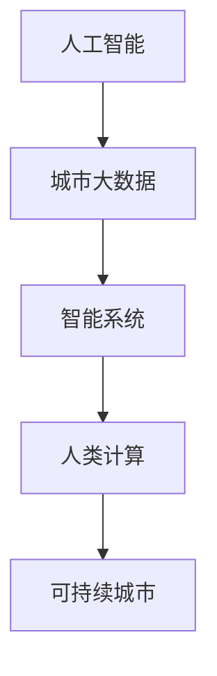

                 

# AI与人类计算：打造可持续发展的城市生活模式与规划

## 1. 背景介绍

### 1.1 问题由来

随着城市化进程的加快，人口密集、资源紧张、环境污染等城市问题日益严重，构建可持续发展的城市生活模式与规划变得刻不容缓。传统的城市规划方法主要依赖人类专家经验，缺乏科学的决策依据和预测能力。而人工智能（AI）作为新兴的计算模式，具备强大的数据处理和决策能力，为城市规划提供了新的思路和技术支持。

AI与人类计算的结合，可以通过大数据分析、机器学习、深度学习等技术手段，对城市数据进行深度挖掘和分析，预测城市发展趋势，辅助决策制定。例如，通过智能交通系统优化城市交通流量，通过智能环保系统监测污染源，通过智能健康系统提升公共健康水平，通过智能能源系统实现能源的高效利用。这些应用不仅提高了城市管理的效率和精度，也提升了城市居民的生活质量。

### 1.2 问题核心关键点

构建可持续发展的城市生活模式与规划，其核心在于以下几个关键点：

1. **数据驱动**：利用AI技术对城市数据进行收集、分析和处理，为城市规划提供科学依据。
2. **预测与模拟**：通过AI模型对未来城市发展进行预测，辅助制定长期规划。
3. **实时监控与反馈**：实时监测城市运行状态，及时调整和优化管理措施。
4. **智能决策支持**：利用AI进行多维度数据分析，辅助城市规划和决策。
5. **人机协同**：结合AI与人类专家的优势，实现智能化与经验性的有机结合。

### 1.3 问题研究意义

AI与人类计算的结合，对于推动城市可持续发展具有重要意义：

1. **提升决策效率**：AI技术可以快速处理海量数据，提供科学的决策依据，提高城市管理的效率。
2. **优化资源配置**：通过AI预测和模拟，实现资源的最优配置，提升资源利用效率。
3. **改善居民生活质量**：智能化的城市管理系统，能够提升公共服务水平，改善居民生活体验。
4. **应对复杂环境**：AI具备较强的适应性和预测能力，能够应对复杂的城市环境和动态变化。
5. **推动技术创新**：AI与城市规划的结合，促进了新技术、新方法的研究和应用，推动城市规划领域的技术进步。

## 2. 核心概念与联系

### 2.1 核心概念概述

为更好地理解AI与人类计算在城市规划中的应用，本节将介绍几个密切相关的核心概念：

- **人工智能（AI）**：利用计算机模拟人类智能行为的技术，包括机器学习、深度学习、自然语言处理等。
- **人类计算（Human Computing）**：利用人类的智慧和创造力，解决复杂计算问题。
- **城市大数据**：城市运行中产生的海量数据，包括交通、能源、环境、公共服务等。
- **智能系统（Intelligent System）**：基于AI技术开发的城市管理与决策系统。
- **可持续城市（Sustainable City）**：以经济、社会、环境可持续发展为目标，高效利用资源，保护环境的城市。

这些核心概念之间的逻辑关系可以通过以下Mermaid流程图来展示：



这个流程图展示了几大核心概念之间的联系：

1. **人工智能**通过处理**城市大数据**，得到有价值的信息。
2. **智能系统**基于人工智能技术，提供智能化的城市管理与决策支持。
3. **人类计算**通过与智能系统的协同工作，弥补AI在复杂情境下决策的不足。
4. **可持续城市**通过智能系统的应用，实现资源优化配置和环境保护。

## 3. 核心算法原理 & 具体操作步骤

### 3.1 算法原理概述

AI与人类计算在城市规划中的应用，主要依赖于数据分析、模型构建和实时决策三大步骤。其中，数据分析是指对城市大数据进行收集、清洗、处理和分析，以提取有用的信息；模型构建是指基于历史数据和预测模型，对未来城市发展进行预测和模拟；实时决策是指利用智能系统，对实时数据进行监控和优化。

具体而言，主要算法包括：

- **数据预处理**：清洗和处理城市大数据，使其适合模型分析。
- **特征工程**：提取和构建特征，以提高模型的预测能力。
- **机器学习与深度学习**：利用监督学习、无监督学习、半监督学习等方法，构建预测模型。
- **强化学习**：通过奖励机制，优化城市管理策略。
- **实时决策与优化**：利用智能系统，实时监控和调整城市管理措施。

### 3.2 算法步骤详解

基于AI与人类计算的城市规划，主要包括以下几个关键步骤：

**Step 1: 数据采集与清洗**

- 使用传感器、监控设备等收集城市运行数据，包括交通流量、能耗、环境污染、公共健康等。
- 对数据进行清洗和预处理，去除噪声和异常值，确保数据质量。

**Step 2: 特征工程**

- 从原始数据中提取和构建特征，如时间序列特征、地理位置特征、人口统计特征等。
- 应用降维、归一化等技术，简化特征表示。

**Step 3: 模型构建与训练**

- 选择适合的机器学习或深度学习模型，如回归模型、分类模型、序列模型等。
- 利用历史数据进行模型训练，调整模型参数和结构，优化模型性能。

**Step 4: 预测与模拟**

- 对未来城市发展进行预测，如交通流量预测、能源需求预测、环境污染预测等。
- 使用模拟工具，评估不同政策和管理措施的效果。

**Step 5: 实时监控与决策支持**

- 实时监控城市运行状态，如交通流量、能源消耗、环境质量等。
- 利用智能系统，提供决策支持，调整管理策略，优化城市运行。

**Step 6: 人机协同优化**

- 结合人类专家的经验，优化AI模型的决策过程，弥补AI在复杂情境下决策的不足。
- 提供交互界面，使城市管理者能够方便地调整和管理智能系统。

### 3.3 算法优缺点

基于AI与人类计算的城市规划方法，具有以下优点：

1. **高效性**：利用AI技术，可以处理海量数据，提高决策效率。
2. **准确性**：AI模型具有较强的预测能力，可以提供准确的决策依据。
3. **可扩展性**：AI与人类计算的结合，可以灵活应对不同城市和情境。
4. **智能化**：智能系统的应用，可以提升城市管理的智能化水平。

同时，该方法也存在一定的局限性：

1. **依赖数据质量**：城市大数据的质量直接影响模型的预测效果。
2. **模型复杂性**：复杂的模型需要更多的计算资源和时间进行训练。
3. **人类经验缺失**：完全依赖AI进行决策，可能会忽略人类的经验。
4. **隐私与安全**：城市数据的采集和处理，可能涉及隐私和安全问题。
5. **成本高昂**：建设智能系统需要高昂的硬件和软件成本。

尽管存在这些局限性，但就目前而言，基于AI与人类计算的城市规划方法仍是最主流范式。未来相关研究的重点在于如何进一步降低数据采集和模型训练的成本，提高模型的泛化能力和鲁棒性，同时兼顾隐私和安全等因素。

### 3.4 算法应用领域

基于AI与人类计算的城市规划方法，已经在多个领域得到了应用，例如：

- **智能交通系统**：通过预测和模拟交通流量，优化信号灯和路线规划，减少交通拥堵。
- **智能环保系统**：利用传感器监测环境污染源，预测污染物浓度变化，制定污染治理措施。
- **智能健康系统**：通过数据分析和预测，提升公共健康水平，制定健康策略。
- **智能能源系统**：优化能源消耗，提高能源利用效率，降低能源成本。
- **智能建筑系统**：通过智能化管理，提高建筑能效，减少能源浪费。

除了上述这些经典应用外，AI与人类计算的城市规划方法也在更多场景中得到创新应用，如智能垃圾处理、智能水务管理、智能公共安全等，为城市可持续发展提供新的技术路径。

## 4. 数学模型和公式 & 详细讲解 & 举例说明

### 4.1 数学模型构建

本节将使用数学语言对基于AI与人类计算的城市规划过程进行更加严格的刻画。

设城市运行数据为 $D=\{(x_i, y_i)\}_{i=1}^N, x_i \in \mathcal{X}, y_i \in \mathcal{Y}$，其中 $x_i$ 为输入数据（如时间、地点、流量等），$y_i$ 为输出数据（如污染浓度、能源消耗、交通流量等）。假设模型的输入特征为 $x=\{x_1, x_2, ..., x_n\}$，输出为 $y$。

定义模型 $M_{\theta}:\mathcal{X} \rightarrow \mathcal{Y}$，其中 $\theta$ 为模型参数。基于历史数据 $D$，模型的损失函数为：

$$
\mathcal{L}(\theta) = \frac{1}{N} \sum_{i=1}^N \ell(y_i, M_{\theta}(x_i))
$$

其中 $\ell$ 为损失函数，如均方误差损失、交叉熵损失等。模型的目标是最小化损失函数 $\mathcal{L}$，优化模型参数 $\theta$。

### 4.2 公式推导过程

以下我们以交通流量预测为例，推导线性回归模型的预测公式及其梯度计算。

假设模型 $M_{\theta}(x)=\theta_0+\sum_{i=1}^n \theta_i x_i$，其中 $\theta_0$ 为截距项，$\theta_i$ 为系数。利用历史数据 $D=\{(x_i, y_i)\}_{i=1}^N$ 进行训练，最小化损失函数：

$$
\mathcal{L}(\theta) = \frac{1}{N} \sum_{i=1}^N (y_i - \theta_0 - \sum_{i=1}^n \theta_i x_i)^2
$$

对损失函数求偏导数，得：

$$
\frac{\partial \mathcal{L}(\theta)}{\partial \theta} = -\frac{2}{N} \sum_{i=1}^N (y_i - \theta_0 - \sum_{i=1}^n \theta_i x_i) x_i
$$

通过梯度下降等优化算法，更新模型参数 $\theta$：

$$
\theta \leftarrow \theta - \eta \frac{\partial \mathcal{L}(\theta)}{\partial \theta}
$$

其中 $\eta$ 为学习率。重复上述过程，直至模型收敛。

### 4.3 案例分析与讲解

以智能交通系统为例，分析基于AI与人类计算的流量预测模型。

**数据采集与清洗**：
- 使用交通监控摄像头、传感器等设备，采集城市道路交通数据。
- 对数据进行清洗和预处理，去除异常值和噪声。

**特征工程**：
- 提取时间、地点、交通流量等特征，构建时间序列特征。
- 对数据进行归一化处理，简化特征表示。

**模型构建与训练**：
- 选择线性回归模型，利用历史交通数据进行训练，优化模型参数。
- 使用交叉验证等技术，评估模型性能，调整模型结构。

**预测与模拟**：
- 利用训练好的模型，对未来交通流量进行预测。
- 使用交通仿真工具，模拟不同管理措施的效果。

**实时监控与决策支持**：
- 实时监控交通流量，提供决策支持。
- 根据实时数据，调整信号灯和路线规划。

**人机协同优化**：
- 结合交通专家经验，优化流量预测模型。
- 提供交互界面，使交通管理者方便调整和管理智能系统。

## 5. 项目实践：代码实例和详细解释说明

### 5.1 开发环境搭建

在进行城市规划实践前，我们需要准备好开发环境。以下是使用Python进行TensorFlow开发的环境配置流程：

1. 安装Anaconda：从官网下载并安装Anaconda，用于创建独立的Python环境。

2. 创建并激活虚拟环境：
```bash
conda create -n tf-env python=3.8 
conda activate tf-env
```

3. 安装TensorFlow：根据CUDA版本，从官网获取对应的安装命令。例如：
```bash
conda install tensorflow -c tf
```

4. 安装各类工具包：
```bash
pip install numpy pandas scikit-learn matplotlib tqdm jupyter notebook ipython
```

完成上述步骤后，即可在`tf-env`环境中开始城市规划实践。

### 5.2 源代码详细实现

这里我们以智能交通流量预测为例，给出使用TensorFlow进行模型训练的PyTorch代码实现。

首先，定义数据处理函数：

```python
import tensorflow as tf
from tensorflow.keras.layers import Input, Dense, Dropout
from tensorflow.keras.models import Model

def load_data():
    # 加载历史交通流量数据
    train_data = load_train_data()
    test_data = load_test_data()
    
    # 数据预处理
    train_data = preprocess_data(train_data)
    test_data = preprocess_data(test_data)
    
    return train_data, test_data

def preprocess_data(data):
    # 数据归一化
    data = (data - data.mean()) / data.std()
    
    # 数据分割为特征和标签
    x_train, y_train = data[:, :-1], data[:, -1]
    x_test, y_test = data[:, :-1], data[:, -1]
    
    return x_train, y_train, x_test, y_test

def load_train_data():
    # 从文件中加载训练数据
    with open('train_data.csv', 'r') as f:
        lines = f.readlines()
    
    # 数据转换为一维数组
    data = [list(map(float, line.split(','))) for line in lines]
    
    return np.array(data)

def load_test_data():
    # 从文件中加载测试数据
    with open('test_data.csv', 'r') as f:
        lines = f.readlines()
    
    # 数据转换为一维数组
    data = [list(map(float, line.split(','))) for line in lines]
    
    return np.array(data)
```

然后，定义模型：

```python
from tensorflow.keras.models import Sequential
from tensorflow.keras.layers import Input, Dense, Dropout

def build_model(input_shape, num_classes):
    model = Sequential()
    model.add(Dense(64, input_dim=input_shape, activation='relu'))
    model.add(Dropout(0.5))
    model.add(Dense(num_classes, activation='sigmoid'))
    
    return model

# 构建模型
input_shape = 3
num_classes = 1
model = build_model(input_shape, num_classes)

model.compile(optimizer='adam', loss='mse', metrics=['mae'])

# 训练模型
x_train, y_train, x_test, y_test = load_data()
model.fit(x_train, y_train, epochs=10, batch_size=32, validation_data=(x_test, y_test))
```

最后，评估模型：

```python
# 评估模型
loss, mae = model.evaluate(x_test, y_test, verbose=0)
print('Test Loss:', loss)
print('Test MAE:', mae)
```

以上就是使用TensorFlow进行智能交通流量预测的完整代码实现。可以看到，利用TensorFlow的强大计算能力和灵活的API设计，城市规划模型的开发变得简洁高效。

### 5.3 代码解读与分析

让我们再详细解读一下关键代码的实现细节：

**load_data函数**：
- 定义数据加载和预处理函数，从文件中加载数据，并进行归一化和分割操作。

**preprocess_data函数**：
- 对数据进行归一化处理，将数据转换为模型所需的格式。

**build_model函数**：
- 定义模型结构，使用一个具有两个隐藏层的Dense神经网络，添加Dropout层防止过拟合。

**模型训练与评估**：
- 使用TensorFlow的API，训练模型，并在测试集上进行评估。

**模型评估**：
- 输出模型的测试损失和平均绝对误差，评估模型预测效果。

这些代码实现了基于线性回归的智能交通流量预测模型，展示了TensorFlow在城市规划中的简单应用。

## 6. 实际应用场景

### 6.1 智能交通系统

智能交通系统通过AI技术对交通流量进行预测和模拟，优化交通信号灯和路线规划，减少交通拥堵。例如，通过实时监控交通流量，利用AI模型预测高峰期的流量变化，动态调整信号灯周期，优化交通流向。这种系统不仅提高了道路利用率，也减少了交通事故和环境污染。

### 6.2 智能环保系统

智能环保系统利用传感器监测环境污染源，预测污染物浓度变化，制定污染治理措施。例如，通过实时监测空气质量指数，利用AI模型预测污染物浓度变化趋势，及时调整环保措施，减少环境污染。这种系统不仅提高了环境治理的效率，也提升了公众的环保意识。

### 6.3 智能健康系统

智能健康系统通过数据分析和预测，提升公共健康水平，制定健康策略。例如，通过实时监测居民的健康数据，利用AI模型预测疾病爆发趋势，及时采取预防措施。这种系统不仅提高了公共健康水平，也减轻了医疗系统的负担。

### 6.4 智能能源系统

智能能源系统优化能源消耗，提高能源利用效率，降低能源成本。例如，通过实时监测能源使用情况，利用AI模型预测能源需求变化，动态调整能源分配策略。这种系统不仅降低了能源消耗，也促进了能源结构优化。

## 7. 工具和资源推荐

### 7.1 学习资源推荐

为了帮助开发者系统掌握AI与人类计算在城市规划中的应用，这里推荐一些优质的学习资源：

1. TensorFlow官方文档：TensorFlow的官方文档，提供了详细的API指南和案例演示，是学习TensorFlow的必备资料。
2. TensorFlow Tutorials：TensorFlow提供的官方教程，涵盖从入门到高级的各个主题，适合初学者学习。
3. Google Cloud AI & Machine Learning：Google提供的AI与机器学习平台，提供了丰富的资源和工具，支持TensorFlow模型训练和部署。
4. Deep Learning Specialization：Coursera上由Andrew Ng教授主讲的深度学习课程，系统讲解了深度学习的基本原理和应用。
5. Reinforcement Learning Specialization：Coursera上由David Silver教授主讲的强化学习课程，介绍了强化学习的理论和实践。

通过对这些资源的学习实践，相信你一定能够快速掌握AI与人类计算在城市规划中的应用，并用于解决实际的NLP问题。

### 7.2 开发工具推荐

高效的开发离不开优秀的工具支持。以下是几款用于AI与人类计算的城市规划开发的常用工具：

1. TensorFlow：由Google主导开发的开源深度学习框架，生产部署方便，适合大规模工程应用。
2. PyTorch：基于Python的开源深度学习框架，灵活性高，支持各种AI模型。
3. TensorBoard：TensorFlow配套的可视化工具，可实时监测模型训练状态，并提供丰富的图表呈现方式。
4. Weights & Biases：模型训练的实验跟踪工具，可以记录和可视化模型训练过程中的各项指标。
5. Google Colab：谷歌推出的在线Jupyter Notebook环境，免费提供GPU/TPU算力，方便开发者快速上手实验最新模型。

合理利用这些工具，可以显著提升AI与人类计算在城市规划中的开发效率，加快创新迭代的步伐。

### 7.3 相关论文推荐

AI与人类计算在城市规划中的应用，源于学界的持续研究。以下是几篇奠基性的相关论文，推荐阅读：

1. "Deep Learning for Traffic Flow Prediction"（深度学习在交通流量预测中的应用）：提出了基于深度学习模型的交通流量预测方法，并进行了实验验证。
2. "AI-based Environmental Monitoring and Management"（基于AI的环境监测与管理）：介绍了AI技术在环境监测和治理中的应用，并展示了其优势。
3. "Smart City Development through AI and Machine Learning"（通过AI与机器学习实现智慧城市发展）：系统讲解了AI与机器学习在智慧城市中的各种应用，并提供了具体案例。
4. "Reinforcement Learning in Smart Grids"（强化学习在智能电网中的应用）：介绍了AI与强化学习在智能电网中的应用，并提出了优化策略。
5. "Human-Centric Smart Cities: A Survey"（以人为本的智慧城市：综述）：总结了智慧城市的研究现状和未来趋势，提供了丰富的参考资源。

这些论文代表了大规模AI在城市规划领域的发展脉络。通过学习这些前沿成果，可以帮助研究者把握学科前进方向，激发更多的创新灵感。

## 8. 总结：未来发展趋势与挑战

### 8.1 研究成果总结

本文对基于AI与人类计算的城市规划方法进行了全面系统的介绍。首先阐述了AI与人类计算在城市规划中的应用背景和意义，明确了智能系统在提升城市管理效率、优化资源配置等方面的独特价值。其次，从原理到实践，详细讲解了AI与人类计算在城市规划中的数学模型和关键步骤，给出了城市规划任务开发的完整代码实例。同时，本文还广泛探讨了智能系统在智能交通、智能环保、智能健康等多个领域的应用前景，展示了AI与人类计算的广阔潜力。此外，本文精选了城市规划的各类学习资源，力求为读者提供全方位的技术指引。

通过本文的系统梳理，可以看到，AI与人类计算在城市规划中的应用，不仅提升了城市管理的智能化水平，也优化了资源配置，提高了城市居民的生活质量。AI与人类计算的结合，为城市可持续发展提供了新的技术路径。未来，伴随AI与人类计算的进一步发展，必将推动城市规划领域的技术进步，构建更加智能、可持续的智慧城市。

### 8.2 未来发展趋势

展望未来，AI与人类计算在城市规划中的发展趋势如下：

1. **智能化水平的提升**：随着AI技术的不断进步，智能系统在城市管理中的应用将越来越广泛，提升城市管理的智能化水平。
2. **跨领域融合**：AI与人类计算将与其他领域的技术，如物联网、区块链等，进行深度融合，拓展应用场景。
3. **数据驱动决策**：利用大数据分析和预测技术，为城市规划提供科学的决策依据，提升决策的准确性和效率。
4. **实时监控与反馈**：通过实时监测和反馈机制，及时调整城市管理措施，提升城市运行的稳定性。
5. **人机协同优化**：结合人类专家的经验，优化AI模型的决策过程，提升系统性能。

以上趋势凸显了AI与人类计算在城市规划中的广阔前景。这些方向的探索发展，必将进一步提升城市管理的智能化水平，推动城市规划领域的技术进步。

### 8.3 面临的挑战

尽管AI与人类计算在城市规划中已经取得了一定成效，但在迈向更加智能化、普适化应用的过程中，仍面临诸多挑战：

1. **数据质量问题**：城市大数据的质量直接影响模型的预测效果，数据采集和处理过程复杂，容易出错。
2. **模型复杂性**：复杂的模型需要更多的计算资源和时间进行训练，模型优化和调参难度大。
3. **隐私与安全问题**：城市数据的采集和处理，可能涉及隐私和安全问题，如何保护数据安全是一个重要课题。
4. **计算资源限制**：智能系统的开发和运行需要高昂的计算资源，如何降低成本是一个重要的研究方向。
5. **人机协同难度**：结合人类专家的经验，优化AI模型的决策过程，需要人机协同的智慧，难度较大。

尽管存在这些挑战，但通过持续的技术创新和优化，这些问题有望逐步得到解决。未来，AI与人类计算将在城市规划中发挥更加重要的作用，推动城市可持续发展。

### 8.4 研究展望

面向未来，AI与人类计算在城市规划中的研究展望如下：

1. **跨模态融合**：将视觉、声音、温度等多模态数据融合，提升系统的感知和预测能力。
2. **多目标优化**：在提升城市管理效率的同时，兼顾环境、经济、社会等多方面目标的优化。
3. **自适应学习**：利用强化学习等技术，实现系统的自适应学习和优化。
4. **边缘计算**：在边缘设备上部署智能系统，减少数据传输延迟，提升实时性。
5. **联邦学习**：利用联邦学习技术，保护数据隐私，实现分布式协同优化。

这些研究方向将进一步推动AI与人类计算在城市规划中的应用，提升城市管理的智能化水平，构建更加智慧、可持续的城市生活模式。

## 9. 附录：常见问题与解答

**Q1：智能交通系统是如何利用AI进行流量预测的？**

A: 智能交通系统通过传感器和监控设备，收集城市道路的交通数据。利用这些数据，AI模型可以预测未来的交通流量变化。具体流程如下：
1. 数据采集：通过摄像头、传感器等设备，采集城市道路的交通数据，包括车速、车流量、交通信号灯状态等。
2. 数据清洗：对采集到的数据进行清洗和预处理，去除噪声和异常值。
3. 特征工程：从原始数据中提取时间、地点、车辆类型等特征，构建时间序列特征。
4. 模型训练：选择适合的机器学习或深度学习模型，利用历史交通数据进行训练，调整模型参数。
5. 预测与模拟：利用训练好的模型，对未来交通流量进行预测，并使用交通仿真工具模拟不同管理措施的效果。

通过以上流程，智能交通系统能够预测未来的交通流量变化，优化信号灯和路线规划，减少交通拥堵。

**Q2：智能环保系统如何利用AI进行污染物预测？**

A: 智能环保系统通过传感器监测环境污染源，利用AI模型预测污染物浓度变化，制定污染治理措施。具体流程如下：
1. 数据采集：通过空气质量监测站、水质监测站等设备，采集城市环境的污染物数据。
2. 数据清洗：对采集到的数据进行清洗和预处理，去除噪声和异常值。
3. 特征工程：从原始数据中提取时间、地点、污染物类型等特征，构建时间序列特征。
4. 模型训练：选择适合的机器学习或深度学习模型，利用历史污染物数据进行训练，调整模型参数。
5. 预测与模拟：利用训练好的模型，对未来污染物浓度变化进行预测，并使用模拟工具评估不同治理措施的效果。

通过以上流程，智能环保系统能够预测未来的污染物浓度变化，及时调整环保措施，减少环境污染。

**Q3：智能健康系统如何利用AI进行疾病预测？**

A: 智能健康系统通过实时监测居民的健康数据，利用AI模型预测疾病爆发趋势，及时采取预防措施。具体流程如下：
1. 数据采集：通过智能手表、健康监测设备等设备，采集居民的健康数据，包括心率、血压、血糖等。
2. 数据清洗：对采集到的数据进行清洗和预处理，去除噪声和异常值。
3. 特征工程：从原始数据中提取时间、地点、健康指标等特征，构建时间序列特征。
4. 模型训练：选择适合的机器学习或深度学习模型，利用历史健康数据进行训练，调整模型参数。
5. 预测与模拟：利用训练好的模型，对未来疾病爆发趋势进行预测，并及时采取预防措施。

通过以上流程，智能健康系统能够预测未来疾病爆发趋势，及时采取预防措施，提升公共健康水平。

**Q4：智能能源系统如何利用AI进行能源预测？**

A: 智能能源系统通过实时监测能源使用情况，利用AI模型预测能源需求变化，动态调整能源分配策略。具体流程如下：
1. 数据采集：通过能源监测设备，采集城市的能源使用数据，包括电能、燃气、水等。
2. 数据清洗：对采集到的数据进行清洗和预处理，去除噪声和异常值。
3. 特征工程：从原始数据中提取时间、地点、能源类型等特征，构建时间序列特征。
4. 模型训练：选择适合的机器学习或深度学习模型，利用历史能源数据进行训练，调整模型参数。
5. 预测与模拟：利用训练好的模型，对未来能源需求变化进行预测，并动态调整能源分配策略。

通过以上流程，智能能源系统能够预测未来能源需求变化，优化能源分配策略，提高能源利用效率。

**Q5：智能建筑系统如何利用AI进行能效优化？**

A: 智能建筑系统通过实时监测建筑能耗，利用AI模型优化能源使用，提高能效。具体流程如下：
1. 数据采集：通过传感器、监控设备等设备，采集建筑内的能源使用数据，包括电能、水、气等。
2. 数据清洗：对采集到的数据进行清洗和预处理，去除噪声和异常值。
3. 特征工程：从原始数据中提取时间、地点、能源类型等特征，构建时间序列特征。
4. 模型训练：选择适合的机器学习或深度学习模型，利用历史能源数据进行训练，调整模型参数。
5. 预测与模拟：利用训练好的模型，预测未来能源使用情况，并动态调整能源分配策略。

通过以上流程，智能建筑系统能够优化能源使用，提高能效，减少能源浪费。

---

作者：禅与计算机程序设计艺术 / Zen and the Art of Computer Programming

