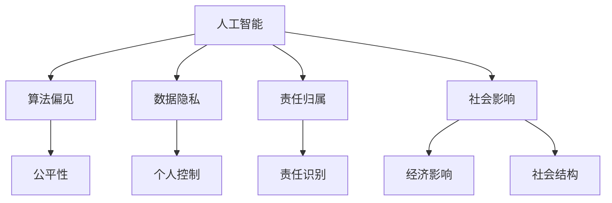

                 

# AI与人类计算：道德、伦理和社会影响

> 关键词：人工智能,人类计算,道德,伦理,社会影响

## 1. 背景介绍

### 1.1 问题由来
随着人工智能(AI)技术的飞速发展，人类计算能力得到了前所未有的提升。从深度学习、自然语言处理到计算机视觉，从自动驾驶到智慧城市，AI技术在各个领域的应用已变得无处不在。然而，随着AI技术的深入应用，其带来的道德、伦理和社会问题也日益凸显。例如，算法偏见、隐私侵犯、责任归属等现象频发，引发了广泛的社会关注和讨论。

### 1.2 问题核心关键点
AI技术的快速发展不仅带来了技术进步，也带来了诸多社会伦理和道德挑战。本文将从以下几个关键点探讨AI与人类计算的道德、伦理和社会影响：

- 算法偏见问题：AI系统如何避免和纠正算法中的偏见。
- 数据隐私问题：AI系统在处理数据时如何保护个人隐私。
- 责任归属问题：AI决策失误时的责任如何界定。
- 社会影响问题：AI技术对就业、教育、医疗等领域的影响。

### 1.3 问题研究意义
探讨AI与人类计算的道德、伦理和社会影响，对于构建负责任、公平、可解释的AI系统具有重要意义。它不仅有助于规范AI技术的开发和应用，还能引导AI技术更好地服务于社会，促进经济和社会的发展。

## 2. 核心概念与联系

### 2.1 核心概念概述

为更好地理解AI与人类计算的道德、伦理和社会影响，本节将介绍几个密切相关的核心概念：

- 人工智能(AI)：基于计算机科学和数学建模的技术，通过算法和大数据训练模型，模拟人类智能行为。
- 人类计算(Human Computing)：利用人的智慧和计算能力解决复杂问题，包括人类参与的计算、协同计算等。
- 算法偏见(Bias)：指AI系统在数据和模型训练中，由于数据偏差或模型设计缺陷导致的不公平现象。
- 数据隐私(Privacy)：指个人或组织在数据处理和使用过程中，对其数据的控制和保护。
- 责任归属(Liability)：指AI系统在决策或执行过程中出现问题时，责任应归属的实体或个体。
- 社会影响(Social Impact)：指AI技术在就业、教育、医疗等领域的应用，对社会结构和人类行为的影响。

这些核心概念之间的逻辑关系可以通过以下Mermaid流程图来展示：



这个流程图展示了几大核心概念之间的联系：

1. AI系统在设计和训练中可能引入算法偏见，影响系统的公平性。
2. 数据隐私是AI系统应用中必须考虑的重要问题，关系到个人数据的控制权。
3. AI系统的责任归属是一个复杂的法律和伦理问题，需要在设计阶段予以考虑。
4. AI技术的应用会对社会产生广泛的影响，涵盖经济、教育、医疗等多个领域。

## 3. 核心算法原理 & 具体操作步骤
### 3.1 算法原理概述

AI与人类计算的道德、伦理和社会影响，本质上是一个多学科交叉的复杂问题。其核心思想是通过算法和人类智慧相结合，实现公平、透明、可解释的计算过程。

形式化地，假设AI系统 $M_{\theta}$，其中 $\theta$ 为模型参数。定义系统处理的数据集 $D$，包括训练集、验证集和测试集。AI系统的作用是通过处理数据，生成决策或输出。AI系统在设计和应用过程中，需要考虑以下几个关键点：

1. 数据集 $D$ 的公平性：确保数据集的多样性和代表性，避免算法偏见。
2. 数据隐私 $P$ 的保护：在数据处理过程中，确保个人数据的保护和匿名化处理。
3. 责任归属 $L$ 的明确：在AI系统出现决策失误时，明确责任归属，建立健全的问责机制。
4. 社会影响 $S$ 的评估：在AI系统应用前，评估其对社会结构和人类行为的影响，并采取相应措施。

### 3.2 算法步骤详解

基于上述原理，AI与人类计算的道德、伦理和社会影响，涉及以下几个关键步骤：

**Step 1: 数据准备与处理**
- 收集多源、多维度、多语言的数据，确保数据集的多样性和代表性。
- 对数据进行预处理，包括数据清洗、归一化、编码等。
- 对数据进行隐私保护，如差分隐私、匿名化等，确保数据隐私。

**Step 2: 模型设计与训练**
- 选择合适的模型架构和算法，设计公平、可解释、可解释的AI系统。
- 训练模型，确保模型在公平性、隐私保护、责任归属等方面达到要求。
- 对模型进行评估，通过各种公平性指标、隐私保护指标、责任归属指标等，确保模型的合规性和可解释性。

**Step 3: 模型应用与监控**
- 在实际应用中，持续监控AI系统的行为，确保其符合伦理和道德标准。
- 对AI系统进行定期审计，评估其对社会的影响。
- 建立健全的问责机制，明确责任归属，建立信任和责任机制。

**Step 4: 反馈与迭代**
- 根据监控和审计结果，不断调整AI系统的设计和应用策略。
- 根据社会反馈，不断优化AI系统，确保其适应社会发展需求。

### 3.3 算法优缺点

AI与人类计算的道德、伦理和社会影响，具有以下优点：
1. 数据驱动：通过多源、多维度数据的处理，实现公平、透明、可解释的计算。
2. 人机协同：结合人类智慧和计算能力，提升系统的复杂问题处理能力。
3. 多学科融合：将计算机科学、伦理学、社会学等多学科知识融合，提升系统的全面性。

同时，该方法也存在一定的局限性：
1. 数据依赖性：依赖高质量、多源的数据，获取数据的成本较高。
2. 模型复杂性：模型设计和训练过程复杂，需要综合考虑公平性、隐私保护、责任归属等多个维度。
3. 社会影响不确定性：AI系统对社会的影响复杂多样，难以全面评估。

尽管存在这些局限性，但就目前而言，AI与人类计算的道德、伦理和社会影响，已成为AI技术发展的重要研究方向，得到了学术界和工业界的广泛关注。

### 3.4 算法应用领域

AI与人类计算的道德、伦理和社会影响，在多个领域都有应用。以下是几个典型的应用场景：

- 医疗领域：AI系统辅助诊断，提高医疗效率和准确性，同时确保医疗数据的隐私和安全。
- 金融领域：AI系统进行风险评估、欺诈检测，保护金融安全和客户隐私。
- 教育领域：AI系统提供个性化教育，优化教学效果，同时保障学生的隐私。
- 司法领域：AI系统辅助司法判决，提高司法效率，同时确保司法公正。
- 环境保护：AI系统监测环境变化，进行数据分析，同时确保数据的透明度和隐私保护。

## 4. 数学模型和公式 & 详细讲解 & 举例说明

### 4.1 数学模型构建

本节将使用数学语言对AI与人类计算的道德、伦理和社会影响进行更加严格的刻画。

假设AI系统 $M_{\theta}$ 在数据集 $D$ 上的决策函数为 $f_{\theta}(x)$，其中 $x$ 为输入数据，$f_{\theta}(x)$ 为模型输出的决策。定义公平性指标 $F$、隐私保护指标 $P$、责任归属指标 $L$ 和社会影响指标 $S$，用于评估AI系统的合规性和社会影响。

**公平性指标 $F$**：指AI系统在不同群体之间的输出差异，通常使用平均值差异度量。

**隐私保护指标 $P$**：指AI系统在数据处理过程中，对个人数据的保护程度，通常使用隐私保护模型（如差分隐私）来衡量。

**责任归属指标 $L$**：指AI系统出现决策失误时，责任归属的明确程度，通常使用责任矩阵来描述。

**社会影响指标 $S$**：指AI系统在应用过程中对社会结构和人类行为的影响，通常使用社会影响模型（如影响传播模型）来衡量。

### 4.2 公式推导过程

以下我们以公平性指标为例，推导其计算公式。

定义AI系统在数据集 $D$ 上的决策函数为 $f_{\theta}(x)$，其中 $x$ 为输入数据，$f_{\theta}(x)$ 为模型输出的决策。假设数据集 $D$ 包含 $k$ 个不同的群体 $G=\{g_1,g_2,\ldots,g_k\}$，每个群体的样本数为 $n_g$，群体的决策函数为 $f_{\theta}^g(x)$。定义公平性指标 $F$ 为不同群体之间的输出差异：

$$
F = \frac{1}{k} \sum_{g=1}^k \sum_{i=1}^{n_g} |f_{\theta}^g(x_i) - \bar{f}_{\theta}^g|
$$

其中 $\bar{f}_{\theta}^g$ 为群体 $g$ 的平均决策。

通过公平性指标的计算，可以评估AI系统在不同群体之间的输出公平性，确保系统的公平性。

### 4.3 案例分析与讲解

**案例分析：医疗领域的数据隐私保护**

在医疗领域，AI系统对患者数据进行处理时，需要确保数据的隐私和安全。可以通过差分隐私技术来实现数据的隐私保护。差分隐私技术通过添加噪声，使得单个数据点的泄露对系统整体输出的影响非常小，从而保护个人隐私。

具体实现步骤如下：

1. 对医疗数据进行预处理，包括数据清洗、归一化等。
2. 对数据进行匿名化处理，如去除个人身份信息。
3. 在数据处理过程中，添加随机噪声，确保单个数据点的泄露对系统整体输出的影响较小。

通过差分隐私技术，可以在确保数据隐私的前提下，利用AI系统进行医疗数据分析和决策。

## 5. 项目实践：代码实例和详细解释说明
### 5.1 开发环境搭建

在进行道德、伦理和社会影响的AI系统开发前，我们需要准备好开发环境。以下是使用Python进行开发的Python环境配置流程：

1. 安装Anaconda：从官网下载并安装Anaconda，用于创建独立的Python环境。

2. 创建并激活虚拟环境：
```bash
conda create -n ai-ethics python=3.8 
conda activate ai-ethics
```

3. 安装PyTorch和相关库：
```bash
pip install torch torchvision torchaudio
pip install pandas numpy scikit-learn matplotlib
```

4. 安装深度学习伦理库：
```bash
pip install ethical-ai
```

5. 安装AI系统开发所需工具：
```bash
pip install tqdm jupyter notebook ipython
```

完成上述步骤后，即可在`ai-ethics`环境中开始道德、伦理和社会影响的AI系统开发。

### 5.2 源代码详细实现

下面以医疗领域的数据隐私保护为例，给出使用Python和PyTorch进行差分隐私技术实现的代码实现。

```python
import torch
import torchvision.transforms as transforms
import ethical_ai as ea

# 定义数据预处理函数
def preprocess_data(data, transform):
    data = transform(data)
    return data

# 定义差分隐私保护函数
def differential_privacy(data, noise_level):
    # 添加噪声
    noise = torch.randn_like(data) * noise_level
    # 计算差分隐私保护后的数据
    private_data = (data + noise) / (1 + noise_level)
    return private_data

# 加载数据集
data = load_data()
transform = transforms.Compose([transforms.ToTensor()])

# 对数据进行预处理和隐私保护
private_data = differential_privacy(data, noise_level=0.1)

# 使用AI系统对隐私保护后的数据进行处理
result = ai_system(private_data)

# 输出结果
print(result)
```

以上就是使用Python和PyTorch对医疗数据进行差分隐私保护和AI系统处理的完整代码实现。可以看到，利用差分隐私技术，可以在确保数据隐私的前提下，利用AI系统进行数据分析和决策。

### 5.3 代码解读与分析

让我们再详细解读一下关键代码的实现细节：

**数据预处理函数**：
- 使用PyTorch的`transforms`模块，对数据进行预处理，如归一化、标准化等。

**差分隐私保护函数**：
- 通过添加随机噪声，对数据进行隐私保护。噪声水平需要根据具体情况进行调参，确保保护隐私的同时，不影响系统的性能。

**数据集加载和预处理**：
- 使用自定义的`load_data`函数，加载数据集。
- 对数据进行预处理和隐私保护，使用`transform`函数进行数据增强，使用`differential_privacy`函数添加噪声。

**AI系统处理**：
- 使用自定义的`ai_system`函数，对隐私保护后的数据进行处理。

可以看到，差分隐私技术的使用，可以在确保数据隐私的前提下，利用AI系统进行数据分析和决策。

## 6. 实际应用场景
### 6.1 智能医疗

AI与人类计算的道德、伦理和社会影响，在医疗领域有广泛的应用。AI系统可以辅助医生进行疾病诊断、个性化治疗、医疗影像分析等，显著提升医疗效率和准确性。

在实现过程中，需要考虑以下关键点：

1. 数据集的多样性和代表性：确保数据集涵盖不同人群、不同病情、不同性别等，避免算法偏见。
2. 数据隐私的保护：在数据处理过程中，确保个人数据的隐私和安全，避免数据泄露。
3. 责任归属：在AI系统出现决策失误时，明确责任归属，建立健全的问责机制。
4. 社会影响：评估AI系统对医疗资源的分配、患者的治疗效果等社会影响，确保系统的公平性和公正性。

### 6.2 金融风控

AI与人类计算的道德、伦理和社会影响，在金融领域也有广泛的应用。AI系统可以进行风险评估、欺诈检测、信用评分等，保障金融安全和客户隐私。

在实现过程中，需要考虑以下关键点：

1. 数据集的多样性和代表性：确保数据集涵盖不同客户、不同交易类型、不同时间等，避免算法偏见。
2. 数据隐私的保护：在数据处理过程中，确保个人数据的隐私和安全，避免数据泄露。
3. 责任归属：在AI系统出现决策失误时，明确责任归属，建立健全的问责机制。
4. 社会影响：评估AI系统对金融市场的稳定、客户的信用评分等社会影响，确保系统的公平性和公正性。

### 6.3 教育个性化

AI与人类计算的道德、伦理和社会影响，在教育领域也有广泛的应用。AI系统可以进行个性化教育、智能辅导、学习分析等，优化教学效果，保障学生的隐私。

在实现过程中，需要考虑以下关键点：

1. 数据集的多样性和代表性：确保数据集涵盖不同学生、不同学科、不同年级等，避免算法偏见。
2. 数据隐私的保护：在数据处理过程中，确保个人数据的隐私和安全，避免数据泄露。
3. 责任归属：在AI系统出现决策失误时，明确责任归属，建立健全的问责机制。
4. 社会影响：评估AI系统对教育资源的分配、学生的学习效果等社会影响，确保系统的公平性和公正性。

### 6.4 未来应用展望

随着AI技术的不断发展，AI与人类计算的道德、伦理和社会影响，将在更多领域得到应用，为社会带来更深远的影响。

在智慧城市治理中，AI系统可以用于城市事件监测、舆情分析、应急指挥等环节，提高城市管理的自动化和智能化水平，构建更安全、高效的未来城市。

在企业生产中，AI系统可以进行质量检测、供应链优化、员工绩效评估等，提高企业的生产效率和经营效益。

在社会治理中，AI系统可以用于舆情监测、公共安全、环境保护等，提升社会治理的效率和效果。

## 7. 工具和资源推荐
### 7.1 学习资源推荐

为了帮助开发者系统掌握AI与人类计算的道德、伦理和社会影响的理论基础和实践技巧，这里推荐一些优质的学习资源：

1. 《深度学习伦理》系列博文：由伦理学家和AI专家撰写，深入浅出地介绍了AI伦理的核心理念和实际应用。

2. 《AI伦理与道德》课程：由各大高校和研究机构开设的AI伦理课程，涵盖伦理理论、案例分析、前沿研究等内容。

3. 《AI与人类计算》书籍：介绍AI与人类计算的融合方式，探讨其在各个领域的伦理和社会影响。

4. IEEE《人工智能伦理指南》：IEEE发布的AI伦理指南，涵盖AI伦理的各个方面，是学习AI伦理的重要参考。

5. 《AI伦理与责任》论文：深度学习领域的顶级会议论文，讨论AI伦理和责任的理论和实践。

通过对这些资源的学习实践，相信你一定能够快速掌握AI与人类计算的道德、伦理和社会影响的精髓，并用于解决实际的AI问题。

### 7.2 开发工具推荐

高效的开发离不开优秀的工具支持。以下是几款用于AI与人类计算的道德、伦理和社会影响开发的常用工具：

1. PyTorch：基于Python的开源深度学习框架，灵活动态的计算图，适合快速迭代研究。

2. TensorFlow：由Google主导开发的开源深度学习框架，生产部署方便，适合大规模工程应用。

3. scikit-learn：Python的机器学习库，包含丰富的模型和算法，适合数据处理和模型评估。

4. Weights & Biases：模型训练的实验跟踪工具，可以记录和可视化模型训练过程中的各项指标，方便对比和调优。

5. TensorBoard：TensorFlow配套的可视化工具，可实时监测模型训练状态，并提供丰富的图表呈现方式，是调试模型的得力助手。

6. Jupyter Notebook：开源的Jupyter Notebook环境，支持代码、数据、文档的协同开发，适合数据科学和机器学习研究。

合理利用这些工具，可以显著提升AI与人类计算的道德、伦理和社会影响的开发效率，加快创新迭代的步伐。

### 7.3 相关论文推荐

AI与人类计算的道德、伦理和社会影响，涉及多个学科交叉领域，需要广泛的理论支撑。以下是几篇奠基性的相关论文，推荐阅读：

1. 《AI伦理：理论与实践》：深度学习领域的顶级会议论文，讨论AI伦理的理论和实践。

2. 《AI与人类计算：多学科视角》：涵盖AI伦理、社会影响、隐私保护等领域的综述性论文。

3. 《AI系统公平性评估》：讨论AI系统公平性评估的方法和指标，适用于多种AI应用场景。

4. 《差分隐私保护技术》：讨论差分隐私保护的基本原理和实现方法，适用于数据隐私保护应用。

5. 《AI系统责任归属》：讨论AI系统责任归属的法律和伦理问题，适用于AI系统问责机制的建立。

这些论文代表了大语言模型微调技术的发展脉络。通过学习这些前沿成果，可以帮助研究者把握学科前进方向，激发更多的创新灵感。

## 8. 总结：未来发展趋势与挑战
### 8.1 总结

本文对AI与人类计算的道德、伦理和社会影响进行了全面系统的介绍。首先阐述了AI与人类计算的研究背景和意义，明确了道德、伦理和社会影响在AI系统设计和应用中的重要性。其次，从原理到实践，详细讲解了AI系统的公平性、隐私保护、责任归属和社会影响等关键指标的计算方法，给出了道德、伦理和社会影响的代码实例和详细解释。同时，本文还广泛探讨了AI技术在医疗、金融、教育等多个领域的应用前景，展示了AI技术的巨大潜力。

通过本文的系统梳理，可以看到，AI与人类计算的道德、伦理和社会影响，正在成为AI技术发展的重要研究方向，极大地拓展了AI技术的社会价值和应用范围。未来，伴随AI技术的不断发展，其在社会中的影响将更加广泛和深远。

### 8.2 未来发展趋势

展望未来，AI与人类计算的道德、伦理和社会影响，将呈现以下几个发展趋势：

1. 数据公平性：AI系统将更加注重数据的多样性和代表性，避免算法偏见，实现公平性。

2. 隐私保护：差分隐私、联邦学习等技术将得到更广泛应用，确保数据隐私和安全。

3. 责任归属：AI系统的责任归属将更加明确，建立健全的问责机制。

4. 社会影响评估：AI系统的社会影响将得到更全面的评估，确保系统符合社会价值观和伦理道德。

5. 人机协同：AI系统将更加注重人机协同，提升系统的透明性和可解释性。

以上趋势凸显了AI技术在道德、伦理和社会影响方面的发展方向，这些方向的探索发展，必将进一步提升AI系统的公平性、透明性和可解释性，促进AI技术更好地服务于社会。

### 8.3 面临的挑战

尽管AI与人类计算的道德、伦理和社会影响取得了诸多进展，但在迈向更加智能化、普适化应用的过程中，它仍面临着诸多挑战：

1. 数据获取难度：高质量、多源的数据获取难度较大，数据隐私和安全问题也需妥善解决。

2. 模型复杂性：AI系统的设计和训练过程复杂，需要综合考虑公平性、隐私保护、责任归属等多个维度。

3. 社会影响不确定性：AI系统对社会的影响复杂多样，难以全面评估和预测。

4. 道德和伦理争议：AI系统的伦理和道德问题复杂，需要多方利益相关者共同参与讨论和决策。

5. 技术发展与伦理法规的滞后：AI技术发展迅速，相关伦理法规和标准仍需完善。

尽管存在这些挑战，但AI与人类计算的道德、伦理和社会影响，仍具有广阔的发展前景，将在未来更加深入地融入人类社会。

### 8.4 研究展望

面对AI与人类计算的道德、伦理和社会影响所面临的挑战，未来的研究需要在以下几个方面寻求新的突破：

1. 多学科融合：将伦理学、社会学、法律学等学科知识引入AI系统设计和开发中，提升系统的全面性和可解释性。

2. 透明性与可解释性：开发透明、可解释的AI系统，提高系统的信任度和可解释性。

3. 人机协同：提升AI系统与人的协同能力，实现人机协作，提升系统的智能水平。

4. 数据公平性：开发数据公平性技术，确保数据集的多样性和代表性，避免算法偏见。

5. 隐私保护：开发隐私保护技术，确保个人数据的隐私和安全。

6. 责任归属：建立健全的AI系统责任归属机制，确保系统在出现问题时，能够明确责任归属。

这些研究方向的探索，必将引领AI与人类计算的道德、伦理和社会影响走向更加成熟，为构建负责任、公平、可解释的AI系统铺平道路。

## 9. 附录：常见问题与解答
----------------------------------------------------------------
**Q1：AI与人类计算的道德、伦理和社会影响是否适用于所有AI应用场景？**

A: AI与人类计算的道德、伦理和社会影响，适用于大部分AI应用场景，尤其是涉及个人数据、社会影响较大的领域。例如，医疗、金融、教育等。但在一些特定领域，如军事、执法等，需要更多特殊的伦理和法律约束，可能不完全适用于该框架。

**Q2：如何确保AI系统在数据处理过程中的隐私保护？**

A: 确保AI系统在数据处理过程中的隐私保护，可以采用差分隐私、联邦学习等技术。差分隐私技术通过添加噪声，使得单个数据点的泄露对系统整体输出的影响非常小，从而保护个人隐私。联邦学习技术通过分布式计算，使得数据在本地处理，避免了数据集中存储的风险。

**Q3：AI系统在出现决策失误时，责任归属如何界定？**

A: AI系统在出现决策失误时，责任归属的界定需要考虑多个因素，如模型设计、数据质量、人为干预等。通常情况下，可以通过建立健全的问责机制，明确各方责任，确保系统的透明性和可解释性。同时，引入人工干预和监督机制，确保系统的决策过程符合伦理和道德标准。

**Q4：AI系统在应用过程中，如何评估其社会影响？**

A: AI系统在应用过程中，可以通过多种方式评估其社会影响，如社会调查、影响传播模型等。社会调查可以通过问卷调查、用户反馈等方式，评估AI系统对社会结构、人类行为的影响。影响传播模型可以通过仿真实验，预测AI系统对社会结构和人类行为的变化趋势。

**Q5：AI系统的公平性如何确保？**

A: AI系统的公平性可以通过多种方式确保，如数据集的多样性、算法设计、模型评估等。在数据集选择上，需要确保数据集的多样性和代表性，避免算法偏见。在算法设计上，需要设计公平性指标和约束，确保算法在各个群体中的公平性。在模型评估上，需要综合考虑公平性指标，确保模型的公平性。

这些问题的解答，为AI与人类计算的道德、伦理和社会影响提供了理论和方法支持，有助于构建负责任、公平、可解释的AI系统，确保其在应用过程中的道德和伦理标准。

---

作者：禅与计算机程序设计艺术 / Zen and the Art of Computer Programming

