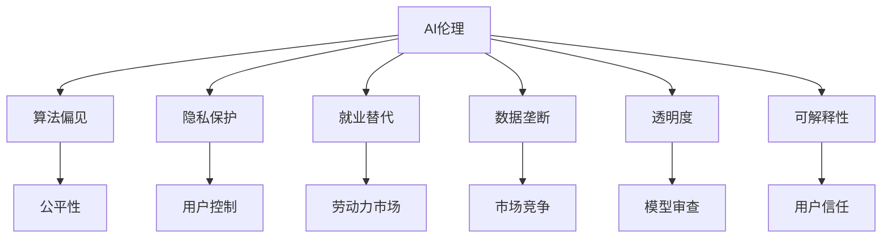

                 

# AI伦理：在技术进步与社会责任间寻找平衡

## 1. 背景介绍

人工智能（AI）技术的发展正在快速重塑现代社会，从医疗、教育、金融到交通、制造，AI的触角几乎遍及每一个领域。然而，技术的迅猛发展也伴随着诸多伦理问题，如算法偏见、隐私泄露、就业替代、数据垄断等。如何在推动技术进步的同时，确保社会公平、公正、安全，是当下社会各界必须面对的重要课题。本文将围绕AI伦理的核心概念，探讨技术进步与社会责任之间的平衡问题。

## 2. 核心概念与联系

### 2.1 核心概念概述

为更好地理解AI伦理，首先需要梳理几个核心概念：

- **AI伦理**：涉及AI技术应用中应遵循的道德准则，确保技术发展符合人类的价值观和社会规范。
- **算法偏见**：指AI模型在训练和应用过程中，由于数据偏差、设计失误等原因，导致对特定人群、性别、种族等产生不公平的输出。
- **隐私保护**：在AI应用中，对个人数据的收集、存储、使用等过程进行合理规范，保护用户隐私不受侵害。
- **就业替代**：AI技术的广泛应用可能替代大量传统岗位，引发就业结构的变化和劳动力的再分配问题。
- **数据垄断**：大型科技公司通过大数据和算法优势，形成市场垄断，可能对竞争环境和社会公正造成影响。
- **透明度**：AI模型的决策过程应尽可能透明，用户和监管者能够理解和监督模型的行为。
- **可解释性**：AI模型应具备一定的可解释性，用户和监管者能够理解模型的输出和决策依据。

这些概念相互关联，共同构成了AI伦理的复杂体系。

### 2.2 核心概念原理和架构的 Mermaid 流程图



这个流程图展示了AI伦理涉及的各个核心概念及其相互关系。

## 3. 核心算法原理 & 具体操作步骤

### 3.1 算法原理概述

AI伦理的实现和优化涉及多个层次，包括算法设计、数据治理、应用伦理等。本文将重点探讨算法设计和数据治理中如何体现伦理原则。

### 3.2 算法步骤详解

1. **数据准备**：收集多样化的数据集，确保数据覆盖不同群体和情境，减少算法偏见。
2. **模型设计**：在模型设计和训练过程中，引入公平性约束，如平衡分类、公平性约束等。
3. **算法验证**：通过实验和测试，评估模型在不同数据分布上的公平性和鲁棒性。
4. **数据保护**：在数据收集和使用过程中，采取匿名化、去标识化等措施，保护用户隐私。
5. **透明度建设**：建立模型决策的透明度机制，确保用户和监管者能够理解和监督模型行为。

### 3.3 算法优缺点

**优点**：
- **提高公平性**：通过算法设计和验证，减少算法偏见，提高模型公平性。
- **增强隐私保护**：通过数据保护措施，保护用户隐私。
- **促进社会信任**：通过透明度和可解释性，增强用户和社会的信任。

**缺点**：
- **复杂度增加**：实现公平性和隐私保护可能增加模型的复杂度，影响性能。
- **成本上升**：在数据收集、模型设计和验证等方面投入更多资源。
- **技术挑战**：提高透明度和可解释性可能带来技术上的挑战。

### 3.4 算法应用领域

AI伦理的理念和实践已经广泛应用于多个领域，包括但不限于：

- **医疗领域**：确保医疗诊断和治疗决策的公平性和隐私保护。
- **教育领域**：通过公平的AI辅助教学，缩小教育资源的不平等。
- **金融领域**：在信贷评估、反欺诈等场景中，保障算法的公平性和透明性。
- **司法领域**：通过AI辅助判案，确保判决的公正性和透明性。
- **公共安全**：在监控和预测犯罪等应用中，维护社会公正和隐私权利。

## 4. 数学模型和公式 & 详细讲解 & 举例说明

### 4.1 数学模型构建

AI伦理问题的数学模型构建涉及多个方面，包括公平性约束、隐私保护、透明度评估等。以公平性约束为例，常见的公平性模型包括平衡分类模型和公平性约束模型。

### 4.2 公式推导过程

以平衡分类模型为例，假设有两个类别A和B，模型在训练集上的准确率为$\hat{p}_A$，在测试集上的准确率为$\hat{p}_B$。设平衡标签的数目为$n_A$，不平衡标签的数目为$n_B$，则平衡分类模型可表示为：

$$
\hat{p}_B = \frac{n_A}{n_A+n_B}
$$

对于公平性约束模型，常见的公平性指标包括平均差异（Fairness）和统计公平性（Statistical Parity）。

### 4.3 案例分析与讲解

在医疗领域，一个公平的AI诊断模型需要确保不同种族、性别、年龄等群体的诊断准确性差异不大。通过引入平衡分类模型和公平性约束，可以确保模型在处理不同群体的数据时，输出结果的公平性。

## 5. 项目实践：代码实例和详细解释说明

### 5.1 开发环境搭建

搭建AI伦理项目开发环境，需要安装Python、Pandas、Scikit-learn、TensorFlow等工具包。具体步骤包括：

1. 安装Python环境，选择3.7或以上版本。
2. 安装Pandas库，用于数据处理和分析。
3. 安装Scikit-learn库，用于模型训练和评估。
4. 安装TensorFlow或PyTorch库，用于构建深度学习模型。
5. 配置环境变量，确保各工具包正确导入。

### 5.2 源代码详细实现

以下是一个简单的Python代码示例，用于训练一个平衡分类模型：

```python
from sklearn.model_selection import train_test_split
from sklearn.linear_model import LogisticRegression
from sklearn.metrics import accuracy_score
from sklearn.datasets import make_classification

# 生成平衡分类数据
X, y = make_classification(n_samples=1000, n_features=10, n_informative=10, n_redundant=0, n_repeated=0, n_classes=2, weights=[0.5, 0.5], random_state=42)

# 划分训练集和测试集
X_train, X_test, y_train, y_test = train_test_split(X, y, test_size=0.2, random_state=42)

# 训练平衡分类模型
clf = LogisticRegression(solver='liblinear', class_weight='balanced')
clf.fit(X_train, y_train)

# 评估模型性能
y_pred = clf.predict(X_test)
accuracy = accuracy_score(y_test, y_pred)
print("Accuracy: ", accuracy)
```

### 5.3 代码解读与分析

- `make_classification`函数用于生成平衡分类数据，其中`n_classes`参数指定类别数目，`weights`参数指定各类别样本的比例。
- `train_test_split`函数用于划分训练集和测试集，`test_size`参数指定测试集的比例。
- `LogisticRegression`模型使用`liblinear`求解器，`class_weight`参数指定类别权重，确保模型在处理不同类别时公平性。
- `accuracy_score`函数计算模型在测试集上的准确率。

### 5.4 运行结果展示

运行上述代码，输出结果为模型的准确率。由于使用了平衡分类模型，模型的准确率应当接近0.5，说明模型对不同类别的预测公平性较好。

## 6. 实际应用场景

### 6.1 医疗领域

在医疗领域，AI伦理的实践尤为重要。AI辅助诊断和治疗需要确保算法在不同种族、性别、年龄等群体中的公平性和隐私保护。例如，基于AI的癌症筛查系统需要确保不同种族、性别患者的数据得到公平处理，同时保护患者隐私不被泄露。

### 6.2 教育领域

AI在教育中的应用也面临着伦理问题。例如，AI辅助个性化教学需要确保算法对不同学习水平、文化背景的学生公平，同时保护学生的隐私数据。通过合理的数据治理和算法设计，可以确保AI在教育中的公平性和隐私保护。

### 6.3 金融领域

金融领域中的AI应用，如信用评分、反欺诈检测等，需要确保算法的公平性和透明性。例如，在信用评分模型中，需要确保不同性别、种族、年龄等群体的评分差异不大，同时保护用户隐私数据不被滥用。

## 7. 工具和资源推荐

### 7.1 学习资源推荐

1. **《人工智能伦理：道德、社会与技术》**：该书详细讨论了AI伦理的核心问题，包括算法偏见、隐私保护、就业替代等，是理解AI伦理的重要读物。
2. **《公平与透明AI：理论与实践》**：该书介绍了多种公平性约束和透明性评估方法，是深入研究AI伦理的技术指南。
3. **Google AI 伦理指南**：Google提供的AI伦理指南，涵盖了数据收集、模型训练、应用部署等各个环节的伦理原则。
4. **欧盟《通用数据保护条例（GDPR）》**：作为全球数据保护的标杆，GDPR提供了全面的隐私保护和数据治理规范。

### 7.2 开发工具推荐

1. **Python**：Python是AI开发的主要编程语言，拥有丰富的科学计算和机器学习库。
2. **Pandas**：用于数据处理和分析，提供了高效的数据结构和操作接口。
3. **Scikit-learn**：用于机器学习模型的训练和评估，提供了丰富的公平性约束和模型评估方法。
4. **TensorFlow**：用于深度学习模型的构建和训练，支持GPU加速和分布式计算。
5. **Jupyter Notebook**：用于数据探索、模型训练和结果展示，支持代码块和图表的交互式显示。

### 7.3 相关论文推荐

1. **《公平性、透明性与可解释性在AI伦理中的应用》**：探讨了公平性、透明性和可解释性在AI伦理中的重要性和实现方法。
2. **《算法偏见及其对公平性的影响》**：研究了算法偏见对公平性的影响，并提出了多种减少算法偏见的方法。
3. **《隐私保护技术在AI中的应用》**：介绍了隐私保护技术的基本概念和应用场景，如差分隐私、去标识化等。

## 8. 总结：未来发展趋势与挑战

### 8.1 研究成果总结

AI伦理的研究已经取得了一定进展，但仍有诸多挑战需要克服。目前的研究重点包括算法偏见、隐私保护、透明性、可解释性等，未来需要在这些方面取得更多突破。

### 8.2 未来发展趋势

1. **多领域伦理标准**：未来需要构建跨领域的AI伦理标准，确保不同应用场景中的伦理规范一致性和适用性。
2. **自动化伦理治理**：通过AI技术自动监测和评估伦理问题，提升伦理治理的效率和准确性。
3. **多方协同治理**：建立政府、企业、公众等多方协同的AI伦理治理机制，共同推动AI伦理的发展。
4. **伦理教育和培训**：加强AI伦理教育，提升公众和从业人员的伦理意识和技能。

### 8.3 面临的挑战

1. **算法偏见难以彻底消除**：尽管已有多种方法减少算法偏见，但仍难以完全消除，特别是在数据不平衡和模型复杂度高的情况下。
2. **隐私保护技术存在漏洞**：当前的隐私保护技术如差分隐私、去标识化等，虽然有效，但也存在数据泄露和安全漏洞的风险。
3. **透明性和可解释性技术不成熟**：透明性和可解释性技术尚处于初期阶段，需要更多的研究和实践来完善。

### 8.4 研究展望

未来需要在以下方向进行更多研究：

1. **公平性约束模型优化**：研究更有效的公平性约束模型，提高算法的公平性。
2. **隐私保护技术创新**：探索新的隐私保护技术，增强数据保护的力度和效果。
3. **透明性和可解释性提升**：开发更易于理解和解释的AI模型，提升用户的信任度和满意度。
4. **伦理治理机制完善**：建立完善的AI伦理治理机制，确保AI应用符合社会规范和伦理标准。

## 9. 附录：常见问题与解答

**Q1：AI伦理问题的根源是什么？**

A: AI伦理问题的根源在于AI技术的应用和发展过程中，存在诸多不确定性和风险，如算法偏见、隐私泄露、就业替代等。这些问题需要从技术、法律、伦理等多个角度进行综合治理。

**Q2：AI伦理如何解决算法偏见问题？**

A: 解决算法偏见问题需要从数据准备、模型设计、训练验证等多个环节入手。例如，使用平衡分类模型和公平性约束，确保不同群体的数据得到公平处理；引入对抗性训练和差分隐私技术，减少数据偏差对算法的影响。

**Q3：AI伦理如何确保隐私保护？**

A: 在数据收集、存储、使用等环节，采用匿名化、去标识化、差分隐私等技术，确保用户隐私不被滥用。同时，建立严格的隐私保护政策，确保用户知情权和选择权。

**Q4：AI伦理如何提升透明度和可解释性？**

A: 建立透明的数据治理机制，确保用户和监管者能够理解模型的训练过程和决策依据。开发可解释性强的模型，如决策树、线性回归等，减少模型的“黑箱”效应。

**Q5：AI伦理的未来发展方向是什么？**

A: AI伦理的未来发展方向包括建立多领域伦理标准、自动化伦理治理、多方协同治理、AI伦理教育和培训等。通过多方协同努力，提升AI应用的公平性、透明性和可解释性，确保AI技术的发展符合社会利益和伦理标准。

---

作者：禅与计算机程序设计艺术 / Zen and the Art of Computer Programming

