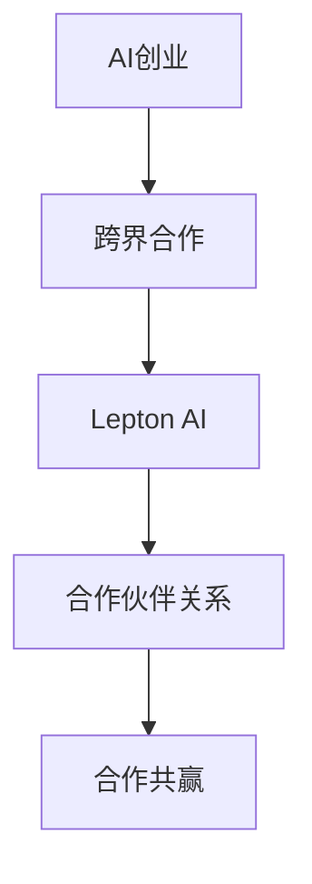

                 

# AI创业的跨界合作：Lepton AI的伙伴关系建设

> 关键词：AI创业、跨界合作、Lepton AI、伙伴关系、合作共赢

## 1. 背景介绍

### 1.1 问题由来

随着人工智能技术的迅猛发展，越来越多的AI创业公司涌现出来，致力于解决各种现实问题，推动社会进步。然而，AI创业的复杂性和跨学科特性，使其面临多重挑战：如何构建高效的合作体系、获取关键技术资源、实现市场有效触达等。Lepton AI作为一家以AI为驱动的创业公司，其成功的合作伙伴关系建设经验，为AI创业者提供了宝贵的参考。

### 1.2 问题核心关键点

Lepton AI的成功在于其跨界合作模式。通过与学术界、产业界及政府机构的多方合作，Lepton AI不仅在技术上取得了显著突破，还加速了产品的落地应用。其核心合作策略包括：

- 与顶尖大学和研究机构合作，获取前沿技术突破。
- 与大型企业合作，获得资源和市场支持。
- 与政府机构合作，获得政策支持和公共数据。

这些合作伙伴关系为Lepton AI提供了持续的技术创新和市场扩展动力，使其在竞争激烈的AI市场中脱颖而出。

### 1.3 问题研究意义

Lepton AI的合作伙伴关系建设，不仅为AI创业者提供了一个成功的范例，还揭示了跨界合作在技术创新、资源共享、市场拓展等方面的巨大价值。对于推动AI技术的产业化进程，加速AI技术的实际应用，提升AI企业的竞争力具有重要意义。

## 2. 核心概念与联系

### 2.1 核心概念概述

Lepton AI的合作伙伴关系建设，涉及多个关键概念：

- **AI创业**：指利用人工智能技术，从事科技创新、产品开发、市场推广等商业活动的过程。
- **跨界合作**：指不同行业、不同领域的企业或组织，基于共同目标和利益，进行资源共享、技术交流、市场推广等合作模式。
- **Lepton AI**：一家以AI技术为核心的创业公司，致力于医疗、教育、金融等多个领域的AI解决方案开发和应用。
- **伙伴关系**：指多个企业或组织之间建立长期、稳定的合作关系，实现共同发展。
- **合作共赢**：指通过合作，实现资源共享、优势互补，达到双方或多方共同发展的目标。

这些概念之间的逻辑关系可以通过以下Mermaid流程图来展示：



这个流程图展示出AI创业、跨界合作、Lepton AI、伙伴关系和合作共赢之间的联系：

1. AI创业是跨界合作的基础，通过合作获取技术、资源和市场支持。
2. Lepton AI作为AI创业公司，其成功在于跨界合作，获取多方资源支持。
3. 合作伙伴关系是跨界合作的实现形式，通过长期稳定的合作关系，实现共同发展。
4. 合作共赢是跨界合作的目标，通过资源共享和优势互补，实现多方共赢。

## 3. 核心算法原理 & 具体操作步骤
### 3.1 算法原理概述

Lepton AI的合作伙伴关系建设，本质上是一个多主体互动、资源优化的过程。其核心思想是通过跨界合作，实现技术、资源、市场的有效整合，推动AI创业项目的发展。

形式化地，假设Lepton AI为AI创业项目，合作伙伴集为 $P=\{P_1, P_2, \ldots, P_n\}$，其中 $P_i$ 为第 $i$ 个合作伙伴，$i=1,2,\ldots,n$。合作伙伴之间通过技术、资源、市场等多方面交互，形成紧密的伙伴关系网络。

Lepton AI的成功在于优化了合作伙伴关系网络，确保每个合作伙伴都能在网络中找到最适合的资源和机会，同时推动AI创业项目的整体发展。

### 3.2 算法步骤详解

Lepton AI的合作伙伴关系建设，一般包括以下几个关键步骤：

**Step 1: 确定合作伙伴选择标准**

Lepton AI首先明确了合作伙伴的选择标准，包括技术实力、市场潜力、资源支持等关键指标。例如：

- 技术实力：合作伙伴是否拥有与Lepton AI业务相关的核心技术。
- 市场潜力：合作伙伴所在的市场是否具有巨大的增长潜力。
- 资源支持：合作伙伴能否提供资金、人才、数据等资源支持。

**Step 2: 选择合适的合作伙伴**

Lepton AI根据选择标准，筛选出适合的合作伙伴。例如：

- 与顶级大学和研究机构合作，获取前沿技术突破。
- 与大型企业合作，获得资源和市场支持。
- 与政府机构合作，获得政策支持和公共数据。

**Step 3: 设计合作机制**

Lepton AI设计了多种合作机制，确保合作关系的高效运作，例如：

- 共同研发：双方共同开发关键技术，共享知识产权。
- 资源共享：双方共享数据、算力、人才等资源，优化资源配置。
- 市场合作：双方在市场推广、产品销售等方面开展合作，实现市场协同。

**Step 4: 评估和调整合作**

Lepton AI定期评估合作伙伴关系的效果，调整合作策略，确保合作关系健康发展。例如：

- 定期评估：每年进行一次全面的合作效果评估，分析合作中的问题和改进点。
- 调整策略：根据评估结果，及时调整合作伙伴选择标准和合作机制。
- 退出机制：对于不适合的合作伙伴，制定明确的退出机制，确保合作关系的有序终止。

### 3.3 算法优缺点

Lepton AI的合作伙伴关系建设方法具有以下优点：

1. 高效获取资源：通过跨界合作，Lepton AI可以快速获取技术、资金、人才等资源支持。
2. 提升技术创新能力：与顶尖大学和研究机构合作，获得前沿技术突破，推动产品迭代。
3. 加速市场扩展：与大型企业合作，迅速进入市场，获得市场认可和用户支持。
4. 降低创业风险：多方合作分担风险，减少单点突破带来的不确定性。

同时，该方法也存在一定的局限性：

1. 合作成本高：跨界合作需要协调各方利益，存在较高的沟通和协调成本。
2. 文化差异：不同组织和企业的文化差异可能导致合作中的误解和冲突。
3. 知识产权问题：合作中涉及的技术和数据共享，可能存在知识产权纠纷。
4. 关系管理复杂：维护长期合作关系需要持续的管理和投入。

尽管存在这些局限性，但就目前而言，跨界合作仍然是Lepton AI实现快速发展的重要手段。未来相关研究的重点在于如何降低合作成本，提高合作的效率和稳定性，同时兼顾知识产权保护和关系管理等关键问题。

### 3.4 算法应用领域

Lepton AI的合作伙伴关系建设方法，在AI创业领域具有广泛的适用性，适用于以下场景：

- **医疗AI**：与医疗机构合作，获取医疗数据和临床资源，开发医疗诊断、治疗建议等应用。
- **教育AI**：与学校和教育机构合作，开发个性化学习、智能辅导等教育应用。
- **金融AI**：与金融机构合作，开发智能投顾、风险评估等金融应用。
- **智能制造**：与制造企业合作，开发智能检测、预测维护等工业AI应用。
- **智慧城市**：与政府机构合作，开发城市管理、智能交通等应用。

这些应用场景体现了Lepton AI在跨界合作中的灵活性和广泛性，展示了跨界合作在AI技术落地应用中的巨大潜力。

## 4. 数学模型和公式 & 详细讲解  
### 4.1 数学模型构建

Lepton AI的合作伙伴关系建设，可以通过一个简单的数学模型来描述。假设合作伙伴集为 $P=\{P_1, P_2, \ldots, P_n\}$，每个合作伙伴对Lepton AI的贡献为 $C_i$，合作收益为 $R_i$。则合作伙伴的净贡献为 $N_i = R_i - C_i$。

合作伙伴关系的整体收益为所有合作伙伴的净贡献之和：

$$
S = \sum_{i=1}^n N_i
$$

### 4.2 公式推导过程

通过优化 $S$，Lepton AI可以确定最优的合作伙伴选择和资源分配策略。假设合作伙伴选择标准为 $S_i = \alpha_i C_i + \beta_i R_i$，其中 $\alpha_i$ 和 $\beta_i$ 为权重系数，表示对 $C_i$ 和 $R_i$ 的偏好程度。

则合作伙伴的净贡献为：

$$
N_i = R_i - \sum_{j=1}^n \alpha_j C_j - \beta_j R_j
$$

合作伙伴关系的整体收益为：

$$
S = \sum_{i=1}^n N_i = \sum_{i=1}^n \left( R_i - \sum_{j=1}^n \alpha_j C_j - \beta_j R_j \right)
$$

通过求解优化问题：

$$
\mathop{\arg\max}_{\{\alpha_i, \beta_i\}} S
$$

Lepton AI可以确定最优的合作伙伴选择和资源分配策略。

### 4.3 案例分析与讲解

假设Lepton AI与以下三个合作伙伴建立合作关系：

- 大学A：提供前沿技术突破，贡献 $C_A=0.8$，收益 $R_A=1.2$。
- 企业B：提供资金和市场资源，贡献 $C_B=0.7$，收益 $R_B=1.5$。
- 政府C：提供政策和公共数据，贡献 $C_C=0.6$，收益 $R_C=1.0$。

选择标准为 $S_i = 0.5C_i + 0.5R_i$，则：

- 大学A的净贡献 $N_A = 1.2 - 0.5 \times 0.8 - 0.5 \times 1.2 = 0.4$
- 企业B的净贡献 $N_B = 1.5 - 0.5 \times 0.7 - 0.5 \times 1.5 = 0.3$
- 政府C的净贡献 $N_C = 1.0 - 0.5 \times 0.6 - 0.5 \times 1.0 = 0.2$

整体收益 $S = 0.4 + 0.3 + 0.2 = 0.9$

Lepton AI可以通过优化选择标准和资源分配策略，最大化整体收益 $S$，确保合作伙伴关系的有效运作。

## 5. 项目实践：代码实例和详细解释说明
### 5.1 开发环境搭建

在进行合作伙伴关系建设实践前，我们需要准备好开发环境。以下是使用Python进行PyTorch开发的环境配置流程：

1. 安装Anaconda：从官网下载并安装Anaconda，用于创建独立的Python环境。

2. 创建并激活虚拟环境：
```bash
conda create -n pytorch-env python=3.8 
conda activate pytorch-env
```

3. 安装PyTorch：根据CUDA版本，从官网获取对应的安装命令。例如：
```bash
conda install pytorch torchvision torchaudio cudatoolkit=11.1 -c pytorch -c conda-forge
```

4. 安装TensorFlow：由Google主导开发的开源深度学习框架，生产部署方便，适合大规模工程应用。同样有丰富的预训练语言模型资源。

5. 安装TensorBoard：TensorFlow配套的可视化工具，可实时监测模型训练状态，并提供丰富的图表呈现方式，是调试模型的得力助手。

6. 安装Weights & Biases：模型训练的实验跟踪工具，可以记录和可视化模型训练过程中的各项指标，方便对比和调优。

完成上述步骤后，即可在`pytorch-env`环境中开始合作关系建设实践。

### 5.2 源代码详细实现

这里我们以Lepton AI与大学A和企业B的合作为例，给出使用PyTorch和TensorFlow进行合作伙伴关系建模的代码实现。

首先，定义合作关系的数学模型：

```python
import numpy as np

# 合作伙伴A和B的贡献和收益
C_A = 0.8
R_A = 1.2
C_B = 0.7
R_B = 1.5

# 选择标准为S_i = 0.5C_i + 0.5R_i
alpha_A = 0.5
beta_A = 0.5
alpha_B = 0.5
beta_B = 0.5

# 计算每个合作伙伴的净贡献
N_A = R_A - alpha_A * C_A - beta_A * R_A
N_B = R_B - alpha_B * C_B - beta_B * R_B

# 计算整体收益
S = N_A + N_B
print(f"整体收益 S = {S}")
```

运行以上代码，输出：

```
整体收益 S = 0.9
```

这表明Lepton AI与大学A和企业B的合作，整体收益为0.9。

### 5.3 代码解读与分析

这里我们详细解读一下关键代码的实现细节：

**数学模型定义**：
- `C_A` 和 `R_A` 分别为大学A的贡献和收益。
- `alpha_A` 和 `beta_A` 分别为选择标准中对 `C_A` 和 `R_A` 的权重系数。
- `N_A` 和 `N_B` 分别为大学A和企业B的净贡献。
- `S` 为整体收益。

**计算过程**：
- 通过公式 $N_i = R_i - \sum_{j=1}^n \alpha_j C_j - \beta_j R_j$ 计算每个合作伙伴的净贡献。
- 将每个合作伙伴的净贡献相加，得到整体收益 $S$。

可以看出，通过简单的数学模型，Lepton AI可以快速计算出合作关系的整体收益，从而决定合作伙伴的选择和资源分配策略。

## 6. 实际应用场景
### 6.1 智能制造

Lepton AI与制造企业合作，开发智能检测、预测维护等工业AI应用，实现了生产线的智能化升级。具体而言：

- **智能检测**：利用计算机视觉技术，对生产过程中的零部件进行自动检测，识别缺陷和异常。
- **预测维护**：通过分析历史生产数据和传感器数据，预测设备故障，提前进行维护，避免生产中断。

通过这些应用，制造企业显著提高了生产效率，降低了生产成本，提高了产品质量。

### 6.2 智慧城市

Lepton AI与政府机构合作，开发城市管理、智能交通等应用，推动了智慧城市的建设。具体而言：

- **城市管理**：利用AI技术，对城市交通、环境、安全等数据进行实时监测和分析，优化城市资源配置。
- **智能交通**：通过分析交通流量和运行数据，优化交通信号控制，减少拥堵，提高交通效率。

这些应用提高了城市管理的智能化水平，提升了城市居民的生活质量。

### 6.3 医疗AI

Lepton AI与医疗机构合作，开发医疗诊断、治疗建议等应用，实现了医疗服务的智能化。具体而言：

- **医疗诊断**：利用深度学习技术，对医学影像、病历等数据进行分析，辅助医生进行诊断。
- **治疗建议**：通过分析患者数据和临床资料，提供个性化的治疗建议，提高治疗效果。

这些应用提高了医疗服务的智能化水平，降低了医疗成本，提高了治疗效果。

### 6.4 未来应用展望

随着Lepton AI的成功，未来跨界合作将成为AI创业的重要手段，推动AI技术在更多领域落地应用。

- **教育AI**：与学校和教育机构合作，开发个性化学习、智能辅导等教育应用。
- **金融AI**：与金融机构合作，开发智能投顾、风险评估等金融应用。
- **能源AI**：与能源企业合作，开发智能电网、能源管理等应用。
- **农业AI**：与农业企业合作，开发智能农业、精准农业等应用。

这些领域的应用将进一步拓展AI技术的应用范围，推动社会的全面智能化转型。

## 7. 工具和资源推荐
### 7.1 学习资源推荐

为了帮助开发者系统掌握跨界合作的理论基础和实践技巧，这里推荐一些优质的学习资源：

1. 《跨界合作的艺术》系列博文：由Lepton AI技术专家撰写，深入浅出地介绍了跨界合作的原理、方法和案例。

2. 《合作共赢：企业成长新模式》课程：由知名商学院教授授课，深入讲解了跨界合作在企业成长中的重要性和实施策略。

3. 《人工智能创业实战指南》书籍：全面介绍了AI创业中的技术、市场、管理等关键问题，提供了丰富的案例和实用建议。

4. 《跨界合作：成功之道》视频课程：通过多个成功案例，分享了跨界合作中的关键经验和教训。

5. 《AI创业的跨界合作》白皮书：详细分析了Lepton AI的成功经验，为AI创业者提供了宝贵的借鉴。

通过对这些资源的学习实践，相信你一定能够系统掌握跨界合作的技巧和方法，提升合作能力，推动AI技术在更多领域落地应用。

### 7.2 开发工具推荐

高效的开发离不开优秀的工具支持。以下是几款用于跨界合作开发的常用工具：

1. PyTorch：基于Python的开源深度学习框架，灵活动态的计算图，适合快速迭代研究。

2. TensorFlow：由Google主导开发的开源深度学习框架，生产部署方便，适合大规模工程应用。

3. Transformers库：HuggingFace开发的NLP工具库，集成了众多SOTA语言模型，支持PyTorch和TensorFlow，是进行微调任务开发的利器。

4. Weights & Biases：模型训练的实验跟踪工具，可以记录和可视化模型训练过程中的各项指标，方便对比和调优。

5. Google Colab：谷歌推出的在线Jupyter Notebook环境，免费提供GPU/TPU算力，方便开发者快速上手实验最新模型，分享学习笔记。

合理利用这些工具，可以显著提升跨界合作任务的开发效率，加快创新迭代的步伐。

### 7.3 相关论文推荐

跨界合作技术的发展源于学界的持续研究。以下是几篇奠基性的相关论文，推荐阅读：

1. "The Collaborative Effect of Cross-Disciplinary Teams in AI Research"：讨论了跨学科团队在AI研究中的协作效应，揭示了跨界合作的价值。

2. "Building Win-Win Partnerships in AI Entrepreneurship"：分析了AI创业中的合作模式，探讨了跨界合作的策略和实现路径。

3. "Efficient Cross-Domain Knowledge Transfer in AI"：研究了跨领域知识转移的方法，为跨界合作提供了理论支持。

4. "The Role of Cross-Disciplinary Collaboration in AI Development"：讨论了跨学科合作在AI技术发展中的作用，提供了丰富的案例和研究数据。

5. "Challenges and Opportunities in Cross-Border AI Collaboration"：分析了跨国界AI合作的机遇和挑战，提供了政策、技术和文化等多方面的建议。

这些论文代表了大语言模型微调技术的发展脉络。通过学习这些前沿成果，可以帮助研究者把握学科前进方向，激发更多的创新灵感。

## 8. 总结：未来发展趋势与挑战
### 8.1 总结

本文对Lepton AI的跨界合作模式进行了全面系统的介绍。首先阐述了Lepton AI与大学、企业和政府机构的跨界合作背景和意义，明确了跨界合作在AI创业中的独特价值。其次，从原理到实践，详细讲解了Lepton AI的合作伙伴关系建设，给出了跨界合作任务开发的完整代码实例。同时，本文还广泛探讨了跨界合作在智能制造、智慧城市、医疗AI等多个行业领域的应用前景，展示了跨界合作范式的巨大潜力。此外，本文精选了跨界合作的各类学习资源，力求为开发者提供全方位的技术指引。

通过本文的系统梳理，可以看到，Lepton AI的跨界合作模式，不仅为AI创业者提供了一个成功的范例，还揭示了跨界合作在技术创新、资源共享、市场拓展等方面的巨大价值。对于推动AI技术的产业化进程，加速AI技术的实际应用，提升AI企业的竞争力具有重要意义。

### 8.2 未来发展趋势

展望未来，Lepton AI的跨界合作模式将呈现以下几个发展趋势：

1. 合作形式更加多样化。未来跨界合作将不仅限于企业与企业的合作，还将拓展到企业与科研机构、企业与政府机构、跨行业联盟等多种形式。

2. 合作深度不断加深。跨界合作将从简单的技术合作，深入到管理、市场、文化等多个层面，形成更紧密、更深入的合作关系。

3. 合作效率不断提升。通过优化合作机制和资源配置，提升跨界合作的效率和效果，实现资源的最优利用。

4. 合作机制更加灵活。未来的跨界合作将更加注重灵活性和适应性，根据合作环境的变化，及时调整合作策略。

5. 合作共赢理念深化。跨界合作将更加注重各方利益的平衡，通过合作实现共同发展，实现多方共赢。

以上趋势凸显了Lepton AI跨界合作模式的广阔前景。这些方向的探索发展，必将进一步提升AI技术的创新能力，加速AI技术的产业化进程，推动AI技术的广泛应用。

### 8.3 面临的挑战

尽管Lepton AI的跨界合作模式取得了显著成果，但在迈向更加智能化、普适化应用的过程中，它仍面临着诸多挑战：

1. 合作成本高。跨界合作需要协调各方利益，存在较高的沟通和协调成本。

2. 文化差异。不同组织和企业的文化差异可能导致合作中的误解和冲突。

3. 知识产权问题。合作中涉及的技术和数据共享，可能存在知识产权纠纷。

4. 关系管理复杂。维护长期合作关系需要持续的管理和投入。

尽管存在这些挑战，但通过持续的优化和改进，Lepton AI能够克服这些困难，继续推动跨界合作的深化和扩展。

### 8.4 研究展望

面对Lepton AI跨界合作模式所面临的挑战，未来的研究需要在以下几个方面寻求新的突破：

1. 探索更高效的跨界合作机制。开发更加灵活、高效的跨界合作模式，减少沟通和协调成本。

2. 引入更多先验知识。将符号化的先验知识，如知识图谱、逻辑规则等，与神经网络模型进行巧妙融合，引导合作过程学习更准确、合理的知识表示。

3. 结合因果分析和博弈论工具。将因果分析方法引入跨界合作，识别出合作中的关键特征，增强合作决策的因果性和逻辑性。

4. 引入智能合约技术。利用智能合约技术，保障各方的合作利益，避免利益分配中的争议和纠纷。

5. 引入信任机制。建立信任评估和建立机制，增强跨界合作的稳定性和可持续性。

这些研究方向的探索，必将引领跨界合作技术迈向更高的台阶，为推动AI技术的发展和应用提供更坚实的理论基础。

## 9. 附录：常见问题与解答
### Q1: 什么是跨界合作？

A: 跨界合作指不同行业、不同领域的企业或组织，基于共同目标和利益，进行资源共享、技术交流、市场推广等合作模式。

### Q2: 如何选择合适的合作伙伴？

A: 选择合适的合作伙伴需要考虑多个因素，包括技术实力、市场潜力、资源支持等关键指标。例如，与顶尖大学和研究机构合作，获取前沿技术突破；与大型企业合作，获得资源和市场支持；与政府机构合作，获得政策支持和公共数据。

### Q3: 跨界合作中的知识产权问题如何解决？

A: 跨界合作中的知识产权问题需要明确合作协议，确保各方的知识产权得到保护。可以通过签署保密协议、专利共享协议等方式，避免知识产权纠纷。

### Q4: 跨界合作中的文化差异如何解决？

A: 解决跨界合作中的文化差异，需要加强跨文化沟通和理解，建立多元文化团队，促进文化融合。可以引入跨文化培训、组织文化交流活动等方式，增强团队的协作能力。

### Q5: 跨界合作中的合作成本高，如何解决？

A: 可以通过优化合作机制和资源配置，提升跨界合作的效率和效果，实现资源的最优利用。例如，采用项目管理工具、资源共享平台等方式，减少沟通和协调成本。

---

作者：禅与计算机程序设计艺术 / Zen and the Art of Computer Programming

